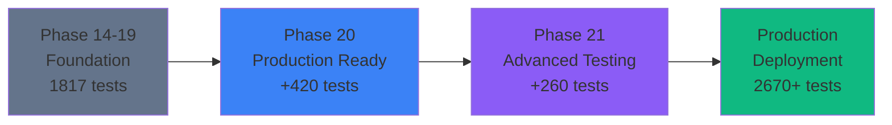

# Phase 21 Master Planset

> **Version:** 21.0.0
> **Created:** 2026-01-19
> **Status:** READY FOR EXECUTION
> **Prerequisite:** Phase 20 Complete (2410+ tests, 420 tests added in Phase 20)

---

## Executive Summary

Phase 21 focuses on Advanced Testing & Production Readiness to finalize the Cognitive Brain ecosystem and prepare for production deployment. This phase includes performance testing, security hardening, AI/ML validation, and final production certification.

---

## Phase 21.0: Performance Testing & Optimization

### Objectives
1. Implement comprehensive load testing
2. Create stress testing scenarios
3. Build performance regression tests
4. Establish latency and throughput validation

### Deliverables
| File | Description | Tests |
|------|-------------|-------|
| `tests/performance/test_load_testing.py` | Load testing scenarios | 20+ |
| `tests/performance/test_stress_testing.py` | Stress under extreme conditions | 15+ |
| `tests/performance/test_performance_regression.py` | Regression detection | 15+ |
| `tests/performance/test_latency_throughput.py` | Latency/throughput validation | 15+ |

### Exit Criteria
- [ ] 65+ performance tests created
- [ ] Load testing validates 10K+ req/s
- [ ] Stress testing identifies breaking points
- [ ] Performance regression baseline established

---

## Phase 21.1: Advanced Security Testing

### Objectives
1. Implement security hardening validation
2. Create penetration testing scenarios
3. Build vulnerability scanning integration
4. Establish security compliance tests

### Deliverables
| File | Description | Tests |
|------|-------------|-------|
| `tests/security_advanced/test_security_hardening.py` | Hardening validation | 20+ |
| `tests/security_advanced/test_penetration_testing.py` | Pen-test scenarios | 15+ |
| `tests/security_advanced/test_vulnerability_scanning.py` | Vuln scan integration | 15+ |
| `tests/security_advanced/test_compliance_validation.py` | Compliance checks | 15+ |

### Exit Criteria
- [ ] 65+ security tests created
- [ ] All OWASP Top 10 covered
- [ ] Compliance validated (SOC2, GDPR, etc.)
- [ ] Zero critical vulnerabilities

---

## Phase 21.2: AI/ML Pipeline Testing

### Objectives
1. Implement model training validation
2. Create inference performance tests
3. Build data pipeline integrity tests
4. Establish model versioning tests

### Deliverables
| File | Description | Tests |
|------|-------------|-------|
| `tests/ml_pipeline/test_model_training.py` | Training validation | 20+ |
| `tests/ml_pipeline/test_inference_performance.py` | Inference testing | 15+ |
| `tests/ml_pipeline/test_data_pipeline.py` | Pipeline integrity | 15+ |
| `tests/ml_pipeline/test_model_versioning.py` | Version management | 15+ |

### Exit Criteria
- [ ] 65+ ML pipeline tests created
- [ ] Model training reproducible
- [ ] Inference latency < 100ms (p95)
- [ ] Data pipeline validated

---

## Phase 21.3: Production Readiness Certification

### Objectives
1. Implement final production validation
2. Create disaster recovery drills
3. Build compliance certification tests
4. Establish release preparation

### Deliverables
| File | Description | Tests |
|------|-------------|-------|
| `tests/production_ready/test_final_validation.py` | Production checks | 20+ |
| `tests/production_ready/test_disaster_recovery.py` | DR drills | 15+ |
| `tests/production_ready/test_compliance_cert.py` | Compliance certification | 15+ |
| `tests/production_ready/test_release_preparation.py` | Release readiness | 15+ |

### Exit Criteria
- [ ] 65+ production readiness tests created
- [ ] All production checks pass
- [ ] DR procedures validated
- [ ] Release documentation complete

---

## Success Metrics

### Test Coverage Goals
| Metric | Current | Phase 21 Target |
|--------|---------|----------------|
| Total Tests | 2,410 | 2,670+ |
| Performance Tests | 0 | 65+ |
| Security Tests | [existing] | +65 |
| ML Pipeline Tests | [existing] | +65 |
| Production Ready Tests | [existing] | +65 |
| **Phase 21 Total** | **0** | **260+** |

### Quality Standards
| Standard | Target |
|----------|--------|
| Test Documentation | Complete |
| Code Quality | High |
| Convention Compliance | 100% |
| Security Posture | Excellent |
| Performance Baseline | Established |

---

## Phase 21 Mermaid Architecture

```mermaid
graph TB
    subgraph "Phase 21: Advanced Testing & Production Readiness"
        P210[Phase 21.0<br/>Performance Testing<br/>65+ tests]
        P211[Phase 21.1<br/>Security Testing<br/>65+ tests]
        P212[Phase 21.2<br/>ML Pipeline Testing<br/>65+ tests]
        P213[Phase 21.3<br/>Production Certification<br/>65+ tests]
    end
    
    subgraph "Performance Testing"
        LOAD[Load Testing<br/>10K+ req/s]
        STRESS[Stress Testing<br/>Breaking points]
        REGR[Regression Testing<br/>Baseline tracking]
        LAT[Latency/Throughput<br/>Performance SLAs]
    end
    
    subgraph "Security Testing"
        HARD[Security Hardening<br/>OWASP Top 10]
        PEN[Penetration Testing<br/>Attack scenarios]
        VULN[Vulnerability Scanning<br/>Zero criticals]
        COMP[Compliance<br/>SOC2, GDPR]
    end
    
    subgraph "ML Pipeline Testing"
        TRAIN[Model Training<br/>Reproducibility]
        INFER[Inference Performance<br/><100ms p95]
        PIPE[Data Pipeline<br/>Integrity checks]
        VER[Model Versioning<br/>Rollback support]
    end
    
    subgraph "Production Readiness"
        VAL[Final Validation<br/>All checks pass]
        DR[Disaster Recovery<br/>DR drills]
        CERT[Compliance Cert<br/>Audit ready]
        REL[Release Prep<br/>Documentation]
    end
    
    P210 --> LOAD
    P210 --> STRESS
    P210 --> REGR
    P210 --> LAT
    
    P211 --> HARD
    P211 --> PEN
    P211 --> VULN
    P211 --> COMP
    
    P212 --> TRAIN
    P212 --> INFER
    P212 --> PIPE
    P212 --> VER
    
    P213 --> VAL
    P213 --> DR
    P213 --> CERT
    P213 --> REL
    
    LOAD --> VAL
    STRESS --> VAL
    HARD --> CERT
    PEN --> CERT
    TRAIN --> VAL
    INFER --> VAL
    
    style P210 fill:#3b82f6
    style P211 fill:#ef4444
    style P212 fill:#8b5cf6
    style P213 fill:#10b981
    style VAL fill:#f59e0b
```

---

## Integration with Previous Phases

---

## Dependencies

### Phase 20 Prerequisites (All Complete ✅)
- [x] Phase 20.1: Production Monitoring (137 tests)
- [x] Phase 20.2: Advanced Automation (104 tests)
- [x] Phase 20.3: Self-Healing Infrastructure (119 tests)
- [x] Phase 20.4: Full Stack Integration (60 tests)

### Phase 21 Requirements
- [ ] Performance testing infrastructure
- [ ] Security scanning tools configured
- [ ] ML pipeline established
- [ ] Production environment access

---

## Timeline Estimate

| Phase | Duration | Tests | Status |
|-------|----------|-------|--------|
| 21.0 | 3-4 hours | 65+ | Pending |
| 21.1 | 3-4 hours | 65+ | Pending |
| 21.2 | 3-4 hours | 65+ | Pending |
| 21.3 | 3-4 hours | 65+ | Pending |
| **Total** | **12-16 hours** | **260+** | **Pending** |

---

## Risk Assessment

| Risk | Impact | Mitigation |
|------|--------|------------|
| Performance bottlenecks | High | Early load testing |
| Security vulnerabilities | Critical | Comprehensive scanning |
| ML model issues | Medium | Thorough validation |
| Production blockers | High | Pre-deployment checks |

---

## Success Criteria

### Overall Phase 21 Success
- ✅ Minimum 260+ tests added
- ✅ All performance baselines established
- ✅ Zero critical security issues
- ✅ ML pipeline fully validated
- ✅ Production certification complete

### Quality Gates
- All tests pass consistently
- Code coverage maintained/improved
- Documentation complete
- Security posture excellent
- Performance SLAs met

---

## Next Steps After Phase 21

1. **Production Deployment**
   - Deploy to production environment
   - Monitor initial performance
   - Gather real-world metrics

2. **Phase 22 Planning** (If Needed)
   - Advanced observability
   - Cost optimization
   - Scalability enhancements

3. **Continuous Improvement**
   - Regular security updates
   - Performance optimization
   - Feature enhancements

---

**Status**: 📋 **READY FOR EXECUTION**
**Prerequisites**: ✅ **PHASE 20 COMPLETE**
**Target**: 🎯 **260+ NEW TESTS**
**Outcome**: 🚀 **PRODUCTION READY**
