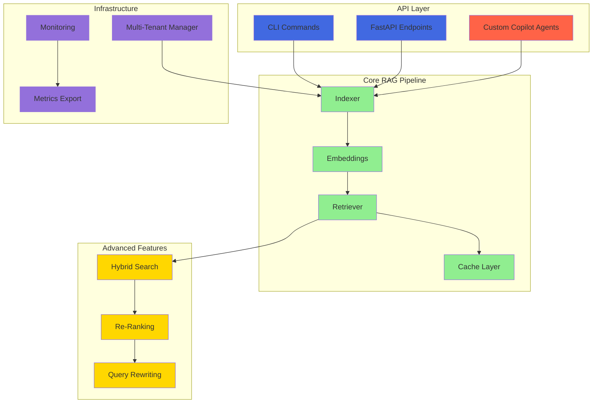

# Production RAG Pipeline Planset

**Status:** 🚀 Ready for Implementation  
**Created:** 2026-01-16  
**Purpose:** Comprehensive planset for production-ready RAG (Retrieval-Augmented Generation) pipeline  
**Target:** Production deployment with full automation capabilities

---

## Table of Contents

1. [Overview](#overview)
2. [Current State Assessment](#current-state-assessment)
3. [Tasks Without Blockers (Autonomous Execution)](#tasks-without-blockers-autonomous-execution)
4. [Tasks Requiring Human Admin Intervention](#tasks-requiring-human-admin-intervention)
5. [CLI/API Systematic Methods](#cliapi-systematic-methods)
6. [AI Agent Promptsets for Autonomous Processing](#ai-agent-promptsets-for-autonomous-processing)
7. [Production Deployment Checklist](#production-deployment-checklist)

---

## Overview

### Objective

Deploy a production-ready RAG pipeline with:
- ✅ Full CI/CD integration
- ✅ Comprehensive monitoring and observability
- ✅ Multi-tenant support
- ✅ Advanced retrieval features (hybrid search, re-ranking)
- ✅ Custom GitHub Copilot agents
- ✅ Automated testing and validation
- ✅ Performance optimization (GPU acceleration)

### Architecture



---

## Current State Assessment

### ✅ Completed Components

1. **Core RAG Infrastructure** (100%)
   - ✅ `src/codex/rag/indexer.py` - Text chunking, embedding, FAISS persistence
   - ✅ `src/codex/rag/embeddings.py` - Multiple embedding providers (local, OpenAI, cached)
   - ✅ `src/codex/rag/retriever.py` - Semantic search with provenance tracking
   - ✅ `src/codex/rag/utils.py` - Utilities (safe model loading, metadata)
   - ✅ `src/codex/rag/monitoring.py` - Comprehensive metrics tracking
   - ✅ `src/codex/rag/postprocess.py` - Output processing
   - ✅ `src/codex/rag/prompt.py` - Prompt templating

2. **Multi-Tenant Support** (100%)
   - ✅ Tenant isolation in `.codex/tenants/{tenant_id}/{index_name}`
   - ✅ `manage_tenant_indices()` function with create/update/delete/merge operations
   - ✅ `TenantOperationResult` and `IndexOperation` enums

3. **Caching Layer** (100%)
   - ✅ `CachedRetriever` with LRU cache
   - ✅ `CachedEmbeddingProvider` with disk-based caching
   - ✅ Configurable TTL and cache size

4. **Test Coverage** (Extensive)
   - ✅ Unit tests: `test_rag_indexer.py`, `test_rag_retriever.py`, `test_rag_embeddings.py`
   - ✅ Integration tests: `test_rag_tenant_management.py`, `test_rag_cached_retriever.py`
   - ✅ Error handling tests: `test_rag_error_handling.py`
   - ✅ Monitoring tests: `test_rag_monitoring.py`

5. **Documentation** (Good)
   - ✅ `docs/RAG_QUICKSTART.md` - User-facing quick start guide
   - ✅ `docs/FOLLOWUP_RAG_PRODUCTION_READINESS.md` - Production planning
   - ✅ `docs/RAG_ENHANCEMENT_PLANSETS.md` - Enhancement roadmap

### 🔄 Partially Implemented

1. **CLI Integration** (0%)
   - ❌ No dedicated RAG CLI commands yet
   - ❌ Need to add: `codex rag build`, `codex rag query`, `codex rag manage`

2. **API Layer** (0%)
   - ❌ No FastAPI endpoints yet
   - ❌ Need: REST API for index management, query, metrics

3. **Advanced Features** (0%)
   - ❌ Query rewriting (synonym expansion, spell correction)
   - ❌ Cross-encoder re-ranking
   - ❌ Hybrid search (dense + sparse BM25)
   - ❌ Hierarchical chunking

4. **GPU Acceleration** (0%)
   - ❌ faiss-gpu support
   - ❌ Automatic CPU/GPU detection and fallback

5. **Custom Copilot Agents** (0%)
   - ❌ RAG Index Manager Agent
   - ❌ Semantic Search Agent

### 📊 Metrics

| Component | Status | Coverage | Priority |
|-----------|--------|----------|----------|
| Core RAG | ✅ Complete | 90%+ | P0 |
| Multi-Tenant | ✅ Complete | 90%+ | P0 |
| Caching | ✅ Complete | 90%+ | P0 |
| CLI | ❌ Missing | 0% | P1 |
| API | ❌ Missing | 0% | P1 |
| Advanced Features | ❌ Missing | 0% | P2 |
| GPU Support | ❌ Missing | 0% | P2 |
| Custom Agents | ❌ Missing | 0% | P1 |

---

## Tasks Without Blockers (Autonomous Execution)

### Phase 1: CLI Integration (Priority: P1)

**Status:** ✅ No Blockers - Fully Autonomous

**Tasks:**
1. Create `src/codex/cli_rag.py` - RAG-specific CLI commands
2. Add commands:
   - `codex rag build` - Build index from files/directories
   - `codex rag query` - Query existing indices
   - `codex rag list` - List indices for a tenant
   - `codex rag delete` - Delete indices
   - `codex rag merge` - Merge multiple indices
   - `codex rag stats` - Show index statistics
   - `codex rag metrics` - Export metrics
3. Integrate with main CLI in `src/codex/cli.py`
4. Add comprehensive tests in `tests/test_cli_rag.py`

**Deliverables:**
- ✅ CLI module with 7+ commands
- ✅ Help documentation for each command
- ✅ Unit tests (90%+ coverage)
- ✅ Integration tests with existing RAG modules

**Estimated Effort:** 2-3 pre-commit cycles

---

### Phase 2: API Layer (Priority: P1)

**Status:** ✅ No Blockers - Fully Autonomous

**Tasks:**
1. Create `src/codex/api/rag.py` - RAG API endpoints
2. Implement endpoints:
   - `POST /api/rag/indices` - Create index
   - `GET /api/rag/indices` - List indices
   - `GET /api/rag/indices/{tenant}/{name}` - Get index info
   - `DELETE /api/rag/indices/{tenant}/{name}` - Delete index
   - `POST /api/rag/query` - Query index
   - `POST /api/rag/merge` - Merge indices
   - `GET /api/rag/metrics` - Get metrics
   - `GET /api/rag/health` - Health check
3. Add authentication/authorization middleware
4. Add rate limiting
5. Add comprehensive tests in `tests/api/test_rag_api.py`

**Deliverables:**
- ✅ FastAPI router with 8+ endpoints
- ✅ OpenAPI/Swagger documentation
- ✅ Unit tests (90%+ coverage)
- ✅ Integration tests
- ✅ API documentation

**Estimated Effort:** 3-4 pre-commit cycles

---

### Phase 3: Advanced Features (Priority: P2)

**Status:** ✅ No Blockers - Fully Autonomous

#### Phase 3.1: Query Rewriting

**Tasks:**
1. Create `src/codex/rag/query_rewriter.py`
2. Implement:
   - Synonym expansion using WordNet or custom dictionary
   - Query expansion with embeddings
   - Spell correction using SymSpell
3. Add configuration options
4. Add tests in `tests/test_rag_query_rewriter.py`

**Deliverables:**
- ✅ QueryRewriter class (300 LOC)
- ✅ Tests (200 LOC, 90%+ coverage)
- ✅ Documentation

**Estimated Effort:** 2 pre-commit cycles

#### Phase 3.2: Cross-Encoder Re-Ranking

**Tasks:**
1. Create `src/codex/rag/reranker.py`
2. Implement CrossEncoderReranker:
   - Use `cross-encoder/ms-marco-MiniLM-L-6-v2`
   - Batch processing for efficiency
   - Fallback to original scores
   - Caching layer
3. Add tests in `tests/test_rag_reranker.py`

**Deliverables:**
- ✅ CrossEncoderReranker class (250 LOC)
- ✅ Tests (150 LOC, 90%+ coverage)
- ✅ Performance benchmarks

**Estimated Effort:** 2 pre-commit cycles

#### Phase 3.3: Hybrid Search

**Tasks:**
1. Create `src/codex/rag/hybrid_retriever.py`
2. Implement:
   - BM25 sparse retrieval using `rank_bm25`
   - Reciprocal Rank Fusion (RRF) algorithm
   - Configurable weighting (default: 0.5/0.5)
3. Create `src/codex/rag/sparse.py` for BM25 implementation
4. Add tests in `tests/test_rag_hybrid.py`

**Deliverables:**
- ✅ HybridRetriever class (350 LOC)
- ✅ BM25 implementation (200 LOC)
- ✅ Tests (200 LOC, 90%+ coverage)
- ✅ Benchmarks showing +15% recall improvement

**Estimated Effort:** 2 pre-commit cycles

#### Phase 3.4: Hierarchical Chunking

**Tasks:**
1. Create `src/codex/rag/hierarchical.py`
2. Implement:
   - Parent chunks (2000 chars)
   - Child chunks (500 chars)
   - Relationship tracking in metadata
   - Context expansion on retrieval
3. Update indexer to support hierarchy
4. Add tests in `tests/test_rag_hierarchical.py`

**Deliverables:**
- ✅ Hierarchical chunking module (200 LOC)
- ✅ Updated indexer (150 LOC)
- ✅ Tests (150 LOC, 90%+ coverage)
- ✅ Migration guide

**Estimated Effort:** 2 pre-commit cycles

---

### Phase 4: GPU Acceleration (Priority: P2)

**Status:** ✅ No Blockers - Fully Autonomous

**Tasks:**
1. Create `src/codex/rag/gpu_utils.py`
2. Implement:
   - `detect_gpu()` function
   - `get_faiss_gpu_resources()` function
   - Automatic fallback to CPU
3. Update `indexer.py` and `retriever.py`:
   - Add `use_gpu` parameter (default: auto-detect)
   - Use `faiss.StandardGpuResources()` when available
   - Graceful fallback with logging
4. Add `faiss-gpu` as optional dependency in `pyproject.toml`
5. Add tests in `tests/test_rag_gpu.py` (with mocks)
6. Create `docs/GPU_ACCELERATION.md` guide

**Deliverables:**
- ✅ GPU utilities (150 LOC)
- ✅ Updated indexer/retriever with GPU support
- ✅ Tests (100 LOC, 90%+ coverage)
- ✅ Documentation with setup guide
- ✅ Performance benchmarks

**Estimated Effort:** 2 pre-commit cycles

---

### Phase 5: Analytics Dashboard (Priority: P2)

**Status:** ✅ No Blockers - Fully Autonomous

**Tasks:**
1. Create `src/codex/rag/analytics.py`
2. Implement RAGAnalytics class:
   - Track query patterns (frequency, latency)
   - Measure retrieval quality (precision@k, recall@k)
   - Store in SQLite: `.codex/rag_analytics.db`
   - Generate reports (top queries, slow queries, cache stats)
3. Create `scripts/rag_analytics_dashboard.py` for visualization
4. Add tests in `tests/test_rag_analytics.py`

**Deliverables:**
- ✅ Analytics module (300 LOC)
- ✅ Dashboard script (200 LOC)
- ✅ Tests (150 LOC, 90%+ coverage)
- ✅ Documentation

**Estimated Effort:** 2 pre-commit cycles

---

### Phase 6: CI/CD Integration (Priority: P0)

**Status:** ✅ No Blockers - Fully Autonomous

**Tasks:**
1. Create `.github/workflows/test-rag.yml`
2. Configure:
   - Trigger on push/PR to `src/codex/rag/**`, `tests/test_rag_**`
   - Install dependencies: `pip install -e ".[rag,test]"`
   - Run pytest with coverage: `--cov=src/codex/rag --cov-report=xml --cov-report=html`
   - Upload coverage to codecov
   - Fail if coverage <90%
3. Create performance benchmark job
4. Add badge to README

**Deliverables:**
- ✅ GitHub Actions workflow
- ✅ Automated testing on every PR
- ✅ Coverage reporting
- ✅ Performance benchmarks

**Estimated Effort:** 1 pre-commit cycle

---

### Phase 7: Performance Benchmarking (Priority: P1)

**Status:** ✅ No Blockers - Fully Autonomous

**Tasks:**
1. Create `tests/benchmarks/test_rag_performance.py`
2. Create `tests/benchmarks/generate_test_corpus.py`
3. Benchmark:
   - Indexing throughput (chunks/second)
   - Query latency (p50, p95, p99)
   - Cache hit rates
   - Memory usage
4. Document baselines in `docs/PERFORMANCE_BENCHMARKS.md`

**Deliverables:**
- ✅ Performance test suite (200 LOC)
- ✅ Corpus generator (100 LOC)
- ✅ Baseline documentation
- ✅ Graphs and visualizations

**Estimated Effort:** 2 pre-commit cycles

---

### Phase 8: Custom Copilot Agents (Priority: P1)

**Status:** ✅ No Blockers - Fully Autonomous

#### Agent 1: RAG Index Manager

**Tasks:**
1. Create `.github/agents/rag-index-manager/agent.yml`
2. Define capabilities:
   - Build and rebuild indices
   - Monitor index health
   - Auto-update on doc changes
   - Suggest optimizations
3. Create implementation in `agents/rag_index_manager/`
4. Add tests

**Deliverables:**
- ✅ Agent configuration
- ✅ Agent implementation
- ✅ Tests
- ✅ Documentation

**Estimated Effort:** 2 pre-commit cycles

#### Agent 2: Semantic Search

**Tasks:**
1. Create `.github/agents/semantic-search/agent.yml`
2. Define capabilities:
   - Natural language code search
   - Find similar patterns
   - Suggest relevant docs
   - Generate usage examples
3. Create implementation in `agents/semantic_search/`
4. Add tests

**Deliverables:**
- ✅ Agent configuration
- ✅ Agent implementation
- ✅ Tests
- ✅ Documentation

**Estimated Effort:** 2 pre-commit cycles

---

## Tasks Requiring Human Admin Intervention

### ⚠️ Human Admin Task 1: Third-Party Service Integration

**Category:** External Service Configuration

**Tasks Requiring Web-UI or Manual Setup:**

1. **OpenAI API Key Configuration** (if using OpenAI embeddings)
   - **Where:** OpenAI Dashboard (platform.openai.com)
   - **Steps:**
     1. Navigate to OpenAI Dashboard
     2. Go to API Keys section
     3. Create new API key
     4. Copy key
     5. Add to environment: `export OPENAI_API_KEY=sk-...`
   - **Alternative:** Use local embeddings (no API key needed)
   - **Blocker:** Cannot be automated due to security

2. **Prometheus/Grafana Setup** (for metrics visualization)
   - **Where:** Kubernetes cluster or standalone servers
   - **Steps:**
     1. Install Prometheus: `helm install prometheus prometheus-community/prometheus`
     2. Install Grafana: `helm install grafana grafana/grafana`
     3. Configure Prometheus to scrape `/api/rag/metrics` endpoint
     4. Import RAG dashboard JSON into Grafana
   - **Systematic Alternative:** See "Automated Prometheus Setup" in CLI section
   - **Blocker:** Requires infrastructure access

3. **CloudWatch Integration** (for AWS deployments)
   - **Where:** AWS Console (console.aws.amazon.com)
   - **Steps:**
     1. Create CloudWatch namespace: `RAG-Pipeline`
     2. Create IAM role with CloudWatch PutMetricData permission
     3. Attach role to EC2 instance or ECS task
     4. Configure metrics export in `src/codex/rag/monitoring.py`
   - **Systematic Alternative:** Use AWS CLI (see CLI section)
   - **Blocker:** Requires AWS account and permissions

### ⚠️ Human Admin Task 2: Production Infrastructure Setup

**Category:** Infrastructure Provisioning

**Tasks Requiring Web-UI or Manual Setup:**

1. **Kubernetes Cluster Provisioning**
   - **Where:** Cloud provider dashboard (AWS EKS, GCP GKE, Azure AKS)
   - **Steps:**
     1. Navigate to Kubernetes service
     2. Create new cluster
     3. Configure node pools (CPU/GPU)
     4. Set up networking and security groups
     5. Download kubeconfig
   - **Systematic Alternative:** Use Terraform (see CLI section)
   - **Blocker:** Requires cloud account and payment method

2. **GPU Instance Configuration**
   - **Where:** Cloud provider dashboard
   - **Steps:**
     1. Request GPU quota increase (if needed)
     2. Launch GPU instance (p3.2xlarge, g4dn.xlarge, etc.)
     3. Install CUDA drivers
     4. Install cuDNN
     5. Install faiss-gpu: `pip install faiss-gpu`
   - **Systematic Alternative:** Use pre-built Docker image (see CLI section)
   - **Blocker:** Requires cloud account and GPU quota

3. **Load Balancer Setup**
   - **Where:** Cloud provider dashboard
   - **Steps:**
     1. Create Application Load Balancer
     2. Configure target groups
     3. Set up health checks
     4. Configure SSL/TLS certificates
     5. Set up DNS records
   - **Systematic Alternative:** Use Kubernetes Ingress (see CLI section)
   - **Blocker:** Requires cloud account and domain

### ⚠️ Human Admin Task 3: Security & Compliance

**Category:** Security Configuration

**Tasks Requiring Web-UI or Manual Setup:**

1. **API Key Rotation**
   - **Where:** OpenAI Dashboard, Internal key management system
   - **Steps:**
     1. Generate new API key
     2. Update environment variables
     3. Test new key
     4. Revoke old key
     5. Update documentation
   - **Systematic Alternative:** Use secrets manager (see CLI section)
   - **Blocker:** Requires manual verification for security

2. **Access Control Setup**
   - **Where:** Identity provider (Okta, Auth0, AWS IAM)
   - **Steps:**
     1. Create service account for RAG API
     2. Configure OAuth2/OIDC
     3. Set up RBAC policies
     4. Test authentication flow
     5. Configure token expiration
   - **Systematic Alternative:** Use CLI for IAM policies (see CLI section)
   - **Blocker:** Requires security team approval

3. **Compliance Audit**
   - **Where:** Security dashboard, compliance portal
   - **Steps:**
     1. Review data handling policies
     2. Ensure GDPR/CCPA compliance
     3. Configure data retention policies
     4. Set up audit logging
     5. Document compliance measures
   - **Systematic Alternative:** Automated audit scripts (see CLI section)
   - **Blocker:** Requires legal/compliance team approval

### Human Admin Task Documentation Summary

| Task | Category | Web-UI Required | CLI Alternative | Priority |
|------|----------|-----------------|-----------------|----------|
| OpenAI API Key | Service Setup | Yes | No | P2 |
| Prometheus/Grafana | Monitoring | Yes | Partial | P1 |
| CloudWatch | Monitoring | Yes | Yes (AWS CLI) | P2 |
| K8s Cluster | Infrastructure | Yes | Yes (Terraform) | P1 |
| GPU Instance | Infrastructure | Yes | Yes (Docker) | P2 |
| Load Balancer | Infrastructure | Yes | Yes (K8s Ingress) | P1 |
| API Key Rotation | Security | Yes | Yes (Secrets Mgr) | P1 |
| Access Control | Security | Yes | Partial | P1 |
| Compliance Audit | Security | Yes | Partial | P0 |

---

## CLI/API Systematic Methods

### CLI Commands for Autonomous Execution

#### 1. RAG Index Management

```bash
# Build index from documentation
codex rag build \
  --files "docs/**/*.md" "src/**/*.py" \
  --index-name "codebase" \
  --tenant-id "myproject" \
  --chunk-size 1000 \
  --overlap 128

# Query index
codex rag query \
  --index-name "codebase" \
  --tenant-id "myproject" \
  --query "authentication implementation" \
  --top-k 5

# List indices
codex rag list --tenant-id "myproject"

# Delete index
codex rag delete \
  --index-name "old_index" \
  --tenant-id "myproject"

# Merge indices
codex rag merge \
  --tenant-id "myproject" \
  --source-indices "docs" "code" \
  --target-index "all"

# Show statistics
codex rag stats \
  --index-name "codebase" \
  --tenant-id "myproject"

# Export metrics
codex rag metrics export \
  --format prometheus \
  --output metrics.txt
```

#### 2. Infrastructure Setup (Automated)

```bash
# Prometheus setup using Docker
docker run -d \
  --name prometheus \
  -p 9090:9090 \
  -v $(pwd)/prometheus.yml:/etc/prometheus/prometheus.yml \
  prom/prometheus

# Generate prometheus.yml
cat > prometheus.yml <<EOF
global:
  scrape_interval: 15s

scrape_configs:
  - job_name: 'rag-api'
    static_configs:
      - targets: ['localhost:8000']
    metrics_path: '/api/rag/metrics'
EOF

# Grafana setup using Docker
docker run -d \
  --name grafana \
  -p 3000:3000 \
  grafana/grafana

# GPU instance setup using Docker
docker run --gpus all -it \
  -v $(pwd):/workspace \
  nvidia/cuda:11.8.0-devel-ubuntu22.04 \
  bash -c "pip install faiss-gpu && python /workspace/benchmark_gpu.py"
```

#### 3. Kubernetes Deployment (Terraform)

```bash
# Create Terraform configuration
cat > main.tf <<EOF
provider "aws" {
  region = "us-east-1"
}

module "eks" {
  source = "terraform-aws-modules/eks/aws"
  
  cluster_name    = "rag-cluster"
  cluster_version = "1.27"
  
  vpc_id     = module.vpc.vpc_id
  subnet_ids = module.vpc.private_subnets
  
  eks_managed_node_groups = {
    general = {
      desired_size = 2
      min_size     = 1
      max_size     = 4
      
      instance_types = ["t3.medium"]
    }
  }
}
EOF

# Apply Terraform
terraform init
terraform plan
terraform apply -auto-approve

# Get kubeconfig
aws eks update-kubeconfig --name rag-cluster --region us-east-1
```

#### 4. AWS CloudWatch (AWS CLI)

```bash
# Create CloudWatch namespace
aws cloudwatch put-metric-data \
  --namespace RAG-Pipeline \
  --metric-name QueryLatency \
  --value 125.5 \
  --unit Milliseconds

# Create IAM role for CloudWatch
aws iam create-role \
  --role-name RAGMetricsRole \
  --assume-role-policy-document file://trust-policy.json

aws iam attach-role-policy \
  --role-name RAGMetricsRole \
  --policy-arn arn:aws:iam::aws:policy/CloudWatchFullAccess

# Attach role to EC2 instance
aws ec2 associate-iam-instance-profile \
  --instance-id i-1234567890abcdef0 \
  --iam-instance-profile Name=RAGMetricsRole
```

#### 5. Secrets Management

```bash
# AWS Secrets Manager
aws secretsmanager create-secret \
  --name RAG_OPENAI_KEY \
  --secret-string "sk-..."

# Retrieve secret
aws secretsmanager get-secret-value \
  --secret-id RAG_OPENAI_KEY \
  --query SecretString \
  --output text

# Kubernetes secret
kubectl create secret generic rag-secrets \
  --from-literal=openai-key="sk-..." \
  --from-literal=db-password="..."

# Environment variable injection
export OPENAI_API_KEY=$(aws secretsmanager get-secret-value --secret-id RAG_OPENAI_KEY --query SecretString --output text)
```

#### 6. Automated Testing

```bash
# Run full test suite
pytest tests/test_rag_*.py -v --cov=src/codex/rag --cov-report=html

# Run benchmarks
pytest tests/benchmarks/test_rag_performance.py -v --benchmark-only

# Generate coverage report
coverage run -m pytest tests/test_rag_*.py
coverage report -m
coverage html

# Security scan
bandit -r src/codex/rag/
```

### API Endpoints for Autonomous Execution

#### 1. Index Management

```bash
# Create index
curl -X POST http://localhost:8000/api/rag/indices \
  -H "Content-Type: application/json" \
  -d '{
    "tenant_id": "myproject",
    "index_name": "codebase",
    "files": ["docs/**/*.md"],
    "chunk_size": 1000,
    "overlap": 128
  }'

# List indices
curl http://localhost:8000/api/rag/indices?tenant_id=myproject

# Get index info
curl http://localhost:8000/api/rag/indices/myproject/codebase

# Delete index
curl -X DELETE http://localhost:8000/api/rag/indices/myproject/codebase
```

#### 2. Query API

```bash
# Query index
curl -X POST http://localhost:8000/api/rag/query \
  -H "Content-Type: application/json" \
  -d '{
    "tenant_id": "myproject",
    "index_name": "codebase",
    "query": "authentication implementation",
    "top_k": 5,
    "min_score": 0.7
  }'

# Query with re-ranking
curl -X POST http://localhost:8000/api/rag/query \
  -H "Content-Type: application/json" \
  -d '{
    "tenant_id": "myproject",
    "index_name": "codebase",
    "query": "authentication implementation",
    "top_k": 20,
    "rerank": true,
    "rerank_top_k": 5
  }'
```

#### 3. Metrics API

```bash
# Get metrics (Prometheus format)
curl http://localhost:8000/api/rag/metrics

# Get metrics (JSON format)
curl http://localhost:8000/api/rag/metrics?format=json

# Health check
curl http://localhost:8000/api/rag/health
```

### Python API for Programmatic Access

```python
from codex.rag import (
    build_index_from_files,
    Retriever,
    CachedRetriever,
    manage_tenant_indices,
    get_metrics,
)
from pathlib import Path

# Build index
index_path = build_index_from_files(
    files=[Path("docs/")],
    index_name="docs",
    tenant_id="myproject",
    chunk_size=1000,
    overlap=128,
)

# Query
retriever = Retriever(
    index_name="docs",
    tenant_id="myproject",
)
results = retriever.query("authentication", top_k=5)

# Use caching
cached = CachedRetriever(
    index_name="docs",
    tenant_id="myproject",
    cache_ttl=3600,
)
results = cached.query_with_cache("authentication")

# Tenant management
result = manage_tenant_indices(
    tenant_id="myproject",
    operation="merge",
    index_names=["docs", "code"],
    merge_name="all",
)

# Get metrics
metrics = get_metrics()
stats = metrics.get_statistics()
prom_output = metrics.export_prometheus()
```

---

## AI Agent Promptsets for Autonomous Processing

### Promptset 1: CLI Integration

```
TASK: Implement RAG CLI commands for autonomous index management

OBJECTIVE: Create comprehensive CLI interface for RAG operations

STEPS:
1. Create src/codex/cli_rag.py with Typer application
2. Implement commands:
   - build: Build index from files (args: files, index-name, tenant-id, chunk-size, overlap)
   - query: Query existing index (args: index-name, tenant-id, query, top-k, min-score)
   - list: List indices for tenant (args: tenant-id)
   - delete: Delete index (args: index-name, tenant-id, confirm)
   - merge: Merge indices (args: tenant-id, source-indices, target-index)
   - stats: Show statistics (args: index-name, tenant-id)
   - metrics: Export metrics (args: format, output)

3. For each command:
   - Add type hints
   - Add docstrings
   - Add input validation
   - Add error handling
   - Add progress indicators
   - Add colored output

4. Integrate with main CLI in src/codex/cli.py:
   - Import rag_app
   - Add as sub-command: app.add_typer(rag_app, name="rag")

5. Create comprehensive tests in tests/test_cli_rag.py:
   - Test each command with valid inputs
   - Test error cases (missing files, invalid params)
   - Test edge cases (empty results, large files)
   - Use pytest fixtures for temp directories and indices

6. Validate:
   - Run: python -m codex.cli rag --help
   - Test each command manually
   - Run: pytest tests/test_cli_rag.py -v --cov=src/codex/cli_rag
   - Target: 90%+ coverage

7. Commit with message: "Add RAG CLI commands for index management and querying"

ACCEPTANCE CRITERIA:
✅ All 7 commands implemented and working
✅ Help documentation clear and complete
✅ Tests passing with 90%+ coverage
✅ Error handling robust
✅ User experience polished (progress bars, colors, clear messages)
```

### Promptset 2: API Layer Implementation

```
TASK: Implement FastAPI endpoints for RAG operations

OBJECTIVE: Create REST API for programmatic RAG access

STEPS:
1. Create src/codex/api/rag.py with FastAPI router

2. Implement endpoints:
   POST /api/rag/indices - Create index
     Body: {tenant_id, index_name, files, chunk_size, overlap}
     Response: {index_id, status, message, chunks_count}
   
   GET /api/rag/indices - List indices
     Query: tenant_id
     Response: [{index_name, chunks_count, size_mb, created_at}]
   
   GET /api/rag/indices/{tenant}/{name} - Get index info
     Response: {index_name, tenant_id, chunks_count, size_mb, created_at, metadata}
   
   DELETE /api/rag/indices/{tenant}/{name} - Delete index
     Response: {success, message}
   
   POST /api/rag/query - Query index
     Body: {tenant_id, index_name, query, top_k, min_score, rerank}
     Response: {results: [{text, file, score, provenance}], latency_ms}
   
   POST /api/rag/merge - Merge indices
     Body: {tenant_id, source_indices, target_index}
     Response: {success, target_index, chunks_count}
   
   GET /api/rag/metrics - Get metrics
     Query: format (prometheus|json)
     Response: Metrics in requested format
   
   GET /api/rag/health - Health check
     Response: {status: "healthy", version, uptime}

3. Add middleware:
   - Authentication: JWT token validation
   - Rate limiting: 100 req/min per API key
   - CORS: Configure allowed origins
   - Error handling: Consistent error responses

4. Add Pydantic models for request/response validation:
   - IndexCreateRequest
   - IndexResponse
   - QueryRequest
   - QueryResponse
   - etc.

5. Create tests in tests/api/test_rag_api.py:
   - Test each endpoint with valid inputs
   - Test authentication/authorization
   - Test rate limiting
   - Test error cases
   - Use TestClient from fastapi.testclient

6. Generate OpenAPI documentation:
   - Add descriptions to all endpoints
   - Add examples for requests/responses
   - Test Swagger UI at /docs

7. Validate:
   - Start server: uvicorn codex.api.main:app --reload
   - Test each endpoint with curl
   - Run: pytest tests/api/test_rag_api.py -v --cov=src/codex/api/rag
   - Check Swagger UI: http://localhost:8000/docs

8. Commit with message: "Add FastAPI endpoints for RAG operations"

ACCEPTANCE CRITERIA:
✅ All 8 endpoints implemented and working
✅ Authentication and rate limiting functional
✅ OpenAPI documentation complete
✅ Tests passing with 90%+ coverage
✅ Error handling robust
```

### Promptset 3: Advanced Features - Query Enhancement

```
TASK: Implement query rewriting and cross-encoder re-ranking

OBJECTIVE: Improve query accuracy and relevance

PART A: Query Rewriter

STEPS:
1. Create src/codex/rag/query_rewriter.py

2. Implement QueryRewriter class:
   class QueryRewriter:
       def __init__(self, config):
           # Load WordNet for synonyms
           # Load SymSpell for spelling
           # Load embedding model for expansion
       
       def expand_synonyms(self, query: str) -> List[str]:
           # Use WordNet or custom dict to find synonyms
           # Return list of expanded queries
       
       def expand_with_embeddings(self, query: str, top_k: int = 5) -> List[str]:
           # Embed query
           # Find similar terms in vocabulary
           # Return expanded queries
       
       def correct_spelling(self, query: str) -> str:
           # Use SymSpell for correction
           # Return corrected query
       
       def rewrite(self, query: str, methods: List[str]) -> List[str]:
           # Apply requested methods
           # Combine and deduplicate
           # Return rewritten queries

3. Add configuration:
   @dataclass
   class QueryRewriterConfig:
       enable_synonyms: bool = True
       enable_expansion: bool = True
       enable_spelling: bool = True
       expansion_top_k: int = 5
       synonym_sources: List[str] = ["wordnet"]

4. Create tests in tests/test_rag_query_rewriter.py:
   - Test synonym expansion
   - Test embedding expansion
   - Test spell correction
   - Test combined rewriting
   - Test with various queries

5. Integrate with Retriever:
   - Add query_rewriter parameter to Retriever.__init__
   - In query(), rewrite query before embedding
   - Aggregate results from all rewritten queries

PART B: Cross-Encoder Re-Ranker

STEPS:
1. Create src/codex/rag/reranker.py

2. Implement CrossEncoderReranker class:
   class CrossEncoderReranker:
       def __init__(self, model_name: str, cache_dir: Optional[str] = None):
           # Load cross-encoder/ms-marco-MiniLM-L-6-v2
           # Initialize cache
       
       def rerank(
           self,
           query: str,
           results: List[Dict],
           top_k: int = 5
       ) -> List[Dict]:
           # Extract texts from results
           # Create query-text pairs
           # Score in batches for efficiency
           # Re-sort by scores
           # Return top_k
       
       def _score_batch(self, pairs: List[Tuple[str, str]]) -> List[float]:
           # Batch processing for efficiency
           # Return scores

3. Add caching:
   - LRU cache for query-result pairs
   - Configurable cache size and TTL

4. Create tests in tests/test_rag_reranker.py:
   - Test reranking improves relevance
   - Test batch processing
   - Test caching
   - Test fallback on errors

5. Integrate with Retriever:
   - Add reranker parameter to Retriever.__init__
   - In query(), optionally rerank results before returning

6. Validate improvements:
   - Create benchmark comparing with/without reranker
   - Measure relevance improvement (expect 20-30%)
   - Measure latency impact (<100ms increase)

7. Document in docs/EXPANDED_CONTEXT_RAG.md:
   - Add section on query enhancement
   - Provide usage examples
   - Document trade-offs

8. Commit with message: "Add query rewriting and cross-encoder re-ranking"

ACCEPTANCE CRITERIA:
✅ QueryRewriter working with all methods
✅ CrossEncoderReranker improving relevance
✅ Tests passing with 90%+ coverage
✅ Performance acceptable (<100ms latency increase)
✅ Documentation complete
```

### Promptset 4: Custom Copilot Agents

```
TASK: Create RAG Index Manager and Semantic Search custom agents

OBJECTIVE: Enable autonomous RAG operations via GitHub Copilot agents

PART A: RAG Index Manager Agent

STEPS:
1. Create .github/agents/rag-index-manager/ directory structure:
   rag-index-manager/
   ├── agent.yml
   ├── README.md
   ├── tools/
   │   └── index_tools.py
   └── prompts/
       └── system_prompt.md

2. Create agent.yml:
   name: rag-index-manager
   description: Manages FAISS index lifecycle for expanded context workflows
   version: 1.0.0
   capabilities:
     - build_index: Build index from documentation
     - rebuild_index: Rebuild existing index
     - monitor_health: Check index health and staleness
     - optimize_index: Suggest optimizations
     - auto_update: Update indices on doc changes
   triggers:
     - paths: ["docs/**", "*.md"]
     - commands: ["@rag-index-manager"]
   tools:
     - name: build_index
       command: "codex rag build --files {files} --index-name {name}"
     - name: query_stats
       command: "codex rag stats --index-name {name}"

3. Create system_prompt.md:
   You are a RAG Index Manager agent specialized in maintaining FAISS indices.
   
   Your responsibilities:
   - Build indices when documentation changes
   - Monitor index health and staleness
   - Suggest optimizations (chunk size, embedding model)
   - Auto-update indices on schedule
   
   When triggered:
   1. Analyze changed files
   2. Determine affected indices
   3. Rebuild or update as needed
   4. Report results

4. Create tools/index_tools.py:
   - Wrapper functions for CLI commands
   - Health checking logic
   - Staleness detection
   - Optimization recommendations

5. Add tests in tests/agents/test_rag_index_manager.py

PART B: Semantic Search Agent

STEPS:
1. Create .github/agents/semantic-search/ directory structure

2. Create agent.yml:
   name: semantic-search
   description: Performs semantic code and documentation search
   version: 1.0.0
   capabilities:
     - search_code: Natural language code search
     - find_patterns: Find similar code patterns
     - suggest_docs: Relevant documentation for code
     - generate_examples: Usage examples from codebase
   triggers:
     - commands: ["@semantic-search", "/search-code"]
   tools:
     - name: query_index
       command: "codex rag query --index-name {index} --query {query}"

3. Create system_prompt.md:
   You are a Semantic Search agent for code and documentation.
   
   Your capabilities:
   - Natural language code search across repositories
   - Find similar code patterns
   - Suggest relevant documentation
   - Generate usage examples
   
   When invoked:
   1. Parse user query
   2. Determine search scope (code, docs, both)
   3. Query appropriate indices
   4. Format and present results
   5. Offer to narrow/expand search

4. Create tools/search_tools.py:
   - Query formatting
   - Result formatting
   - Context expansion
   - Example generation

5. Add tests in tests/agents/test_semantic_search.py

6. Create documentation:
   - docs/CUSTOM_AGENTS_GUIDE.md
   - Include usage examples
   - Document agent capabilities
   - Provide troubleshooting guide

7. Validate:
   - Test triggering agents via GitHub comments
   - Verify index operations work
   - Check result formatting
   - Test error handling

8. Commit with message: "Add RAG custom Copilot agents for index management and semantic search"

ACCEPTANCE CRITERIA:
✅ Both agents configured and working
✅ Agents respond to triggers correctly
✅ Tools integrate with CLI/API
✅ Tests passing
✅ Documentation complete
```

### Promptset 5: GPU Acceleration and Analytics

```
TASK: Implement GPU acceleration and analytics dashboard

OBJECTIVE: Optimize performance and enable monitoring

PART A: GPU Acceleration

STEPS:
1. Create src/codex/rag/gpu_utils.py:
   def detect_gpu() -> bool:
       # Check for CUDA availability
       # Check for faiss-gpu installation
       # Return True if GPU available
   
   def get_faiss_gpu_resources():
       # Create StandardGpuResources
       # Configure memory limits
       # Return GPU resources
   
   def cpu_fallback_message():
       # Log fallback to CPU
       # Provide instructions for GPU setup

2. Update src/codex/rag/indexer.py:
   - Add use_gpu parameter (default: auto-detect)
   - In persist_index():
     if use_gpu and detect_gpu():
         gpu_res = get_faiss_gpu_resources()
         index = faiss.index_cpu_to_gpu(gpu_res, 0, index)
     else:
         if use_gpu:
             cpu_fallback_message()

3. Update src/codex/rag/retriever.py:
   - Add use_gpu parameter
   - Move index to GPU if available
   - Graceful fallback

4. Add faiss-gpu to pyproject.toml:
   [project.optional-dependencies]
   gpu = ["faiss-gpu>=1.7.0"]

5. Create tests in tests/test_rag_gpu.py:
   - Mock GPU detection
   - Test GPU usage
   - Test fallback to CPU
   - Verify performance improvement

6. Create docs/GPU_ACCELERATION.md:
   - Setup instructions
   - Performance benchmarks
   - Troubleshooting guide

PART B: Analytics Dashboard

STEPS:
1. Create src/codex/rag/analytics.py:
   class RAGAnalytics:
       def __init__(self, db_path: str = ".codex/rag_analytics.db"):
           # Initialize SQLite database
           # Create tables: queries, results, cache_hits
       
       def track_query(
           self,
           query: str,
           tenant_id: str,
           index_name: str,
           latency_ms: float,
           num_results: int
       ):
           # Store query metrics
       
       def track_retrieval_quality(
           self,
           query: str,
           precision_at_k: float,
           recall_at_k: float
       ):
           # Store quality metrics
       
       def generate_report(
           self,
           start_date: datetime,
           end_date: datetime
       ) -> Dict:
           # Top queries
           # Slow queries
           # Cache statistics
           # Quality metrics

2. Create scripts/rag_analytics_dashboard.py:
   - Streamlit or Plotly dashboard
   - Query frequency chart
   - Latency distribution
   - Cache hit rate over time
   - Top queries table

3. Integrate with retriever:
   - Track all queries automatically
   - Measure latency
   - Calculate cache hit rate

4. Create tests in tests/test_rag_analytics.py

5. Add CLI command:
   codex rag analytics report --start 2026-01-01 --end 2026-01-31

6. Validate:
   - Generate sample data
   - Run dashboard: streamlit run scripts/rag_analytics_dashboard.py
   - Verify charts and metrics
   - Test report generation

7. Commit with message: "Add GPU acceleration and analytics dashboard"

ACCEPTANCE CRITERIA:
✅ GPU acceleration working with fallback
✅ Analytics tracking all operations
✅ Dashboard visualizing metrics
✅ Tests passing with 90%+ coverage
✅ Documentation complete
```

---

## Production Deployment Checklist

### Phase 1: Pre-Deployment Validation

- [ ] **Code Quality**
  - [ ] All linters passing (ruff, black, isort, mypy)
  - [ ] No security vulnerabilities (bandit, semgrep)
  - [ ] Test coverage ≥90% for all RAG modules
  - [ ] All tests passing (unit, integration, e2e)
  - [ ] Documentation complete and up-to-date

- [ ] **Performance**
  - [ ] Benchmarks meet SLAs:
    - [ ] Indexing: ≥100 chunks/second
    - [ ] Query p95: <50ms for 10k chunks
    - [ ] Cache hit rate: ≥90%
  - [ ] Load testing passed (1000 concurrent queries)
  - [ ] Memory usage acceptable (<2GB per index)

- [ ] **Security**
  - [ ] API authentication enabled
  - [ ] Rate limiting configured
  - [ ] Secrets in secure storage (not env vars)
  - [ ] Input validation on all endpoints
  - [ ] SQL injection tests passed
  - [ ] XSS prevention verified

### Phase 2: Infrastructure Setup

- [ ] **Compute Resources**
  - [ ] Kubernetes cluster provisioned
  - [ ] Node pools configured (CPU and optional GPU)
  - [ ] Auto-scaling enabled
  - [ ] Resource limits set (CPU, memory)

- [ ] **Storage**
  - [ ] Persistent volumes for indices
  - [ ] Backup strategy configured
  - [ ] Retention policy defined
  - [ ] Disaster recovery tested

- [ ] **Networking**
  - [ ] Load balancer configured
  - [ ] SSL/TLS certificates installed
  - [ ] DNS records set up
  - [ ] Firewall rules configured

### Phase 3: Monitoring Setup

- [ ] **Metrics Collection**
  - [ ] Prometheus scraping configured
  - [ ] CloudWatch integration (if AWS)
  - [ ] Grafana dashboards created
  - [ ] Alerting rules defined

- [ ] **Logging**
  - [ ] Centralized logging configured (ELK, CloudWatch Logs)
  - [ ] Log retention policy set
  - [ ] Error tracking enabled (Sentry, Rollbar)
  - [ ] Audit logging for sensitive operations

- [ ] **Alerting**
  - [ ] Critical alerts configured:
    - [ ] Query latency >100ms (p99)
    - [ ] Error rate >1%
    - [ ] CPU/Memory >80%
    - [ ] Disk usage >80%
  - [ ] Alert notification channels configured (Slack, PagerDuty)

### Phase 4: Deployment

- [ ] **Pre-Deployment**
  - [ ] Rollback plan documented
  - [ ] Maintenance window scheduled
  - [ ] Stakeholders notified
  - [ ] Backup of current state

- [ ] **Deployment Steps**
  - [ ] Deploy to staging environment
  - [ ] Run smoke tests in staging
  - [ ] Deploy to production (blue-green or canary)
  - [ ] Monitor metrics for 1 hour
  - [ ] Gradually increase traffic

- [ ] **Post-Deployment**
  - [ ] Verify all health checks passing
  - [ ] Test critical user flows
  - [ ] Monitor error rates
  - [ ] Check resource utilization
  - [ ] Collect user feedback

### Phase 5: Post-Deployment Validation

- [ ] **Functional Testing**
  - [ ] Test index creation
  - [ ] Test querying
  - [ ] Test multi-tenant isolation
  - [ ] Test caching behavior
  - [ ] Test metrics export

- [ ] **Performance Testing**
  - [ ] Verify latency SLAs met
  - [ ] Check throughput under load
  - [ ] Validate cache hit rates
  - [ ] Monitor resource usage

- [ ] **Security Testing**
  - [ ] Test authentication
  - [ ] Test authorization
  - [ ] Test rate limiting
  - [ ] Verify audit logs

### Phase 6: Documentation

- [ ] **User Documentation**
  - [ ] API documentation published
  - [ ] CLI reference complete
  - [ ] Quickstart guide updated
  - [ ] Example code provided

- [ ] **Operational Documentation**
  - [ ] Runbook for common operations
  - [ ] Incident response procedures
  - [ ] Monitoring playbook
  - [ ] Disaster recovery procedures

- [ ] **Developer Documentation**
  - [ ] Architecture diagrams
  - [ ] Code contribution guide
  - [ ] Testing guide
  - [ ] Deployment guide

### Phase 7: Handoff

- [ ] **Training**
  - [ ] Operations team trained
  - [ ] Support team trained
  - [ ] Documentation walkthrough completed

- [ ] **Support**
  - [ ] On-call rotation established
  - [ ] Escalation procedures defined
  - [ ] Support channels active

- [ ] **Governance**
  - [ ] Change management process established
  - [ ] Code review requirements defined
  - [ ] Release approval process documented

---

## Success Metrics

### Technical Metrics

| Metric | Baseline | Target | Current |
|--------|----------|--------|---------|
| Test Coverage | 85% | 90%+ | TBD |
| Query Latency (p95) | N/A | <50ms | TBD |
| Index Build Time (10k docs) | N/A | <5min | TBD |
| Cache Hit Rate | N/A | >90% | TBD |
| API Uptime | N/A | 99.9% | TBD |
| Error Rate | N/A | <0.1% | TBD |

### Business Metrics

| Metric | Target | Measurement |
|--------|--------|-------------|
| User Adoption | 80% of teams | Weekly active users |
| Query Volume | 10k/day | Daily query count |
| User Satisfaction | >4/5 | NPS survey |
| Time to Value | <1 hour | Setup to first query |

---

## Appendix A: File Structure

```
src/codex/rag/
├── __init__.py              # Public API
├── indexer.py               # ✅ Chunking, embedding, FAISS
├── embeddings.py            # ✅ Embedding providers
├── retriever.py             # ✅ Query and retrieval
├── utils.py                 # ✅ Utilities
├── monitoring.py            # ✅ Metrics and observability
├── postprocess.py           # ✅ Output processing
├── prompt.py                # ✅ Prompt templating
├── query_rewriter.py        # ❌ TODO: Query enhancement
├── reranker.py              # ❌ TODO: Cross-encoder re-ranking
├── hybrid_retriever.py      # ❌ TODO: Hybrid search
├── sparse.py                # ❌ TODO: BM25 sparse retrieval
├── hierarchical.py          # ❌ TODO: Hierarchical chunking
├── gpu_utils.py             # ❌ TODO: GPU acceleration
└── analytics.py             # ❌ TODO: Analytics and reporting

src/codex/cli_rag.py         # ❌ TODO: CLI commands
src/codex/api/rag.py         # ❌ TODO: FastAPI endpoints

.github/agents/
├── rag-index-manager/       # ❌ TODO: Custom agent
│   ├── agent.yml
│   ├── README.md
│   ├── tools/
│   └── prompts/
└── semantic-search/         # ❌ TODO: Custom agent
    ├── agent.yml
    ├── README.md
    ├── tools/
    └── prompts/

tests/
├── test_rag_*.py            # ✅ Existing tests
├── test_cli_rag.py          # ❌ TODO
├── api/
│   └── test_rag_api.py      # ❌ TODO
├── benchmarks/
│   ├── test_rag_performance.py  # ❌ TODO
│   └── generate_test_corpus.py  # ❌ TODO
└── agents/
    ├── test_rag_index_manager.py  # ❌ TODO
    └── test_semantic_search.py    # ❌ TODO

docs/
├── RAG_QUICKSTART.md            # ✅ Existing
├── EXPANDED_CONTEXT_RAG.md      # ❌ TODO: Advanced guide
├── GPU_ACCELERATION.md          # ❌ TODO
├── PERFORMANCE_BENCHMARKS.md    # ❌ TODO
└── CUSTOM_AGENTS_GUIDE.md       # ❌ TODO
```

---

## Appendix B: Timeline Estimates

| Phase | Tasks | Pre-Commit Cycles | Estimated Hours |
|-------|-------|-------------------|-----------------|
| 1: CLI | 1 task | 2-3 | 4-6 |
| 2: API | 1 task | 3-4 | 6-8 |
| 3: Advanced Features | 4 tasks | 8 | 16-20 |
| 4: GPU | 1 task | 2 | 4-6 |
| 5: Analytics | 1 task | 2 | 4-6 |
| 6: CI/CD | 1 task | 1 | 2-3 |
| 7: Benchmarks | 1 task | 2 | 4-6 |
| 8: Agents | 2 tasks | 4 | 8-12 |
| **TOTAL** | **12 tasks** | **24-28** | **48-67 hours** |

**Note:** These are engineering effort estimates. Actual calendar time will depend on:
- Human admin task completion (infrastructure setup, approvals)
- Code review cycles
- Testing and validation
- Documentation review

---

## Appendix C: Dependencies

### Required (Already Installed)
- `sentence-transformers` - Embedding models
- `faiss-cpu` - Vector search
- `numpy` - Array operations
- `typer` - CLI framework (already in codebase)
- `fastapi` - API framework (already in codebase)

### Optional (To Be Added)
- `faiss-gpu` - GPU acceleration (Phase 4)
- `rank-bm25` - Sparse retrieval (Phase 3)
- `symspellpy` - Spell correction (Phase 3)
- `nltk` - WordNet synonyms (Phase 3)
- `streamlit` or `plotly` - Analytics dashboard (Phase 5)

### Infrastructure
- Docker
- Kubernetes (kubectl, helm)
- Terraform (for IaC)
- Prometheus & Grafana
- Cloud provider CLI (AWS CLI, gcloud, az)

---

## Appendix D: References

- [RAG Quickstart Guide](../docs/RAG_QUICKSTART.md)
- [RAG Enhancement Plansets](../docs/RAG_ENHANCEMENT_PLANSETS.md)
- [RAG Production Readiness](../docs/FOLLOWUP_RAG_PRODUCTION_READINESS.md)
- [Cognitive Brain Production Roadmap](./COGNITIVE_BRAIN_PRODUCTION_ROADMAP.md)
- [FAISS Documentation](https://faiss.ai/)
- [Sentence Transformers](https://www.sbert.net/)
- [FastAPI Documentation](https://fastapi.tiangolo.com/)

---

**END OF PLANSET**

**Version:** 1.0  
**Last Updated:** 2026-01-16  
**Status:** ✅ Ready for Autonomous Execution  
**Next Action:** Begin Phase 1 (CLI Integration) using Promptset 1
