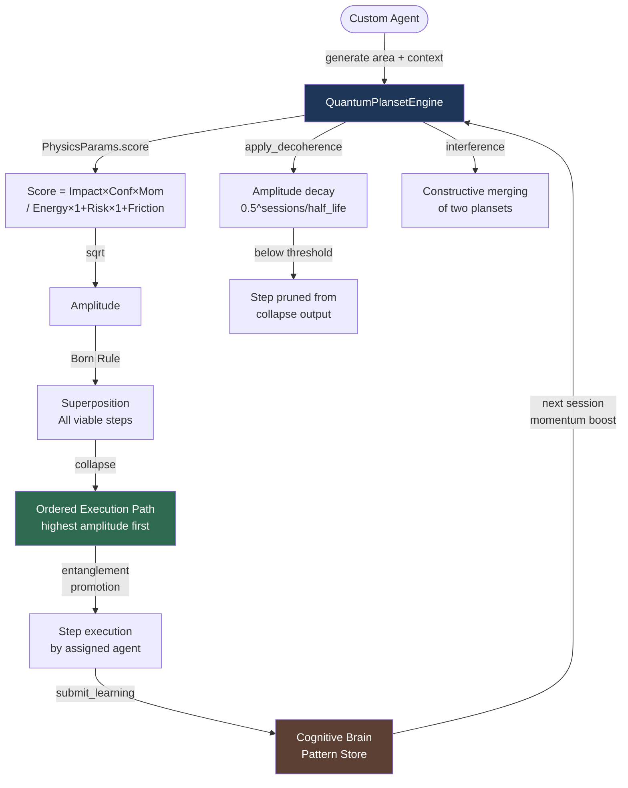

# Quantum Plansets — Codebase Improvement

Six built-in plansets that custom agents use to improve the `_codex_` codebase,
scored via the physics equation and quantum-inspired collapse mechanics.

## Physics Scoring Equation

```
Score     = (Impact × Confidence × Momentum) / (Energy × (1 + Risk) × (1 + Friction))
Amplitude = sqrt(Score)
P(select) = Amplitude² / Σ Amplitude²    ← Born-rule normalisation
```

---

## Built-in Plansets

### 1. COVERAGE_IMPROVEMENT

| Step | Agent | Action | Score |
|------|-------|--------|-------|
| COV-01 | coverage-gapfill-agent | identify low-coverage modules | 0.986 |
| COV-02 | coverage-gapfill-agent | generate targeted unit tests | 0.286 |
| COV-03 | coverage-maintenance-agent | raise threshold in pyproject.toml | 0.538 |
| COV-04 | mutation-testing-agent | run mutation score on new tests | 0.044 |

**Context boost**: `coverage_pct < 70` → COV-01/02 momentum ×1.4

---

### 2. SECURITY_REMEDIATION

| Step | Agent | Action | Score |
|------|-------|--------|-------|
| SEC-01 | codeql-alert-resolution-agent | collect via resolution_pipeline.py | 1.287 |
| SEC-02 | codeql-alert-resolution-agent | auto-remediate P0/P1 alerts | 0.545 |
| SEC-03 | dependency-vulnerability-scanner | scan requirements for CVEs | 0.523 |
| SEC-04 | secret-detection-agent | scan for committed secrets | 0.727 |
| SEC-05 | codeql-alert-resolution-agent | validate and close resolved alerts | 0.480 |

**Context boost**: `open_alerts > 50` → SEC-01/02 momentum ×1.5

---

### 3. CI_SELF_HEALING

| Step | Agent | Action | Score |
|------|-------|--------|-------|
| CI-01 | ci-failure-resolution-agent | retrieve and categorise recent failures | 1.287 |
| CI-02 | ci-auto-healer-agent | apply embedded fix patterns | 0.347 |
| CI-03 | autonomous-test-healer-agent | stabilise flaky tests | 0.158 |
| CI-04 | workflow-optimization-agent | optimise job parallelism + caching | 0.193 |

**Context boost**: `failing_checks > 5` → CI-01/02 momentum ×1.6

---

### 4. DEPENDENCY_MODERNISATION

| Step | Agent | Action | Score |
|------|-------|--------|-------|
| DEP-01 | dependency-conflict-agent | audit requirements for conflicts | 0.825 |
| DEP-02 | dependency-vulnerability-scanner | upgrade packages with known CVEs | 0.442 |
| DEP-03 | dependency-conflict-agent | pin compatible version ranges | 0.375 |

**Context boost**: `stale_deps > 10` → DEP-01/02 momentum ×1.3

---

### 5. DOCUMENTATION_HYGIENE

| Step | Agent | Action | Score |
|------|-------|--------|-------|
| DOC-01 | link-validator-agent | scan docs for broken links | 0.756 |
| DOC-02 | doc-freshness-checker | identify stale documentation | 0.557 |
| DOC-03 | unified-doc-agent | add YAML frontmatter to agent files | 0.818 |
| DOC-04 | documentation-consolidator | consolidate duplicate doc files | 0.076 |

---

### 6. QI_TESTING ← quantum-compliance-tuning-agent

Drives the Bayesian + Fuzzy iterative tuning loop for patterns H/F/E/C.

| Step | Agent | Action | Amplitude |
|------|-------|--------|-----------|
| QI-01 | quantum-compliance-tuning-agent | run raw scalability experiment | 0.9796 |
| QI-02 | quantum-compliance-tuning-agent | generate per-pattern accuracy report | **1.1314** ← highest |
| QI-03 | quantum-compliance-tuning-agent | update target_patterns.json | 0.8942 |
| QI-04 | quantum-compliance-tuning-agent | run tuned experiment BAYESIAN+FUZZY | 0.6262 |
| QI-05 | quantum-compliance-tuning-agent | compare before vs after | 0.9127 |
| QI-06 | quantum-compliance-tuning-agent | regression guard seed=42 k₁≤0.35 | 1.1019 |
| QI-07 | quantum-compliance-tuning-agent | accept or revert iteration | 0.8090 |

**Collapse order** (no context): `QI-02 → QI-01 → QI-06 → QI-05 → QI-03 → QI-07 → QI-04`

> QI-02 leads because it has energy=5 (vs QI-01 energy=8); lower energy → higher score → higher amplitude.

**Context boosts**:
- `failing_patterns ≥ 2` → QI-01 ×1.5, QI-06 ×1.6
- `failing_patterns = 1` → QI-01 ×1.3, QI-06 ×1.4
- `k1 ≥ 0.33` → QI-06 ×1.7 (regression guard priority elevated)

---

## Usage

```python
from codex.cognitive import QuantumPlansetEngine, ImprovementArea

engine = QuantumPlansetEngine()

# Generate any planset
ps = engine.generate(
    ImprovementArea.QI_TESTING,
    context={"failing_patterns": 2, "k1": 0.3406},
)

# Collapse to ordered execution path
path = engine.collapse(ps)
for step in path:
    print(f"[{step.step_id}] {step.agent}: {step.action}")

# Age deferred steps (reduces amplitude over sessions)
engine.apply_decoherence(ps, sessions=1)

# Merge two areas via constructive interference
ps_merged = engine.interference(
    engine.generate(ImprovementArea.SECURITY_REMEDIATION),
    engine.generate(ImprovementArea.CI_SELF_HEALING),
)

# Persist for cross-agent handoff
engine.save(ps, path=Path(".codex/plans/quantum/active.json"))
restored = engine.load(Path(".codex/plans/quantum/active.json"))
```

---

## Architecture Diagram



---

*Source: `src/codex/cognitive/quantum_planset_engine.py`*
*Tests: `tests/cognitive/test_quantum_planset_engine.py` (63 tests)*
