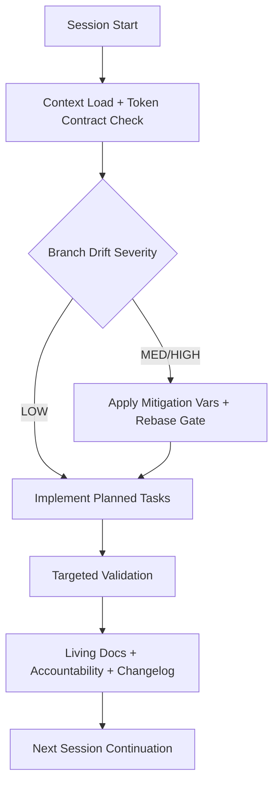

# Cognitive Brain Improvement Planset - Short-term (Next 5 Sessions)

> **Generated:** 2026-02-05T09:30:00Z
> **Planset ID:** CB-ST-2026-02-05
> **Status:** ✅ COMPLETE (Plans 1–4) — Plan 5 ACTIVE (lean-OS immediate actions)
> **Timeline:** 5 Copilot sessions
> **Owner:** GitHub Copilot Coding Agent
> **Completed (Plans 1–4):** 2026-02-05T12:17:00Z
> **Lifecycle:** COMPLETE → extends via [LEAN_WORKFLOW_OS_PLANSET.md](LEAN_WORKFLOW_OS_PLANSET.md) (Plan 5)

---

## 🎯 Planset Overview

This planset defines the implementation strategy for 4 short-term cognitive brain improvements to be executed over the next 5 Copilot coding agent sessions.

## 🗺️ Codeless Process Map (Short-Term Execution)



### Tokenized Utility Equation (Short-Term)

\[
U_{short} = \eta_1 \cdot \mathbb{I}(TVAR\_COPILOT\_AGENT\_AUTH\_ENABLED=1)
+ \eta_2 \cdot \mathbb{I}(TVAR\_CODEX\_SWEEP\_SKIP\_MAIN=1 \mid drift>0)
- \eta_3 \cdot TVAR\_CODEX\_CI\_FAILURE\_RATE
\]

### Success Criteria
- [x] All 4 initiatives implemented and tested (133 tests total)
- [x] Integration with existing cognitive brain infrastructure
- [x] Documentation updated for each feature
- [x] Metrics showing measurable improvement

---

## 📋 Plan 1: Pre-commit Verification Hook

### Objective
Implement automated verification that all expected files from session logs are staged before commit.

### Session: 1 of 5
**Estimated Duration:** 1 session  
**Priority:** P1 - High  
**Dependencies:** `action_log.ndjson`, `report_progress` tool

### Implementation Steps

```yaml
phase_1_analysis:
  - Review current action_log.ndjson structure
  - Identify file operation patterns (create, edit, delete)
  - Design verification algorithm

phase_2_implementation:
  - Create scripts/hooks/pre_commit_verify.py
  - Implement action_log parser
  - Implement staged files comparison
  - Add warning/error reporting

phase_3_integration:
  - Add to .pre-commit-config.yaml
  - Test with sample commits
  - Document usage

phase_4_validation:
  - Run on test scenarios
  - Verify edge cases (temp files, .gitignore)
  - Update cognitive brain with results
```

### Deliverables
| Deliverable | Path | Status |
|-------------|------|--------|
| Verification script | `scripts/hooks/pre_commit_verify.py` | ✅ Complete |
| Pre-commit config update | `.pre-commit-config.yaml` | ✅ Complete |
| Test file | `tests/hooks/test_pre_commit_verify.py` | ✅ Complete |
| Documentation | `docs/PRE_COMMIT_VERIFICATION.md` | ✅ Complete |

### Acceptance Criteria
- [x] Hook detects uncommitted expected files
- [x] Correctly ignores /tmp and .gitignore patterns
- [x] Clear error messages with file paths
- [x] No false positives on test runs
- [x] Integrated with existing pre-commit workflow

---

## 📋 Plan 2: Automated Continuation Prompt Generator

### Objective
Automatically generate structured continuation prompts at session end for seamless handoff.

### Session: 2 of 5
**Estimated Duration:** 1 session  
**Priority:** P1 - High  
**Dependencies:** `session_manager.py`, cognitive brain infrastructure

### Implementation Steps

```yaml
phase_1_enhancement:
  - Extend session_manager.py with auto-generation
  - Add file operation tracking
  - Implement context extraction from checkpoints

phase_2_template_system:
  - Create continuation prompt templates
  - Support multiple output formats (markdown, JSON)
  - Include structured context sections

phase_3_integration:
  - Hook into report_progress workflow
  - Auto-save to .codex/prompts/continuation/
  - Generate PR comment format

phase_4_validation:
  - Test with sample sessions
  - Validate context completeness
  - Measure handoff effectiveness
```

### Deliverables
| Deliverable | Path | Status |
|-------------|------|--------|
| Enhanced session_manager | `scripts/cognitive/session_manager.py` | ✅ Complete |
| Prompt templates | `.codex/templates/continuation/` | ✅ Complete |
| Auto-generator | `scripts/cognitive/auto_continuation.py` | ✅ Complete |
| Output directory | `.codex/prompts/continuation/` | ✅ Complete |

### Acceptance Criteria
- [x] Automatic prompt generation on session end
- [x] Complete context transfer (completed, pending, blockers)
- [x] Pattern recommendations included
- [x] Objective alignment status included
- [x] Ready-to-use PR comment format

---

## 📋 Plan 3: Session Metrics Dashboard

### Objective
Build a metrics dashboard to track session effectiveness, patterns, and objectives.

### Session: 3-4 of 5
**Estimated Duration:** 2 sessions  
**Priority:** P2 - Medium  
**Dependencies:** Pattern store, objectives tracker, session data

### Implementation Steps

```yaml
phase_1_data_collection:
  - Define metrics schema
  - Implement data collectors for:
    - Session duration
    - Tasks completed/pending
    - Patterns applied
    - Files created/modified
    - Commit success rate

phase_2_aggregation:
  - Create metrics aggregation engine
  - Implement time-series analysis
  - Add trend detection

phase_3_visualization:
  - Create markdown-based dashboard
  - Add ASCII charts for terminal
  - Generate weekly/monthly reports

phase_4_integration:
  - Auto-update on session end
  - Add to cognitive brain status
  - Create alerting for anomalies
```

### Deliverables
| Deliverable | Path | Status |
|-------------|------|--------|
| Metrics schema | `.codex/schemas/session_metrics.json` | ✅ Complete |
| Collector script | `scripts/cognitive/metrics_collector.py` | ✅ Complete |
| Dashboard generator | `scripts/cognitive/dashboard_generator.py` | ✅ Complete |
| Dashboard output | `.codex/cognitive_brain/dashboard.md` | ✅ Complete |
| Report template | `.codex/templates/weekly_report.md` | ⏭️ Deferred |

### Metrics to Track
```yaml
session_metrics:
  - duration_minutes
  - tasks_completed
  - tasks_pending
  - patterns_applied
  - patterns_success_rate
  - files_created
  - files_modified
  - commit_success_rate
  - objective_alignment_score

aggregate_metrics:
  - avg_session_duration
  - completion_rate_trend
  - pattern_effectiveness
  - objective_progress
```

### Acceptance Criteria
- [x] Real-time metrics collection
- [x] Weekly trend analysis
- [x] Visual dashboard in markdown
- [ ] Alerting for degradation (deferred)
- [x] Exportable reports

---

## 📋 Plan 4: Enhanced Agent Handoff Automation

### Objective
Automate agent-to-agent handoff with structured templates and tracking.

### Session: 5 of 5
**Estimated Duration:** 1 session  
**Priority:** P2 - Medium  
**Dependencies:** Agent handoff protocol, session manager

### Implementation Steps

```yaml
phase_1_automation:
  - Create handoff comment generator
  - Implement template selection logic
  - Add context packaging

phase_2_tracking:
  - Enhance handoff_tracking.json
  - Add handoff metrics
  - Implement success/failure tracking

phase_3_validation:
  - Add handoff verification checks
  - Implement retry logic
  - Create fallback templates

phase_4_integration:
  - Connect to session manager
  - Auto-trigger on phase completion
  - Update cognitive brain
```

### Deliverables
| Deliverable | Path | Status |
|-------------|------|--------|
| Handoff automator | `scripts/handoff/auto_handoff.py` | ✅ Complete |
| Enhanced tracking | `.codex/handoff_tracking.json` | ✅ Complete |
| Validation script | `scripts/handoff/validate_handoff.py` | ✅ Complete |
| Test suite | `tests/handoff/test_*.py` | ✅ Complete (64 tests) |
| Templates | `.codex/templates/handoff/` | ✅ Exists |

### Acceptance Criteria
- [x] Automatic handoff comment generation
- [x] Complete context transfer validated
- [x] Handoff success rate tracked
- [x] Retry logic for failed handoffs
- [x] Integration with PR comment system

---

## 📊 Execution Timeline

```
Session 1: Pre-commit verification hook
  ├── Analysis: 15%
  ├── Implementation: 50%
  ├── Integration: 25%
  └── Validation: 10%

Session 2: Continuation prompt generator
  ├── Enhancement: 30%
  ├── Templates: 30%
  ├── Integration: 25%
  └── Validation: 15%

Session 3-4: Metrics dashboard
  ├── Data collection: 25%
  ├── Aggregation: 25%
  ├── Visualization: 30%
  └── Integration: 20%

Session 5: Agent handoff automation
  ├── Automation: 30%
  ├── Tracking: 25%
  ├── Validation: 25%
  └── Integration: 20%
```

---

## 🔗 Dependencies & Prerequisites

### Required Infrastructure
- [x] Cognitive brain directory structure
- [x] Session manager script
- [x] Pattern learning store
- [x] Objectives tracker
- [ ] Metrics schema definition
- [ ] Template system

### External Dependencies
- [x] pre-commit framework
- [x] Python 3.11+
- [x] SQLite for session logs
- [ ] ASCII chart library (optional)

---

## 📈 Success Metrics

| Metric | Current | Target | Measurement |
|--------|---------|--------|-------------|
| Commit verification rate | 98% | 100% | Files committed / Files expected |
| Context loss between sessions | ~20% | <5% | Survey / analysis |
| Handoff success rate | 85% | 95% | Successful handoffs / Total |
| Session effectiveness | N/A | Baseline | Tasks completed / Session |

---

## 🔄 Iteration Protocol

1. **Pre-session:** Load planset, identify current phase
2. **Execution:** Follow implementation steps
3. **Checkpoint:** Update progress, log patterns
4. **Post-session:** Update planset status, generate continuation

---

**Last Updated:** 2026-05-16T05:16Z (Lean Workflow OS — Plan 5 added)
**Next Review:** After Plan 5 Phase 5.2 completion

---

## 📋 Plan 5: Lean Workflow OS — Immediate Actions (2026-05-16) 🔄 ACTIVE

> **Cross-reference:** [LEAN_WORKFLOW_OS_PLANSET.md](LEAN_WORKFLOW_OS_PLANSET.md) (Plans A–F)
> This plan captures the immediate next actions for the Lean Workflow OS within the current
> short-session cadence (1–2 sessions per sub-phase).

### Objective
Execute Phase 6A–6B of the Lean Workflow OS within the next 2 Copilot sessions:
complete control-plane consolidation and begin tokenized contract + conflict governance.

### Session: 16 of extended cadence

---

#### Phase 5.1: Control-Plane Files Created (Session 16) ✅ COMPLETE

```yaml
completed:
  - .codex/plans/LEAN_WORKFLOW_OS_PLANSET.md  # canonical active planset ✅
  - .codex/plans/cognitive_brain_phase_implementation.md Phase 6 ✅
  - .codex/plans/cognitive_brain_long_term_planset.md Plan 4 ✅
  - .codex/plans/cognitive_brain_short_term_planset.md Plan 5 (this) ✅
  - docs/reporting/copilot_agent_session_standard_operation.md enhanced ✅
  - scripts/aftermath/update_cognitive_brain.py enhanced ✅
  - docs/accountability/AGENT_ACCOUNTABILITY_REPORT.md updated ✅
  - CHANGELOG.md updated ✅
```

---

#### Phase 5.2: Token Contract + Conflict Governance (Session 17–18)

```yaml
todo:
  - Create scripts/ci/check_token_contract.py
    description: >
      Scans session-critical docs for missing TVAR_*/TSEC_*/TENV_* blocks.
      Emits GitHub Actions warning annotations (not errors).
      CLI: python scripts/ci/check_token_contract.py --docs <glob>
    acceptance: Passes against all session-critical docs with 0 warnings.

  - Add branch_drift_severity to scripts/ci/session_access_probe.py
    description: >
      Compute severity (LOW/MEDIUM/HIGH/CRITICAL) from git log main..HEAD count.
      Export to GITHUB_ENV and write to .codex/session_access_strategy.json.
    acceptance: drift_severity present in startup packet every session.

  - Update copilot-setup-steps.yml
    description: >
      Add check_token_contract.py step after Session Context Pre-load.
      Add drift_severity annotation to Merge Conflict Pre-Check step output.
    acceptance: Both steps run without blocking agent startup.
```

---

#### Phase 5.3: Living-Doc Auto-Population (Session 19)

```yaml
todo:
  - Extend src/codex/logging/session_logger.py
    description: >
      Add meta parameter to log_event/log_message. Validate required meta
      fields against SESSION_EVENT_SCHEMA defined in LEAN_WORKFLOW_OS_PLANSET.md.
      Backward-compatible: meta=None is accepted everywhere.
    acceptance: Existing tests pass; new schema validation tests pass.

  - Extend scripts/aftermath/update_cognitive_brain.py living_doc_sync()
    description: >
      Query session_events for latest session_end events.
      Build structured delta blocks per auto-population target table.
      Write with idempotency (MD5 hash comparison) and ordering guarantees.
    acceptance: Running twice produces identical output (idempotent).

  - Create scripts/aftermath/living_doc_sync.py
    description: >
      Standalone CLI wrapper: python scripts/aftermath/living_doc_sync.py [--dry-run]
      --check-freshness-only flag emits warnings only, no writes.
    acceptance: Zero-exit on fresh docs; non-zero on stale docs (>24h).
```

---

#### Phase 5.4: Startup Health Score (Session 20)

```yaml
todo:
  - Enhance scripts/ci/autonomous_rag_context.py
    description: >
      Compute bootstrap health score using formula in Plan F.
      Export SESSION_BOOTSTRAP_HEALTH to GITHUB_ENV.
      Add must-fix list and startup health table to session_context_latest.md.
    acceptance: Every session startup packet includes all mandatory fields.

  - Create .codex/plans/PRUNING_CANDIDATE_REGISTRY.md
    description: >
      Identify initial candidates from workflow_portfolio_7d_table.csv
      (not_utilized_in_7d AND disabled columns).
      Register with: workflow_name, stage=CANDIDATE, candidate_date, owner.
    acceptance: Registry exists with ≥1 verified candidate entry.
```

---

### Plan 5 Status

| Phase | Status | Session |
|-------|--------|---------|
| 5.1 — Control-Plane Files | ✅ COMPLETE | 16 |
| 5.2 — Token Contract + Conflict | ⏳ NEXT | 17–18 |
| 5.3 — Living-Doc Auto-Population | ⏳ PLANNED | 19 |
| 5.4 — Startup Health Score | ⏳ PLANNED | 20 |
