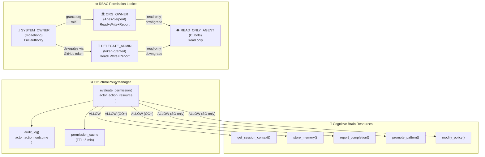
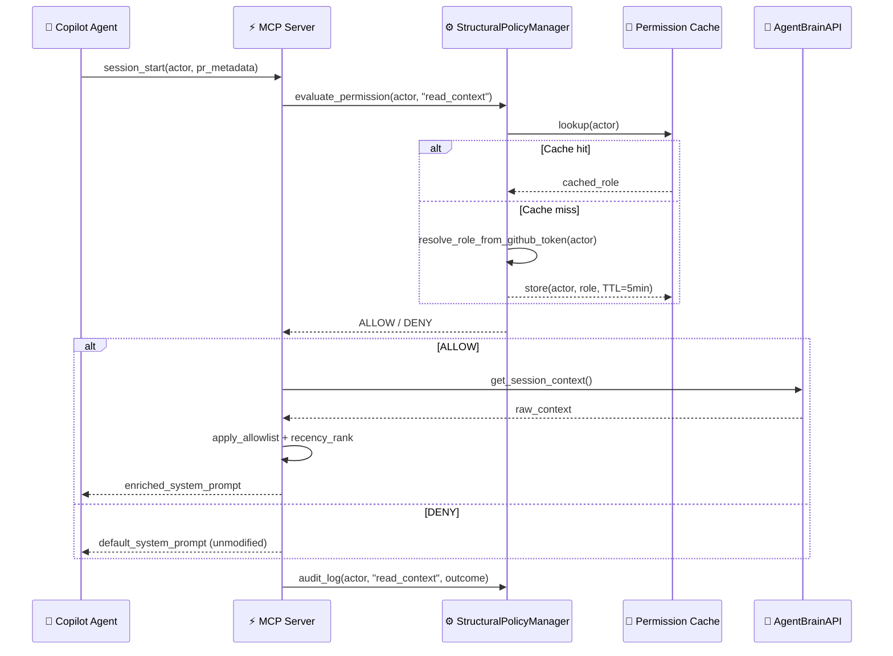

# StructuralPolicyManager — RBAC Policy Manager (Phase 5 Planset)

> **PLANSET ONLY — DO NOT EXECUTE until separate approval obtained.**
>
> Source: comment-3977050660 (Cognitive Brain Integration, Phase 5)
> Session: S108 (2026-02-28)

## Overview

Detailed planset for implementing a full RBAC-style permission manager
(`StructuralPolicyManager`) for the `AgentBrainAPI`.  Includes permission
lattice, mermaid diagrams, and implementation sub-tasks.

## RBAC Permission Lattice

```
SYSTEM_OWNER (mbaetiong)
│   ┌──────────────────────────────────────────────────────────┐
│   │ Permissions: ALL — read/write brain, promote patterns,   │
│   │ elevate autonomous_actions, manage policy, delegate admin│
│   └──────────────────────────────────────────────────────────┘
│
├── ORG_OWNER (Aries-Serpent org owners)
│   ┌──────────────────────────────────────────────────────────┐
│   │ Permissions: read brain, write store_memory, report CI,  │
│   │ promote pattern candidates (SYSTEM_OWNER review req.)    │
│   └──────────────────────────────────────────────────────────┘
│
├── DELEGATE_ADMIN (via GitHub token + explicit grant)
│   ┌──────────────────────────────────────────────────────────┐
│   │ Permissions: read brain, write store_memory, report CI,  │
│   │ NO pattern promotion, NO policy changes                  │
│   └──────────────────────────────────────────────────────────┘
│
└── READ_ONLY_AGENT (future: CI bots, external contributors)
    ┌──────────────────────────────────────────────────────────┐
    │ Permissions: read store_memory facts + pattern IDs ONLY  │
    │ NO write, NO promotion, NO delegation                    │
    └──────────────────────────────────────────────────────────┘
```

## Mermaid: RBAC Architecture



## Mermaid: Permission Evaluation Flow



## Implementation Sub-Tasks (Planset-Defined)

1. Define `PermissionTier` enum + role resolution logic
2. Implement `evaluate_permission(actor, action, resource) → ALLOW/DENY`
3. Implement `permission_cache` with TTL eviction
4. Implement `audit_log → .codex/rbac_audit.jsonl`
5. Wire into `mcp_session_bridge.py` (replace `validate_actor()`)
6. Create RBAC config section in `agent-brain-config.yml`
7. Write 25+ tests covering all permission tiers and edge cases
8. Integration test: unauthorised agent attempts + audit trail verification

## Acceptance Criteria (Planset)

- [ ] Permission lattice strictly hierarchical
- [ ] Audit log captures all `evaluate_permission` calls
- [ ] Cache TTL eviction tested
- [ ] Zero escalation possible
- [ ] Policy file modifiable only by `SYSTEM_OWNER`

## Integration Points

- `mcp_session_bridge.py`: `validate_actor()` → `evaluate_permission()`
- `cognitive_brain_ci_feedback.yml`: actor check → permission gate
- `SessionContextInjector`: pass through only if ALLOW

## Execution Guard

**Zero execution until explicit approval separate from this plan.**
