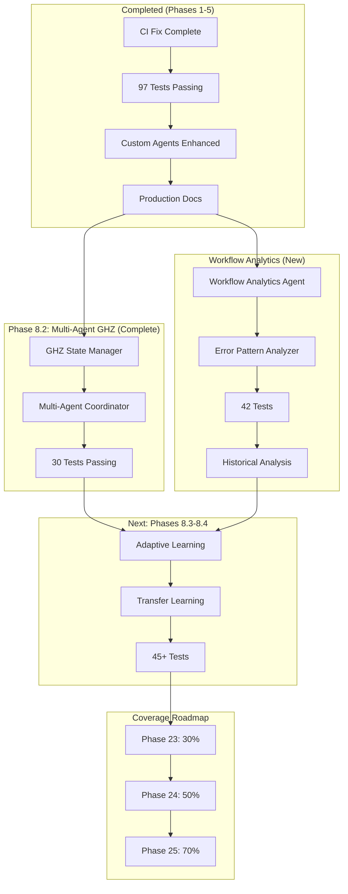

# Continuation Prompt: Cognitive Brain & Production Readiness

> **Generated:** 2026-01-22T04:10:00Z
> **PR Reference:** #2949 (CI/CD Pipeline Failure Resolution)
> **Status:** Phases 1-5 Complete - Ready for Phase 6+

---

## Follow-Up Prompt for GitHub Copilot

The following prompt should be posted as a PR comment to continue the work:

---

@copilot Continue cognitive brain enhancement with Phases 8.3-8.4 and Coverage Roadmap execution.

**Context:** PR #2949 successfully completed Phases 1-5:
- Phase 1: CI/CD fix complete (import json, 29 tests)
- Phase 2: Cognitive Brain Phase 8.2 tests aligned (30 tests)
- Phase 3: CI Testing Agent enhanced with fix patterns
- Phase 4: codex_harness tests added (38 tests, 0% → 90%)
- Phase 5: Production Readiness Checklist created

**Current Status:**
- [x] CI/CD fix complete (import json added, 29 tests passing)
- [x] Cognitive Brain Phase 8.2 tests fixed (30 tests passing)
- [x] Custom Copilot Agents enhanced (CI Testing Agent)
- [x] Coverage improvement started (38 codex_harness tests)
- [x] Production Readiness Checklist created
- [ ] Cognitive Brain Phase 8.3 (Adaptive Learning)
- [ ] Cognitive Brain Phase 8.4 (Transfer Learning)
- [ ] Coverage roadmap phases 23-25 (27.5% → 70%)

**Next Phase Tasks:**

### Phase 6: Cognitive Brain Phase 8.3 (Adaptive Learning)
1. Implement Adaptive Strategy Selector in `src/cognitive_brain/learning/adaptive_selector.py`
2. Create Decision Feedback Loop for outcome analysis
3. Add 25+ tests for Phase 8.3 components
4. Update cognitive brain status documentation

### Phase 7: Cognitive Brain Phase 8.4 (Transfer Learning)
1. Implement Knowledge Transfer Manager
2. Create Cross-Domain Pattern Mapper
3. Add 20+ tests for Phase 8.4 components
4. Document transfer learning patterns

### Phase 8: Coverage Roadmap Execution (Phases 23-25)
Reference plansets:
- `.codex/plans/PLANSET_PHASE_23_COVERAGE_30.md`
- `.codex/plans/PLANSET_PHASE_24_COVERAGE_50.md`
- `.codex/plans/PLANSET_PHASE_25_COVERAGE_70.md`

**Priority Modules for Coverage:**
1. `src/mcp/` - 11.67% coverage (60 files)
2. `src/context_management/` - Tests exist, verify coverage
3. `src/agent/` - Tests exist, add more edge cases
4. `src/training/` - Low coverage target

Target: Increase test coverage from ~30% to 70%

**Success Criteria:**
- ✅ All CI jobs green on current PR
- ✅ Cognitive Brain Phase 8.3 implemented with tests
- ✅ Cognitive Brain Phase 8.4 implemented with tests
- ✅ Test coverage increased to 50%+
- ✅ AfterMath/PDA loop maintained

**Policy Compliance:**
- Follow `.codex/CODEBASE_AGENCY_POLICY.md`
- Address ALL issues (pre-existing + new)
- 5+ self-review iterations
- Use pre-commit/commit terminology
- Document in `.codex/aftermath/`

**Full Implementation Guides:**
- `.codex/plans/COGNITIVE_BRAIN_STATUS_V2.md`
- `.codex/plans/COGNITIVE_BRAIN_PRODUCTION_ROADMAP.md`
- `.codex/plans/PHASE_18_MASTER_PLANSET.md`
- `.codex/archive/deprecated/AGENTS.md`

---

## Architecture Diagram: Cognitive Brain Enhancement Path



## Priority Matrix (Updated)

| Task | Priority | Effort | Impact | Status |
|------|----------|--------|--------|--------|
| CI Fix | P0 | Low | High | ✅ Complete |
| Phase 8.2 GHZ States | P1 | High | High | ✅ Complete |
| Custom Agents | P1 | Medium | High | ✅ Complete |
| Workflow Analytics | P1 | Medium | High | ✅ Complete |
| Phase 8.3 Adaptive Learning | P1 | High | High | 🔄 Next |
| Phase 8.4 Transfer Learning | P1 | High | High | 📋 Planned |
| Coverage Roadmap | P2 | High | Medium | 📋 Planned |

---

## New Agent Capabilities (2026-01-22)

### Workflow Analytics Agent
- Access previous workflow runs, logs, and artifacts
- Detect recurring error patterns across runs
- Generate actionable remediation suggestions
- Track CI/CD health metrics over time

**Activation:**
```markdown
@copilot Use the Workflow Analytics Agent to analyze recent CI failures and identify error patterns.
```

### Error Pattern Analyzer Script
```bash
python scripts/ci/analyze_workflow_errors.py --logs <log_file>
```

---

## Version History

| Version | Date | Changes |
|---------|------|---------|
| 1.0.0 | 2026-01-22 | Initial creation after CI fix |
| 2.0.0 | 2026-01-22 | Phases 1-5 complete, added Workflow Analytics Agent |
