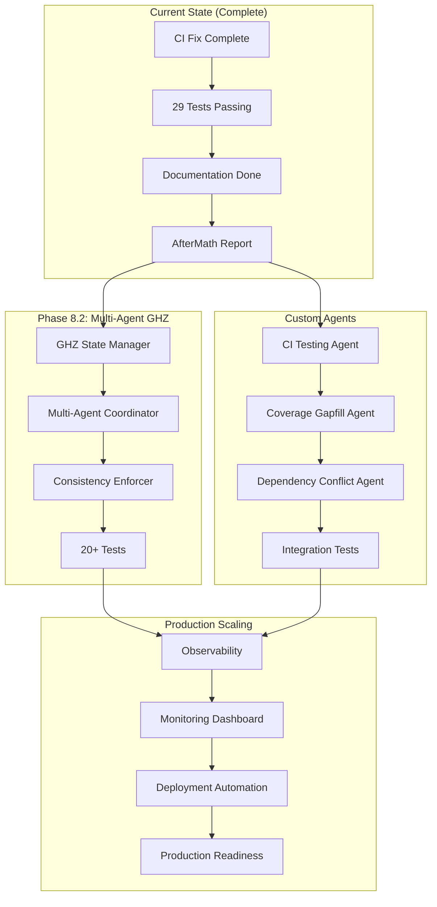

# Continuation Prompt: Cognitive Brain & Production Readiness

> **Generated:** 2026-01-22T03:35:00Z
> **PR Reference:** #2949 (CI/CD Pipeline Failure Resolution)
> **Status:** Ready for Next Agent

---

## Follow-Up Prompt for GitHub Copilot

The following prompt should be posted as a PR comment to continue the work:

---

@copilot Continue comprehensive cognitive brain enhancement and production readiness implementation.

**Context:** PR #2949 successfully resolved the CI/CD pipeline failure (missing `import json` in `validate_cargo_features.py`). The fix includes 29 tests, documentation, and AfterMath report. CI pipeline should now be unblocked.

**Current Status:**
- [x] CI/CD fix complete (import json added, 29 tests passing)
- [x] Cognitive brain status updated (`.codex/plans/COGNITIVE_BRAIN_STATUS_V2.md`)
- [x] Documentation complete (troubleshooting guide, AfterMath report)
- [ ] Cognitive Brain Phase 8.2-8.4 implementation
- [ ] Custom Copilot Agents development
- [ ] Production scaling (Phase 9.0)
- [ ] Coverage roadmap phases 23-25

**Next Phase Tasks:**

### Phase 1: Verify CI Pipeline (Immediate)
1. Monitor the current PR's CI run to confirm all jobs pass
2. If any failures, diagnose and fix immediately
3. Once CI green, mark PR ready for review

### Phase 2: Cognitive Brain Enhancement (Phase 8.2)
1. Implement Multi-Agent GHZ State Manager in `src/cognitive_brain/quantum/ghz_state_manager.py`
2. Create Multi-Agent Coordinator for 3-10 agent coordination
3. Add 20+ tests for Phase 8.2 components
4. Update cognitive brain status documentation

### Phase 3: Custom Copilot Agents (Production-Ready)
1. Enhance CI Testing Agent (`.github/agents/ci-testing-agent.md`)
2. Create Coverage Gapfill Agent (`.github/agents/coverage-gapfill-agent.md`)
3. Implement Dependency Conflict Agent patterns
4. Add agent integration tests

### Phase 4: Coverage Roadmap Execution (Phases 23-25)
Reference plansets:
- `.codex/plans/PLANSET_PHASE_23_COVERAGE_30.md`
- `.codex/plans/PLANSET_PHASE_24_COVERAGE_50.md`
- `.codex/plans/PLANSET_PHASE_25_COVERAGE_70.md`

Target: Increase test coverage from 27.5% to 70%

### Phase 5: Production Scaling (Phase 9.0)
1. Implement production scaling patterns
2. Add observability and monitoring
3. Create deployment automation
4. Document production readiness checklist

**Success Criteria:**
- ✅ All CI jobs green on current PR
- ✅ Cognitive Brain Phase 8.2 implemented with tests
- ✅ At least 2 custom agents production-ready
- ✅ Test coverage increased by 10%+
- ✅ AfterMath/PDA loop maintained

**Policy Compliance:**
- Follow `.codex/CODEBASE_AGENCY_POLICY.md`
- Address ALL issues (pre-existing + new)
- 5+ self-review iterations
- Use pre-commit/commit terminology
- Document in `.codex/aftermath/`

**Full Implementation Guides:**
- `.codex/plans/COGNITIVE_BRAIN_STATUS_V2.md`
- `.codex/plans/COGNITIVE_BRAIN_PRODUCTION_ROADMAP.md`
- `.codex/plans/PHASE_18_MASTER_PLANSET.md`
- `AGENTS.md`

---

## Architecture Diagram: Cognitive Brain Enhancement Path

## Priority Matrix

| Task | Priority | Effort | Impact |
|------|----------|--------|--------|
| Verify CI Pipeline | P0 | Low | High |
| Phase 8.2 GHZ States | P1 | High | High |
| Custom Agents | P1 | Medium | High |
| Coverage Roadmap | P2 | High | Medium |
| Production Scaling | P2 | High | High |

---

## Version History

| Version | Date | Changes |
|---------|------|---------|
| 1.0.0 | 2026-01-22 | Initial creation after CI fix |
