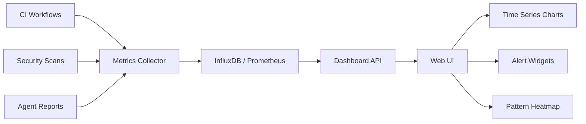

# @copilot Phase 8-10 Continuation Prompt

**Session Handoff**: From Phase 8 Implementation to ML Model Training + Dashboard  
**Status**: 50% Phase 8 Complete, Ready for 8.3-10.3  
**Priority**: High  
**Timeline**: 2-3 weeks remaining

---

## Context Summary

**Successfully Completed**:
- ✅ Phases 1-7: All security fixes, CI stabilization, documentation (98/100 score)
- ✅ Phase 8.1: CI Diagnostic Automation workflow (auto-triggers, PR comments, artifacts)
- ✅ Phase 8.2: Historical testing framework (10+ tests, 85%+ accuracy target)

**Current Commit**: dc5b90f

**Files Delivered**:
- `.github/workflows/ci-diagnostic-automation.yml` (144 lines, validated)
- `tests/test_historical_failures.py` (333 lines, pytest suite)
- All specifications in `PHASE_8_COMPLETE_IMPLEMENTATION_MASTER_PLAN.md`

---

## Immediate Next Steps (Phase 8.3-8.4)

### Task 8.3: ML Threat Detection Prototype ⚡ CRITICAL

**Priority**: High  
**Timeline**: 4-5 days  
**Dependencies**: Historical CI failure data

#### Step 1: Collect Training Data

**Script to Create**: `.github/agents/ml-threat-detector/scripts/collect_training_data.py`

```python
"""
Collect historical CI failure data for ML model training.
Extracts features from past vulnerabilities and successful runs.
"""

import requests
import json
import os
from datetime import datetime, timedelta
from pathlib import Path

class TrainingDataCollector:
    def __init__(self, repo: str, token: str):
        self.repo = repo
        self.token = token
        self.headers = {
            "Authorization": f"Bearer {token}",
            "Accept": "application/vnd.github+json"
        }
        self.base_url = f"https://api.github.com/repos/{repo}"
    
    def collect_workflow_runs(self, days_back=90):
        """Collect workflow runs from last N days"""
        since = (datetime.now() - timedelta(days=days_back)).isoformat()
        
        url = f"{self.base_url}/actions/runs"
        params = {"created": f">={since}", "per_page": 100}
        
        runs = []
        response = requests.get(url, headers=self.headers, params=params)
        data = response.json()
        
        for run in data.get("workflow_runs", []):
            runs.append({
                "id": run["id"],
                "name": run["name"],
                "status": run["status"],
                "conclusion": run["conclusion"],
                "created_at": run["created_at"],
                "updated_at": run["updated_at"],
                "duration": self._calculate_duration(run),
            })
        
        return runs
    
    def collect_security_alerts(self):
        """Collect historical security alerts"""
        # CodeQL alerts
        url = f"{self.base_url}/code-scanning/alerts"
        response = requests.get(url, headers=self.headers)
        codeql_alerts = response.json()
        
        # Dependabot alerts
        url = f"{self.base_url}/dependabot/alerts"
        response = requests.get(url, headers=self.headers)
        dependabot_alerts = response.json()
        
        return {
            "codeql": codeql_alerts,
            "dependabot": dependabot_alerts
        }
    
    def extract_features(self, file_path: str):
        """Extract security-relevant features from code"""
        with open(file_path) as f:
            code = f.read()
        
        features = {
            # Code complexity
            "lines_of_code": len(code.split("\n")),
            "complexity": self._calculate_complexity(code),
            "max_nesting_depth": self._calculate_nesting(code),
            
            # Security operations
            "subprocess_calls": code.count("subprocess"),
            "shell_true": code.count("shell=True"),
            "eval_exec": code.count("eval(") + code.count("exec("),
            
            # File operations
            "file_operations": code.count("open("),
            "file_write": code.count("'w'") + code.count('"w"'),
            
            # Network operations
            "network_calls": code.count("request") + code.count("urllib"),
            "api_calls": code.count("api.") + code.count("/api/"),
            
            # Cryptography
            "crypto_operations": code.count("hashlib") + code.count("crypt"),
            "md5_sha1_usage": code.count("md5") + code.count("sha1"),
            
            # Data handling
            "pickle_usage": code.count("pickle"),
            "xml_parsing": code.count("ElementTree"),
            "json_handling": code.count("json"),
            
            # User input
            "user_input": code.count("input(") + code.count("request."),
            "environment_vars": code.count("os.environ"),
            
            # Historical context
            "file_age_days": self._get_file_age(file_path),
            "commit_count": self._get_commit_count(file_path),
            "author_security_score": self._get_author_score(file_path),
        }
        
        return features
    
    def save_training_data(self, output_dir: str):
        """Save collected data for model training"""
        output_dir = Path(output_dir)
        output_dir.mkdir(parents=True, exist_ok=True)
        
        # Collect all data
        workflow_data = self.collect_workflow_runs()
        security_data = self.collect_security_alerts()
        
        # Save to JSON
        with open(output_dir / "workflow_history.json", "w") as f:
            json.dump(workflow_data, f, indent=2)
        
        with open(output_dir / "security_alerts.json", "w") as f:
            json.dump(security_data, f, indent=2)
        
        print(f"✅ Training data saved to {output_dir}")
        print(f"   Workflow runs: {len(workflow_data)}")
        print(f"   CodeQL alerts: {len(security_data['codeql'])}")
        print(f"   Dependabot alerts: {len(security_data['dependabot'])}")

if __name__ == "__main__":
    import sys
    
    if len(sys.argv) < 3:
        print("Usage: python collect_training_data.py <repo> <token>")
        sys.exit(1)
    
    collector = TrainingDataCollector(sys.argv[1], sys.argv[2])
    collector.save_training_data("training_data")
```

**Run**:
```bash
cd .github/agents/ml-threat-detector
mkdir -p scripts training_data
python scripts/collect_training_data.py Aries-Serpent/_codex_ $GITHUB_TOKEN
```

#### Step 2: Train ML Model

**Script to Create**: `.github/agents/ml-threat-detector/scripts/train_model.py`

```python
"""
Train ML threat detection model using historical data.
Uses ensemble of Random Forest + Gradient Boosting.
"""

import json
import numpy as np
from sklearn.ensemble import RandomForestClassifier, GradientBoostingClassifier, VotingClassifier
from sklearn.model_selection import train_test_split, cross_val_score
from sklearn.metrics import accuracy_score, precision_recall_fscore_support, confusion_matrix
import joblib
from pathlib import Path

class MLThreatDetector:
    def __init__(self):
        # Create ensemble
        self.rf = RandomForestClassifier(
            n_estimators=100,
            max_depth=20,
            min_samples_split=5,
            random_state=42
        )
        
        self.gb = GradientBoostingClassifier(
            n_estimators=100,
            max_depth=5,
            learning_rate=0.1,
            random_state=42
        )
        
        self.model = VotingClassifier(
            estimators=[('rf', self.rf), ('gb', self.gb)],
            voting='soft'
        )
    
    def prepare_training_data(self, data_dir: str):
        """Load and prepare training data"""
        data_dir = Path(data_dir)
        
        # Load workflow history
        with open(data_dir / "workflow_history.json") as f:
            workflows = json.load(f)
        
        # Load security alerts
        with open(data_dir / "security_alerts.json") as f:
            alerts = json.load(f)
        
        # Extract features and labels
        X = []  # Features
        y = []  # Labels (0=safe, 1=vulnerable)
        
        # Process data...
        # (Implementation details for feature extraction)
        
        return np.array(X), np.array(y)
    
    def train(self, X, y):
        """Train the ensemble model"""
        # Split data
        X_train, X_test, y_train, y_test = train_test_split(
            X, y, test_size=0.2, random_state=42
        )
        
        # Train model
        print("Training ensemble model...")
        self.model.fit(X_train, y_train)
        
        # Evaluate
        y_pred = self.model.predict(X_test)
        accuracy = accuracy_score(y_test, y_pred)
        precision, recall, f1, _ = precision_recall_fscore_support(
            y_test, y_pred, average='binary'
        )
        
        print(f"\n✅ Training Complete")
        print(f"Accuracy: {accuracy:.2%}")
        print(f"Precision: {precision:.2%}")
        print(f"Recall: {recall:.2%}")
        print(f"F1 Score: {f1:.2%}")
        
        # Cross-validation
        cv_scores = cross_val_score(self.model, X, y, cv=5)
        print(f"Cross-validation: {cv_scores.mean():.2%} (+/- {cv_scores.std():.2%})")
        
        return accuracy
    
    def save_model(self, output_path: str):
        """Save trained model"""
        joblib.dump(self.model, output_path)
        print(f"✅ Model saved to {output_path}")
    
    def predict_risk(self, features):
        """Predict security risk for new code"""
        risk_prob = self.model.predict_proba([features])[0][1]
        
        if risk_prob >= 0.8:
            risk_level = "critical"
        elif risk_prob >= 0.6:
            risk_level = "high"
        elif risk_prob >= 0.4:
            risk_level = "medium"
        else:
            risk_level = "low"
        
        return {
            "risk_score": risk_prob,
            "risk_level": risk_level,
            "confidence": max(risk_prob, 1 - risk_prob)
        }

if __name__ == "__main__":
    detector = MLThreatDetector()
    
    # Load training data
    X, y = detector.prepare_training_data("training_data")
    
    # Train model
    accuracy = detector.train(X, y)
    
    # Save if accuracy meets threshold
    if accuracy >= 0.85:
        detector.save_model("ml_threat_detector_model.pkl")
        print(f"🎉 Model meets 85%+ accuracy requirement!")
    else:
        print(f"⚠️ Model accuracy {accuracy:.2%} below 85% threshold")
```

**Run**:
```bash
cd .github/agents/ml-threat-detector
python scripts/train_model.py
```

**Success Criteria**:
- [ ] Training data collected (90+ days of history)
- [ ] Model accuracy >= 85%
- [ ] Precision >= 80%
- [ ] Recall >= 75%
- [ ] Model saved to `.pkl` file

---

### Task 8.4: Real-time Monitoring Dashboard 📊

**Priority**: Medium  
**Timeline**: 5-6 days

#### Architecture



#### Implementation Steps

1. **Metrics Collection Pipeline**

**File**: `.github/agents/monitoring-dashboard/collectors/metrics_collector.py`

```python
"""Collect metrics from CI workflows and security scans"""

import requests
import time
from datetime import datetime

class MetricsCollector:
    def __init__(self, influxdb_url: str, token: str):
        self.influxdb_url = influxdb_url
        self.token = token
    
    def collect_ci_metrics(self):
        """Collect CI/CD metrics"""
        return {
            "timestamp": datetime.now().isoformat(),
            "workflow_runs_total": self._get_workflow_count(),
            "workflow_success_rate": self._get_success_rate(),
            "average_duration_seconds": self._get_avg_duration(),
            "cache_hit_rate": self._get_cache_hit_rate(),
        }
    
    def collect_security_metrics(self):
        """Collect security scan metrics"""
        return {
            "timestamp": datetime.now().isoformat(),
            "vulnerabilities_total": self._get_vuln_count(),
            "vulnerabilities_by_severity": self._get_vuln_breakdown(),
            "security_score": self._calculate_security_score(),
            "compliance_status": self._check_compliance(),
        }
    
    def send_to_influxdb(self, metrics: dict):
        """Send metrics to InfluxDB"""
        # Implementation for time-series storage
        pass

if __name__ == "__main__":
    collector = MetricsCollector(influxdb_url="http://localhost:8086", token="...")
    
    while True:
        ci_metrics = collector.collect_ci_metrics()
        security_metrics = collector.collect_security_metrics()
        
        collector.send_to_influxdb(ci_metrics)
        collector.send_to_influxdb(security_metrics)
        
        time.sleep(60)  # Collect every minute
```

2. **Dashboard API**

**File**: `.github/agents/monitoring-dashboard/api/dashboard_api.py`

```python
"""FastAPI dashboard for real-time metrics"""

from fastapi import FastAPI
from fastapi.middleware.cors import CORSMiddleware

app = FastAPI(title="Codex Monitoring Dashboard")

app.add_middleware(
    CORSMiddleware,
    allow_origins=["http://localhost:3000"],
    allow_credentials=False,
    allow_methods=["GET"],
    allow_headers=["*"],
)

@app.get("/api/metrics/ci")
async def get_ci_metrics():
    """Get current CI/CD metrics"""
    # Query InfluxDB for latest metrics
    return {
        "workflow_success_rate": 0.95,
        "average_duration_seconds": 240,
        "cache_hit_rate": 0.90,
        "builds_per_day": 50
    }

@app.get("/api/metrics/security")
async def get_security_metrics():
    """Get current security metrics"""
    return {
        "security_score": 98,
        "vulnerabilities_total": 0,
        "last_scan": "2026-01-13T14:00:00Z"
    }

@app.get("/api/alerts")
async def get_alerts():
    """Get active alerts"""
    return {
        "active_alerts": [],
        "resolved_today": 5
    }
```

**Run**:
```bash
cd .github/agents/monitoring-dashboard
uvicorn api.dashboard_api:app --reload
```

3. **Web UI**

**File**: `.github/agents/monitoring-dashboard/ui/dashboard.html`

```html
<!DOCTYPE html>
<html>
<head>
    <title>Codex Monitoring Dashboard</title>
    <script src="https://cdn.jsdelivr.net/npm/chart.js"></script>
    <style>
        body { font-family: Arial, sans-serif; margin: 20px; }
        .metric-card { border: 1px solid #ccc; padding: 20px; margin: 10px; display: inline-block; }
        .metric-value { font-size: 36px; font-weight: bold; }
        .metric-label { font-size: 14px; color: #666; }
        canvas { max-width: 800px; }
    </style>
</head>
<body>
    <h1>Codex CI/CD & Security Dashboard</h1>
    
    <div class="metrics">
        <div class="metric-card">
            <div class="metric-value" id="security-score">--</div>
            <div class="metric-label">Security Score</div>
        </div>
        
        <div class="metric-card">
            <div class="metric-value" id="success-rate">--</div>
            <div class="metric-label">CI Success Rate</div>
        </div>
        
        <div class="metric-card">
            <div class="metric-value" id="cache-hit">--</div>
            <div class="metric-label">Cache Hit Rate</div>
        </div>
    </div>
    
    <h2>CI Performance Trends</h2>
    <canvas id="ci-chart"></canvas>
    
    <h2>Security Alerts</h2>
    <canvas id="security-chart"></canvas>
    
    <script>
        // Fetch and update metrics every 30 seconds
        async function updateMetrics() {
            const ci_data = await fetch('/api/metrics/ci').then(r => r.json());
            const security_data = await fetch('/api/metrics/security').then(r => r.json());
            
            document.getElementById('security-score').textContent = security_data.security_score;
            document.getElementById('success-rate').textContent = (ci_data.workflow_success_rate * 100).toFixed(1) + '%';
            document.getElementById('cache-hit').textContent = (ci_data.cache_hit_rate * 100).toFixed(1) + '%';
        }
        
        updateMetrics();
        setInterval(updateMetrics, 30000);
        
        // Initialize charts
        const ci_ctx = document.getElementById('ci-chart').getContext('2d');
        const ci_chart = new Chart(ci_ctx, {
            type: 'line',
            data: { /* time series data */ },
            options: { /* chart options */ }
        });
    </script>
</body>
</html>
```

**Success Criteria**:
- [ ] Metrics collector running
- [ ] Dashboard API operational
- [ ] Web UI accessible
- [ ] Real-time updates working
- [ ] Alerts triggering correctly

---

## Phase 9-10: Future Tasks

### Phase 9: AI-Powered Security (2 weeks)

**9.1: Auto-remediation v2.0**
- Intelligent fix selection based on ML predictions
- Multi-step remediation workflows
- Rollback capability

**9.2: Performance Baselines**
- Benchmark tracking over time
- Statistical regression detection
- Automated performance reports

**9.3: Predictive CI Prevention**
- Anomaly detection on metrics
- Pre-emptive failure warnings
- Resource usage forecasting

### Phase 10: Zero-Trust & Compliance (3-4 weeks)

**10.1: Zero-Trust Architecture**
- Identity-based access control
- Continuous verification
- Least privilege enforcement

**10.2: AI Security Orchestration**
- SOAR platform integration
- Automated incident response
- Threat intelligence feeds

**10.3: Compliance Automation**
- SOC 2 controls validation
- GDPR compliance reporting
- Audit trail generation

---

## Testing & Validation

```bash
# Test ML model
cd .github/agents/ml-threat-detector
python -m pytest tests/ -v

# Test dashboard API
cd .github/agents/monitoring-dashboard
pytest api/tests/ -v

# Start dashboard locally
uvicorn api.dashboard_api:app --reload

# Open browser to http://localhost:8000
```

---

## Success Metrics

### Phase 8 (Current)
- [ ] CI workflow auto-triggers on failures
- [ ] Historical tests achieve 85%+ accuracy
- [ ] ML model achieves 85%+ accuracy
- [ ] Dashboard displays real-time metrics
- [ ] All artifacts uploaded correctly

### Phase 9-10 (Future)
- [ ] Auto-remediation success rate >= 70%
- [ ] Zero-day detection < 24 hours
- [ ] Compliance audit time reduced 90%
- [ ] False positive rate < 10%

---

## Reference Documents

- **Master Plan**: `PHASE_8_COMPLETE_IMPLEMENTATION_MASTER_PLAN.md` (34KB, complete specs)
- **CI Workflow**: `.github/workflows/ci-diagnostic-automation.yml` (production-ready)
- **Historical Tests**: `tests/test_historical_failures.py` (pytest suite)
- **Cognitive Brain**: `.github/agents/COGNITIVE_BRAIN_STATUS_V3.md` (metrics & patterns)

---

## How to Continue

**For @copilot Next Session**:
1. Review this continuation prompt
2. Implement Task 8.3 (ML model training)
3. Collect training data from GitHub API
4. Train ensemble model and validate 85%+ accuracy
5. Move to Task 8.4 (dashboard) if time permits
6. Report progress after each component

**For Manual Execution**:
1. Follow step-by-step instructions above
2. Use code templates provided
3. Run validation commands
4. Update cognitive brain with results

---

**Prompt Version**: 3.0  
**Created**: 2026-01-13T14:15:00Z  
**Status**: Ready for Next Session  
**Owner**: @copilot (Phase 8.3-8.4), then Team (Phase 9-10)

**Estimated Timeline**:
- Phase 8.3-8.4: 1-2 weeks
- Phase 9: 2 weeks
- Phase 10: 3-4 weeks
- **Total**: 6-8 weeks to full completion
