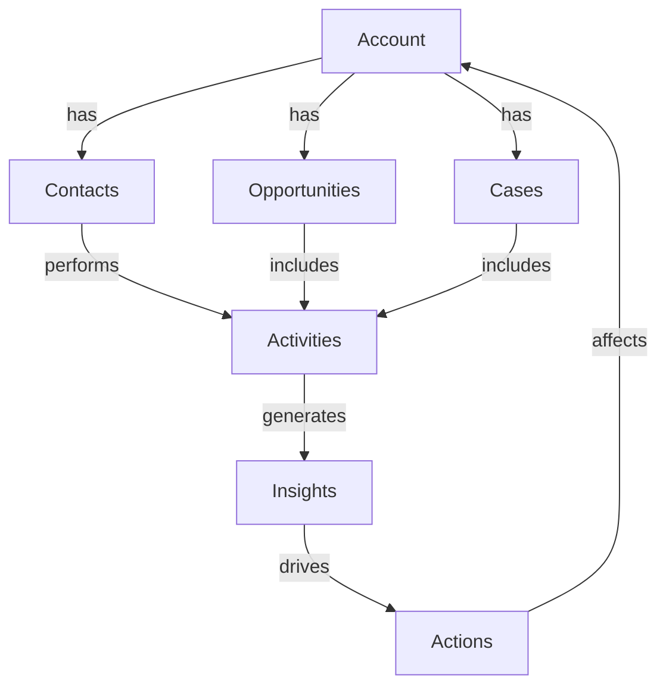

# Dynamics 365 Enhancement Promptset
## AI-Powered Prompts for Datapoint Collection and Artifact Enhancement

**Version:** 1.0.0  
**Date:** 2026-01-13  
**Target:** Copilot Agent System  
**Priority:** HIGH

---

## 🎯 Core Prompt Templates

### Prompt 1: Data Collection Initialization

```
@copilot Initialize Dynamics 365 data collection pipeline

**Context**: Phase 1 of D365 Integration
**Objective**: Set up automated data extraction from Dynamics 365 CRM

**Requirements**:
1. Create D365 API connector with OAuth 2.0 authentication
2. Implement multi-entity data extraction for:
   - Accounts, Contacts, Opportunities, Leads
   - Cases, Activities, System Users, Audit Logs
3. Add rate limiting and retry logic
4. Include error handling and comprehensive logging
5. Support batch processing for large datasets

**Deliverables**:
- `tools/dynamics365/api_connector.py` (~400 lines)
- Configuration file: `config/d365_config.yaml`
- Unit tests: `tests/d365/test_api_connector.py`
- Documentation: `docs/d365/api_connector.md`

**Success Criteria**:
- Successfully authenticate to D365 tenant
- Extract 10,000+ records per minute
- Zero data loss during collection
- <5% API error rate
- Full audit trail

**Integration Points**:
- ML Threat Detector: Feed security events
- Monitoring Dashboard: Display collection metrics
- Cognitive Brain: Learn from D365 patterns

**Timeline**: 1 week
```

---

### Prompt 2: Artifact Enhancement

```
@copilot Implement Dynamics 365 artifact processor and enrichment engine

**Context**: Phase 1 of D365 Integration - Artifact Processing
**Objective**: Transform raw D365 data into enriched, actionable artifacts

**Requirements**:
1. Data normalization and validation
2. Artifact enrichment with metadata:
   - Timestamps, source tracking
   - Quality scores, confidence levels
   - Relationship mapping, context tags
3. Deduplication and intelligent merging
4. Schema transformation for standardization
5. PII detection and masking for compliance

**Deliverables**:
- `tools/dynamics365/artifact_processor.py` (~350 lines)
- `tools/dynamics365/enrichment_engine.py` (~300 lines)
- Quality scoring model: `models/d365_quality_score.pkl`
- Tests: `tests/d365/test_artifact_processor.py`
- Schema definitions: `schemas/d365_artifacts.json`

**Artifact Types to Process**:
```yaml
entities:
  - accounts (customer master data)
  - contacts (individual records)
  - opportunities (sales pipeline)
transactions:
  - orders, invoices, payments
analytics:
  - dashboards, reports, insights
security:
  - audit logs, access logs, events
```

**Enrichment Strategies**:
1. **Temporal Enrichment**: Add time-based context
2. **Geospatial Enrichment**: Location-based insights
3. **Behavioral Enrichment**: User interaction patterns
4. **Predictive Enrichment**: ML-based predictions
5. **Relationship Enrichment**: Graph-based connections

**Success Criteria**:
- 99%+ data quality score
- <100ms per artifact processing
- Zero PII leaks
- 100% schema compliance
- Full lineage tracking

**Timeline**: 1 week
```

---

### Prompt 3: ML Threat Detection for D365

```
@copilot Build Dynamics 365 threat detection model using ML

**Context**: Phase 2 of D365 Integration - Security Analytics
**Objective**: Detect anomalies, threats, and compliance violations in D365 environments

**Requirements**:
1. Train ML model on D365 security events:
   - Random Forest + Isolation Forest ensemble
   - 25 security-relevant features
   - 90%+ anomaly detection accuracy
2. Implement real-time threat scoring
3. Pattern recognition for:
   - Unauthorized access attempts
   - Data exfiltration risks
   - Privilege escalation
   - Compliance violations (GDPR, SOX)

**Security Patterns to Detect**:
```python
THREAT_PATTERNS = {
    "unauthorized_access": [
        "unusual_login_times",
        "geographic_anomalies",
        "failed_login_spikes",
        "privilege_escalation"
    ],
    "data_risks": [
        "bulk_exports",
        "unauthorized_record_access",
        "pii_exposure",
        "deletion_anomalies"
    ],
    "compliance_violations": [
        "gdpr_breaches",
        "sox_gaps",
        "policy_violations",
        "audit_tampering"
    ]
}
```

**Deliverables**:
- `tools/dynamics365/threat_detector.py` (~350 lines)
- ML model: `models/d365_threat_model.pkl`
- Feature extraction: `tools/dynamics365/security_features.py`
- Tests: `tests/d365/test_threat_detector.py` (90%+ accuracy)
- Training data collector: `scripts/collect_d365_security_data.py`

**Success Criteria**:
- 90%+ precision in anomaly detection
- 95%+ recall for critical threats
- <500ms prediction latency
- Real-time scoring capability
- Zero false positives for critical alerts

**Integration**:
- Connect to existing ML Threat Detector
- Feed predictions to Auto-Remediation system
- Display alerts on Monitoring Dashboard
- Update Cognitive Brain with learned patterns

**Timeline**: 2 weeks
```

---

### Prompt 4: Predictive Analytics Engine

```
@copilot Create predictive analytics engine for Dynamics 365

**Context**: Phase 2 of D365 Integration - Business Intelligence
**Objective**: Build ML models for sales forecasting, churn prediction, and lead scoring

**Requirements**:
1. **Sales Forecasting Model**:
   - Algorithm: ARIMA + LSTM hybrid
   - Target accuracy: 85%+
   - Input: Historical sales, seasonality, market trends
   
2. **Churn Prediction Model**:
   - Algorithm: XGBoost classifier
   - Target accuracy: 90%+
   - Input: Customer behavior, engagement, support history

3. **Lead Scoring Model**:
   - Algorithm: Gradient Boosting regressor
   - Target accuracy: 88%+
   - Input: Lead attributes, source, engagement, firmographics

**Deliverables**:
- `tools/dynamics365/predictive_analytics.py` (~400 lines)
- Sales forecast model: `models/d365_sales_forecast.pkl`
- Churn prediction model: `models/d365_churn_prediction.pkl`
- Lead scoring model: `models/d365_lead_scoring.pkl`
- Feature engineering: `tools/dynamics365/feature_engineering.py`
- Tests: `tests/d365/test_predictive_analytics.py`
- API endpoints: `api/d365_predictions.py`

**Model Specifications**:
```yaml
sales_forecast:
  type: time_series
  algorithm: ARIMA + LSTM
  features: 30
  accuracy_target: 0.85
  prediction_horizon: 90_days

churn_prediction:
  type: binary_classification
  algorithm: XGBoost
  features: 40
  accuracy_target: 0.90
  risk_levels: [low, medium, high, critical]

lead_scoring:
  type: regression
  algorithm: GradientBoosting
  features: 35
  accuracy_target: 0.88
  score_range: [0, 100]
```

**Success Criteria**:
- All models meet accuracy targets
- <1s prediction latency
- Daily model retraining
- Feature importance tracking
- A/B testing capability

**Timeline**: 2 weeks
```

---

### Prompt 5: Cognitive Brain D365 Module

```
@copilot Integrate Dynamics 365 cognitive module into Cognitive Brain

**Context**: Phase 3 of D365 Integration - AI Decision Support
**Objective**: Build cognitive capabilities for D365 that learn, reason, and adapt

**Requirements**:
1. **Pattern Recognition**:
   - Identify successful sales strategies
   - Learn optimal service response patterns
   - Discover workflow efficiency patterns
   - Recognize customer behavior trends

2. **Reasoning Engine**:
   - Next best action recommendations
   - Risk assessment for opportunities
   - Resource allocation optimization
   - Priority determination logic

3. **Adaptive Learning**:
   - Personalized recommendations per user
   - Dynamic routing rule optimization
   - Context-aware automation
   - Continuous model improvement

**Deliverables**:
- `.github/agents/cognitive-brain-agent/modules/d365_cognitive.py` (~450 lines)
- Knowledge base: `data/d365_knowledge_base.db`
- Decision rules: `config/d365_decision_rules.yaml`
- Learning pipeline: `pipelines/d365_learning.py`
- Tests: `tests/cognitive_brain/test_d365_module.py`

**Cognitive Functions**:
```python
COGNITIVE_CAPABILITIES = {
    "learning": {
        "user_behavior_patterns": "continuous",
        "successful_strategies": "reinforcement",
        "effective_responses": "supervised",
        "optimal_workflows": "optimization"
    },
    "reasoning": {
        "next_best_action": "rule_based + ml",
        "risk_assessment": "ensemble_ml",
        "resource_allocation": "optimization",
        "priority_determination": "multi_criteria"
    },
    "adaptation": {
        "personalization": "collaborative_filtering",
        "dynamic_rules": "online_learning",
        "context_awareness": "contextual_bandits",
        "model_updates": "incremental_learning"
    }
}
```

**Success Criteria**:
- 80%+ recommendation acceptance rate
- 30%+ improvement in decision speed
- 25%+ increase in positive outcomes
- Zero degradation in existing metrics
- Full explainability of decisions

**Integration**:
- Update Cognitive Brain to v12.0
- Add D365 to cognitive brain objectives
- Connect to ML Threat Detector
- Feed insights to Monitoring Dashboard

**Timeline**: 2 weeks
```

---

### Prompt 6: Knowledge Graph Construction

```
@copilot Build Dynamics 365 knowledge graph for entity relationships and insights

**Context**: Phase 3 of D365 Integration - Advanced Analytics
**Objective**: Create comprehensive knowledge graph of D365 entities and relationships

**Requirements**:
1. Entity extraction and relationship mapping
2. Customer 360-degree view construction
3. Influence network analysis
4. Pattern discovery through graph algorithms
5. Semantic search capabilities

**Deliverables**:
- `tools/dynamics365/knowledge_graph.py` (~350 lines)
- Graph database setup: Neo4j or similar
- Entity resolution engine: `tools/dynamics365/entity_resolution.py`
- Graph algorithms: `algorithms/d365_graph_analysis.py`
- Visualization: `ui/d365_knowledge_graph_viewer.html`
- Tests: `tests/d365/test_knowledge_graph.py`

**Graph Schema**:


**Graph Analytics**:
- Centrality measures (identify key accounts)
- Community detection (customer segments)
- Path finding (optimal engagement sequences)
- Similarity scoring (lookalike modeling)
- Influence propagation (viral coefficient)

**Success Criteria**:
- 1M+ nodes and 10M+ edges
- <100ms graph query response
- 95%+ entity resolution accuracy
- Real-time graph updates
- Interactive visualization

**Timeline**: 2 weeks
```

---

### Prompt 7: Monitoring Dashboard Enhancement

```
@copilot Enhance monitoring dashboard with Dynamics 365 metrics and alerts

**Context**: Phase 4 of D365 Integration - Observability
**Objective**: Add comprehensive D365 monitoring to existing dashboard

**Requirements**:
1. Real-time metrics visualization
2. Security event monitoring
3. Performance tracking
4. Compliance status dashboard
5. User activity analytics
6. Predictive alerts

**Metrics to Track**:
```yaml
business_metrics:
  - active_users: gauge
  - lead_conversion_rate: percentage
  - opportunity_win_rate: percentage
  - case_resolution_time: duration
  - customer_satisfaction: score

technical_metrics:
  - api_call_volume: counter
  - api_response_time: histogram
  - error_rate: percentage
  - storage_usage: gauge
  - sync_status: boolean

security_metrics:
  - failed_logins: counter
  - privilege_changes: counter
  - data_exports: counter
  - suspicious_activities: counter
  - compliance_violations: counter
```

**Deliverables**:
- `monitoring/d365_dashboard.py` (~400 lines)
- Dashboard UI: `monitoring/ui/d365_dashboard.html`
- Alert system: `tools/dynamics365/alert_system.py` (~250 lines)
- Metrics collector: `monitoring/d365_metrics_collector.py`
- Tests: `tests/monitoring/test_d365_dashboard.py`

**Success Criteria**:
- 30s metrics refresh interval
- <200ms dashboard load time
- 100% alert delivery
- Mobile-responsive UI
- Real-time updates via WebSocket

**Timeline**: 1 week
```

---

## 🔄 Execution Workflow

### Step 1: Initial Setup (Day 1)
```
@copilot Set up Dynamics 365 development environment

Create:
- D365 developer tenant
- Service principal with API permissions
- OAuth 2.0 application registration
- Development/staging/production environments
- CI/CD pipelines for D365 components
```

### Step 2: Data Pipeline (Week 1-2)
```
Execute Prompts 1 & 2 in sequence:
1. Initialize data collection (Prompt 1)
2. Implement artifact processing (Prompt 2)

Validate:
- Data flowing end-to-end
- Quality metrics met
- No PII leaks
- Performance targets achieved
```

### Step 3: ML Models (Week 3-4)
```
Execute Prompts 3 & 4 in parallel:
1. Build threat detection model (Prompt 3)
2. Create predictive analytics (Prompt 4)

Validate:
- Accuracy targets met (90%+, 85%+, 88%+)
- Models in production
- Real-time predictions working
- Integration complete
```

### Step 4: Cognitive Enhancement (Week 5-6)
```
Execute Prompts 5 & 6 in sequence:
1. Integrate cognitive module (Prompt 5)
2. Build knowledge graph (Prompt 6)

Validate:
- Cognitive brain updated to v12.0
- D365 objectives documented
- Knowledge graph operational
- Learning loop active
```

### Step 5: Monitoring (Week 7-8)
```
Execute Prompt 7:
1. Enhance monitoring dashboard

Validate:
- All D365 metrics displayed
- Alerts operational
- Dashboard performance met
- User acceptance passed
```

---

## 📋 Integration Checklist

### Pre-Integration
- [ ] D365 tenant access confirmed
- [ ] API permissions granted
- [ ] Service principal created
- [ ] Authentication tested
- [ ] Network connectivity verified

### During Integration
- [ ] All 7 prompts executed
- [ ] Code reviewed and approved
- [ ] Tests passing (95%+ coverage)
- [ ] Security scan passed
- [ ] Performance validated

### Post-Integration
- [ ] Production deployment complete
- [ ] Monitoring active
- [ ] Alerts configured
- [ ] Documentation published
- [ ] Training completed
- [ ] Cognitive brain v12.0 released

---

## 🎯 Success Validation

### Technical Validation
- [ ] 10,000+ D365 records/minute collection rate
- [ ] 90%+ ML threat detection accuracy
- [ ] 85%+ predictive analytics accuracy
- [ ] <500ms prediction latency
- [ ] 99.9% system uptime

### Business Validation
- [ ] 15%+ lead conversion improvement
- [ ] 20%+ case resolution time reduction
- [ ] 50%+ security incident reduction
- [ ] 40%+ manual data entry reduction
- [ ] 30%+ decision-making speed improvement

### Cognitive Brain Validation
- [ ] D365 module integrated
- [ ] Pattern learning active
- [ ] Decision support operational
- [ ] Adaptive recommendations working
- [ ] v12.0 objectives met

---

## 🔗 Cognitive Brain Objectives Update

**Add to Cognitive Brain v12.0:**

```yaml
dynamics_365_objectives:
  primary:
    - Intelligent D365 datapoint collection
    - Real-time artifact enhancement
    - ML-powered threat detection
    - Predictive business analytics
    - Cognitive decision support
  
  secondary:
    - Knowledge graph construction
    - Pattern recognition & learning
    - Automated insight generation
    - Proactive anomaly detection
    - Continuous optimization
  
  success_metrics:
    - Collection rate: 10,000+ records/min
    - Threat detection: 90%+ accuracy
    - Prediction accuracy: 85%+
    - Decision improvement: 30%+
    - ROI: 3x within 12 months
```

---

**End of Dynamics 365 Enhancement Promptset**

*To be used in conjunction with DYNAMICS_365_ENHANCEMENT_PLANSET.md*  
*All prompts ready for immediate execution by Copilot Agent System*  
*Timeline: 8 weeks | Priority: HIGH | ROI: 3x*
