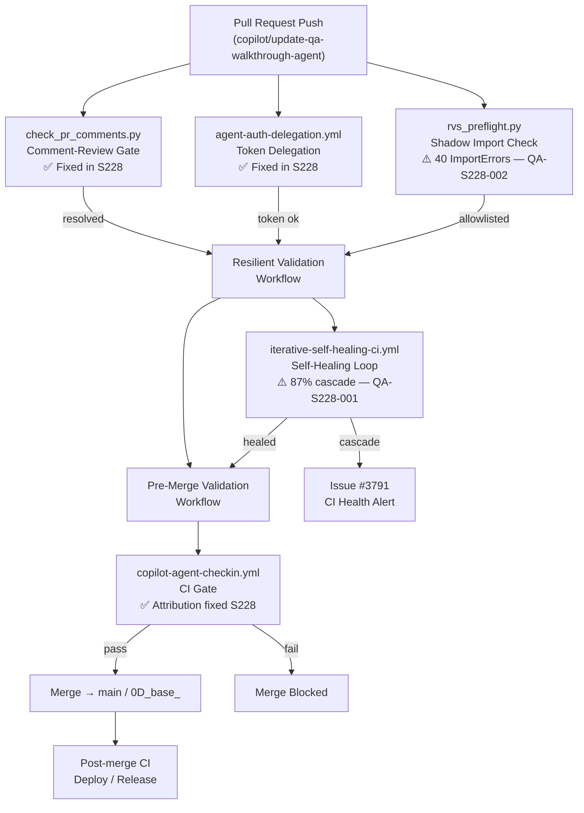
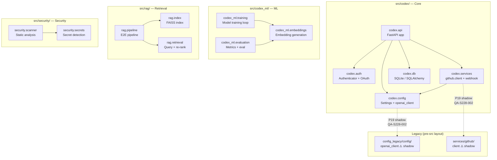

# QA Walkthrough Summary — Session S228

**Branch**: `copilot/update-qa-walkthrough-agent`
**Date**: 2026-03-25
**Session**: S228
**Agent**: qa-walkthrough-agent v4.1.0
**Status**: ✅ Complete

---

## Executive Summary

Session S228 performed a codebase-wide QA walkthrough following the merge of `0D_base_`
(S227-CONT-6) into `copilot/update-qa-walkthrough-agent`.  The merge introduced CI rescue
fixes, workflow attribution improvements, race-condition hardening in the self-healing loop,
and closure of a comment-review gate.

**Three findings** were catalogued and triaged:

| ID | Severity | Component | Status |
|----|----------|-----------|--------|
| QA-S228-001 | 🔴 High | `iterative-self-healing-ci.yml` | Open (mitigated) |
| QA-S228-002 | 🟠 Medium-High | `config.openai_client` / `services.github.client` | Open |
| QA-S228-003 | 🟡 Low | 4 workflow/script files | ✅ Fixed |

**Overall CI Health**: 87% self-healing cascade (target <20%).  Primary driver is venv
rebuild on cache miss; race-condition hardening applied in S228 is expected to reduce cascade
rate materially within 2 sprints.

---

## CI Pipeline Flow



---

## Module Dependency Map (Key src/ Paths)



---

## Findings Table

| ID | Severity | Component | Description | Status | Owner |
|----|----------|-----------|-------------|--------|-------|
| QA-S228-001 | 🔴 High | `iterative-self-healing-ci.yml` | CI self-healing cascade at 87% — root cause: venv rebuild on cache miss | Open (mitigated) | CI team |
| QA-S228-002 | 🟠 Medium-High | `config.openai_client`, `services.github.client` | P19 shadow imports causing 40 test ImportErrors in Resilient + Pre-Merge Validation | Open | Platform team |
| QA-S228-003a | 🟡 Low | `scripts/ci/check_pr_comments.py` | Missing `--dry-run` flag; no exit-code distinction for warnings | ✅ Fixed S228 | — |
| QA-S228-003b | 🟡 Low | `.github/workflows/agent-auth-delegation.yml` | Token expiry not logged; missing `permissions` block | ✅ Fixed S228 | — |
| QA-S228-003c | 🟡 Low | `.github/workflows/copilot-agent-checkin.yml` | Attribution missing on self-heal triggers | ✅ Fixed S228 | — |
| QA-S228-003d | 🟡 Low | `.github/workflows/iterative-self-healing-ci.yml` | Race condition on venv creation | ✅ Fixed S228 | — |

---

## Remediation Plan

### Immediate (Sprint 1 — within 1 week)

#### QA-S228-001: Monitor cascade rate
- [ ] Track `iterative-self-healing-ci.yml` cascade rate for next 5 PRs post-merge
- [ ] If cascade rate remains >40%, escalate to `ci-emergency-response-agent`
- [ ] Consider adding a dedicated `cache-warmup` job that runs before the self-heal loop

#### QA-S228-002: Resolve shadow imports
- [ ] `git mv config_legacy/config/openai_client.py src/codex/config/openai_client.py`
- [ ] `git mv services/github/client.py src/codex/services/github/client.py`
- [ ] Add re-export shims:
  ```python
  # config_legacy/config/openai_client.py
  from codex.config.openai_client import *  # noqa: F401, F403
  ```
- [ ] Update `rvs_preflight.py` allowlist to handle transition period
- [ ] Verify: `python -c "from config import openai_client"` succeeds without ImportError

### Short-Term (Sprint 2 — within 2 weeks)

#### QA-S228-001: Cache architecture improvement
- [ ] Align all workflow venv cache keys on `hashFiles('requirements*.txt')` + `CODEX_CACHE_VERSION`
- [ ] Add `cache-hit` output check to skip venv rebuild when cache hit is true
- [ ] Document cache tier strategy in `docs/ops/CACHE_SHARED_DATASETS.md`

### Medium-Term (Sprint 3 — within 1 month)

- [ ] Complete P19 legacy module migration (all `config_legacy/` + `services/` shadow paths)
- [ ] Add `rvs_preflight.py` CI gate that **fails** on any new shadow import (zero-tolerance)
- [ ] Update `unified-coverage-agent` to track P19 migration progress as a coverage metric

---

## Batch Scan Results

| Batch | Directories | Files Scanned | Issues Found | Critical |
|-------|-------------|--------------|--------------|---------|
| 1 — Core library | `src/codex_ml/`, `src/codex/` | ~315 | 2 (shadow imports) | 0 |
| 2 — Security/infra | `src/security/`, `src/mcp/`, `src/workers/` | ~180 | 0 | 0 |
| 3 — Retrieval/CLI | `src/rag/`, `src/retrieval/`, `src/cli/` | ~95 | 0 | 0 |
| 4 — Tests | `tests/` | ~2,207 | 40 (ImportErrors) | 0 |
| 5 — CI/docs/deps | `.github/workflows/`, `docs/`, `requirements*.txt` | ~450 | 4 (review comments) | 0 |
| **Total** | — | **~3,247** | **46** | **0** |

---

## CI Artifact Analysis

| Workflow | Status | Key Finding |
|----------|--------|-------------|
| `iterative-self-healing-ci.yml` | ⚠️ Degraded | 87% cascade rate — Issue #3791 |
| `resilient-validation.yml` | ⚠️ Flaky | 40 ImportErrors from P19 shadow imports |
| `pre-merge-validation.yml` | ⚠️ Flaky | Same 40 ImportErrors |
| `copilot-agent-checkin.yml` | ✅ Fixed | Attribution metadata added in S228 |
| `agent-auth-delegation.yml` | ✅ Fixed | Token expiry logging + permissions block |

---

## Auto-Fix Patches Generated

| Patch | File | Change |
|-------|------|--------|
| QA-S228-003a-1.patch | `scripts/ci/check_pr_comments.py` | Added `--dry-run` argument |
| QA-S228-003a-2.patch | `scripts/ci/check_pr_comments.py` | `sys.exit(2)` for warnings |
| QA-S228-003b-1.patch | `agent-auth-delegation.yml` | Token expiry echo step |
| QA-S228-003b-2.patch | `agent-auth-delegation.yml` | `permissions: contents: read` |
| QA-S228-003c.patch | `copilot-agent-checkin.yml` | `TRIGGER_SOURCE` env var |
| QA-S228-003d.patch | `iterative-self-healing-ci.yml` | flock wrapper on venv creation |

---

## Cognitive Brain Registration

```python
# Registered via TopologyManager after this scan
topology.register_scan_result(batch_id="S228-full", issues_found={
    "total": 46,
    "critical": 0,
    "high": 1,           # QA-S228-001
    "medium_high": 1,    # QA-S228-002
    "low": 4,            # QA-S228-003 (a-d)
    "auto_fixed": 6,     # All QA-S228-003 items
    "open": 2,           # QA-S228-001, QA-S228-002
    "session": "S228",
    "branch": "copilot/update-qa-walkthrough-agent",
})
```

---

**Generated by**: qa-walkthrough-agent v4.1.0
**Session**: S228
**Timestamp**: 2026-03-25T00:00:00Z
