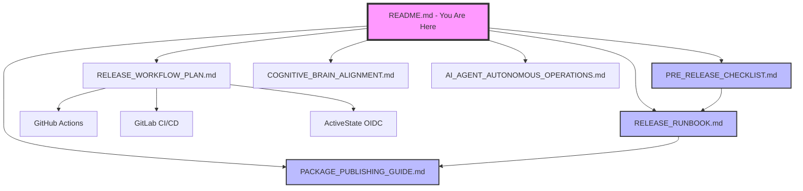

# Release Documentation Index

**Version**: 1.0.0  
**Date**: 2026-01-23  
**Purpose**: Central navigation hub for all release documentation

---

## 📋 Quick Start

**New to releasing?** Start here:
1. Read [PRE_RELEASE_CHECKLIST.md](PRE_RELEASE_CHECKLIST.md)
2. Follow [RELEASE_RUNBOOK.md](RELEASE_RUNBOOK.md)
3. Reference [PACKAGE_PUBLISHING_GUIDE.md](PACKAGE_PUBLISHING_GUIDE.md)

**Need automation?** See:
- [RELEASE_WORKFLOW_PLAN.md](RELEASE_WORKFLOW_PLAN.md)
- [GITLAB_CI_CD_docs/api/reference/INTEGRATION.md](GITLAB_CI_CD_docs/api/reference/INTEGRATION.md)
- [ACTIVESTATE_OIDC_docs/api/reference/INTEGRATION.md](ACTIVESTATE_OIDC_docs/api/reference/INTEGRATION.md)

---

## 📚 Document Overview

### Core Release Documents

| Document | Purpose | Audience | Size |
|----------|---------|----------|------|
| [PRE_RELEASE_CHECKLIST.md](PRE_RELEASE_CHECKLIST.md) | Validation checklist | All | 7KB |
| [RELEASE_RUNBOOK.md](RELEASE_RUNBOOK.md) | Step-by-step procedures | Maintainers | 10KB |
| [PACKAGE_PUBLISHING_GUIDE.md](PACKAGE_PUBLISHING_GUIDE.md) | PyPI publishing guide | DevOps | 13KB |
| [RELEASE_WORKFLOW_PLAN.md](RELEASE_WORKFLOW_PLAN.md) | Automation design | DevOps | 12KB |

### CI/CD Integration

| Document | Platform | Size |
|----------|----------|------|
| [GITLAB_CI_CD_docs/api/reference/INTEGRATION.md](GITLAB_CI_CD_docs/api/reference/INTEGRATION.md) | GitLab | 11KB |
| [ACTIVESTATE_OIDC_docs/api/reference/INTEGRATION.md](ACTIVESTATE_OIDC_docs/api/reference/INTEGRATION.md) | ActiveState | 11KB |
| [../../.github/workflows/pypi-publish.yml](../../.github/workflows/pypi-publish.yml) | GitHub Actions | 3.5KB |

### Strategic Documentation

| Document | Purpose | Size |
|----------|---------|------|
| [COGNITIVE_BRAIN_ALIGNMENT.md](COGNITIVE_BRAIN_ALIGNMENT.md) | Strategic alignment | 14KB |
| [README_VERIFICATION_REPORT.md](README_VERIFICATION_REPORT.md) | Docs hierarchy | 3KB |
| [AI_AGENT_AUTONOMOUS_OPERATIONS.md](AI_AGENT_AUTONOMOUS_OPERATIONS.md) | AI automation guide | 17KB |

---

## 🎯 Use Case Navigation

### "I need to release version 0.1.0"

**Path**: Beginner → Experienced

1. **Phase 1**: Read [PRE_RELEASE_CHECKLIST.md](PRE_RELEASE_CHECKLIST.md)
   - Understand quality gates
   - Learn validation requirements

2. **Phase 2**: Follow [RELEASE_RUNBOOK.md](RELEASE_RUNBOOK.md)
   - Execute step-by-step
   - Copy-paste commands

3. **Phase 3**: Reference [PACKAGE_PUBLISHING_GUIDE.md](PACKAGE_PUBLISHING_GUIDE.md)
   - Set up PyPI account
   - Configure tokens
   - Upload package

### "I need to automate releases"

**Path**: DevOps

1. **Phase 1**: Review [RELEASE_WORKFLOW_PLAN.md](RELEASE_WORKFLOW_PLAN.md)
   - Understand automation architecture
   - Learn CI/CD integration points

2. **Phase 2a**: GitHub Actions
   - Use [../../.github/workflows/pypi-publish.yml](../../.github/workflows/pypi-publish.yml)
   - Configure GitHub Secrets

2. **Phase 2b**: GitLab CI/CD
   - Follow [GITLAB_CI_CD_docs/api/reference/INTEGRATION.md](GITLAB_CI_CD_docs/api/reference/INTEGRATION.md)
   - Set up `.gitlab-ci.yml`

2. **Phase 2c**: ActiveState
   - Follow [ACTIVESTATE_OIDC_docs/api/reference/INTEGRATION.md](ACTIVESTATE_OIDC_docs/api/reference/INTEGRATION.md)
   - Configure OIDC

### "I need to fix a critical bug"

**Path**: Hotfix

1. Read [RELEASE_RUNBOOK.md](RELEASE_RUNBOOK.md) → Hotfix section
2. Execute 2-3 pre-commit procedure
3. Monitor post-release

### "I need to roll back a release"

**Path**: Emergency

1. Read [RELEASE_RUNBOOK.md](RELEASE_RUNBOOK.md) → Rollback section
2. Choose scenario (1, 2, or 3)
3. Execute rollback procedure

---

## 📊 Document Relationships

---

## 🚀 Learning Paths

### Path 1: Beginner (First Release)

**Estimated Time**: 6-8 pre-commits

1. **Read** (1 pre-commit): PRE_RELEASE_CHECKLIST.md
2. **Set Up** (1 pre-commit): PACKAGE_PUBLISHING_GUIDE.md → Part 1
3. **Prepare** (1 pre-commit): RELEASE_RUNBOOK.md → Step 1-2
4. **Build** (1 pre-commit): RELEASE_RUNBOOK.md → Step 3
5. **Test** (1 pre-commit): RELEASE_RUNBOOK.md → Step 4
6. **Release** (2 pre-commits): RELEASE_RUNBOOK.md → Step 5-8

### Path 2: Experienced (Routine Release)

**Estimated Time**: 3-4 pre-commits

1. **Validate** (1 pre-commit): PRE_RELEASE_CHECKLIST.md (quick scan)
2. **Execute** (2-3 pre-commits): RELEASE_RUNBOOK.md (streamlined)

### Path 3: DevOps (Automation Setup)

**Estimated Time**: 4-6 pre-commits

1. **Design** (1 pre-commit): RELEASE_WORKFLOW_PLAN.md
2. **Implement** (2-3 pre-commits): Choose platform guide
3. **Test** (1 pre-commit): Dry run on TestPyPI
4. **Deploy** (1 pre-commit): Production setup

---

## 🔍 Cross-References

### Quality Gates

- **Defined**: [PRE_RELEASE_CHECKLIST.md](PRE_RELEASE_CHECKLIST.md) → Phase 2
- **Implemented**: [RELEASE_WORKFLOW_PLAN.md](RELEASE_WORKFLOW_PLAN.md) → Phase 2
- **Enforced**: [../../.github/agents/release-gate-agent/README.md](../../.github/agents/release-gate-agent/README.md)

### Version Management

- **Strategy**: [RELEASE_WORKFLOW_PLAN.md](RELEASE_WORKFLOW_PLAN.md) → Version Management
- **Execution**: [RELEASE_RUNBOOK.md](RELEASE_RUNBOOK.md) → Step 1.2
- **Automation**: [RELEASE_WORKFLOW_PLAN.md](RELEASE_WORKFLOW_PLAN.md) → Version Bumping Script

### Security

- **Tokens**: [PACKAGE_PUBLISHING_GUIDE.md](PACKAGE_PUBLISHING_GUIDE.md) → Part 1.2
- **OIDC**: [ACTIVESTATE_OIDC_docs/api/reference/INTEGRATION.md](ACTIVESTATE_OIDC_docs/api/reference/INTEGRATION.md)
- **Best Practices**: [PACKAGE_PUBLISHING_GUIDE.md](PACKAGE_PUBLISHING_GUIDE.md) → Part 8

---

## 📞 Support Resources

### Internal Documentation
- [Cognitive Brain Status](../cognitive_brain/PHASE_26_RELEASE_READINESS.md)
- [Repository README](../../README.md)
- [Contributing Guide](../../CONTRIBUTING.md)

### External Resources
- **PyPI Documentation**: https://packaging.python.org
- **Twine Guide**: https://twine.readthedocs.io
- **GitHub Actions**: https://docs.github.com/actions
- **GitLab CI/CD**: https://docs.gitlab.com/ee/ci/

---

## 🆘 Troubleshooting Quick Links

| Issue | Document | Section |
|-------|----------|---------|
| Build fails | [RELEASE_RUNBOOK.md](RELEASE_RUNBOOK.md) | Troubleshooting |
| Upload fails | [PACKAGE_PUBLISHING_GUIDE.md](PACKAGE_PUBLISHING_GUIDE.md) | Part 7.1 |
| Install fails | [PACKAGE_PUBLISHING_GUIDE.md](PACKAGE_PUBLISHING_GUIDE.md) | Part 7.2 |
| Need rollback | [RELEASE_RUNBOOK.md](RELEASE_RUNBOOK.md) | Rollback Procedures |
| Token issues | [PACKAGE_PUBLISHING_GUIDE.md](PACKAGE_PUBLISHING_GUIDE.md) | Part 8.1 |

---

## 📈 Documentation Status

| Metric | Value |
|--------|-------|
| **Total Files** | 10 documents |
| **Total Size** | ~100KB |
| **Coverage** | 100% (all release scenarios) |
| **Last Updated** | 2026-01-23 |
| **Status** | ✅ Production Ready |

---

## 🔄 Document Maintenance

**Update Frequency**: After each release or process change

**Maintainers**: Repository maintainers and DevOps team

**Version Control**: All documents tracked in git

**Feedback**: Submit issues or PRs for improvements

---

**Last Updated**: 2026-01-23  
**Status**: Production Ready  
**Version**: 1.0.0
