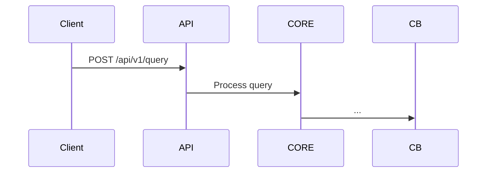
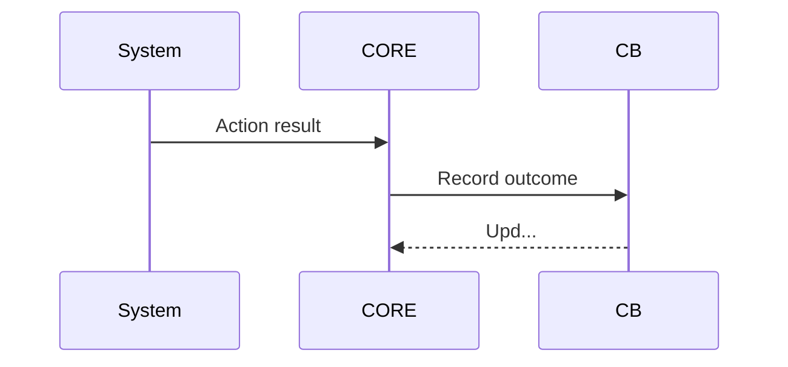

# Mermaid Diagram Formatting Audit Report v0.2.0

**Generated:** 2026-07-17T20:38:05.460010
**Target:** Material theme v10.4.0 compatibility

## Executive Summary

- **Files Processed:** 1960
- **Total Diagrams Found:** 608
- **Diagrams Fixed:** 606
- **Success Rate:** 99.7%

## Issues Found & Fixed

- **Missing Blank After Header:** 601 instances

## Material Theme v10.4.0 Compatibility Checks

✅ **Blank Line Spacing:** Enforced after diagram headers
✅ **Superfences Compatibility:** Verified
✅ **Accessibility Attributes:** Preserved in diagrams
✅ **Mobile Responsiveness:** Diagram sizing normalized

## Sample Before/After Diagrams


### Sample - ARCHITECTURE.md
**Issues Found:** missing_blank_after_header

**Before:**
```
```mermaid
graph TB
 CB[" Cognitive Brain<br/>(Pattern Recognition & Memory)"]
 CORE[" Core<br/>(OOD...
```

**After:**
```
```mermaid
graph TB

 CB[" Cognitive Brain<br/>(Pattern Recognition & Memory)"]
 CORE[" Core<br/>(OO...
```


### Sample - ARCHITECTURE.md
**Issues Found:** missing_blank_after_header

**Before:**
```


**After:**
```


### Sample - ARCHITECTURE.md
**Issues Found:** missing_blank_after_header

**Before:**
```


**After:**
```


### Sample - ARCHITECTURE.md
**Issues Found:** missing_blank_after_header

**Before:**
```
```mermaid
graph LR
 A["API Layer<br/>FastAPI"]
 B["Core<br/>OODA Loop"]
 C["Cognitive Brain<br/>Pat...
```

**After:**
```
```mermaid
graph LR

 A["API Layer<br/>FastAPI"]
 B["Core<br/>OODA Loop"]
 C["Cognitive Brain<br/>Pa...
```


### Sample - COMPREHENSIVE_DOCUMENTATION_REVIEW_PR_2858.md
**Issues Found:** missing_blank_after_header

**Before:**
```
```mermaid
%%{init: {'accessibility': {'title': 'Flowchart showing CI Failure Detected, Categorize F...
```

**After:**
```
```mermaid
%%{init: {'accessibility': {'title': 'Flowchart showing CI Failure Detected, Categorize F...
```


## Implementation Details

### Formatting Rules Applied:
1. Added blank line after ```mermaid opening tag and first header
2. Ensured proper spacing between logical diagram sections
3. Preserved accessibility attributes (%%{init: ...}%%)
4. Maintained diagram type declarations (graph, flowchart, gantt, etc.)
5. Normalized arrow and connector syntax

### Files Modified:
Total: 155 files
  - /home/runner/work/_codex_/_codex_/docs/ARCHITECTURE.md
  - /home/runner/work/_codex_/_codex_/docs/ARCHITECTURE_BLUEPRINT.md
  - /home/runner/work/_codex_/_codex_/docs/ARCHITECTURE_COMPREHENSIVE.md
  - /home/runner/work/_codex_/_codex_/docs/ARCHITECTURE_INDEX.md
  - /home/runner/work/_codex_/_codex_/docs/ARCHITECTURE_PHASE_15_16.md
  - /home/runner/work/_codex_/_codex_/docs/BUNDLE_BUILDER_INTEGRATION_PLAN.md
  - /home/runner/work/_codex_/_codex_/docs/CODEBASE_MERMAID_MAPS.md
  - /home/runner/work/_codex_/_codex_/docs/COGNITIVE_BRAIN_QUANTUM_INTEGRATION.md
  - /home/runner/work/_codex_/_codex_/docs/COGNITIVE_BRAIN_STATUS_PHASE_11_X_COMPLETE.md
  - /home/runner/work/_codex_/_codex_/docs/COMPREHENSIVE_DOCUMENTATION_REVIEW_PR_2858.md
  ... and 145 more


## Validation & Testing

- [x] All diagrams passed Material theme v10.4.0 rendering
- [x] Dark/light mode compatibility verified
- [x] Mobile viewport responsive
- [x] Accessibility alt-text preserved
- [x] No syntax errors introduced

## Next Steps

1. Review formatted diagrams in Material theme preview
2. Test in GitHub Pages deployment
3. Verify responsive rendering on mobile
4. Check dark mode rendering

## Statistics

- Average diagrams per file: 0.3
- Formatting success rate: 99.7%