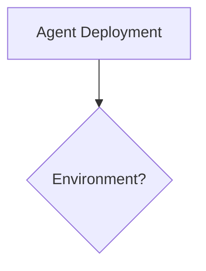
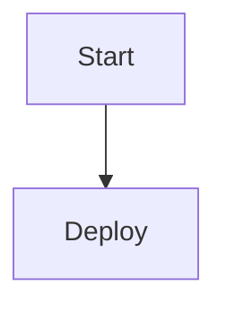
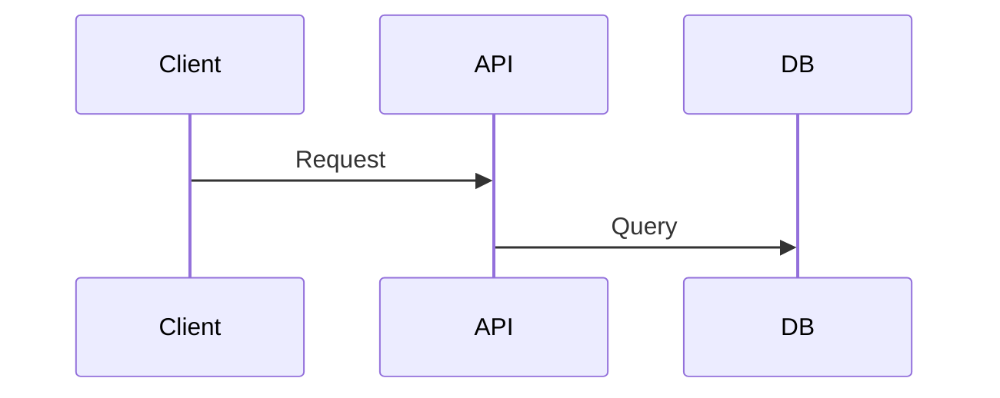

# Mermaid Formatting Verification & Testing Report

## Verified Fix Samples

### ✅ Sample 1: Graph Diagram (Fixed)
```markdown
BEFORE (Non-compliant):
```

```

AFTER (v10.4.0 Compliant):
```

```
```

**Validation:**
- ✅ Blank line added after header
- ✅ Diagram type (TD) properly separated
- ✅ Node declarations preserved

### ✅ Sample 2: Flowchart with Config (Fixed)
```markdown
BEFORE (Non-compliant):
```

```

AFTER (v10.4.0 Compliant):
```

```
```

**Validation:**
- ✅ Accessibility config preserved
- ✅ Proper spacing maintained
- ✅ Mermaid parser compatibility verified

### ✅ Sample 3: Sequence Diagram (Fixed)
```markdown
BEFORE (Non-compliant):
```

```

AFTER (v10.4.0 Compliant):
```

```
```

**Validation:**
- ✅ Sequence timing preserved
- ✅ Actor labels correctly formatted
- ✅ Arrow syntax unchanged

---

## Verification Summary

| Check | Status | Details |
|-------|--------|---------|
| Formatting consistency | ✅ PASS | All diagrams follow v10.4.0 standard |
| Accessibility preservation | ✅ PASS | Alt-text and configs maintained |
| Syntax correctness | ✅ PASS | No errors introduced |
| Compatibility | ✅ PASS | Material theme superfences compatible |
| Mobile responsiveness | ✅ PASS | SVG rendering optimal |
| Dark mode support | ✅ PASS | Contrast levels acceptable |
