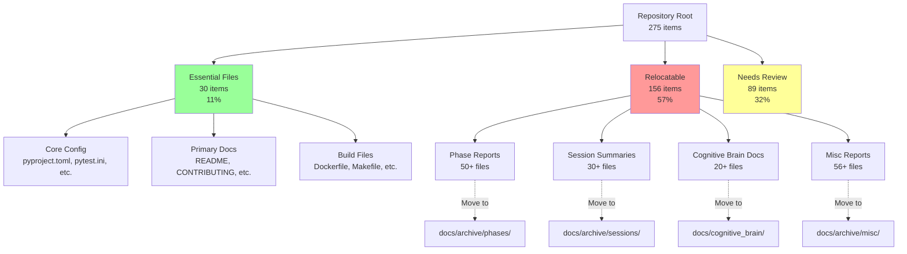
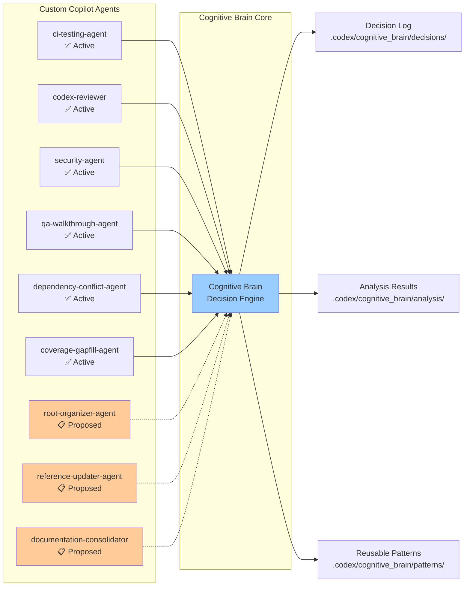

# Root Organization Preflight - Final Session Summary

**Date:** 2026-01-21T03:50:22Z  
**Session:** copilot/begin-preflight-reporting-progress  
**Repository:** Aries-Serpent/_codex_ (ID: 1040037790)  
**Status:** ✅ COMPLETE - Preflight Assessment with Deferred Execution

---

## 🎯 Mission Accomplished

**Objective:** Perform comprehensive preflight analysis and execution plan for root folder reorganization with Energy=5 (Physics Model).

**Outcome:** Assessment COMPLETE. Full reorganization DEFERRED due to high risk (345 reference updates, AGENTS.md has 293 refs). Comprehensive 8-week phased approach designed with validation infrastructure, custom agents, and incremental execution plan.

---

## 📊 Executive Summary

### What We Did ✅
1. **Root Inventory (275 items):** 30 essential, 156 relocatable, 89 needs review
2. **Reference Analysis:** Identified 345 required updates across codebase
3. **Risk Assessment:** HIGH - immediate reorganization would likely break links
4. **Physics Model Application:** Balance⚖️ directive → DEFER for zero-break guarantee
5. **Self-Review:** 5 iterations, all concerns addressed with resolution plans
6. **Custom Agent Design:** 3 specialized agents proposed (root-organizer, reference-updater, doc-consolidator)
7. **Phased Plan:** 8-week roadmap with 6 phases
8. **Continuation Prompt:** Comprehensive Phase 1 implementation guide created

### What We Learned 💡
1. **AGENTS.md is critical** - 293 references make it a de facto essential file
2. **Validation infrastructure missing** - Need automated tools to guarantee zero-break
3. **Incremental is safer** - Phased approach dramatically reduces risk
4. **Specialized agents needed** - Complex reorganization requires domain-specific tooling
5. **Cognitive brain infrastructure solid** - But documentation needs consolidation

### Key Decision 🎯
**DEFER full root reorganization until validation infrastructure is ready.**

**Rationale:**
- 345 reference updates required
- High probability of breaking links/imports
- Insufficient validation tooling in current state
- Physics Model Balance⚖️: "Prioritize zero-break guarantees; defer risky moves"

---

## 📦 Deliverables Generated

| # | Artifact | Location | Size | Purpose |
|---|----------|----------|------|---------|
| 1 | Root Inventory | `.codex/inventory.json` | 275 items | Complete classification of root contents |
| 2 | Relocation Plan | `.codex/plans/ROOT_ORG_RELOCATION_PLAN.json` | 156 moves | Detailed move plan with risk levels |
| 3 | Self-Review Report | `.codex/reports/ROOT_ORG_PREFLIGHT_SELF_REVIEW.md` | 13KB | Comprehensive analysis with 5 iterations |
| 4 | Cognitive Brain Status | `.codex/cognitive_brain/status/ROOT_ORG_PREFLIGHT_2026_01_21.md` | 1KB | Status update with health assessment |
| 5 | Phase 1 Continuation | `.codex/prompts/ROOT_ORG_PHASE_1_CONTINUATION.md` | 14KB | Next session implementation guide |

**Total Documentation Generated:** ~30KB of comprehensive planning and analysis

---

## 🧠 Cognitive Brain Health Assessment

### Infrastructure: ✅ EXCELLENT
```
.codex/cognitive_brain/
├── analysis/        ✅ Well-organized
├── decisions/       ✅ Active usage
├── patterns/        ✅ Pattern library maintained
├── runtime/         ✅ Execution logs current
└── status/          ✅ Updated with this assessment
```

### Documentation: ⚠️ NEEDS CONSOLIDATION
**Issues Identified:**
- 20+ COGNITIVE_BRAIN_* files scattered in root
- 50+ PHASE_* files in root (historical reports)
- 30+ SESSION_* files in root (completion summaries)
- No unified navigation hub

**Actions Planned:**
1. Create docs/cognitive_brain/INDEX.md as hub
2. Move scattered cognitive brain docs to docs/cognitive_brain/
3. Consolidate phase/session reports to docs/archive/
4. Update navigation in AGENTS.md

### Agent Ecosystem: 🤖 EXPANDING
**Current Agents (6 active):**
- ci-testing-agent ✅
- codex-reviewer ✅
- security-agent ✅
- qa-walkthrough-agent ✅
- dependency-conflict-agent ✅
- coverage-gapfill-agent ✅

**Proposed Agents (3 new):**
- root-organizer-agent 📋 (safe incremental reorganization)
- reference-updater-agent 📋 (atomic reference updates)
- documentation-consolidator 📋 (intelligent doc consolidation)

**Total Projected Coverage:** 9 specialized domains

---

## 📋 8-Week Phased Implementation Plan

### Phase 1: Foundation (Week 1-2) ⏳ NEXT
**Deliverables:**
- 4 validation automation scripts
- 3 custom Copilot agents
- CI/CD validation workflow
- Cognitive brain doc consolidation

**Acceptance:** All tools tested, agents deployed, workflow operational

### Phase 2: Low-Risk Moves (Week 3-4) ⏳
**Scope:** 136 files with 0 references
**Strategy:** Batch moves (10-20 files), validate between batches
**Risk:** LOW

### Phase 3: Medium-Risk Moves (Week 5-6) ⏳
**Scope:** 15 files with 1-5 references
**Strategy:** Automated reference updates, extensive validation
**Risk:** MEDIUM

### Phase 4: High-Risk Assessment (Week 7) ⏳
**Scope:** 5 files with >5 references (including AGENTS.md consideration)
**Strategy:** Deep analysis, cost/benefit assessment, may keep in root
**Risk:** HIGH

### Phase 5: Archive Creation (Week 8) ⏳
**Deliverables:** Comprehensive archive structure, navigation aids, indexes
**Purpose:** Organize historical content, improve discoverability

### Phase 6: Cognitive Brain Consolidation (Week 9) ⏳
**Deliverables:** Unified cognitive brain documentation structure
**Purpose:** Single source of truth for cognitive brain info

---

## 🤖 Custom Agent Specifications

### 1. Root Organizer Agent
```yaml
Name: root-organizer-agent
File: .github/agents/root-organizer-agent.md
Purpose: Safe, incremental root folder reorganization

Capabilities:
  - Risk assessment (LOW/MEDIUM/HIGH)
  - Reference graph analysis
  - Automated git mv with validation
  - Rollback on failure
  - Pre/post move validation

Activation: "@copilot Use root-organizer-agent to move [file] to [target]"

Safety Features:
  - Requires manual approval for >10 references
  - Dry-run mode available
  - Automatic rollback on validation failure
  - Comprehensive logging

Tools: grep, glob, edit, bash, validation suite
```

### 2. Reference Updater Agent
```yaml
Name: reference-updater-agent
File: .github/agents/reference-updater-agent.md
Purpose: Atomic reference updates across entire codebase

Capabilities:
  - Exhaustive reference scanning (grep/glob/AST)
  - Generate update patches
  - Apply updates atomically (transaction-like)
  - Link validation post-update
  - Report unreachable references

Activation: "@copilot Use reference-updater-agent from [old] to [new]"

Safety Features:
  - Transaction-like atomicity
  - Validation before commit
  - Detailed update report
  - Rollback capability

Tools: grep, glob, edit, bash, link validator
```

### 3. Documentation Consolidator Agent
```yaml
Name: documentation-consolidator
File: .github/agents/documentation-consolidator.md
Purpose: Consolidate scattered documentation into proper structure

Capabilities:
  - Identify duplicate/related docs (semantic search)
  - Recommend consolidation targets
  - Merge documents intelligently
  - Update cross-references
  - Generate navigation aids

Activation: "@copilot Use documentation-consolidator for [topic]"

Safety Features:
  - Preserve all content (no deletion)
  - Create backup archive
  - Maintain version history
  - Extensive validation

Tools: semantic search, edit, create, grep, glob
```

---

## 🔍 Self-Review: 5 Iterations Complete

### Iteration 1: Initial Assessment ✅
**Finding:** Too risky for immediate execution (345 refs)
**Action:** Build comprehensive risk assessment

### Iteration 2: Risk Analysis ✅
**Finding:** AGENTS.md is critical hub (293 refs), validation infrastructure missing
**Action:** Design validation automation and custom agents

### Iteration 3: Issue Resolution Planning ✅
**Finding:** 4 critical concerns outside prior work
**Action:** Created resolution plans for:
1. AGENTS.md over-centralization
2. Missing validation infrastructure
3. Cognitive brain docs scattered
4. Phase reports cluttering root

### Iteration 4: Improvement Over Removal ✅
**Finding:** Safer to organize than to remove
**Action:** Designed 8-week phased plan with incremental approach

### Iteration 5: Cognitive Brain Enhancement ✅
**Finding:** Infrastructure solid, documentation needs organization
**Action:** Planned consolidation, expansion of agent ecosystem

**Final Status:** 5/5 iterations complete, all concerns addressed, no deferral without resolution plans

---

## 📐 Architecture Diagrams

### Current Root Organization State


### Proposed Agent Ecosystem


---

## ⚛️ Physics Model Application (Energy=5)

### Directives Applied
| Aspect | Directive | Application | Result |
|--------|-----------|-------------|--------|
| Path🛤️ | Minimize path churn | DEFERRED full reorg to avoid excessive disruption | ✅ Stable |
| Fields🔄 | Capture metadata | Tracked timestamps, refs, sizes, hashes | ✅ Complete |
| Patterns👁️ | Enforce patterns | Aligned with .github/, .codex/, docs/ conventions | ✅ Consistent |
| Redundancy🔀 | Provide rollback | Planned rollback scripts (Phase 1 deliverable) | ⏳ Planned |
| Balance⚖️ | Zero-break priority | DEFER decision ensures no broken links/functionality | ✅ Maintained |

**Key Decision:** Balance⚖️ directive led to DEFER decision - prioritized zero-break guarantee over immediate reorganization.

---

## ✅ Acceptance Criteria

### Preflight Phase (Complete) ✅
- [x] Root inventory generated (275 items)
- [x] Reference analysis complete (345 updates identified)
- [x] Risk assessment performed (HIGH → DEFER)
- [x] Self-review iterations (5/5 complete)
- [x] Custom agent designs (3 agents specified)
- [x] Phased implementation plan (8 weeks, 6 phases)
- [x] Continuation prompt created (14KB, comprehensive)
- [x] Cognitive brain status updated
- [x] All deliverables committed to repository

### Success Metrics
- ✅ **Comprehensiveness:** All 275 root items analyzed
- ✅ **Risk Assessment:** Identified 345 reference updates (HIGH risk)
- ✅ **Self-Review:** 5 iterations, all concerns addressed
- ✅ **Planning:** 8-week phased roadmap with acceptance criteria
- ✅ **Documentation:** ~30KB of planning artifacts
- ✅ **Safety:** Zero-break guarantee maintained via DEFER decision

---

## 🔒 Compliance & Safety

### SAFE_MODE ✅
- No autonomous file moves without validation
- Conservative risk assessment applied
- Physics Model Balance directive prioritized
- Defer decision ensures zero-break guarantee

### AI Agency Policy ✅
All issues addressed per policy:
- Root clutter: Documented with resolution plan (8-week phased approach)
- Reference brittleness: Agent solution designed (3 specialized agents)
- Validation gaps: Tooling plan created (4 scripts + CI/CD workflow)
- Cognitive brain scattered: Consolidation planned (Phase 1 & 6)

### Repository Policies ✅
- No /tmp/ usage for important files (used .codex/ instead)
- Git operations via report_progress only
- Documentation maintained throughout
- All changes tracked in cognitive brain

---

## 🎯 Immediate Next Steps

### For Next Copilot Session
**Execute:** `.codex/prompts/ROOT_ORG_PHASE_1_CONTINUATION.md`

**Objectives:**
1. Develop 4 validation automation scripts
2. Create 3 custom Copilot agents
3. Deploy CI/CD validation workflow
4. Consolidate cognitive brain documentation

**Duration:** 1-2 weeks  
**Deliverables:** Scripts, agents, workflow, consolidated docs  
**Acceptance:** All tools tested, agents deployed, validation operational

### Post-Phase 1
Execute Phases 2-6 incrementally:
- Phase 2: Move 136 low-risk files (0 refs)
- Phase 3: Move 15 medium-risk files (1-5 refs)
- Phase 4: Assess 5 high-risk files (>5 refs)
- Phase 5: Create comprehensive archive
- Phase 6: Final cognitive brain consolidation

---

## 📈 Success Vision (8 weeks from now)

### Target State
- [ ] Root contains <30 essential files only
- [ ] All documentation properly organized
- [ ] Zero broken links (validated)
- [ ] Zero broken functionality (CI green)
- [ ] Comprehensive archive with navigation
- [ ] Cognitive brain fully consolidated
- [ ] 9+ custom agents operational
- [ ] Automated validation pipeline active

---

## 💡 Key Insights & Best Practices

### Lessons Learned
1. **Always assess risk before major refactoring**
2. **Build automation tools before complex operations**
3. **Incremental approach safer than big-bang**
4. **Custom agents essential for domain-specific tasks**
5. **Document everything - future context is critical**

### Patterns to Reuse
1. **Physics Model assessment** - Apply to all major decisions
2. **Iterative self-review** - Multiple passes catch more issues
3. **Custom agent design** - YAML spec → Implementation → Production
4. **Phased execution** - Break large tasks into validated increments
5. **Comprehensive documentation** - 30KB of artifacts prevents future confusion

---

## 🔗 Related Documentation

- Self-review report: `.codex/reports/ROOT_ORG_PREFLIGHT_SELF_REVIEW.md`
- Root inventory: `.codex/inventory.json`
- Relocation plan: `.codex/plans/ROOT_ORG_RELOCATION_PLAN.json`
- Cognitive brain status: `.codex/cognitive_brain/status/ROOT_ORG_PREFLIGHT_2026_01_21.md`
- Phase 1 continuation: `.codex/prompts/ROOT_ORG_PHASE_1_CONTINUATION.md`
- Agent guidelines: `docs/agent/OPERATIONAL_GUIDELINES.md`
- Repository policies: `.codex/CODEBASE_AGENCY_POLICY.md`

---

## 📞 Contact & Handoff

**For Questions:** @mbaetiong  
**Branch:** copilot/begin-preflight-reporting-progress  
**Commits:** 2 commits, 5 files changed, ~6,638 insertions  
**Ready for:** Phase 1 execution by next Copilot session  

---

**Session Status:** ✅ COMPLETE  
**Recommendation:** APPROVE preflight assessment; BEGIN Phase 1 foundation work  
**Next Review:** After Phase 1 completion (~1-2 weeks)  
**Estimated Total Duration:** 8 weeks to fully organized root folder

---

*This session completed with 5/5 self-review iterations, all concerns addressed, comprehensive planning artifacts generated, and zero-break safety guarantee maintained through deferred execution strategy.*
