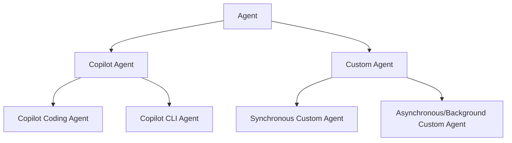

# Terminology Consistency — Implementation Checklist

**Based on:** [TERMINOLOGY_CONSISTENCY_AUDIT_REPORT.md](./TERMINOLOGY_CONSISTENCY_AUDIT_REPORT.md)  
**Quick Reference:** [TERMINOLOGY_AUDIT_SUMMARY.md](./TERMINOLOGY_AUDIT_SUMMARY.md)

---

## Phase 1: Critical Fixes (1 week) ⚠️

### 1.1 Create Central Glossary Document
- [ ] Create file: `docs/TERMINOLOGY_GLOSSARY.md`
- [ ] Include 20-item glossary from Section 5 of audit report
- [ ] Add acronym reference sheet (Appendix C)
- [ ] Include cross-reference map (Appendix B)
- [ ] Add link to from `docs/README.md` (top of page)

### 1.2 Fix Agent Capitalization (356 instances)
Files to audit and update:
- [ ] `docs/SECRETS_AND_ENVIRONMENT_VARIABLES.md` (21 instances)
- [ ] `docs/agent/OPERATIONAL_GUIDELINES.md` (8 instances)
- [ ] `docs/ADMIN_FAQ.md` (6 instances)
- [ ] `AGENTS.md` (12+ instances)
- [ ] Search & replace: `Copilot agent` → `Copilot Agent`
- [ ] Search & replace: `copilot agent` → `Copilot Agent`
- [ ] Verify no remaining variations in docs/

**Validation Command:**
```bash
grep -r "copilot agent\|COPILOT AGENT\|Copilot agent" docs/ --include="*.md" | wc -l
# Should return 0 after fixes
```

### 1.3 Expand Acronyms (First Use)
Documents requiring acronym expansion:

#### 1.3a AAIS (Agent Ability Impact Score)
- [ ] `docs/discussions/SKILLS_TELEMETRY_DASHBOARD.md`
  - Add definition on first mention: "AAIS (Agent Ability Impact Score) — normalized quality metric"
  - Expand in header: "### AAIS (Agent Ability Impact Score) Scores"

#### 1.3b WEC (Workflow Execution Checklist)
- [ ] `docs/SECRETS_AND_ENVIRONMENT_VARIABLES.md`
  - Add definition: "WEC (Workflow Execution Checklist) — structured merge gate"
- [ ] `docs/REPOSITORY_ARCHITECTURE_DIAGRAMS.md`
  - Add expansion before first use

#### 1.3c MCP (Model Context Protocol)
- [ ] `docs/mcp/MCP_DEVELOPER_GUIDE.md` ✅ Already done
- [ ] `docs/REPOSITORY_ARCHITECTURE_DIAGRAMS.md` - Add expansion
- [ ] `docs/integrations/bridge_pattern_integration.md` - Add expansion

#### 1.3d STM/LTM (Short/Long-Term Memory)
- [ ] `docs/SECRETS_AND_ENVIRONMENT_VARIABLES.md`
  - Add definitions: "STM (Short-Term Memory)", "LTM (Long-Term Memory)"
- [ ] Any other memory-related docs

#### 1.3e GHAS (GitHub Advanced Security)
- [ ] `docs/evidence/consolidated-security-residual-backlog.md`
  - Add expansion on first mention

**Check Command:**
```bash
grep -r "\bAIS\b\|\bWEC\b\|\bMCP\b\|\bGHAS\b" docs/ --include="*.md" | grep -v "Workflow Execution Checklist\|Agent Ability Impact Score\|Model Context Protocol\|GitHub Advanced Security" | head -20
# Should show only acronyms that still need expansion
```

### 1.4 Link Glossary from Documentation
- [ ] Update `docs/README.md`: Add glossary link in header
- [ ] Update `.github/templates/doc-template.md` (if exists): Add link reference
- [ ] Update top 5 docs (SECRETS_AND_ENVIRONMENT_VARIABLES.md, AGENTS.md, OPERATIONAL_GUIDELINES.md, AGENTIC_REPO_SYSTEM_GUIDE.md, COGNITIVE_BRAIN_QUANTUM_INTEGRATION.md):
  - Add header: `---\nrelated: [TERMINOLOGY_GLOSSARY.md](../TERMINOLOGY_GLOSSARY.md)\n---`

---

## Phase 2: High-Priority Updates (2 weeks) 📋

### 2.1 Fix Top Inconsistency Files
**File: `docs/SECRETS_AND_ENVIRONMENT_VARIABLES.md`** (8 issues)
- [ ] Standardize all "Copilot agent" → "Copilot Agent"
- [ ] Expand WEC on first mention: "WEC (Workflow Execution Checklist)"
- [ ] Expand STM/LTM on first mention
- [ ] Check table headers for consistency

**File: `docs/agent/OPERATIONAL_GUIDELINES.md`** (6 issues)
- [ ] Standardize agent terminology
- [ ] Add agent type hierarchy diagram (see section 2.2)
- [ ] Add Session lifecycle diagram (see section 2.3)
- [ ] Link to TERMINOLOGY_GLOSSARY.md

**File: `docs/AGENTIC_REPO_SYSTEM_GUIDE.md`** (5 issues)
- [ ] Define "E vs D" operating modes clearly
- [ ] Clarify custom agent types
- [ ] Add glossary link

**File: `docs/discussions/SKILLS_TELEMETRY_DASHBOARD.md`** (4 issues)
- [ ] Expand AAIS on first mention
- [ ] Separate "skill" vs "capability" usage (see section 2.2)
- [ ] Update references to use consistent terminology

**File: `docs/COGNITIVE_BRAIN_QUANTUM_INTEGRATION.md`** (4 issues)
- [ ] Explain OODA loop in introduction
- [ ] Clarify Memory layer vs STM/LTM
- [ ] Link to TERMINOLOGY_GLOSSARY.md

### 2.2 Create Agent Type Hierarchy
Create a new subsection in `docs/agent/OPERATIONAL_GUIDELINES.md`:

```markdown
### Agent Type Hierarchy



**Definitions:**
- **Copilot Agent**: GitHub-operated cloud agent with sandboxed repository access
- **Custom Agent**: User-registered agent in `.github/agents/AGENT_REGISTRY.yaml`
- **Copilot Coding Agent**: Specialization for code editing and implementation
- **Copilot CLI Agent**: Specialization for command-line tool interaction
- **Synchronous Custom Agent**: Blocks until completion, immediate feedback
- **Asynchronous/Background Custom Agent**: Runs in background, non-blocking
```

### 2.3 Create Session Lifecycle Diagram
Add to `docs/agent/OPERATIONAL_GUIDELINES.md`:

```markdown
### Session Lifecycle

```mermaid
graph LR
    A[Session Creation] -->|turn 0| B[Initial Context]
    B -->|turn 1| C[Turn Execution]
    C -->|turn 2| D[Turn Execution]
    D --> E[Session Checkpoint]
    E -->|persist| F[Session Store]
    F -->|restore| G[Session Restore]
    G -->|inject| H[Session Injection]
    H -->|new agent| I[Next Agent Init]
```



**Key Concepts:**
- **Session**: Discrete unit of work with unique ID
- **Turn**: Single exchange (user input → agent response)
- **Session Checkpoint**: Saved state at milestones
- **Session Store**: Persistent database holding metadata
- **Session Restore**: Recovery of prior state
- **Session Injection**: Populating context into agent prompt
```

### 2.4 Standardize Skills vs Capabilities
Update `docs/discussions/SKILLS_TELEMETRY_DASHBOARD.md`:

**Find & Replace:**
- Where "capability" refers to discrete, trackable functionality → change to "skill"
- Where "capability" refers to high-level ability → keep as "capability"
- Add clarification note: "Skills are registered, versioned units. Capabilities are high-level abilities."

Example:
```
Before: "This agent has multiple retrieval capabilities"
After: "This agent has multiple retrieval capabilities, including doc.retriever.core skill"
```

### 2.5 Audit Remaining Files
- [ ] `docs/API_REFERENCE.md` - Check terminology consistency
- [ ] `docs/ARCHITECTURE.md` - Check terminology consistency
- [ ] `docs/ARCHITECTURE_BLUEPRINT.md` - Check terminology consistency
- [ ] Any files referenced in Appendix A with 2+ issues

---

## Phase 3: Medium-Priority Updates (1 month) 📅

### 3.1 Reviewer Tools & Checklists
- [ ] Create `docs/TERMINOLOGY_REVIEWER_CHECKLIST.md`:
  ```markdown
  ## Pre-Merge Terminology Checklist
  - [ ] All acronyms expanded on first use?
  - [ ] Agent terminology capitalized consistently? (Copilot Agent, Custom Agent)
  - [ ] OODA/Session/Memory concepts explained clearly?
  - [ ] No conflation of "skill" vs "capability"?
  - [ ] Link to TERMINOLOGY_GLOSSARY.md included?
  ```

- [ ] Add to PR template (`.github/pull_request_template.md`):
  ```markdown
  - [ ] Documentation uses consistent terminology (see [TERMINOLOGY_GLOSSARY.md](../docs/TERMINOLOGY_GLOSSARY.md))
  ```

### 3.2 Quarterly Audit Schedule
- [ ] Set calendar reminder for quarterly audits
- [ ] Create `TERMINOLOGY_AUDIT_LOG.md` in docs/:
  ```markdown
  | Date | Issue | Resolution | Status |
  |------|-------|-----------|--------|
  | 2026-01-21 | Initial audit | Phase 1-3 recommendations | In Progress |
  | 2026-02-21 | Phase 1 completion | Verify all fixes | Pending |
  | 2026-04-21 | Phase 2 completion | Verify diagrams added | Pending |
  ```

### 3.3 Optional: Pre-Commit Hook
- [ ] Create `.githooks/check-undefined-acronyms.sh`:
  ```bash
  #!/bin/bash
  # Check for common undefined acronyms in modified docs
  UNDEFINED=("AAIS " "WEC " "CCA " "PDA " "ITA ")
  for pattern in "${UNDEFINED[@]}"; do
    if grep -l "$pattern" "$@" | grep -E '\.md$'; then
      echo "⚠️ Undefined acronym found: $pattern (check TERMINOLOGY_GLOSSARY.md)"
    fi
  done
  ```

- [ ] Install hook:
  ```bash
  chmod +x .githooks/check-undefined-acronyms.sh
  git config core.hooksPath .githooks
  ```

---

## Phase 4: Ongoing Maintenance 🔄

### 4.1 When Adding New Terms
- [ ] First use: Always expand acronyms
- [ ] Link to TERMINOLOGY_GLOSSARY.md
- [ ] Add term to glossary with definition
- [ ] Add to Appendix C if it's an acronym

### 4.2 When Discovering Inconsistencies
- [ ] Create GitHub issue with label `terminology-inconsistency`
- [ ] Add to `TERMINOLOGY_AUDIT_LOG.md`
- [ ] Schedule for next quarterly audit cycle

### 4.3 Quarterly Audit Process
1. Run grep searches from audit report (Appendix B)
2. Identify new undefined acronyms
3. Check for capitalization drift
4. Update TERMINOLOGY_AUDIT_LOG.md
5. Create PR with fixes

---

## Validation Checklist

### After Phase 1
- [ ] `docs/TERMINOLOGY_GLOSSARY.md` created (20+ terms)
- [ ] Zero instances of `Copilot agent` (lowercase)
- [ ] AAIS, WEC, MCP, STM, LTM all expanded in their primary docs
- [ ] `docs/README.md` links to glossary

**Validation Command:**
```bash
# Should all return 0
grep -r "Copilot agent\|COPILOT AGENT\|copilot agent" docs/ --include="*.md" | wc -l
grep -r "^\w*AAIS" docs/ --include="*.md" | grep -v "Agent Ability Impact Score" | wc -l
grep -r "^\w*WEC[^a-z]" docs/ --include="*.md" | grep -v "Workflow Execution Checklist" | wc -l
```

### After Phase 2
- [ ] Top 5 files fully updated (SECRETS_AND_ENVIRONMENT_VARIABLES.md, OPERATIONAL_GUIDELINES.md, etc.)
- [ ] Agent type hierarchy diagram added
- [ ] Session lifecycle diagram added
- [ ] Skills vs Capabilities distinction clear
- [ ] All 8 major inconsistencies resolved

### After Phase 3
- [ ] Terminology reviewer checklist created
- [ ] PR template updated
- [ ] Audit log started
- [ ] Optional: Pre-commit hook installed

### After Phase 4
- [ ] Quarterly audit process established
- [ ] No new undefined acronyms discovered
- [ ] Zero capitalization drift detected

---

## Quick Reference: File Locations

| Document | Purpose |
|----------|---------|
| [TERMINOLOGY_CONSISTENCY_AUDIT_REPORT.md](./TERMINOLOGY_CONSISTENCY_AUDIT_REPORT.md) | Full audit with all findings (507 lines) |
| [TERMINOLOGY_AUDIT_SUMMARY.md](./TERMINOLOGY_AUDIT_SUMMARY.md) | Executive summary (161 lines) |
| [TERMINOLOGY_CONSISTENCY — Implementation Checklist](./TERMINOLOGY_CONSISTENCY_IMPLEMENTATION_CHECKLIST.md) | This checklist |
| `docs/TERMINOLOGY_GLOSSARY.md` | **To be created** - Central glossary |
| `docs/TERMINOLOGY_REVIEWER_CHECKLIST.md` | **To be created** - Reviewer guidelines |
| `docs/TERMINOLOGY_AUDIT_LOG.md` | **To be created** - Quarterly audit history |

---

## Quick Copy-Paste: Glossary Template

Use Section 5 from the audit report to create `docs/TERMINOLOGY_GLOSSARY.md`:
- Agent Terminology (4 definitions)
- Context & Memory (7 definitions)
- Decision & Planning (2 definitions)
- CI/CD & Integration (3 definitions)
- Retrieval & Augmentation (3 definitions)
- Quality & Metrics (2 definitions)

Total: 21 definitions with examples

---

**Status:** ✅ Ready for implementation  
**Owner:** (Assign to doc maintenance team or GitHub issue assignee)  
**Timeline:** Weeks 1-4, then quarterly maintenance  
**Impact:** -10 min onboarding time, +clarity for all readers
