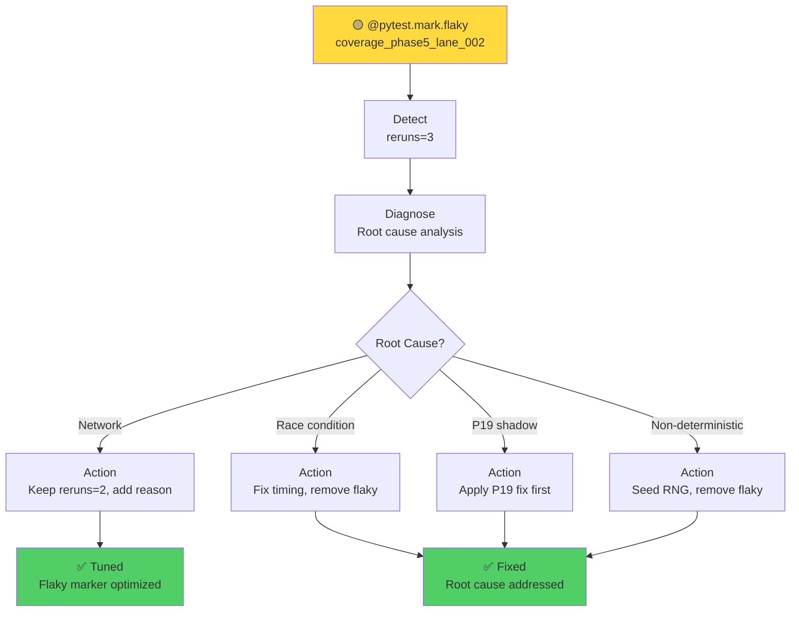
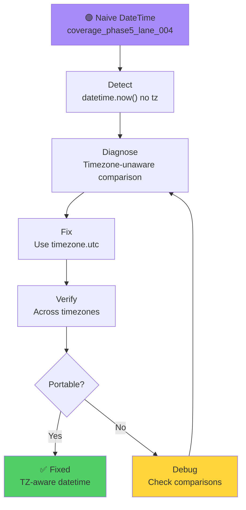
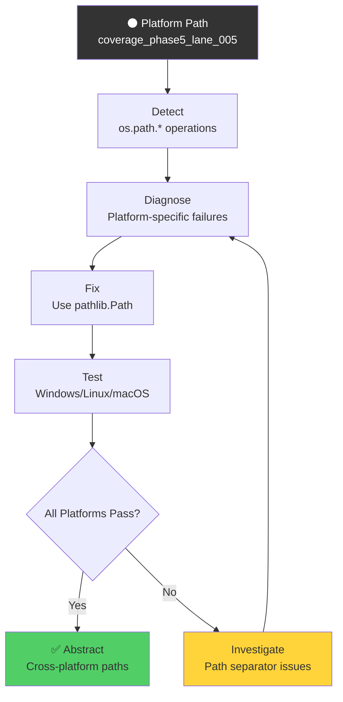

# Phase 5 Test-Cycle Healing Diagrams

Generated test healing cycles for flaky test fixes.

## 1. 1__coverage_phase5_lane_002

## 2. 2__coverage_phase5_lane_004

## 3. 3__coverage_phase5_lane_005

