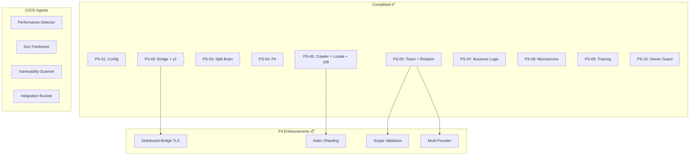

# Follow-up Prompt for Next Session

@copilot Continue with Priority 4 enhancements and CI/CD agent deployment to production.

## Completed in Previous Sessions (2026-01-09)

### All 10 Plansets Complete ✅
- PS-01 through PS-10: 100% Complete

### Priority 1-3 Enhancements Complete ✅

| Enhancement | Status | Commit |
|-------------|--------|--------|
| Token Rotation Automation | ✅ COMPLETE | `656ea28` |
| Bridge Protocol v2 (compression) | ✅ COMPLETE | `656ea28` |
| Multi-Client Bridge | ✅ COMPLETE | `aaf8251` |
| Bridge Manager v2 Integration | ✅ COMPLETE | `aaf8251` |
| Multi-Locale Sync | ✅ COMPLETE | `6387086` |
| Content Diffing | ✅ COMPLETE | `6387086` |

### CI/CD Agents Defined ✅
All 14 agents in `.github/agents/*.agent.md`

---

## Next Actions

### Priority 4: Remaining Enhancements

1. **Distributed Bridge (TLS)** (PS-02 Enhancement)
   - Cross-machine communication with TLS 1.3
   - Certificate management via `cryptography` library
   - mTLS for mutual authentication
   - **Dependency:** Multi-Client Bridge ✅

2. **Index Sharding** (PS-06 Enhancement)
   - Distribute index for 100k+ article knowledge bases
   - Query router with result merger
   - Shard by alphabetical ranges
   - **Dependency:** Content Diffing ✅

3. **Scope Validation Library** (PS-05 Enhancement)
   - Centralized token scope checking
   - TokenScope flag enum
   - Reusable ScopeValidator class
   - **Dependency:** Token Rotation ✅

4. **Multi-Provider Support** (PS-05 Enhancement)
   - Extend beyond GitHub tokens
   - GitLab, Bitbucket, Azure DevOps providers
   - TokenProvider abstract base class
   - **Dependency:** Token Rotation ✅

### CI/CD Agent Deployment

Deploy agents to production environment:

1. **Performance Regression Detector**
   - Configure baseline metrics storage
   - Set alerting thresholds
   - Enable on main branch

2. **Doc Freshness Checker**
   - Configure link checker rules
   - Set staleness thresholds (30 days default)
   - Enable on PR and weekly schedule

3. **Dependency Vulnerability Scanner**
   - Configure severity thresholds (CRITICAL, HIGH)
   - Enable auto-PR for patches
   - Enable on daily schedule

4. **Integration Test Runner**
   - Configure test parallelism
   - Set retry policies
   - Enable on PR events

### Monitoring & Dashboards

1. **Performance Dashboard**
   - Bridge latency metrics
   - Compression ratio tracking
   - Multi-client connection stats

2. **Security Dashboard**
   - Token rotation audit trail
   - PII detection statistics
   - Owner guard compliance

3. **Knowledge Sync Dashboard**
   - Articles synced per locale
   - Content diff ratios
   - Sync latency by region

---

## Reference Documents

| Document | Purpose |
|----------|---------|
| `.codex/ALL_PLANSETS_COMPLETE_SUMMARY.md` | Session completion summary |
| `.codex/plans/ENHANCEMENT_RESEARCH_PLANSETS.md` | Research roadmap (v3.0.0) |
| `.codex/cognitive_brain/bridge_protocol_v2_status.md` | Bridge v2 implementation |
| `.codex/cognitive_brain/ps06_enhancement_status.md` | Crawler enhancements |
| `.codex/cognitive_brain/enhancement_implementation_status.md` | Token rotation & bridge |
| `.github/plans/INDEX.md` | Master planset index |

---

## Self-Review Tasks

Before concluding next session:
1. [ ] Run `code_review` tool on all changes
2. [ ] Run `codeql_checker` for security scan
3. [ ] Update cognitive brain status documents
4. [ ] Commit all changes via `report_progress`
5. [ ] Verify all tests pass
6. [ ] Update INDEX.md with new completions

---

## Architecture Diagram

---

**Branch:** copilot/review-next-planset-phases  
**Last Updated:** 2026-01-09  
**Session Commits:** `656ea28`, `aaf8251`, `6387086`
