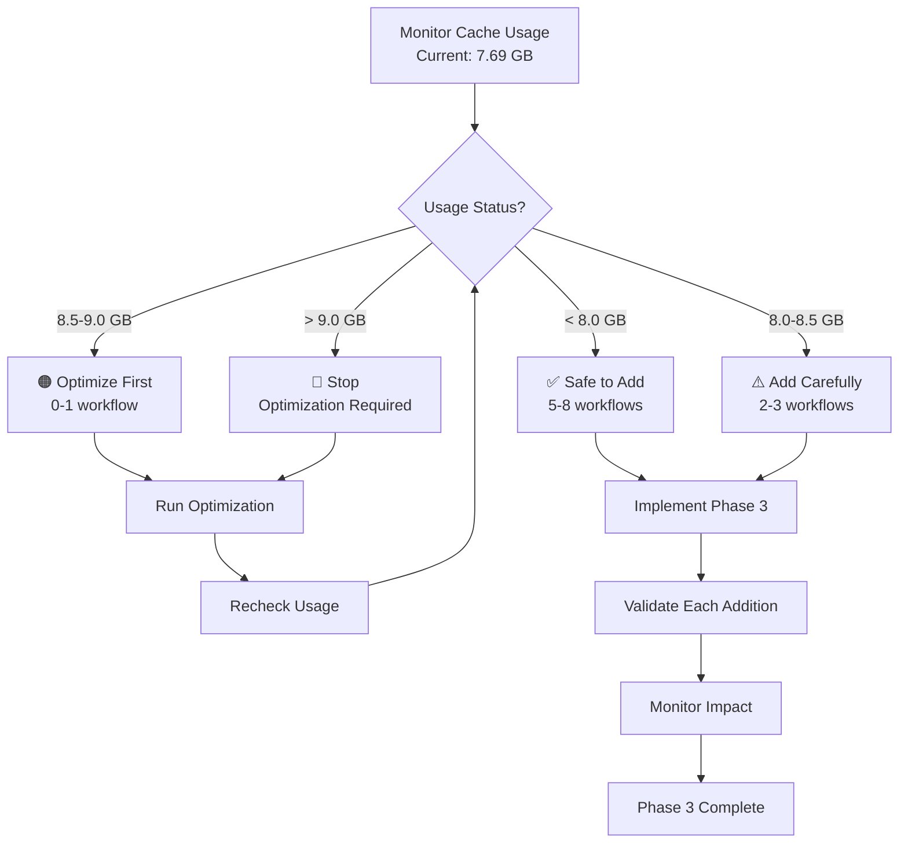

# GitHub Copilot Agent Follow-Up Prompt - Phase 3 & Beyond

**Generated**: 2025-12-30  
**For PR**: #2668  
**Branch**: 0D_base_  
**Status**: Ready for Phase 3 Implementation

---

## Context & Current State

**Completed Work**:
- ✅ Phase 1: 3 critical workflows with optimized caching (code-quality.yml, self-healing-feedback-loop.yml, scan-secrets-variables.yml)
- ✅ Phase 2: 4 high-frequency workflows with optimized caching (security-suite.yml, nox_gates.yml, integration-gated.yml, scheduled-dependency-audit.yml)
- ✅ Cache conflict resolution: All workflows now have unique cache keys with `${{ github.workflow }}` identifiers
- ✅ Comprehensive documentation: 6 documentation files including Mermaid architecture diagrams
- ✅ 5-iteration self-review completed with 0 concerns

**Current Metrics**:
- Total workflows: 49
- With optimized cache: 11 (22%)
- With built-in cache: 10 (20%)
- Without cache: 28 (57%)
- Cache usage: 7.69 GB / 10 GB (76.9%)

---

## Phase 3: Selective Cache Implementation

### Priority Classification

**HIGH PRIORITY** (Add first if cache space permits):
1. **agent-runtime.yml** - Autonomous agent operations (frequent)
2. **pr-followup-generator.yml** - PR automation (every PR)
3. **detect-duplicates.yml** - Code quality checks (frequent)
4. **determinism.yml** - Testing workflow
5. **draft-audit-pr.yml** - Audit automation

**MEDIUM PRIORITY** (Add based on monitoring):
6. html_visual_baseline.yml
7. html_visual_regression.yml
8. repo-organization.yml
9. status_gate.yml
10. ci-health-monitor.yml

**LOW PRIORITY** (Defer or skip):
- Infrequent/manual workflows
- Workflows already using built-in caching
- Workflows with minimal dependency installation

### Implementation Strategy



---

## Implementation Checklist for Phase 3

### Pre-Implementation
- [ ] Verify current cache usage is < 8.5 GB
- [ ] Review 2-week Phase 2 monitoring data (hit rates, evictions)
- [ ] Prioritize workflows based on frequency and benefit
- [ ] Calculate projected cache growth

### For Each Workflow Added
- [ ] Add `actions/cache@v5` with workflow-specific key
- [ ] Include `${{ github.workflow }}` in cache key
- [ ] Use consistent path patterns (`~/.cache/pip`, etc)
- [ ] Add cascading restore-keys
- [ ] Validate YAML syntax: `python -c "import yaml; yaml.safe_load(open('file.yml'))"`
- [ ] Test workflow doesn't break
- [ ] Monitor cache size increase
- [ ] Document in CACHE_ANALYSIS_REPORT.md

### Standard Cache Pattern
```yaml
- name: Cache Dependencies
  uses: actions/cache@v5
  with:
    path: |
      ~/.cache/pip
    key: ${{ runner.os }}-${{ github.workflow }}-pip-${{ hashFiles('**/requirements*.txt', 'pyproject.toml') }}
    restore-keys: |
      ${{ runner.os }}-${{ github.workflow }}-pip-
```

### Workflow-Specific Variations
```yaml
# For workflows using Nox
path: |
  ~/.cache/pip
  ~/.cache/nox
key: ${{ runner.os }}-${{ github.workflow }}-pip-nox-${{ hashFiles('**/requirements*.txt', 'pyproject.toml', 'noxfile.py') }}

# For workflows using GitHub CLI
path: |
  ~/.cache/pip
  ~/.cache/gh
key: ${{ runner.os }}-${{ github.workflow }}-pip-gh-${{ hashFiles('**/requirements*.txt', 'pyproject.toml') }}

# For multi-job workflows
key: ${{ runner.os }}-${{ github.workflow }}-${{ github.job }}-pip-${{ hashFiles('**/requirements*.txt', 'pyproject.toml') }}

# For matrix workflows
key: ${{ runner.os }}-${{ github.workflow }}-${{ matrix.platform }}-pip-${{ hashFiles('**/requirements*.txt', 'pyproject.toml') }}
```

---

## Monitoring & Validation Requirements

### Daily Monitoring (During Phase 3)
```bash
# Check cache usage
gh cache list --repo Aries-Serpent/_codex_ --json sizeInBytes,name

# Verify no evictions
gh run list --workflow="<workflow-name>" --limit 5 | grep -i "cache"
```

### Weekly Review
- [ ] Cache usage trend analysis
- [ ] Calculate actual time savings per workflow
- [ ] Review cache hit rates (target: 90%+)
- [ ] Check for eviction events
- [ ] Update CACHE_ANALYSIS_REPORT.md

### Alert Thresholds
- **8.0 GB**: Increase monitoring frequency
- **8.5 GB**: Pause Phase 3, assess
- **9.0 GB**: Optimization required
- **9.5 GB**: Emergency actions

---

## Optimization Strategies (If Needed)

### Option 1: Remove Low-Value Caches
**Candidates for Removal**:
- scheduled-dependency-audit.yml (per commit cycle runs) - saves ~0.5 GB
- integration-gated.yml (manual only) - saves ~0.3 GB

### Option 2: Switch to Built-in Caching
```yaml
# Instead of explicit cache action
- uses: actions/setup-python@v6
  with:
    python-version: '3.11'
    cache: 'pip'  # More efficient
```

### Option 3: Reduce Cache Paths
```yaml
# Remove optional paths
path: |
  ~/.cache/pip  # Keep only essential
  # Remove: ~/.cache/nox, ~/.cache/gh if not critical
```

---

## Success Criteria for Phase 3

- [ ] 5-8 additional high-priority workflows have caching
- [ ] Cache usage remains < 9.0 GB
- [ ] No workflow breaking changes
- [ ] Cache hit rates > 85% for new workflows
- [ ] Documentation updated
- [ ] All YAML files validate
- [ ] 2-week monitoring period shows stable performance

---

## Future Enhancements (Phase 4+)

### Advanced Caching Strategies
1. **Conditional Caching**: Only cache on main branch
2. **Time-based Invalidation**: Force refresh per 4-5 commit cycles
3. **Dependency-specific Keys**: Separate keys for dev/prod deps
4. **Cross-workflow Sharing**: Strategic sharing for common deps

### Monitoring Dashboard
```yaml
# Create workflow to monitor cache metrics
- Collect hit/miss rates
- Track storage usage trends
- Alert on threshold breaches
- Generate per 4-5 commit cycles reports
```

### Cache Analytics
- Calculate ROI per workflow
- Identify optimization opportunities
- Predict capacity needs
- Recommend removals

---

## Documentation Tasks

### Update After Each Addition
- [ ] CACHE_ANALYSIS_REPORT.md - Add workflow entry
- [ ] CACHE_OPTIMIZATION_REPORT.md - Update metrics
- [ ] CACHE_MONITORING_GUIDE.md - Adjust thresholds if needed
- [ ] CACHE_WORKFLOW_DIAGRAMS.md - Update diagrams

### Create New Documentation
- [ ] PHASE3_IMPLEMENTATION_REPORT.md (after completion)
- [ ] CACHE_PERFORMANCE_ANALYSIS.md (per 4-5 commit cycles)
- [ ] PHASE4_RECOMMENDATIONS.md (future scope)

---

## Emergency Procedures

### If Cache Limit Exceeded (> 10 GB)
1. **Immediate**: GitHub auto-evicts LRU caches
2. **Response**:
   ```bash
   # Identify evicted caches
   gh cache list --repo Aries-Serpent/_codex_
   
   # Manually delete low-priority caches
   gh cache delete <cache-id> --repo Aries-Serpent/_codex_
   ```
3. **Prevention**: Implement one of the optimization strategies
4. **Recovery**: Trigger workflows to rebuild critical caches

### If Workflows Break
1. **Rollback**: Remove cache configuration
2. **Investigate**: Check logs for cache-related errors
3. **Fix**: Adjust cache paths or keys
4. **Test**: Validate before re-enabling
5. **Document**: Add to troubleshooting guide

---

## External Offloading Process

### For Plans No Longer Applicable
If any documented plans become obsolete or require external review:

1. **Archive Location**: `misc/repo-owner-review/archived-artifacts/`
2. **Process**:
   ```bash
   # Create archive
   tar -czf misc/repo-owner-review/archived-artifacts/phase3-obsolete-plans-$(date +%Y%m%d).tar.gz <files>
   
   # Update index
   echo "- phase3-obsolete-plans-YYYYMMDD.tar.gz: Reason for archival" >> \
     misc/repo-owner-review/archived-artifacts/INDEX.md
   ```
3. **Verification**:
   ```bash
   # Ensure no active references
   grep -rn "archived-plan-name" --include="*.py" --include="*.yaml" .
   ```

---

## Integration with Existing Systems

### Leverage Existing Tools
- **Nox**: Use `~/.cache/nox` for workflows using nox
- **Pre-commit**: Add `~/.cache/pre-commit` if heavily used
- **uv/pip-tools**: Consider dedicated cache paths

### Maintain Compatibility
- Keep existing workflows functional
- Don't break CI/CD pipelines
- Preserve audit trails
- Maintain security posture

---

## Validation Commands

```bash
# Validate all modified workflows
for file in .github/workflows/*.yml; do
  python -c "import yaml; yaml.safe_load(open('$file'))" && echo "✅ $file" || echo "❌ $file"
done

# Check cache key uniqueness
grep -h "key:.*github.workflow" .github/workflows/*.yml | sort | uniq -c | awk '$1 > 1 {print "⚠️ Duplicate:", $0}'

# Verify no secrets in keys
grep -r "key:.*secrets" .github/workflows/*.yml && echo "❌ Secrets in keys!" || echo "✅ No secrets in keys"

# Calculate total cache count
grep -l "actions/cache@v5\|cache: 'pip'" .github/workflows/*.yml | wc -l
```

---

## Next Steps Summary

1. **Immediate**: Monitor Phase 2 workflows for 2 weeks
2. **Pre-commit 5-6**: Review monitoring data and decide on Phase 3 scope
3. **Pre-commit 7-12**: Implement Phase 3 selectively (5-8 workflows)
4. **Pre-commit 13-14**: Final review and Phase 3 report
5. **Month 2**: Continuous optimization and monitoring
6. **Quarter 2**: Evaluate Phase 4 feasibility

---

## Contact & Resources

**Primary Documentation**:
- .github/workflows/CACHE_ANALYSIS_REPORT.md
- .github/workflows/CACHE_OPTIMIZATION_REPORT.md
- .github/workflows/CACHE_MONITORING_GUIDE.md
- .github/workflows/CACHE_WORKFLOW_DIAGRAMS.md
- .github/workflows/CACHE_ARCHITECTURE_DIAGRAMS.md

**GitHub Actions References**:
- [Caching Documentation](https://docs.github.com/actions/using-workflows/caching-dependencies-to-speed-up-workflows)
- [Cache Limits](https://docs.github.com/actions/using-workflows/caching-dependencies-to-speed-up-workflows#usage-limits-and-eviction-policy)

**Monitoring Tools**:
- GitHub UI: Settings → Actions → Caches
- GitHub CLI: `gh cache list`
- Workflow logs: Check for "Cache restored" messages

---

**Prompt Version**: 2.0  
**Maintained By**: DevOps / Copilot Agent  
**Last Updated**: 2025-12-30  
**Next Review**: After 2-week Phase 2 monitoring period
