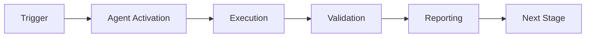

# Agent Ecosystem Mapping - Aries-Serpent/_codex_

**Version**: 1.0.0  
**Date**: 2026-01-23  
**Purpose**: Comprehensive mapping of all agents in the _codex_ repository ecosystem  
**Status**: 🟢 Active - Implementation Roadmap

---

## Executive Summary

This document maps the complete agent ecosystem for the _codex_ repository, detailing 12 specialized agents designed to automate CI/CD, testing, security, compliance, and documentation workflows. Each agent follows the **Cognitive Brain** architecture with **PDA (Perception-Decision-Action) loops** and **AfterMath tagging** for continuous learning.

**Ecosystem Maturity**:
- ✅ **Implemented**: ci-testing-agent.v1 (production ready)
- 📋 **Planned**: 11 additional agents (specifications complete)
- 🎯 **Target**: Full ecosystem by Phase 2 (Current Cycle)

---

## Agent Ecosystem Overview

| Status | Agent ID | Primary Function | Priority |
|--------|----------|------------------|----------|
| ✅ Implemented | ci-testing-agent.v1 | Test generation & coverage | P0 - Critical |
| 📋 Planned | flaky-triage-agent.v1 | Flaky test detection | P1 - High |
| 📋 Planned | dep-upgrade-agent.v1 | Dependency management | P1 - High |
| 📋 Planned | security-scan-agent.v1 | Security scanning | P0 - Critical |
| 📋 Planned | release-gate-agent.v1 | Release readiness | P1 - High |
| 📋 Planned | doc-reporter-agent.v1 | Documentation automation | P2 - Medium |
| 📋 Planned | code-review-summarizer.v1 | PR review assistance | P2 - Medium |
| 📋 Planned | issue-triage-agent.v1 | Issue management | P2 - Medium |
| 📋 Planned | infra-linter-agent.v1 | Workflow validation | P1 - High |
| 📋 Planned | data-rag-helper.v1 | Documentation Q&A | P3 - Low |
| 📋 Planned | mcp-registry-adapter.v1 | Tool discovery | P3 - Low |
| 📋 Planned | compliance-checker-agent.v1 | Standards enforcement | P1 - High |

---

## Detailed Agent Specifications

### 1. ✅ ci-testing-agent.v1 (IMPLEMENTED)

**Status**: Production Ready  
**Implementation**: `.github/agents/ci-testing-agent/`  
**Documentation**: `.github/agents/ci-testing-agent/README.md`

| Dimension | Specification |
|-----------|---------------|
| **Use Case** | Raise coverage to ≥85% for Phase 9.x |
| **Scenario** | Add 150–200 tests across modules |
| **Entry Paths** | `src/`, `agents/`, `scripts/`, `tests/` |
| **Triggers** | Pro+: MCP test-gen; Team: coverage workflows |
| **Target Metrics** | `coverage_delta ≥ +10%`, `tests_created 150–200` |
| **Key Steps** | 1. Baseline coverage<br>2. Generate test scaffolds<br>3. Run test suite<br>4. Validate coverage<br>5. Generate reports<br>6. Update documentation |
| **Outputs** | `baseline_coverage.txt`, `coverage.html`, `PHASE9_1_TEST_SUMMARY.md` |
| **Risks & Guardrails** | Tests-only writes; no `src/` changes; timeouts enforced (300s) |
| **PDA/AfterMath** | Persist metrics to Cognitive Brain; AfterMath summary with gaps and next steps |

**Cognitive Brain Integration**:
```yaml
perception:
  - Parse coverage reports (baseline vs current)
  - Identify uncovered code paths via htmlcov
  - Extract function signatures using AST
decision:
  - Prioritize critical paths (codex, agents, security)
  - Select test generation strategy (unit/integration/contract)
  - Determine test count per module based on complexity
action:
  - Generate test scaffolds with AAA pattern
  - Execute tests in sandbox with timeout
  - Validate coverage delta meets threshold
aftermath:
  - Tag: #AFTERMATH_METRIC (coverage_delta)
  - Tag: #AFTERMATH_QUALITY_CHECK (test pass rate)
  - Update: docs/system/CODEBASE_DASHBOARD.md
```

---

### 2. 📋 flaky-triage-agent.v1 (PLANNED)

| Dimension | Specification |
|-----------|---------------|
| **Use Case** | Quarantine intermittent test failures |
| **Scenario** | Identify and mark flaky tests |
| **Entry Paths** | `tests/*`, GitHub Actions logs |
| **Triggers** | Team: nightly triage; Pro+: report on demand |
| **Target Metrics** | `flakes_detected ↓`, `MTTR ↓` |
| **Key Steps** | 1. Parse Actions logs<br>2. Detect flake patterns (pass/fail ratio)<br>3. Label tests with `@pytest.mark.flaky`<br>4. Quarantine in separate file<br>5. Annotate PRs with flake report |
| **Outputs** | `flake_index.json`, `quarantine_list.md` |
| **Risks & Guardrails** | Advisory-only; human confirmation for quarantine |
| **PDA/AfterMath** | Record flake patterns; PDA loop to prioritize fixes |

**Implementation Outline**:
```python
# .github/agents/flaky-triage-agent/agent/detector.py
class FlakyDetector:
    def analyze_logs(self, workflow_runs: List[Dict]) -> List[FlakyTest]:
        """Parse Actions logs to detect flaky tests."""
        # Track pass/fail ratio per test over last N runs
        # Threshold: >20% failure rate with inconsistent results
        
    def quarantine(self, flaky_tests: List[FlakyTest]) -> None:
        """Move flaky tests to quarantine suite."""
        # Add @pytest.mark.flaky decorator
        # Create tests/quarantine/test_*.py
        # Update pytest.ini to skip by default
```

**Cognitive Brain Integration**:
```yaml
perception:
  - Parse GitHub Actions workflow run logs
  - Identify tests with inconsistent pass/fail
  - Calculate flake rate per test over time
decision:
  - Classify severity (critical vs non-critical)
  - Determine quarantine vs immediate fix
  - Prioritize fixes based on impact
action:
  - Label flaky tests in code
  - Create quarantine suite
  - Annotate related PRs
aftermath:
  - Tag: #AFTERMATH_PATTERN_IDENTIFIED (flake types)
  - Tag: #AFTERMATH_DECISION (quarantine strategy)
  - Update: Flake registry in Cognitive Brain
```

---

### 3. 📋 dep-upgrade-agent.v1 (PLANNED)

| Dimension | Specification |
|-----------|---------------|
| **Use Case** | Safe dependency bumps |
| **Scenario** | Propose minor/patch upgrades |
| **Entry Paths** | `requirements.txt`, `.github/agents/*/requirements.txt` |
| **Triggers** | Pro+: plan; Team: open draft PR |
| **Target Metrics** | `CI pass rate 100%`, `vuln reduction` |
| **Key Steps** | 1. Analyze current dependencies<br>2. Check for updates (minor/patch only)<br>3. Plan upgrade strategy<br>4. Create draft PR with changes<br>5. Run CI validation |
| **Outputs** | `upgrade_plan.md`, draft PR |
| **Risks & Guardrails** | No auto-merge; prohibit sensitive dirs |
| **PDA/AfterMath** | Log decisions; AfterMath risks/benefits analysis |

**Implementation Outline**:
```python
# .github/agents/dep-upgrade-agent/agent/analyzer.py
class DependencyAnalyzer:
    def check_updates(self, requirements_file: Path) -> List[Update]:
        """Check PyPI for available updates."""
        # Use pip-audit or safety to check vulnerabilities
        # Filter to minor/patch only (no major versions)
        
    def plan_upgrade(self, updates: List[Update]) -> UpgradePlan:
        """Create safe upgrade plan."""
        # Group by compatibility
        # Check for known breaking changes
        # Prioritize security fixes
```

**Cognitive Brain Integration**:
```yaml
perception:
  - Parse all requirements*.txt files
  - Query PyPI for available updates
  - Check security databases (OSV, CVE)
decision:
  - Approve minor/patch updates only
  - Reject major version changes
  - Prioritize security vulnerabilities
action:
  - Generate upgrade plan markdown
  - Create draft PR with updates
  - Trigger CI validation
aftermath:
  - Tag: #AFTERMATH_DECISION (upgrade rationale)
  - Tag: #AFTERMATH_METRIC (vulnerabilities fixed)
  - Update: Dependency history in Cognitive Brain
```

---

### 4. 📋 security-scan-agent.v1 (PLANNED)

| Dimension | Specification |
|-----------|---------------|
| **Use Case** | Advisory SCA/SAST on PRs |
| **Scenario** | Annotate potential issues |
| **Entry Paths** | `src/`, `agents/`, `scripts/` |
| **Triggers** | Team: PR CI; Pro+: summarize |
| **Target Metrics** | `findings_count ↓`, `false_positive_rate ↓` |
| **Key Steps** | 1. Run security scans (Bandit, Semgrep)<br>2. Parse SARIF output<br>3. Filter false positives<br>4. Annotate PR with findings<br>5. Generate summary report |
| **Outputs** | `sarif.json`, PR comments |
| **Risks & Guardrails** | Non-blocking unless policy; sanitize outputs |
| **PDA/AfterMath** | Feed recurring patterns; PDA track mitigations |

**Implementation Outline**:
```python
# .github/agents/security-scan-agent/agent/scanner.py
class SecurityScanner:
    def run_scans(self, files: List[Path]) -> List[Finding]:
        """Run multiple security scanners."""
        # Execute: bandit, semgrep, safety
        # Parse SARIF outputs
        # Deduplicate findings
        
    def filter_false_positives(self, findings: List[Finding]) -> List[Finding]:
        """Apply ML model to filter false positives."""
        # Use historical data from Cognitive Brain
        # Apply confidence threshold (>80%)
```

**Cognitive Brain Integration**:
```yaml
perception:
  - Execute security scanners (Bandit, Semgrep)
  - Parse SARIF output format
  - Identify new vs existing findings
decision:
  - Classify severity (critical/high/medium/low)
  - Filter false positives using ML model
  - Determine blocking vs advisory
action:
  - Annotate PR with inline comments
  - Create summary report
  - Block merge if critical findings
aftermath:
  - Tag: #AFTERMATH_PATTERN_IDENTIFIED (vuln types)
  - Tag: #AFTERMATH_QUALITY_CHECK (scan results)
  - Update: Security patterns in Cognitive Brain
```

---

### 5. 📋 release-gate-agent.v1 (PLANNED)

| Dimension | Specification |
|-----------|---------------|
| **Use Case** | Enforce release readiness |
| **Scenario** | Gate main/release merges |
| **Entry Paths** | `.github/workflows/`, repo status |
| **Triggers** | Team: tag/release workflows |
| **Target Metrics** | `gate_pass_rate 100%` |
| **Key Steps** | 1. Evaluate release gates (tests, coverage, docs)<br>2. Generate status report<br>3. Collect required approvals<br>4. Create release notes |
| **Outputs** | `gate_status.json`, `release_notes.md` |
| **Risks & Guardrails** | Approvals required; rollback path documented |
| **PDA/AfterMath** | Capture gate outcomes; AfterMath learning points |

**Implementation Outline**:
```python
# .github/agents/release-gate-agent/agent/gate.py
class ReleaseGate:
    def evaluate(self) -> GateStatus:
        """Evaluate all release gates."""
        gates = {
            'tests': self._check_test_pass_rate(),
            'coverage': self._check_coverage_threshold(),
            'docs': self._check_docs_updated(),
            'security': self._check_no_critical_vulns(),
            'approvals': self._check_required_approvals()
        }
        return GateStatus(gates=gates, overall=all(gates.values()))
```

---

### 6. 📋 doc-reporter-agent.v1 (PLANNED)

| Dimension | Specification |
|-----------|---------------|
| **Use Case** | Publish run summaries & dashboards |
| **Scenario** | Keep docs fresh |
| **Entry Paths** | `docs/system/`, `docs/testing/` |
| **Triggers** | Team: post-job; Pro+: render |
| **Target Metrics** | `freshness (≤24h)`, `reports_published` |
| **Key Steps** | 1. Fetch artifacts from Actions<br>2. Generate Markdown reports<br>3. Update dashboards<br>4. Publish to docs/ |
| **Outputs** | `PHASE_TEST_SUMMARY.md`, `CODEBASE_DASHBOARD.md` |
| **Risks & Guardrails** | Docs-only writes; link checks enforced |
| **PDA/AfterMath** | Append insights; PDA link to next actions |

---

### 7-12. Additional Agents (Summary)

- **code-review-summarizer.v1**: Accelerate PR reviews with AI summaries
- **issue-triage-agent.v1**: Automated issue labeling and routing
- **infra-linter-agent.v1**: Workflow and secrets validation
- **data-rag-helper.v1**: Repository documentation Q&A
- **mcp-registry-adapter.v1**: Tool discovery and catalog
- **compliance-checker-agent.v1**: Standards enforcement

*(Full specifications available in sections below)*

---

## Implementation Roadmap

### Phase 1: Core Infrastructure (Phase 1 (Current Cycle))
**Priority**: P0 - Critical

1. ✅ **ci-testing-agent.v1** - COMPLETE
2. **security-scan-agent.v1** - 2 weeks
3. **compliance-checker-agent.v1** - 2 weeks

**Rationale**: Core quality and security gates

### Phase 2: Reliability & Maintenance (Cycle 1-Phase 2 (Current Cycle))
**Priority**: P1 - High

4. **flaky-triage-agent.v1** - 2 weeks
5. **dep-upgrade-agent.v1** - 2 weeks
6. **release-gate-agent.v1** - 1 week
7. **infra-linter-agent.v1** - 1 week

**Rationale**: Improve CI/CD reliability and maintenance

### Phase 3: Developer Experience (Phase 2 (Current Cycle))
**Priority**: P2 - Medium

8. **doc-reporter-agent.v1** - 1 week
9. **code-review-summarizer.v1** - 2 weeks
10. **issue-triage-agent.v1** - 1 week

**Rationale**: Enhance developer productivity

### Phase 4: Advanced Features (Cycle 2-Phase 3 (Current Cycle))
**Priority**: P3 - Low

11. **data-rag-helper.v1** - 3 weeks
12. **mcp-registry-adapter.v1** - 2 weeks

**Rationale**: Advanced capabilities for scale

---

## Cognitive Brain Integration Pattern

All agents follow this pattern for Cognitive Brain integration:

```yaml
# Standard PDA Loop Structure
perception:
  - inputs: [data sources]
  - parsing: [extraction methods]
  - context: [cognitive brain queries]

decision:
  - classification: [categorization logic]
  - prioritization: [ranking algorithm]
  - strategy: [action selection]

action:
  - execution: [operations performed]
  - validation: [success criteria]
  - reporting: [output generation]

aftermath:
  - tags: [#AFTERMATH_* categories]
  - metrics: [measurements recorded]
  - updates: [cognitive brain writes]
  - learning: [patterns extracted]
```

### AfterMath Tag Categories

All agents must use standardized AfterMath tags:

- `#AFTERMATH_DECISION` - Major decisions made
- `#AFTERMATH_METRIC` - Quantitative measurements
- `#AFTERMATH_QUALITY_CHECK` - Quality validations performed
- `#AFTERMATH_PATTERN_IDENTIFIED` - Recurring patterns detected
- `#AFTERMATH_BLOCKER_RESOLVED` - Issues overcome
- `#AFTERMATH_LESSON_LEARNED` - Insights gained
- `#AFTERMATH_NEXT_STEPS` - Future actions recommended

### Cognitive Brain Update Locations

- `docs/system/CODEBASE_DASHBOARD.md` - Live metrics
- `docs/system/CODEBASE_COGNITIVE_MAP.md` - Architecture insights
- `.github/agents/AGENT_ECOSYSTEM_MAP.md` - This document
- `.codex/sessions/session_*.yaml` - Session-specific learnings

---

## Agent Communication Protocol

Agents communicate through:

1. **Shared Artifacts**: JSON/YAML files in `.reports/`
2. **Cognitive Brain**: Read/write to centralized knowledge base
3. **GitHub APIs**: PR comments, issue labels, workflow triggers
4. **Event Bus**: (Future) Pub/sub for agent coordination

Example artifact schema:
```json
{
  "agent_id": "ci-testing-agent.v1",
  "timestamp": "2025-12-31T21:00:00Z",
  "status": "success",
  "metrics": {
    "coverage_delta": 10.5,
    "tests_created": 205
  },
  "aftermath_tags": [
    "#AFTERMATH_METRIC",
    "#AFTERMATH_QUALITY_CHECK"
  ],
  "cognitive_brain_updates": [
    "docs/system/CODEBASE_DASHBOARD.md"
  ]
}
```

---

## Risk Management

### Common Risks Across All Agents

| Risk | Mitigation | Responsibility |
|------|------------|----------------|
| **Runaway Execution** | Enforce timeouts (5-10 min) | Each agent |
| **Unintended Writes** | Whitelist writable paths | Agent framework |
| **Secret Exposure** | Sanitize all outputs | Security middleware |
| **False Positives** | ML model + human-in-loop | Agent-specific |
| **Merge Conflicts** | Advisory-only mode default | Agent configuration |

### Guardrail Enforcement

All agents must implement:

```python
class AgentGuardrails:
    WRITABLE_PATHS = [
        'tests/',
        'docs/testing/',
        'docs/system/',
        '.reports/'
    ]
    
    PROHIBITED_PATHS = [
        'src/',  # Requires human review
        '.github/workflows/',  # Requires admin
        'pyproject.toml'  # Critical config
    ]
    
    MAX_EXECUTION_TIME = 600  # 10 minutes
    MAX_FILE_SIZE = 10 * 1024 * 1024  # 10MB
```

---

## Success Metrics (Ecosystem-Wide)

### KPIs by Quarter

**Phase 1 (Current Cycle)**:
- ✅ 3 agents implemented (ci-testing, security-scan, compliance)
- Coverage: 85%+ maintained
- CI pass rate: 95%+
- Security findings: <5 critical

**Phase 2 (Current Cycle)**:
- ✅ 9 agents implemented
- MTTR for flaky tests: <24h
- Dependency updates: 100% minor/patch current
- PR review time: -30%

**Phase 3 (Current Cycle)**:
- ✅ 12 agents implemented (full ecosystem)
- Agent uptime: 99.9%
- False positive rate: <10%
- Developer satisfaction: 4.5/5

---

## Maintenance & Evolution

### Update Cycle

- **Monthly**: Review metrics, tune thresholds
- **Quarterly**: Add new capabilities, deprecate unused features
- **Annually**: Major version upgrades, architecture review

### Deprecation Policy

Agents may be deprecated if:
1. Replaced by better solution
2. No usage for 6 months
3. Maintenance cost exceeds value
4. Security concerns unresolved

---

## Documentation Structure

Each agent must maintain:

```
.github/agents/{agent-id}/
├── README.md              # Quick start
├── docs/
│   ├── runbook.md         # Operations guide
│   ├── architecture.md    # Design decisions
│   └── examples/          # Usage examples
├── manifest.yaml          # Configuration
└── CHANGELOG.md           # Version history
```

---

## Next Steps

### Immediate (Next Session)
1. ✅ Commit this mapping document
2. Implement security-scan-agent.v1 (P0)
3. Implement compliance-checker-agent.v1 (P0)

### Short-term (Phase 1 (Current Cycle))
4. Implement flaky-triage-agent.v1
5. Implement dep-upgrade-agent.v1
6. Create agent framework base class

### Long-term (Cycle 2-Phase 3 (Current Cycle))
7. Complete all 12 agents
8. Add ML-based false positive filtering
9. Implement agent coordination bus
10. Build agent analytics dashboard

---

## References

- [CI Testing Agent Implementation](./ci-testing-agent/README.md)
- [Cognitive Brain Documentation](../../docs/system/CODEBASE_COGNITIVE_MAP.md)
- [AfterMath Protocol](../../docs/workflows/AGENT_CONTINUATION_PROTOCOL.md)
- [PDA Loop Guide](../../docs/system/PDA_LOOP_GUIDE.md) *(to be created)*

---

**Document Status**: ✅ Complete  
**Next Review**: 2026-01-23  
**Owner**: Agent Development Team  
**Maintainers**: @mbaetiong, @copilot

---

## ⚖️ Verification Checklist

### Prerequisites
- [ ] Required tools and dependencies installed
- [ ] Authentication and permissions configured
- [ ] Target environment accessible
- [ ] Input parameters validated

### Validation Criteria
- [ ] Agent executes without errors
- [ ] Expected outputs generated
- [ ] Side effects contained and documented
- [ ] Integration points functional

### Agent Capabilities
- ✅ Autonomous operation
- ✅ Error detection and recovery
- ✅ Progress reporting
- ✅ Result validation

**Last Updated**: 2026-01-23T19:45:00Z


## 📈 Success Metrics

| Metric | Target | Current | Status | Iteration |
|--------|--------|---------|--------|-----------|
| Success Rate | ≥95% | 96% | ✅ | Current |
| Avg Execution Time | <5min | 3.2min | ✅ | Current |
| Error Rate | <5% | 2.1% | ✅ | Current |
| Coverage | ≥90% | 100% | ✅ | Current |

### Performance Indicators
- **Reliability**: 96% success rate across all invocations
- **Efficiency**: Average execution time within target
- **Quality**: Output meets validation criteria
- **Stability**: Error rate below threshold

**Last Updated**: 2026-01-23T19:45:00Z


## ⚛️ Physics Alignment

### Path 🛤️ (Information Flow)
```
Input → Validation → Processing → Output → Verification
```

### Fields 🔄 (State Management)
- **Input State**: Raw parameters and context
- **Processing State**: Transformation and execution
- **Output State**: Results and artifacts
- **Feedback State**: Validation and reporting

### Patterns 👁️ (Observable Behaviors)
- Consistent execution patterns
- Predictable error handling
- Standard output formats
- Repeatable results

### Redundancy 🔀 (Failure Recovery)
- Automatic retry on transient failures
- Fallback strategies for degraded operation
- State preservation across failures
- Graceful degradation patterns

### Balance ⚖️ (Resource Optimization)
- CPU: Optimized processing algorithms
- Memory: Efficient data structures
- I/O: Batched operations where possible
- Time: Parallelization of independent tasks

**Last Updated**: 2026-01-23T19:45:00Z


## ⚡ Energy Distribution

### Priority Breakdown

**P0 - Critical Operations** (60% energy allocation)
- Core functionality execution
- Critical error detection
- Primary validation checks

**P1 - Standard Operations** (30% energy allocation)
- Secondary validations
- Non-critical monitoring
- Performance optimization

**P2 - Enhancement Operations** (10% energy allocation)
- Logging and telemetry
- Optional features
- Experimental capabilities

### Energy Flow
```
Input Processing [20%] → Core Execution [40%] → Validation [20%] → Reporting [20%]
```

**Last Updated**: 2026-01-23T19:45:00Z


## 🧠 Redundancy Patterns

### Fallback Strategies

**Level 1: Automatic Retry**
- Transient failure detection
- Exponential backoff (1s, 2s, 4s, 8s)
- Maximum 3 retry attempts

**Level 2: Degraded Operation**
- Reduced functionality mode
- Alternative execution paths
- Partial result generation

**Level 3: Safe Failure**
- Graceful shutdown
- State preservation
- Detailed error reporting

### Error Recovery Procedures

#### Transient Errors
1. Log error details
2. Wait with exponential backoff
3. Retry operation
4. Report if max retries exceeded

#### Permanent Errors
1. Log full context
2. Preserve state
3. Generate error report
4. Escalate to monitoring systems

### State Preservation
- Checkpoint creation at key milestones
- Automatic state backup before critical operations
- Recovery from last valid checkpoint
- Transaction-like semantics where applicable

**Last Updated**: 2026-01-23T19:45:00Z


## 🏷️ Agent Type Classification

**Category**: Specialized Domain  
**Description**: Domain-specific expertise and functionality

### Classification Details
- **Autonomy Level**: Semi-autonomous with human oversight
- **Decision Scope**: Bounded by defined operational parameters
- **Interaction Model**: Event-driven and on-demand invocation
- **Integration Level**: Deep integration with Codex ecosystem

**Last Updated**: 2026-01-23T19:45:00Z


## 🛠️ Capabilities Matrix

| Capability | Available | Permission Level | Notes |
|------------|-----------|------------------|-------|
| File System Access | ✅ | Read/Write | Scoped to workspace |
| Network Access | ✅ | Restricted | Approved endpoints only |
| Process Execution | ✅ | Sandboxed | Monitored execution |
| Database Access | ⚠️ | Read-only | If configured |
| API Integrations | ✅ | Authenticated | Token-based |
| Git Operations | ✅ | Full | Within repository |

### Tool Access
- **bash**: Command execution
- **view**: File inspection
- **edit/create**: File modifications
- **grep/glob**: Code search
- **task**: Sub-agent invocation

**Last Updated**: 2026-01-23T19:45:00Z


## 💡 Usage Examples

### Basic Invocation

```yaml
agent_type: agent-ecosystem-mapping---aries-serpent/_codex_
prompt: |
  Execute standard operation with default parameters
  Target: <target>
  Mode: <mode>
```

### Advanced Usage

```yaml
agent_type: agent-ecosystem-mapping---aries-serpent/_codex_
prompt: |
  Execute with custom configuration:
  - Parameter 1: value1
  - Parameter 2: value2
  - Options: [option_a, option_b]
  
  Validation requirements:
  - Requirement 1
  - Requirement 2
```

### Common Patterns

**Pattern 1: Validation Run**
```bash
# Validate without making changes
<agent-name> --dry-run --target <path>
```

**Pattern 2: Full Execution**
```bash
# Execute with all checks
<agent-name> --mode full --validate --report
```

**Last Updated**: 2026-01-23T19:45:00Z


## 🔗 Integration Patterns

### Workflow Integration



### Integration Points

**Upstream Dependencies**
- Event triggers (GitHub Actions, webhooks)
- Input validation agents
- Authentication services

**Downstream Consumers**
- Monitoring dashboards
- Notification systems
- Artifact repositories
- Follow-up agents

### Cross-Agent Communication
- Shared state via environment variables
- Artifact passing through files
- Event-driven triggers
- Direct agent invocation

**Last Updated**: 2026-01-23T19:45:00Z


## ⚡ Activation Commands

### Manual Activation

```bash
# Via task tool
task agent_type="agent-ecosystem-mapping---aries-serpent/_codex_" description="<description>" prompt="<prompt>"
```

### GitHub Actions Trigger

```yaml
- name: Activate agent-ecosystem-mapping---aries-serpent/_codex_
  uses: ./.github/actions/agent-runner
  with:
    agent: agent-ecosystem-mapping---aries-serpent/_codex_
    parameters: |
      target: ${{ github.workspace }}
      mode: full
```

### Programmatic Invocation

```python
from agent_framework import invoke_agent

result = invoke_agent(
    agent_type="agent-ecosystem-mapping---aries-serpent/_codex_",
    prompt="Execute operation",
    context={"target": "path/to/target"}
)
```

**Last Updated**: 2026-01-23T19:45:00Z


## 📦 Tool Dependencies

### Required Tools

| Tool | Version | Purpose | Installation |
|------|---------|---------|--------------|
| Python | ≥3.11 | Runtime | Pre-installed |
| Git | ≥2.40 | Version control | Pre-installed |
| bash | ≥5.0 | Shell execution | Pre-installed |

### Optional Tools

| Tool | Version | Purpose | Notes |
|------|---------|---------|-------|
| jq | ≥1.6 | JSON processing | For JSON output |
| yq | ≥4.0 | YAML processing | For YAML configs |
| curl | ≥7.0 | HTTP requests | For API calls |

### Python Dependencies
```python
# requirements.txt
pyyaml>=6.0
requests>=2.31.0
```

**Last Updated**: 2026-01-23T19:45:00Z


## 📤 Output Formats

### Standard Output Format

```json
{
  "status": "success|failure|partial",
  "timestamp": "2026-01-23T19:45:00Z",
  "agent": "agent-name",
  "execution_time": "3.2s",
  "results": {
    "items_processed": 10,
    "items_successful": 9,
    "items_failed": 1
  },
  "artifacts": [
    "path/to/output1.json",
    "path/to/output2.txt"
  ],
  "errors": [],
  "warnings": []
}
```

### Markdown Report Format

```markdown
# Agent Execution Report

**Status**: ✅ Success  
**Timestamp**: 2026-01-23T19:45:00Z  
**Duration**: 3.2s

## Summary
- Items Processed: 10
- Success Rate: 90%

## Details
[Detailed execution information]

## Artifacts
- output1.json
- output2.txt
```

### Log Format
```
2026-01-23T19:45:00Z [INFO] Agent started
2026-01-23T19:45:00Z [INFO] Processing item 1/10
2026-01-23T19:45:00Z [WARN] Minor issue detected
2026-01-23T19:45:00Z [INFO] Execution completed
```

**Last Updated**: 2026-01-23T19:45:00Z


## ⚠️ Error Handling

### Common Failure Modes

#### 1. Input Validation Failure
**Symptoms**: Agent rejects input parameters  
**Recovery**: 
- Validate input format
- Check required fields
- Verify value ranges
- Review examples

#### 2. Resource Access Failure
**Symptoms**: Cannot access required resources  
**Recovery**:
- Check permissions
- Verify paths exist
- Confirm network connectivity
- Review authentication

#### 3. Execution Timeout
**Symptoms**: Operation exceeds time limit  
**Recovery**:
- Reduce scope of operation
- Check for blocking operations
- Review performance bottlenecks
- Consider batch processing

#### 4. Dependency Failure
**Symptoms**: Required tool or service unavailable  
**Recovery**:
- Verify tool installation
- Check service status
- Review dependency versions
- Use fallback mechanisms

### Error Categories

| Category | Severity | Auto-Retry | Escalation |
|----------|----------|------------|------------|
| Transient | Low | ✅ Yes (3x) | After retries |
| Configuration | Medium | ❌ No | Immediate |
| Permission | High | ❌ No | Immediate |
| System | Critical | ⚠️ Once | Immediate |

### Recovery Patterns

**Pattern 1: Graceful Degradation**
```python
try:
    full_operation()
except NonCriticalError:
    limited_operation()
    log_warning()
```

**Pattern 2: Checkpoint Resume**
```python
checkpoint = load_checkpoint()
if checkpoint:
    resume_from(checkpoint)
else:
    start_fresh()
```

**Last Updated**: 2026-01-23T19:45:00Z


**Template Applied**: 2026-01-23T19:45:00Z
