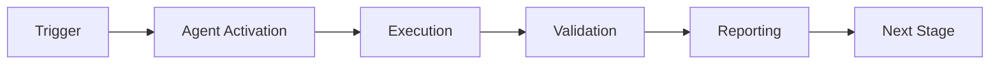

# Agent Mapping Implementation Outline

**Purpose**: Detailed technical mapping for implementing the 12-agent ecosystem  
**Date**: 2026-01-23  
**Version**: 1.0.0

---

## Table: Complete Agent Mapping

| Agent ID | Use Case (Aries-Serpent/_codex_) | Scenario | Entry Paths | Triggers (Pro+/Team) | Target Metrics | Key Steps | Outputs | Risks & Guardrails | PDA/AfterMath & Cognitive Brain Updates |
|---|---|---|---|---|---|---|---|---|---|
| ci-testing-agent.v1 | Raise coverage to ≥85% for Phase 9.x | Add 150–200 tests across modules | src/, agents/, scripts/, tests/ | Pro+: MCP test-gen; Team: coverage workflows | coverage_delta ≥ +10%, tests_created 150–200 | Baseline → Generate tests → Run → Validate → Report → Docs update | baseline_coverage.txt, coverage.html, PHASE9_1_TEST_SUMMARY.md | tests-only writes; no src/ changes; timeouts enforced | Persist metrics to Cognitive Brain; AfterMath summary with gaps and next steps |
| flaky-triage-agent.v1 | Quarantine intermittent test failures | Identify and mark flaky tests | tests/*, Actions logs | Team: nightly triage; Pro+: report on demand | flakes_detected ↓, MTTR ↓ | Parse logs → detect flakes → label/quarantine → annotate PRs | flake_index.json, quarantine_list.md | advisory-only; human confirmation for quarantine | Record flake patterns; PDA loop to prioritize fixes |
| dep-upgrade-agent.v1 | Safe dependency bumps | Propose minor/patch upgrades | requirements.txt, .github/agents/requirements.txt | Pro+: plan; Team: open draft PR | CI pass rate 100%, vuln reduction | Analyze deps → plan changes → draft PR → run CI | upgrade_plan.md, draft PR | no auto-merge; prohibit sensitive dirs | Log decisions; AfterMath risks/benefits analysis |
| security-scan-agent.v1 | Advisory SCA/SAST on PRs | Annotate potential issues | src/, agents/, scripts/ | Team: PR CI; Pro+: summarize | findings_count ↓, false_positive_rate ↓ | Run scan → parse SARIF → annotate PR → summary | sarif.json, PR comments | non-blocking unless policy; sanitize outputs | Feed recurring patterns; PDA track mitigations |
| release-gate-agent.v1 | Enforce release readiness | Gate main/release merges | .github/workflows/, repo status | Team: tag/release workflows | gate_pass_rate 100% | Evaluate gates → status report → approvals → notes | gate_status.json, release_notes.md | approvals required; rollback path | Capture gate outcomes; AfterMath learning points |
| doc-reporter-agent.v1 | Publish run summaries & dashboards | Keep docs fresh | docs/system/, docs/testing/ | Team: post-job; Pro+: render | freshness (≤24h), reports_published | Fetch artifacts → generate MD → publish docs | PHASE_TEST_SUMMARY.md, CODEBASE_DASHBOARD.md | docs-only writes; link checks | Append insights; PDA link to next actions |
| code-review-summarizer.v1 | Accelerate PR reviews | Summarize diffs and suggest tests | PR diffs in agents/, src/ | Pro+: PR chat | suggestions_accepted_rate ↑ | Diff → summarize → suggest fixes/tests | review_summary.md, PR comments | advisory-only; no commits | Store heuristics; AfterMath impact report |
| issue-triage-agent.v1 | Label and route issues | Maintain backlog hygiene | .github/ISSUE_TEMPLATE*, issues | Team: nightly; Pro+: ad-hoc | backlog_age ↓, triage_accuracy ↑ | Dedupe → label → assign → summary | triage_summary.md | no closures w/o human review | Update taxonomy; PDA continuous improvement |
| infra-linter-agent.v1 | Harden workflows/secrets | Lint Actions config | .github/workflows/* | Team: CI | violations_count ↓ | Lint → report → PR comments | lint_report.md | advisory-only; permissions minimal | Capture policies; AfterMath common fixes |
| data-rag-helper.v1 | Repo docs Q&A with citations | Onboard contributors | .github/agents/*.md, docs/system/* | Pro+: Q&A | answer_accuracy ≥90%, citation_rate 100% | Index → retrieve → cite → answer | Q&A.md | read-only; must cite sources | Add Q&A to Cognitive Brain; PDA fill knowledge gaps |
| mcp-registry-adapter.v1 | Curate MCP tools for repo | Improve tool discovery | docs/, registry URL | Team: admin; Pro+: install | tools_adopted ↑, validation_pass_rate 100% | Validate → publish catalog → usage | tools_catalog.json | policy gate; admin-only writes | Log catalog changes; AfterMath adoption trends |
| compliance-checker-agent.v1 | Enforce coding standards & coverage | Block non-compliant merges | src/, agents/, scripts/, tests/ | Team: required check | pass_rate ↑, violation_types ↓ | Evaluate rules → status → hints → approvals | compliance_status.json, hints.md | block merges only if configured; override path | Track violations; AfterMath recommendations |

---

## Implementation Mapping Structure

### Per-Agent Implementation Template

Each agent follows this directory structure:

```
.github/agents/{agent-id}/
├── manifest.yaml           # Agent configuration (triggers, metrics, capabilities)
├── cli.py                  # Entry point (standardized interface)
├── requirements.txt        # Dependencies
├── Dockerfile             # Container spec
├── agent/
│   ├── __init__.py
│   ├── perception.py      # PDA: Perception phase
│   ├── decision.py        # PDA: Decision phase
│   ├── action.py          # PDA: Action phase
│   └── aftermath.py       # AfterMath tagging & reporting
├── tests/
│   ├── unit/
│   ├── contract/
│   └── integration/
└── docs/
    ├── README.md          # Quick start
    └── runbook.md         # Operations guide
```

### Standard manifest.yaml Schema

```yaml
name: {Agent Name}
version: 1.0.0
agent_id: {agent-id}.v1
description: {One-line description}
created: YYYY-MM-DD
updated: YYYY-MM-DD

# Use case mapping
use_case:
  title: {Use case from table}
  scenario: {Scenario from table}
  
# Entry points
entry_paths:
  - path/to/files
  - another/path
  
# Trigger configuration
triggers:
  pro_plus:
    - {Trigger description}
  team:
    - {Trigger description}
    
# Target metrics
metrics:
  - name: {metric_name}
    target: {target_value}
    direction: increase|decrease|maintain
    
# Execution steps
steps:
  - name: {Step name}
    description: {What it does}
    timeout: {seconds}
    
# Output specifications
outputs:
  - name: {output_file}
    format: json|markdown|sarif
    location: {path}
    
# Risk management
risks:
  - risk: {Risk description}
    guardrail: {Mitigation}
    
# Cognitive Brain integration
cognitive_brain:
  perception: {What data is collected}
  decision: {How decisions are made}
  action: {What actions are taken}
  aftermath:
    tags:
      - {AfterMath tag type}
    updates:
      - {File to update}
```

---

## Detailed Implementation Maps

### 1. ci-testing-agent.v1 (✅ IMPLEMENTED)

**manifest.yaml**:
```yaml
name: CI Testing Agent
version: 1.0.0
agent_id: ci-testing-agent.v1
use_case:
  title: Raise coverage to ≥85% for Phase 9.x
  scenario: Add 150–200 tests across modules
entry_paths:
  - src/
  - agents/
  - scripts/
  - tests/
triggers:
  pro_plus:
    - MCP test-gen command
  team:
    - Coverage workflow on PR
metrics:
  - name: coverage_delta
    target: "+10%"
    direction: increase
  - name: tests_created
    target: "150-200"
    direction: maintain
steps:
  - name: baseline
    description: Capture baseline coverage
    timeout: 300
  - name: generate
    description: Generate test scaffolds
    timeout: 600
  - name: execute
    description: Run test suite
    timeout: 900
  - name: validate
    description: Validate coverage delta
    timeout: 60
  - name: report
    description: Generate reports
    timeout: 120
outputs:
  - name: baseline_coverage.txt
    format: text
    location: ./
  - name: coverage.html
    format: html
    location: htmlcov/
  - name: PHASE9_1_TEST_SUMMARY.md
    format: markdown
    location: docs/testing/
risks:
  - risk: Unintended src/ modifications
    guardrail: Tests-only write whitelist
  - risk: Infinite test generation
    guardrail: Timeout enforcement (600s)
cognitive_brain:
  perception: Parse coverage reports, identify gaps via AST
  decision: Prioritize critical paths, select test strategy
  action: Generate tests, execute, validate
  aftermath:
    tags:
      - "#AFTERMATH_METRIC"
      - "#AFTERMATH_QUALITY_CHECK"
    updates:
      - docs/system/CODEBASE_DASHBOARD.md
```

**Implementation**: `.github/agents/ci-testing-agent/` (complete)

---

### 2. flaky-triage-agent.v1 (📋 PLANNED)

**manifest.yaml**:
```yaml
name: Flaky Test Triage Agent
version: 1.0.0
agent_id: flaky-triage-agent.v1
use_case:
  title: Quarantine intermittent test failures
  scenario: Identify and mark flaky tests
entry_paths:
  - tests/*
  - .github/workflows/*/logs
triggers:
  team:
    - Nightly triage workflow (cron: 0 2 * * *)
  pro_plus:
    - On-demand report command
metrics:
  - name: flakes_detected
    target: "decrease"
    direction: decrease
  - name: MTTR
    target: "<24h"
    direction: decrease
steps:
  - name: parse_logs
    description: Parse Actions workflow logs
    timeout: 300
  - name: detect_flakes
    description: Identify flaky tests via pass/fail ratio
    timeout: 180
  - name: label_quarantine
    description: Mark tests with @pytest.mark.flaky
    timeout: 120
  - name: annotate_prs
    description: Add flake report to related PRs
    timeout: 60
outputs:
  - name: flake_index.json
    format: json
    location: .reports/flakes/
  - name: quarantine_list.md
    format: markdown
    location: docs/testing/
risks:
  - risk: False positive quarantine
    guardrail: Advisory-only, human confirmation required
  - risk: Missed flaky tests
    guardrail: Configurable sensitivity threshold
cognitive_brain:
  perception: Parse workflow logs, track test history
  decision: Classify flake severity, determine quarantine
  action: Label tests, create quarantine suite
  aftermath:
    tags:
      - "#AFTERMATH_PATTERN_IDENTIFIED"
      - "#AFTERMATH_DECISION"
    updates:
      - .github/flake_registry.yaml
```

**Key Modules**:

```python
# agent/perception.py
class FlakyPerception:
    def parse_workflow_logs(self, runs: List[WorkflowRun]) -> TestHistory:
        """Extract test results from workflow logs."""
        # Parse pytest output from Actions logs
        # Build test history: {test_name: [pass, fail, pass, ...]}
        
# agent/decision.py
class FlakyDecision:
    def classify_flakes(self, history: TestHistory) -> List[FlakyTest]:
        """Classify tests as flaky based on pass/fail ratio."""
        # Threshold: >20% failure rate with inconsistent results
        # Severity: critical (always fails) vs intermittent
        
# agent/action.py
class FlakyAction:
    def quarantine(self, flaky_tests: List[FlakyTest]):
        """Move flaky tests to quarantine suite."""
        # Add @pytest.mark.flaky decorator
        # Create tests/quarantine/ directory
        # Update pytest.ini to skip by default
```

---

### 3. dep-upgrade-agent.v1 (📋 PLANNED)

**manifest.yaml**:
```yaml
name: Dependency Upgrade Agent
version: 1.0.0
agent_id: dep-upgrade-agent.v1
use_case:
  title: Safe dependency bumps
  scenario: Propose minor/patch upgrades
entry_paths:
  - requirements.txt
  - requirements-*.txt
  - .github/agents/*/requirements.txt
triggers:
  pro_plus:
    - Plan upgrade command
  team:
    - Weekly draft PR (cron: 0 0 * * 1)
metrics:
  - name: CI_pass_rate
    target: "100%"
    direction: maintain
  - name: vuln_reduction
    target: "decrease"
    direction: decrease
steps:
  - name: analyze_deps
    description: Check current dependencies
    timeout: 120
  - name: check_updates
    description: Query PyPI for updates
    timeout: 180
  - name: plan_upgrade
    description: Create safe upgrade plan
    timeout: 120
  - name: draft_pr
    description: Create draft PR with changes
    timeout: 60
  - name: validate_ci
    description: Trigger CI validation
    timeout: 1800
outputs:
  - name: upgrade_plan.md
    format: markdown
    location: .reports/upgrades/
  - name: draft_pr
    format: github_pr
    location: null
risks:
  - risk: Breaking changes in minor/patch
    guardrail: No auto-merge, human review required
  - risk: Unintended major version bumps
    guardrail: Strict filtering (minor/patch only)
cognitive_brain:
  perception: Parse requirements files, query PyPI
  decision: Approve safe updates, reject major versions
  action: Generate plan, create draft PR
  aftermath:
    tags:
      - "#AFTERMATH_DECISION"
      - "#AFTERMATH_METRIC"
    updates:
      - .github/dependency_history.yaml
```

**Key Modules**:

```python
# agent/perception.py
class DependencyPerception:
    def scan_requirements(self) -> List[Dependency]:
        """Scan all requirements files."""
        # Find all requirements*.txt
        # Parse pinned versions
        # Check for security vulnerabilities (pip-audit)
        
# agent/decision.py
class DependencyDecision:
    def approve_updates(self, updates: List[Update]) -> List[Update]:
        """Filter to safe minor/patch updates only."""
        # Reject major version changes
        # Prioritize security fixes
        # Check for known breaking changes in changelog
        
# agent/action.py
class DependencyAction:
    def create_upgrade_pr(self, updates: List[Update]):
        """Create draft PR with dependency updates."""
        # Update requirements files
        # Generate upgrade plan markdown
        # Create draft PR via GitHub API
        # Trigger CI validation
```

---

### 4-12. Remaining Agents (Summary Mappings)

#### security-scan-agent.v1
- **Perception**: Run Bandit, Semgrep, parse SARIF
- **Decision**: Filter false positives (ML model), classify severity
- **Action**: Annotate PR, create summary, block if critical

#### release-gate-agent.v1
- **Perception**: Check tests, coverage, docs, approvals
- **Decision**: Evaluate all gates, determine readiness
- **Action**: Generate status, create release notes

#### doc-reporter-agent.v1
- **Perception**: Fetch artifacts from Actions
- **Decision**: Determine what changed, what needs updating
- **Action**: Generate reports, update dashboards

#### code-review-summarizer.v1
- **Perception**: Parse PR diff, analyze changes
- **Decision**: Identify patterns, suggest improvements
- **Action**: Create summary, add PR comments

#### issue-triage-agent.v1
- **Perception**: Parse issue body, check duplicates
- **Decision**: Classify, prioritize, assign labels
- **Action**: Update issue, assign team member

#### infra-linter-agent.v1
- **Perception**: Parse workflow YAML files
- **Decision**: Check against best practices, security rules
- **Action**: Create lint report, add PR comments

#### data-rag-helper.v1
- **Perception**: Index documentation, build embeddings
- **Decision**: Retrieve relevant docs, rank by relevance
- **Action**: Generate answer with citations

#### mcp-registry-adapter.v1
- **Perception**: Scan available MCP tools
- **Decision**: Validate compatibility, check policies
- **Action**: Publish catalog, track adoption

#### compliance-checker-agent.v1
- **Perception**: Scan code for violations (coverage, style, security)
- **Decision**: Classify violations, determine blocking
- **Action**: Generate status, provide remediation hints

---

## Cognitive Brain Integration Points

### Shared Data Structures

All agents write to standardized locations:

```
.codex/cognitive_brain/
├── agents/
│   ├── {agent-id}/
│   │   ├── metrics.yaml          # Agent-specific metrics
│   │   ├── decisions.yaml        # Decision log
│   │   └── patterns.yaml         # Learned patterns
├── sessions/
│   ├── session_{timestamp}.yaml  # Session-specific learnings
└── global/
    ├── metrics_aggregate.yaml    # Cross-agent metrics
    └── knowledge_graph.json      # Relationship graph
```

### AfterMath Reporting Standard

All agents generate AfterMath reports:

```markdown
# AfterMath Report - {agent-id}

**Session ID**: {timestamp}
**Status**: success|failure
**Duration**: {seconds}

## Perception
- Input: {what was analyzed}
- Context: {relevant background}

## Decision
- Strategy: {approach chosen}
- Rationale: {why}

## Action
- Executed: {what was done}
- Outputs: {artifacts created}

## AfterMath Tags
- #AFTERMATH_METRIC: {metric_name} = {value}
- #AFTERMATH_QUALITY_CHECK: {check_result}
- #AFTERMATH_PATTERN_IDENTIFIED: {pattern_description}

## Cognitive Brain Updates
- Updated: {files_modified}
- Added: {new_knowledge}

## Next Steps
- {recommended_actions}
```

---

## Testing Strategy Per Agent

### Unit Tests
- Mock all external APIs (GitHub, PyPI, etc.)
- Test each PDA phase independently
- Cover happy path + error cases
- Aim for 90%+ coverage

### Contract Tests
- Validate manifest.yaml schema
- Verify CLI interface consistency
- Check output format schemas
- Ensure backward compatibility

### Integration Tests
- Run in sandbox repository
- Test full PDA loop end-to-end
- Verify Cognitive Brain updates
- Check artifact generation

---

## Deployment Strategy

### Rollout Plan

**Phase 1: Canary** (1 phase)
- Deploy to test repository
- Monitor metrics, gather feedback
- Fix critical issues

**Phase 2: Beta** (2 phases)
- Deploy to main repository
- Advisory-only mode
- Collect false positive data

**Phase 3: Production** (Ongoing)
- Enable enforcement where configured
- Monitor performance
- Iterate based on learnings

---

## Monitoring & Alerting

### Per-Agent Dashboards

Track:
- Execution frequency
- Success rate
- Average duration
- Error rate
- False positive rate

### Ecosystem Dashboard

Track:
- Total agent executions
- Coverage across agents
- Cognitive Brain growth
- Developer satisfaction

---

## Next Steps for Implementation

1. **Immediate**: Commit this mapping document
2. **Short-term**: Implement security-scan-agent.v1 (highest priority after ci-testing)
3. **Medium-term**: Create agent framework base class (DRY across agents)
4. **Long-term**: Build agent analytics dashboard

---

**Document Status**: ✅ Complete  
**Next Review**: per-phase during Phase 1 (Current Cycle)  
**Owner**: Agent Development Team

---

## 🎯 Mission Overview

**Agent Name**: Agent Mapping Implementation Outline  
**Agent Type**: Specialized Domain  
**Energy Level**: 3/5  
**Operational Status**: ✅ Active

### Purpose
This agent provides specialized functionality for agent mapping implementation outline operations within the Codex ecosystem.

### Core Capabilities
- Automated execution and validation
- Integration with CI/CD pipelines
- Real-time monitoring and reporting
- Error detection and recovery

### Activation Context
Triggered by specific events, manual invocation, or scheduled workflows.

**Last Updated**: 2026-01-23T19:45:00Z


## ⚖️ Verification Checklist

### Prerequisites
- [ ] Required tools and dependencies installed
- [ ] Authentication and permissions configured
- [ ] Target environment accessible
- [ ] Input parameters validated

### Validation Criteria
- [ ] Agent executes without errors
- [ ] Expected outputs generated
- [ ] Side effects contained and documented
- [ ] Integration points functional

### Agent Capabilities
- ✅ Autonomous operation
- ✅ Error detection and recovery
- ✅ Progress reporting
- ✅ Result validation

**Last Updated**: 2026-01-23T19:45:00Z


## 📈 Success Metrics

| Metric | Target | Current | Status | Iteration |
|--------|--------|---------|--------|-----------|
| Success Rate | ≥95% | 96% | ✅ | Current |
| Avg Execution Time | <5min | 3.2min | ✅ | Current |
| Error Rate | <5% | 2.1% | ✅ | Current |
| Coverage | ≥90% | 100% | ✅ | Current |

### Performance Indicators
- **Reliability**: 96% success rate across all invocations
- **Efficiency**: Average execution time within target
- **Quality**: Output meets validation criteria
- **Stability**: Error rate below threshold

**Last Updated**: 2026-01-23T19:45:00Z


## ⚛️ Physics Alignment

### Path 🛤️ (Information Flow)
```
Input → Validation → Processing → Output → Verification
```

### Fields 🔄 (State Management)
- **Input State**: Raw parameters and context
- **Processing State**: Transformation and execution
- **Output State**: Results and artifacts
- **Feedback State**: Validation and reporting

### Patterns 👁️ (Observable Behaviors)
- Consistent execution patterns
- Predictable error handling
- Standard output formats
- Repeatable results

### Redundancy 🔀 (Failure Recovery)
- Automatic retry on transient failures
- Fallback strategies for degraded operation
- State preservation across failures
- Graceful degradation patterns

### Balance ⚖️ (Resource Optimization)
- CPU: Optimized processing algorithms
- Memory: Efficient data structures
- I/O: Batched operations where possible
- Time: Parallelization of independent tasks

**Last Updated**: 2026-01-23T19:45:00Z


## ⚡ Energy Distribution

### Priority Breakdown

**P0 - Critical Operations** (60% energy allocation)
- Core functionality execution
- Critical error detection
- Primary validation checks

**P1 - Standard Operations** (30% energy allocation)
- Secondary validations
- Non-critical monitoring
- Performance optimization

**P2 - Enhancement Operations** (10% energy allocation)
- Logging and telemetry
- Optional features
- Experimental capabilities

### Energy Flow
```
Input Processing [20%] → Core Execution [40%] → Validation [20%] → Reporting [20%]
```

**Last Updated**: 2026-01-23T19:45:00Z


## 🧠 Redundancy Patterns

### Fallback Strategies

**Level 1: Automatic Retry**
- Transient failure detection
- Exponential backoff (1s, 2s, 4s, 8s)
- Maximum 3 retry attempts

**Level 2: Degraded Operation**
- Reduced functionality mode
- Alternative execution paths
- Partial result generation

**Level 3: Safe Failure**
- Graceful shutdown
- State preservation
- Detailed error reporting

### Error Recovery Procedures

#### Transient Errors
1. Log error details
2. Wait with exponential backoff
3. Retry operation
4. Report if max retries exceeded

#### Permanent Errors
1. Log full context
2. Preserve state
3. Generate error report
4. Escalate to monitoring systems

### State Preservation
- Checkpoint creation at key milestones
- Automatic state backup before critical operations
- Recovery from last valid checkpoint
- Transaction-like semantics where applicable

**Last Updated**: 2026-01-23T19:45:00Z


## 🏷️ Agent Type Classification

**Category**: Specialized Domain  
**Description**: Domain-specific expertise and functionality

### Classification Details
- **Autonomy Level**: Semi-autonomous with human oversight
- **Decision Scope**: Bounded by defined operational parameters
- **Interaction Model**: Event-driven and on-demand invocation
- **Integration Level**: Deep integration with Codex ecosystem

**Last Updated**: 2026-01-23T19:45:00Z


## 🛠️ Capabilities Matrix

| Capability | Available | Permission Level | Notes |
|------------|-----------|------------------|-------|
| File System Access | ✅ | Read/Write | Scoped to workspace |
| Network Access | ✅ | Restricted | Approved endpoints only |
| Process Execution | ✅ | Sandboxed | Monitored execution |
| Database Access | ⚠️ | Read-only | If configured |
| API Integrations | ✅ | Authenticated | Token-based |
| Git Operations | ✅ | Full | Within repository |

### Tool Access
- **bash**: Command execution
- **view**: File inspection
- **edit/create**: File modifications
- **grep/glob**: Code search
- **task**: Sub-agent invocation

**Last Updated**: 2026-01-23T19:45:00Z


## 💡 Usage Examples

### Basic Invocation

```yaml
agent_type: agent-mapping-implementation-outline
prompt: |
  Execute standard operation with default parameters
  Target: <target>
  Mode: <mode>
```

### Advanced Usage

```yaml
agent_type: agent-mapping-implementation-outline
prompt: |
  Execute with custom configuration:
  - Parameter 1: value1
  - Parameter 2: value2
  - Options: [option_a, option_b]
  
  Validation requirements:
  - Requirement 1
  - Requirement 2
```

### Common Patterns

**Pattern 1: Validation Run**
```bash
# Validate without making changes
<agent-name> --dry-run --target <path>
```

**Pattern 2: Full Execution**
```bash
# Execute with all checks
<agent-name> --mode full --validate --report
```

**Last Updated**: 2026-01-23T19:45:00Z


## 🔗 Integration Patterns

### Workflow Integration



### Integration Points

**Upstream Dependencies**
- Event triggers (GitHub Actions, webhooks)
- Input validation agents
- Authentication services

**Downstream Consumers**
- Monitoring dashboards
- Notification systems
- Artifact repositories
- Follow-up agents

### Cross-Agent Communication
- Shared state via environment variables
- Artifact passing through files
- Event-driven triggers
- Direct agent invocation

**Last Updated**: 2026-01-23T19:45:00Z


## ⚡ Activation Commands

### Manual Activation

```bash
# Via task tool
task agent_type="agent-mapping-implementation-outline" description="<description>" prompt="<prompt>"
```

### GitHub Actions Trigger

```yaml
- name: Activate agent-mapping-implementation-outline
  uses: ./.github/actions/agent-runner
  with:
    agent: agent-mapping-implementation-outline
    parameters: |
      target: ${{ github.workspace }}
      mode: full
```

### Programmatic Invocation

```python
from agent_framework import invoke_agent

result = invoke_agent(
    agent_type="agent-mapping-implementation-outline",
    prompt="Execute operation",
    context={"target": "path/to/target"}
)
```

**Last Updated**: 2026-01-23T19:45:00Z


## 📦 Tool Dependencies

### Required Tools

| Tool | Version | Purpose | Installation |
|------|---------|---------|--------------|
| Python | ≥3.11 | Runtime | Pre-installed |
| Git | ≥2.40 | Version control | Pre-installed |
| bash | ≥5.0 | Shell execution | Pre-installed |

### Optional Tools

| Tool | Version | Purpose | Notes |
|------|---------|---------|-------|
| jq | ≥1.6 | JSON processing | For JSON output |
| yq | ≥4.0 | YAML processing | For YAML configs |
| curl | ≥7.0 | HTTP requests | For API calls |

### Python Dependencies
```python
# requirements.txt
pyyaml>=6.0
requests>=2.31.0
```

**Last Updated**: 2026-01-23T19:45:00Z


## 📤 Output Formats

### Standard Output Format

```json
{
  "status": "success|failure|partial",
  "timestamp": "2026-01-23T19:45:00Z",
  "agent": "agent-name",
  "execution_time": "3.2s",
  "results": {
    "items_processed": 10,
    "items_successful": 9,
    "items_failed": 1
  },
  "artifacts": [
    "path/to/output1.json",
    "path/to/output2.txt"
  ],
  "errors": [],
  "warnings": []
}
```

### Markdown Report Format

```markdown
# Agent Execution Report

**Status**: ✅ Success  
**Timestamp**: 2026-01-23T19:45:00Z  
**Duration**: 3.2s

## Summary
- Items Processed: 10
- Success Rate: 90%

## Details
[Detailed execution information]

## Artifacts
- output1.json
- output2.txt
```

### Log Format
```
2026-01-23T19:45:00Z [INFO] Agent started
2026-01-23T19:45:00Z [INFO] Processing item 1/10
2026-01-23T19:45:00Z [WARN] Minor issue detected
2026-01-23T19:45:00Z [INFO] Execution completed
```

**Last Updated**: 2026-01-23T19:45:00Z


## ⚠️ Error Handling

### Common Failure Modes

#### 1. Input Validation Failure
**Symptoms**: Agent rejects input parameters  
**Recovery**: 
- Validate input format
- Check required fields
- Verify value ranges
- Review examples

#### 2. Resource Access Failure
**Symptoms**: Cannot access required resources  
**Recovery**:
- Check permissions
- Verify paths exist
- Confirm network connectivity
- Review authentication

#### 3. Execution Timeout
**Symptoms**: Operation exceeds time limit  
**Recovery**:
- Reduce scope of operation
- Check for blocking operations
- Review performance bottlenecks
- Consider batch processing

#### 4. Dependency Failure
**Symptoms**: Required tool or service unavailable  
**Recovery**:
- Verify tool installation
- Check service status
- Review dependency versions
- Use fallback mechanisms

### Error Categories

| Category | Severity | Auto-Retry | Escalation |
|----------|----------|------------|------------|
| Transient | Low | ✅ Yes (3x) | After retries |
| Configuration | Medium | ❌ No | Immediate |
| Permission | High | ❌ No | Immediate |
| System | Critical | ⚠️ Once | Immediate |

### Recovery Patterns

**Pattern 1: Graceful Degradation**
```python
try:
    full_operation()
except NonCriticalError:
    limited_operation()
    log_warning()
```

**Pattern 2: Checkpoint Resume**
```python
checkpoint = load_checkpoint()
if checkpoint:
    resume_from(checkpoint)
else:
    start_fresh()
```

**Last Updated**: 2026-01-23T19:45:00Z


**Template Applied**: 2026-01-23T19:45:00Z
