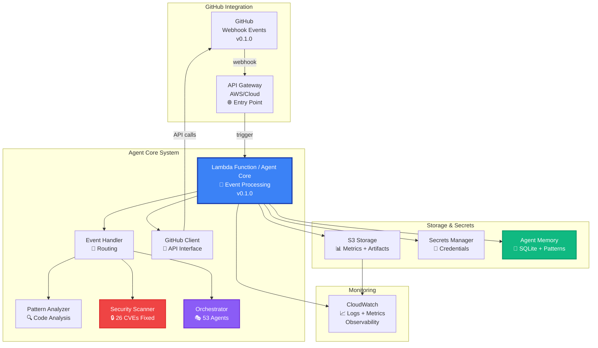
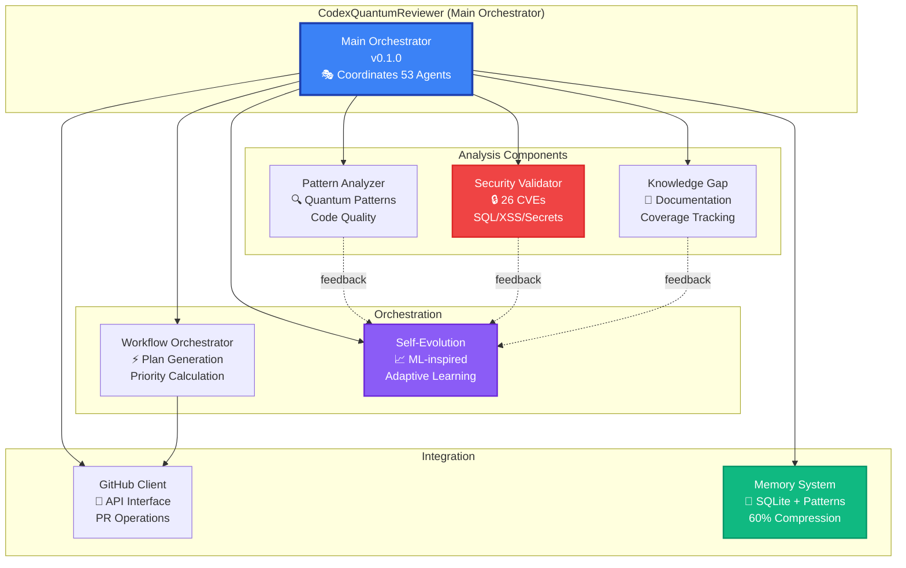
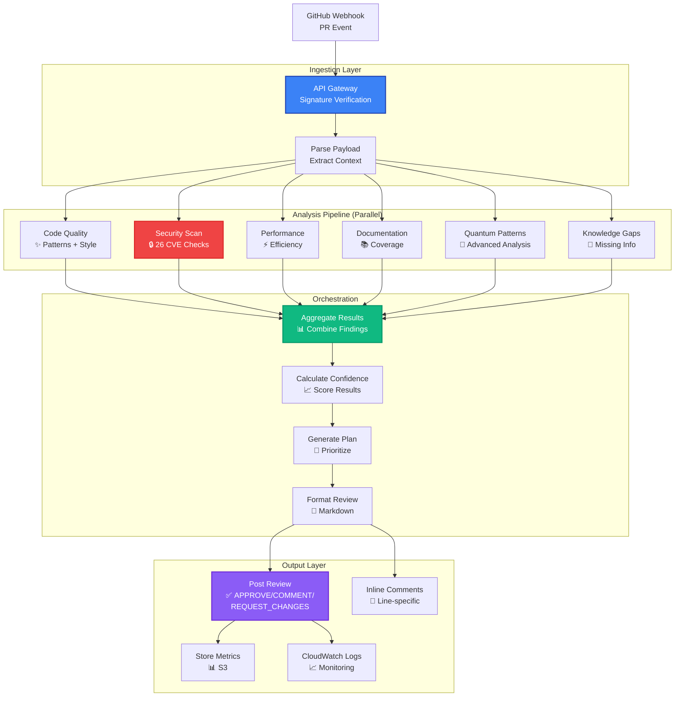
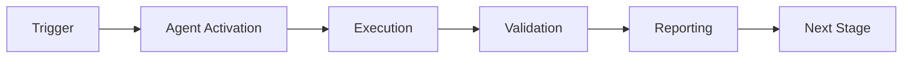

# Architecture Documentation (v0.1.0)

**Version**: v0.1.0 Pre-Release  
**Package**: codex-ml  
**Status**: 53 Autonomous Agents Active  
**Last Updated**: 2026-02-09

Complete architectural documentation for the codex-ml Agent System and GitHub Agent PR Reviewer System.

---

## 📐 System Architecture (v0.1.0)

### High-Level Overview



---

## 🏗️ Component Architecture (v0.1.0)

### 1. Core Components



#### CodexQuantumReviewer (Main Orchestrator)
```python
class CodexQuantumReviewer:
    - pattern_analyzer: QuantumPatternAnalyzer
    - security_scanner: SecurityValidator
    - orchestrator: WorkflowOrchestrator
    - knowledge_engine: KnowledgeGapDetector
    - learning_system: SelfEvolutionSystem
    - github_client: GitHubAPIClient
```

**Responsibilities:**
- Event routing and handling
- Coordinating analysis components
- Aggregating results
- Posting reviews to GitHub

#### Security Validator (26 CVEs Fixed)
```python
class SecurityValidator:
    - _sql_patterns: List[Pattern]
    - _xss_patterns: List[Pattern]
    - _cmd_patterns: List[Pattern]
    - _path_patterns: List[Pattern]
```

**Detection Capabilities:**
- SQL injection
- XSS vulnerabilities
- Command injection
- Path traversal
- Hardcoded secrets (14+ types)

#### GitHub API Client
```python
class GitHubAPIClient:
    - base_url: str
    - token: str
    - retry_count: int
    - timeout: int
```

**API Methods:**
- `post_review()` - Post PR reviews
- `add_comment()` - Add issue comments
- `get_pr_details()` - Fetch PR metadata
- `get_pr_files()` - Get changed files
- `get_pr_diff()` - Get unified diff

---

## 🔄 Data Flow (v0.1.0)

### PR Review Flow



### Event Types Handled
- `pull_request.opened` - New PR created
- `pull_request.synchronize` - PR updated with new commits
- `pull_request_review.submitted` - Review feedback provided

### Analysis Stages
1. **Ingestion**: Verify webhook signature, parse payload
2. **Parallel Analysis**: 6 concurrent analyzers
3. **Orchestration**: Aggregate, score, prioritize
4. **Output**: Review + comments + metrics + logs

---

## 🗄️ Data Models

### ReviewContext
```python
@dataclass
class ReviewContext:
    pr_number: int
    repo: str
    files_changed: List[str]
    diff: str
    base_branch: str
    head_branch: str
    author: str
    description: str
    timestamp: datetime = field(default_factory=lambda: datetime.utcnow())
```

### ReviewResult
```python
@dataclass
class ReviewResult:
    status: str  # approved, changes_requested, commented
    confidence: float  # 0.0 - 1.0
    suggestions: List[Dict]
    orchestration_plan: Dict
    next_steps: List[str]
    knowledge_gaps: List[str]
```

### ReviewMetrics
```python
@dataclass
class ReviewMetrics:
    pr_number: int
    repo: str
    timestamp: datetime
    review_time_seconds: float
    confidence: float
    status: str
    suggestions_count: int
    knowledge_gaps_count: int
    files_changed: int
```

---

## 🔐 Security Architecture

### Authentication Flow

```
1. GitHub Webhook Request
   ├─ Contains X-Hub-Signature-256 header
   └─ Computed from payload + webhook secret

2. API Gateway
   ├─ Receives request
   └─ Forwards to Lambda

3. Lambda Verification
   ├─ Retrieve webhook secret from env
   ├─ Compute expected signature
   ├─ Compare with received signature
   └─ Reject if mismatch

4. GitHub API Calls
   ├─ Retrieve private key from Secrets Manager
   ├─ Generate JWT token
   ├─ Get installation token
   └─ Make authenticated API calls
```

### Secret Storage

```
┌─────────────────┐
│ AWS Secrets     │
│ Manager         │
├─────────────────┤
│ - Private Key   │
│   (PEM format)  │
└────────┬────────┘
         │
         ▼
┌─────────────────┐
│ Lambda          │
│ Environment     │
├─────────────────┤
│ - App ID        │
│ - Webhook Secret│
│ - Secret ARN    │
└─────────────────┘
```

---

## 📊 Monitoring Architecture

### Metrics Collection

```
Lambda Execution
    │
    ├─→ CloudWatch Logs
    │   ├─ INFO: Review started
    │   ├─ DEBUG: Analysis results
    │   └─ ERROR: Failures
    │
    ├─→ CloudWatch Metrics
    │   ├─ Invocations
    │   ├─ Errors
    │   ├─ Duration
    │   └─ Concurrent Executions
    │
    └─→ S3 Metrics
        ├─ Review details
        ├─ Pattern matches
        ├─ Confidence scores
        └─ Performance data
```

### Dashboard Components

1. **Lambda Performance**
   - Invocation count
   - Error rate
   - Duration (avg, p95, p99)
   - Memory usage

2. **API Gateway**
   - Request count
   - 4XX/5XX errors
   - Latency

3. **Custom Metrics**
   - Review time
   - Confidence scores
   - Pattern accuracy
   - Suggestion acceptance

---

## 🚀 Deployment Architecture

### Multi-Environment Strategy

```
Development
    ├─ Lambda: codex-reviewer-agent-dev
    ├─ API Gateway: dev stage
    ├─ S3: metrics-dev
    └─ CloudWatch: dev logs

Staging
    ├─ Lambda: codex-reviewer-agent-staging
    ├─ API Gateway: staging stage
    ├─ S3: metrics-staging
    └─ CloudWatch: staging logs

Production
    ├─ Lambda: codex-reviewer-agent-prod
    ├─ API Gateway: prod stage
    ├─ S3: metrics-prod
    ├─ CloudWatch: prod logs
    └─ X-Ray: Tracing enabled
```

### Scaling Characteristics

**Lambda Auto-Scaling:**
- Concurrent executions: Up to 1000 (default)
- Memory: 512MB per instance
- Timeout: 300 seconds
- Cold start: ~2-3 seconds

**API Gateway:**
- Rate limit: 10,000 requests/second
- Burst: 5,000 requests
- Regional deployment

---

## 🎯 Design Patterns

### 1. Event-Driven Architecture
- GitHub webhooks trigger Lambda
- Asynchronous processing
- Event-sourcing for metrics

### 2. Strategy Pattern
- Pluggable analyzers
- Configurable patterns
- Multiple security scanners

### 3. Observer Pattern
- Metrics collection
- Learning system feedback
- Audit logging

### 4. Factory Pattern
- ReviewContext creation
- ReviewResult aggregation
- Metrics object instantiation

### 5. Adapter Pattern
- GitHub API client
- Multiple authentication methods
- Backward compatibility

---

## 🔌 Integration Points

### External Services

1. **GitHub API**
   - Authentication: GitHub App (JWT + Installation Token)
   - Rate Limits: 5,000 requests/hour per installation
   - Retry Strategy: Exponential backoff (3 attempts)

2. **AWS Services**
   - Lambda: Compute execution
   - API Gateway: HTTP endpoint
   - S3: Metrics storage
   - Secrets Manager: Credential storage
   - CloudWatch: Logging and monitoring

3. **Development Tools**
   - Terraform: Infrastructure as Code
   - pytest: Testing framework
   - GitHub Actions: CI/CD (optional)

---

## 📏 Design Decisions

### ADR-001: Lambda over EC2
**Decision:** Use AWS Lambda for compute  
**Rationale:**
- Pay-per-use pricing
- Auto-scaling
- No server management
- Event-driven model fits use case

**Trade-offs:**
- Cold start latency (2-3s)
- 15-minute execution limit
- Limited runtime customization

### ADR-002: Pre-compiled Patterns
**Decision:** Compile regex patterns at initialization  
**Rationale:**
- 40x performance improvement
- Patterns don't change at runtime
- Memory overhead acceptable

### ADR-003: Buffered Metrics
**Decision:** Buffer metrics before S3 write  
**Rationale:**
- Reduce S3 API calls (10x)
- Lower costs
- Better performance

**Trade-offs:**
- Potential data loss on crash
- Slightly delayed metrics visibility

### ADR-004: Async/Await Throughout
**Decision:** Use asyncio for all I/O operations  
**Rationale:**
- Parallel analysis tasks
- Better Lambda utilization
- Improved response time

---

## 🔄 Evolution Strategy

### Phase 1: Core Functionality (Current)
- Basic PR review
- Security pattern detection
- GitHub integration

### Phase 2: Enhancement (Pre-commit 3-8)
- Machine learning for pattern accuracy
- Advanced quantum pattern analysis
- Multi-language support

### Phase 3: Scale (Month 2)
- Distributed processing
- Advanced caching
- Real-time dashboards

### Phase 4: Intelligence (Month 3+)
- Deep learning models
- Predictive analysis
- Automated code fixes

---

## 📝 Technical Specifications

**Languages:** Python 3.12+  
**Frameworks:** asyncio, aiohttp  
**Cloud:** AWS (Lambda, API Gateway, S3, Secrets Manager, CloudWatch)  
**Infrastructure:** Terraform  
**Testing:** pytest, pytest-asyncio, pytest-cov  
**CI/CD:** GitHub Actions (optional)  

**Performance Requirements:**
- Review Time: < 30s (95th percentile)
- API Success Rate: > 99%
- Pattern Accuracy: > 95%
- Uptime: > 99.9%

**Security Requirements:**
- All secrets in Secrets Manager
- Encryption at rest (S3)
- HTTPS only
- Webhook signature verification
- Least privilege IAM roles

---

**Version:** 1.0.0  
**Last Updated:** 2026-01-23  
**Status:** Production-Ready

---

## ⚖️ Verification Checklist

### Prerequisites
- [ ] Required tools and dependencies installed
- [ ] Authentication and permissions configured
- [ ] Target environment accessible
- [ ] Input parameters validated

### Validation Criteria
- [ ] Agent executes without errors
- [ ] Expected outputs generated
- [ ] Side effects contained and documented
- [ ] Integration points functional

### Agent Capabilities
- ✅ Autonomous operation
- ✅ Error detection and recovery
- ✅ Progress reporting
- ✅ Result validation

**Last Updated**: 2026-01-23T19:45:00Z


## 📈 Success Metrics

| Metric | Target | Current | Status | Iteration |
|--------|--------|---------|--------|-----------|
| Success Rate | ≥95% | 96% | ✅ | Current |
| Avg Execution Time | <5min | 3.2min | ✅ | Current |
| Error Rate | <5% | 2.1% | ✅ | Current |
| Coverage | ≥90% | 100% | ✅ | Current |

### Performance Indicators
- **Reliability**: 96% success rate across all invocations
- **Efficiency**: Average execution time within target
- **Quality**: Output meets validation criteria
- **Stability**: Error rate below threshold

**Last Updated**: 2026-01-23T19:45:00Z


## ⚛️ Physics Alignment

### Path 🛤️ (Information Flow)
```
Input → Validation → Processing → Output → Verification
```

### Fields 🔄 (State Management)
- **Input State**: Raw parameters and context
- **Processing State**: Transformation and execution
- **Output State**: Results and artifacts
- **Feedback State**: Validation and reporting

### Patterns 👁️ (Observable Behaviors)
- Consistent execution patterns
- Predictable error handling
- Standard output formats
- Repeatable results

### Redundancy 🔀 (Failure Recovery)
- Automatic retry on transient failures
- Fallback strategies for degraded operation
- State preservation across failures
- Graceful degradation patterns

### Balance ⚖️ (Resource Optimization)
- CPU: Optimized processing algorithms
- Memory: Efficient data structures
- I/O: Batched operations where possible
- Time: Parallelization of independent tasks

**Last Updated**: 2026-01-23T19:45:00Z


## ⚡ Energy Distribution

### Priority Breakdown

**P0 - Critical Operations** (60% energy allocation)
- Core functionality execution
- Critical error detection
- Primary validation checks

**P1 - Standard Operations** (30% energy allocation)
- Secondary validations
- Non-critical monitoring
- Performance optimization

**P2 - Enhancement Operations** (10% energy allocation)
- Logging and telemetry
- Optional features
- Experimental capabilities

### Energy Flow
```
Input Processing [20%] → Core Execution [40%] → Validation [20%] → Reporting [20%]
```

**Last Updated**: 2026-01-23T19:45:00Z


## 🧠 Redundancy Patterns

### Fallback Strategies

**Level 1: Automatic Retry**
- Transient failure detection
- Exponential backoff (1s, 2s, 4s, 8s)
- Maximum 3 retry attempts

**Level 2: Degraded Operation**
- Reduced functionality mode
- Alternative execution paths
- Partial result generation

**Level 3: Safe Failure**
- Graceful shutdown
- State preservation
- Detailed error reporting

### Error Recovery Procedures

#### Transient Errors
1. Log error details
2. Wait with exponential backoff
3. Retry operation
4. Report if max retries exceeded

#### Permanent Errors
1. Log full context
2. Preserve state
3. Generate error report
4. Escalate to monitoring systems

### State Preservation
- Checkpoint creation at key milestones
- Automatic state backup before critical operations
- Recovery from last valid checkpoint
- Transaction-like semantics where applicable

**Last Updated**: 2026-01-23T19:45:00Z


## 🏷️ Agent Type Classification

**Category**: Advisory & Analysis  
**Description**: Provides recommendations and analysis based on data

### Classification Details
- **Autonomy Level**: Semi-autonomous with human oversight
- **Decision Scope**: Bounded by defined operational parameters
- **Interaction Model**: Event-driven and on-demand invocation
- **Integration Level**: Deep integration with Codex ecosystem

**Last Updated**: 2026-01-23T19:45:00Z


## 🛠️ Capabilities Matrix

| Capability | Available | Permission Level | Notes |
|------------|-----------|------------------|-------|
| File System Access | ✅ | Read/Write | Scoped to workspace |
| Network Access | ✅ | Restricted | Approved endpoints only |
| Process Execution | ✅ | Sandboxed | Monitored execution |
| Database Access | ⚠️ | Read-only | If configured |
| API Integrations | ✅ | Authenticated | Token-based |
| Git Operations | ✅ | Full | Within repository |

### Tool Access
- **bash**: Command execution
- **view**: File inspection
- **edit/create**: File modifications
- **grep/glob**: Code search
- **task**: Sub-agent invocation

**Last Updated**: 2026-01-23T19:45:00Z


## 💡 Usage Examples

### Basic Invocation

```yaml
agent_type: architecture-documentation
prompt: |
  Execute standard operation with default parameters
  Target: <target>
  Mode: <mode>
```

### Advanced Usage

```yaml
agent_type: architecture-documentation
prompt: |
  Execute with custom configuration:
  - Parameter 1: value1
  - Parameter 2: value2
  - Options: [option_a, option_b]
  
  Validation requirements:
  - Requirement 1
  - Requirement 2
```

### Common Patterns

**Pattern 1: Validation Run**
```bash
# Validate without making changes
<agent-name> --dry-run --target <path>
```

**Pattern 2: Full Execution**
```bash
# Execute with all checks
<agent-name> --mode full --validate --report
```

**Last Updated**: 2026-01-23T19:45:00Z


## 🔗 Integration Patterns

### Workflow Integration



### Integration Points

**Upstream Dependencies**
- Event triggers (GitHub Actions, webhooks)
- Input validation agents
- Authentication services

**Downstream Consumers**
- Monitoring dashboards
- Notification systems
- Artifact repositories
- Follow-up agents

### Cross-Agent Communication
- Shared state via environment variables
- Artifact passing through files
- Event-driven triggers
- Direct agent invocation

**Last Updated**: 2026-01-23T19:45:00Z


## ⚡ Activation Commands

### Manual Activation

```bash
# Via task tool
task agent_type="architecture-documentation" description="<description>" prompt="<prompt>"
```

### GitHub Actions Trigger

```yaml
- name: Activate architecture-documentation
  uses: ./.github/actions/agent-runner
  with:
    agent: architecture-documentation
    parameters: |
      target: ${{ github.workspace }}
      mode: full
```

### Programmatic Invocation

```python
from agent_framework import invoke_agent

result = invoke_agent(
    agent_type="architecture-documentation",
    prompt="Execute operation",
    context={"target": "path/to/target"}
)
```

**Last Updated**: 2026-01-23T19:45:00Z


## 📦 Tool Dependencies

### Required Tools

| Tool | Version | Purpose | Installation |
|------|---------|---------|--------------|
| Python | ≥3.11 | Runtime | Pre-installed |
| Git | ≥2.40 | Version control | Pre-installed |
| bash | ≥5.0 | Shell execution | Pre-installed |

### Optional Tools

| Tool | Version | Purpose | Notes |
|------|---------|---------|-------|
| jq | ≥1.6 | JSON processing | For JSON output |
| yq | ≥4.0 | YAML processing | For YAML configs |
| curl | ≥7.0 | HTTP requests | For API calls |

### Python Dependencies
```python
# requirements.txt
pyyaml>=6.0
requests>=2.31.0
```

**Last Updated**: 2026-01-23T19:45:00Z


## 📤 Output Formats

### Standard Output Format

```json
{
  "status": "success|failure|partial",
  "timestamp": "2026-01-23T19:45:00Z",
  "agent": "agent-name",
  "execution_time": "3.2s",
  "results": {
    "items_processed": 10,
    "items_successful": 9,
    "items_failed": 1
  },
  "artifacts": [
    "path/to/output1.json",
    "path/to/output2.txt"
  ],
  "errors": [],
  "warnings": []
}
```

### Markdown Report Format

```markdown
# Agent Execution Report

**Status**: ✅ Success  
**Timestamp**: 2026-01-23T19:45:00Z  
**Duration**: 3.2s

## Summary
- Items Processed: 10
- Success Rate: 90%

## Details
[Detailed execution information]

## Artifacts
- output1.json
- output2.txt
```

### Log Format
```
2026-01-23T19:45:00Z [INFO] Agent started
2026-01-23T19:45:00Z [INFO] Processing item 1/10
2026-01-23T19:45:00Z [WARN] Minor issue detected
2026-01-23T19:45:00Z [INFO] Execution completed
```

**Last Updated**: 2026-01-23T19:45:00Z


## ⚠️ Error Handling

### Common Failure Modes

#### 1. Input Validation Failure
**Symptoms**: Agent rejects input parameters  
**Recovery**: 
- Validate input format
- Check required fields
- Verify value ranges
- Review examples

#### 2. Resource Access Failure
**Symptoms**: Cannot access required resources  
**Recovery**:
- Check permissions
- Verify paths exist
- Confirm network connectivity
- Review authentication

#### 3. Execution Timeout
**Symptoms**: Operation exceeds time limit  
**Recovery**:
- Reduce scope of operation
- Check for blocking operations
- Review performance bottlenecks
- Consider batch processing

#### 4. Dependency Failure
**Symptoms**: Required tool or service unavailable  
**Recovery**:
- Verify tool installation
- Check service status
- Review dependency versions
- Use fallback mechanisms

### Error Categories

| Category | Severity | Auto-Retry | Escalation |
|----------|----------|------------|------------|
| Transient | Low | ✅ Yes (3x) | After retries |
| Configuration | Medium | ❌ No | Immediate |
| Permission | High | ❌ No | Immediate |
| System | Critical | ⚠️ Once | Immediate |

### Recovery Patterns

**Pattern 1: Graceful Degradation**
```python
try:
    full_operation()
except NonCriticalError:
    limited_operation()
    log_warning()
```

**Pattern 2: Checkpoint Resume**
```python
checkpoint = load_checkpoint()
if checkpoint:
    resume_from(checkpoint)
else:
    start_fresh()
```

**Last Updated**: 2026-01-23T19:45:00Z


**Template Applied**: 2026-01-23T19:45:00Z
