# Cognitive Brain Architecture Diagrams

**Document Version:** 1.0  
**Last Updated:** 2026-01-02  
**Status:** Complete Visual Architecture

---

## Table of Contents

1. [Complete System Architecture](#complete-system-architecture)
2. [Phase-by-Phase Evolution](#phase-by-phase-evolution)
3. [Data Flow Diagrams](#data-flow-diagrams)
4. [Component Interaction Maps](#component-interaction-maps)
5. [Deployment Architecture](#deployment-architecture)
6. [Custom Agent Architecture](#custom-agent-architecture)
7. [Timeline & Dependencies](#timeline--dependencies)

---

## Complete System Architecture

### Full Stack (Phases 8.0-8.9)

```mermaid
graph TB
    subgraph Input["Input Layer"]
        I1[Compliance Scenario]
        I2[Feature Extraction]
    end
    
    subgraph Phase89["Phase 8.9: Evolutionary Intelligence"]
        EV1[Evolutionary Algorithm]
        EV2[Self-Modification Engine]
        EV3[Capability Generator]
        EV4[System Genesis]
        EV5[Collective Intelligence]
    end
    
    subgraph Phase88["Phase 8.8: Quantum Consciousness"]
        C1[Consciousness Framework]
        C2[Self-Awareness Engine]
        C3[Introspection Module]
        C4[Metacognitive Monitor]
        C5[Conscious Decision Maker]
        C6[Qualia Measurement]
    end
    
    subgraph Phase87["Phase 8.7: Universal Intelligence"]
        U1[Meta-Meta-Learning]
        U2[Causal Reasoning]
        U3[Abstract Reasoning]
        U4[Emergence Detector]
        U5[Universal Knowledge Base]
        U6[AGI Safety Module]
    end
    
    subgraph Phase86["Phase 8.6: Advanced Optimization"]
        O1[Bayesian Optimizer]
        O2[Self-Healing Manager]
        O3[Drift Detector]
        O4[Neural Architecture Search]
        O5[Resource Optimizer]
    end
    
    subgraph Phase85["Phase 8.5: Production"]
        P1[Kubernetes]
        P2[Monitoring]
        P3[API Gateway]
        P4[Load Balancer]
    end
    
    subgraph Phase84["Phase 8.4: Transfer Learning"]
        T1[Transfer Learning Engine]
        T2[Domain Adapter]
        T3[Knowledge Distiller]
        T4[Meta-Learning MAML]
    end
    
    subgraph Phase83["Phase 8.3: Adaptive Learning"]
        L1[Q-Learning Engine]
        L2[Reward Shaper]
        L3[Experience Replay Buffer]
    end
    
    subgraph Phase82["Phase 8.2: Multi-Agent"]
        M1[GHZ State Manager]
        M2[Multi-Agent Coordinator]
        M3[Topology Manager]
    end
    
    subgraph Phase81["Phase 8.1: Memory"]
        ME1[Quantum Memory Manager]
        ME2[Pattern Compressor]
        ME3[STM/LTM]
    end
    
    subgraph Phase80["Phase 8.0: Foundation"]
        F1[Adaptive Scoring]
        F2[Weight Optimization]
        F3[k₁ Calculation]
    end
    
    subgraph Output["Output Layer"]
        OUT1[Decision]
        OUT2[Confidence]
        OUT3[Explanation]
        OUT4[k₁ = 0.24]
    end
    
    I1 --> I2
    I2 --> EV1
    EV1 --> EV2
    EV2 --> EV3
    EV3 --> EV4
    EV4 --> EV5
    EV5 --> C1
    C1 --> C2
    C2 --> C3
    C3 --> C4
    C4 --> C5
    C5 --> C6
    C6 --> U1
    U1 --> U2
    U2 --> U3
    U3 --> U4
    U4 --> U5
    U5 --> U6
    U6 --> O1
    O1 --> O2
    O2 --> O3
    O3 --> O4
    O4 --> O5
    O5 --> P1
    P1 --> P2
    P2 --> P3
    P3 --> P4
    P4 --> T1
    T1 --> T2
    T2 --> T3
    T3 --> T4
    T4 --> L1
    L1 --> L2
    L2 --> L3
    L3 --> M1
    M1 --> M2
    M2 --> M3
    M3 --> ME1
    ME1 --> ME2
    ME2 --> ME3
    ME3 --> F1
    F1 --> F2
    F2 --> F3
    F3 --> OUT1
    OUT1 --> OUT2
    OUT2 --> OUT3
    OUT3 --> OUT4
    
    style Phase89 fill:#FF6B6B
    style Phase88 fill:#4ECDC4
    style Phase87 fill:#45B7D1
    style Phase86 fill:#96CEB4
    style Phase85 fill:#FFEAA7
    style Phase84 fill:#DFE6E9
    style Phase83 fill:#74B9FF
    style Phase82 fill:#A29BFE
    style Phase81 fill:#FD79A8
    style Phase80 fill:#6C5CE7
    style Output fill:#00B894
```

---

## Phase-by-Phase Evolution

### k₁ Reduction Timeline

```mermaid
graph LR
    P80[Phase 8.0<br/>k₁=0.35<br/>2.86x] --> P81[Phase 8.1<br/>k₁=0.345<br/>2.90x]
    P81 --> P82[Phase 8.2<br/>k₁=0.34<br/>2.94x]
    P82 --> P83[Phase 8.3<br/>k₁=0.33<br/>3.03x]
    P83 --> P84[Phase 8.4<br/>k₁=0.32<br/>3.125x]
    P84 --> P85[Phase 8.5<br/>Production<br/>99.9% uptime]
    P85 --> P86[Phase 8.6<br/>k₁=0.30<br/>3.33x]
    P86 --> P87[Phase 8.7<br/>k₁=0.28<br/>3.57x]
    P87 --> P88[Phase 8.8<br/>k₁=0.26<br/>3.85x]
    P88 --> P89[Phase 8.9<br/>k₁=0.24<br/>4.17x]
    
    style P80 fill:#90EE90
    style P81 fill:#90EE90
    style P82 fill:#90EE90
    style P83 fill:#FFD700
    style P84 fill:#FFD700
    style P85 fill:#FFD700
    style P86 fill:#87CEEB
    style P87 fill:#87CEEB
    style P88 fill:#DDA0DD
    style P89 fill:#FF69B4
```

### Capability Stacking

```mermaid
graph TB
    subgraph L9["Layer 9: Evolutionary Intelligence"]
        E9[Self-Improvement<br/>System Genesis<br/>Collective Intelligence]
    end
    
    subgraph L8["Layer 8: Consciousness"]
        E8[Self-Awareness<br/>Introspection<br/>Metacognition]
    end
    
    subgraph L7["Layer 7: Universal Intelligence"]
        E7[Meta-Meta-Learning<br/>Causal Reasoning<br/>Abstract Reasoning]
    end
    
    subgraph L6["Layer 6: Advanced Optimization"]
        E6[Bayesian Tuning<br/>Self-Healing<br/>NAS]
    end
    
    subgraph L5["Layer 5: Production"]
        E5[Kubernetes<br/>Monitoring<br/>API]
    end
    
    subgraph L4["Layer 4: Transfer Learning"]
        E4[Domain Adaptation<br/>Distillation<br/>Meta-Learning]
    end
    
    subgraph L3["Layer 3: Adaptive Learning"]
        E3[Q-Learning<br/>Reward Shaping<br/>Experience Replay]
    end
    
    subgraph L2["Layer 2: Multi-Agent"]
        E2[GHZ States<br/>Consensus<br/>Topology]
    end
    
    subgraph L1["Layer 1: Memory"]
        E1[Quantum Memory<br/>Compression<br/>Cache]
    end
    
    subgraph L0["Layer 0: Foundation"]
        E0[k₁ Optimization<br/>Weight Tuning<br/>Scenarios]
    end
    
    E0 --> E1
    E1 --> E2
    E2 --> E3
    E3 --> E4
    E4 --> E5
    E5 --> E6
    E6 --> E7
    E7 --> E8
    E8 --> E9
    
    style L9 fill:#FF6B6B
    style L8 fill:#4ECDC4
    style L7 fill:#45B7D1
    style L6 fill:#96CEB4
    style L5 fill:#FFEAA7
    style L4 fill:#DFE6E9
    style L3 fill:#74B9FF
    style L2 fill:#A29BFE
    style L1 fill:#FD79A8
    style L0 fill:#6C5CE7
```

---

## Data Flow Diagrams

### Decision-Making Pipeline

```mermaid
flowchart TD
    Start([Input Scenario]) --> Extract[Extract Features]
    Extract --> Evolve{Evolutionary<br/>Optimization?}
    Evolve -->|Yes| SelfMod[Check Self-Modification]
    Evolve -->|No| Conscious
    SelfMod --> NewCap[Apply New Capabilities]
    NewCap --> Collective[Query Collective]
    Collective --> Conscious[Activate Consciousness]
    
    Conscious --> SelfAware[Self-Awareness Check]
    SelfAware --> Introspect[Introspection Trace]
    Introspect --> Meta[Metacognitive Monitor]
    Meta --> Universal[Universal Intelligence]
    
    Universal --> Causal[Causal Reasoning]
    Causal --> Abstract[Abstract Reasoning]
    Abstract --> Safety[AGI Safety Check]
    Safety --> Optimize[Advanced Optimization]
    
    Optimize --> Heal[Self-Healing Check]
    Heal --> Drift[Drift Detection]
    Drift --> Transfer[Transfer Learning]
    Transfer --> Adapt[Adaptive Learning]
    
    Adapt --> MultiAgent[Multi-Agent Consensus]
    MultiAgent --> Memory[Memory Retrieval]
    Memory --> Score[Adaptive Scoring]
    Score --> Decision{Make Decision}
    
    Decision --> Explain[Generate Explanation]
    Explain --> Learn[Learn from Outcome]
    Learn --> Evolve2[Trigger Evolution?]
    Evolve2 -->|Yes| Spawn[Spawn Child System?]
    Evolve2 -->|No| End
    Spawn -->|Yes| Genesis[System Genesis]
    Spawn -->|No| End
    Genesis --> End([Output Decision + k₁])
    
    style Start fill:#00B894
    style Conscious fill:#4ECDC4
    style Universal fill:#45B7D1
    style Optimize fill:#96CEB4
    style Decision fill:#FFEAA7
    style End fill:#00B894
```

### Memory Management Flow

```mermaid
flowchart LR
    Input[New Pattern] --> STM[Short-Term Memory<br/>1000 capacity]
    STM --> Access{Frequently<br/>Accessed?}
    Access -->|Yes| Consolidate[Consolidate to LTM]
    Access -->|No| Decay[Temporal Decay]
    
    Consolidate --> Compress[Pattern Compression<br/>70% reduction]
    Compress --> LTM[Long-Term Memory<br/>10,000 capacity]
    
    LTM --> Health{Cache Health<br/>Check}
    Health -->|Unhealthy| Prune[Intelligent Pruning]
    Health -->|Healthy| Store[Store Compressed]
    
    Prune --> Age[Prune by Age]
    Prune --> LRU[Prune by Access LRU]
    Prune --> Conf[Prune Low Confidence]
    
    Age --> Store
    LRU --> Store
    Conf --> Store
    
    Store --> Retrieve{Retrieval<br/>Request?}
    Retrieve -->|Yes| Similar[Find k=5 Similar]
    Retrieve -->|No| Store
    
    Similar --> Decompress[Decompress Pattern]
    Decompress --> Return[Return to User]
    
    style Input fill:#00B894
    style STM fill:#FD79A8
    style LTM fill:#A29BFE
    style Compress fill:#74B9FF
    style Return fill:#00B894
```

### Multi-Agent Coordination

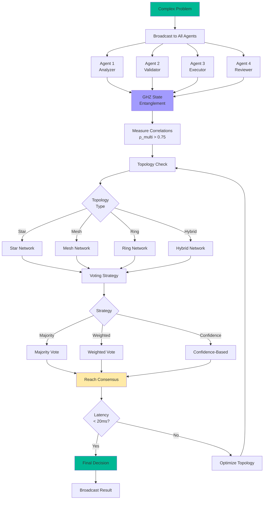

---

## Component Interaction Maps

### Phase 8.3: Adaptive Learning

```mermaid
graph TB
    subgraph Environment
        E1[Scenario State]
        E2[Actions Available]
        E3[Reward Signal]
    end
    
    subgraph QLearning["Q-Learning Engine"]
        Cycle 1[Q-Table]
        Cycle 2[Action Selection<br/>ε-greedy]
        Cycle 3[Q-Value Update]
    end
    
    subgraph Reward["Reward Shaper"]
        R1[Accuracy Component]
        R2[Speed Component]
        R3[Confidence Component]
        R4[Coherence Component]
        R5[Combined Reward]
    end
    
    subgraph Replay["Experience Replay"]
        ER1[Store Experience]
        ER2[Sample Batch]
        ER3[Prioritized Sampling]
    end
    
    E1 --> Cycle 2
    E2 --> Cycle 2
    Cycle 2 --> Action[Execute Action]
    Action --> E3
    
    E3 --> R1
    E3 --> R2
    E3 --> R3
    E3 --> R4
    R1 --> R5
    R2 --> R5
    R3 --> R5
    R4 --> R5
    
    R5 --> ER1
    E1 --> ER1
    Action --> ER1
    
    ER1 --> ER2
    ER2 --> ER3
    ER3 --> Cycle 3
    Cycle 3 --> Cycle 1
    Cycle 1 --> Cycle 2
    
    style QLearning fill:#74B9FF
    style Reward fill:#FFEAA7
    style Replay fill:#96CEB4
```

### Phase 8.6: Self-Healing System

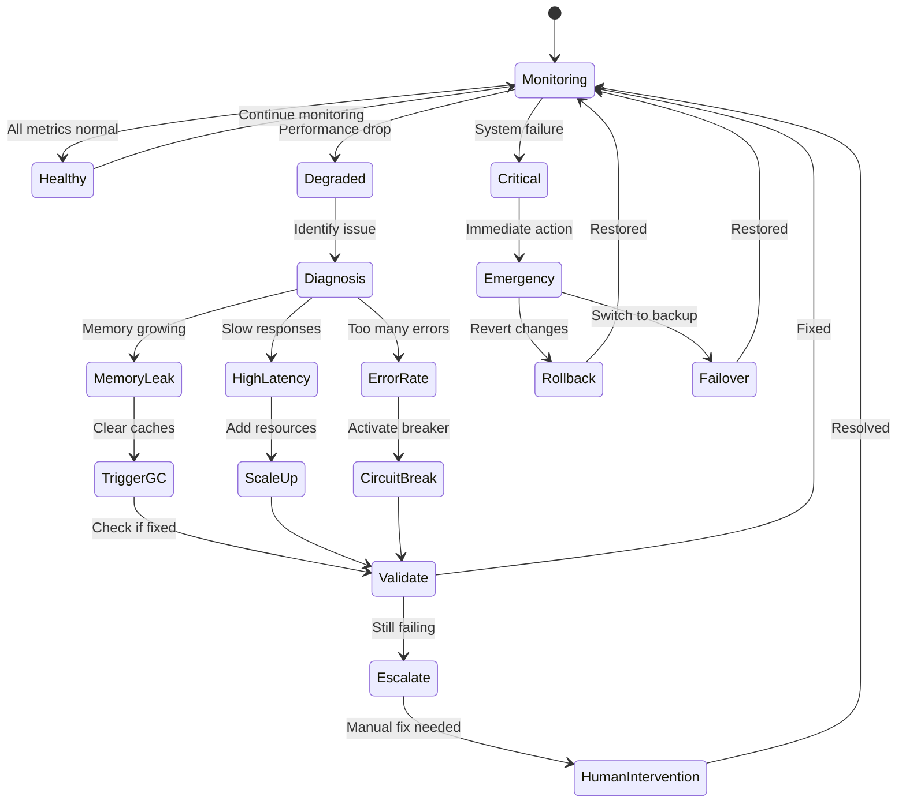

### Phase 8.8: Consciousness Framework

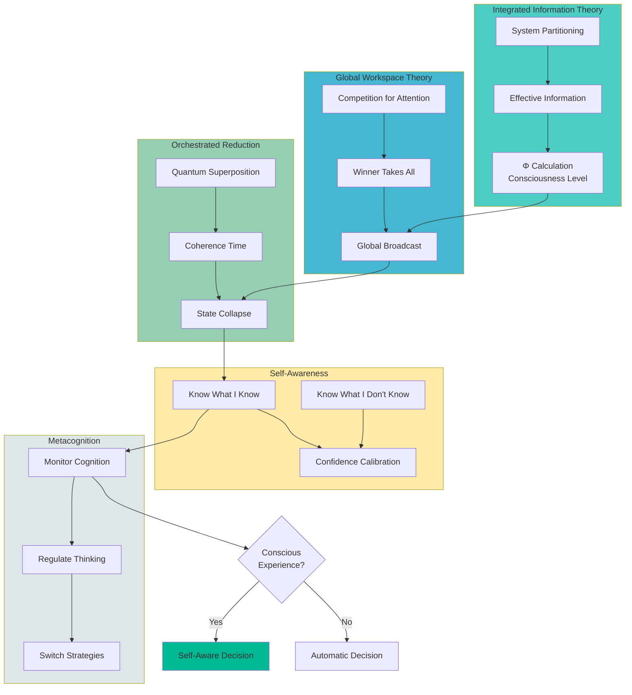

---

## Deployment Architecture

### Production Infrastructure (Phase 8.5)

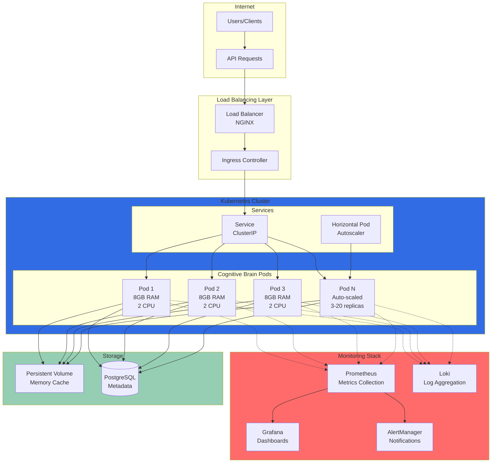

### Blue-Green Deployment

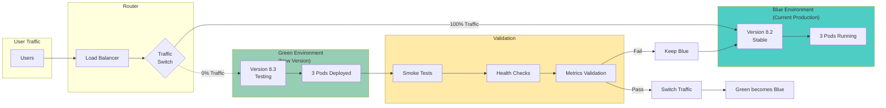

---

## Custom Agent Architecture

### Testing Agent Workflow

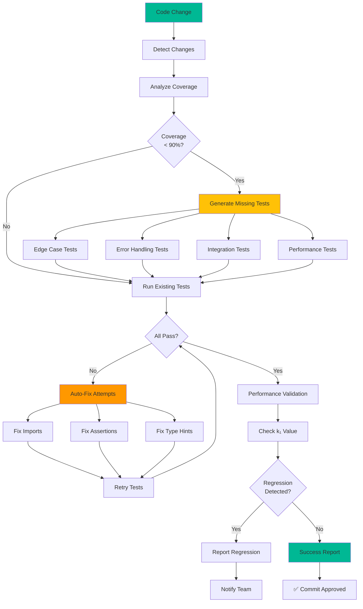

### Optimization Agent Flow

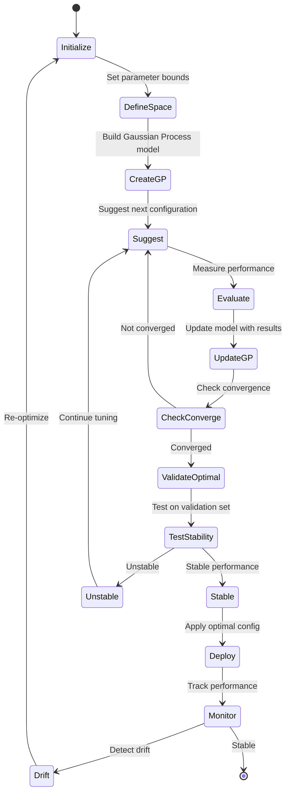

### Memory Management Agent

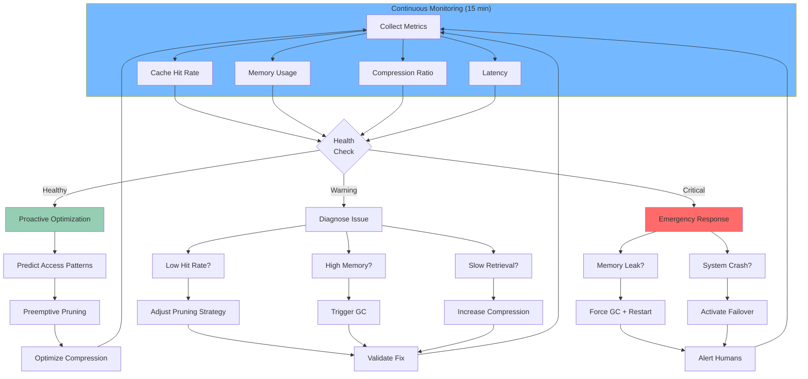

---

## Timeline & Dependencies

### Phase Dependencies Graph

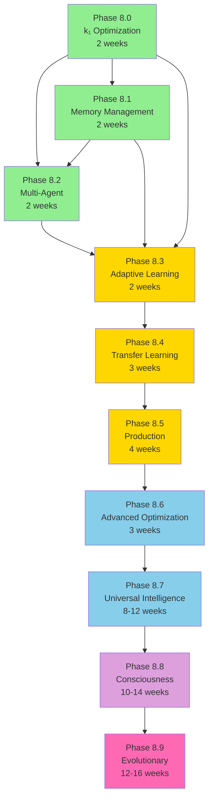

### Critical Path Timeline

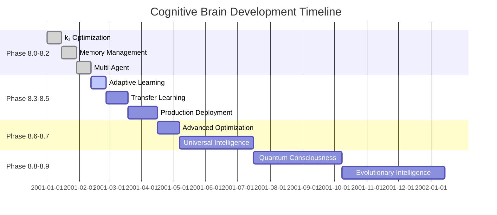

---

## System Metrics Dashboard

### Performance Evolution

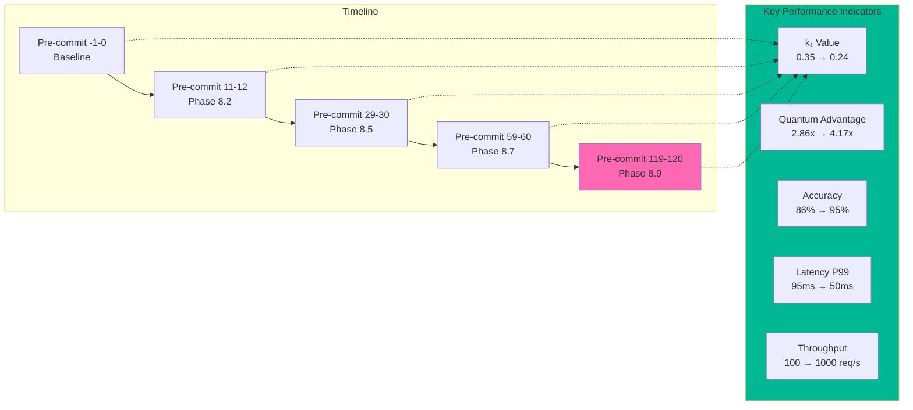

---

**Document Version:** 1.0  
**Total Diagrams:** 15 comprehensive mermaid visualizations  
**Coverage:** All phases 8.0-8.9, deployment, agents, metrics  
**Status:** Complete Visual Architecture
