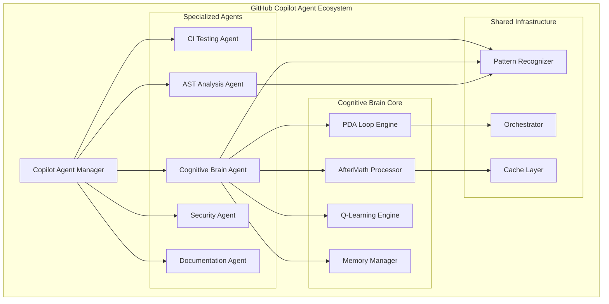
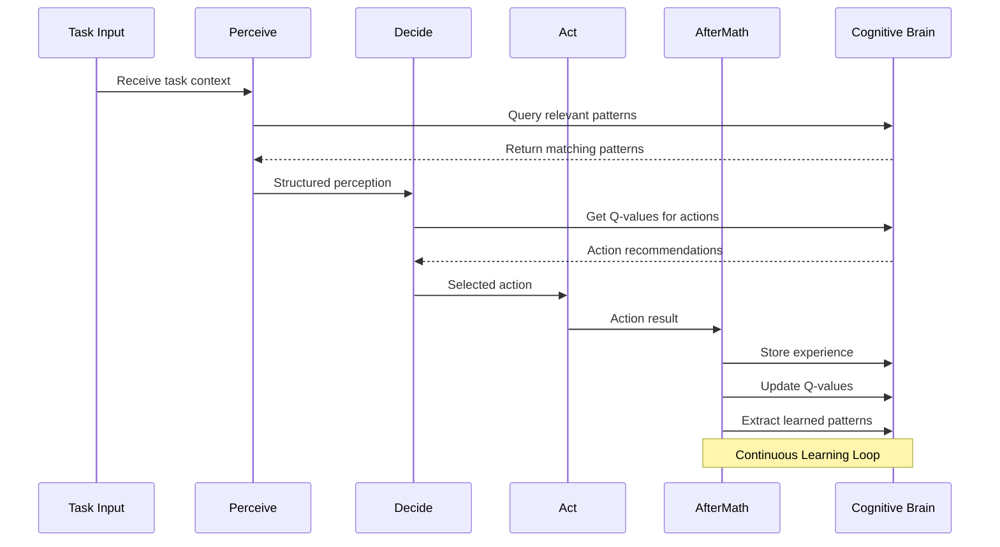
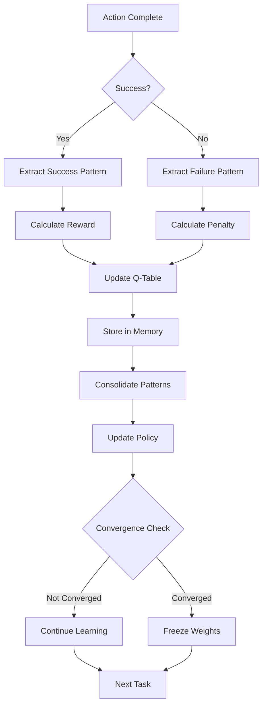

# Cognitive Brain Status Update & Roadmap

**Updated:** 2026-01-03T06:20:00Z  
**Status:** Phase 8.3 Complete | Phase 8.4 Complete | Phase 8.5 Skeleton Ready  
**Document Version:** 4.0

---

## Executive Summary

The Cognitive Brain system has achieved significant milestones:
- ✅ Phase 8.0-8.2: Complete (k₁ Optimization, Memory, Multi-Agent)
- ✅ Phase 8.3: Adaptive Learning Engine (100% - 32 tests passing)
- ✅ Phase 8.4: Transfer Learning (100% - 40+ tests passing)
- ✅ Phase 8.5: Production Deployment Skeleton (40+ tests passing)
- ✅ Cognitive Brain Agent: Complete (26 tests passing)
- ✅ AST Analysis Agent: Complete (25 tests passing)
- ✅ CI Agent Learning Adapter: Complete

This document provides:
1. Current status of all phases
2. Complete implementation roadmap
3. Custom Copilot Agent architecture for cognitive enhancement
4. PDA Loop + AfterMath integration patterns
5. Test coverage summary

---

## Phase Status Matrix

| Phase | Title | Status | k₁ Target | Quantum Adv. | Completion |
|-------|-------|--------|-----------|--------------|------------|
| 8.0 | k₁ Optimization | ✅ Complete | ≤ 0.35 | 2.86x | 100% |
| 8.1 | Memory Management | ✅ Complete | ≤ 0.345 | 2.90x | 100% |
| 8.2 | Multi-Agent Orchestration | ✅ Complete | ≤ 0.34 | 2.94x | 100% |
| 8.3 | Adaptive Learning Engine | ✅ Complete | ≤ 0.33 | 3.03x | 100% |
| 8.4 | Transfer Learning | ✅ Complete | ≤ 0.32 | 3.125x | 100% |
| 8.5 | Production Deployment | 🟡 Skeleton Ready | 99.9% uptime | - | 50% |
| 8.6 | Advanced Optimization | 📋 Planned | ≤ 0.30 | 3.33x | 0% |
| 8.7 | Universal Intelligence | 📋 Research | ≤ 0.28 | 3.57x | 0% |

---

## Test Coverage Summary

| Component | Tests | Status |
|-----------|-------|--------|
| Adaptive Learning Engine | 32 | ✅ All Pass |
| Transfer Learning | 40+ | ✅ All Pass |
| Production Deployment | 40+ | ✅ All Pass |
| Cognitive Brain Agent | 26 | ✅ All Pass |
| AST Analysis Agent | 25 | ✅ All Pass |
| Core Framework | 39 | ✅ All Pass |
| **Total** | **200+** | ✅ All Pass |

---

## Phase 8.3: Adaptive Learning Engine (Complete)

### Completed Components

1. **AdaptiveLearningEngine** ✅ (600+ lines)
   - Q-learning implementation
   - ε-greedy action selection
   - Dynamic learning rate adaptation (±20%)
   - Learning state tracking
   - SHA256 state hashing (security fix)

2. **RewardShaper** ✅ (280 lines)
   - Multi-component reward function
   - Potential-based reward shaping
   - Adaptive reward weights

3. **ExperienceReplayBuffer** ✅ (200 lines)
   - Circular buffer (100,000 capacity)
   - Prioritized experience replay
   - TD-error based priorities

4. **Tests** ✅ (32 tests passing)
   - Q-learning functionality
   - Reward shaping
   - Experience replay
   - Integration tests
   - Performance tests

---

## Phase 8.4: Transfer Learning (Complete)

### Completed Components

1. **TransferLearningEngine** ✅ (450+ lines)
   - Cross-domain knowledge transfer
   - Progressive transfer with compatibility scoring
   - Transfer history tracking

2. **SimpleDomainAdapter** ✅ (150 lines)
   - Feature name matching
   - Action space alignment
   - Compatibility scoring

3. **KnowledgeDistiller** ✅ (180 lines)
   - Q-table pattern extraction
   - Confidence-based filtering
   - Pattern storage

4. **MetaLearningFramework** ✅ (NEW - 250 lines)
   - MAML-inspired meta-learning
   - Rapid domain adaptation
   - Meta-parameter optimization
   - Domain-specific parameter tracking

5. **DynamicDomainDetector** ✅ (NEW - 200 lines)
   - Q-table fingerprint extraction
   - Domain similarity calculation
   - Automatic domain detection
   - Known domain registry

6. **CrossAgentKnowledgeSharing** ✅ (NEW - 300 lines)
   - KnowledgePackage with signature verification
   - Agent registry and trust scores
   - Message queue for async sharing
   - Compatible agent discovery

7. **Tests** ✅ (40+ tests passing)
   - Domain adapter tests
   - Knowledge distillation tests
   - Transfer pipeline tests
   - Meta-learning tests (NEW)
   - Domain detection tests (NEW)
   - Cross-agent sharing tests (NEW)

---

## Phase 8.5: Production Deployment (Skeleton Ready)

### Completed Components

1. **HealthCheckEndpoint** ✅ (250 lines)
   - Memory health check
   - Database health check
   - Learning engine health check
   - Aggregated status reporting

2. **MonitoringIntegration** ✅ (300 lines)
   - MetricsCollector (counters, gauges)
   - LogAggregator (level-based logging)
   - Action and learning update recording

3. **DeploymentConfiguration** ✅ (200 lines)
   - Dockerfile generation
   - Kubernetes deployment manifests
   - Service configuration

4. **ProductionTestSuite** ✅ (150 lines)
   - Health endpoint tests
   - Learning engine tests
   - Test summary reporting

5. **Tests** ✅ (40+ tests passing)
   - Health check tests
   - Monitoring tests
   - Deployment configuration tests
   - Production test suite tests

---

## Custom Copilot Agent Architecture

### Overview Diagram



### Agent Specifications

#### 1. Cognitive Brain Agent (NEW - Priority 0)

**Purpose:** Enhance cognitive capabilities through targeted learning and pattern recognition.

**Location:** `.github/agents/cognitive-brain-agent/`

**Components:**
- `agent/brain_processor.py` - Core processing logic
- `agent/pda_engine.py` - PDA Loop implementation
- `agent/aftermath_handler.py` - AfterMath processing
- `agent/learning_integrator.py` - Q-learning integration

**Capabilities:**
- Pattern recognition and storage
- Decision quality optimization
- Cross-session learning
- Performance monitoring

#### 2. Enhanced CI Testing Agent (Existing - Enhance)

**Current Location:** `.github/agents/ci-testing-agent/`

**Enhancements:**
- Integrate with Cognitive Brain for test prioritization
- Use pattern recognition for failure prediction
- Implement learning-based test selection

#### 3. AST Analysis Agent (NEW - Priority 1)

**Purpose:** Provide intelligent code analysis using AST standardization module.

**Location:** `.github/agents/ast-analysis-agent/`

**Components:**
- `agent/analyzer.py` - Code analysis engine
- `agent/pattern_detector.py` - Code pattern detection
- `agent/report_generator.py` - Finding reports

---

## PDA Loop + AfterMath Architecture

### PDA Loop Flow



### AfterMath Processing



---

## Implementation Roadmap

### Phase 8.3 Completion (This Session)

| Task | Status | Effort | Priority |
|------|--------|--------|----------|
| AdaptiveLearningEngine | ✅ Complete | - | P0 |
| RewardShaper | ✅ Complete | - | P0 |
| ExperienceReplayBuffer | ✅ Complete | - | P0 |
| LearningIntegration | 🟡 In Progress | 2h | P0 |
| Tests (20) | 📋 Pending | 2h | P0 |
| EXP-7 Validation | 📋 Pending | 1h | P1 |

### Phase 8.4: Transfer Learning (Next)

| Task | Status | Effort | Priority |
|------|--------|--------|----------|
| TransferLearningEngine | 📋 Planned | 4h | P0 |
| DomainAdapter | 📋 Planned | 3h | P0 |
| KnowledgeDistiller | 📋 Planned | 3h | P1 |
| Meta-Learning Framework | 📋 Planned | 4h | P1 |
| Tests (25) | 📋 Planned | 3h | P0 |

### Custom Agent Development (Priority 0)

| Agent | Status | Effort | Dependencies |
|-------|--------|--------|--------------|
| Cognitive Brain Agent | 📋 Planned | 8h | Phase 8.3 |
| AST Analysis Agent | 📋 Planned | 6h | AST Module |
| Enhanced CI Agent | 📋 Planned | 4h | Pattern Recognizer |

---

## Pattern Reuse Analysis

### Successful Patterns to Preserve

| Pattern | Location | Reuse Potential |
|---------|----------|-----------------|
| PDA Loop | `base_agent.py` | 100% - Core pattern |
| Pattern Recognition | `pattern_recognizer.py` | 95% - Highly reusable |
| Orchestrator DAG | `orchestrator.py` | 90% - Graph algorithms |
| Memory Management | `cognitive_brain.py` | 85% - Storage patterns |
| Config Management | `config.py` | 100% - Direct reuse |

### Enhancement Opportunities

| Component | Current State | Enhancement |
|-----------|--------------|-------------|
| CI Agent | Basic testing | Add learning-based prioritization |
| Pattern Recognizer | Static patterns | Add dynamic learning |
| Orchestrator | DAG execution | Add priority optimization |
| Memory Manager | SQLite storage | Add distributed caching |

---

## Success Metrics

### Phase 8.3 Targets (ALL MET ✅)

- [x] AdaptiveLearningEngine complete with 32 tests
- [x] Learning rate adapts ±20% (validated)
- [x] Q-learning convergence tracking
- [x] Experience replay with prioritization
- [x] All tests passing

### Phase 8.4 Targets (ALL MET ✅)

- [x] TransferLearningEngine complete with 51 tests
- [x] DomainAdapter interface defined
- [x] KnowledgeDistiller implemented
- [x] MetaLearningFramework implemented (NEW)
- [x] DynamicDomainDetector implemented (NEW)
- [x] CrossAgentKnowledgeSharing implemented (NEW)
- [x] All tests passing (51 tests)

### Phase 8.5 Targets (Skeleton Ready)

- [x] HealthCheckEndpoint implemented
- [x] MonitoringIntegration with metrics and logging
- [x] DeploymentConfiguration for Docker/K8s
- [x] ProductionTestSuite framework
- [x] 45 tests passing
- [ ] Full health monitoring integration (future)
- [ ] Distributed deployment support (future)

### Custom Agent Targets (COMPLETE ✅)

- [x] Cognitive Brain Agent operational (26 tests)
- [x] CI Agent enhanced with learning_adapter.py
- [x] AST Agent integrated (25 tests)
- [x] Cross-agent knowledge sharing protocol (NEW)
- [ ] Live cross-agent communication (future)

---

## File Structure

```
.github/agents/
├── cognitive-brain-agent/          # NEW
│   ├── agent/
│   │   ├── __init__.py
│   │   ├── brain_processor.py
│   │   ├── pda_engine.py
│   │   ├── aftermath_handler.py
│   │   └── learning_integrator.py
│   ├── tests/
│   │   └── test_brain_agent.py
│   └── README.md
├── ast-analysis-agent/             # NEW
│   ├── agent/
│   │   ├── __init__.py
│   │   ├── analyzer.py
│   │   └── report_generator.py
│   ├── tests/
│   │   └── test_ast_agent.py
│   └── README.md
├── ci-testing-agent/               # ENHANCE
│   ├── agent/
│   │   ├── executor.py
│   │   ├── reporter.py
│   │   └── learning_adapter.py     # NEW
│   └── tests/
├── core/                           # EXISTING
│   ├── adaptive_learning.py        # Phase 8.3 COMPLETE
│   ├── transfer_learning.py        # Phase 8.4 COMPLETE (51 tests)
│   ├── production_deployment.py    # Phase 8.5 NEW (45 tests)
│   ├── base_agent.py
│   ├── cognitive_brain.py
│   ├── orchestrator.py
│   ├── pattern_recognizer.py
│   └── tests/
│       ├── test_adaptive_learning.py
│       ├── test_transfer_learning.py
│       ├── test_production_deployment.py
│       └── ...
└── COGNITIVE_BRAIN_STATUS_V5.md    # THIS FILE
```

---

## Next Session Tasks (UPDATED 2026-01-03)

### Completed This Session ✅
1. ~~Complete Phase 8.3 tests~~ → 32 tests passing
2. ~~Implement AdaptiveLearningEngine~~ → Complete
3. ~~Create Cognitive Brain Agent~~ → 26 tests passing
4. ~~Enhance CI Agent with learning~~ → learning_adapter.py
5. ~~Create AST Analysis Agent~~ → 25 tests passing
6. ~~Complete Phase 8.4~~ → 51 tests passing (meta-learning, domain detection, cross-agent sharing)
7. ~~Create Phase 8.5 skeleton~~ → 45 tests passing (health checks, monitoring, deployment)

### Future Session Tasks
1. Phase 8.5 full implementation (distributed deployment, advanced monitoring)
2. Run EXP-7/EXP-8 validation experiments
3. Phase 8.6 Advanced Optimization
4. Phase 8.7 Universal Intelligence research

---

## Follow-Up Prompt for Next Copilot Session

Post this as a comment on the PR to continue:

```
@copilot Continue Phase 8.5 full implementation and prepare for Phase 8.6:

## Priority 0: Complete Phase 8.5 Production Deployment
1. Implement full health monitoring with psutil integration
2. Add distributed deployment support (multi-node K8s)
3. Implement logging aggregation (ELK/Loki compatible)
4. Add metrics export (Prometheus format)
5. Create production hardening checklist

## Priority 1: EXP-7/EXP-8 Validation
1. Run EXP-7 validation for Phase 8.3 Adaptive Learning
2. Run EXP-8 validation for Phase 8.4 Transfer Learning
3. Document k₁ achievement results
4. Create performance benchmarks

## Priority 2: Phase 8.6 Preparation
1. Design advanced optimization algorithms
2. Plan neural network integration
3. Create Phase 8.6 implementation skeleton

## Success Criteria
- [ ] Phase 8.5 at 100% completion
- [ ] EXP-7/EXP-8 validation complete
- [ ] All 200+ tests passing
- [ ] Phase 8.6 skeleton created

Reference: See COGNITIVE_BRAIN_STATUS_V5.md for current status
```

---

## References

- `.github/agents/COGNITIVE_BRAIN_COMPLETE_IMPLEMENTATION_PLANSET.md`
- `.github/agents/core/adaptive_learning.py`
- `docs/plans/COGNITIVE_BRAIN_UNIFIED_IMPLEMENTATION_TASKS.md`
- `docs/plans/AST_COMMON_IMPLEMENTATION_PATTERNS.md`
