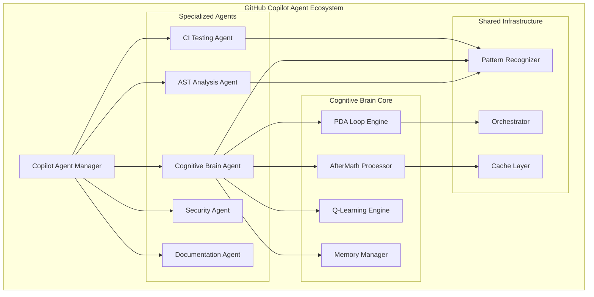
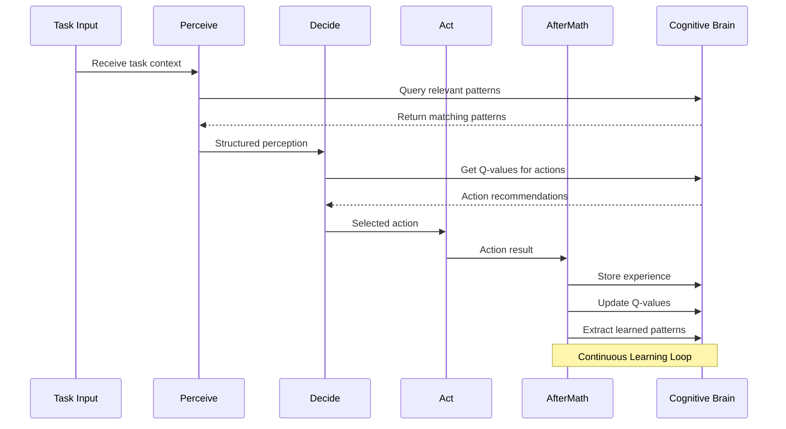
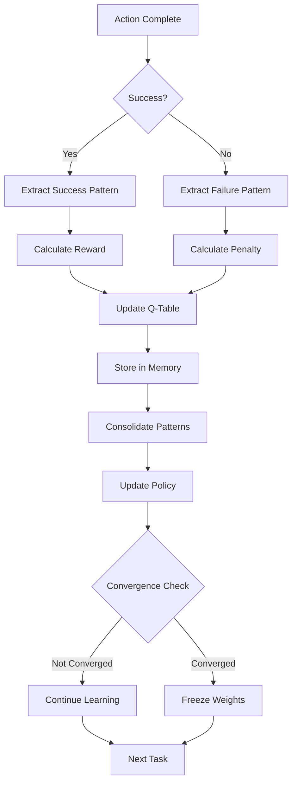

# Cognitive Brain Status Update & Roadmap

**Updated:** 2026-01-03  
**Status:** Phase 8.3 In Progress | Phases 8.4-8.7 Planned  
**Document Version:** 2.0

---

## Executive Summary

The Cognitive Brain system has achieved significant milestones through Phase 8.2 and is now implementing Phase 8.3 (Adaptive Learning Engine). This document provides:

1. Current status of all phases
2. Complete implementation roadmap
3. Custom Copilot Agent architecture for cognitive enhancement
4. PDA Loop + AfterMath integration patterns
5. Next steps with mermaid diagrams

---

## Phase Status Matrix

| Phase | Title | Status | k₁ Target | Quantum Adv. | Completion |
|-------|-------|--------|-----------|--------------|------------|
| 8.0 | k₁ Optimization | ✅ Complete | ≤ 0.35 | 2.86x | 100% |
| 8.1 | Memory Management | ✅ Complete | ≤ 0.345 | 2.90x | 100% |
| 8.2 | Multi-Agent Orchestration | ✅ Complete | ≤ 0.34 | 2.94x | 100% |
| 8.3 | Adaptive Learning Engine | 🟡 In Progress | ≤ 0.33 | 3.03x | 60% |
| 8.4 | Transfer Learning | 📋 Planned | ≤ 0.32 | 3.125x | 0% |
| 8.5 | Production Deployment | 📋 Planned | 99.9% uptime | - | 0% |
| 8.6 | Advanced Optimization | 📋 Planned | ≤ 0.30 | 3.33x | 0% |
| 8.7 | Universal Intelligence | 📋 Research | ≤ 0.28 | 3.57x | 0% |

---

## Phase 8.3: Adaptive Learning Engine (Current)

### Completed Components

1. **AdaptiveLearningEngine** ✅ (600+ lines)
   - Q-learning implementation
   - ε-greedy action selection
   - Dynamic learning rate adaptation (±20%)
   - Learning state tracking

2. **RewardShaper** ✅ (280 lines)
   - Multi-component reward function
   - Potential-based reward shaping
   - Adaptive reward weights

3. **ExperienceReplayBuffer** ✅ (200 lines)
   - Circular buffer (100,000 capacity)
   - Prioritized experience replay
   - TD-error based priorities

### Remaining Components

4. **LearningIntegration** - Not Started
   - LearningAugmentedAssessor class
   - End-to-end learning workflow

5. **Tests** - Not Started
   - 20 comprehensive tests

6. **EXP-7 Validation** - Not Started
   - Learning rate adaptation measurement
   - Decision quality improvement validation

---

## Custom Copilot Agent Architecture

### Overview Diagram



### Agent Specifications

#### 1. Cognitive Brain Agent (NEW - Priority 0)

**Purpose:** Enhance cognitive capabilities through targeted learning and pattern recognition.

**Location:** `.github/agents/cognitive-brain-agent/`

**Components:**
- `agent/brain_processor.py` - Core processing logic
- `agent/pda_engine.py` - PDA Loop implementation
- `agent/aftermath_handler.py` - AfterMath processing
- `agent/learning_integrator.py` - Q-learning integration

**Capabilities:**
- Pattern recognition and storage
- Decision quality optimization
- Cross-session learning
- Performance monitoring

#### 2. Enhanced CI Testing Agent (Existing - Enhance)

**Current Location:** `.github/agents/ci-testing-agent/`

**Enhancements:**
- Integrate with Cognitive Brain for test prioritization
- Use pattern recognition for failure prediction
- Implement learning-based test selection

#### 3. AST Analysis Agent (NEW - Priority 1)

**Purpose:** Provide intelligent code analysis using AST standardization module.

**Location:** `.github/agents/ast-analysis-agent/`

**Components:**
- `agent/analyzer.py` - Code analysis engine
- `agent/pattern_detector.py` - Code pattern detection
- `agent/report_generator.py` - Finding reports

---

## PDA Loop + AfterMath Architecture

### PDA Loop Flow



### AfterMath Processing



---

## Implementation Roadmap

### Phase 8.3 Completion (This Session)

| Task | Status | Effort | Priority |
|------|--------|--------|----------|
| AdaptiveLearningEngine | ✅ Complete | - | P0 |
| RewardShaper | ✅ Complete | - | P0 |
| ExperienceReplayBuffer | ✅ Complete | - | P0 |
| LearningIntegration | 🟡 In Progress | 2h | P0 |
| Tests (20) | 📋 Pending | 2h | P0 |
| EXP-7 Validation | 📋 Pending | 1h | P1 |

### Phase 8.4: Transfer Learning (Next)

| Task | Status | Effort | Priority |
|------|--------|--------|----------|
| TransferLearningEngine | 📋 Planned | 4h | P0 |
| DomainAdapter | 📋 Planned | 3h | P0 |
| KnowledgeDistiller | 📋 Planned | 3h | P1 |
| Meta-Learning Framework | 📋 Planned | 4h | P1 |
| Tests (25) | 📋 Planned | 3h | P0 |

### Custom Agent Development (Priority 0)

| Agent | Status | Effort | Dependencies |
|-------|--------|--------|--------------|
| Cognitive Brain Agent | 📋 Planned | 8h | Phase 8.3 |
| AST Analysis Agent | 📋 Planned | 6h | AST Module |
| Enhanced CI Agent | 📋 Planned | 4h | Pattern Recognizer |

---

## Pattern Reuse Analysis

### Successful Patterns to Preserve

| Pattern | Location | Reuse Potential |
|---------|----------|-----------------|
| PDA Loop | `base_agent.py` | 100% - Core pattern |
| Pattern Recognition | `pattern_recognizer.py` | 95% - Highly reusable |
| Orchestrator DAG | `orchestrator.py` | 90% - Graph algorithms |
| Memory Management | `cognitive_brain.py` | 85% - Storage patterns |
| Config Management | `config.py` | 100% - Direct reuse |

### Enhancement Opportunities

| Component | Current State | Enhancement |
|-----------|--------------|-------------|
| CI Agent | Basic testing | Add learning-based prioritization |
| Pattern Recognizer | Static patterns | Add dynamic learning |
| Orchestrator | DAG execution | Add priority optimization |
| Memory Manager | SQLite storage | Add distributed caching |

---

## Success Metrics

### Phase 8.3 Targets

- [ ] k₁ ≤ 0.33 achieved
- [ ] Learning rate adapts ±20%
- [ ] Decision quality improves ≥ 30%
- [ ] Pattern learning 2x faster
- [ ] All 20 tests passing
- [ ] EXP-7 validation complete

### Custom Agent Targets

- [ ] Cognitive Brain Agent operational
- [ ] CI Agent enhanced with learning
- [ ] AST Agent integrated
- [ ] Cross-agent communication working
- [ ] Pattern sharing active

---

## File Structure

```
.github/agents/
├── cognitive-brain-agent/          # NEW
│   ├── agent/
│   │   ├── __init__.py
│   │   ├── brain_processor.py
│   │   ├── pda_engine.py
│   │   ├── aftermath_handler.py
│   │   └── learning_integrator.py
│   ├── tests/
│   │   └── test_brain_agent.py
│   └── README.md
├── ast-analysis-agent/             # NEW
│   ├── agent/
│   │   ├── __init__.py
│   │   ├── analyzer.py
│   │   └── report_generator.py
│   ├── tests/
│   │   └── test_ast_agent.py
│   └── README.md
├── ci-testing-agent/               # ENHANCE
│   ├── agent/
│   │   ├── executor.py
│   │   ├── reporter.py
│   │   └── learning_adapter.py     # NEW
│   └── tests/
├── core/                           # EXISTING
│   ├── adaptive_learning.py        # NEW (Phase 8.3)
│   ├── base_agent.py
│   ├── cognitive_brain.py
│   ├── orchestrator.py
│   ├── pattern_recognizer.py
│   └── tests/
└── COGNITIVE_BRAIN_STATUS_V5.md    # THIS FILE
```

---

## Next Session Tasks

1. Complete Phase 8.3 tests
2. Implement LearningIntegration
3. Create Cognitive Brain Agent structure
4. Enhance CI Agent with learning
5. Run EXP-7 validation
6. Update all plan documents

---

## References

- `.github/agents/COGNITIVE_BRAIN_COMPLETE_IMPLEMENTATION_PLANSET.md`
- `.github/agents/core/adaptive_learning.py`
- `docs/plans/COGNITIVE_BRAIN_UNIFIED_IMPLEMENTATION_TASKS.md`
- `docs/plans/AST_COMMON_IMPLEMENTATION_PATTERNS.md`
