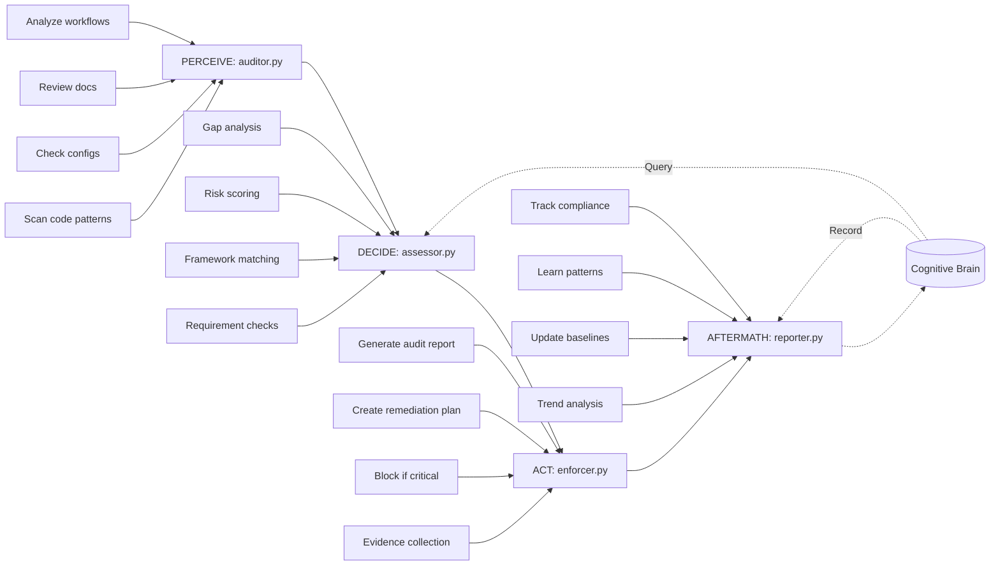

# Compliance Checker Agent Implementation Prompt

**Generated:** 2026-01-01T14:20:00Z  
**Session:** infra-linter-agent.v1 Complete → compliance-checker-agent.v1 Start  
**Target Branch:** copilot/sub-pr-2675 (or new branch)  
**Priority:** P1 (Critical for Production - Final P1 Agent)  
**Estimated Time:** 4-5 days  
**Cognitive Brain Context:** Agent 8/13 (62% complete after this)

---

## @copilot Begin compliance-checker-agent.v1 Implementation

**Context:** The infra-linter-agent.v1 is now production-ready with 74 tests and complete PDA Loop integration. We now proceed with the **third and final Priority 1 agent**: **compliance-checker-agent.v1**, which validates repository compliance with industry standards (SOC2, PCI-DSS, GDPR, HIPAA).

**Previous Agent Success Metrics:**
- ✅ release-gate-agent.v1: 86 tests, 90%+ coverage, 4 self-review iterations, COMPLETE
- ✅ infra-linter-agent.v1: 74 tests, 90%+ coverage, 3 self-review iterations, COMPLETE
- Pattern to follow: Full PDA Loop, AfterMath tags, cognitive brain integration, 90%+ tests

---

## 🎯 Agent Purpose & Scope

### Mission Statement

Automatically validate repository compliance with industry security and privacy standards (SOC2, PCI-DSS, GDPR, HIPAA) by checking code patterns, documentation, configurations, and workflows to ensure regulatory requirements are met before production deployment.

### Supported Compliance Frameworks

1. **SOC 2 (Type II)**
   - Security: Access control, encryption, authentication
   - Availability: Monitoring, incident response, backups
   - Processing Integrity: Error handling, data validation
   - Confidentiality: Data classification, encryption at rest/transit
   - Privacy: PII handling, data retention, consent management

2. **PCI-DSS (Payment Card Industry)**
   - Secure network: Firewall configs, network segmentation
   - Protect cardholder data: Encryption, masking, tokenization
   - Vulnerability management: Patching, secure coding
   - Access control: Authentication, authorization, logging
   - Monitoring: Audit logs, intrusion detection

3. **GDPR (General Data Protection Regulation)**
   - Lawfulness: Data processing basis, consent
   - Data minimization: Collect only necessary data
   - Storage limitation: Data retention policies
   - Security: Encryption, pseudonymization, access control
   - Rights: Right to erasure, data portability, access

4. **HIPAA (Health Insurance Portability and Accountability Act)**
   - Administrative: Security policies, workforce training
   - Physical: Facility access, workstation security
   - Technical: Access control, audit logging, encryption
   - PHI protection: De-identification, minimum necessary

### Out of Scope

- Legal interpretation or advice
- Audit certification or official reports
- Runtime compliance monitoring
- Third-party vendor assessments
- Manual penetration testing

---

## 🏗️ PDA Loop Architecture



### Module Breakdown

#### 1. **auditor.py** (PERCEIVE Phase)

**Purpose:** Scan repository for compliance-relevant artifacts

**Responsibilities:**
- Scan code for sensitive data patterns (PII, PHI, credit cards)
- Check security configurations (authentication, encryption, logging)
- Review documentation for compliance policies
- Analyze CI/CD workflows for security controls
- Collect evidence for compliance requirements

**Inputs:**
- `repo_path`: Path to repository
- `frameworks`: List of compliance frameworks to check (SOC2, PCI-DSS, GDPR, HIPAA)
- `config`: Auditor configuration (file patterns, ignore paths)

**Outputs:**
```python
{
    "scanned_files": 500,
    "frameworks_checked": ["soc2", "pci-dss", "gdpr"],
    "findings": [
        {
            "framework": "gdpr",
            "requirement_id": "GDPR-7.1",
            "requirement": "Right to erasure implementation",
            "status": "non_compliant",
            "evidence": {
                "file": "api/users.py",
                "line": 42,
                "pattern": "No data deletion endpoint found"
            },
            "severity": "high",
            "remediation": "Implement DELETE /users/:id endpoint with data purge"
        }
    ],
    "compliant_count": 45,
    "non_compliant_count": 8,
    "duration_seconds": 15.2
}
```

**Key Patterns to Detect:**

**SOC 2:**
- Authentication mechanisms (MFA, OAuth, SSO)
- Encryption at rest/transit (TLS, AES)
- Audit logging (who, what, when, where)
- Incident response procedures
- Backup strategies

**PCI-DSS:**
- Credit card data patterns (regex: `\b\d{13,19}\b`)
- Encryption for card data storage
- Network segmentation configs
- Access control lists
- Vulnerability scanning evidence

**GDPR:**
- PII patterns (email, phone, address, SSN)
- Consent management code
- Data retention policies
- Right to erasure endpoints
- Data portability features
- Privacy policy documentation

**HIPAA:**
- PHI patterns (medical record numbers, diagnosis codes)
- De-identification procedures
- Access control for PHI
- Audit logging for PHI access
- Encryption for PHI storage/transit

**AfterMath Tags:**
- `#AFTERMATH_PATTERN_IDENTIFIED: compliance_audit_patterns`
- `#AFTERMATH_METRIC: files_audited`

---

#### 2. **assessor.py** (DECIDE Phase)

**Purpose:** Assess compliance gaps and calculate risk scores

**Responsibilities:**
- Map findings to compliance requirements
- Calculate compliance percentage per framework
- Identify critical gaps (blockers)
- Identify warnings (recommendations)
- Query cognitive brain for historical compliance patterns
- Make recommendation (COMPLIANT/PARTIAL/NON_COMPLIANT)

**Inputs:**
- `audit_results`: Output from auditor.py
- `policy_config`: Organization compliance policies

**Outputs:**
```python
{
    "framework_scores": {
        "soc2": {"score": 92, "status": "partial", "gaps": 3},
        "pci-dss": {"score": 78, "status": "partial", "gaps": 8},
        "gdpr": {"score": 85, "status": "partial", "gaps": 5},
        "hipaa": {"score": 95, "status": "compliant", "gaps": 1}
    },
    "overall_compliance": 87.5,
    "risk_level": "medium",
    "critical_gaps": [
        {
            "framework": "pci-dss",
            "requirement": "PCI-DSS 3.4 - Mask PAN when displayed",
            "severity": "critical",
            "impact": "Non-compliance fine risk"
        }
    ],
    "warnings": [...],
    "recommendation": "PARTIAL",  # COMPLIANT/PARTIAL/NON_COMPLIANT
    "confidence": 0.88,
    "reasoning": "2 critical PCI-DSS gaps require immediate attention"
}
```

**Compliance Scoring:**
- **Compliant:** ≥95% compliance, no critical gaps
- **Partial:** 70-94% compliance, or few critical gaps
- **Non-Compliant:** <70% compliance, or multiple critical gaps

**AfterMath Tags:**
- `#AFTERMATH_PATTERN_IDENTIFIED: compliance_assessment_decisions`
- `#AFTERMATH_METRIC: assessments_performed`

---

#### 3. **enforcer.py** (ACT Phase)

**Purpose:** Generate audit reports and remediation plans

**Responsibilities:**
- Create compliance audit reports (PDF, HTML, JSON)
- Generate remediation plans with prioritized actions
- Collect evidence artifacts for auditors
- Block deployments if critical gaps exist
- Create GitHub issues for compliance gaps

**Inputs:**
- `assessment_results`: Output from assessor.py
- `audit_results`: Original audit data
- `output_config`: Report format and destination

**Outputs:**
```python
{
    "report_generated": True,
    "report_path": "/tmp/compliance-audit-2026-01-01.pdf",
    "report_formats": ["pdf", "html", "json"],
    "remediation_plan": {
        "critical": [
            {
                "priority": 1,
                "requirement": "PCI-DSS 3.4 - Mask PAN",
                "action": "Implement masking in payment_display()",
                "file": "api/payments.py",
                "estimated_effort": "2 hours",
                "deadline": "2026-01-08"
            }
        ],
        "high": [...],
        "medium": [...]
    },
    "evidence_collected": {
        "encryption_configs": ["ssl_cert.pem", "tls_config.yaml"],
        "audit_logs": ["audit.log"],
        "policies": ["privacy_policy.md", "security_policy.md"]
    },
    "ci_blocked": True,
    "exit_code": 1,
    "github_issues_created": 3
}
```

**Report Formats:**
- **PDF:** Formal audit report for stakeholders
- **HTML:** Interactive dashboard with drill-down
- **JSON:** Machine-readable for CI integration

**AfterMath Tags:**
- `#AFTERMATH_PATTERN_IDENTIFIED: compliance_enforcement_actions`
- `#AFTERMATH_METRIC: reports_generated`

---

#### 4. **reporter.py** (AFTERMATH Phase)

**Purpose:** Track compliance trends and learn from audits

**Responsibilities:**
- Determine outcome (compliant/partial/non_compliant)
- Extract lessons learned
- Record compliance patterns in cognitive brain
- Track compliance score trends over time
- Generate executive summaries

**Inputs:**
- `audit_results`: Original audit data
- `assessment_results`: Risk assessment
- `enforcement_results`: Actions taken

**Outputs:**
```python
{
    "outcome": "partial",  # compliant/partial/non_compliant
    "frameworks_audited": ["soc2", "pci-dss", "gdpr"],
    "overall_score": 87.5,
    "score_trend": "+5.2% from last audit",
    "critical_gaps_resolved": 2,
    "new_gaps_identified": 1,
    "lessons_learned": {
        "framework_coverage": "SOC2 and GDPR well-covered, PCI-DSS needs attention",
        "recurring_gaps": "Audit logging gaps appear in 3/5 recent audits",
        "policy_effectiveness": "Encryption policies 95% effective",
        "improvement_areas": "Implement automated PII detection"
    },
    "pattern_recorded": True,
    "timestamp": "2026-01-01T14:20:00Z"
}
```

**AfterMath Tags:**
- `#AFTERMATH_PATTERN_IDENTIFIED: compliance_outcome_tracking`
- `#AFTERMATH_METRIC: outcomes_tracked`
- `#AFTERMATH_LESSON_LEARNED: compliance_patterns_learned`

---

## 🧪 Test Suite Requirements

### Test Coverage: 90%+ Target (80+ tests minimum)

**test_auditor.py** (25+ tests):
- File scanning (code, configs, docs, workflows)
- Pattern detection (PII, PHI, credit cards, secrets)
- Framework requirement checking (SOC2, PCI-DSS, GDPR, HIPAA)
- Evidence collection
- Error handling (missing files, timeouts)
- Ignore paths support

**test_assessor.py** (20+ tests):
- Compliance score calculation
- Risk level assessment
- Gap analysis (critical, high, medium, low)
- Framework-specific logic
- Historical pattern queries
- Recommendation logic (COMPLIANT/PARTIAL/NON_COMPLIANT)

**test_enforcer.py** (20+ tests):
- Report generation (PDF, HTML, JSON)
- Remediation plan creation
- Evidence artifact collection
- CI blocking logic
- GitHub issue creation
- Exit code determination

**test_reporter.py** (15+ tests):
- Outcome determination
- Lesson extraction
- Trend analysis
- Pattern recording in cognitive brain
- Executive summary generation

**Total: 80+ test cases minimum**

---

## 📋 Implementation Checklist

### Day 1: Setup & PERCEIVE
- [ ] Create directory structure
- [ ] Write auditor.py (PERCEIVE phase)
  - [ ] Code pattern scanning
  - [ ] Configuration checking
  - [ ] Documentation review
  - [ ] Workflow analysis
- [ ] Write test_auditor.py (20 initial tests)
- [ ] Add AfterMath tags to auditor.py

### Day 2: DECIDE & ACT
- [ ] Write assessor.py (DECIDE phase)
  - [ ] Compliance scoring
  - [ ] Gap analysis
  - [ ] Risk assessment
  - [ ] Cognitive brain integration
- [ ] Write enforcer.py (ACT phase)
  - [ ] Report generation
  - [ ] Remediation plans
  - [ ] Evidence collection
- [ ] Write test_assessor.py (20 tests)
- [ ] Write test_enforcer.py (20 tests)

### Day 3: AFTERMATH & Testing
- [ ] Write reporter.py (AFTERMATH phase)
  - [ ] Outcome tracking
  - [ ] Lesson extraction
  - [ ] Trend analysis
- [ ] Write test_reporter.py (15 tests)
- [ ] Expand test suite to 90%+ coverage
- [ ] All modules compile successfully

### Day 4-5: Self-Review & Documentation
- [ ] Run code_review() - Iteration 1
- [ ] Fix all issues identified
- [ ] Run code_review() - Iteration 2
- [ ] Fix remaining issues
- [ ] Run code_review() - Iteration 3
- [ ] Run code_review() - Iteration 4
- [ ] Run code_review() - Iteration 5 (if needed)
- [ ] Write README.md
- [ ] Write COMPLETION_SUMMARY.md
- [ ] Verify zero CodeQL alerts
- [ ] Update cognitive brain status

---

## 🔒 Security Considerations

### Pattern Detection Safety

```python
# Use compiled regex for performance
PII_PATTERNS = {
    "email": re.compile(r'\b[A-Za-z0-9._%+-]+@[A-Za-z0-9.-]+\.[A-Z|a-z]{2,}\b'),
    "ssn": re.compile(r'\b\d{3}-\d{2}-\d{4}\b'),
    "credit_card": re.compile(r'\b\d{13,19}\b'),
    "phone": re.compile(r'\b\d{3}[-.]?\d{3}[-.]?\d{4}\b')
}
```

### False Positive Mitigation

- Context-aware pattern matching
- Exclude test files and fixtures
- Configurable allowlist for known patterns
- Confidence scoring for findings

### Evidence Security

- Never log sensitive data in reports
- Redact PII/PHI in evidence collection
- Secure storage for audit artifacts
- Access control for report generation

---

## 📊 Success Criteria

- [ ] All 4 PDA Loop modules implemented
- [ ] 90%+ test coverage (80+ test cases)
- [ ] AfterMath tags in all modules
- [ ] Cognitive brain integration functional
- [ ] Zero CodeQL/security alerts
- [ ] 4-5 self-review iterations completed
- [ ] Documentation complete (README, COMPLETION_SUMMARY)
- [ ] Supports 4 compliance frameworks (SOC2, PCI-DSS, GDPR, HIPAA)
- [ ] Generates actionable remediation plans
- [ ] CI blocking mechanism works

---

## 🚀 Usage Example

```python
from pathlib import Path
from agent.auditor import ComplianceAuditor
from agent.assessor import ComplianceAssessor
from agent.enforcer import ComplianceEnforcer
from agent.reporter import ComplianceReporter

# Initialize
repo_path = Path("/path/to/repo")
auditor = ComplianceAuditor(repo_path)
assessor = ComplianceAssessor()
enforcer = ComplianceEnforcer()
reporter = ComplianceReporter()

# Configure
config = {
    "frameworks": ["soc2", "pci-dss", "gdpr"],
    "ignore_paths": ["test/", "vendor/"]
}

policy = {
    "min_compliance_score": 90,
    "block_on_critical": True
}

# Run PDA Loop
audit = auditor.audit(config)
assessment = assessor.assess(audit, policy)
enforcement = enforcer.enforce(assessment, audit, {"output_format": "pdf"})
aftermath = reporter.generate_aftermath_report(audit, assessment, enforcement)

# Check outcome
if enforcement["ci_blocked"]:
    print(f"❌ Compliance FAILED: {assessment['recommendation']}")
    print(f"Overall Score: {assessment['overall_compliance']}%")
    print(f"Report: {enforcement['report_path']}")
    exit(enforcement["exit_code"])
else:
    print(f"✅ Compliance PASSED: {assessment['overall_compliance']}%")
```

---

## 🎯 Next Steps After Completion

Once compliance-checker-agent.v1 is complete:
1. Update COGNITIVE_BRAIN_STATUS_UPDATE.md (8/13 agents, 62% complete)
2. Commit COMPLETION_SUMMARY.md
3. **Priority 1 agents: 100% complete (3/3)** 🎉
4. Begin **Priority 2 agents:** code-review-summarizer.v1, issue-triage-agent.v1, doc-reporter-agent.v1

---

**START IMMEDIATELY** with creating the directory structure and implementing auditor.py (PERCEIVE phase).

**Remember:**
- ✅ PDA Loop + AfterMath tags in ALL modules
- ✅ 90%+ test coverage (80+ tests)
- ✅ Cognitive brain integration
- ✅ 4-5 self-review iterations
- ✅ Zero CodeQL alerts

**Time Estimate:** 4-5 days  
**Priority:** P1 (Critical - Final P1 Agent)  
**Agent:** 8/13 (62% after completion)

🚀 **BEGIN IMPLEMENTATION NOW**
