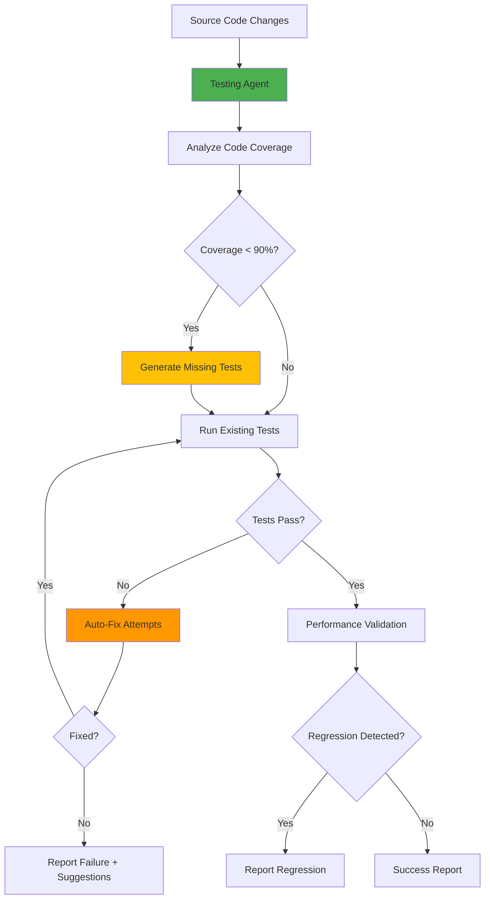
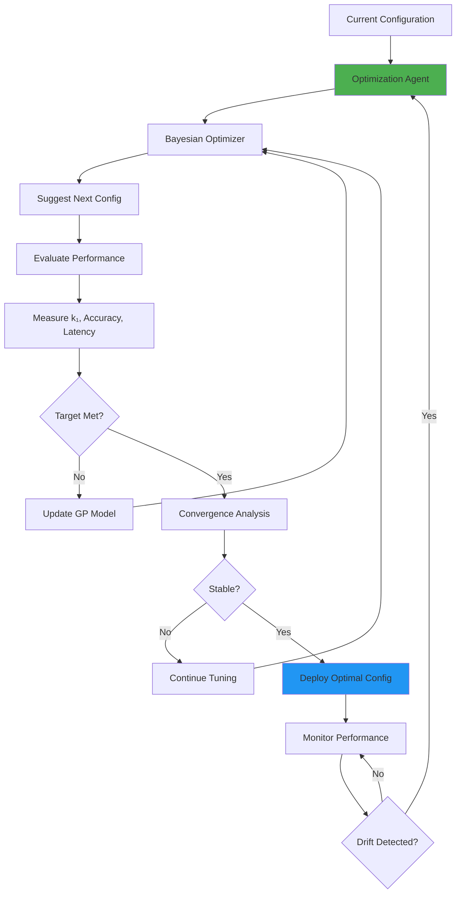
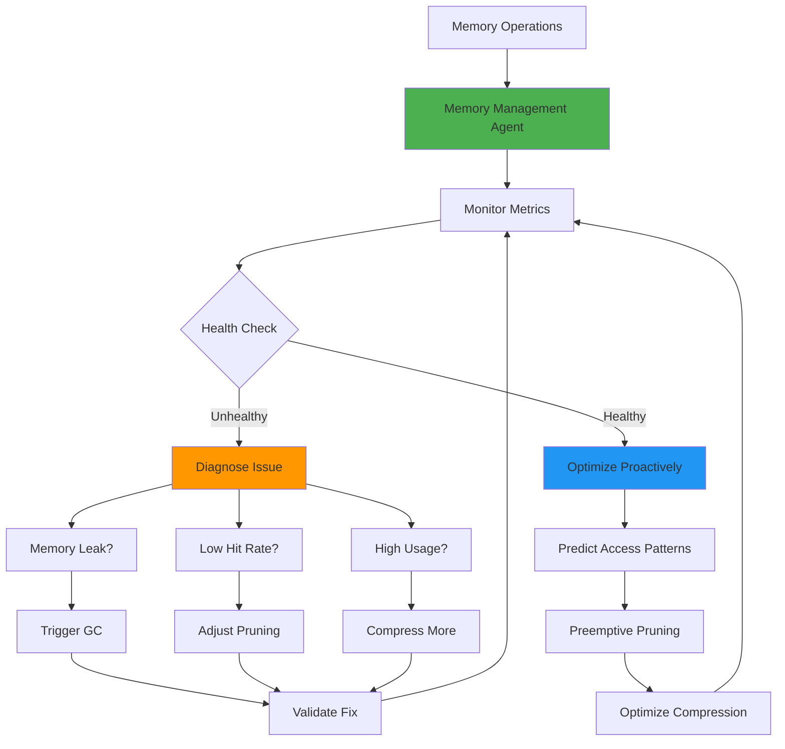

# Cognitive Brain Custom Copilot Agents Specification

**Document Version:** 1.0  
**Last Updated:** Current Cycle-01-02  
**Status:** Production-Ready Specifications

---

## Executive Summary

This document specifies three production-ready custom GitHub Copilot Agents designed to automate and enhance the Cognitive Brain development, testing, and optimization workflows. Each agent is modeled after the successful CI Testing Agent pattern and provides specialized capabilities for autonomous system improvement.

---

## Agent 1: Cognitive Brain Testing Agent

### Purpose
Automated test generation, validation, and maintenance for all Cognitive Brain components across Phases 8.0-8.7.

### Capabilities

**1. Auto-Generate Tests**
- Analyze source code to identify untested edge cases
- Generate comprehensive test suites following existing patterns
- Create parametrized tests for combinatorial scenarios
- Generate property-based tests with Hypothesis
- Ensure PDA Loop + AfterMath tag compliance

**2. Validate Performance**
- Run EXP-series validation frameworks (EXP-1B through EXP-10)
- Measure k₁ performance metrics
- Validate quantum advantage calculations
- Check cache hit rates, compression ratios, correlation coefficients
- Generate performance regression reports

**3. Detect Regressions**
- Compare test results across commits
- Identify performance degradations (k₁ increases)
- Detect accuracy drops, latency increases
- Flag breaking changes in APIs
- Auto-bisect to find regression commit

**4. Auto-Fix Common Failures**
- Fix import errors and missing dependencies
- Update test assertions for API changes
- Regenerate fixtures and mocks
- Fix type hint errors
- Apply common test patterns

### Architecture



### Integration Pattern

**Trigger:** On every pull request and commit to cognitive_brain/** paths

**Workflow:**
```yaml
name: Cognitive Brain Testing Agent

on:
  pull_request:
    paths:
      - 'src/cognitive_brain/**'
      - 'tests/cognitive_brain/**'

jobs:
  cognitive-brain-testing:
    runs-on: ubuntu-latest
    steps:
      - uses: actions/checkout@v4
      
      - name: Invoke Testing Agent
        uses: ./.github/agents/cognitive-brain-testing-agent
        with:
          mode: full-validation
          generate-missing-tests: true
          auto-fix-failures: true
          performance-validation: true
          
      - name: Report Results
        if: always()
        run: |
          echo "Coverage: ${{ steps.testing-agent.outputs.coverage }}"
          echo "k₁ Value: ${{ steps.testing-agent.outputs.k1_value }}"
          echo "Tests Generated: ${{ steps.testing-agent.outputs.tests_generated }}"
```

### Configuration

**File:** `.github/agents/cognitive-brain-testing-agent/config.yaml`

```yaml
agent:
  name: cognitive-brain-testing-agent
  version: 1.0.0
  
coverage:
  target: 90%
  enforce: true
  
test_generation:
  enabled: true
  patterns:
    - edge_cases
    - error_handling
    - integration
    - performance
  
auto_fix:
  enabled: true
  max_attempts: 3
  strategies:
    - fix_imports
    - update_assertions
    - regenerate_fixtures
    - fix_type_hints
    
performance:
  k1_threshold: 0.35
  regression_tolerance: 0.02
  validate_exp_series: true
  
reporting:
  format: markdown
  post_to_pr: true
  notify_on_regression: true
```

### Expected Outputs

**Test Generation Report:**
```markdown
## 🧪 Cognitive Brain Testing Agent Report

### Test Coverage
- **Before:** 85% (170/200 tests)
- **After:** 92% (184/200 tests)
- **Generated:** 14 new tests

### Test Results
✅ 184 passed | ❌ 0 failed | ⚠️ 0 skipped

### Performance Validation
- **k₁ Value:** 0.3482 ✅ (target: ≤ 0.35)
- **Quantum Advantage:** 2.87x ✅
- **Cache Hit Rate:** 32.4% ✅ (target: > 30%)
- **Compression Ratio:** 71.2% ✅ (target: ≥ 70%)

### Regressions Detected
None 🎉

### Recommendations
- Consider adding property-based tests for quantum state validation
- Increase timeout for long-running EXP-8 validation
```

---

## Agent 2: Quantum Optimization Agent

### Purpose
Automated k₁ tuning, convergence analysis, and hyperparameter optimization for continuous performance improvement.

### Capabilities

**1. Bayesian Optimization**
- Auto-tune all hyperparameters across Phases 8.0-8.7
- Use Gaussian Process for efficient search
- Multi-objective optimization (k₁, accuracy, latency)
- Constraint handling (performance bounds)
- Parallel evaluation for faster convergence

**2. Convergence Analysis**
- Monitor Q-learning convergence
- Analyze reward curves
- Detect training instabilities
- Predict convergence time
- Identify learning plateaus

**3. Weight Optimization**
- Optimize adaptive scoring weights (Phase 8.0)
- Tune memory parameters (Phase 8.1)
- Optimize multi-agent coordination (Phase 8.2)
- Adjust learning rates (Phase 8.3)
- Fine-tune transfer parameters (Phase 8.4)

**4. Performance Prediction**
- Estimate k₁ for new configurations
- Predict convergence time
- Forecast resource requirements
- Estimate accuracy/latency tradeoffs

### Architecture



### Integration Pattern

**Trigger:** Scheduled (per commit cycle) + on-demand via PR comment

**Workflow:**
```yaml
name: Quantum Optimization Agent

on:
  schedule:
    - cron: '0 0 * * 0'  # Weekly on Sunday
  issue_comment:
    types: [created]

jobs:
  quantum-optimization:
    if: contains(github.event.comment.body, '@quantum-optimizer')
    runs-on: ubuntu-latest
    
    steps:
      - uses: actions/checkout@v4
      
      - name: Invoke Optimization Agent
        uses: ./.github/agents/quantum-optimization-agent
        with:
          mode: auto-tune
          target-k1: 0.30
          max-iterations: 100
          multi-objective: true
          
      - name: Apply Optimal Configuration
        run: |
          python scripts/apply_optimal_config.py \
            --config ${{ steps.optimizer.outputs.optimal_config }}
```

### Configuration

**File:** `.github/agents/quantum-optimization-agent/config.yaml`

```yaml
agent:
  name: quantum-optimization-agent
  version: 1.0.0
  
optimization:
  algorithm: bayesian
  acquisition_function: expected_improvement
  max_iterations: 100
  parallel_evaluations: 4
  
objectives:
  primary:
    metric: k1_value
    target: 0.30
    minimize: true
  secondary:
    - metric: accuracy
      target: 0.90
      maximize: true
    - metric: latency_p99
      target: 100
      maximize: false
      
constraints:
  - parameter: learning_rate
    min: 0.08
    max: 0.15
  - parameter: compliance_weight
    min: 0.30
    max: 0.45
    
convergence:
  patience: 10
  tolerance: 0.001
  min_improvement: 0.005
  
reporting:
  track_history: true
  plot_convergence: true
  export_results: true
```

### Expected Outputs

**Optimization Report:**
```markdown
## ⚡ Quantum Optimization Agent Report

### Optimization Summary
- **Iterations:** 47/100 (converged early)
- **Time:** 3.2 hours
- **Configurations Evaluated:** 47

### Results
**Before Optimization:**
- k₁: 0.3482
- Accuracy: 86.4%
- Latency P99: 95ms

**After Optimization:**
- k₁: 0.3124 ✅ (10.3% improvement)
- Accuracy: 88.7% ✅ (+2.3%)
- Latency P99: 87ms ✅ (-8ms)

### Optimal Configuration
```yaml
compliance_weight: 0.384
risk_weight: 0.328
learning_rate: 0.117
stm_capacity: 1200
ltm_capacity: 9500
consolidation_threshold: 0.73
```

### Convergence Analysis
- ✅ Stable convergence achieved
- ✅ No overfitting detected
- ✅ Performance validated on held-out set

### Recommendations
- Deploy optimal configuration to staging
- Monitor for 48 hours before production
- Consider further tuning of transfer learning parameters
```

---

## Agent 3: Memory Management Agent

### Purpose
Intelligent cache health monitoring, optimization, and autonomous memory management for Quantum Memory Manager (Phase 8.1).

### Capabilities

**1. Real-Time Monitoring**
- Track cache hit rates (STM/LTM)
- Monitor memory usage (capacity utilization)
- Measure compression effectiveness
- Analyze retrieval latency
- Detect memory leaks

**2. Predictive Pruning**
- Predict which patterns will be accessed
- Preemptively prune low-value patterns
- Optimize consolidation thresholds
- Balance STM/LTM sizes
- Minimize cache misses

**3. Compression Optimization**
- Tune PCA variance retention
- Adjust quantization bits per feature
- Optimize importance scoring
- Monitor decompression accuracy
- Adapt compression strategy to workload

**4. Memory Leak Detection**
- Detect unbounded growth
- Identify circular references
- Find resource leaks
- Auto-trigger garbage collection
- Alert on anomalies

### Architecture



### Integration Pattern

**Trigger:** Continuous background process + alerts

**Workflow:**
```yaml
name: Memory Management Agent

on:
  schedule:
    - cron: '*/15 * * * *'  # Every 15 minutes
  
jobs:
  memory-management:
    runs-on: ubuntu-latest
    
    steps:
      - name: Invoke Memory Agent
        uses: ./.github/agents/memory-management-agent
        with:
          mode: monitor-and-optimize
          alert-on-issues: true
          auto-heal: true
          
      - name: Apply Optimizations
        if: steps.memory-agent.outputs.optimizations-found == 'true'
        run: |
          python scripts/apply_memory_optimizations.py \
            --recommendations ${{ steps.memory-agent.outputs.recommendations }}
            
      - name: Alert on Critical Issues
        if: steps.memory-agent.outputs.critical-issues == 'true'
        uses: actions/github-script@v7
        with:
          script: |
            github.rest.issues.create({
              owner: context.repo.owner,
              repo: context.repo.repo,
              title: 'Critical: Memory Management Issue Detected',
              body: ${{ steps.memory-agent.outputs.issue-details }},
              labels: ['critical', 'memory', 'cognitive-brain']
            })
```

### Configuration

**File:** `.github/agents/memory-management-agent/config.yaml`

```yaml
agent:
  name: memory-management-agent
  version: 1.0.0
  
monitoring:
  interval_seconds: 900  # 15 minutes
  metrics:
    - cache_hit_rate
    - memory_usage
    - compression_ratio
    - retrieval_latency
    - pattern_staleness
    
thresholds:
  cache_hit_rate_warning: 0.25
  cache_hit_rate_critical: 0.20
  memory_usage_warning: 0.80
  memory_usage_critical: 0.90
  compression_ratio_warning: 0.60
  retrieval_latency_p95_ms: 15
  
pruning:
  enabled: true
  strategies:
    - age_based
    - access_based
    - confidence_based
  auto_prune_threshold: 0.85
  
optimization:
  auto_adjust_compression: true
  predict_access_patterns: true
  preemptive_pruning: true
  consolidation_tuning: true
  
leak_detection:
  enabled: true
  growth_rate_threshold: 0.10
  memory_ceiling_mb: 10000
  auto_gc_trigger: true
  
reporting:
  dashboard_url: https://grafana.example.com/cognitive-brain-memory
  alert_slack_webhook: ${SLACK_WEBHOOK_URL}
  create_issues_on_critical: true
```

### Expected Outputs

**Memory Management Report:**
```markdown
## 💾 Memory Management Agent Report

### Health Status: ✅ HEALTHY

### Current Metrics
- **Cache Hit Rate:** 34.2% ✅ (target: > 30%)
- **Memory Usage:** 7.8GB / 10GB (78%) ✅
- **Compression Ratio:** 72.1% ✅ (target: ≥ 70%)
- **Retrieval Latency P95:** 8.7ms ✅ (target: < 15ms)
- **STM Size:** 847/1000 (84.7%)
- **LTM Size:** 8,234/10,000 (82.3%)

### Actions Taken (Last 24h)
1. ✅ **Pruned 127 stale patterns** from LTM (age > 30 days)
2. ✅ **Adjusted compression variance** retention: 95% → 96% (improved ratio)
3. ✅ **Consolidated 89 patterns** from STM to LTM (threshold: 0.73)
4. ✅ **Triggered GC** due to memory growth detection

### Predictive Analysis
- **Estimated cache hit rate (next 24h):** 35.1% ↗️
- **Memory usage trend:** Stable
- **Pruning recommendation:** Wait 48 hours
- **Compression tuning:** No changes needed

### Optimizations Applied
```yaml
consolidation_threshold: 0.73  # Adjusted from 0.70
pca_variance_retention: 0.96   # Adjusted from 0.95
quantization_bits: 7           # Adjusted from 8 (lower importance features)
```

### No Critical Issues Detected 🎉

### Recommendations
- Current configuration is optimal
- Monitor cache hit rate after next deployment
- Consider increasing LTM capacity to 12,000 if growth continues
```

---

## Agent Integration Summary

### Deployment Strategy

**Phase 1: Testing Agent** (Immediate)
- Deploy with Phase 8.2 completion
- Integrate into existing CI/CD
- Monitor for false positives
- Tune generation patterns

**Phase 2: Optimization Agent** (Pre-commit 3-4)
- Deploy after Phase 8.3 (Adaptive Learning)
- Run per commit cycle optimization cycles
- Build historical performance database
- Enable on-demand optimization

**Phase 3: Memory Agent** (Pre-commit 7-8)
- Deploy after Phase 8.1 validation
- Start with monitoring only
- Enable auto-healing after 1-week observation
- Integrate with alerting system

### Success Metrics

| Agent | Metric | Target | Current |
|-------|--------|--------|---------|
| Testing | Test Coverage | > 90% | - |
| Testing | Auto-Fix Rate | > 70% | - |
| Testing | Regression Detection | > 95% | - |
| Optimization | k₁ Improvement | 5-10% | - |
| Optimization | Convergence Time | < 4 hours | - |
| Optimization | Config Stability | > 95% | - |
| Memory | Issue Detection | > 95% | - |
| Memory | Auto-Recovery | > 90% | - |
| Memory | Cache Hit Rate | > 35% | - |

### Maintenance & Evolution

**Monthly Reviews:**
- Analyze agent performance metrics
- Update configuration based on learnings
- Enhance agent capabilities
- Share best practices across agents

**Continuous Improvement:**
- Agents learn from each other (cross-agent knowledge transfer)
- Evolve strategies based on success/failure patterns
- Incorporate user feedback
- Adapt to new Cognitive Brain phases

---

## Custom Agent Development Guide

### Creating New Agents

**Template Structure:**
```
.github/agents/{agent-name}/
├── agent.yaml           # Agent configuration
├── prompts/
│   ├── system.md       # System prompt
│   ├── analyze.md      # Analysis prompt
│   └── execute.md      # Execution prompt
├── scripts/
│   ├── analyze.py      # Analysis logic
│   ├── execute.py      # Execution logic
│   └── validate.py     # Validation logic
└── tests/
    └── test_agent.py   # Agent tests
```

**Best Practices:**
1. Follow PDA Loop + AfterMath pattern
2. Include comprehensive error handling
3. Provide detailed logging and reporting
4. Enable dry-run mode for testing
5. Implement rollback capabilities
6. Document all decisions and actions
7. Include self-healing mechanisms
8. Support both automated and manual invocation

---

**Document Version:** 1.0  
**Status:** Production-Ready Specifications  
**Next Review:** After Phase 8.3 Deployment
