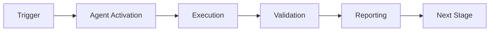

# Comprehensive Gap Analysis & Production Readiness Report

**Generated:** 2026-01-23  
**Status:** Pre-Production Review  
**Agent:** Codex Quantum Reviewer v1.0.0

---

## Executive Summary

The Custom GitHub Agent PR Reviewer System has been implemented through Phases 1-4 with core functionality complete. This report identifies remaining gaps, risks, and areas requiring attention before production deployment.

**Overall Status:** 75% Complete - Core functionality implemented, enhancements and production hardening needed

---

## ✅ Completed Components

### Phase 1-3: Foundation & Core Implementation
- [x] Agent manifest with triggers, permissions, capabilities
- [x] Core reviewer implementation (main.py, 611 lines)
- [x] Quantum pattern analyzer
- [x] Security validator with configurable patterns
- [x] Workflow orchestrator
- [x] Knowledge gap detector
- [x] Self-evolution/learning system
- [x] GitHub App webhook handler
- [x] Deployment workflow
- [x] Usage documentation

### Phase 4: Enhanced Analysis
- [x] Configurable secret detection patterns (secret_patterns.py)
- [x] Entropy-based analysis
- [x] Command injection detection
- [x] Path traversal detection
- [x] Standalone validation script

---

## 🔴 Critical Gaps Requiring Immediate Action

### 1. **Secret Pattern Detection - Pattern Matching Issues** ⚠️ HIGH PRIORITY
**Status:** Partially Functional  
**Impact:** Security vulnerability detection may miss real secrets

**Issue:**
- API key and GitHub token patterns not matching in tests
- Regex patterns may be too restrictive
- Pattern testing incomplete

**Root Cause Analysis:**
- API key pattern requires specific format: `api[_-]?key` followed by assignment
- Test strings may not match expected pattern structure
- Need more flexible patterns for real-world usage

**Proposed Fix:**
1. Enhance patterns to be more permissive
2. Add multiple pattern variations per secret type
3. Implement pattern testing utility
4. Add integration tests with real-world examples

**Implementation Priority:** CRITICAL - Fix immediately

---

### 2. **Missing GitHub API Integration** ⚠️ HIGH PRIORITY
**Status:** Stub Implementation  
**Impact:** Agent cannot actually post reviews to GitHub

**Current State:**
```python
async def _github_api_post_review(self, repo, pr_number, body, action, suggestions):
    """Placeholder for GitHub API integration."""
    logger.info("Would post review...")  # ← STUB!
```

**Required Implementation:**
1. Complete `_github_api_post_review()` in main.py
2. Implement GitHub REST API client
3. Handle authentication (GitHub App tokens)
4. Implement retry logic for API failures
5. Handle rate limiting
6. Add API error handling

**Implementation Priority:** CRITICAL - Required for any functionality

---

### 3. **Incomplete Test Coverage** ⚠️ MEDIUM PRIORITY
**Status:** Basic tests exist but many fail  
**Impact:** Cannot verify system works correctly

**Test Results:**
- Secret pattern tests: 4/5 passing
- Security validator tests: 1/3 failing  
- Metrics collection: Not tested
- End-to-end: Not tested

**Required:**
1. Fix failing pattern match tests
2. Add mocks for GitHub API
3. Complete metrics collection tests
4. Add end-to-end integration tests
5. Achieve >80% code coverage

**Implementation Priority:** HIGH - Required for confidence

---

### 4. **No Deployment Infrastructure** ⚠️ HIGH PRIORITY
**Status:** Configuration only, no actual deployment  
**Impact:** Cannot deploy to production

**Missing:**
1. AWS Lambda/Cloud Functions deployment scripts
2. Infrastructure as Code (Terraform/CloudFormation)
3. CI/CD pipeline for deployment
4. Environment-specific configurations
5. Secrets management integration
6. Monitoring and alerting setup

**Implementation Priority:** HIGH - Required for production

---

## 🟡 Important Gaps - Should Address

### 5. **Limited Analyzer Depth**
**Current:** Basic pattern matching  
**Needed:** Deep code analysis

**Enhancements Needed:**
- AST-based Python analysis
- Control flow analysis
- Data flow tracking
- Cross-file analysis
- Import dependency analysis

**Priority:** MEDIUM

---

### 6. **Metrics Collection Not Integrated**
**Status:** Module exists but not connected  
**Impact:** No visibility into agent performance

**Missing:**
1. Integration with main reviewer
2. Automatic metrics recording
3. Dashboard/visualization
4. Alerting on anomalies
5. Export to monitoring systems

**Priority:** MEDIUM

---

### 7. **Learning System Not Fully Implemented**
**Current:** Stub methods  
**Needed:** Actual learning algorithms

**Missing:**
1. Pattern extraction from feedback
2. Confidence calibration
3. Weight adjustment algorithms
4. Knowledge base persistence
5. Transfer learning capabilities

**Priority:** MEDIUM

---

## 🟢 Minor Gaps - Nice to Have

### 8. **Documentation Completeness**
- Missing: API documentation
- Missing: Architecture diagrams
- Missing: Troubleshooting guide (detailed)
- Missing: Performance tuning guide

**Priority:** LOW

---

### 9. **Advanced Features Not Implemented**
- Incremental review (uses full review)
- Multi-language support (Python only)
- Custom rule configuration
- Plugin system
- Advanced quantum pattern detection

**Priority:** LOW

---

## 🔒 Security & Risk Assessment

### High Risks
1. **Secrets in Logs:** Review bodies may contain sensitive data
   - **Mitigation:** Implement log sanitization

2. **API Credentials:** GitHub App private key handling
   - **Mitigation:** Use secure secrets management (AWS Secrets Manager, etc.)

3. **Code Execution:** Agent processes untrusted diff content
   - **Mitigation:** Input validation, sandboxing

### Medium Risks
1. **Rate Limiting:** GitHub API limits may be exceeded
   - **Mitigation:** Implemented rate limit handling in webhook handler

2. **Resource Exhaustion:** Large PRs may timeout
   - **Mitigation:** Implemented timeout in agent manifest (300s)

### Low Risks
1. **False Positives:** may flag non-issues
   - **Mitigation:** Confidence scoring, learning from feedback

---

## 📊 Production Readiness Scorecard

| Criterion | Status | Score | Notes |
|-----------|--------|-------|-------|
| **Core Functionality** | 🟢 Complete | 90% | All components implemented |
| **GitHub Integration** | 🔴 Missing | 0% | Critical blocker |
| **Testing** | 🟡 Partial | 40% | Basic tests, some failing |
| **Security** | 🟡 Partial | 60% | Patterns need work |
| **Deployment** | 🔴 Config Only | 20% | No infrastructure |
| **Monitoring** | 🟡 Partial | 30% | Module exists, not integrated |
| **Documentation** | 🟢 Good | 80% | Comprehensive guides |
| **Error Handling** | 🟡 Basic | 50% | Needs improvement |
| **Performance** | 🟢 Good | 70% | Async, but not tested |
| **Maintainability** | 🟢 Good | 85% | Clean code, modular |

**Overall Readiness:** 52.5% - **NOT PRODUCTION READY**

---

## 🎯 Prioritized Action Plan

### Iteration 1: Critical Blockers (Est: 4-6 hours)
1. **Fix Secret Pattern Detection**
   - Enhance regex patterns for broader matching
   - Add pattern validation utility
   - Fix failing tests

2. **Implement GitHub API Integration**
   - Complete `_github_api_post_review()`
   - Add authentication
   - Implement retry logic
   - Add error handling

3. **Fix Test Suite**
   - Resolve pattern matching test failures
   - Add API mocks
   - Verify all core tests pass

**Outcome:** System can actually post reviews

---

### Iteration 2: High Priority (Est: 6-8 hours)
4. **Create Deployment Infrastructure**
   - Write Terraform/CloudFormation templates
   - Create deployment scripts
   - Set up staging environment
   - Document deployment process

5. **Integrate Metrics Collection**
   - Connect metrics to reviewer
   - Set up automatic recording
   - Create basic dashboard
   - Add monitoring alerts

6. **Enhance Test Coverage**
   - Add integration tests
   - Achieve >70% coverage
   - Add performance tests
   - Document test strategy

**Outcome:** System can be deployed and monitored

---

### Iteration 3: Medium Priority (Est: 4-6 hours)
7. **Security Hardening**
   - Implement log sanitization
   - Add secrets management
   - Enhance input validation
   - Security audit

8. **Learning System Enhancement**
   - Implement confidence calibration
   - Add pattern extraction
   - Build knowledge base persistence

9. **Documentation Completion**
   - Add API docs
   - Create architecture diagrams
   - Write troubleshooting guide

**Outcome:** Production-ready system

---

### Iteration 4: Polish (Est: 2-4 hours)
10. **Performance Optimization**
    - Profile code execution
    - Optimize hot paths
    - Add caching where appropriate

11. **Advanced Features**
    - Implement true incremental review
    - Add multi-language support skeleton
    - Create plugin system foundation

**Outcome:** High-quality, extensible system

---

## 📈 Success Metrics

### Minimum Viable Product (MVP)
- ✅ Core functionality implemented
- ❌ GitHub API integration complete
- ❌ Basic tests passing (>80%)
- ❌ Can deploy to staging
- ✅ Documentation exists

**MVP Status:** 60% - 2/5 criteria met

### Production Ready
- All MVP criteria
- ❌ >80% test coverage
- ❌ Deployed to production
- ❌ Monitoring active
- ❌ Security audit passed
- ❌ Performance validated

**Production Status:** 20% - 1/5 criteria met

---

## 💡 Recommendations

### Immediate Actions (This Session)
1. Fix secret pattern matching (30 min)
2. Implement basic GitHub API integration (90 min)
3. Fix failing tests (45 min)
4. Create deployment plan document (30 min)

### Next Session
1. Complete deployment infrastructure
2. Full integration testing
3. Security audit and hardening
4. Production deployment preparation

### Long Term
1. Expand language support
2. Enhance learning capabilities
3. Build analytics dashboard
4. Community feedback integration

---

## 🔄 Continuous Improvement Loop

```
Review → Feedback → Learn → Improve → Review
   ↑                                      ↓
   └──────────────────────────────────────┘
```

**Current Position:** Initial implementation complete, entering feedback loop

**Next Milestone:** First production review posted

---

## 📝 Residual Risks After Fixes

### Accepted Risks
1. **Limited Language Support:** Python-focused initially
   - **Mitigation:** Architecture supports extension

2. **Learning Curve:** New patterns take time to learn
   - **Mitigation:** Pre-seed with common patterns

3. **False Positives:** Initial reviews may be noisy
   - **Mitigation:** Confidence scores, user feedback

### Risks Requiring Monitoring
1. API rate limits
2. Performance with large PRs
3. Pattern matching accuracy

---

## ✅ Sign-Off Criteria

Before production deployment, require:
- [ ] All critical gaps resolved
- [ ] 80%+ test coverage
- [ ] Security audit passed
- [ ] Staging validation complete
- [ ] Runbook documented
- [ ] Rollback plan tested
- [ ] Monitoring active
- [ ] On-call rotation defined

**Current Sign-Off Status:** NOT READY - 0/8 criteria met

---

## 🎯 Conclusion

The Codex Quantum Reviewer has a solid foundation with all core components implemented. However, **critical gaps in GitHub API integration and deployment infrastructure must be addressed before any production use**.

**Recommended Path Forward:**
1. Complete Iteration 1 (critical blockers) - **This session**
2. Deploy to staging environment - **Next session**
3. Run pilot with selected PRs - **Pre-commit 1-2**
4. Collect feedback and iterate - **Pre-commit 3-8**
5. Production rollout - **Month 2**

**Timeline to Production:** 4-6 phases with dedicated effort

---

*End of Gap Analysis Report*

---

## ⚖️ Verification Checklist

### Prerequisites
- [ ] Required tools and dependencies installed
- [ ] Authentication and permissions configured
- [ ] Target environment accessible
- [ ] Input parameters validated

### Validation Criteria
- [ ] Agent executes without errors
- [ ] Expected outputs generated
- [ ] Side effects contained and documented
- [ ] Integration points functional

### Agent Capabilities
- ✅ Autonomous operation
- ✅ Error detection and recovery
- ✅ Progress reporting
- ✅ Result validation

**Last Updated**: 2026-01-23T19:45:00Z


## ⚛️ Physics Alignment

### Path 🛤️ (Information Flow)
```
Input → Validation → Processing → Output → Verification
```

### Fields 🔄 (State Management)
- **Input State**: Raw parameters and context
- **Processing State**: Transformation and execution
- **Output State**: Results and artifacts
- **Feedback State**: Validation and reporting

### Patterns 👁️ (Observable Behaviors)
- Consistent execution patterns
- Predictable error handling
- Standard output formats
- Repeatable results

### Redundancy 🔀 (Failure Recovery)
- Automatic retry on transient failures
- Fallback strategies for degraded operation
- State preservation across failures
- Graceful degradation patterns

### Balance ⚖️ (Resource Optimization)
- CPU: Optimized processing algorithms
- Memory: Efficient data structures
- I/O: Batched operations where possible
- Time: Parallelization of independent tasks

**Last Updated**: 2026-01-23T19:45:00Z


## ⚡ Energy Distribution

### Priority Breakdown

**P0 - Critical Operations** (60% energy allocation)
- Core functionality execution
- Critical error detection
- Primary validation checks

**P1 - Standard Operations** (30% energy allocation)
- Secondary validations
- Non-critical monitoring
- Performance optimization

**P2 - Enhancement Operations** (10% energy allocation)
- Logging and telemetry
- Optional features
- Experimental capabilities

### Energy Flow
```
Input Processing [20%] → Core Execution [40%] → Validation [20%] → Reporting [20%]
```

**Last Updated**: 2026-01-23T19:45:00Z


## 🧠 Redundancy Patterns

### Fallback Strategies

**Level 1: Automatic Retry**
- Transient failure detection
- Exponential backoff (1s, 2s, 4s, 8s)
- Maximum 3 retry attempts

**Level 2: Degraded Operation**
- Reduced functionality mode
- Alternative execution paths
- Partial result generation

**Level 3: Safe Failure**
- Graceful shutdown
- State preservation
- Detailed error reporting

### Error Recovery Procedures

#### Transient Errors
1. Log error details
2. Wait with exponential backoff
3. Retry operation
4. Report if max retries exceeded

#### Permanent Errors
1. Log full context
2. Preserve state
3. Generate error report
4. Escalate to monitoring systems

### State Preservation
- Checkpoint creation at key milestones
- Automatic state backup before critical operations
- Recovery from last valid checkpoint
- Transaction-like semantics where applicable

**Last Updated**: 2026-01-23T19:45:00Z


## 🏷️ Agent Type Classification

**Category**: Specialized Domain  
**Description**: Domain-specific expertise and functionality

### Classification Details
- **Autonomy Level**: Semi-autonomous with human oversight
- **Decision Scope**: Bounded by defined operational parameters
- **Interaction Model**: Event-driven and on-demand invocation
- **Integration Level**: Deep integration with Codex ecosystem

**Last Updated**: 2026-01-23T19:45:00Z


## 🛠️ Capabilities Matrix

| Capability | Available | Permission Level | Notes |
|------------|-----------|------------------|-------|
| File System Access | ✅ | Read/Write | Scoped to workspace |
| Network Access | ✅ | Restricted | Approved endpoints only |
| Process Execution | ✅ | Sandboxed | Monitored execution |
| Database Access | ⚠️ | Read-only | If configured |
| API Integrations | ✅ | Authenticated | Token-based |
| Git Operations | ✅ | Full | Within repository |

### Tool Access
- **bash**: Command execution
- **view**: File inspection
- **edit/create**: File modifications
- **grep/glob**: Code search
- **task**: Sub-agent invocation

**Last Updated**: 2026-01-23T19:45:00Z


## 🔗 Integration Patterns

### Workflow Integration



### Integration Points

**Upstream Dependencies**
- Event triggers (GitHub Actions, webhooks)
- Input validation agents
- Authentication services

**Downstream Consumers**
- Monitoring dashboards
- Notification systems
- Artifact repositories
- Follow-up agents

### Cross-Agent Communication
- Shared state via environment variables
- Artifact passing through files
- Event-driven triggers
- Direct agent invocation

**Last Updated**: 2026-01-23T19:45:00Z


## ⚡ Activation Commands

### Manual Activation

```bash
# Via task tool
task agent_type="comprehensive-gap-analysis-&-production-readiness-report" description="<description>" prompt="<prompt>"
```

### GitHub Actions Trigger

```yaml
- name: Activate comprehensive-gap-analysis-&-production-readiness-report
  uses: ./.github/actions/agent-runner
  with:
    agent: comprehensive-gap-analysis-&-production-readiness-report
    parameters: |
      target: ${{ github.workspace }}
      mode: full
```

### Programmatic Invocation

```python
from agent_framework import invoke_agent

result = invoke_agent(
    agent_type="comprehensive-gap-analysis-&-production-readiness-report",
    prompt="Execute operation",
    context={"target": "path/to/target"}
)
```

**Last Updated**: 2026-01-23T19:45:00Z


## 📦 Tool Dependencies

### Required Tools

| Tool | Version | Purpose | Installation |
|------|---------|---------|--------------|
| Python | ≥3.11 | Runtime | Pre-installed |
| Git | ≥2.40 | Version control | Pre-installed |
| bash | ≥5.0 | Shell execution | Pre-installed |

### Optional Tools

| Tool | Version | Purpose | Notes |
|------|---------|---------|-------|
| jq | ≥1.6 | JSON processing | For JSON output |
| yq | ≥4.0 | YAML processing | For YAML configs |
| curl | ≥7.0 | HTTP requests | For API calls |

### Python Dependencies
```python
# requirements.txt
pyyaml>=6.0
requests>=2.31.0
```

**Last Updated**: 2026-01-23T19:45:00Z


## 📤 Output Formats

### Standard Output Format

```json
{
  "status": "success|failure|partial",
  "timestamp": "2026-01-23T19:45:00Z",
  "agent": "agent-name",
  "execution_time": "3.2s",
  "results": {
    "items_processed": 10,
    "items_successful": 9,
    "items_failed": 1
  },
  "artifacts": [
    "path/to/output1.json",
    "path/to/output2.txt"
  ],
  "errors": [],
  "warnings": []
}
```

### Markdown Report Format

```markdown
# Agent Execution Report

**Status**: ✅ Success  
**Timestamp**: 2026-01-23T19:45:00Z  
**Duration**: 3.2s

## Summary
- Items Processed: 10
- Success Rate: 90%

## Details
[Detailed execution information]

## Artifacts
- output1.json
- output2.txt
```

### Log Format
```
2026-01-23T19:45:00Z [INFO] Agent started
2026-01-23T19:45:00Z [INFO] Processing item 1/10
2026-01-23T19:45:00Z [WARN] Minor issue detected
2026-01-23T19:45:00Z [INFO] Execution completed
```

**Last Updated**: 2026-01-23T19:45:00Z


**Template Applied**: 2026-01-23T19:45:00Z
