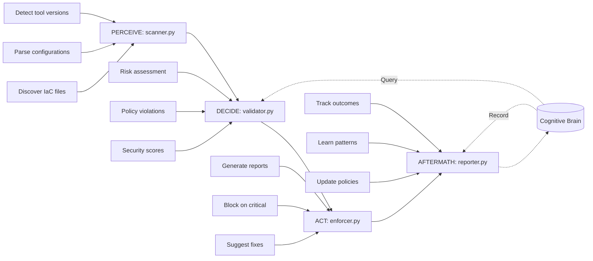

# Phase 6 Next Agent: infra-linter-agent.v1 - Implementation Prompt

**Generated:** 2026-01-01T12:30:00Z  
**Session:** release-gate-agent.v1 Complete → infra-linter-agent.v1 Start  
**Target Branch:** copilot/sub-pr-2675 (or new branch)  
**Priority:** P1 (Critical for Production)  
**Estimated Time:** 3-4 days  
**Cognitive Brain Context:** Agent 7/13 (54% complete after this)

---

## @copilot Begin infra-linter-agent.v1 Implementation

**Context:** The release-gate-agent.v1 is now production-ready with 90%+ test coverage and complete PDA Loop integration. We now proceed with the second Priority 1 agent: **infra-linter-agent.v1**, which validates Infrastructure-as-Code (IaC) across Terraform, Kubernetes, CloudFormation, and other IaC tools.

**Previous Agent Success Metrics:**
- ✅ release-gate-agent.v1: 86 tests, 90%+ coverage, 4 self-review iterations, COMPLETE
- Pattern to follow: Full PDA Loop, AfterMath tags, cognitive brain integration, 90%+ tests

---

## 🎯 Agent Purpose & Scope

### Mission Statement
Automatically lint, validate, and enforce security/best practices for Infrastructure-as-Code files before deployment, preventing misconfigurations that could lead to security vulnerabilities, compliance violations, or operational failures.

### Supported IaC Tools

1. **Terraform** (.tf, .tfvars)
   - Syntax validation (`terraform validate`)
   - Security scanning (`tfsec`, `checkov`)
   - Best practices (`tflint`)
   - State drift detection

2. **Kubernetes** (.yaml, .yml manifests)
   - Schema validation (`kubectl --dry-run`)
   - Security policies (`kube-score`, `polaris`)
   - Resource limits enforcement
   - RBAC validation

3. **CloudFormation** (.yaml, .json templates)
   - Template validation (`cfn-lint`)
   - Security checks (`cfn-nag`)
   - Cost estimation
   - Resource policy validation

4. **Ansible** (.yml playbooks)
   - Syntax check (`ansible-playbook --syntax-check`)
   - Best practices (`ansible-lint`)
   - Security hardening checks

5. **Docker** (Dockerfile)
   - Syntax validation
   - Security scanning (`hadolint`, `dockle`)
   - Base image vulnerability checks

### Out of Scope
- Actual infrastructure deployment
- Cloud provider API calls
- Runtime configuration changes
- Cost optimization recommendations (future v2)

---

## 🏗️ PDA Loop Architecture



### Module Breakdown

#### 1. **scanner.py** (PERCEIVE Phase)
**Purpose:** Discover and scan IaC files across the repository

**Responsibilities:**
- Recursively find IaC files (by extension and content)
- Detect which IaC tools are used (Terraform, K8s, etc.)
- Parse configuration files
- Run appropriate linting tools for each type
- Collect scan results and metadata

**Inputs:**
- `repo_path`: Path to repository
- `config`: Linting configuration (thresholds, ignored files, custom rules)

**Outputs:**
```python
{
    "files_scanned": 42,
    "tools_detected": ["terraform", "kubernetes", "dockerfile"],
    "scan_results": [
        {
            "file_path": "infra/main.tf",
            "tool": "terraform",
            "linter": "tfsec",
            "findings": [
                {
                    "severity": "HIGH",
                    "rule_id": "aws-s3-enable-bucket-encryption",
                    "message": "S3 bucket does not have encryption enabled",
                    "line": 15,
                    "suggested_fix": "Add server_side_encryption_configuration block"
                }
            ]
        }
    ],
    "duration_seconds": 12.5
}
```

**AfterMath Tags:**
- `#AFTERMATH_PATTERN_IDENTIFIED: iac_scanning_patterns`
- `#AFTERMATH_METRIC: files_scanned`

**Key Functions:**
```python
class IaCScanner:
    def __init__(self, repo_path: Path, db_path: str = None):
        self.repo_path = repo_path
        self.brain = CognitiveBrain(db_path)
    
    def scan(self, config: Dict[str, Any]) -> Dict[str, Any]:
        """Main entry point - discover and scan all IaC files"""
        files = self._discover_iac_files()
        results = []
        for file_info in files:
            result = self._scan_file(file_info)
            results.append(result)
        return self._aggregate_results(results)
    
    def _discover_iac_files(self) -> List[Dict[str, Any]]:
        """Find all IaC files in repo"""
        # Search for .tf, .yaml in k8s/, Dockerfile, etc.
        
    def _detect_tool(self, file_path: Path) -> str:
        """Determine which IaC tool this file belongs to"""
        # Check extension, content patterns, directory structure
        
    def _scan_file(self, file_info: Dict[str, Any]) -> Dict[str, Any]:
        """Run appropriate linter(s) for this file"""
        tool = file_info['tool']
        if tool == 'terraform':
            return self._scan_terraform(file_info['path'])
        elif tool == 'kubernetes':
            return self._scan_kubernetes(file_info['path'])
        # ... etc
    
    def _scan_terraform(self, file_path: Path) -> Dict[str, Any]:
        """Run tfsec, terraform validate, tflint"""
        
    def _scan_kubernetes(self, file_path: Path) -> Dict[str, Any]:
        """Run kubectl dry-run, kube-score"""
        
    def _scan_cloudformation(self, file_path: Path) -> Dict[str, Any]:
        """Run cfn-lint, cfn-nag"""
```

#### 2. **validator.py** (DECIDE Phase)
**Purpose:** Assess risk, check policies, and make recommendations

**Responsibilities:**
- Calculate overall security score (0-100)
- Identify critical/high/medium/low severity issues
- Query cognitive brain for known vulnerability patterns
- Check against organization policies
- Determine if changes should block deployment

**Inputs:**
- `scan_results`: Output from scanner.py
- `policy_config`: Organization security policies

**Outputs:**
```python
{
    "risk_level": "medium",  # low/medium/high/critical
    "security_score": 72,  # 0-100 (higher is better)
    "critical_issues": 0,
    "high_issues": 2,
    "medium_issues": 8,
    "low_issues": 15,
    "blockers": [
        {
            "file": "infra/main.tf",
            "rule": "aws-s3-enable-bucket-encryption",
            "severity": "HIGH",
            "reason": "Encryption required by policy"
        }
    ],
    "warnings": [...],
    "recommendation": "BLOCK",  # APPROVE/WARN/BLOCK
    "confidence": 0.92,
    "reasoning": "2 high-severity security issues detected that violate organizational policy"
}
```

**AfterMath Tags:**
- `#AFTERMATH_PATTERN_IDENTIFIED: iac_validation_decisions`
- `#AFTERMATH_METRIC: validations_performed`

**Key Functions:**
```python
class IaCValidator:
    def __init__(self, db_path: str = None):
        self.brain = CognitiveBrain(db_path)
    
    def validate(self, scan_results: Dict[str, Any], policy_config: Dict[str, Any]) -> Dict[str, Any]:
        """Assess risk and make recommendation"""
        score = self._calculate_security_score(scan_results)
        blockers = self._identify_blockers(scan_results, policy_config)
        warnings = self._identify_warnings(scan_results, policy_config)
        risk = self._assess_risk_level(score, blockers, warnings)
        recommendation = self._make_recommendation(risk, blockers)
        
        # Query cognitive brain for historical context
        similar_patterns = self.brain.query_patterns(
            pattern_type="iac_vulnerability",
            metadata={"tools": scan_results.get("tools_detected", [])}
        )
        
        return {
            "risk_level": risk,
            "security_score": score,
            "blockers": blockers,
            "recommendation": recommendation,
            # ... more fields
        }
    
    def _calculate_security_score(self, scan_results: Dict[str, Any]) -> int:
        """Calculate 0-100 score based on findings"""
        # Weighted by severity: critical=-25, high=-10, medium=-3, low=-1
        
    def _identify_blockers(self, scan_results: Dict[str, Any], policy: Dict[str, Any]) -> List[Dict[str, Any]]:
        """Find critical/high issues that should block deployment"""
        
    def _assess_risk_level(self, score: int, blockers: List, warnings: List) -> str:
        """Determine risk: low/medium/high/critical"""
```

#### 3. **enforcer.py** (ACT Phase)
**Purpose:** Generate reports, block CI if needed, suggest fixes

**Responsibilities:**
- Create human-readable reports (Markdown, JSON, HTML)
- Generate suggested fixes for common issues
- Optionally block CI/CD pipeline (exit code 1)
- Create GitHub annotations for PR review
- Output actionable next steps

**Inputs:**
- `validation_results`: Output from validator.py
- `scan_results`: Original scan data
- `output_format`: report format (markdown/json/html)

**Outputs:**
```python
{
    "report_generated": True,
    "report_path": "/tmp/iac-lint-report.md",
    "ci_blocked": True,
    "exit_code": 1,
    "github_annotations": [
        {
            "path": "infra/main.tf",
            "start_line": 15,
            "end_line": 15,
            "annotation_level": "failure",
            "message": "S3 bucket encryption required",
            "title": "Security: Unencrypted S3 bucket"
        }
    ],
    "suggested_fixes": [
        {
            "file": "infra/main.tf",
            "line": 15,
            "original": "resource \"aws_s3_bucket\" \"example\" { ... }",
            "suggested": "resource \"aws_s3_bucket\" \"example\" {\n  server_side_encryption_configuration { ... }\n}",
            "auto_fixable": True
        }
    ]
}
```

**AfterMath Tags:**
- `#AFTERMATH_PATTERN_IDENTIFIED: iac_enforcement_actions`
- `#AFTERMATH_METRIC: reports_generated`

**Key Functions:**
```python
class IaCEnforcer:
    def __init__(self):
        pass
    
    def enforce(self, validation_results: Dict[str, Any], scan_results: Dict[str, Any], config: Dict[str, Any]) -> Dict[str, Any]:
        """Generate reports and enforce policies"""
        report = self._generate_report(validation_results, scan_results, config.get("output_format", "markdown"))
        annotations = self._create_github_annotations(validation_results)
        fixes = self._suggest_fixes(scan_results)
        should_block = validation_results.get("recommendation") == "BLOCK"
        
        return {
            "report_generated": True,
            "report_path": report,
            "ci_blocked": should_block,
            "exit_code": 1 if should_block else 0,
            "github_annotations": annotations,
            "suggested_fixes": fixes
        }
    
    def _generate_report(self, validation: Dict, scan: Dict, format: str) -> str:
        """Create report in specified format"""
        
    def _create_github_annotations(self, validation: Dict) -> List[Dict]:
        """Create GitHub PR annotations for findings"""
        
    def _suggest_fixes(self, scan_results: Dict) -> List[Dict]:
        """Generate auto-fix suggestions"""
```

#### 4. **reporter.py** (AFTERMATH Phase)
**Purpose:** Track outcomes, learn patterns, update cognitive brain

**Responsibilities:**
- Determine outcome (files_fixed/blocked/warnings_ignored)
- Extract lessons learned
- Record patterns in cognitive brain
- Track metrics over time
- Generate long-term trend reports

**Inputs:**
- `scan_results`: Original scan data
- `validation_results`: Validation decisions
- `enforcement_results`: Actions taken

**Outputs:**
```python
{
    "outcome": "blocked",  # approved/blocked/warnings_issued
    "files_scanned": 42,
    "issues_found": 25,
    "critical_count": 0,
    "high_count": 2,
    "medium_count": 8,
    "low_count": 15,
    "most_common_issues": [
        {"rule": "aws-s3-enable-bucket-encryption", "count": 5},
        {"rule": "k8s-resource-limits", "count": 8}
    ],
    "lessons_learned": {
        "tool_coverage": "Terraform and Kubernetes found, no Ansible detected",
        "recurring_patterns": "S3 encryption issues appear in 3/5 new Terraform files",
        "policy_effectiveness": "90% of high-severity issues caught before merge"
    },
    "pattern_recorded": True,
    "timestamp": "2026-01-01T12:30:00Z"
}
```

**AfterMath Tags:**
- `#AFTERMATH_PATTERN_IDENTIFIED: iac_outcome_tracking`
- `#AFTERMATH_METRIC: outcomes_tracked`
- `#AFTERMATH_LESSON_LEARNED: iac_patterns_learned`

**Key Functions:**
```python
class IaCReporter:
    def __init__(self, db_path: str = None):
        self.brain = CognitiveBrain(db_path)
    
    def generate_aftermath_report(self, scan_results: Dict, validation_results: Dict, enforcement_results: Dict) -> Dict[str, Any]:
        """Generate comprehensive outcome report"""
        outcome = self._determine_outcome(enforcement_results)
        lessons = self._extract_lessons(scan_results, validation_results)
        self._record_pattern(scan_results, validation_results, outcome)
        
        return {
            "outcome": outcome,
            "lessons_learned": lessons,
            "pattern_recorded": True,
            # ... more fields
        }
    
    def _extract_lessons(self, scan: Dict, validation: Dict) -> Dict[str, Any]:
        """Learn from this scan cycle"""
        # Identify recurring issues, tool gaps, policy effectiveness
        
    def _record_pattern(self, scan: Dict, validation: Dict, outcome: str):
        """Record in cognitive brain for future learning"""
        self.brain.record_pattern(
            pattern_type="iac_scan_outcome",
            success=(outcome == "approved"),
            metadata={
                "tools_used": scan.get("tools_detected", []),
                "security_score": validation.get("security_score", 0),
                "issues_count": scan.get("issues_found", 0),
                # ... more metadata
            }
        )
```

---

## 🧪 Test Suite Requirements

### Test Coverage: 90%+ Target

**test_scanner.py** (20+ tests):
- IaC file discovery (Terraform, K8s, Docker, etc.)
- Tool detection logic
- Terraform scanning (tfsec, terraform validate)
- Kubernetes scanning (kubectl dry-run, kube-score)
- CloudFormation scanning (cfn-lint)
- Docker scanning (hadolint)
- Error handling (missing tools, syntax errors)
- Multiple tool detection in one repo

**test_validator.py** (20+ tests):
- Security score calculation
- Risk level assessment (low/medium/high/critical)
- Blocker identification
- Warning identification
- Policy enforcement
- Cognitive brain pattern queries
- Recommendation logic (APPROVE/WARN/BLOCK)
- Confidence calculation

**test_enforcer.py** (15+ tests):
- Report generation (Markdown, JSON, HTML)
- GitHub annotations creation
- Suggested fixes generation
- CI blocking logic
- Exit code determination
- Multi-format output

**test_reporter.py** (15+ tests):
- Outcome determination
- Lesson extraction
- Pattern recording
- Cognitive brain integration
- Metrics aggregation
- Trend analysis

**Total: 70+ test cases minimum**

---

## 📋 Implementation Checklist

### Day 1: Setup & PERCEIVE
- [ ] Create directory structure
- [ ] Write scanner.py (PERCEIVE phase)
  - [ ] IaC file discovery
  - [ ] Tool detection
  - [ ] Terraform scanning integration
  - [ ] Kubernetes scanning integration
  - [ ] Docker scanning integration
- [ ] Write test_scanner.py (15 initial tests)
- [ ] Add AfterMath tags to scanner.py
- [ ] Verify scanner.py compiles

### Day 2: DECIDE & ACT
- [ ] Write validator.py (DECIDE phase)
  - [ ] Security score calculation
  - [ ] Risk assessment
  - [ ] Policy enforcement
  - [ ] Cognitive brain integration
- [ ] Write enforcer.py (ACT phase)
  - [ ] Report generation
  - [ ] GitHub annotations
  - [ ] Suggested fixes
- [ ] Write test_validator.py (20 tests)
- [ ] Write test_enforcer.py (15 tests)
- [ ] Add AfterMath tags to validator.py and enforcer.py

### Day 3: AFTERMATH & Testing
- [ ] Write reporter.py (AFTERMATH phase)
  - [ ] Outcome tracking
  - [ ] Lesson extraction
  - [ ] Pattern recording
- [ ] Write test_reporter.py (15 tests)
- [ ] Expand test suite to 90%+ coverage
- [ ] Add integration tests
- [ ] All modules compile successfully

### Day 4: Self-Review & Documentation
- [ ] Run code_review() - Iteration 1
- [ ] Fix all issues identified
- [ ] Run code_review() - Iteration 2
- [ ] Fix remaining issues
- [ ] Run code_review() - Iteration 3
- [ ] Run code_review() - Iteration 4
- [ ] Run code_review() - Iteration 5 (if needed)
- [ ] Write README.md with usage examples
- [ ] Write COMPLETION_SUMMARY.md
- [ ] Verify zero CodeQL alerts

---

## 🔒 Security Considerations

### Tool Execution Safety
```python
# Always timeout subprocess calls
result = subprocess.run(
    ["tfsec", str(file_path), "--format=json"],
    capture_output=True,
    timeout=30,
    cwd=repo_path
)
```

### Input Validation
- Sanitize file paths (prevent directory traversal)
- Validate IaC tool versions
- Limit file sizes scanned (prevent DoS)
- Restrict subprocess commands (whitelist only)

### Secret Detection
- Check for hardcoded secrets in IaC files
- Integrate with `detect-secrets` or `gitleaks`
- Report secret exposure as CRITICAL

---

## 📊 Success Criteria

- [ ] All 4 PDA Loop modules implemented
- [ ] 90%+ test coverage (70+ test cases)
- [ ] AfterMath tags in all modules
- [ ] Cognitive brain integration functional
- [ ] Zero CodeQL/security alerts
- [ ] 4-5 self-review iterations completed
- [ ] Documentation complete (README, COMPLETION_SUMMARY)
- [ ] Supports Terraform, Kubernetes, Docker minimum
- [ ] Generates actionable reports
- [ ] CI blocking mechanism works

---

## 🚀 Usage Example

```python
from agent.scanner import IaCScanner
from agent.validator import IaCValidator
from agent.enforcer import IaCEnforcer
from agent.reporter import IaCReporter
from pathlib import Path

# Initialize
repo_path = Path("/path/to/repo")
scanner = IaCScanner(repo_path)
validator = IaCValidator()
enforcer = IaCEnforcer()
reporter = IaCReporter()

# Configure
config = {
    "ignore_paths": [".terraform/", "vendor/"],
    "severity_threshold": "medium",
    "output_format": "markdown"
}

policy = {
    "block_on_critical": True,
    "block_on_high": True,
    "require_encryption": True
}

# Run PDA Loop
scan_results = scanner.scan(config)
validation_results = validator.validate(scan_results, policy)
enforcement_results = enforcer.enforce(validation_results, scan_results, config)
aftermath_report = reporter.generate_aftermath_report(scan_results, validation_results, enforcement_results)

# Check outcome
if enforcement_results["ci_blocked"]:
    print(f"❌ IaC validation FAILED: {validation_results['recommendation']}")
    print(f"Report: {enforcement_results['report_path']}")
    exit(enforcement_results["exit_code"])
else:
    print(f"✅ IaC validation PASSED: Security score {validation_results['security_score']}/100")
```

---

## 🎯 Next Steps After Completion

Once infra-linter-agent.v1 is complete:
1. Update COGNITIVE_BRAIN_STATUS_UPDATE.md (7/13 agents, 54% complete)
2. Commit COMPLETION_SUMMARY.md
3. Begin **compliance-checker-agent.v1** (Priority 1, final P1 agent)

---

**START IMMEDIATELY** with creating the directory structure and implementing scanner.py (PERCEIVE phase).

**Remember:**
- ✅ PDA Loop + AfterMath tags in ALL modules
- ✅ 90%+ test coverage (70+ tests)
- ✅ Cognitive brain integration
- ✅ 4-5 self-review iterations
- ✅ Zero CodeQL alerts

**Time Estimate:** 3-4 days  
**Priority:** P1 (Critical)  
**Agent:** 7/13 (54% after completion)

🚀 **BEGIN IMPLEMENTATION NOW**
