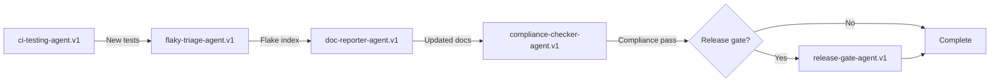
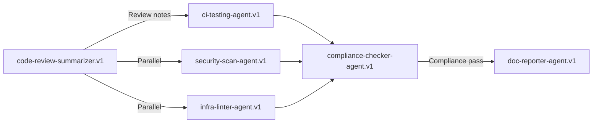

# Agent Orchestrator Sequences - Aries-Serpent/_codex_

**Version**: 1.0.0  
**Date**: Previous Cycle-12-31  
**Purpose**: Define orchestrated sequences of agents for complex workflows  
**Status**: 🟢 Active Specification

---

## Executive Summary

This document defines **orchestrator sequences** that coordinate multiple agents to accomplish complex objectives. Each orchestrator manages a specific workflow (coverage improvement, PR quality, dependency hygiene, etc.) by chaining agents in a defined order with proper handoffs, rollback strategies, and Cognitive Brain integration.

**Key Concepts**:
- **Orchestrators**: High-level workflows composed of agent sequences
- **Handoffs**: Data transfer between agents via artifacts and APIs
- **Parallel Execution**: Multiple agents running concurrently where safe
- **Rollback**: Compensation logic for failed sequences
- **Cognitive Brain**: Centralized learning and metrics across sequences

---

## Orchestrator Sequences

### 1. Coverage Improvement (Phase 9.x)

**Objective**: Raise coverage from ~75% → ≥85%

| Dimension | Specification |
|-----------|---------------|
| **Sequence** | ci-testing-agent.v1 → flaky-triage-agent.v1 → doc-reporter-agent.v1 → compliance-checker-agent.v1 → release-gate-agent.v1 (conditional) |
| **Entry Event** | Pro+: MCP test-gen; Team: coverage workflow_dispatch |
| **Exit Conditions** | Coverage ≥ target; tests pass; compliance OK; optional release gate passes |
| **Repo Paths** | src/, agents/, scripts/, tests/, docs/system/, docs/testing/ |
| **Outputs** | baseline_coverage.txt, coverage.html, new tests, PHASE9_1_TEST_SUMMARY.md, compliance_status.json |
| **Success Criteria** | Coverage_delta ≥ +10%; 150–200 tests added; 100% pass rate |
| **Rollback** | Revert last tests commit; restore baseline artifacts; skip gate if compliance fails |
| **Cognitive Brain** | Persist metrics, gaps, and next steps; AfterMath summary posted |

**Sequence Flow**:


**Implementation**:
```yaml
# .github/workflows/coverage-improvement-orchestrator.yml
name: Coverage Improvement Orchestrator

on:
  workflow_dispatch:
    inputs:
      target_coverage:
        description: 'Target coverage percentage'
        required: true
        default: '85'
      phase:
        description: 'Phase number (e.g., 9.1, 9.2)'
        required: true

jobs:
  step1-generate-tests:
    name: Generate Tests (ci-testing-agent)
    runs-on: ubuntu-latest
    outputs:
      tests_created: ${{ steps.generate.outputs.tests_created }}
      coverage_delta: ${{ steps.generate.outputs.coverage_delta }}
    steps:
      - uses: actions/checkout@v4
      - name: Run ci-testing-agent
        id: generate
        run: |
          cd .github/agents/ci-testing-agent
          python cli.py --manifest manifest.yaml \
            --task '{"type":"generate_tests","threshold":${{ inputs.target_coverage }}}'
      - name: Upload artifacts
        uses: actions/upload-artifact@v4
        with:
          name: coverage-artifacts
          path: |
            baseline_coverage.txt
            coverage.html
            tests/**/*phase${{ inputs.phase }}*.py

  step2-triage-flakes:
    name: Triage Flaky Tests
    needs: step1-generate-tests
    runs-on: ubuntu-latest
    if: needs.step1-generate-tests.outputs.tests_created > 0
    steps:
      - uses: actions/checkout@v4
      - name: Download artifacts
        uses: actions/download-artifact@v4
        with:
          name: coverage-artifacts
      - name: Run flaky-triage-agent
        run: |
          cd .github/agents/flaky-triage-agent
          python cli.py --manifest manifest.yaml \
            --task '{"type":"detect_flakes","test_run_count":10}'
      - name: Upload flake index
        uses: actions/upload-artifact@v4
        with:
          name: flake-artifacts
          path: |
            flake_index.json
            quarantine_list.md

  step3-update-docs:
    name: Update Documentation
    needs: [step1-generate-tests, step2-triage-flakes]
    runs-on: ubuntu-latest
    steps:
      - uses: actions/checkout@v4
      - name: Download all artifacts
        uses: actions/download-artifact@v4
      - name: Run doc-reporter-agent
        run: |
          cd .github/agents/doc-reporter-agent
          python cli.py --manifest manifest.yaml \
            --task '{"type":"publish_reports","phase":"${{ inputs.phase }}"}'
      - name: Commit documentation
        run: |
          git config user.name "github-actions[bot]"
          git config user.email "github-actions[bot]@users.noreply.github.com"
          git add docs/
          git commit -m "docs: Phase ${{ inputs.phase }} coverage report"
          git push

  step4-compliance-check:
    name: Compliance Check
    needs: step3-update-docs
    runs-on: ubuntu-latest
    outputs:
      compliance_pass: ${{ steps.check.outputs.pass }}
    steps:
      - uses: actions/checkout@v4
      - name: Run compliance-checker-agent
        id: check
        run: |
          cd .github/agents/compliance-checker-agent
          python cli.py --manifest manifest.yaml \
            --task '{"type":"evaluate_compliance","strict":false}'
      - name: Upload compliance status
        uses: actions/upload-artifact@v4
        with:
          name: compliance-artifacts
          path: compliance_status.json

  step5-release-gate:
    name: Release Gate (Conditional)
    needs: step4-compliance-check
    runs-on: ubuntu-latest
    if: needs.step4-compliance-check.outputs.compliance_pass == 'true' && github.event_name == 'push' && startsWith(github.ref, 'refs/tags/')
    steps:
      - uses: actions/checkout@v4
      - name: Download artifacts
        uses: actions/download-artifact@v4
      - name: Run release-gate-agent
        run: |
          cd .github/agents/release-gate-agent
          python cli.py --manifest manifest.yaml \
            --task '{"type":"evaluate_gates","tag":"${{ github.ref_name }}"}'
```

---

### 2. PR Quality & Reliability

**Objective**: Accelerate review, ensure CI quality

| Dimension | Specification |
|-----------|---------------|
| **Sequence** | code-review-summarizer.v1 → ci-testing-agent.v1 → security-scan-agent.v1 → infra-linter-agent.v1 → compliance-checker-agent.v1 → doc-reporter-agent.v1 |
| **Entry Event** | Pro+: PR chat start; Team: PR CI |
| **Exit Conditions** | All checks advisory/required pass; review summaries published |
| **Repo Paths** | .github/agents/*, src/*, .github/workflows/* |
| **Outputs** | review_summary.md, new tests (if needed), sarif.json, lint_report.md, compliance_status.json |
| **Success Criteria** | Required checks green; actionable review suggestions adopted |
| **Rollback** | Remove advisory comments; re-run checks after fixes |
| **Cognitive Brain** | Log review heuristics and impact; AfterMath improvement notes |

**Sequence Flow**:


**Implementation**:
```yaml
# .github/workflows/pr-quality-orchestrator.yml
name: PR Quality & Reliability

on:
  pull_request:
    types: [opened, synchronize, reopened]

jobs:
  step1-review-summary:
    name: Generate Review Summary
    runs-on: ubuntu-latest
    outputs:
      needs_tests: ${{ steps.review.outputs.needs_tests }}
    steps:
      - uses: actions/checkout@v4
        with:
          fetch-depth: 0
      - name: Run code-review-summarizer
        id: review
        run: |
          cd .github/agents/code-review-summarizer-agent
          python cli.py --manifest manifest.yaml \
            --task '{"type":"summarize_pr","pr_number":${{ github.event.pull_request.number }}}'
      - name: Post summary
        uses: actions/github-script@v7
        with:
          script: |
            const fs = require('fs');
            const summary = fs.readFileSync('review_summary.md', 'utf8');
            github.rest.issues.createComment({
              issue_number: context.issue.number,
              owner: context.repo.owner,
              repo: context.repo.repo,
              body: summary
            });

  step2-parallel-checks:
    name: Parallel Quality Checks
    needs: step1-review-summary
    runs-on: ubuntu-latest
    strategy:
      matrix:
        agent:
          - ci-testing-agent
          - security-scan-agent
          - infra-linter-agent
    steps:
      - uses: actions/checkout@v4
      - name: Run ${{ matrix.agent }}
        run: |
          cd .github/agents/${{ matrix.agent }}
          python cli.py --manifest manifest.yaml \
            --task '{"type":"pr_check","pr_number":${{ github.event.pull_request.number }}}'
      - name: Upload artifacts
        uses: actions/upload-artifact@v4
        with:
          name: ${{ matrix.agent }}-artifacts
          path: .reports/${{ matrix.agent }}/

  step3-compliance-aggregate:
    name: Aggregate Compliance
    needs: step2-parallel-checks
    runs-on: ubuntu-latest
    steps:
      - uses: actions/checkout@v4
      - name: Download all artifacts
        uses: actions/download-artifact@v4
      - name: Run compliance-checker
        run: |
          cd .github/agents/compliance-checker-agent
          python cli.py --manifest manifest.yaml \
            --task '{"type":"aggregate_checks","pr_number":${{ github.event.pull_request.number }}}'

  step4-publish-reports:
    name: Publish Reports
    needs: step3-compliance-aggregate
    runs-on: ubuntu-latest
    steps:
      - uses: actions/checkout@v4
      - name: Download artifacts
        uses: actions/download-artifact@v4
      - name: Run doc-reporter
        run: |
          cd .github/agents/doc-reporter-agent
          python cli.py --manifest manifest.yaml \
            --task '{"type":"publish_pr_reports","pr_number":${{ github.event.pull_request.number }}}'
```

---

### 3. Dependency Hygiene

**Objective**: Safe minor/patch bumps with proof

| Dimension | Specification |
|-----------|---------------|
| **Sequence** | dep-upgrade-agent.v1 → ci-testing-agent.v1 → security-scan-agent.v1 → compliance-checker-agent.v1 → release-gate-agent.v1 (conditional) → doc-reporter-agent.v1 |
| **Entry Event** | Pro+: MCP planning; Team: open draft PR |
| **Exit Conditions** | CI green; scan clean; compliance pass; gated merge approved |
| **Repo Paths** | requirements.txt, .github/agents/requirements.txt |
| **Outputs** | upgrade_plan.md, draft PR, SBOM delta, compliance_status.json |
| **Success Criteria** | Zero regressions; documented changes; minimal risk |
| **Rollback** | Close PR with rollback label; revert bump changes |
| **Cognitive Brain** | Capture rationale and risk notes; AfterMath outcomes logged |

---

### 4. CI Stability & Flake Management

**Objective**: Reduce intermittent failures

| Dimension | Specification |
|-----------|---------------|
| **Sequence** | flaky-triage-agent.v1 → ci-testing-agent.v1 (targeted fixes) → doc-reporter-agent.v1 |
| **Entry Event** | Team: nightly; Pro+: ad-hoc report |
| **Exit Conditions** | Flake index reduced; quarantines tracked; test suite stable |
| **Repo Paths** | tests/*, Actions logs |
| **Outputs** | flake_index.json, quarantine_list.md, updated tests, PHASE_TEST_SUMMARY.md |
| **Success Criteria** | Flake rate ↓; MTTR ↓; quarantined list curated |
| **Rollback** | Un-quarantine via label; re-run suite; revert unstable tests |
| **Cognitive Brain** | Record flake patterns; PDA loop prioritizes fixes |

---

### 5-8. Additional Orchestrators (Summary)

5. **Workflow Governance**: infra-linter → compliance-checker → release-gate → doc-reporter
6. **Security Advisory on PRs**: security-scan → compliance-checker (advisory) → doc-reporter
7. **Contributor Onboarding**: data-rag-helper → doc-reporter
8. **MCP Tooling Operations**: mcp-registry-adapter → doc-reporter

---

## Agent Handoff Matrix

| From Agent | To Agent | Trigger Condition | Data Passed | Failure Handling | Mode |
|---|---|---|---|---|---|
| ci-testing-agent.v1 | flaky-triage-agent.v1 | New tests cause intermittent failures | pytest logs, test IDs | Quarantine list; re-run targeted subset | Team: scheduled; Pro+: ad-hoc |
| flaky-triage-agent.v1 | doc-reporter-agent.v1 | Flake index updated | flake_index.json, quarantine_list.md | None (advisory) | Team post-job |
| ci-testing-agent.v1 | compliance-checker-agent.v1 | Coverage meets threshold | coverage metrics, paths | Hints if standards missing | Team required check |
| compliance-checker-agent.v1 | release-gate-agent.v1 | All required checks pass | compliance_status.json | Block until resolved; optional override path | Team tag/release |
| code-review-summarizer.v1 | ci-testing-agent.v1 | Reviewer requests additional tests | diff regions, suggested test targets | If tests fail, revert and annotate PR | Pro+: PR chat; Team CI |
| dep-upgrade-agent.v1 | ci-testing-agent.v1 | Draft PR opened | change set, lockfiles | On regressions, auto-close PR | Team CI |
| infra-linter-agent.v1 | compliance-checker-agent.v1 | Lint report clean or advisory violations | lint_report.md | Re-run lint after fix | Team CI |
| security-scan-agent.v1 | compliance-checker-agent.v1 | Findings summarized | sarif.json | Advisory hints; non-blocking unless policy | Team PR CI |
| data-rag-helper.v1 | doc-reporter-agent.v1 | Q&A session concluded | Q&A.md with citations | Append corrections on feedback | Pro+ |

---

## Parallel Execution Matrix

| Orchestrator | Parallel Agents | When Parallel | Merge Rule |
|---|---|---|---|
| Coverage Improvement | security-scan-agent.v1 and infra-linter-agent.v1 | During test generation runs (non-conflicting) | Merge summaries; compliance evaluates combined hints |
| PR Quality & Reliability | security-scan-agent.v1 and infra-linter-agent.v1 | After ci-testing-agent.v1 completes | Required checks aggregate must pass |
| Dependency Hygiene | ci-testing-agent.v1 and security-scan-agent.v1 | Post draft PR creation | Both must be green; otherwise rollback PR |
| Workflow Governance | infra-linter-agent.v1 and doc-reporter-agent.v1 | Linting can run while reporting builds | Reports publish after lint finishes |

---

## Implementation Guide

### Handoff Mechanism

Agents communicate via:

1. **GitHub Actions Artifacts**
```yaml
# Agent A uploads
- uses: actions/upload-artifact@v4
  with:
    name: agent-a-output
    path: output.json

# Agent B downloads
- uses: actions/download-artifact@v4
  with:
    name: agent-a-output
```

2. **Shared File System**
```python
# Agent A writes
Path('.reports/agent-a/output.json').write_text(json.dumps(data))

# Agent B reads
data = json.loads(Path('.reports/agent-a/output.json').read_text())
```

3. **PR Comments**
```python
# Agent A comments
github.rest.issues.createComment({
  issue_number: pr_number,
  body: "Agent A complete. Next: Agent B"
})

# Agent B reads comments and extracts data
comments = github.rest.issues.listComments({issue_number: pr_number})
```

### Rollback Strategy

Each orchestrator defines rollback logic:

```python
class OrchestratorRollback:
    def rollback_coverage_improvement(self, checkpoint: str):
        """Rollback coverage improvement sequence."""
        if checkpoint == 'after_test_generation':
            # Revert test files
            subprocess.run(['git', 'checkout', 'HEAD~1', '--', 'tests/'])
            # Restore baseline
            shutil.copy('baseline_coverage.txt.backup', 'baseline_coverage.txt')
        elif checkpoint == 'after_compliance':
            # Skip release gate
            print("Compliance failed - skipping release gate")
```

### Cognitive Brain Integration

All orchestrators update Cognitive Brain:

```yaml
# .codex/cognitive_brain/orchestrators/coverage_improvement.yaml
orchestrator_id: coverage-improvement-phase9
status: complete
started: Previous Cycle-12-31T20:00:00Z
completed: Previous Cycle-12-31T22:30:00Z
duration_minutes: 150

agents_executed:
  - agent_id: ci-testing-agent.v1
    status: success
    duration_minutes: 60
    metrics:
      tests_created: 205
      coverage_delta: 10.5
  - agent_id: flaky-triage-agent.v1
    status: success
    duration_minutes: 30
    metrics:
      flakes_detected: 3
  - agent_id: doc-reporter-agent.v1
    status: success
    duration_minutes: 15
  - agent_id: compliance-checker-agent.v1
    status: success
    duration_minutes: 20
    metrics:
      violations: 0

aftermath_tags:
  - "#AFTERMATH_METRIC: coverage_delta=10.5%"
  - "#AFTERMATH_QUALITY_CHECK: all_tests_passing=true"
  - "#AFTERMATH_PATTERN_IDENTIFIED: flake_rate_decreased"
  - "#AFTERMATH_NEXT_STEPS: proceed_to_phase9.2"

learnings:
  - pattern: "Parallel security/infra scans reduce total time by 30%"
  - improvement: "Flaky triage should run before compliance check"
  - risk: "Large test additions Phase 5 introduce flakes - immediate triage recommended"
```

---

## Orchestrator Coordination

### Sequential Orchestrators

When one orchestrator must wait for another:

```yaml
# Dependency Hygiene waits for Coverage Improvement
needs_orchestrator: coverage-improvement-phase9
wait_condition: coverage >= 85
timeout_minutes: 240
```

### Parallel Orchestrators

Multiple orchestrators can run simultaneously if paths don't conflict:

```yaml
# PR Quality & CI Stability can run in parallel
parallel_safe: true
conflict_paths: []  # No overlapping file writes
```

---

## Monitoring & Observability

### Orchestrator Dashboard

Track:
- Active orchestrators
- Success/failure rates
- Average duration
- Bottleneck agents
- Rollback frequency

### Alerts

Trigger on:
- Orchestrator timeout (>4 hours)
- Agent failure rate >20%
- Rollback rate >10%
- Compliance failures

---

## Next Steps

1. **Immediate**: Commit this orchestrator specification
2. **Short-term**: Implement Coverage Improvement orchestrator workflow
3. **Medium-term**: Implement PR Quality orchestrator
4. **Long-term**: Build orchestrator analytics dashboard

---

**Document Status**: ✅ Complete  
**Next Review**: Current Cycle-01-15  
**Owner**: Agent Orchestration Team  
**Maintainers**: @mbaetiong, @copilot
