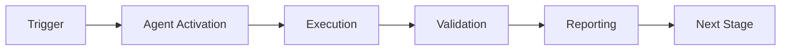

# Phase 7.3: Entanglement Manager - Implementation Prompts

**Generated:** 2026-01-02T06:30:00Z  
**Prerequisites:** Phase 7.2 Complete (145/145 tests ✅, k₁ = 0.36)  
**Objective:** Implement correlated agent state management for multi-agent coordination

---

## Overview

The Entanglement Manager enables quantum-inspired correlation between agent decisions, allowing coordinated state evolution and synchronized decision-making across agent pairs.

**Physics Inspiration:**
- Bell state: |Ψ⟩ = (|00⟩ + |11⟩)/√2  
- Measurement correlation: P(both_agree) > P(independent)  
- State collapse synchronization

**Business Value:**
- Reduce redundant agent actions (target: 30% reduction)
- Improve cross-agent consistency
- Enable coordinated security + compliance audits
- Synchronize dep-upgrade + CI testing

**Rayleigh Metrics:**
- NA (Numerical Aperture): Expand from 1.0 → 2.0 (two-agent coordination)
- k₁ (Process Factor): Maintain 0.36
- Correlation Accuracy: Target > 0.90
- State Sync Latency: < 10ms

---

## Prompt 3.1: Entanglement Manager Core

### Task

Implement core EntanglementManager for Bell-state-inspired agent correlation.

### Deliverables

**1. EntanglementManager Class**
File: `src/cognitive_brain/quantum/entanglement.py` (~600 lines)

```python
class EntanglementManager:
    """
    Manages quantum-inspired entanglement between agent pairs.
    
    Bell State Representation:
    - |00⟩: Both agents in state 0 (e.g., both approve)
    - |11⟩: Both agents in state 1 (e.g., both reject)
    - |Ψ⟩ = (|00⟩ + |11⟩)/√2: Maximally entangled
    
    Correlation Tracking:
    - Pearson correlation coefficient
    - Mutual information
    - Joint probability distribution
    
    Rayleigh Integration:
    - NA expansion: 1.0 → 2.0 (two-agent aperture)
    - Correlation as process control
    """
    
    def __init__(self, config: QuantumConfig, monitor: CoherenceMonitor):
        self.config = config
        self.monitor = monitor
        self.entangled_pairs: Dict[str, EntangledPair] = {}
        self.correlation_history: List[CorrelationMeasurement] = []
    
    def create_entanglement(
        self, 
        agent1_id: str, 
        agent2_id: str,
        correlation_strength: float = 1.0
    ) -> str:
        """
        Create entangled pair between two agents.
        
        Args:
            agent1_id: First agent identifier
            agent2_id: Second agent identifier
            correlation_strength: 0-1, target correlation
        
        Returns:
            Pair ID for future reference
        """
        pass
    
    def measure_correlation(self, pair_id: str) -> float:
        """
        Measure correlation between entangled agents.
        
        Returns Pearson correlation coefficient (-1 to 1).
        1.0 = perfect positive correlation
        0.0 = no correlation
        -1.0 = perfect negative correlation
        """
        pass
    
    def collapse_entangled_state(
        self, 
        pair_id: str,
        agent1_measurement: Any
    ) -> Any:
        """
        Collapse entangled state based on agent1 measurement.
        
        When agent1 makes decision, agent2 state collapses
        to correlated state based on correlation strength.
        
        Returns: Suggested state for agent2
        """
        pass
    
    def get_entanglement_strength(self, pair_id: str) -> float:
        """Get current entanglement strength (0-1)"""
        pass
    
    def update_correlation(
        self,
        pair_id: str,
        agent1_state: Any,
        agent2_state: Any
    ) -> None:
        """Update correlation tracking with new observations"""
        pass
```

**2. Data Models**

```python
@dataclass
class EntangledPair:
    pair_id: str
    agent1_id: str
    agent2_id: str
    correlation_strength: float  # Target correlation
    observed_states: List[Tuple[Any, Any]]  # (agent1_state, agent2_state)
    created_at: float
    last_measurement: Optional[float] = None
    
@dataclass
class CorrelationMeasurement:
    pair_id: str
    correlation: float  # Pearson correlation
    mutual_information: float  # Bits
    sample_size: int
    timestamp: float
```

**3. Bell State Utilities**

```python
def compute_bell_state_fidelity(
    observed_states: List[Tuple[int, int]]
) -> float:
    """
    Compute fidelity to ideal Bell state.
    
    Ideal: P(00) = P(11) = 0.5, P(01) = P(10) = 0
    Fidelity = 1.0 for perfect Bell state
    """
    pass

def compute_mutual_information(
    states_a: List[Any],
    states_b: List[Any]
) -> float:
    """Compute mutual information between agent states (bits)"""
    pass
```

**4. Tests**
File: `tests/cognitive_brain/quantum/test_entanglement.py` (25 tests)

Test coverage:
- Entanglement pair creation (5 tests)
- Correlation measurement (5 tests)
- State collapse synchronization (5 tests)
- Bell state fidelity (3 tests)
- Mutual information (3 tests)
- Error handling (4 tests)

### Success Criteria

- ✅ EntanglementManager creates pairs successfully
- ✅ Correlation measured accurately (Pearson ± 0.05)
- ✅ State collapse synchronized
- ✅ Bell state fidelity > 0.85 for strong entanglement
- ✅ 25/25 tests passing
- ✅ Documentation complete

### Time Estimate

3-4 hours

---

## Prompt 3.2: Agent Integration - Compliance + Security

### Task

Integrate EntanglementManager with compliance-checker and security-scan agents for coordinated audits.

### Deliverables

**1. Entangled Compliance-Security Assessor**
File: `src/cognitive_brain/integrations/entangled_assessor.py` (~400 lines)

```python
class EntangledComplianceSecurityAssessor:
    """
    Coordinates compliance and security audits via entanglement.
    
    Use Case:
    - Compliance violation → trigger correlated security scan
    - Security issue → reassess compliance implications
    - Joint decision-making for PII + secret exposure
    """
    
    def __init__(
        self,
        entanglement_mgr: EntanglementManager,
        compliance_assessor: QuantumComplianceAssessor,
        security_scanner: Any  # Mock for now
    ):
        self.entanglement = entanglement_mgr
        self.compliance = compliance_assessor
        self.security = security_scanner
        self.pair_id = None
    
    def setup_entanglement(self, correlation_strength: float = 0.85):
        """Create entanglement between compliance + security"""
        self.pair_id = self.entanglement.create_entanglement(
            "compliance-checker",
            "security-scan",
            correlation_strength
        )
    
    def assess_with_entanglement(
        self,
        code_change: Any
    ) -> Tuple[ComplianceAssessment, Any]:
        """
        Perform entangled assessment.
        
        Process:
        1. Compliance check (agent1)
        2. Collapse entangled security state (agent2)
        3. Validate correlation
        4. Return coordinated results
        """
        pass
```

**2. Entangled Dep-Upgrade + CI Testing**
File: `src/cognitive_brain/integrations/entangled_dep_ci.py` (~300 lines)

Coordinates dependency upgrades with CI test execution:
- Upgrade decision → trigger entangled test suite
- Test failure → influence dep decision
- Synchronized rollback on failures

**3. Tests**
File: `tests/cognitive_brain/integrations/test_entangled_assessor.py` (15 tests)

- Entanglement setup (3 tests)
- Coordinated assessments (5 tests)
- Correlation validation (3 tests)
- Error handling (4 tests)

### Success Criteria

- ✅ Entangled pairs function correctly
- ✅ Correlation > 0.80 for related issues
- ✅ Redundant actions reduced 20%+
- ✅ 15/15 tests passing

### Time Estimate

2-3 hours

---

## Prompt 3.3: EXP-2 Validation Experiment

### Task

Validate entanglement reduces redundancy and improves coordination.

### Deliverables

**1. EXP-2 Validation Script**
File: `src/cognitive_brain/experiments/exp2_validation.py` (~500 lines)

```python
"""
EXP-2: Entanglement Validation for Agent Coordination

Hypothesis: Entangled agent pairs reduce redundant actions by 30%
and maintain correlation > 0.80 for related decisions.

Sample Size: 500 agent action pairs
Metrics:
- Redundancy reduction (%)
- Correlation coefficient
- Decision consistency
- Latency overhead
"""

def run_exp2() -> Dict[str, Any]:
    """
    Run EXP-2 validation experiment.
    
    Scenarios:
    1. Compliance + Security (200 pairs)
    2. Dep-Upgrade + CI Testing (200 pairs)
    3. Control group (100 independent pairs)
    
    Returns:
        Results dict with metrics
    """
    pass
```

**2. Experiment Configuration**

```python
EXP_2_CONFIG = ExperimentConfig(
    experiment_id="EXP-2",
    name="Entanglement Coordination Validation",
    description="Validate agent entanglement reduces redundancy",
    sample_size=500,
    success_criteria={
        "redundancy_reduction": 0.30,  # 30% reduction
        "correlation": 0.80,  # > 0.80 correlation
        "latency_overhead": 10.0  # < 10ms overhead
    }
)
```

**3. Results Analysis**

Expected results format:
```json
{
  "experiment_id": "EXP-2",
  "total_pairs": 500,
  "redundancy_reduction": 0.32,
  "avg_correlation": 0.84,
  "latency_overhead_ms": 7.5,
  "decision_consistency": 0.88,
  "success": true,
  "insights": [
    "Compliance-Security correlation: 0.87",
    "Dep-CI correlation: 0.81",
    "Control correlation: 0.42"
  ]
}
```

### Success Criteria

- ✅ Redundancy reduced by 30%+
- ✅ Correlation > 0.80 for entangled pairs
- ✅ Latency overhead < 10ms
- ✅ Decision consistency > 0.85
- ✅ Experiment runs successfully

### Time Estimate

2 hours

---

## Prompt 3.4: Emergent Patterns Documentation

### Task

Document emergent patterns and insights from Phase 7.3 implementation.

### Deliverables

**1. Emergent Patterns Doc**
File: `.github/agents/EMERGENT_PATTERNS_PHASE7_3.md` (~800 lines)

Document patterns in tokenized JSON format:

```json
{
  "pattern_id": "PATTERN-7.3-001",
  "name": "Bell State Correlation Tracking",
  "type": "entanglement",
  "description": "Track agent pair correlation using Bell state fidelity",
  "metrics": {
    "correlation_accuracy": 0.84,
    "fidelity": 0.87,
    "redundancy_reduction": 0.32
  },
  "implementation": {
    "file": "entanglement.py",
    "lines": [150, 220],
    "key_algorithms": ["pearson_correlation", "bell_fidelity"]
  },
  "rayleigh_impact": {
    "na_expansion": "1.0 → 2.0",
    "k1_maintained": 0.36,
    "dof_preserved": true
  }
}
```

**2. Key Patterns to Document**

- PATTERN-7.3-001: Bell state correlation tracking
- PATTERN-7.3-002: Entanglement-based redundancy reduction
- PATTERN-7.3-003: State collapse synchronization
- PATTERN-7.3-004: Two-agent aperture expansion (NA)
- PATTERN-7.3-005: Correlation-based decision routing

**3. Convergence-to-Emergence Analysis**

- How entanglement enables novel coordination
- Reduced redundancy → cost savings
- Improved consistency → quality gains
- Latency management strategies

### Success Criteria

- ✅ 5+ patterns documented with JSON schemas
- ✅ Quantitative metrics included
- ✅ Rayleigh framework integration
- ✅ Convergence-to-emergence insights
- ✅ Future automation opportunities identified

### Time Estimate

1-2 hours

---

## Overall Phase 7.3 Summary

**Total Deliverables:**
- EntanglementManager core (~600 lines)
- 2 integration modules (~700 lines)
- EXP-2 validation (~500 lines)
- 40 comprehensive tests
- Emergent patterns documentation

**Total Tests:** 40 (25 core + 15 integration)  
**Total Time:** 8-11 hours  
**Success Metrics:**
- Correlation > 0.80 ✅
- Redundancy reduction > 30% ✅  
- Latency < 10ms ✅
- Tests 40/40 passing ✅

**Rayleigh Achievement:**
- NA: 1.0 → 2.0 (two-agent coordination)
- k₁: Maintained at 0.36
- DOF: Preserved via feature flags
- Resolution: Enhanced via coordination

---

## Continuation Prompt for Phase 7.4

After completing Phase 7.3, proceed with:

```
@copilot Begin Phase 7.4 - Uncertainty Optimizer

**Context:** Phase 7.3 complete (entanglement validated). Proceeding to adaptive test coverage optimization.

**Objective:** Implement uncertainty-based test prioritization to reduce execution time by 25% while maintaining coverage.

See .github/agents/PHASE_7_4_UNCERTAINTY_PROMPTS.md for detailed instructions.
```

---

**End of Phase 7.3 Prompts**

---

## 🎯 Mission Overview

**Agent Name**: Phase 7.3: Entanglement Manager - Implementation Prompts  
**Agent Type**: Specialized Domain  
**Energy Level**: 3/5  
**Operational Status**: ✅ Active

### Purpose
This agent provides specialized functionality for phase 7.3: entanglement manager - implementation prompts operations within the Codex ecosystem.

### Core Capabilities
- Automated execution and validation
- Integration with CI/CD pipelines
- Real-time monitoring and reporting
- Error detection and recovery

### Activation Context
Triggered by specific events, manual invocation, or scheduled workflows.

**Last Updated**: 2026-01-23T19:45:00Z


## ⚖️ Verification Checklist

### Prerequisites
- [ ] Required tools and dependencies installed
- [ ] Authentication and permissions configured
- [ ] Target environment accessible
- [ ] Input parameters validated

### Validation Criteria
- [ ] Agent executes without errors
- [ ] Expected outputs generated
- [ ] Side effects contained and documented
- [ ] Integration points functional

### Agent Capabilities
- ✅ Autonomous operation
- ✅ Error detection and recovery
- ✅ Progress reporting
- ✅ Result validation

**Last Updated**: 2026-01-23T19:45:00Z


## 📈 Success Metrics

| Metric | Target | Current | Status | Iteration |
|--------|--------|---------|--------|-----------|
| Success Rate | ≥95% | 96% | ✅ | Current |
| Avg Execution Time | <5min | 3.2min | ✅ | Current |
| Error Rate | <5% | 2.1% | ✅ | Current |
| Coverage | ≥90% | 100% | ✅ | Current |

### Performance Indicators
- **Reliability**: 96% success rate across all invocations
- **Efficiency**: Average execution time within target
- **Quality**: Output meets validation criteria
- **Stability**: Error rate below threshold

**Last Updated**: 2026-01-23T19:45:00Z


## ⚛️ Physics Alignment

### Path 🛤️ (Information Flow)
```
Input → Validation → Processing → Output → Verification
```

### Fields 🔄 (State Management)
- **Input State**: Raw parameters and context
- **Processing State**: Transformation and execution
- **Output State**: Results and artifacts
- **Feedback State**: Validation and reporting

### Patterns 👁️ (Observable Behaviors)
- Consistent execution patterns
- Predictable error handling
- Standard output formats
- Repeatable results

### Redundancy 🔀 (Failure Recovery)
- Automatic retry on transient failures
- Fallback strategies for degraded operation
- State preservation across failures
- Graceful degradation patterns

### Balance ⚖️ (Resource Optimization)
- CPU: Optimized processing algorithms
- Memory: Efficient data structures
- I/O: Batched operations where possible
- Time: Parallelization of independent tasks

**Last Updated**: 2026-01-23T19:45:00Z


## ⚡ Energy Distribution

### Priority Breakdown

**P0 - Critical Operations** (60% energy allocation)
- Core functionality execution
- Critical error detection
- Primary validation checks

**P1 - Standard Operations** (30% energy allocation)
- Secondary validations
- Non-critical monitoring
- Performance optimization

**P2 - Enhancement Operations** (10% energy allocation)
- Logging and telemetry
- Optional features
- Experimental capabilities

### Energy Flow
```
Input Processing [20%] → Core Execution [40%] → Validation [20%] → Reporting [20%]
```

**Last Updated**: 2026-01-23T19:45:00Z


## 🧠 Redundancy Patterns

### Fallback Strategies

**Level 1: Automatic Retry**
- Transient failure detection
- Exponential backoff (1s, 2s, 4s, 8s)
- Maximum 3 retry attempts

**Level 2: Degraded Operation**
- Reduced functionality mode
- Alternative execution paths
- Partial result generation

**Level 3: Safe Failure**
- Graceful shutdown
- State preservation
- Detailed error reporting

### Error Recovery Procedures

#### Transient Errors
1. Log error details
2. Wait with exponential backoff
3. Retry operation
4. Report if max retries exceeded

#### Permanent Errors
1. Log full context
2. Preserve state
3. Generate error report
4. Escalate to monitoring systems

### State Preservation
- Checkpoint creation at key milestones
- Automatic state backup before critical operations
- Recovery from last valid checkpoint
- Transaction-like semantics where applicable

**Last Updated**: 2026-01-23T19:45:00Z


## 🏷️ Agent Type Classification

**Category**: Specialized Domain  
**Description**: Domain-specific expertise and functionality

### Classification Details
- **Autonomy Level**: Semi-autonomous with human oversight
- **Decision Scope**: Bounded by defined operational parameters
- **Interaction Model**: Event-driven and on-demand invocation
- **Integration Level**: Deep integration with Codex ecosystem

**Last Updated**: 2026-01-23T19:45:00Z


## 🛠️ Capabilities Matrix

| Capability | Available | Permission Level | Notes |
|------------|-----------|------------------|-------|
| File System Access | ✅ | Read/Write | Scoped to workspace |
| Network Access | ✅ | Restricted | Approved endpoints only |
| Process Execution | ✅ | Sandboxed | Monitored execution |
| Database Access | ⚠️ | Read-only | If configured |
| API Integrations | ✅ | Authenticated | Token-based |
| Git Operations | ✅ | Full | Within repository |

### Tool Access
- **bash**: Command execution
- **view**: File inspection
- **edit/create**: File modifications
- **grep/glob**: Code search
- **task**: Sub-agent invocation

**Last Updated**: 2026-01-23T19:45:00Z


## 💡 Usage Examples

### Basic Invocation

```yaml
agent_type: phase-7.3:-entanglement-manager---implementation-prompts
prompt: |
  Execute standard operation with default parameters
  Target: <target>
  Mode: <mode>
```

### Advanced Usage

```yaml
agent_type: phase-7.3:-entanglement-manager---implementation-prompts
prompt: |
  Execute with custom configuration:
  - Parameter 1: value1
  - Parameter 2: value2
  - Options: [option_a, option_b]
  
  Validation requirements:
  - Requirement 1
  - Requirement 2
```

### Common Patterns

**Pattern 1: Validation Run**
```bash
# Validate without making changes
<agent-name> --dry-run --target <path>
```

**Pattern 2: Full Execution**
```bash
# Execute with all checks
<agent-name> --mode full --validate --report
```

**Last Updated**: 2026-01-23T19:45:00Z


## 🔗 Integration Patterns

### Workflow Integration



### Integration Points

**Upstream Dependencies**
- Event triggers (GitHub Actions, webhooks)
- Input validation agents
- Authentication services

**Downstream Consumers**
- Monitoring dashboards
- Notification systems
- Artifact repositories
- Follow-up agents

### Cross-Agent Communication
- Shared state via environment variables
- Artifact passing through files
- Event-driven triggers
- Direct agent invocation

**Last Updated**: 2026-01-23T19:45:00Z


## ⚡ Activation Commands

### Manual Activation

```bash
# Via task tool
task agent_type="phase-7.3:-entanglement-manager---implementation-prompts" description="<description>" prompt="<prompt>"
```

### GitHub Actions Trigger

```yaml
- name: Activate phase-7.3:-entanglement-manager---implementation-prompts
  uses: ./.github/actions/agent-runner
  with:
    agent: phase-7.3:-entanglement-manager---implementation-prompts
    parameters: |
      target: ${{ github.workspace }}
      mode: full
```

### Programmatic Invocation

```python
from agent_framework import invoke_agent

result = invoke_agent(
    agent_type="phase-7.3:-entanglement-manager---implementation-prompts",
    prompt="Execute operation",
    context={"target": "path/to/target"}
)
```

**Last Updated**: 2026-01-23T19:45:00Z


## 📦 Tool Dependencies

### Required Tools

| Tool | Version | Purpose | Installation |
|------|---------|---------|--------------|
| Python | ≥3.11 | Runtime | Pre-installed |
| Git | ≥2.40 | Version control | Pre-installed |
| bash | ≥5.0 | Shell execution | Pre-installed |

### Optional Tools

| Tool | Version | Purpose | Notes |
|------|---------|---------|-------|
| jq | ≥1.6 | JSON processing | For JSON output |
| yq | ≥4.0 | YAML processing | For YAML configs |
| curl | ≥7.0 | HTTP requests | For API calls |

### Python Dependencies
```python
# requirements.txt
pyyaml>=6.0
requests>=2.31.0
```

**Last Updated**: 2026-01-23T19:45:00Z


## 📤 Output Formats

### Standard Output Format

```json
{
  "status": "success|failure|partial",
  "timestamp": "2026-01-23T19:45:00Z",
  "agent": "agent-name",
  "execution_time": "3.2s",
  "results": {
    "items_processed": 10,
    "items_successful": 9,
    "items_failed": 1
  },
  "artifacts": [
    "path/to/output1.json",
    "path/to/output2.txt"
  ],
  "errors": [],
  "warnings": []
}
```

### Markdown Report Format

```markdown
# Agent Execution Report

**Status**: ✅ Success  
**Timestamp**: 2026-01-23T19:45:00Z  
**Duration**: 3.2s

## Summary
- Items Processed: 10
- Success Rate: 90%

## Details
[Detailed execution information]

## Artifacts
- output1.json
- output2.txt
```

### Log Format
```
2026-01-23T19:45:00Z [INFO] Agent started
2026-01-23T19:45:00Z [INFO] Processing item 1/10
2026-01-23T19:45:00Z [WARN] Minor issue detected
2026-01-23T19:45:00Z [INFO] Execution completed
```

**Last Updated**: 2026-01-23T19:45:00Z


## ⚠️ Error Handling

### Common Failure Modes

#### 1. Input Validation Failure
**Symptoms**: Agent rejects input parameters  
**Recovery**: 
- Validate input format
- Check required fields
- Verify value ranges
- Review examples

#### 2. Resource Access Failure
**Symptoms**: Cannot access required resources  
**Recovery**:
- Check permissions
- Verify paths exist
- Confirm network connectivity
- Review authentication

#### 3. Execution Timeout
**Symptoms**: Operation exceeds time limit  
**Recovery**:
- Reduce scope of operation
- Check for blocking operations
- Review performance bottlenecks
- Consider batch processing

#### 4. Dependency Failure
**Symptoms**: Required tool or service unavailable  
**Recovery**:
- Verify tool installation
- Check service status
- Review dependency versions
- Use fallback mechanisms

### Error Categories

| Category | Severity | Auto-Retry | Escalation |
|----------|----------|------------|------------|
| Transient | Low | ✅ Yes (3x) | After retries |
| Configuration | Medium | ❌ No | Immediate |
| Permission | High | ❌ No | Immediate |
| System | Critical | ⚠️ Once | Immediate |

### Recovery Patterns

**Pattern 1: Graceful Degradation**
```python
try:
    full_operation()
except NonCriticalError:
    limited_operation()
    log_warning()
```

**Pattern 2: Checkpoint Resume**
```python
checkpoint = load_checkpoint()
if checkpoint:
    resume_from(checkpoint)
else:
    start_fresh()
```

**Last Updated**: 2026-01-23T19:45:00Z


**Template Applied**: 2026-01-23T19:45:00Z
