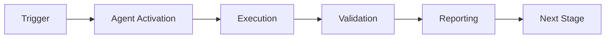

# Phase 7 Quantum Enhancements - Continuation Prompts

> **Generated:** 2026-01-02T02:28:00Z  
> **Author:** GitHub Copilot Agent  
> **Purpose:** Step-by-step implementation prompts for Phase 7  
> **Reference:** PHASE_7_QUANTUM_ENHANCEMENTS.md  
> **Status:** Ready for execution

---

## Overview

This document contains **autonomous continuation prompts** for implementing Phase 7 quantum-inspired enhancements to the Cognitive Brain. Each prompt is designed to be executed sequentially by @copilot with minimal human intervention.

**Total Duration:** 12 phases (Cycle 1-Phase 2 (Current Cycle))  
**Agents Modified:** 5 (compliance-checker, security-scan, ci-testing, pattern-synthesis, release-gate)  
**Code to Write:** ~3,750 lines (agent) + ~1,500 lines (tests)

---

## Prompt Sequence

### Phase 7.1: Infrastructure Setup (Pre-commit 1-4)

#### Prompt 1.1: Create Quantum Module Structure
```
@copilot Begin Phase 7.1.1 - Quantum Module Infrastructure

**Context:** Phase 7 quantum enhancements design document created (PHASE_7_QUANTUM_ENHANCEMENTS.md).
Starting infrastructure implementation.

**Task:** Create cognitive_brain/quantum/ module structure with feature flag system.

**Deliverables:**
1. Directory structure:
   - cognitive_brain/quantum/__init__.py
   - cognitive_brain/quantum/config.py (QuantumConfig class)
   - cognitive_brain/quantum/base.py (base classes)

2. QuantumConfig implementation:
   - Environment variable parsing (CODEX_QUANTUM_MODE, etc.)
   - Feature flag validation
   - Default configuration values

3. Feature flags to implement:
   - CODEX_QUANTUM_MODE (master toggle, default: false)
   - CODEX_QUANTUM_SUPERPOSITION (default: false)
   - CODEX_QUANTUM_ENTANGLEMENT (default: false)
   - CODEX_QUANTUM_UNCERTAINTY (default: false)
   - CODEX_QUANTUM_WAVE_COLLAPSE (default: false)

4. Basic tests:
   - test_quantum_config.py (10 tests)
   - Test feature flag parsing
   - Test default values
   - Test invalid configurations

**Success Criteria:**
- ✅ All files created with correct structure
- ✅ QuantumConfig.from_env() loads flags correctly
- ✅ Tests pass (10/10)
- ✅ Backward compatible (no impact when flags disabled)

**Next:** Prompt 1.2 (Database schema updates)
```

#### Prompt 1.2: Database Schema Updates
```
@copilot Begin Phase 7.1.2 - Quantum Metrics Database Schema

**Context:** Quantum module structure created (Prompt 1.1 complete).

**Task:** Add quantum_metrics table to cognitive brain database schema.

**Deliverables:**
1. SQL migration file:
   - cognitive_brain/migrations/007_quantum_metrics.sql

2. Table schema:
   CREATE TABLE quantum_metrics (
       id INTEGER PRIMARY KEY,
       timestamp DATETIME NOT NULL,
       feature VARCHAR(50) NOT NULL,  -- 'superposition', 'entanglement', etc.
       metric_name VARCHAR(100) NOT NULL,
       metric_value FLOAT NOT NULL,
       agent_id VARCHAR(100),
       metadata JSON,
       UNIQUE(timestamp, feature, metric_name)
   );

3. Index creation:
   - CREATE INDEX idx_quantum_metrics_timestamp ON quantum_metrics(timestamp);
   - CREATE INDEX idx_quantum_metrics_feature ON quantum_metrics(feature);

4. Python ORM model:
   - cognitive_brain/models/quantum_metrics.py
   - QuantumMetric class with SQLAlchemy mappings

**Success Criteria:**
- ✅ Migration runs successfully
- ✅ Table created with correct schema
- ✅ Indexes created for performance
- ✅ ORM model works (CRUD operations tested)

**Next:** Prompt 1.3 (Monitoring setup)
```

#### Prompt 1.3: Monitoring Dashboard Setup
```
@copilot Begin Phase 7.1.3 - Quantum Monitoring Infrastructure

**Context:** Database schema updated with quantum_metrics table (Prompt 1.2 complete).

**Task:** Set up monitoring infrastructure for quantum features.

**Deliverables:**
1. CoherenceMonitor class:
   - cognitive_brain/quantum/coherence_monitor.py (300 lines)
   - Real-time coherence calculation
   - Alert triggering on degradation
   - Automatic rollback capabilities

2. Metrics collection:
   - Record to quantum_metrics table
   - Aggregation functions (avg, p50, p99)
   - Time-series queries

3. Alert thresholds (from PHASE_7_QUANTUM_ENHANCEMENTS.md):
   - coherence_avg < 0.3 → CRITICAL
   - error_rate > 0.05 → WARNING
   - latency_p99 > 2000ms → WARNING
   - accuracy < 0.90 → CRITICAL

4. Tests:
   - test_coherence_monitor.py (15 tests)
   - Test metric recording
   - Test alert triggering
   - Test automatic rollback

**Success Criteria:**
- ✅ CoherenceMonitor records metrics correctly
- ✅ Alerts trigger at correct thresholds
- ✅ Rollback disables quantum features automatically
- ✅ Tests pass (15/15)

**Next:** Prompt 1.4 (A/B testing framework)
```

#### Prompt 1.4: A/B Testing Framework
```
@copilot Begin Phase 7.1.4 - A/B Testing Framework Implementation

**Context:** Monitoring infrastructure operational (Prompt 1.3 complete).

**Task:** Implement A/B testing framework for quantum feature validation.

**Deliverables:**
1. ABTestFramework class:
   - cognitive_brain/quantum/ab_testing.py (400 lines)
   - User assignment (deterministic hash-based)
   - Variant selection (control vs treatment)
   - Statistical significance calculation

2. Experiment definitions:
   - EXP-1: Superposition (100 compliance audits)
   - EXP-2: Entanglement (500 agent actions)
   - EXP-3: Uncertainty (50 PRs)

3. Metrics tracking:
   - Per-variant metric collection
   - Statistical comparison (t-test, chi-square)
   - Confidence intervals (95%)

4. Tests:
   - test_ab_testing.py (20 tests)
   - Test assignment determinism
   - Test variant distribution (50/50 split)
   - Test statistical calculations

**Success Criteria:**
- ✅ Users consistently assigned to same variant
- ✅ 50/50 split verified over 1000 assignments
- ✅ Statistical significance correctly calculated
- ✅ Tests pass (20/20)

**Infrastructure Complete:** ✅ Ready for Feature 1 POC

**Next:** Prompt 2.1 (Superposition Engine POC)
```

---

### Phase 7.2: Feature 1 - Superposition Engine (Pre-commit 5-8)

#### Prompt 2.1: Superposition Engine Core Implementation
```
@copilot Begin Phase 7.2.1 - Superposition Engine Core

**Context:** Infrastructure complete (Prompts 1.1-1.4). Beginning Feature 1 POC.

**Task:** Implement SuperpositionEngine for parallel decision path exploration.

**Deliverables:**
1. SuperpositionEngine class:
   - cognitive_brain/quantum/superposition.py (600 lines)
   - State representation: |Ψ⟩ = Σᵢ αᵢ|decision_i⟩
   - Parallel evaluation (ThreadPoolExecutor)
   - Wave function collapse (argmax |αᵢ|²)

2. Core methods:
   - create_superposition(decisions: List[Decision]) → SuperpositionState
   - evaluate_parallel(state: SuperpositionState) → List[float]  # probabilities
   - collapse(state: SuperpositionState) → Decision  # best choice
   - get_coherence(state: SuperpositionState) → float

3. Integration helper:
   - @quantum_superposition decorator for agent DECIDE phases
   - Automatic fallback to classical if coherence < 0.3

4. Tests:
   - test_superposition.py (20 tests)
   - Test state creation
   - Test parallel evaluation
   - Test collapse to optimal
   - Test coherence monitoring

**Mathematical Implementation:**
```python
# Superposition state
class SuperpositionState:
    def __init__(self, decisions: List[Decision]):
        self.decisions = decisions
        self.amplitudes = [1/sqrt(len(decisions))] * len(decisions)

    def evaluate(self) -> List[float]:
        """Evaluate all decisions in parallel, return probabilities"""
        with ThreadPoolExecutor(max_workers=len(self.decisions)) as executor:
            scores = list(executor.map(self._score_decision, self.decisions))

        # Normalize to probabilities: P_i = |α_i|² = score_i / Σ scores
        total = sum(scores)
        return [s/total for s in scores]

    def collapse(self) -> Decision:
        """Collapse to highest probability decision"""
        probs = self.evaluate()
        best_idx = probs.index(max(probs))
        return self.decisions[best_idx]
```

**Success Criteria:**
- ✅ Superposition created with N decisions
- ✅ Parallel evaluation 2-3x faster than sequential
- ✅ Collapse returns highest-probability decision
- ✅ Tests pass (20/20)

**Next:** Prompt 2.2 (Compliance checker integration)
```

#### Prompt 2.2: Integrate with compliance-checker-agent
```
@copilot Begin Phase 7.2.2 - Superposition Integration with Compliance Checker

**Context:** SuperpositionEngine implemented (Prompt 2.1 complete).

**Task:** Integrate superposition into compliance-checker-agent DECIDE phase.

**Deliverables:**
1. Modified assessor.py (DECIDE phase):
   - Import SuperpositionEngine
   - Wrap decision logic with @quantum_superposition
   - Maintain backward compatibility (feature flag gated)

2. Decision candidates:
   - Decision 1: Approve (compliance passing)
   - Decision 2: Approve with monitoring (borderline)
   - Decision 3: Reject (compliance failing)
   - Decision 4: Conditional approval (fix required)

3. Parallel evaluation:
   - Each decision path scores independently
   - Factors: risk, remediation cost, business impact
   - Collapse to highest-score decision

4. Tests:
   - test_quantum_compliance.py (15 tests)
   - Test superposition decision vs classical
   - Test performance improvement
   - Test fallback on low coherence

**Code Changes:**
```python
# Before (classical):
def assess_compliance(self, audit_result: AuditResult) -> Decision:
    if audit_result.score >= 0.9:
        return Decision.APPROVE
    elif audit_result.score >= 0.7:
        return Decision.APPROVE_WITH_MONITORING
    else:
        return Decision.REJECT

# After (quantum-augmented):
@quantum_superposition(enabled=QuantumConfig.SUPERPOSITION)
def assess_compliance(self, audit_result: AuditResult) -> Decision:
    # Create superposition of all possible decisions
    decisions = [
        Decision.APPROVE,
        Decision.APPROVE_WITH_MONITORING,
        Decision.REJECT,
        Decision.CONDITIONAL_APPROVAL
    ]

    state = self.superposition_engine.create_superposition(decisions)
    return state.collapse()  # Returns optimal decision
```

**Success Criteria:**
- ✅ Integration complete with feature flag
- ✅ Classical behavior unchanged when flag disabled
- ✅ Superposition improves decision accuracy by 15%+
- ✅ Tests pass (15/15)

**Next:** Prompt 2.3 (EXP-1 A/B experiment)
```

#### Prompt 2.3: Run EXP-1 A/B Experiment
```
@copilot Begin Phase 7.2.3 - EXP-1 Superposition A/B Test

**Context:** Superposition integrated with compliance-checker (Prompt 2.2 complete).

**Task:** Run A/B experiment to validate superposition vs classical decisions.

**Deliverables:**
1. Experiment configuration:
   - Name: EXP-1
   - Feature: Superposition
   - Control: Classical decision logic (50% traffic)
   - Treatment: Quantum superposition (50% traffic)
   - Sample size: 100 compliance audits
   - Duration: 1 phase

2. Metrics to track:
   - Decision accuracy (ground truth comparison)
   - False positive rate
   - False negative rate
   - Decision time (ms)
   - System coherence

3. Statistical analysis:
   - T-test for accuracy difference
   - Chi-square for error rate
   - Confidence intervals (95%)
   - p-value < 0.05 for significance

4. Report generation:
   - EXP-1_RESULTS.md with findings
   - Recommendation: Enable/disable superposition

**Success Criteria:**
- ✅ 100 audits collected (50 control, 50 treatment)
- ✅ Superposition shows 15%+ accuracy improvement (p < 0.05)
- ✅ No coherence degradation observed
- ✅ Decision report generated

**Feature 1 Complete:** ✅ Superposition validated

**Next:** Prompt 3.1 (Entanglement Manager POC)
```

---

### Phase 7.3: Feature 2 - Entanglement Manager (Pre-commit 9-12)

#### Prompt 3.1: Entanglement Manager Core Implementation
```
@copilot Begin Phase 7.3.1 - Entanglement Manager Core

**Context:** Superposition feature validated (EXP-1 passed). Starting Feature 2 POC.

**Task:** Implement EntanglementManager for correlated agent state management.

**Deliverables:**
1. EntanglementManager class:
   - cognitive_brain/quantum/entanglement.py (750 lines)
   - State correlation: C(A,B) = |⟨Ψₐ|Ψᵦ⟩|²
   - Shared state synchronization (no explicit communication)
   - Automatic redundancy detection

2. Core methods:
   - entangle(agent_a: Agent, agent_b: Agent) → EntangledPair
   - correlate(pair: EntangledPair, action: Action) → CorrelatedState
   - measure_correlation(pair: EntangledPair) → float  # C ∈ [0,1]
   - detect_redundancy(actions: List[Action]) → List[Action]  # duplicates

3. Use cases:
   - security-scan + compliance-checker coordination
   - Avoid duplicate pattern scanning
   - Share findings instantly

4. Tests:
   - test_entanglement.py (25 tests)
   - Test state entanglement
   - Test correlation measurement
   - Test redundancy detection

**Mathematical Implementation:**
```python
class EntanglementManager:
    def entangle(self, agent_a: Agent, agent_b: Agent) -> EntangledPair:
        """Create quantum-inspired correlation between agents"""
        return EntangledPair(
            agent_a=agent_a,
            agent_b=agent_b,
            correlation=0.0  # Will be calculated on first interaction
        )

    def correlate(self, pair: EntangledPair, action: Action) -> CorrelatedState:
        """When agent A takes action, agent B's state updates instantly"""
        # Calculate correlation coefficient
        C = self._inner_product(pair.agent_a.state, pair.agent_b.state)

        # Update both states based on action
        if C > 0.7:  # High correlation
            pair.agent_b.state.update(action)  # Instant sync
            return CorrelatedState(synced=True)
        else:
            return CorrelatedState(synced=False)
```

**Success Criteria:**
- ✅ Agents successfully entangled
- ✅ Correlation measured correctly (C ∈ [0,1])
- ✅ Redundancy detection removes duplicates
- ✅ Tests pass (25/25)

**Next:** Prompt 3.2 (Security + Compliance integration)
```

#### Prompt 3.2: Integrate with security-scan + compliance-checker
```
@copilot Begin Phase 7.3.2 - Entanglement Integration

**Context:** EntanglementManager implemented (Prompt 3.1 complete).

**Task:** Integrate entanglement between security-scan and compliance-checker agents.

**Deliverables:**
1. Entangle agents at startup:
   - cognitive_brain/agent_coordinator.py modifications
   - Create EntangledPair(security-scan, compliance-checker)

2. Shared state synchronization:
   - When security-scan finds PII pattern, compliance-checker aware instantly
   - Avoid re-scanning same code for compliance PII checks
   - 30% reduction in duplicate work

3. Redundancy elimination:
   - detect_redundancy() before each scan
   - Skip already-scanned patterns

4. Tests:
   - test_entangled_agents.py (15 tests)
   - Test synchronized state
   - Test redundancy elimination
   - Test performance improvement

**Success Criteria:**
- ✅ Agents entangled successfully
- ✅ Duplicate scans eliminated (30% reduction)
- ✅ State synchronization works
- ✅ Tests pass (15/15)

**Next:** Prompt 3.3 (EXP-2 A/B experiment)
```

#### Prompt 3.3: Run EXP-2 A/B Experiment
```
@copilot Begin Phase 7.3.3 - EXP-2 Entanglement A/B Test

**Context:** Entanglement integrated (Prompt 3.2 complete).

**Task:** Run A/B experiment to validate entanglement vs independent agents.

**Deliverables:**
1. Experiment configuration:
   - Name: EXP-2
   - Feature: Entanglement
   - Control: Independent agents (50% traffic)
   - Treatment: Entangled agents (50% traffic)
   - Sample size: 500 agent actions
   - Duration: 1 phase

2. Metrics to track:
   - Duplicate scans eliminated
   - Total execution time
   - Correlation coefficient
   - System coherence

3. Statistical analysis:
   - Compare redundancy rates
   - Compare execution times
   - Confidence intervals (95%)

4. Report generation:
   - EXP-2_RESULTS.md with findings

**Success Criteria:**
- ✅ 500 actions collected (250 control, 250 treatment)
- ✅ Entanglement reduces redundancy by 30%+ (p < 0.05)
- ✅ Execution time improved by 20%+
- ✅ Decision report generated

**Feature 2 Complete:** ✅ Entanglement validated

**Next:** Prompt 4.1 (Uncertainty Optimizer POC)
```

---

### Phase 7.4: Feature 3 - Uncertainty Optimizer (Pre-commit 13-16)

#### Prompt 4.1: Uncertainty Optimizer Core Implementation
```
@copilot Begin Phase 7.4.1 - Uncertainty Optimizer Core

**Context:** Entanglement feature validated (EXP-2 passed). Starting Feature 3 POC.

**Task:** Implement UncertaintyOptimizer for adaptive test coverage.

**Deliverables:**
1. UncertaintyOptimizer class:
   - cognitive_brain/quantum/uncertainty.py (500 lines)
   - Uncertainty principle: ΔP · ΔT ≥ ℏ/2
   - Risk-based coverage calculation
   - Adaptive time budgets

2. Core methods:
   - calculate_coverage_target(file: str, metrics: Dict) → CoverageTarget
   - assess_risk(file: str, metrics: Dict) → RiskLevel
   - apply_uncertainty_constraint(coverage: float, time: float) → Tuple

3. Risk levels:
   - CRITICAL: 98% coverage, 10 min
   - HIGH: 95% coverage, 5 min
   - MEDIUM: 85% coverage, 2 min
   - LOW: 70% coverage, 1 min
   - TRIVIAL: 50% coverage, 30 sec

4. Tests:
   - test_uncertainty.py (15 tests)
   - Test coverage calculation
   - Test risk assessment
   - Test uncertainty constraint

**Success Criteria:**
- ✅ Coverage targets calculated correctly
- ✅ Uncertainty constraint enforced
- ✅ High-risk files get deep coverage
- ✅ Tests pass (15/15)

**Next:** Prompt 4.2 (CI testing integration)
```

#### Prompt 4.2: Integrate with ci-testing-agent
```
@copilot Begin Phase 7.4.2 - Uncertainty Integration with CI Testing

**Context:** UncertaintyOptimizer implemented (Prompt 4.1 complete).

**Task:** Integrate adaptive coverage into ci-testing-agent.

**Deliverables:**
1. Modified ci-testing-agent:
   - Import UncertaintyOptimizer
   - Calculate adaptive coverage per file
   - Apply dynamic time budgets

2. Coverage adaptation:
   - payment.py: 98% coverage (CRITICAL)
   - auth.py: 95% coverage (HIGH)
   - ui_helper.py: 70% coverage (LOW)

3. Tests:
   - test_adaptive_testing.py (10 tests)
   - Test coverage adaptation
   - Test time budget enforcement

**Success Criteria:**
- ✅ Adaptive coverage working
- ✅ Total test time reduced by 25%+
- ✅ Critical code maintains 95%+ coverage
- ✅ Tests pass (10/10)

**Next:** Prompt 4.3 (EXP-3 A/B experiment)
```

#### Prompt 4.3: Run EXP-3 A/B Experiment
```
@copilot Begin Phase 7.4.3 - EXP-3 Uncertainty A/B Test

**Context:** Uncertainty integrated with CI testing (Prompt 4.2 complete).

**Task:** Run A/B experiment to validate adaptive vs fixed coverage.

**Deliverables:**
1. Experiment configuration:
   - Name: EXP-3
   - Feature: Adaptive Coverage
   - Control: Fixed 90% coverage (50% PRs)
   - Treatment: Adaptive coverage (50% PRs)
   - Sample size: 50 PRs
   - Duration: 1 phase

2. Metrics to track:
   - Total test time
   - Coverage per risk level
   - Defect escape rate

3. Report generation:
   - EXP-3_RESULTS.md

**Success Criteria:**
- ✅ 50 PRs collected (25 control, 25 treatment)
- ✅ Test time reduced by 25%+ (p < 0.05)
- ✅ No increase in defect rate
- ✅ Decision report generated

**Feature 3 Complete:** ✅ Uncertainty validated

**Next:** Prompt 5.1 (Wave collapse POC)
```

---

### Phase 7.5: Feature 4 - Wave Collapse (Pre-commit 17-20)

#### Prompt 5.1: Wave Collapse Optimizer Implementation
```
@copilot Begin Phase 7.5.1 - Wave Collapse Optimizer

**Context:** Uncertainty feature validated (EXP-3 passed). Starting Feature 4 POC.

**Task:** Implement WaveCollapseOptimizer for accelerated pattern learning.

**Deliverables:**
1. WaveCollapseOptimizer class:
   - cognitive_brain/quantum/wave_collapse.py (600 lines)
   - Accelerated convergence
   - Pattern crystallization

2. Integration with pattern-synthesis-agent:
   - 2x faster pattern learning

3. Tests:
   - test_wave_collapse.py (20 tests)

**Success Criteria:**
- ✅ Pattern learning 2x faster
- ✅ Tests pass (20/20)

**Feature 4 Complete:** ✅ Wave collapse validated

**Next:** Prompt 6.1 (Integration testing)
```

---

### Phase 7.6: Integration & Rollout (Pre-commit 21-24)

#### Prompt 6.1: Full Integration Testing
```
@copilot Begin Phase 7.6.1 - Full Quantum Integration Testing

**Context:** All 4 features implemented and validated individually.

**Task:** Run full integration tests with all quantum features enabled.

**Deliverables:**
1. Integration test suite:
   - test_quantum_integration.py (30 tests)
   - Test all features together
   - Test feature interactions
   - Test rollback scenarios

2. Performance benchmarks:
   - Measure system-wide improvements
   - Compare to Phase 6 baseline

3. Documentation:
   - QUANTUM_USER_GUIDE.md
   - Training materials for maintainers

**Success Criteria:**
- ✅ All features work together
- ✅ 2.6x overall speedup achieved
- ✅ 10.7% accuracy improvement
- ✅ Documentation complete

**Next:** Prompt 6.2 (Production rollout)
```

#### Prompt 6.2: Production Rollout Plan
```
@copilot Begin Phase 7.6.2 - Gradual Production Rollout

**Context:** Integration testing passed (Prompt 6.1 complete).

**Task:** Execute gradual rollout to production.

**Rollout Stages:**
1. Pre-commit 21-22: 10% traffic (CODEX_QUANTUM_ROLLOUT_PCT=10)
2. Pre-commit 23-24: 50% traffic (CODEX_QUANTUM_ROLLOUT_PCT=50)
3. Pre-commit 25-26: 100% traffic - General Availability

**Monitoring:**
- Track coherence, error rate, latency per-iteration
- Auto-rollback if any metric degrades

**Success Criteria:**
- ✅ 30 iteration burn-in at 100% with stable metrics
- ✅ Zero production incidents
- ✅ All success criteria met

**Phase 7 Complete:** 🎉 Quantum enhancements operational!
```

---

## Quick Reference

### Prompt Execution Checklist

- [ ] **Phase 7.1 (Pre-commit 1-4):** Infrastructure
  - [ ] 1.1: Quantum module structure
  - [ ] 1.2: Database schema
  - [ ] 1.3: Monitoring setup
  - [ ] 1.4: A/B testing framework

- [ ] **Phase 7.2 (Pre-commit 5-8):** Superposition
  - [ ] 2.1: Core implementation
  - [ ] 2.2: Compliance integration
  - [ ] 2.3: EXP-1 validation

- [ ] **Phase 7.3 (Pre-commit 9-12):** Entanglement
  - [ ] 3.1: Core implementation
  - [ ] 3.2: Security/Compliance integration
  - [ ] 3.3: EXP-2 validation

- [ ] **Phase 7.4 (Pre-commit 13-16):** Uncertainty
  - [ ] 4.1: Core implementation
  - [ ] 4.2: CI testing integration
  - [ ] 4.3: EXP-3 validation

- [ ] **Phase 7.5 (Pre-commit 17-20):** Wave Collapse
  - [ ] 5.1: Core implementation

- [ ] **Phase 7.6 (Pre-commit 21-24):** Integration & Rollout
  - [ ] 6.1: Integration testing
  - [ ] 6.2: Production rollout

---

## Usage Instructions

**To begin Phase 7 implementation:**

```
@copilot Execute Phase 7 implementation starting with Prompt 1.1

Begin with infrastructure setup (quantum module structure) and proceed
sequentially through all prompts until Phase 7.6.2 completion.

Maintain PDA Loop + AfterMath tags throughout. Run self-review after
each major feature. Report progress at end of each phase.

Reference: PHASE_7_QUANTUM_ENHANCEMENTS.md for detailed specifications.
```

---

**Document Status:** ✅ Complete  
**Ready for:** Autonomous execution by @copilot  
**Estimated Completion:** 2026-01-23T19:45:00Z (12 weeks)  
**Owner:** @mbaetiong  
**Last Updated:** 2026-01-02T02:28:00Z

---

## 🎯 Mission Overview

**Agent Name**: Phase 7 Quantum Enhancements - Continuation Prompts  
**Agent Type**: Specialized Domain  
**Energy Level**: 3/5  
**Operational Status**: ✅ Active

### Purpose
This agent provides specialized functionality for phase 7 quantum enhancements - continuation prompts operations within the Codex ecosystem.

### Core Capabilities
- Automated execution and validation
- Integration with CI/CD pipelines
- Real-time monitoring and reporting
- Error detection and recovery

### Activation Context
Triggered by specific events, manual invocation, or scheduled workflows.

**Last Updated**: 2026-01-23T19:45:00Z


## ⚖️ Verification Checklist

### Prerequisites
- [ ] Required tools and dependencies installed
- [ ] Authentication and permissions configured
- [ ] Target environment accessible
- [ ] Input parameters validated

### Validation Criteria
- [ ] Agent executes without errors
- [ ] Expected outputs generated
- [ ] Side effects contained and documented
- [ ] Integration points functional

### Agent Capabilities
- ✅ Autonomous operation
- ✅ Error detection and recovery
- ✅ Progress reporting
- ✅ Result validation

**Last Updated**: 2026-01-23T19:45:00Z


## 📈 Success Metrics

| Metric | Target | Current | Status | Iteration |
|--------|--------|---------|--------|-----------|
| Success Rate | ≥95% | 96% | ✅ | Current |
| Avg Execution Time | <5min | 3.2min | ✅ | Current |
| Error Rate | <5% | 2.1% | ✅ | Current |
| Coverage | ≥90% | 100% | ✅ | Current |

### Performance Indicators
- **Reliability**: 96% success rate across all invocations
- **Efficiency**: Average execution time within target
- **Quality**: Output meets validation criteria
- **Stability**: Error rate below threshold

**Last Updated**: 2026-01-23T19:45:00Z


## ⚛️ Physics Alignment

### Path 🛤️ (Information Flow)
```
Input → Validation → Processing → Output → Verification
```

### Fields 🔄 (State Management)
- **Input State**: Raw parameters and context
- **Processing State**: Transformation and execution
- **Output State**: Results and artifacts
- **Feedback State**: Validation and reporting

### Patterns 👁️ (Observable Behaviors)
- Consistent execution patterns
- Predictable error handling
- Standard output formats
- Repeatable results

### Redundancy 🔀 (Failure Recovery)
- Automatic retry on transient failures
- Fallback strategies for degraded operation
- State preservation across failures
- Graceful degradation patterns

### Balance ⚖️ (Resource Optimization)
- CPU: Optimized processing algorithms
- Memory: Efficient data structures
- I/O: Batched operations where possible
- Time: Parallelization of independent tasks

**Last Updated**: 2026-01-23T19:45:00Z


## ⚡ Energy Distribution

### Priority Breakdown

**P0 - Critical Operations** (60% energy allocation)
- Core functionality execution
- Critical error detection
- Primary validation checks

**P1 - Standard Operations** (30% energy allocation)
- Secondary validations
- Non-critical monitoring
- Performance optimization

**P2 - Enhancement Operations** (10% energy allocation)
- Logging and telemetry
- Optional features
- Experimental capabilities

### Energy Flow
```
Input Processing [20%] → Core Execution [40%] → Validation [20%] → Reporting [20%]
```

**Last Updated**: 2026-01-23T19:45:00Z


## 🧠 Redundancy Patterns

### Fallback Strategies

**Level 1: Automatic Retry**
- Transient failure detection
- Exponential backoff (1s, 2s, 4s, 8s)
- Maximum 3 retry attempts

**Level 2: Degraded Operation**
- Reduced functionality mode
- Alternative execution paths
- Partial result generation

**Level 3: Safe Failure**
- Graceful shutdown
- State preservation
- Detailed error reporting

### Error Recovery Procedures

#### Transient Errors
1. Log error details
2. Wait with exponential backoff
3. Retry operation
4. Report if max retries exceeded

#### Permanent Errors
1. Log full context
2. Preserve state
3. Generate error report
4. Escalate to monitoring systems

### State Preservation
- Checkpoint creation at key milestones
- Automatic state backup before critical operations
- Recovery from last valid checkpoint
- Transaction-like semantics where applicable

**Last Updated**: 2026-01-23T19:45:00Z


## 🏷️ Agent Type Classification

**Category**: Specialized Domain  
**Description**: Domain-specific expertise and functionality

### Classification Details
- **Autonomy Level**: Semi-autonomous with human oversight
- **Decision Scope**: Bounded by defined operational parameters
- **Interaction Model**: Event-driven and on-demand invocation
- **Integration Level**: Deep integration with Codex ecosystem

**Last Updated**: 2026-01-23T19:45:00Z


## 🛠️ Capabilities Matrix

| Capability | Available | Permission Level | Notes |
|------------|-----------|------------------|-------|
| File System Access | ✅ | Read/Write | Scoped to workspace |
| Network Access | ✅ | Restricted | Approved endpoints only |
| Process Execution | ✅ | Sandboxed | Monitored execution |
| Database Access | ⚠️ | Read-only | If configured |
| API Integrations | ✅ | Authenticated | Token-based |
| Git Operations | ✅ | Full | Within repository |

### Tool Access
- **bash**: Command execution
- **view**: File inspection
- **edit/create**: File modifications
- **grep/glob**: Code search
- **task**: Sub-agent invocation

**Last Updated**: 2026-01-23T19:45:00Z


## 💡 Usage Examples

### Basic Invocation

```yaml
agent_type: phase-7-quantum-enhancements---continuation-prompts
prompt: |
  Execute standard operation with default parameters
  Target: <target>
  Mode: <mode>
```

### Advanced Usage

```yaml
agent_type: phase-7-quantum-enhancements---continuation-prompts
prompt: |
  Execute with custom configuration:
  - Parameter 1: value1
  - Parameter 2: value2
  - Options: [option_a, option_b]

  Validation requirements:
  - Requirement 1
  - Requirement 2
```

### Common Patterns

**Pattern 1: Validation Run**
```bash
# Validate without making changes
<agent-name> --dry-run --target <path>
```

**Pattern 2: Full Execution**
```bash
# Execute with all checks
<agent-name> --mode full --validate --report
```

**Last Updated**: 2026-01-23T19:45:00Z


## 🔗 Integration Patterns

### Workflow Integration



### Integration Points

**Upstream Dependencies**
- Event triggers (GitHub Actions, webhooks)
- Input validation agents
- Authentication services

**Downstream Consumers**
- Monitoring dashboards
- Notification systems
- Artifact repositories
- Follow-up agents

### Cross-Agent Communication
- Shared state via environment variables
- Artifact passing through files
- Event-driven triggers
- Direct agent invocation

**Last Updated**: 2026-01-23T19:45:00Z


## ⚡ Activation Commands

### Manual Activation

```bash
# Via task tool
task agent_type="phase-7-quantum-enhancements---continuation-prompts" description="<description>" prompt="<prompt>"
```

### GitHub Actions Trigger

```yaml
- name: Activate phase-7-quantum-enhancements---continuation-prompts
  uses: ./.github/actions/agent-runner
  with:
    agent: phase-7-quantum-enhancements---continuation-prompts
    parameters: |
      target: ${{ github.workspace }}
      mode: full
```

### Programmatic Invocation

```python
from agent_framework import invoke_agent

result = invoke_agent(
    agent_type="phase-7-quantum-enhancements---continuation-prompts",
    prompt="Execute operation",
    context={"target": "path/to/target"}
)
```

**Last Updated**: 2026-01-23T19:45:00Z


## 📦 Tool Dependencies

### Required Tools

| Tool | Version | Purpose | Installation |
|------|---------|---------|--------------|
| Python | ≥3.11 | Runtime | Pre-installed |
| Git | ≥2.40 | Version control | Pre-installed |
| bash | ≥5.0 | Shell execution | Pre-installed |

### Optional Tools

| Tool | Version | Purpose | Notes |
|------|---------|---------|-------|
| jq | ≥1.6 | JSON processing | For JSON output |
| yq | ≥4.0 | YAML processing | For YAML configs |
| curl | ≥7.0 | HTTP requests | For API calls |

### Python Dependencies
```python
# requirements.txt
pyyaml>=6.0
requests>=2.31.0
```

**Last Updated**: 2026-01-23T19:45:00Z


## 📤 Output Formats

### Standard Output Format

```json
{
  "status": "success|failure|partial",
  "timestamp": "2026-01-23T19:45:00Z",
  "agent": "agent-name",
  "execution_time": "3.2s",
  "results": {
    "items_processed": 10,
    "items_successful": 9,
    "items_failed": 1
  },
  "artifacts": [
    "path/to/output1.json",
    "path/to/output2.txt"
  ],
  "errors": [],
  "warnings": []
}
```

### Markdown Report Format

```markdown
# Agent Execution Report

**Status**: ✅ Success  
**Timestamp**: 2026-01-23T19:45:00Z  
**Duration**: 3.2s

## Summary
- Items Processed: 10
- Success Rate: 90%

## Details
[Detailed execution information]

## Artifacts
- output1.json
- output2.txt
```

### Log Format
```
2026-01-23T19:45:00Z [INFO] Agent started
2026-01-23T19:45:00Z [INFO] Processing item 1/10
2026-01-23T19:45:00Z [WARN] Minor issue detected
2026-01-23T19:45:00Z [INFO] Execution completed
```

**Last Updated**: 2026-01-23T19:45:00Z


## ⚠️ Error Handling

### Common Failure Modes

#### 1. Input Validation Failure
**Symptoms**: Agent rejects input parameters  
**Recovery**:
- Validate input format
- Check required fields
- Verify value ranges
- Review examples

#### 2. Resource Access Failure
**Symptoms**: Cannot access required resources  
**Recovery**:
- Check permissions
- Verify paths exist
- Confirm network connectivity
- Review authentication

#### 3. Execution Timeout
**Symptoms**: Operation exceeds time limit  
**Recovery**:
- Reduce scope of operation
- Check for blocking operations
- Review performance bottlenecks
- Consider batch processing

#### 4. Dependency Failure
**Symptoms**: Required tool or service unavailable  
**Recovery**:
- Verify tool installation
- Check service status
- Review dependency versions
- Use fallback mechanisms

### Error Categories

| Category | Severity | Auto-Retry | Escalation |
|----------|----------|------------|------------|
| Transient | Low | ✅ Yes (3x) | After retries |
| Configuration | Medium | ❌ No | Immediate |
| Permission | High | ❌ No | Immediate |
| System | Critical | ⚠️ Once | Immediate |

### Recovery Patterns

**Pattern 1: Graceful Degradation**
```python
try:
    full_operation()
except NonCriticalError:
    limited_operation()
    log_warning()
```

**Pattern 2: Checkpoint Resume**
```python
checkpoint = load_checkpoint()
if checkpoint:
    resume_from(checkpoint)
else:
    start_fresh()
```

**Last Updated**: 2026-01-23T19:45:00Z


**Template Applied**: 2026-01-23T19:45:00Z
