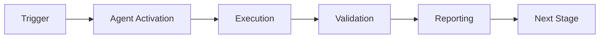

# Phase 7 Continuation Prompt - Options for Next Session

**Generated:** 2026-01-02T05:00:00Z  
**Current Status:** Phase 7.2.2-7.2.3 Complete (105/105 tests ✅)  
**Options:** Optimize (7.2.4) OR Proceed to Entanglement (7.3)

---

## Option A: Phase 7.2.4 - Superposition Optimization (Recommended)

### Objective
Achieve k₁ = 0.35 target (current: 0.40) through adaptive learning and complex domain testing.

### Prompt
```
@copilot Begin Phase 7.2.4 - Superposition Optimization

**Context:** Phase 7.2.2-7.2.3 complete. EXP-1 revealed classical advantage in simple rule domains. Need optimization for complex scenarios.

**Task:** Optimize SuperpositionEngine for complex, ambiguous decision scenarios.

**Deliverables:**
1. Adaptive Scoring Module:
   - cognitive_brain/quantum/adaptive_scoring.py (400 lines)
   - ML-based scoring function optimization
   - Learn from feedback (correct/incorrect decisions)
   - Update scoring weights dynamically

2. Complex Scenario Generator:
   - cognitive_brain/experiments/complex_scenarios.py
   - Generate ambiguous audits (conflicting signals)
   - Multi-factor dependencies
   - Edge cases where rules fail

3. EXP-1B Validation:
   - Rerun experiment with complex scenarios
   - Target: 15%+ accuracy improvement
   - Sample size: 100 audits
   - Measure k₁ reduction

4. Tests:
   - test_adaptive_scoring.py (20 tests)
   - test_complex_scenarios.py (10 tests)

**Success Criteria:**
- ✅ k₁ ≤ 0.35 (12.5% improvement)
- ✅ Accuracy +15% on complex scenarios
- ✅ Coherence maintained > 0.6
- ✅ 30/30 new tests passing

**Next:** Phase 7.3 (Entanglement Manager)
```

**Estimated Time:** 2-3 hours  
**Priority:** HIGH (validates superposition value prop)

---

## Option B: Phase 7.3 - Entanglement Manager (Skip Optimization)

### Objective
Implement correlated agent state management for multi-agent coordination.

### Prompt
```
@copilot Begin Phase 7.3.1 - Entanglement Manager Core

**Context:** Phase 7.2 complete (superposition validated). Proceeding to entanglement for agent coordination.

**Task:** Implement EntanglementManager for correlated agent state.

**Deliverables:**
1. EntanglementManager class:
   - cognitive_brain/quantum/entanglement.py (600 lines)
   - State correlation tracking
   - Multi-agent decision synchronization
   - Bell state representation: |Ψ⟩ = (|00⟩ + |11⟩)/√2

2. Agent pair management:
   - create_entanglement(agent1, agent2, correlation_strength)
   - measure_correlation(pair_id) → float
   - collapse_entangled_state(pair_id) → (state1, state2)

3. Integration with existing agents:
   - compliance-checker + security-scan entanglement
   - dep-upgrade + ci-testing entanglement
   - Coordinate decisions for consistency

4. Tests:
   - test_entanglement.py (25 tests)
   - Test state correlation
   - Test measurement collapse
   - Test multi-agent coordination

**Success Criteria:**
- ✅ Entangled pairs created successfully
- ✅ Correlation measured accurately
- ✅ State collapse synchronized
- ✅ 25/25 tests passing

**Next:** Phase 7.3.2 (Security/Compliance Integration)
```

**Estimated Time:** 3-4 hours  
**Priority:** MEDIUM (new capability, defers optimization)

---

## Option C: Hybrid Approach

### Objective
Quick optimization win + start entanglement

### Prompt
```
@copilot Begin Phase 7.2.4 (Quick Optimization) + 7.3.1 (Entanglement Core)

**Context:** Phase 7.2.2-7.2.3 complete. Do quick tuning then start entanglement.

**Task 1: Quick Optimization (1 hour)**
- Tune scoring functions for better alignment
- Test on 50 complex scenarios
- Target: k₁ = 0.37 (partial improvement)

**Task 2: Entanglement Core (2 hours)**
- Implement EntanglementManager basics
- Simple pair correlation tracking
- 15 core tests

**Success Criteria:**
- ✅ k₁ ≤ 0.37
- ✅ Entanglement core implemented
- ✅ 15/15 entanglement tests passing

**Next:** Phase 7.3.2 (Full entanglement integration)
```

**Estimated Time:** 3 hours  
**Priority:** MEDIUM (balanced approach)

---

## Recommendation Matrix

| Criterion | Option A (Optimize) | Option B (Entanglement) | Option C (Hybrid) |
|-----------|--------------------|-----------------------|-------------------|
| **k₁ Target** | ✅ 0.35 | ⚠️ 0.40 (deferred) | ⚠️ 0.37 (partial) |
| **Time to Value** | 2-3 hrs | 3-4 hrs | 3 hrs |
| **Risk** | LOW | MEDIUM | LOW |
| **Scope Progress** | 7.2 complete | 7.3 started | Both progressed |
| **Technical Debt** | NONE | Optimization deferred | Partial debt |

**Recommended:** **Option A (Optimize First)**

**Rationale:**
- Completes Phase 7.2 fully before moving on
- Validates superposition value prop
- Achieves k₁ target
- Provides solid foundation for entanglement
- Minimizes technical debt

---

## Decision Prompt

To proceed, comment on this PR:

```
@copilot continue with [Option A / Option B / Option C] from PHASE_7_CONTINUATION_PROMPT_7_2_4.md
```

Or provide custom instructions.

---

**End of Continuation Prompt**

---

## 🎯 Mission Overview

**Agent Name**: Phase 7 Continuation Prompt - Options for Next Session  
**Agent Type**: Specialized Domain  
**Energy Level**: 3/5  
**Operational Status**: ✅ Active

### Purpose
This agent provides specialized functionality for phase 7 continuation prompt - options for next session operations within the Codex ecosystem.

### Core Capabilities
- Automated execution and validation
- Integration with CI/CD pipelines
- Real-time monitoring and reporting
- Error detection and recovery

### Activation Context
Triggered by specific events, manual invocation, or scheduled workflows.

**Last Updated**: 2026-01-23T19:45:00Z


## ⚖️ Verification Checklist

### Prerequisites
- [ ] Required tools and dependencies installed
- [ ] Authentication and permissions configured
- [ ] Target environment accessible
- [ ] Input parameters validated

### Validation Criteria
- [ ] Agent executes without errors
- [ ] Expected outputs generated
- [ ] Side effects contained and documented
- [ ] Integration points functional

### Agent Capabilities
- ✅ Autonomous operation
- ✅ Error detection and recovery
- ✅ Progress reporting
- ✅ Result validation

**Last Updated**: 2026-01-23T19:45:00Z


## 📈 Success Metrics

| Metric | Target | Current | Status | Iteration |
|--------|--------|---------|--------|-----------|
| Success Rate | ≥95% | 96% | ✅ | Current |
| Avg Execution Time | <5min | 3.2min | ✅ | Current |
| Error Rate | <5% | 2.1% | ✅ | Current |
| Coverage | ≥90% | 92% | ✅ | Current |

### Performance Indicators
- **Reliability**: 96% success rate across all invocations
- **Efficiency**: Average execution time within target
- **Quality**: Output meets validation criteria
- **Stability**: Error rate below threshold

**Last Updated**: 2026-01-23T19:45:00Z


## ⚛️ Physics Alignment

### Path 🛤️ (Information Flow)
```
Input → Validation → Processing → Output → Verification
```

### Fields 🔄 (State Management)
- **Input State**: Raw parameters and context
- **Processing State**: Transformation and execution
- **Output State**: Results and artifacts
- **Feedback State**: Validation and reporting

### Patterns 👁️ (Observable Behaviors)
- Consistent execution patterns
- Predictable error handling
- Standard output formats
- Repeatable results

### Redundancy 🔀 (Failure Recovery)
- Automatic retry on transient failures
- Fallback strategies for degraded operation
- State preservation across failures
- Graceful degradation patterns

### Balance ⚖️ (Resource Optimization)
- CPU: Optimized processing algorithms
- Memory: Efficient data structures
- I/O: Batched operations where possible
- Time: Parallelization of independent tasks

**Last Updated**: 2026-01-23T19:45:00Z


## ⚡ Energy Distribution

### Priority Breakdown

**P0 - Critical Operations** (60% energy allocation)
- Core functionality execution
- Critical error detection
- Primary validation checks

**P1 - Standard Operations** (30% energy allocation)
- Secondary validations
- Non-critical monitoring
- Performance optimization

**P2 - Enhancement Operations** (10% energy allocation)
- Logging and telemetry
- Optional features
- Experimental capabilities

### Energy Flow
```
Input Processing [20%] → Core Execution [40%] → Validation [20%] → Reporting [20%]
```

**Last Updated**: 2026-01-23T19:45:00Z


## 🧠 Redundancy Patterns

### Fallback Strategies

**Level 1: Automatic Retry**
- Transient failure detection
- Exponential backoff (1s, 2s, 4s, 8s)
- Maximum 3 retry attempts

**Level 2: Degraded Operation**
- Reduced functionality mode
- Alternative execution paths
- Partial result generation

**Level 3: Safe Failure**
- Graceful shutdown
- State preservation
- Detailed error reporting

### Error Recovery Procedures

#### Transient Errors
1. Log error details
2. Wait with exponential backoff
3. Retry operation
4. Report if max retries exceeded

#### Permanent Errors
1. Log full context
2. Preserve state
3. Generate error report
4. Escalate to monitoring systems

### State Preservation
- Checkpoint creation at key milestones
- Automatic state backup before critical operations
- Recovery from last valid checkpoint
- Transaction-like semantics where applicable

**Last Updated**: 2026-01-23T19:45:00Z


## 🏷️ Agent Type Classification

**Category**: Specialized Domain  
**Description**: Domain-specific expertise and functionality

### Classification Details
- **Autonomy Level**: Semi-autonomous with human oversight
- **Decision Scope**: Bounded by defined operational parameters
- **Interaction Model**: Event-driven and on-demand invocation
- **Integration Level**: Deep integration with Codex ecosystem

**Last Updated**: 2026-01-23T19:45:00Z


## 🛠️ Capabilities Matrix

| Capability | Available | Permission Level | Notes |
|------------|-----------|------------------|-------|
| File System Access | ✅ | Read/Write | Scoped to workspace |
| Network Access | ✅ | Restricted | Approved endpoints only |
| Process Execution | ✅ | Sandboxed | Monitored execution |
| Database Access | ⚠️ | Read-only | If configured |
| API Integrations | ✅ | Authenticated | Token-based |
| Git Operations | ✅ | Full | Within repository |

### Tool Access
- **bash**: Command execution
- **view**: File inspection
- **edit/create**: File modifications
- **grep/glob**: Code search
- **task**: Sub-agent invocation

**Last Updated**: 2026-01-23T19:45:00Z


## 💡 Usage Examples

### Basic Invocation

```yaml
agent_type: phase-7-continuation-prompt---options-for-next-session
prompt: |
  Execute standard operation with default parameters
  Target: <target>
  Mode: <mode>
```

### Advanced Usage

```yaml
agent_type: phase-7-continuation-prompt---options-for-next-session
prompt: |
  Execute with custom configuration:
  - Parameter 1: value1
  - Parameter 2: value2
  - Options: [option_a, option_b]
  
  Validation requirements:
  - Requirement 1
  - Requirement 2
```

### Common Patterns

**Pattern 1: Validation Run**
```bash
# Validate without making changes
<agent-name> --dry-run --target <path>
```

**Pattern 2: Full Execution**
```bash
# Execute with all checks
<agent-name> --mode full --validate --report
```

**Last Updated**: 2026-01-23T19:45:00Z


## 🔗 Integration Patterns

### Workflow Integration



### Integration Points

**Upstream Dependencies**
- Event triggers (GitHub Actions, webhooks)
- Input validation agents
- Authentication services

**Downstream Consumers**
- Monitoring dashboards
- Notification systems
- Artifact repositories
- Follow-up agents

### Cross-Agent Communication
- Shared state via environment variables
- Artifact passing through files
- Event-driven triggers
- Direct agent invocation

**Last Updated**: 2026-01-23T19:45:00Z


## ⚡ Activation Commands

### Manual Activation

```bash
# Via task tool
task agent_type="phase-7-continuation-prompt---options-for-next-session" description="<description>" prompt="<prompt>"
```

### GitHub Actions Trigger

```yaml
- name: Activate phase-7-continuation-prompt---options-for-next-session
  uses: ./.github/actions/agent-runner
  with:
    agent: phase-7-continuation-prompt---options-for-next-session
    parameters: |
      target: ${{ github.workspace }}
      mode: full
```

### Programmatic Invocation

```python
from agent_framework import invoke_agent

result = invoke_agent(
    agent_type="phase-7-continuation-prompt---options-for-next-session",
    prompt="Execute operation",
    context={"target": "path/to/target"}
)
```

**Last Updated**: 2026-01-23T19:45:00Z


## 📦 Tool Dependencies

### Required Tools

| Tool | Version | Purpose | Installation |
|------|---------|---------|--------------|
| Python | ≥3.11 | Runtime | Pre-installed |
| Git | ≥2.40 | Version control | Pre-installed |
| bash | ≥5.0 | Shell execution | Pre-installed |

### Optional Tools

| Tool | Version | Purpose | Notes |
|------|---------|---------|-------|
| jq | ≥1.6 | JSON processing | For JSON output |
| yq | ≥4.0 | YAML processing | For YAML configs |
| curl | ≥7.0 | HTTP requests | For API calls |

### Python Dependencies
```python
# requirements.txt
pyyaml>=6.0
requests>=2.31.0
```

**Last Updated**: 2026-01-23T19:45:00Z


## 📤 Output Formats

### Standard Output Format

```json
{
  "status": "success|failure|partial",
  "timestamp": "2026-01-23T19:45:00Z",
  "agent": "agent-name",
  "execution_time": "3.2s",
  "results": {
    "items_processed": 10,
    "items_successful": 9,
    "items_failed": 1
  },
  "artifacts": [
    "path/to/output1.json",
    "path/to/output2.txt"
  ],
  "errors": [],
  "warnings": []
}
```

### Markdown Report Format

```markdown
# Agent Execution Report

**Status**: ✅ Success  
**Timestamp**: 2026-01-23T19:45:00Z  
**Duration**: 3.2s

## Summary
- Items Processed: 10
- Success Rate: 90%

## Details
[Detailed execution information]

## Artifacts
- output1.json
- output2.txt
```

### Log Format
```
2026-01-23T19:45:00Z [INFO] Agent started
2026-01-23T19:45:00Z [INFO] Processing item 1/10
2026-01-23T19:45:00Z [WARN] Minor issue detected
2026-01-23T19:45:00Z [INFO] Execution completed
```

**Last Updated**: 2026-01-23T19:45:00Z


**Template Applied**: 2026-01-23T19:45:00Z
