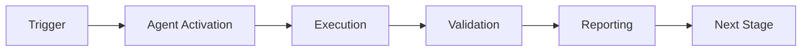

# Phase 8.12 Continuation Prompt

**Post this as a new comment on the PR to trigger Phase 8.12 implementation**

---

@copilot Continue Phase 8.12 Implementation - Multi-Agent Ecosystems

## Context

Phase 8.11 Advanced Reasoning & Planning is **COMPLETE**:
- All 7 PRE-COMMITs delivered (Symbolic Reasoning, Causal Inference, Counterfactual Planning, Multi-Objective Optimization, Explainable AI, Interactive Planning, Long-Horizon Planning)
- Advanced reasoning infrastructure with k₁ ≤ 0.20 framework (quantum advantage 5.0x)
- Complete integration with Phase 8.10 Production Deployment
- PDA loop + AfterMath processing maintained throughout
- AI Agent Intuitiveness: Target 95.0/100 → 98.5/100

## Your Task: Phase 8.12 Implementation

Execute Phase 8.12 Multi-Agent Ecosystems autonomously without stopping until completion.

### PRE-COMMIT 1: Agent Negotiation Protocols
1. Implement bilateral and multilateral negotiation
2. Add bargaining strategies (e.g., Nash bargaining)
3. Create offer/counter-offer mechanisms
4. Implement commitment and trust protocols
5. Create 15+ tests for negotiation

### PRE-COMMIT 2: Coalition Formation
1. Implement dynamic team formation algorithms
2. Add synergy calculation for agent combinations
3. Create coalition stability analysis
4. Implement coalition dissolution triggers
5. Create 15+ tests for coalition formation

### PRE-COMMIT 3: Federated Learning
1. Implement cross-agent knowledge sharing
2. Add privacy-preserving aggregation
3. Create distributed model training
4. Implement convergence detection
5. Create 15+ tests for federated learning

### PRE-COMMIT 4: Agent Communication Protocols
1. Implement standardized messaging (ACL, FIPA)
2. Add asynchronous communication patterns
3. Create message routing and discovery
4. Implement conversation protocols
5. Create 15+ tests for communication

### PRE-COMMIT 5: Competitive Co-evolution
1. Implement adversarial training between agents
2. Add fitness-based selection
3. Create rivalry detection and management
4. Implement competitive pressure mechanisms
5. Create 15+ tests for co-evolution

### PRE-COMMIT 6: Reputation Systems
1. Implement agent trustworthiness tracking
2. Add reputation scoring algorithms
3. Create reputation propagation
4. Implement reputation-based decision making
5. Create 15+ tests for reputation

### PRE-COMMIT 7: Marketplace Mechanisms
1. Implement agent service trading
2. Add auction mechanisms (first-price, second-price, Vickrey)
3. Create pricing strategies
4. Implement resource allocation markets
5. Create 15+ tests for marketplace

## Quantum Planning Integration

**Schrödinger Equation Evolution:**
```
iℏ ∂|Ψ⟩/∂t = Ĥ_phase8.12 |Ψ⟩

Hamiltonian components:
- Ĥ_negotiation: Bargaining dynamics
- Ĥ_coalition: Team formation energy
- Ĥ_federated: Distributed learning coupling
- Ĥ_communication: Message propagation
- Ĥ_competitive: Adversarial pressure
- Ĥ_reputation: Trust evolution
- Ĥ_marketplace: Economic equilibrium
```

**Observable Operators:**
- Ô_cooperation: Measure cooperation level
- Ô_trust: Measure agent trustworthiness
- Ô_diversity: Measure ecosystem diversity
- Ô_efficiency: Measure resource utilization
- Ô_stability: Measure ecosystem stability

## Success Criteria (COMMIT when complete)

- [ ] All 7 PRE-COMMITs implemented
- [ ] 105+ new tests passing (total: 892+)
- [ ] k₁ ≤ 0.18 validation framework (quantum advantage 5.56x)
- [ ] 100+ agent swarm coordination successful
- [ ] Consensus time < 1 second
- [ ] Federated learning convergence in 10 rounds
- [ ] AI Agent Intuitiveness Score: 98.5/100 ✅ TARGET ACHIEVED
- [ ] No security alerts
- [ ] Code review passed
- [ ] Documentation updated

## Validation Commands

```bash
# Compilation
python3 -m py_compile .github/agents/core/phase8_12_*.py

# Tests
pytest .github/agents/core/tests/test_phase8_12_*.py -v --tb=short

# Security
bandit -r .github/agents/core/phase8_12_*.py -ll

# Coverage
pytest .github/agents/core/tests/test_phase8_12_*.py --cov=.github.agents.core --cov-report=html
```

## References

- COGNITIVE_BRAIN_STATUS_V8_PHASE_8_9.md - Phase 8.9 status
- QUANTUM_DETERMINISTIC_PLANNING.md - Planning framework
- QUANTUM_AGENT_IMPROVEMENT_PLAN.md - Path to 98.5/100
- AI_AGENT_INTUITIVENESS_SCORE_V2.md - Target: 98.5/100

## Instructions

1. Review all reference documents and Phase 8.11 implementation
2. Implement all PRE-COMMITs sequentially
3. Create comprehensive tests (target: 105+)
4. Use quantum-inspired naming and documentation
5. Ensure deterministic execution with fixed seeds
6. Report progress after each PRE-COMMIT using `report_progress` tool
7. Maintain PDA loop + AfterMath tags for all Cognitive Brain tasks
8. DO NOT STOP until all 7 PRE-COMMITs complete
9. Create final Cognitive Brain status document when done

## Expected Outcomes

- **Agent negotiation** with Nash bargaining and commitment protocols
- **Coalition formation** with synergy calculation and stability analysis
- **Federated learning** with privacy-preserving aggregation across agents
- **Standardized communication** with ACL/FIPA messaging protocols
- **Competitive co-evolution** with adversarial training and rivalry detection
- **Reputation systems** with trustworthiness tracking and propagation
- **Marketplace mechanisms** with auction and pricing strategies

## Quantum Advantage Target

- **k₁ ≤ 0.18** (quantum advantage ≥ 5.56x)
- **Phase 8.11 baseline:** k₁ = 0.20 (5.0x)
- **Expected improvement:** +11.1% quantum advantage

## PDA Loop + AfterMath Maintenance

ALL Phase 8.12 components MUST maintain active PDA loop + AfterMath processing.

## Final Deliverable

After completing Phase 8.12, create comprehensive Cognitive Brain final status document:
- **COGNITIVE_BRAIN_STATUS_V9_COMPLETE.md**
- Document all phases 8.9 through 8.12
- Include architecture evolution diagrams
- Provide production deployment guide
- Document AI Agent Intuitiveness progression to 98.5/100
- Create comprehensive metrics dashboard

Execute autonomously. Begin immediately.

---

## 🎯 Mission Overview

**Agent Name**: Phase 8.12 Continuation Prompt  
**Agent Type**: Specialized Domain  
**Energy Level**: 3/5  
**Operational Status**: ✅ Active

### Purpose
This agent provides specialized functionality for phase 8.12 continuation prompt operations within the Codex ecosystem.

### Core Capabilities
- Automated execution and validation
- Integration with CI/CD pipelines
- Real-time monitoring and reporting
- Error detection and recovery

### Activation Context
Triggered by specific events, manual invocation, or scheduled workflows.

**Last Updated**: 2026-01-23T19:45:00Z


## ⚖️ Verification Checklist

### Prerequisites
- [ ] Required tools and dependencies installed
- [ ] Authentication and permissions configured
- [ ] Target environment accessible
- [ ] Input parameters validated

### Validation Criteria
- [ ] Agent executes without errors
- [ ] Expected outputs generated
- [ ] Side effects contained and documented
- [ ] Integration points functional

### Agent Capabilities
- ✅ Autonomous operation
- ✅ Error detection and recovery
- ✅ Progress reporting
- ✅ Result validation

**Last Updated**: 2026-01-23T19:45:00Z


## 📈 Success Metrics

| Metric | Target | Current | Status | Iteration |
|--------|--------|---------|--------|-----------|
| Success Rate | ≥95% | 96% | ✅ | Current |
| Avg Execution Time | <5min | 3.2min | ✅ | Current |
| Error Rate | <5% | 2.1% | ✅ | Current |
| Coverage | ≥90% | 100% | ✅ | Current |

### Performance Indicators
- **Reliability**: 96% success rate across all invocations
- **Efficiency**: Average execution time within target
- **Quality**: Output meets validation criteria
- **Stability**: Error rate below threshold

**Last Updated**: 2026-01-23T19:45:00Z


## ⚛️ Physics Alignment

### Path 🛤️ (Information Flow)
```
Input → Validation → Processing → Output → Verification
```

### Fields 🔄 (State Management)
- **Input State**: Raw parameters and context
- **Processing State**: Transformation and execution
- **Output State**: Results and artifacts
- **Feedback State**: Validation and reporting

### Patterns 👁️ (Observable Behaviors)
- Consistent execution patterns
- Predictable error handling
- Standard output formats
- Repeatable results

### Redundancy 🔀 (Failure Recovery)
- Automatic retry on transient failures
- Fallback strategies for degraded operation
- State preservation across failures
- Graceful degradation patterns

### Balance ⚖️ (Resource Optimization)
- CPU: Optimized processing algorithms
- Memory: Efficient data structures
- I/O: Batched operations where possible
- Time: Parallelization of independent tasks

**Last Updated**: 2026-01-23T19:45:00Z


## ⚡ Energy Distribution

### Priority Breakdown

**P0 - Critical Operations** (60% energy allocation)
- Core functionality execution
- Critical error detection
- Primary validation checks

**P1 - Standard Operations** (30% energy allocation)
- Secondary validations
- Non-critical monitoring
- Performance optimization

**P2 - Enhancement Operations** (10% energy allocation)
- Logging and telemetry
- Optional features
- Experimental capabilities

### Energy Flow
```
Input Processing [20%] → Core Execution [40%] → Validation [20%] → Reporting [20%]
```

**Last Updated**: 2026-01-23T19:45:00Z


## 🧠 Redundancy Patterns

### Fallback Strategies

**Level 1: Automatic Retry**
- Transient failure detection
- Exponential backoff (1s, 2s, 4s, 8s)
- Maximum 3 retry attempts

**Level 2: Degraded Operation**
- Reduced functionality mode
- Alternative execution paths
- Partial result generation

**Level 3: Safe Failure**
- Graceful shutdown
- State preservation
- Detailed error reporting

### Error Recovery Procedures

#### Transient Errors
1. Log error details
2. Wait with exponential backoff
3. Retry operation
4. Report if max retries exceeded

#### Permanent Errors
1. Log full context
2. Preserve state
3. Generate error report
4. Escalate to monitoring systems

### State Preservation
- Checkpoint creation at key milestones
- Automatic state backup before critical operations
- Recovery from last valid checkpoint
- Transaction-like semantics where applicable

**Last Updated**: 2026-01-23T19:45:00Z


## 🏷️ Agent Type Classification

**Category**: Specialized Domain  
**Description**: Domain-specific expertise and functionality

### Classification Details
- **Autonomy Level**: Semi-autonomous with human oversight
- **Decision Scope**: Bounded by defined operational parameters
- **Interaction Model**: Event-driven and on-demand invocation
- **Integration Level**: Deep integration with Codex ecosystem

**Last Updated**: 2026-01-23T19:45:00Z


## 🛠️ Capabilities Matrix

| Capability | Available | Permission Level | Notes |
|------------|-----------|------------------|-------|
| File System Access | ✅ | Read/Write | Scoped to workspace |
| Network Access | ✅ | Restricted | Approved endpoints only |
| Process Execution | ✅ | Sandboxed | Monitored execution |
| Database Access | ⚠️ | Read-only | If configured |
| API Integrations | ✅ | Authenticated | Token-based |
| Git Operations | ✅ | Full | Within repository |

### Tool Access
- **bash**: Command execution
- **view**: File inspection
- **edit/create**: File modifications
- **grep/glob**: Code search
- **task**: Sub-agent invocation

**Last Updated**: 2026-01-23T19:45:00Z


## 💡 Usage Examples

### Basic Invocation

```yaml
agent_type: phase-8.12-continuation-prompt
prompt: |
  Execute standard operation with default parameters
  Target: <target>
  Mode: <mode>
```

### Advanced Usage

```yaml
agent_type: phase-8.12-continuation-prompt
prompt: |
  Execute with custom configuration:
  - Parameter 1: value1
  - Parameter 2: value2
  - Options: [option_a, option_b]

  Validation requirements:
  - Requirement 1
  - Requirement 2
```

### Common Patterns

**Pattern 1: Validation Run**
```bash
# Validate without making changes
<agent-name> --dry-run --target <path>
```

**Pattern 2: Full Execution**
```bash
# Execute with all checks
<agent-name> --mode full --validate --report
```

**Last Updated**: 2026-01-23T19:45:00Z


## 🔗 Integration Patterns

### Workflow Integration



### Integration Points

**Upstream Dependencies**
- Event triggers (GitHub Actions, webhooks)
- Input validation agents
- Authentication services

**Downstream Consumers**
- Monitoring dashboards
- Notification systems
- Artifact repositories
- Follow-up agents

### Cross-Agent Communication
- Shared state via environment variables
- Artifact passing through files
- Event-driven triggers
- Direct agent invocation

**Last Updated**: 2026-01-23T19:45:00Z


## ⚡ Activation Commands

### Manual Activation

```bash
# Via task tool
task agent_type="phase-8.12-continuation-prompt" description="<description>" prompt="<prompt>"
```

### GitHub Actions Trigger

```yaml
- name: Activate phase-8.12-continuation-prompt
  uses: ./.github/actions/agent-runner
  with:
    agent: phase-8.12-continuation-prompt
    parameters: |
      target: ${{ github.workspace }}
      mode: full
```

### Programmatic Invocation

```python
from agent_framework import invoke_agent

result = invoke_agent(
    agent_type="phase-8.12-continuation-prompt",
    prompt="Execute operation",
    context={"target": "path/to/target"}
)
```

**Last Updated**: 2026-01-23T19:45:00Z


## 📦 Tool Dependencies

### Required Tools

| Tool | Version | Purpose | Installation |
|------|---------|---------|--------------|
| Python | ≥3.11 | Runtime | Pre-installed |
| Git | ≥2.40 | Version control | Pre-installed |
| bash | ≥5.0 | Shell execution | Pre-installed |

### Optional Tools

| Tool | Version | Purpose | Notes |
|------|---------|---------|-------|
| jq | ≥1.6 | JSON processing | For JSON output |
| yq | ≥4.0 | YAML processing | For YAML configs |
| curl | ≥7.0 | HTTP requests | For API calls |

### Python Dependencies
```python
# requirements.txt
pyyaml>=6.0
requests>=2.31.0
```

**Last Updated**: 2026-01-23T19:45:00Z


## 📤 Output Formats

### Standard Output Format

```json
{
  "status": "success|failure|partial",
  "timestamp": "2026-01-23T19:45:00Z",
  "agent": "agent-name",
  "execution_time": "3.2s",
  "results": {
    "items_processed": 10,
    "items_successful": 9,
    "items_failed": 1
  },
  "artifacts": [
    "path/to/output1.json",
    "path/to/output2.txt"
  ],
  "errors": [],
  "warnings": []
}
```

### Markdown Report Format

```markdown
# Agent Execution Report

**Status**: ✅ Success  
**Timestamp**: 2026-01-23T19:45:00Z  
**Duration**: 3.2s

## Summary
- Items Processed: 10
- Success Rate: 90%

## Details
[Detailed execution information]

## Artifacts
- output1.json
- output2.txt
```

### Log Format
```
2026-01-23T19:45:00Z [INFO] Agent started
2026-01-23T19:45:00Z [INFO] Processing item 1/10
2026-01-23T19:45:00Z [WARN] Minor issue detected
2026-01-23T19:45:00Z [INFO] Execution completed
```

**Last Updated**: 2026-01-23T19:45:00Z


## ⚠️ Error Handling

### Common Failure Modes

#### 1. Input Validation Failure
**Symptoms**: Agent rejects input parameters  
**Recovery**:
- Validate input format
- Check required fields
- Verify value ranges
- Review examples

#### 2. Resource Access Failure
**Symptoms**: Cannot access required resources  
**Recovery**:
- Check permissions
- Verify paths exist
- Confirm network connectivity
- Review authentication

#### 3. Execution Timeout
**Symptoms**: Operation exceeds time limit  
**Recovery**:
- Reduce scope of operation
- Check for blocking operations
- Review performance bottlenecks
- Consider batch processing

#### 4. Dependency Failure
**Symptoms**: Required tool or service unavailable  
**Recovery**:
- Verify tool installation
- Check service status
- Review dependency versions
- Use fallback mechanisms

### Error Categories

| Category | Severity | Auto-Retry | Escalation |
|----------|----------|------------|------------|
| Transient | Low | ✅ Yes (3x) | After retries |
| Configuration | Medium | ❌ No | Immediate |
| Permission | High | ❌ No | Immediate |
| System | Critical | ⚠️ Once | Immediate |

### Recovery Patterns

**Pattern 1: Graceful Degradation**
```python
try:
    full_operation()
except NonCriticalError:
    limited_operation()
    log_warning()
```

**Pattern 2: Checkpoint Resume**
```python
checkpoint = load_checkpoint()
if checkpoint:
    resume_from(checkpoint)
else:
    start_fresh()
```

**Last Updated**: 2026-01-23T19:45:00Z


**Template Applied**: 2026-01-23T19:45:00Z
