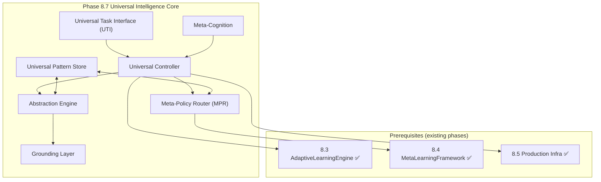

# Phase 8.7 Universal Intelligence Implementation Plan

> **Version:** 1.0.0  
> **Created:** Current Cycle-01-03  
> **Status:** Research → Implementation Ready  
> **Scope:** GitHub Copilot Pro+ and GitHub Team capabilities only

---

## 1. Executive Summary

Phase 8.7 implements **Universal Intelligence** capabilities with:
- **Baseline target:** k₁ ≤ 0.28 → quantum advantage ≈ 3.57x
- **Stretch target:** k₁ ≤ 0.255 (aspirational)
- **Constraint:** No paid add-ons, no external paid services

### Prerequisites (Verified ✅)
- Phase 8.3 Adaptive Learning ✅
- Phase 8.4 Transfer Learning ✅ (MetaLearningFramework, DynamicDomainDetector, CrossAgentKnowledgeSharing)
- Phase 8.5 Production Infra ✅
- Phase 8.6 Advanced Optimization 🟡 (skeleton)

---

## 2. Quantum-Physics-Inspired Formalism

These formulas are **operational math** for probabilistic strategy selection, uncertainty tracking, and transfer gating.

### 2.1 Strategy Superposition (Meta-Policy Router)

```
|ψ_strat⟩ = Σᵢ αᵢ |sᵢ⟩, where Σᵢ |αᵢ|² = 1
```

- sᵢ ∈ {MAML-path, Reptile-path, AdapterTransfer, Q-Transfer, RetrievalPolicy, ...}
- |αᵢ|² = seeded selection probability

**Measurement (decision time):**
```
Pr(sₖ) = |αₖ|²
```

### 2.2 Mixed Belief State (Domain Uncertainty)

```
ρ = Σⱼ pⱼ |φⱼ⟩⟨φⱼ|, where Tr(ρ) = 1
```

Update via measurement operator M:
```
ρ' = MρM† / Tr(MρM†)
```

### 2.3 Exploration-Exploitation Annealing

Energy function:
```
E(θ) = λ_err·L(θ) + λ_risk·R(θ) + λ_cost·C(θ)
```

Hamiltonian schedule:
```
H(t) = (1-β(t))·H_explore + β(t)·H_exploit
β(0) = 0, β(1) = 1
```

### 2.4 Negative Transfer as Decoherence

```
ρ → E(ρ), where E(ρ) = Σₖ EₖρEₖ†
```

Rising negative-transfer triggers domain isolation + rollback.

### 2.5 k₁ Definition

```
k₁ = 1 - avg(DecisionScore)
Advantage = 1/k₁
```

---

## 3. Component Specifications

### 3.1 Universal Task Interface (UTI)

**Purpose:** Standard interface for any computable environment μ

**Input JSON:**
```json
{
  "environment": "string",
  "initial_state": {"any": "json"},
  "reward_spec": {"id": "reward:v1", "params": {}},
  "termination": {"max_steps": 1000, "criteria": {}},
  "seed": 12345
}
```

**Output JSON:**
```json
{
  "action_sequence": ["..."],
  "cumulative_reward": 123.45,
  "V_mu_pi": 0.72,
  "metrics": {"accuracy": 0.90, "steps": 441, "coherence": 0.84}
}
```

### 3.2 Meta-Policy Router (MPR)

**Purpose:** Dynamic algorithm selection using strategy superposition

**Input/Output JSON:**
```json
{
  "task_features": {
    "domain_signature": "hash_or_embedding",
    "complexity": {"obs_dim": 128, "action_dim": 12, "horizon": 500},
    "similarity_topk": [{"domain": "gridworld_v2", "score": 0.87}],
    "risk": {"neg_transfer_prob": 0.12, "forgetting_risk": 0.08}
  },
  "selected_algorithm": "reptile|maml|adapter_transfer|q_transfer|retrieval_policy",
  "hyperparams": {"meta_lr": 0.001, "inner_lr": 0.01, "inner_steps": 5},
  "adaptation_budget": 10
}
```

### 3.3 Abstraction Engine

**Purpose:** Hierarchical concept/relation extraction + analogy transfer

**Output JSON:**
```json
{
  "abstractions": [{"id": "concept:permission_gate", "props": {"binary": true}, "support": 331}],
  "relations": [["concept:permission_gate", "enables", "concept:workflow_transition"]],
  "analogies": [{"src": "gridworld", "tgt": "workflow_dag", "mapping": {"door": "permission_gate"}}],
  "confidence": 0.78
}
```

### 3.4 Grounding Layer

**Purpose:** Map abstractions to feasible, validated actions

**I/O JSON:**
```json
{
  "abstract_plan": {"steps": [{"op": "request_review", "target": "PR#123"}]},
  "grounded_actions": [{"adapter": "github_api_mock", "op": "request_reviewers", "args": {}}],
  "feasibility_score": 0.93,
  "execution_trace": [{"t": "Current Cycle-01-03T02:10:00Z", "status": "ok"}]
}
```

### 3.5 Meta-Cognition

**Purpose:** Self-awareness, confidence/uncertainty monitoring

**I/O JSON:**
```json
{
  "self_assessment": {"known_domains": 12, "unknown_domains": 3},
  "confidence_levels": {"router": 0.81, "analogy": 0.62, "grounding": 0.90},
  "recommended_actions": [{"type": "collect_data", "budget": 5}, {"type": "isolate_domain"}]
}
```

### 3.6 Universal Pattern Store (UPS)

**Purpose:** Cross-domain pattern repository for zero-shot transfer

**I/O JSON:**
```json
{
  "query": "permission gate pattern",
  "retrieved_patterns": [{"id": "pat:perm_gate:v3", "payload": {}}],
  "relevance_scores": [0.91]
}
```

---

## 4. Architecture Diagram



---

## 5. File Structure (Proposed)

```
.github/agents/
├── cognitive-brain-agent/
│   ├── agent/
│   │   ├── universal_interface.py      # NEW (~200 lines)
│   │   ├── meta_policy_router.py       # NEW (~250 lines)
│   │   ├── abstraction_engine.py       # NEW (~300 lines)
│   │   ├── grounding_layer.py          # NEW (~200 lines)
│   │   ├── meta_cognition.py           # NEW (~250 lines)
│   │   └── universal_store.py          # NEW (~300 lines)
│   └── tests/
│       └── test_universal_intelligence.py  # NEW (≥35 tests)
└── core/
    ├── universal_intelligence.py       # NEW (~600 lines)
    └── tests/
        └── test_universal_intelligence.py  # NEW
```

---

## 6. PR Implementation Slices

### PR1: UTI + JSON Schemas + Deterministic Tests
- Universal Task Interface
- Schema validation
- Deterministic execution with seeds

### PR2: Meta-Policy Router
- Strategy superposition |ψ_strat⟩
- Seeded measurement/collapse
- Algorithm selection

### PR3: Abstraction Engine
- ConceptGraph construction
- Relation mapping
- Golden snapshots for regression

### PR4: Grounding Layer
- Feasibility mapping
- Trace replay
- Hash comparison

### PR5: Universal Pattern Store
- Pattern CRUD
- Retrieval scoring
- Transfer evaluation

### PR6: Safety + Negative Transfer Gates
- Rollback triggers
- Domain isolation
- Hard safety constraints

### PR7: Universal Controller + EXP-10
- Orchestrator integration
- Metrics artifacts
- Benchmark harness

---

## 7. CI Strategy (Minute-Safe)

### Tier-0 (Every Push, <5 min)
- Lint + unit tests
- Deterministic micro-integration

### Tier-1 (Daily, <30 min)
- Full suite
- Lightweight benchmarks

### Tier-2 (Local Only, >60 min)
- Heavy meta-meta-learning sweeps
- Emergence discovery experiments

---

## 8. Metrics & Evidence

### 8.1 Operational Definitions

| Metric | Definition | Target |
|--------|------------|--------|
| k₁ | 1 - avg(DecisionScore) | ≤ 0.28 |
| Zero-shot transfer | Held-out accuracy without training | >60% |
| Few-shot (K=10) | Accuracy after 10 examples | >80% |
| Concept reuse | % concepts reused across domains | >70% |
| Negative transfer | Degradation threshold | <5% |
| Forgetting | Source task accuracy drop | <20% |

### 8.2 Artifact Storage

```
.github/agents/metrics/phase8_7/
├── k1_metrics.jsonl
├── transfer_metrics.jsonl
├── emergence_events.jsonl
└── confidence_calibration.jsonl
```

**Schema:**
```json
{
  "metric": "k1|zero_shot|few_shot_k10|neg_transfer|forgetting|emergence_count",
  "value": 0.123,
  "timestamp": "Current Cycle-01-03T02:30:00Z",
  "evidence": {"run_id": "run:...", "seed": 12345, "task_id": "task:..."}
}
```

---

## 9. Risk Controls

### 9.1 Negative Transfer Rollback
- **Trigger:** neg_transfer_rate > 0.05
- **Action:** Domain isolation + rollback to last good baseline

### 9.2 Catastrophic Forgetting
- **Trigger:** source_accuracy_drop > 0.20
- **Action:** Fail CI gate

### 9.3 Safety Constraints
- Hard-coded non-overridable bounds in `agi_safety.py`
- Exploration disabled in CI

---

## 10. Variable Mapping for Phase 8.7

Reference: [QUANTUM_VARIABLE_INTELLIGENCE.md](./QUANTUM_VARIABLE_INTELLIGENCE.md)

| Component | Key Variables | Source |
|-----------|--------------|--------|
| UTI | seed, environment, reward_spec | New |
| MPR | alpha (amplitudes), epsilon, learning_rate | Categories 1, 4 |
| Abstraction | entropy, coherence, correlation | Categories 3, 10 |
| Grounding | potential_energy, kinetic_energy, feasibility | Category 8 |
| Meta-Cognition | confidence, risk, uncertainty | Categories 3, 7 |
| UPS | patterns, similarity_score, retrieval_k | New |
| Controller | k1, temperature, beta (annealing) | Categories 3, 9 |

---

## 11. Follow-Up Prompt

```
@copilot Implement Phase 8.7 in mergeable PR slices:

PR1: UTI + JSON schemas + deterministic tests
PR2: Meta-Policy Router (|ψ_strat⟩ + seeded measurement) + tests
PR3: Abstraction Engine (ConceptGraph + golden snapshots) + tests
PR4: Grounding Layer (feasibility + trace replay) + tests
PR5: Universal Pattern Store (retrieval eval) + tests
PR6: Safety + negative transfer rollback gates + tests
PR7: Orchestrator + exp10_validation metrics artifacts

Constraints:
- GitHub Copilot Pro+ + GitHub Team only.
- Reuse Phase 8.3/8.4/8.5 systems already in the repo.
- CI Tier-0 must remain minute-safe and deterministic.
- All outputs must be serializable and regression-testable.
```

---

*Document generated for Aries-Serpent/_codex_ Repository*
*Phase 8.7 Universal Intelligence Research → Implementation*
