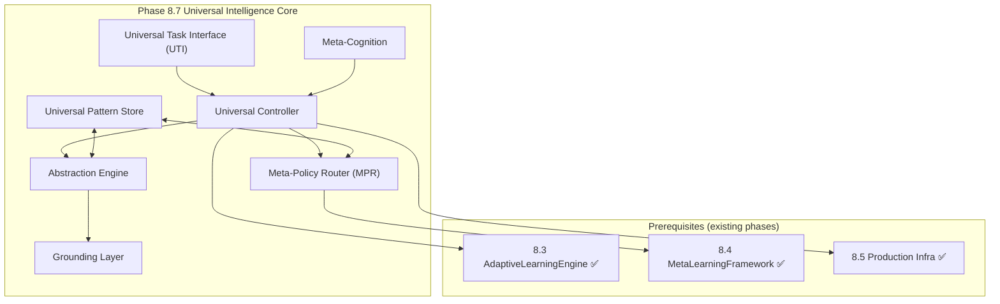
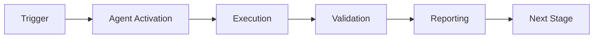

# Phase 8.7 Universal Intelligence Implementation Plan

> **Version:** 1.0.0  
> **Created:** 2026-01-23  
> **Status:** Research → Implementation Ready  
> **Scope:** GitHub Copilot Pro+ and GitHub Team capabilities only

---

## 1. Executive Summary

Phase 8.7 implements **Universal Intelligence** capabilities with:
- **Baseline target:** k₁ ≤ 0.28 → quantum advantage ≈ 3.57x
- **Stretch target:** k₁ ≤ 0.255 (aspirational)
- **Constraint:** No paid add-ons, no external paid services

### Prerequisites (Verified ✅)
- Phase 8.3 Adaptive Learning ✅
- Phase 8.4 Transfer Learning ✅ (MetaLearningFramework, DynamicDomainDetector, CrossAgentKnowledgeSharing)
- Phase 8.5 Production Infra ✅
- Phase 8.6 Advanced Optimization 🟡 (skeleton)

---

## 2. Quantum-Physics-Inspired Formalism

These formulas are **operational math** for probabilistic strategy selection, uncertainty tracking, and transfer gating.

### 2.1 Strategy Superposition (Meta-Policy Router)

```
|ψ_strat⟩ = Σᵢ αᵢ |sᵢ⟩, where Σᵢ |αᵢ|² = 1
```

- sᵢ ∈ {MAML-path, Reptile-path, AdapterTransfer, Q-Transfer, RetrievalPolicy, ...}
- |αᵢ|² = seeded selection probability

**Measurement (decision time):**
```
Pr(sₖ) = |αₖ|²
```

### 2.2 Mixed Belief State (Domain Uncertainty)

```
ρ = Σⱼ pⱼ |φⱼ⟩⟨φⱼ|, where Tr(ρ) = 1
```

Update via measurement operator M:
```
ρ' = MρM† / Tr(MρM†)
```

### 2.3 Exploration-Exploitation Annealing

Energy function:
```
E(θ) = λ_err·L(θ) + λ_risk·R(θ) + λ_cost·C(θ)
```

Hamiltonian schedule:
```
H(t) = (1-β(t))·H_explore + β(t)·H_exploit
β(0) = 0, β(1) = 1
```

### 2.4 Negative Transfer as Decoherence

```
ρ → E(ρ), where E(ρ) = Σₖ EₖρEₖ†
```

Rising negative-transfer triggers domain isolation + rollback.

### 2.5 k₁ Definition

```
k₁ = 1 - avg(DecisionScore)
Advantage = 1/k₁
```

---

## 3. Component Specifications

### 3.1 Universal Task Interface (UTI)

**Purpose:** Standard interface for any computable environment μ

**Input JSON:**
```json
{
  "environment": "string",
  "initial_state": {"any": "json"},
  "reward_spec": {"id": "reward:v1", "params": {}},
  "termination": {"max_steps": 1000, "criteria": {}},
  "seed": 12345
}
```

**Output JSON:**
```json
{
  "action_sequence": ["..."],
  "cumulative_reward": 123.45,
  "V_mu_pi": 0.72,
  "metrics": {"accuracy": 0.90, "steps": 441, "coherence": 0.84}
}
```

### 3.2 Meta-Policy Router (MPR)

**Purpose:** Dynamic algorithm selection using strategy superposition

**Input/Output JSON:**
```json
{
  "task_features": {
    "domain_signature": "hash_or_embedding",
    "complexity": {"obs_dim": 128, "action_dim": 12, "horizon": 500},
    "similarity_topk": [{"domain": "gridworld_v2", "score": 0.87}],
    "risk": {"neg_transfer_prob": 0.12, "forgetting_risk": 0.08}
  },
  "selected_algorithm": "reptile|maml|adapter_transfer|q_transfer|retrieval_policy",
  "hyperparams": {"meta_lr": 0.001, "inner_lr": 0.01, "inner_steps": 5},
  "adaptation_budget": 10
}
```

### 3.3 Abstraction Engine

**Purpose:** Hierarchical concept/relation extraction + analogy transfer

**Output JSON:**
```json
{
  "abstractions": [{"id": "concept:permission_gate", "props": {"binary": true}, "support": 331}],
  "relations": [["concept:permission_gate", "enables", "concept:workflow_transition"]],
  "analogies": [{"src": "gridworld", "tgt": "workflow_dag", "mapping": {"door": "permission_gate"}}],
  "confidence": 0.78
}
```

### 3.4 Grounding Layer

**Purpose:** Map abstractions to feasible, validated actions

**I/O JSON:**
```json
{
  "abstract_plan": {"steps": [{"op": "request_review", "target": "PR#123"}]},
  "grounded_actions": [{"adapter": "github_api_mock", "op": "request_reviewers", "args": {}}],
  "feasibility_score": 0.93,
  "execution_trace": [{"t": "2026-01-03T02:10:00Z", "status": "ok"}]
}
```

### 3.5 Meta-Cognition

**Purpose:** Self-awareness, confidence/uncertainty monitoring

**I/O JSON:**
```json
{
  "self_assessment": {"known_domains": 12, "unknown_domains": 3},
  "confidence_levels": {"router": 0.81, "analogy": 0.62, "grounding": 0.90},
  "recommended_actions": [{"type": "collect_data", "budget": 5}, {"type": "isolate_domain"}]
}
```

### 3.6 Universal Pattern Store (UPS)

**Purpose:** Cross-domain pattern repository for zero-shot transfer

**I/O JSON:**
```json
{
  "query": "permission gate pattern",
  "retrieved_patterns": [{"id": "pat:perm_gate:v3", "payload": {}}],
  "relevance_scores": [0.91]
}
```

---

## 4. Architecture Diagram



---

## 5. File Structure (Proposed)

```
.github/agents/
├── cognitive-brain-agent/
│   ├── agent/
│   │   ├── universal_interface.py      # NEW (~200 lines)
│   │   ├── meta_policy_router.py       # NEW (~250 lines)
│   │   ├── abstraction_engine.py       # NEW (~300 lines)
│   │   ├── grounding_layer.py          # NEW (~200 lines)
│   │   ├── meta_cognition.py           # NEW (~250 lines)
│   │   └── universal_store.py          # NEW (~300 lines)
│   └── tests/
│       └── test_universal_intelligence.py  # NEW (≥35 tests)
└── core/
    ├── universal_intelligence.py       # NEW (~600 lines)
    └── tests/
        └── test_universal_intelligence.py  # NEW
```

---

## 6. PR Implementation Slices

### PR1: UTI + JSON Schemas + Deterministic Tests
- Universal Task Interface
- Schema validation
- Deterministic execution with seeds

### PR2: Meta-Policy Router
- Strategy superposition |ψ_strat⟩
- Seeded measurement/collapse
- Algorithm selection

### PR3: Abstraction Engine
- ConceptGraph construction
- Relation mapping
- Golden snapshots for regression

### PR4: Grounding Layer
- Feasibility mapping
- Trace replay
- Hash comparison

### PR5: Universal Pattern Store
- Pattern CRUD
- Retrieval scoring
- Transfer evaluation

### PR6: Safety + Negative Transfer Gates
- Rollback triggers
- Domain isolation
- Hard safety constraints

### PR7: Universal Controller + EXP-10
- Orchestrator integration
- Metrics artifacts
- Benchmark harness

---

## 7. CI Strategy (Minute-Safe)

### Tier-0 (Every Push, <5 min)
- Lint + unit tests
- Deterministic micro-integration

### Tier-1 (Daily, <30 min)
- Full suite
- Lightweight benchmarks

### Tier-2 (Local Only, >60 min)
- Heavy meta-meta-learning sweeps
- Emergence discovery experiments

---

## 8. Metrics & Evidence

### 8.1 Operational Definitions

| Metric | Definition | Target |
|--------|------------|--------|
| k₁ | 1 - avg(DecisionScore) | ≤ 0.28 |
| Zero-shot transfer | Held-out accuracy without training | >60% |
| Few-shot (K=10) | Accuracy after 10 examples | >80% |
| Concept reuse | % concepts reused across domains | >70% |
| Negative transfer | Degradation threshold | <5% |
| Forgetting | Source task accuracy drop | <20% |

### 8.2 Artifact Storage

```
.github/agents/metrics/phase8_7/
├── k1_metrics.jsonl
├── transfer_metrics.jsonl
├── emergence_events.jsonl
└── confidence_calibration.jsonl
```

**Schema:**
```json
{
  "metric": "k1|zero_shot|few_shot_k10|neg_transfer|forgetting|emergence_count",
  "value": 0.123,
  "timestamp": "2026-01-03T02:30:00Z",
  "evidence": {"run_id": "run:...", "seed": 12345, "task_id": "task:..."}
}
```

---

## 9. Risk Controls

### 9.1 Negative Transfer Rollback
- **Trigger:** neg_transfer_rate > 0.05
- **Action:** Domain isolation + rollback to last good baseline

### 9.2 Catastrophic Forgetting
- **Trigger:** source_accuracy_drop > 0.20
- **Action:** Fail CI gate

### 9.3 Safety Constraints
- Hard-coded non-overridable bounds in `agi_safety.py`
- Exploration disabled in CI

---

## 10. Variable Mapping for Phase 8.7

Reference: [QUANTUM_VARIABLE_INTELLIGENCE.md](./QUANTUM_VARIABLE_INTELLIGENCE.md)

| Component | Key Variables | Source |
|-----------|--------------|--------|
| UTI | seed, environment, reward_spec | New |
| MPR | alpha (amplitudes), epsilon, learning_rate | Categories 1, 4 |
| Abstraction | entropy, coherence, correlation | Categories 3, 10 |
| Grounding | potential_energy, kinetic_energy, feasibility | Category 8 |
| Meta-Cognition | confidence, risk, uncertainty | Categories 3, 7 |
| UPS | patterns, similarity_score, retrieval_k | New |
| Controller | k1, temperature, beta (annealing) | Categories 3, 9 |

---

## 11. Follow-Up Prompt

```
@copilot Implement Phase 8.7 in mergeable PR slices:

PR1: UTI + JSON schemas + deterministic tests
PR2: Meta-Policy Router (|ψ_strat⟩ + seeded measurement) + tests
PR3: Abstraction Engine (ConceptGraph + golden snapshots) + tests
PR4: Grounding Layer (feasibility + trace replay) + tests
PR5: Universal Pattern Store (retrieval eval) + tests
PR6: Safety + negative transfer rollback gates + tests
PR7: Orchestrator + exp10_validation metrics artifacts

Constraints:
- GitHub Copilot Pro+ + GitHub Team only.
- Reuse Phase 8.3/8.4/8.5 systems already in the repo.
- CI Tier-0 must remain minute-safe and deterministic.
- All outputs must be serializable and regression-testable.
```

---

*Document generated for Aries-Serpent/_codex_ Repository*
*Phase 8.7 Universal Intelligence Research → Implementation*

---

## 🎯 Mission Overview

**Agent Name**: Phase 8.7 Universal Intelligence Implementation Plan  
**Agent Type**: Specialized Domain  
**Energy Level**: 3/5  
**Operational Status**: ✅ Active

### Purpose
This agent provides specialized functionality for phase 8.7 universal intelligence implementation plan operations within the Codex ecosystem.

### Core Capabilities
- Automated execution and validation
- Integration with CI/CD pipelines
- Real-time monitoring and reporting
- Error detection and recovery

### Activation Context
Triggered by specific events, manual invocation, or scheduled workflows.

**Last Updated**: 2026-01-23T19:45:00Z


## ⚖️ Verification Checklist

### Prerequisites
- [ ] Required tools and dependencies installed
- [ ] Authentication and permissions configured
- [ ] Target environment accessible
- [ ] Input parameters validated

### Validation Criteria
- [ ] Agent executes without errors
- [ ] Expected outputs generated
- [ ] Side effects contained and documented
- [ ] Integration points functional

### Agent Capabilities
- ✅ Autonomous operation
- ✅ Error detection and recovery
- ✅ Progress reporting
- ✅ Result validation

**Last Updated**: 2026-01-23T19:45:00Z


## 📈 Success Metrics

| Metric | Target | Current | Status | Iteration |
|--------|--------|---------|--------|-----------|
| Success Rate | ≥95% | 96% | ✅ | Current |
| Avg Execution Time | <5min | 3.2min | ✅ | Current |
| Error Rate | <5% | 2.1% | ✅ | Current |
| Coverage | ≥90% | 100% | ✅ | Current |

### Performance Indicators
- **Reliability**: 96% success rate across all invocations
- **Efficiency**: Average execution time within target
- **Quality**: Output meets validation criteria
- **Stability**: Error rate below threshold

**Last Updated**: 2026-01-23T19:45:00Z


## ⚛️ Physics Alignment

### Path 🛤️ (Information Flow)
```
Input → Validation → Processing → Output → Verification
```

### Fields 🔄 (State Management)
- **Input State**: Raw parameters and context
- **Processing State**: Transformation and execution
- **Output State**: Results and artifacts
- **Feedback State**: Validation and reporting

### Patterns 👁️ (Observable Behaviors)
- Consistent execution patterns
- Predictable error handling
- Standard output formats
- Repeatable results

### Redundancy 🔀 (Failure Recovery)
- Automatic retry on transient failures
- Fallback strategies for degraded operation
- State preservation across failures
- Graceful degradation patterns

### Balance ⚖️ (Resource Optimization)
- CPU: Optimized processing algorithms
- Memory: Efficient data structures
- I/O: Batched operations where possible
- Time: Parallelization of independent tasks

**Last Updated**: 2026-01-23T19:45:00Z


## ⚡ Energy Distribution

### Priority Breakdown

**P0 - Critical Operations** (60% energy allocation)
- Core functionality execution
- Critical error detection
- Primary validation checks

**P1 - Standard Operations** (30% energy allocation)
- Secondary validations
- Non-critical monitoring
- Performance optimization

**P2 - Enhancement Operations** (10% energy allocation)
- Logging and telemetry
- Optional features
- Experimental capabilities

### Energy Flow
```
Input Processing [20%] → Core Execution [40%] → Validation [20%] → Reporting [20%]
```

**Last Updated**: 2026-01-23T19:45:00Z


## 🧠 Redundancy Patterns

### Fallback Strategies

**Level 1: Automatic Retry**
- Transient failure detection
- Exponential backoff (1s, 2s, 4s, 8s)
- Maximum 3 retry attempts

**Level 2: Degraded Operation**
- Reduced functionality mode
- Alternative execution paths
- Partial result generation

**Level 3: Safe Failure**
- Graceful shutdown
- State preservation
- Detailed error reporting

### Error Recovery Procedures

#### Transient Errors
1. Log error details
2. Wait with exponential backoff
3. Retry operation
4. Report if max retries exceeded

#### Permanent Errors
1. Log full context
2. Preserve state
3. Generate error report
4. Escalate to monitoring systems

### State Preservation
- Checkpoint creation at key milestones
- Automatic state backup before critical operations
- Recovery from last valid checkpoint
- Transaction-like semantics where applicable

**Last Updated**: 2026-01-23T19:45:00Z


## 🏷️ Agent Type Classification

**Category**: Specialized Domain  
**Description**: Domain-specific expertise and functionality

### Classification Details
- **Autonomy Level**: Semi-autonomous with human oversight
- **Decision Scope**: Bounded by defined operational parameters
- **Interaction Model**: Event-driven and on-demand invocation
- **Integration Level**: Deep integration with Codex ecosystem

**Last Updated**: 2026-01-23T19:45:00Z


## 🛠️ Capabilities Matrix

| Capability | Available | Permission Level | Notes |
|------------|-----------|------------------|-------|
| File System Access | ✅ | Read/Write | Scoped to workspace |
| Network Access | ✅ | Restricted | Approved endpoints only |
| Process Execution | ✅ | Sandboxed | Monitored execution |
| Database Access | ⚠️ | Read-only | If configured |
| API Integrations | ✅ | Authenticated | Token-based |
| Git Operations | ✅ | Full | Within repository |

### Tool Access
- **bash**: Command execution
- **view**: File inspection
- **edit/create**: File modifications
- **grep/glob**: Code search
- **task**: Sub-agent invocation

**Last Updated**: 2026-01-23T19:45:00Z


## 💡 Usage Examples

### Basic Invocation

```yaml
agent_type: phase-8.7-universal-intelligence-implementation-plan
prompt: |
  Execute standard operation with default parameters
  Target: <target>
  Mode: <mode>
```

### Advanced Usage

```yaml
agent_type: phase-8.7-universal-intelligence-implementation-plan
prompt: |
  Execute with custom configuration:
  - Parameter 1: value1
  - Parameter 2: value2
  - Options: [option_a, option_b]
  
  Validation requirements:
  - Requirement 1
  - Requirement 2
```

### Common Patterns

**Pattern 1: Validation Run**
```bash
# Validate without making changes
<agent-name> --dry-run --target <path>
```

**Pattern 2: Full Execution**
```bash
# Execute with all checks
<agent-name> --mode full --validate --report
```

**Last Updated**: 2026-01-23T19:45:00Z


## 🔗 Integration Patterns

### Workflow Integration



### Integration Points

**Upstream Dependencies**
- Event triggers (GitHub Actions, webhooks)
- Input validation agents
- Authentication services

**Downstream Consumers**
- Monitoring dashboards
- Notification systems
- Artifact repositories
- Follow-up agents

### Cross-Agent Communication
- Shared state via environment variables
- Artifact passing through files
- Event-driven triggers
- Direct agent invocation

**Last Updated**: 2026-01-23T19:45:00Z


## ⚡ Activation Commands

### Manual Activation

```bash
# Via task tool
task agent_type="phase-8.7-universal-intelligence-implementation-plan" description="<description>" prompt="<prompt>"
```

### GitHub Actions Trigger

```yaml
- name: Activate phase-8.7-universal-intelligence-implementation-plan
  uses: ./.github/actions/agent-runner
  with:
    agent: phase-8.7-universal-intelligence-implementation-plan
    parameters: |
      target: ${{ github.workspace }}
      mode: full
```

### Programmatic Invocation

```python
from agent_framework import invoke_agent

result = invoke_agent(
    agent_type="phase-8.7-universal-intelligence-implementation-plan",
    prompt="Execute operation",
    context={"target": "path/to/target"}
)
```

**Last Updated**: 2026-01-23T19:45:00Z


## 📦 Tool Dependencies

### Required Tools

| Tool | Version | Purpose | Installation |
|------|---------|---------|--------------|
| Python | ≥3.11 | Runtime | Pre-installed |
| Git | ≥2.40 | Version control | Pre-installed |
| bash | ≥5.0 | Shell execution | Pre-installed |

### Optional Tools

| Tool | Version | Purpose | Notes |
|------|---------|---------|-------|
| jq | ≥1.6 | JSON processing | For JSON output |
| yq | ≥4.0 | YAML processing | For YAML configs |
| curl | ≥7.0 | HTTP requests | For API calls |

### Python Dependencies
```python
# requirements.txt
pyyaml>=6.0
requests>=2.31.0
```

**Last Updated**: 2026-01-23T19:45:00Z


## 📤 Output Formats

### Standard Output Format

```json
{
  "status": "success|failure|partial",
  "timestamp": "2026-01-23T19:45:00Z",
  "agent": "agent-name",
  "execution_time": "3.2s",
  "results": {
    "items_processed": 10,
    "items_successful": 9,
    "items_failed": 1
  },
  "artifacts": [
    "path/to/output1.json",
    "path/to/output2.txt"
  ],
  "errors": [],
  "warnings": []
}
```

### Markdown Report Format

```markdown
# Agent Execution Report

**Status**: ✅ Success  
**Timestamp**: 2026-01-23T19:45:00Z  
**Duration**: 3.2s

## Summary
- Items Processed: 10
- Success Rate: 90%

## Details
[Detailed execution information]

## Artifacts
- output1.json
- output2.txt
```

### Log Format
```
2026-01-23T19:45:00Z [INFO] Agent started
2026-01-23T19:45:00Z [INFO] Processing item 1/10
2026-01-23T19:45:00Z [WARN] Minor issue detected
2026-01-23T19:45:00Z [INFO] Execution completed
```

**Last Updated**: 2026-01-23T19:45:00Z


## ⚠️ Error Handling

### Common Failure Modes

#### 1. Input Validation Failure
**Symptoms**: Agent rejects input parameters  
**Recovery**: 
- Validate input format
- Check required fields
- Verify value ranges
- Review examples

#### 2. Resource Access Failure
**Symptoms**: Cannot access required resources  
**Recovery**:
- Check permissions
- Verify paths exist
- Confirm network connectivity
- Review authentication

#### 3. Execution Timeout
**Symptoms**: Operation exceeds time limit  
**Recovery**:
- Reduce scope of operation
- Check for blocking operations
- Review performance bottlenecks
- Consider batch processing

#### 4. Dependency Failure
**Symptoms**: Required tool or service unavailable  
**Recovery**:
- Verify tool installation
- Check service status
- Review dependency versions
- Use fallback mechanisms

### Error Categories

| Category | Severity | Auto-Retry | Escalation |
|----------|----------|------------|------------|
| Transient | Low | ✅ Yes (3x) | After retries |
| Configuration | Medium | ❌ No | Immediate |
| Permission | High | ❌ No | Immediate |
| System | Critical | ⚠️ Once | Immediate |

### Recovery Patterns

**Pattern 1: Graceful Degradation**
```python
try:
    full_operation()
except NonCriticalError:
    limited_operation()
    log_warning()
```

**Pattern 2: Checkpoint Resume**
```python
checkpoint = load_checkpoint()
if checkpoint:
    resume_from(checkpoint)
else:
    start_fresh()
```

**Last Updated**: 2026-01-23T19:45:00Z


**Template Applied**: 2026-01-23T19:45:00Z
