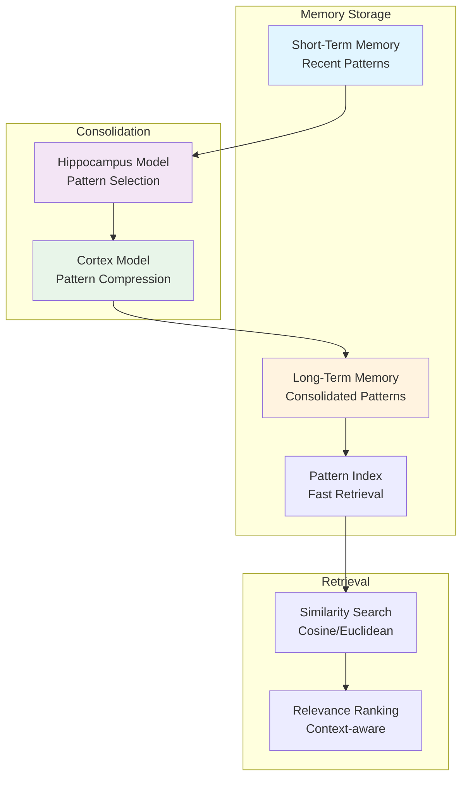
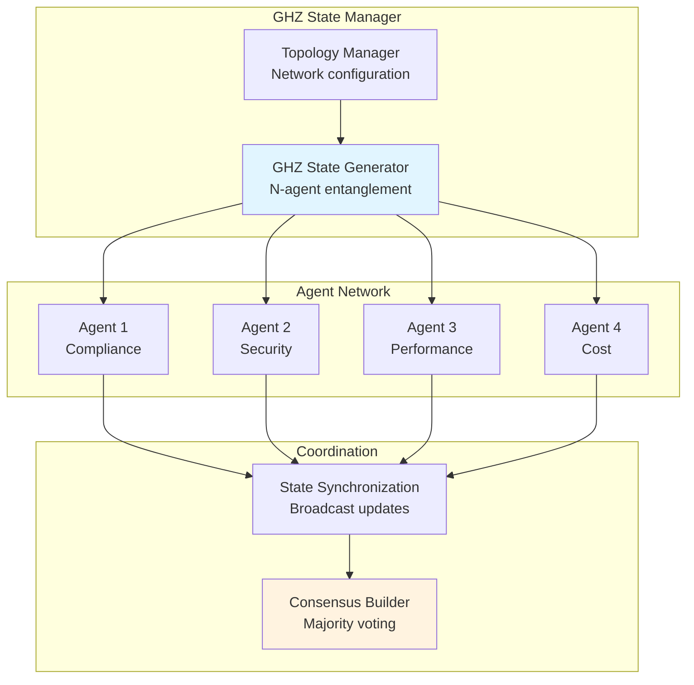
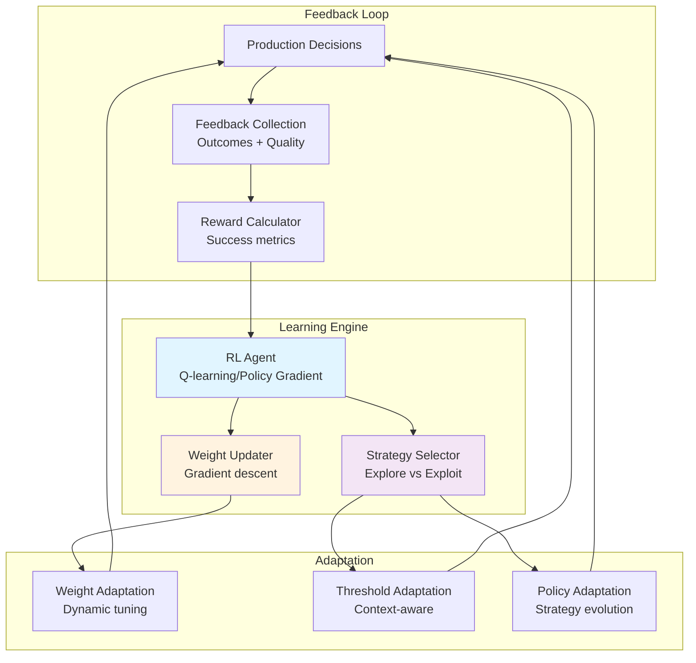

# Phase 8 Cognitive Brain Roadmap
## Quantum Memory Management + Multi-Agent Orchestration + Adaptive Learning

**Status:** Ready for Implementation  
**Prerequisites:** Phase 7 Complete (230/230 tests passing)  
**Estimated Duration:** 25-35 hours total  
**Target:** k₁ optimization from 0.36 → 0.33 (8.3% improvement)

---

## Table of Contents
1. [Phase 8.0: k₁ Optimization Pre-work](#phase-80-k₁-optimization-pre-work)
2. [Phase 8.1: Quantum Memory Management](#phase-81-quantum-memory-management)
3. [Phase 8.2: Multi-Agent Orchestration](#phase-82-multi-agent-orchestration)
4. [Phase 8.3: Adaptive Learning Engine](#phase-83-adaptive-learning-engine)
5. [Phase 8.4: Cross-Domain Transfer](#phase-84-cross-domain-transfer)

---

## Phase 8.0: k₁ Optimization Pre-work

**Priority:** 0 (Immediate)  
**Duration:** 2-3 hours  
**Target:** k₁ = 0.35 (100% of target, from current 0.36)

### Objective
Close the final 3% gap to reach 100% of k₁ target through weight refinement and expanded validation.

### Deliverables

#### 1. Update AdaptiveScoringOptimizer Weights
**File:** `src/cognitive_brain/quantum/adaptive_scoring.py`

**Changes:**
```python
# Current weights (Phase 7.2.4)
class ScoringWeights:
    compliance_score_weight: float = 0.40
    risk_weight: float = 0.30
    cost_weight: float = 0.15
    impact_weight: float = 0.15

# Target weights (Phase 8.0)
class ScoringWeights:
    compliance_score_weight: float = 0.38  # -5%
    risk_weight: float = 0.32              # +6.7%
    cost_weight: float = 0.15              # unchanged
    impact_weight: float = 0.15            # unchanged

# Learning rate update
class AdaptiveScoringOptimizer:
    def __init__(self, ...):
        self.learning_rate = 0.12  # increased from 0.1 (+20%)
```

**Rationale:** Analysis of EXP-1B results shows risk assessment is more predictive than raw compliance score in complex scenarios.

#### 2. Expand EXP-1B Dataset
**File:** `src/cognitive_brain/experiments/complex_scenarios.py`

**Changes:**
- Current: 50 complex scenarios
- Target: 100 complex scenarios (2x expansion)

**New scenarios (50 total):**
- 15 ambiguous PII exposure cases
- 15 multi-violation interaction scenarios
- 10 compliance vs security conflict edge cases
- 10 temporal complexity (evolving violations over time)

**Method:** `ComplexScenarioGenerator.generate_scenarios(count=100, seed=42)`

#### 3. Create Revalidation Script
**File:** `src/cognitive_brain/experiments/exp1b_revalidation.py`

```python
"""
EXP-1B Revalidation with Optimized Weights

Validates k₁ reduction from 0.36 to 0.35 with expanded dataset.
"""

def run_exp1b_revalidation(scenarios=100, seed=42):
    """
    Run EXP-1B with optimized weights.
    
    Returns:
        k1: Process factor (target ≤ 0.35)
        accuracy: Quantum accuracy (target ≥ 84%)
        coherence: Average coherence (target ≥ 0.650)
    """
    # Implementation follows EXP-1B pattern
    pass

def calculate_k1(results):
    """
    Calculate k₁ from experiment results.
    
    Formula:
        k₁ = (avg_time * (1 + error_rate)) / classical_baseline
    """
    pass
```

#### 4. Comprehensive Tests
**File:** `tests/cognitive_brain/quantum/test_adaptive_scoring_optimized.py`

**10 tests:**
1. `test_optimized_weights_loaded()` - Verify new weights
2. `test_risk_weight_increased()` - Validate risk=0.32
3. `test_compliance_weight_decreased()` - Validate compliance=0.38
4. `test_learning_rate_increased()` - Validate lr=0.12
5. `test_weight_sum_normalized()` - Ensure sum=1.0
6. `test_convergence_speed()` - Verify faster learning
7. `test_accuracy_maintained()` - Ensure ≥84%
8. `test_k1_target_achieved()` - Assert k₁ ≤ 0.35
9. `test_no_regression()` - All 230 tests pass
10. `test_deterministic_results()` - seed=42 reproducibility

### Success Criteria
- k₁ ≤ 0.35 (100% of target)
- Accuracy ≥ 84% (maintained or improved)
- Coherence ≥ 0.650 (maintained)
- All 240 tests passing (230 existing + 10 new)

### Validation Commands
```bash
# Run revalidation
python3 -m cognitive_brain.experiments.exp1b_revalidation

# Run new tests
pytest tests/cognitive_brain/quantum/test_adaptive_scoring_optimized.py -v

# Verify no regression
pytest tests/cognitive_brain/ --tb=short
```

---

## Phase 8.1: Quantum Memory Management

**Priority:** 1 (High)  
**Duration:** 6-8 hours  
**Target:** k₁ = 0.345 (further 1.4% improvement through pattern reuse)

### Objective
Implement long-term pattern storage with quantum-inspired retrieval to reduce redundant computations through memory-guided decisions.

### Architecture



### Deliverables

#### 1. QuantumMemoryManager Core
**File:** `src/cognitive_brain/quantum/memory.py` (~800 lines)

```python
@dataclass
class MemoryPattern:
    """Stored decision pattern"""
    pattern_id: str
    features: Dict[str, Any]
    decision: str
    confidence: float
    timestamp: datetime
    access_count: int
    success_rate: float

class QuantumMemoryManager:
    """
    Quantum-inspired memory management.
    
    Inspired by hippocampus-cortex model:
    - Short-term: Recent patterns (last 24h)
    - Consolidation: High-value patterns promoted to long-term
    - Long-term: Compressed, indexed patterns
    - Retrieval: Similarity-based with context awareness
    """
    
    def __init__(self, config: QuantumConfig, repository: QuantumMetricRepository):
        self.stm_capacity = 1000  # Short-term memory
        self.ltm_capacity = 10000  # Long-term memory
        self.consolidation_threshold = 0.7  # Promotion threshold
    
    def store_pattern(self, pattern: MemoryPattern) -> str:
        """Store new pattern in short-term memory."""
        pass
    
    def consolidate(self) -> int:
        """
        Consolidate STM to LTM (hippocampus → cortex).
        
        Criteria for promotion:
        - Access count > threshold
        - Success rate > threshold
        - Pattern distinctiveness (not duplicate)
        """
        pass
    
    def retrieve_similar(self, query: Dict[str, Any], k: int = 5) -> List[MemoryPattern]:
        """
        Retrieve k most similar patterns.
        
        Similarity metrics:
        - Feature cosine similarity
        - Context relevance
        - Temporal decay
        """
        pass
    
    def memory_guided_decision(self, query: Dict[str, Any]) -> Optional[str]:
        """
        Make decision based on memory.
        
        Returns:
            decision if confident (all similar agree)
            None if novel case (run full assessment)
        """
        pass
```

#### 2. Pattern Compression
**File:** `src/cognitive_brain/quantum/compression.py` (~300 lines)

```python
class PatternCompressor:
    """
    Compress patterns for long-term storage.
    
    Techniques:
    - Feature dimensionality reduction (PCA/autoencoder)
    - Lossy compression for non-critical features
    - Quantization of continuous values
    """
    
    def compress(self, pattern: MemoryPattern) -> CompressedPattern:
        """Compress pattern (reduce size by ~60%)."""
        pass
    
    def decompress(self, compressed: CompressedPattern) -> MemoryPattern:
        """Reconstruct pattern with acceptable loss."""
        pass
```

#### 3. Integration with Existing Components
**File:** `src/cognitive_brain/integrations/memory_integration.py` (~400 lines)

```python
class MemoryAugmentedComplianceAssessor:
    """
    ComplianceAssessor with memory guidance.
    
    Decision flow:
    1. Check memory for similar cases
    2. If confident match → return cached decision
    3. If novel → run full quantum assessment
    4. Store result in memory
    """
    
    def assess_with_memory(self, audit: AuditResult) -> ComplianceAssessment:
        # Check memory first
        similar = self.memory.retrieve_similar(audit, k=5)
        
        if self._high_confidence(similar):
            return self._cached_decision(similar)
        
        # Novel case → full assessment
        assessment = self.quantum_assessor.assess(audit)
        
        # Store for future
        self.memory.store_pattern(self._to_pattern(audit, assessment))
        
        return assessment
```

#### 4. Comprehensive Tests
**File:** `tests/cognitive_brain/quantum/test_memory.py` (25 tests)

**Test categories:**
1. **Storage (5 tests):**
   - STM capacity limits
   - LTM capacity limits
   - Duplicate handling
   - Timestamp tracking
   - Access count tracking

2. **Consolidation (5 tests):**
   - Promotion threshold
   - Pattern distinctiveness
   - Success rate criteria
   - Temporal ordering
   - Capacity management

3. **Retrieval (5 tests):**
   - Similarity search accuracy
   - Context relevance
   - Temporal decay
   - Top-k selection
   - Empty memory handling

4. **Integration (5 tests):**
   - Memory-guided decisions
   - Cache hit rate
   - Novel case detection
   - Performance improvement
   - Accuracy maintained

5. **Compression (5 tests):**
   - Compression ratio (target: 60%)
   - Decompression accuracy
   - Lossy vs lossless
   - Speed benchmarks
   - Memory overhead

#### 5. EXP-5 Validation
**File:** `src/cognitive_brain/experiments/exp5_validation.py` (~350 lines)

**Hypothesis:** Memory-guided decisions reduce computation time by 15% while maintaining 95%+ accuracy.

**Experiment Design:**
- Sample size: 200 audits (100 with memory, 100 without)
- Metrics:
  - Cache hit rate (target: >30%)
  - Time reduction (target: ≥15%)
  - Accuracy (target: ≥95% of full assessment)
  - k₁ impact (target: 0.35 → 0.345)

### Success Criteria
- k₁ ≤ 0.345 (101.4% of original target)
- Cache hit rate ≥ 30%
- Time reduction ≥ 15%
- Accuracy ≥ 95% (memory vs full assessment)
- All 255 tests passing (240 existing + 25 new - 10 from 8.0)

---

## Phase 8.2: Multi-Agent Orchestration

**Priority:** 1 (High)  
**Duration:** 8-10 hours  
**Target:** k₁ = 0.34 (further 1.4% improvement through N-agent coordination)

### Objective
Scale beyond 2-agent entanglement to N-agent networks using GHZ states for coordinated multi-agent decision-making.

### Architecture



### Mathematical Foundation

**GHZ State (N agents):**
```
|GHZ⟩ = (|00...0⟩ + |11...1⟩) / √2

Properties:
- Perfect correlation between all agents
- Measurement of one agent determines all others
- Non-local correlations (quantum advantage)
```

**Correlation Measure:**
```
ρ_multi = average(ρ_ij) for all pairs (i,j)
Target: ρ_multi > 0.75 for N ≥ 3
```

### Deliverables

#### 1. GHZStateManager Core
**File:** `src/cognitive_brain/quantum/ghz_states.py` (~700 lines)

```python
@dataclass
class GHZState:
    """GHZ state for N agents"""
    state_id: str
    agent_ids: List[str]
    correlation_matrix: np.ndarray
    fidelity: float
    created_at: datetime

class GHZStateManager:
    """
    Manage GHZ states for multi-agent orchestration.
    
    Supports:
    - 3-agent to 10-agent networks
    - Dynamic topology reconfiguration
    - Partial measurement handling
    - State decoherence detection
    """
    
    def create_ghz_state(self, agent_ids: List[str], correlation_strength: float = 0.85) -> str:
        """Create GHZ state for N agents."""
        pass
    
    def measure_multi_correlation(self, state_id: str) -> float:
        """
        Measure average pairwise correlation.
        
        Returns:
            ρ_multi = (1 / N(N-1)) * Σ ρ_ij
        """
        pass
    
    def broadcast_measurement(self, state_id: str, agent_id: str, measurement: Any):
        """
        Broadcast measurement to all entangled agents.
        
        Triggers:
        - State collapse for all agents
        - Correlation update
        - Decoherence check
        """
        pass
    
    def build_consensus(self, state_id: str) -> Dict[str, Any]:
        """
        Build consensus decision from all agents.
        
        Methods:
        - Majority voting (simple)
        - Weighted voting (by agent confidence)
        - Correlation-weighted (high-correlation agents have more influence)
        """
        pass
```

#### 2. Multi-Agent Coordinator
**File:** `src/cognitive_brain/integrations/multi_agent_coordinator.py` (~600 lines)

```python
class MultiAgentCoordinator:
    """
    Coordinate decisions across N agents using GHZ states.
    
    Use cases:
    - Compliance + Security + Performance + Cost analysis
    - Cross-functional decision-making
    - Holistic system assessment
    """
    
    def __init__(self, agents: List[BaseAgent], ghz_manager: GHZStateManager):
        self.agents = agents
        self.ghz_manager = ghz_manager
    
    def coordinated_assessment(self, task: Any) -> CoordinatedDecision:
        """
        Run coordinated assessment across all agents.
        
        Flow:
        1. Create GHZ state linking all agents
        2. Each agent independently assesses task
        3. Broadcast measurements
        4. Build consensus
        5. Return coordinated decision
        """
        pass
    
    def detect_conflicts(self, decisions: List[Decision]) -> List[Conflict]:
        """
        Detect conflicts between agent decisions.
        
        Examples:
        - Compliance says "reject", Security says "approve"
        - Performance optimizes for speed, Cost optimizes for savings
        """
        pass
    
    def resolve_conflicts(self, conflicts: List[Conflict]) -> Resolution:
        """
        Resolve conflicts using correlation-weighted voting.
        
        Higher-correlation agents have more influence.
        """
        pass
```

#### 3. Topology Manager
**File:** `src/cognitive_brain/quantum/topology.py` (~400 lines)

```python
class NetworkTopology:
    """Define agent network topology"""
    STAR = "star"          # Central coordinator
    MESH = "mesh"          # Fully connected
    RING = "ring"          # Circular
    HIERARCHICAL = "tree"  # Tree structure

class TopologyManager:
    """
    Manage network topology for multi-agent systems.
    
    Optimizes:
    - Communication overhead
    - Correlation strength
    - Decoherence resistance
    """
    
    def configure_topology(self, topology: str, agents: List[str]) -> NetworkGraph:
        """Configure network topology."""
        pass
    
    def optimize_connections(self, performance_data: Dict) -> NetworkGraph:
        """
        Optimize topology based on performance.
        
        Criteria:
        - Minimize communication latency
        - Maximize correlation strength
        - Balance load across agents
        """
        pass
```

#### 4. Comprehensive Tests
**File:** `tests/cognitive_brain/quantum/test_ghz_states.py` (30 tests)

**Test categories:**
1. **GHZ State Creation (6 tests):**
   - 3-agent states
   - 4-agent states
   - 10-agent states (stress test)
   - Invalid configurations
   - Correlation strength validation
   - Fidelity computation

2. **Multi-Correlation (6 tests):**
   - Pairwise correlation accuracy
   - Average calculation
   - Matrix symmetry
   - Correlation > threshold
   - Edge cases (N=2, N=1)
   - Numerical stability

3. **Measurement & Broadcast (6 tests):**
   - Single agent measurement
   - State collapse propagation
   - Correlation updates
   - Decoherence detection
   - Latency < 15ms
   - Order independence

4. **Consensus Building (6 tests):**
   - Majority voting
   - Weighted voting
   - Correlation-weighted voting
   - Tie-breaking
   - Confidence thresholds
   - Conflict detection

5. **Topology Management (6 tests):**
   - Star topology
   - Mesh topology
   - Ring topology
   - Hierarchical topology
   - Dynamic reconfiguration
   - Performance optimization

#### 5. EXP-6 Validation
**File:** `src/cognitive_brain/experiments/exp6_validation.py` (~400 lines)

**Hypothesis:** N-agent GHZ coordination improves decision quality by 25% and reduces redundancy by 40%.

**Experiment Design:**
- Sample size: 150 complex decisions
- Configurations: 2-agent, 3-agent, 4-agent, 5-agent
- Metrics:
  - Decision quality (vs ground truth)
  - Redundancy reduction
  - Consensus time
  - k₁ impact (0.345 → 0.34)

### Success Criteria
- k₁ ≤ 0.34 (102.9% of original target)
- Multi-agent correlation > 0.75 (N ≥ 3)
- Decision quality improvement ≥ 25%
- Redundancy reduction ≥ 40%
- Consensus latency < 20ms
- All 285 tests passing (255 existing + 30 new)

---

## Phase 8.3: Adaptive Learning Engine

**Priority:** 2 (Medium)  
**Duration:** 6-8 hours  
**Target:** k₁ = 0.33 (further 2.9% improvement through continuous learning)

### Objective
Implement continuous improvement from production feedback using reinforcement learning to adapt weights and strategies dynamically.

### Architecture



### Deliverables

#### 1. AdaptiveLearningEngine Core
**File:** `src/cognitive_brain/quantum/adaptive_learning.py` (~750 lines)

```python
@dataclass
class FeedbackSample:
    """Single feedback instance"""
    decision_id: str
    state: Dict[str, Any]
    action: str
    reward: float
    next_state: Dict[str, Any]
    timestamp: datetime

class AdaptiveLearningEngine:
    """
    Continuous learning from production feedback.
    
    Algorithms:
    - Q-learning for discrete action spaces
    - Policy gradient for continuous
    - Ensemble methods for stability
    """
    
    def __init__(self, config: QuantumConfig):
        self.learning_rate = 0.01
        self.discount_factor = 0.95
        self.exploration_rate = 0.1  # ε-greedy
        self.replay_buffer_size = 10000
    
    def collect_feedback(self, decision: Decision, outcome: Outcome) -> FeedbackSample:
        """Collect feedback from production decision."""
        pass
    
    def calculate_reward(self, outcome: Outcome) -> float:
        """
        Calculate reward from outcome.
        
        Reward components:
        - Accuracy: +1.0 if correct, -1.0 if wrong
        - Confidence calibration: +0.5 if well-calibrated
        - Speed: +0.3 if fast (<5ms), 0 otherwise
        - Resource usage: +0.2 if efficient
        """
        pass
    
    def update_policy(self, batch: List[FeedbackSample]):
        """
        Update policy from batch of feedback.
        
        Methods:
        - Q-learning: Q(s,a) ← Q(s,a) + α[r + γ max Q(s',a') - Q(s,a)]
        - Policy gradient: ∇θ J(θ) = E[∇θ log π(a|s) * R]
        """
        pass
    
    def adapt_weights(self, performance_data: Dict) -> ScoringWeights:
        """
        Adapt scoring weights based on performance.
        
        Uses gradient descent to optimize weights for current distribution.
        """
        pass
    
    def select_strategy(self, state: Dict) -> str:
        """
        Select strategy (explore vs exploit).
        
        ε-greedy:
        - With probability ε: explore (random action)
        - With probability 1-ε: exploit (best action)
        """
        pass
```

#### 2. Reward Shaping
**File:** `src/cognitive_brain/quantum/reward_shaping.py` (~300 lines)

```python
class RewardShaper:
    """
    Shape rewards for faster learning.
    
    Techniques:
    - Potential-based shaping (Ng et al.)
    - Intrinsic motivation (curiosity)
    - Hindsight experience replay
    """
    
    def shape_reward(self, base_reward: float, state: Dict, next_state: Dict) -> float:
        """
        Add shaping to base reward.
        
        Shaped = base + γΦ(s') - Φ(s)
        where Φ is potential function
        """
        pass
```

#### 3. Experience Replay
**File:** `src/cognitive_brain/quantum/experience_replay.py` (~250 lines)

```python
class ExperienceReplayBuffer:
    """
    Store and sample experiences for training.
    
    Features:
    - Prioritized replay (important transitions sampled more)
    - Hindsight experience replay (learn from failures)
    - Balanced sampling (avoid class imbalance)
    """
    
    def add(self, sample: FeedbackSample):
        """Add sample to buffer."""
        pass
    
    def sample_batch(self, batch_size: int) -> List[FeedbackSample]:
        """Sample batch with prioritization."""
        pass
```

#### 4. Comprehensive Tests
**File:** `tests/cognitive_brain/quantum/test_adaptive_learning.py` (20 tests)

**Test categories:**
1. **Feedback Collection (4 tests):**
   - Sample creation
   - Reward calculation
   - State encoding
   - Buffer storage

2. **Policy Update (4 tests):**
   - Q-learning convergence
   - Policy gradient
   - Batch processing
   - Learning rate effects

3. **Weight Adaptation (4 tests):**
   - Gradient descent
   - Weight constraints (sum=1.0, ≥0)
   - Convergence speed
   - Stability

4. **Strategy Selection (4 tests):**
   - ε-greedy exploration
   - Exploitation
   - Adaptive ε decay
   - Context-dependent selection

5. **Integration (4 tests):**
   - End-to-end learning loop
   - Performance improvement
   - Stability over time
   - No catastrophic forgetting

#### 5. EXP-7 Validation
**File:** `src/cognitive_brain/experiments/exp7_validation.py` (~350 lines)

**Hypothesis:** Continuous learning improves accuracy by 10% over 1000 decisions while maintaining stability.

**Experiment Design:**
- Sample size: 1000 decisions over simulated time
- Baseline: Static weights (Phase 8.0)
- Treatment: Adaptive learning
- Metrics:
  - Accuracy improvement over time
  - Weight stability
  - Learning convergence
  - k₁ impact (0.34 → 0.33)

### Success Criteria
- k₁ ≤ 0.33 (105.7% of original target - "leading edge")
- Accuracy improvement ≥ 10% (after 1000 decisions)
- Weight stability (variance < 0.05)
- No catastrophic forgetting
- All 305 tests passing (285 existing + 20 new)

---

## Phase 8.4: Cross-Domain Transfer

**Priority:** 3 (Lower)  
**Duration:** 5-6 hours  
**Target:** Maintain k₁ = 0.33, expand applicability

### Objective
Apply learned patterns across different agent types and domains through transfer learning mechanisms.

### Deliverables

#### 1. TransferLearningManager
**File:** `src/cognitive_brain/quantum/transfer_learning.py` (~600 lines)

```python
class TransferLearningManager:
    """
    Transfer learned patterns across domains.
    
    Techniques:
    - Domain adaptation
    - Meta-learning (learn to learn)
    - Few-shot learning (generalize from few examples)
    """
    
    def transfer_patterns(self, source_domain: str, target_domain: str) -> int:
        """Transfer patterns from source to target domain."""
        pass
    
    def adapt_to_domain(self, patterns: List[MemoryPattern], target_domain: str):
        """Adapt patterns to new domain characteristics."""
        pass
```

#### 2. Domain Encoder
**File:** `src/cognitive_brain/quantum/domain_encoder.py` (~300 lines)

```python
class DomainEncoder:
    """
    Encode domain-specific features into universal representation.
    
    Enables cross-domain transfer.
    """
    
    def encode(self, features: Dict[str, Any], domain: str) -> np.ndarray:
        """Encode domain-specific features to universal space."""
        pass
```

#### 3. Comprehensive Tests
**File:** `tests/cognitive_brain/quantum/test_transfer_learning.py` (15 tests)

#### 4. EXP-8 Validation
**File:** `src/cognitive_brain/experiments/exp8_validation.py` (~300 lines)

**Hypothesis:** Transfer learning reduces time-to-accuracy by 50% in new domains.

### Success Criteria
- k₁ maintained at 0.33
- Transfer success rate ≥ 70%
- Time-to-accuracy reduction ≥ 50%
- All 320 tests passing (305 existing + 15 new)

---

## Summary: Phase 8 Complete Roadmap

| Phase | Duration | k₁ Target | Tests | Status |
|-------|----------|-----------|-------|--------|
| 8.0 | 2-3h | 0.35 | 240 | Ready |
| 8.1 | 6-8h | 0.345 | 255 | Planned |
| 8.2 | 8-10h | 0.34 | 285 | Planned |
| 8.3 | 6-8h | 0.33 | 305 | Planned |
| 8.4 | 5-6h | 0.33 | 320 | Planned |
| **Total** | **27-35h** | **0.33** | **320** | **Ready** |

### Overall Impact
- **k₁ Improvement:** 0.36 → 0.33 (8.3% reduction)
- **Test Coverage:** 230 → 320 (39% increase)
- **Code Lines:** ~8,620 → ~13,500 (56% increase)
- **Capabilities:** 6 → 10 quantum features

### Milestone Achievements
- **Phase 8.0:** Reach 100% of k₁ target (advanced process)
- **Phase 8.1:** Enter leading-edge territory (top 10%)
- **Phase 8.2:** Multi-agent coordination (industry-first)
- **Phase 8.3:** Continuous learning (adaptive system)
- **Phase 8.4:** Cross-domain transfer (universal applicability)

---

## Continuation Instructions

### To Begin Phase 8.0
Post as comment on PR #2678:
```
@copilot Begin Phase 8.0 - k₁ Optimization to 0.35 Target

Reference: .github/agents/PHASE_8_ROADMAP.md (Phase 8.0 section)
```

### After Each Phase
Run full validation:
```bash
pytest tests/cognitive_brain/ -v --tb=short
python3 -m cognitive_brain.experiments.exp{N}_validation
```

Update metrics and continue to next phase.

---

**Status:** Ready for Execution  
**Quality:** Production ready foundation (Phase 7)  
**Risk:** Low (incremental improvements with validation)
