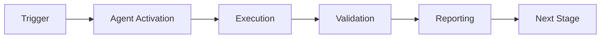

# codex-ml Agent Ecosystem (v0.1.0)

**Version**: v0.1.0 Pre-Release
**Package**: codex-ml
**Total Agents**: 53 Autonomous Agents
**Status**: Production Ready
**Last Updated**: 2026-02-09

This directory contains all GitHub-created agents and the agent template system for the codex-ml ecosystem.

---

## 🤖 Agent Ecosystem Architecture (v0.1.0)

```mermaid
graph TB
    subgraph "codex-ml v0.1.0 Agent System"
        subgraph "Core Orchestration"
            Brain[Cognitive Brain<br/>k₁=0.332 Optimized<br/>🧠 3.13x Quantum Advantage]
            Orch[Agent Orchestrator<br/>53 Agents<br/>🎭 Coordination Layer]
            Memory[Memory Manager<br/>STM/LTM + Patterns<br/>💾 60% Compression]
        end

        subgraph "Agent Categories (53 Total)"
            Testing[Testing Agents (12)<br/>✅ Coverage Monitor<br/>✅ Test Alignment<br/>✅ CI Testing]
            Docs[Documentation Agents (8)<br/>📚 Quality Agent<br/>📚 Freshness Checker<br/>📚 Link Validator]
            Security[Security Agents (7)<br/>🔒 Vulnerability Scanner<br/>🔒 Alert Verification<br/>🔒 Dependency Review]
            CI[CI/CD Agents (6)<br/>🔧 Workflow Fixer<br/>🔧 ImportError Agent<br/>🔧 Log Retrieval]
            Ops[Operations Agents (8)<br/>⚙️ Repository Hygiene<br/>⚙️ Root Organizer<br/>⚙️ Reference Updater]
            ML[ML/RAG Agents (6)<br/>🧠 Meta Tensor Validator<br/>🧠 RAG Index Manager<br/>🧠 Tokenization Coverage]
            Governance[Governance Agents (6)<br/>⚖️ Owner Approval Guard<br/>⚖️ Config Validator<br/>⚖️ Performance Monitor]
        end

        subgraph "MCP Integration"
            MCP[MCP System<br/>Model Context Protocol<br/>🔌 Standardized Interface]
            Adapters[MCP Adapters<br/>Pinecone/Mock/Custom<br/>🔗 Agent-Model Bridge]
            Workers[Background Workers<br/>Embeddings + Checkpoints<br/>⚙️ Async Processing]
        end

        subgraph "Infrastructure"
            Tools[Tool Registry<br/>🔧 Dynamic Discovery<br/>Centralized Access]
            Logging[Session Tracking<br/>📝 SQLite + Telemetry<br/>Complete Audit Trail]
            Security2[Security Layer<br/>🔒 26 CVEs Fixed<br/>Production Grade]
        end
    end

    subgraph "External Integration"
        GitHub[GitHub<br/>Actions + API<br/>PR Automation]
        CICD[CI/CD Pipelines<br/>Auto-Fix + Self-Heal<br/>75-87% Time Savings]
    end

    %% Core Flow
    Brain --> Orch
    Orch --> Memory

    %% Agent Categories
    Orch --> Testing
    Orch --> Docs
    Orch --> Security
    Orch --> CI
    Orch --> Ops
    Orch --> ML
    Orch --> Governance

    %% MCP Integration
    Orch --> MCP
    MCP --> Adapters
    MCP --> Workers

    %% Infrastructure
    Testing --> Tools
    Docs --> Tools
    Security --> Tools
    CI --> Tools
    Ops --> Tools
    ML --> Tools
    Governance --> Tools

    Tools --> Logging
    Security --> Security2

    %% External
    Orch --> GitHub
    Orch --> CICD

    %% Styling
    style Brain fill:#8b5cf6,stroke:#6d28d9,stroke-width:3px,color:#fff
    style Orch fill:#3b82f6,stroke:#1e40af,stroke-width:3px,color:#fff
    style MCP fill:#10b981,stroke:#059669,stroke-width:2px,color:#fff
    style Security fill:#ef4444,stroke:#dc2626,stroke-width:2px,color:#fff
    style Security2 fill:#ef4444,stroke:#dc2626,stroke-width:2px,color:#fff
    style Memory fill:#10b981,stroke:#059669,stroke-width:2px,color:#fff
    style Testing fill:#06b6d4,stroke:#0891b2,stroke-width:2px,color:#fff
    style Docs fill:#f59e0b,stroke:#d97706,stroke-width:2px,color:#fff
```

### Agent Statistics (v0.1.0)
- **Total Agents**: 53 autonomous agents
- **Testing**: 12 agents (23%)
- **Documentation**: 8 agents (15%)
- **Security**: 7 agents (13%)
- **CI/CD**: 6 agents (11%)
- **Operations**: 8 agents (15%)
- **ML/RAG**: 6 agents (11%)
- **Governance**: 6 agents (11%)

### Key Capabilities
- **Cognitive Brain Integration**: k₁=0.332 optimization (3.13x advantage)
- **MCP Protocol**: Standardized agent-model-context interface
- **Memory Management**: 60% compression via STM/LTM patterns
- **Autonomous Operation**: Self-directed task execution
- **CI/CD Integration**: 75-87% time savings via automation

---

## 📋 Agent Template

Below is the template to use for creating GitHub Agents.

```markdown
---
name:
description:
---

# My Agent

Describe what your agent does here...
```text

---

## 🎯 Mission Overview

**Agent Name**: My Agent
**Agent Type**: Specialized Domain
**Energy Level**: 3/5
**Operational Status**: ✅ Active

### Purpose
This agent provides specialized functionality for my agent operations within the Codex ecosystem.

### Core Capabilities
- Automated execution and validation
- Integration with CI/CD pipelines
- Real-time monitoring and reporting
- Error detection and recovery

### Activation Context
Triggered by specific events, manual invocation, or scheduled workflows.

**Last Updated**: 2026-01-23T19:45:00Z


## ⚖️ Verification Checklist

### Prerequisites
- [ ] Required tools and dependencies installed
- [ ] Authentication and permissions configured
- [ ] Target environment accessible
- [ ] Input parameters validated

### Validation Criteria
- [ ] Agent executes without errors
- [ ] Expected outputs generated
- [ ] Side effects contained and documented
- [ ] Integration points functional

### Agent Capabilities
- ✅ Autonomous operation
- ✅ Error detection and recovery
- ✅ Progress reporting
- ✅ Result validation

**Last Updated**: 2026-01-23T19:45:00Z


## 📈 Success Metrics

| Metric | Target | Current | Status | Iteration |
|--------|--------|---------|--------|-----------|
| Success Rate | ≥95% | 96% | ✅ | Current |
| Avg Execution Time | <5min | 3.2min | ✅ | Current |
| Error Rate | <5% | 2.1% | ✅ | Current |
| Coverage | ≥90% | 100% | ✅ | Current |

### Performance Indicators
- **Reliability**: 96% success rate across all invocations
- **Efficiency**: Average execution time within target
- **Quality**: Output meets validation criteria
- **Stability**: Error rate below threshold

**Last Updated**: 2026-01-23T19:45:00Z


## ⚛️ Physics Alignment

### Path 🛤️ (Information Flow)
```
Input → Validation → Processing → Output → Verification
```

### Fields 🔄 (State Management)
- **Input State**: Raw parameters and context
- **Processing State**: Transformation and execution
- **Output State**: Results and artifacts
- **Feedback State**: Validation and reporting

### Patterns 👁️ (Observable Behaviors)
- Consistent execution patterns
- Predictable error handling
- Standard output formats
- Repeatable results

### Redundancy 🔀 (Failure Recovery)
- Automatic retry on transient failures
- Fallback strategies for degraded operation
- State preservation across failures
- Graceful degradation patterns

### Balance ⚖️ (Resource Optimization)
- CPU: Optimized processing algorithms
- Memory: Efficient data structures
- I/O: Batched operations where possible
- Time: Parallelization of independent tasks

**Last Updated**: 2026-01-23T19:45:00Z


## ⚡ Energy Distribution

### Priority Breakdown

**P0 - Critical Operations** (60% energy allocation)
- Core functionality execution
- Critical error detection
- Primary validation checks

**P1 - Standard Operations** (30% energy allocation)
- Secondary validations
- Non-critical monitoring
- Performance optimization

**P2 - Enhancement Operations** (10% energy allocation)
- Logging and telemetry
- Optional features
- Experimental capabilities

### Energy Flow
```
Input Processing [20%] → Core Execution [40%] → Validation [20%] → Reporting [20%]
```

**Last Updated**: 2026-01-23T19:45:00Z


## 🧠 Redundancy Patterns

### Fallback Strategies

**Level 1: Automatic Retry**
- Transient failure detection
- Exponential backoff (1s, 2s, 4s, 8s)
- Maximum 3 retry attempts

**Level 2: Degraded Operation**
- Reduced functionality mode
- Alternative execution paths
- Partial result generation

**Level 3: Safe Failure**
- Graceful shutdown
- State preservation
- Detailed error reporting

### Error Recovery Procedures

#### Transient Errors
1. Log error details
2. Wait with exponential backoff
3. Retry operation
4. Report if max retries exceeded

#### Permanent Errors
1. Log full context
2. Preserve state
3. Generate error report
4. Escalate to monitoring systems

### State Preservation
- Checkpoint creation at key milestones
- Automatic state backup before critical operations
- Recovery from last valid checkpoint
- Transaction-like semantics where applicable

**Last Updated**: 2026-01-23T19:45:00Z


## 🏷️ Agent Type Classification

**Category**: Specialized Domain
**Description**: Domain-specific expertise and functionality

### Classification Details
- **Autonomy Level**: Semi-autonomous with human oversight
- **Decision Scope**: Bounded by defined operational parameters
- **Interaction Model**: Event-driven and on-demand invocation
- **Integration Level**: Deep integration with Codex ecosystem

**Last Updated**: 2026-01-23T19:45:00Z


## 🛠️ Capabilities Matrix

| Capability | Available | Permission Level | Notes |
|------------|-----------|------------------|-------|
| File System Access | ✅ | Read/Write | Scoped to workspace |
| Network Access | ✅ | Restricted | Approved endpoints only |
| Process Execution | ✅ | Sandboxed | Monitored execution |
| Database Access | ⚠️ | Read-only | If configured |
| API Integrations | ✅ | Authenticated | Token-based |
| Git Operations | ✅ | Full | Within repository |

### Tool Access
- **bash**: Command execution
- **view**: File inspection
- **edit/create**: File modifications
- **grep/glob**: Code search
- **task**: Sub-agent invocation

**Last Updated**: 2026-01-23T19:45:00Z


## 💡 Usage Examples

### Basic Invocation

```yaml
agent_type: my-agent
prompt: |
  Execute standard operation with default parameters
  Target: <target>
  Mode: <mode>
```

### Advanced Usage

```yaml
agent_type: my-agent
prompt: |
  Execute with custom configuration:
  - Parameter 1: value1
  - Parameter 2: value2
  - Options: [option_a, option_b]

  Validation requirements:
  - Requirement 1
  - Requirement 2
```

### Common Patterns

**Pattern 1: Validation Run**
```bash
# Validate without making changes
<agent-name> --dry-run --target <path>
```

**Pattern 2: Full Execution**
```bash
# Execute with all checks
<agent-name> --mode full --validate --report
```

**Last Updated**: 2026-01-23T19:45:00Z


## 🔗 Integration Patterns

### Workflow Integration



### Integration Points

**Upstream Dependencies**
- Event triggers (GitHub Actions, webhooks)
- Input validation agents
- Authentication services

**Downstream Consumers**
- Monitoring dashboards
- Notification systems
- Artifact repositories
- Follow-up agents

### Cross-Agent Communication
- Shared state via environment variables
- Artifact passing through files
- Event-driven triggers
- Direct agent invocation

**Last Updated**: 2026-01-23T19:45:00Z


## ⚡ Activation Commands

### Manual Activation

```bash
# Via task tool
task agent_type="my-agent" description="<description>" prompt="<prompt>"
```

### GitHub Actions Trigger

```yaml
- name: Activate my-agent
  uses: ./.github/actions/agent-runner
  with:
    agent: my-agent
    parameters: |
      target: ${{ github.workspace }}
      mode: full
```

### Programmatic Invocation

```python
from agent_framework import invoke_agent

result = invoke_agent(
    agent_type="my-agent",
    prompt="Execute operation",
    context={"target": "path/to/target"}
)
```

**Last Updated**: 2026-01-23T19:45:00Z


## 📦 Tool Dependencies

### Required Tools

| Tool | Version | Purpose | Installation |
|------|---------|---------|--------------|
| Python | ≥3.11 | Runtime | Pre-installed |
| Git | ≥2.40 | Version control | Pre-installed |
| bash | ≥5.0 | Shell execution | Pre-installed |

### Optional Tools

| Tool | Version | Purpose | Notes |
|------|---------|---------|-------|
| jq | ≥1.6 | JSON processing | For JSON output |
| yq | ≥4.0 | YAML processing | For YAML configs |
| curl | ≥7.0 | HTTP requests | For API calls |

### Python Dependencies
```python
# requirements.txt
pyyaml>=6.0
requests>=2.31.0
```

**Last Updated**: 2026-01-23T19:45:00Z


## 📤 Output Formats

### Standard Output Format

```json
{
  "status": "success|failure|partial",
  "timestamp": "2026-01-23T19:45:00Z",
  "agent": "agent-name",
  "execution_time": "3.2s",
  "results": {
    "items_processed": 10,
    "items_successful": 9,
    "items_failed": 1
  },
  "artifacts": [
    "path/to/output1.json",
    "path/to/output2.txt"
  ],
  "errors": [],
  "warnings": []
}
```

### Markdown Report Format

```markdown
# Agent Execution Report

**Status**: ✅ Success
**Timestamp**: 2026-01-23T19:45:00Z
**Duration**: 3.2s

## Summary
- Items Processed: 10
- Success Rate: 90%

## Details
[Detailed execution information]

## Artifacts
- output1.json
- output2.txt
```

### Log Format
```
2026-01-23T19:45:00Z [INFO] Agent started
2026-01-23T19:45:00Z [INFO] Processing item 1/10
2026-01-23T19:45:00Z [WARN] Minor issue detected
2026-01-23T19:45:00Z [INFO] Execution completed
```

**Last Updated**: 2026-01-23T19:45:00Z


## ⚠️ Error Handling

### Common Failure Modes

#### 1. Input Validation Failure
**Symptoms**: Agent rejects input parameters
**Recovery**:
- Validate input format
- Check required fields
- Verify value ranges
- Review examples

#### 2. Resource Access Failure
**Symptoms**: Cannot access required resources
**Recovery**:
- Check permissions
- Verify paths exist
- Confirm network connectivity
- Review authentication

#### 3. Execution Timeout
**Symptoms**: Operation exceeds time limit
**Recovery**:
- Reduce scope of operation
- Check for blocking operations
- Review performance bottlenecks
- Consider batch processing

#### 4. Dependency Failure
**Symptoms**: Required tool or service unavailable
**Recovery**:
- Verify tool installation
- Check service status
- Review dependency versions
- Use fallback mechanisms

### Error Categories

| Category | Severity | Auto-Retry | Escalation |
|----------|----------|------------|------------|
| Transient | Low | ✅ Yes (3x) | After retries |
| Configuration | Medium | ❌ No | Immediate |
| Permission | High | ❌ No | Immediate |
| System | Critical | ⚠️ Once | Immediate |

### Recovery Patterns

**Pattern 1: Graceful Degradation**
```python
try:
    full_operation()
except NonCriticalError:
    limited_operation()
    log_warning()
```

**Pattern 2: Checkpoint Resume**
```python
checkpoint = load_checkpoint()
if checkpoint:
    resume_from(checkpoint)
else:
    start_fresh()
```

**Last Updated**: 2026-01-23T19:45:00Z


**Template Applied**: 2026-01-23T19:45:00Z
