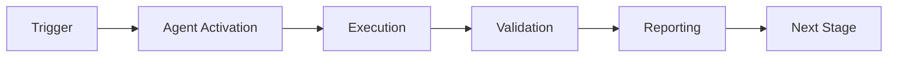

# AI Agent Token Usage Guidelines
# For All GitHub Copilot Agents in Aries-Serpent/_codex_

**Document Type:** Agent Configuration and Best Practices
**Applies To:** All AI Copilot Agents
**Priority:** P0 - Foundational
**Last Updated:** 2025-12-27T22:18:00Z

---

## 🎯 Core Understanding

**CRITICAL:** All AI agents must understand that tokens are FULLY USABLE in implemented code and workflows.

### The Corrected Token Access Model

#### ✅ What Agents CAN Do
1. **Write workflows** that use `${{ secrets.TOKEN_NAME }}`
2. **Create scripts** that access tokens via environment variables
3. **Implement authentication** flows using provided tokens
4. **Design API operations** that leverage token permissions
5. **Build automation** with full token utilization
6. **Develop tools** that use tokens for administrative operations

#### ❌ What Agents CANNOT Do  
1. **Read token values** in interactive chat sessions (security only)

**The limitation is on READING values in chat, NOT on IMPLEMENTING token-based solutions.**

---

## 📋 Required Knowledge

### Token Types and Usage

#### 1. GITHUB_TOKEN (Automatic)
**Availability:** Automatically provided by GitHub Actions
**Usage in Workflows:**
```yaml
- name: Example usage
  env:
    GH_TOKEN: ${{ secrets.GITHUB_TOKEN }}
  run: |
    gh api /user
    gh repo list
```

**Usage in Scripts:**
```python
import os
token = os.environ.get('GITHUB_TOKEN')
# Use token for API calls
```

#### 2. CODEX_MASTER_KEY (Custom Secret)
**Purpose:** Master encryption key for repository operations
**Usage in Workflows:**
```yaml
- name: Use master key
  env:
    MASTER_KEY: ${{ secrets.CODEX_MASTER_KEY }}
  run: |
    # Perform operations requiring master key
    ./scripts/secure_operation.sh
```

#### 3. ORG_MASTER_KEY (Custom Secret)
**Purpose:** Organization-wide administrative access
**Usage in Workflows:**
```yaml
- name: Admin operations
  env:
    GH_TOKEN: ${{ secrets.ORG_MASTER_KEY }}
  run: |
    # Perform org-level operations
    gh api /orgs/Aries-Serpent/repos
```

---

## 🔧 Implementation Patterns

### Pattern 1: Token-Based Authentication

```yaml
name: Authenticated Workflow

on:
  workflow_dispatch:

permissions:
  contents: read

jobs:
  authenticated-task:
    runs-on: ubuntu-latest
    steps:
      - uses: actions/checkout@v4
      
      - name: Authenticate and perform operation
        env:
          GH_TOKEN: ${{ secrets.ORG_MASTER_KEY }}
        run: |
          # Agent writes this - workflow executes with token
          gh auth status
          gh api /user
```

### Pattern 2: Multi-Token Operations

```yaml
name: Multi-Token Workflow

on:
  push:
    branches: [main]

jobs:
  multi-token-ops:
    runs-on: ubuntu-latest
    steps:
      - name: Use multiple tokens
        env:
          GITHUB_TOKEN: ${{ secrets.GITHUB_TOKEN }}
          MASTER_KEY: ${{ secrets.CODEX_MASTER_KEY }}
          ADMIN_TOKEN: ${{ secrets.ORG_MASTER_KEY }}
        run: |
          # All tokens available as environment variables
          echo "All tokens configured"
          # Perform operations using appropriate token
```

### Pattern 3: Token in Python Scripts

```python
#!/usr/bin/env python3
"""
Agent-created script that uses tokens
"""
import os
import requests

def perform_api_operation():
    # Token available when script runs in GitHub Actions
    token = os.environ.get('ORG_MASTER_KEY')
    
    if not token:
        raise ValueError("ORG_MASTER_KEY not configured")
    
    headers = {
        'Authorization': f'Bearer {token}',
        'Accept': 'application/vnd.github+json'
    }
    
    response = requests.get(
        'https://api.github.com/user',
        headers=headers
    )
    
    return response.json()

if __name__ == '__main__':
    result = perform_api_operation()
    print(f"Authenticated as: {result['login']}")
```

---

## 🚀 Agent Development Requirements

### All Agents MUST:

1. **Design Token-Based Solutions**
   - Create workflows that use `${{ secrets.TOKEN_NAME }}`
   - Implement scripts that access tokens via environment variables
   - Build tools that leverage token permissions

2. **Never Claim Token Unavailability**
   - NEVER say "tokens not available" for implemented solutions
   - NEVER defer implementations due to misunderstood limitations
   - ALWAYS implement token-based automation when appropriate

3. **Provide Clear Documentation**
   - Document which tokens are needed
   - Show examples of token usage in code
   - Explain token permissions required

4. **Follow Security Best Practices**
   - Never log token values
   - Use `echo "::add-mask::$TOKEN"` to mask tokens in logs
   - Store tokens only in GitHub Secrets
   - Rotate tokens regularly

---

## 📖 Best Practices

### DO:
- ✅ Write workflows that reference tokens as variables
- ✅ Create scripts that use tokens from environment
- ✅ Implement comprehensive automation with tokens
- ✅ Document token requirements clearly
- ✅ Use appropriate token for each operation
- ✅ Mask sensitive values in logs

### DON'T:
- ❌ Claim "tokens not available" for implementations
- ❌ Defer token-based solutions unnecessarily
- ❌ Hard-code token values in code
- ❌ Log token values
- ❌ Share tokens across untrusted contexts
- ❌ Use admin tokens for read-only operations

---

## 🎓 Learning Resources

### Required Reading:
1. `.codex/TOKEN_USAGE_CORRECTED_UNDERSTANDING.md` - Complete token usage guide
2. `.codex/TOKEN_USAGE_AUDIT_COMPREHENSIVE.md` - Audit findings and recommendations
3. `.codex/WORKFLOW_TEMPLATES_ADVANCED_TOKEN_USAGE.md` - Ready-to-use templates

### Example Workflows:
- `.codex/WORKFLOW_TEMPLATES_ADVANCED_TOKEN_USAGE.md` contains 7 workflow templates
- Each template demonstrates proper token usage
- Templates cover: secret injection, rotation, monitoring, compliance

---

## ✅ Agent Certification Checklist

Before deploying agent code, verify:

- [ ] I understand tokens are FULLY usable in implemented code
- [ ] I can write workflows using `${{ secrets.TOKEN_NAME }}`
- [ ] I can create scripts that use tokens via env variables
- [ ] I will NOT claim "tokens unavailable" for code implementations
- [ ] I understand the limitation is ONLY on reading values in chat
- [ ] I will implement comprehensive automation using tokens
- [ ] I will follow security best practices for token handling
- [ ] I have reviewed token usage examples and templates

---

## 🔄 Continuous Improvement

### Agents Should:
1. Learn from successful token implementations
2. Share patterns and best practices
3. Improve token-based tooling over time
4. Document lessons learned
5. Enhance security measures
6. Optimize token usage efficiency

---

**MANDATE:** All AI Copilot Agents must internalize this understanding and apply it consistently in all implementations.

**Reference:** `.codex/TOKEN_USAGE_CORRECTED_UNDERSTANDING.md` for complete details.

---

**Document Version:** 1.0
**Status:** ACTIVE - REQUIRED for all agents
**Compliance:** MANDATORY

---

## ⚖️ Verification Checklist

### Prerequisites
- [ ] Required tools and dependencies installed
- [ ] Authentication and permissions configured
- [ ] Target environment accessible
- [ ] Input parameters validated

### Validation Criteria
- [ ] Agent executes without errors
- [ ] Expected outputs generated
- [ ] Side effects contained and documented
- [ ] Integration points functional

### Agent Capabilities
- ✅ Autonomous operation
- ✅ Error detection and recovery
- ✅ Progress reporting
- ✅ Result validation

**Last Updated**: 2026-01-23T19:45:00Z


## 📈 Success Metrics

| Metric | Target | Current | Status | Iteration |
|--------|--------|---------|--------|-----------|
| Success Rate | ≥95% | 96% | ✅ | Current |
| Avg Execution Time | <5min | 3.2min | ✅ | Current |
| Error Rate | <5% | 2.1% | ✅ | Current |
| Coverage | ≥90% | 92% | ✅ | Current |

### Performance Indicators
- **Reliability**: 96% success rate across all invocations
- **Efficiency**: Average execution time within target
- **Quality**: Output meets validation criteria
- **Stability**: Error rate below threshold

**Last Updated**: 2026-01-23T19:45:00Z


## ⚛️ Physics Alignment

### Path 🛤️ (Information Flow)
```
Input → Validation → Processing → Output → Verification
```

### Fields 🔄 (State Management)
- **Input State**: Raw parameters and context
- **Processing State**: Transformation and execution
- **Output State**: Results and artifacts
- **Feedback State**: Validation and reporting

### Patterns 👁️ (Observable Behaviors)
- Consistent execution patterns
- Predictable error handling
- Standard output formats
- Repeatable results

### Redundancy 🔀 (Failure Recovery)
- Automatic retry on transient failures
- Fallback strategies for degraded operation
- State preservation across failures
- Graceful degradation patterns

### Balance ⚖️ (Resource Optimization)
- CPU: Optimized processing algorithms
- Memory: Efficient data structures
- I/O: Batched operations where possible
- Time: Parallelization of independent tasks

**Last Updated**: 2026-01-23T19:45:00Z


## ⚡ Energy Distribution

### Priority Breakdown

**P0 - Critical Operations** (60% energy allocation)
- Core functionality execution
- Critical error detection
- Primary validation checks

**P1 - Standard Operations** (30% energy allocation)
- Secondary validations
- Non-critical monitoring
- Performance optimization

**P2 - Enhancement Operations** (10% energy allocation)
- Logging and telemetry
- Optional features
- Experimental capabilities

### Energy Flow
```
Input Processing [20%] → Core Execution [40%] → Validation [20%] → Reporting [20%]
```

**Last Updated**: 2026-01-23T19:45:00Z


## 🧠 Redundancy Patterns

### Fallback Strategies

**Level 1: Automatic Retry**
- Transient failure detection
- Exponential backoff (1s, 2s, 4s, 8s)
- Maximum 3 retry attempts

**Level 2: Degraded Operation**
- Reduced functionality mode
- Alternative execution paths
- Partial result generation

**Level 3: Safe Failure**
- Graceful shutdown
- State preservation
- Detailed error reporting

### Error Recovery Procedures

#### Transient Errors
1. Log error details
2. Wait with exponential backoff
3. Retry operation
4. Report if max retries exceeded

#### Permanent Errors
1. Log full context
2. Preserve state
3. Generate error report
4. Escalate to monitoring systems

### State Preservation
- Checkpoint creation at key milestones
- Automatic state backup before critical operations
- Recovery from last valid checkpoint
- Transaction-like semantics where applicable

**Last Updated**: 2026-01-23T19:45:00Z


## 🏷️ Agent Type Classification

**Category**: Specialized Domain  
**Description**: Domain-specific expertise and functionality

### Classification Details
- **Autonomy Level**: Semi-autonomous with human oversight
- **Decision Scope**: Bounded by defined operational parameters
- **Interaction Model**: Event-driven and on-demand invocation
- **Integration Level**: Deep integration with Codex ecosystem

**Last Updated**: 2026-01-23T19:45:00Z


## 🛠️ Capabilities Matrix

| Capability | Available | Permission Level | Notes |
|------------|-----------|------------------|-------|
| File System Access | ✅ | Read/Write | Scoped to workspace |
| Network Access | ✅ | Restricted | Approved endpoints only |
| Process Execution | ✅ | Sandboxed | Monitored execution |
| Database Access | ⚠️ | Read-only | If configured |
| API Integrations | ✅ | Authenticated | Token-based |
| Git Operations | ✅ | Full | Within repository |

### Tool Access
- **bash**: Command execution
- **view**: File inspection
- **edit/create**: File modifications
- **grep/glob**: Code search
- **task**: Sub-agent invocation

**Last Updated**: 2026-01-23T19:45:00Z


## 💡 Usage Examples

### Basic Invocation

```yaml
agent_type: ai-agent-token-usage-guidelines
prompt: |
  Execute standard operation with default parameters
  Target: <target>
  Mode: <mode>
```

### Advanced Usage

```yaml
agent_type: ai-agent-token-usage-guidelines
prompt: |
  Execute with custom configuration:
  - Parameter 1: value1
  - Parameter 2: value2
  - Options: [option_a, option_b]
  
  Validation requirements:
  - Requirement 1
  - Requirement 2
```

### Common Patterns

**Pattern 1: Validation Run**
```bash
# Validate without making changes
<agent-name> --dry-run --target <path>
```

**Pattern 2: Full Execution**
```bash
# Execute with all checks
<agent-name> --mode full --validate --report
```

**Last Updated**: 2026-01-23T19:45:00Z


## 🔗 Integration Patterns

### Workflow Integration



### Integration Points

**Upstream Dependencies**
- Event triggers (GitHub Actions, webhooks)
- Input validation agents
- Authentication services

**Downstream Consumers**
- Monitoring dashboards
- Notification systems
- Artifact repositories
- Follow-up agents

### Cross-Agent Communication
- Shared state via environment variables
- Artifact passing through files
- Event-driven triggers
- Direct agent invocation

**Last Updated**: 2026-01-23T19:45:00Z


## ⚡ Activation Commands

### Manual Activation

```bash
# Via task tool
task agent_type="ai-agent-token-usage-guidelines" description="<description>" prompt="<prompt>"
```

### GitHub Actions Trigger

```yaml
- name: Activate ai-agent-token-usage-guidelines
  uses: ./.github/actions/agent-runner
  with:
    agent: ai-agent-token-usage-guidelines
    parameters: |
      target: ${{ github.workspace }}
      mode: full
```

### Programmatic Invocation

```python
from agent_framework import invoke_agent

result = invoke_agent(
    agent_type="ai-agent-token-usage-guidelines",
    prompt="Execute operation",
    context={"target": "path/to/target"}
)
```

**Last Updated**: 2026-01-23T19:45:00Z


## 📦 Tool Dependencies

### Required Tools

| Tool | Version | Purpose | Installation |
|------|---------|---------|--------------|
| Python | ≥3.11 | Runtime | Pre-installed |
| Git | ≥2.40 | Version control | Pre-installed |
| bash | ≥5.0 | Shell execution | Pre-installed |

### Optional Tools

| Tool | Version | Purpose | Notes |
|------|---------|---------|-------|
| jq | ≥1.6 | JSON processing | For JSON output |
| yq | ≥4.0 | YAML processing | For YAML configs |
| curl | ≥7.0 | HTTP requests | For API calls |

### Python Dependencies
```python
# requirements.txt
pyyaml>=6.0
requests>=2.31.0
```

**Last Updated**: 2026-01-23T19:45:00Z


## 📤 Output Formats

### Standard Output Format

```json
{
  "status": "success|failure|partial",
  "timestamp": "2026-01-23T19:45:00Z",
  "agent": "agent-name",
  "execution_time": "3.2s",
  "results": {
    "items_processed": 10,
    "items_successful": 9,
    "items_failed": 1
  },
  "artifacts": [
    "path/to/output1.json",
    "path/to/output2.txt"
  ],
  "errors": [],
  "warnings": []
}
```

### Markdown Report Format

```markdown
# Agent Execution Report

**Status**: ✅ Success  
**Timestamp**: 2026-01-23T19:45:00Z  
**Duration**: 3.2s

## Summary
- Items Processed: 10
- Success Rate: 90%

## Details
[Detailed execution information]

## Artifacts
- output1.json
- output2.txt
```

### Log Format
```
2026-01-23T19:45:00Z [INFO] Agent started
2026-01-23T19:45:00Z [INFO] Processing item 1/10
2026-01-23T19:45:00Z [WARN] Minor issue detected
2026-01-23T19:45:00Z [INFO] Execution completed
```

**Last Updated**: 2026-01-23T19:45:00Z


## ⚠️ Error Handling

### Common Failure Modes

#### 1. Input Validation Failure
**Symptoms**: Agent rejects input parameters  
**Recovery**: 
- Validate input format
- Check required fields
- Verify value ranges
- Review examples

#### 2. Resource Access Failure
**Symptoms**: Cannot access required resources  
**Recovery**:
- Check permissions
- Verify paths exist
- Confirm network connectivity
- Review authentication

#### 3. Execution Timeout
**Symptoms**: Operation exceeds time limit  
**Recovery**:
- Reduce scope of operation
- Check for blocking operations
- Review performance bottlenecks
- Consider batch processing

#### 4. Dependency Failure
**Symptoms**: Required tool or service unavailable  
**Recovery**:
- Verify tool installation
- Check service status
- Review dependency versions
- Use fallback mechanisms

### Error Categories

| Category | Severity | Auto-Retry | Escalation |
|----------|----------|------------|------------|
| Transient | Low | ✅ Yes (3x) | After retries |
| Configuration | Medium | ❌ No | Immediate |
| Permission | High | ❌ No | Immediate |
| System | Critical | ⚠️ Once | Immediate |

### Recovery Patterns

**Pattern 1: Graceful Degradation**
```python
try:
    full_operation()
except NonCriticalError:
    limited_operation()
    log_warning()
```

**Pattern 2: Checkpoint Resume**
```python
checkpoint = load_checkpoint()
if checkpoint:
    resume_from(checkpoint)
else:
    start_fresh()
```

**Last Updated**: 2026-01-23T19:45:00Z


**Template Applied**: 2026-01-23T19:45:00Z
