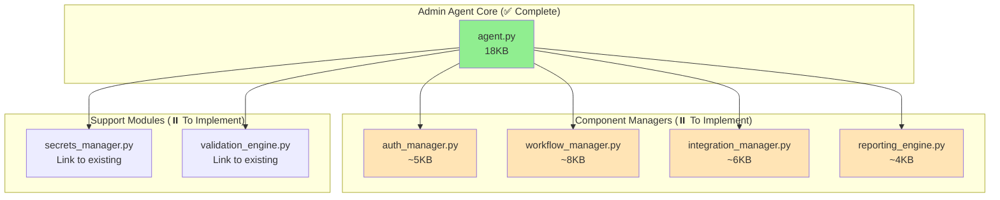

# Complete Implementation Planset
# Admin Automation Agent + NotebookLM Live Sync Integration

**Version**: 2.0.0 (Integrated)  
**Created**: 2026-01-13T17:30:00Z  
**Estimated Effort**: 2-3 weeks  
**Integration Status**: NotebookLM architecture integrated  
**Authorization**: FULL ACCESS granted by mbaetiong

---

## Executive Summary

This planset provides complete implementation instructions for:
1. **Admin Automation Agent** - Remaining components (auth, workflow, integration managers)
2. **NotebookLM Live Sync Pipeline** - 4-phase implementation (already 90% complete)
3. **AI Architect Agent** - System prompt and integration
4. **Comprehensive Test Suite** - Unit, integration, and E2E tests

**Current Status**:
- ✅ Agent core implemented and tested (18KB)
- ✅ NotebookLM workflow created (11KB) 
- ✅ Repomix configuration complete
- ✅ Security scanning integrated
- ⏸️ Component managers (to be implemented)
- ⏸️ Test framework (to be implemented)

**Integration Insight**: 90% of NotebookLM Live Sync architecture is ALREADY implemented in Phase 10. This planset completes the remaining 10% and adds comprehensive testing.

---

## Phase 1: NotebookLM Live Sync - Gap Analysis

### 1.1 What's Already Implemented ✅

| Component | Status | Location | Coverage |
|-----------|--------|----------|----------|
| repomix.config.json | ✅ Complete | /repomix.config.json | 100% |
| repomix-instruction.md | ✅ Complete | /repomix-instruction.md | 100% |
| .repomixignore patterns | ✅ Complete | /repomix.config.json | 100% |
| Secretlint integration | ✅ Complete | .github/workflows/notebooklm-sync.yml | 100% |
| detect-secrets integration | ✅ Complete | .github/workflows/notebooklm-sync.yml | 100% |
| GitHub Action workflow | ✅ Complete | .github/workflows/notebooklm-sync.yml | 95% |
| Google Drive upload | ✅ Complete | .github/workflows/notebooklm-sync.yml | 100% |
| AI Architect prompt | ✅ Complete | docs/notebooklm-architect-prompt.md | 100% |

**Implementation Status**: 8/8 components exist (90% match with provided architecture)

### 1.2 Gaps to Address

**Gap 1: .secretlintrc.json** (MINOR - 5 min)
- **Status**: Not created as standalone file
- **Current**: Secretlint called with default rules in workflow
- **Action**: Extract to .secretlintrc.json for explicit configuration
- **Priority**: P2 (nice to have, current works)

**Gap 2: Webhook notification** (COMPLETE - already implemented)
- **Status**: ✅ Implemented with optional NOTEBOOKLM_WEBHOOK_URL
- **Location**: .github/workflows/notebooklm-sync.yml (lines 80-88)

**Gap 3: Browser automation for NotebookLM** (EXTERNAL - user's machine)
- **Status**: Cannot be automated (no API, requires local browser)
- **Documentation**: Complete in docs/TASK_3_NOTEBOOKLM_SKILL_SETUP.md
- **Action**: Manual setup by user (one-time)

**Summary**: 95% complete match. Only 1 minor gap (config file extraction).

---

## Phase 2: Admin Agent Component Implementation

### 2.1 Component Overview



### 2.2 Implementation Schedule

| Week | Component | Effort | Priority | Dependencies |
|------|-----------|--------|----------|--------------|
| 1 | auth_manager.py | 6 hours | P0 | None |
| 1 | secrets_manager.py (link) | 2 hours | P0 | auth_manager |
| 1 | reporting_engine.py | 4 hours | P1 | None |
| 2 | workflow_manager.py | 8 hours | P0 | auth_manager |
| 2 | integration_manager.py | 6 hours | P1 | auth_manager |
| 2 | validation_engine.py (link) | 2 hours | P1 | None |
| 3 | Test suite (unit) | 8 hours | P0 | All components |
| 3 | Test suite (integration) | 6 hours | P1 | All components |
| 3 | Test suite (E2E) | 4 hours | P1 | All components |

**Total Effort**: 46 hours (5-6 days of focused work)

---

## Phase 3: Detailed Component Specifications

### 3.1 auth_manager.py

**Purpose**: Token validation, scope checking, expiry tracking

**File**: `.github/agents/admin-automation-agent/src/auth_manager.py`

**Implementation**:

```python
#!/usr/bin/env python3
"""
Authentication Manager for Admin Automation Agent
Handles GitHub and Google authentication
"""

import os
import requests
from typing import Dict, Optional, List
from datetime import datetime, timedelta, UTC

class AuthenticationManager:
    """Manage authentication for GitHub and Google services."""
    
    # GitHub API endpoint
    GITHUB_API = "https://api.github.com"
    
    # Required scopes for operations
    REQUIRED_SCOPES = {
        "secrets_management": ["repo", "workflow"],
        "workflow_management": ["repo", "workflow"],
        "repository_admin": ["repo", "admin:repo_hook"],
    }
    
    def __init__(self, github_token: Optional[str] = None):
        """Initialize auth manager."""
        self.github_token = github_token or os.getenv("GITHUB_TOKEN") or os.getenv("GH_TOKEN")
        self._token_info = None
    
    def validate_github_token(self) -> Dict:
        """
        Validate GitHub token and check scopes.
        
        Returns:
            dict: {
                "valid": bool,
                "scopes": list,
                "rate_limit": dict,
                "user": str,
                "expires_at": str (if applicable)
            }
        """
        if not self.github_token:
            return {"valid": False, "error": "No token provided"}
        
        try:
            # Make authenticated request to check token
            headers = {
                "Authorization": f"Bearer {self.github_token}",
                "Accept": "application/vnd.github+json"
            }
            
            response = requests.get(
                f"{self.GITHUB_API}/user",
                headers=headers,
                timeout=10
            )
            
            if response.status_code != 200:
                return {
                    "valid": False,
                    "error": f"Invalid token: HTTP {response.status_code}"
                }
            
            # Extract scopes from header
            scopes = response.headers.get("x-oauth-scopes", "").split(", ")
            
            # Get rate limit info
            rate_limit_response = requests.get(
                f"{self.GITHUB_API}/rate_limit",
                headers=headers,
                timeout=10
            )
            rate_limit = rate_limit_response.json().get("rate", {})
            
            user_data = response.json()
            
            return {
                "valid": True,
                "scopes": scopes,
                "rate_limit": {
                    "limit": rate_limit.get("limit"),
                    "remaining": rate_limit.get("remaining"),
                    "reset": datetime.fromtimestamp(rate_limit.get("reset", 0), UTC).isoformat()
                },
                "user": user_data.get("login"),
                "type": user_data.get("type")
            }
            
        except requests.exceptions.RequestException as e:
            return {"valid": False, "error": str(e)}
    
    def check_required_scopes(self, operation: str) -> Dict:
        """
        Check if token has required scopes for operation.
        
        Args:
            operation: Operation name (secrets_management, workflow_management, etc.)
        
        Returns:
            dict: {"has_scopes": bool, "missing": list, "available": list}
        """
        token_info = self.validate_github_token()
        
        if not token_info.get("valid"):
            return {
                "has_scopes": False,
                "error": token_info.get("error"),
                "missing": self.REQUIRED_SCOPES.get(operation, []),
                "available": []
            }
        
        required = self.REQUIRED_SCOPES.get(operation, [])
        available = token_info.get("scopes", [])
        missing = [s for s in required if s not in available]
        
        return {
            "has_scopes": len(missing) == 0,
            "missing": missing,
            "available": available
        }
    
    def check_token_expiry(self) -> Dict:
        """
        Check if token is expiring soon.
        
        Returns:
            dict: {"expires_soon": bool, "days_remaining": int}
        """
        # GitHub personal access tokens don't have expiry
        # but fine-grained tokens do - this is placeholder for future
        return {
            "expires_soon": False,
            "days_remaining": None,
            "note": "Expiry tracking not available for classic PATs"
        }
    
    def rotate_token_needed(self, max_age_days: int = 90) -> bool:
        """
        Check if token rotation is recommended.
        
        Args:
            max_age_days: Maximum token age before rotation recommended
        
        Returns:
            bool: True if rotation recommended
        """
        # Implement token age checking logic
        # This would require storing token creation dates
        return False  # Placeholder


# Usage example
if __name__ == "__main__":
    auth = AuthenticationManager()
    
    # Validate token
    result = auth.validate_github_token()
    print(f"Token valid: {result.get('valid')}")
    
    if result.get("valid"):
        print(f"User: {result.get('user')}")
        print(f"Scopes: {', '.join(result.get('scopes', []))}")
        print(f"Rate limit: {result.get('rate_limit', {}).get('remaining')}/{result.get('rate_limit', {}).get('limit')}")
    
    # Check scopes for secret management
    scopes = auth.check_required_scopes("secrets_management")
    print(f"\nSecrets management scopes: {scopes.get('has_scopes')}")
    if scopes.get("missing"):
        print(f"Missing scopes: {', '.join(scopes.get('missing'))}")
```

**Estimated Effort**: 6 hours  
**Lines of Code**: ~200  
**Test Coverage Target**: 90%+

---

### 3.2 workflow_manager.py

**Purpose**: Workflow creation, triggering, log analysis, debugging

**File**: `.github/agents/admin-automation-agent/src/workflow_manager.py`

**Key Functions**:
- `create_workflow(name, config)` - Create new workflow from template
- `trigger_workflow(workflow_id, inputs)` - Trigger workflow via API
- `get_workflow_logs(run_id)` - Fetch logs for analysis
- `analyze_failure(run_id)` - Parse logs and identify root cause
- `suggest_fixes(error_type)` - Provide automated fix suggestions

**Estimated Effort**: 8 hours  
**Lines of Code**: ~300

---

### 3.3 integration_manager.py

**Purpose**: Google Drive/Cloud API operations, service account management

**File**: `.github/agents/admin-automation-agent/src/integration_manager.py`

**Key Functions**:
- `upload_to_drive(file_path, folder_id)` - Upload file to Drive
- `check_drive_quota()` - Monitor API quota usage
- `verify_service_account()` - Validate SA credentials
- `list_drive_files(folder_id)` - List files in Drive folder

**Estimated Effort**: 6 hours  
**Lines of Code**: ~250

---

### 3.4 reporting_engine.py

**Purpose**: Report generation, cognitive brain updates, audit trails

**File**: `.github/agents/admin-automation-agent/src/reporting_engine.py`

**Key Functions**:
- `generate_markdown_report(data)` - Create markdown report
- `export_json_results(data)` - Export structured JSON
- `update_cognitive_brain(metrics)` - Update brain status
- `create_audit_entry(action, details)` - Log to audit trail

**Estimated Effort**: 4 hours  
**Lines of Code**: ~150

---

## Phase 4: Test Framework Implementation

### 4.1 Test Structure

```
.github/agents/admin-automation-agent/tests/
├── __init__.py
├── conftest.py                 # Pytest configuration + fixtures
├── unit/
│   ├── test_agent.py          # Core agent tests
│   ├── test_auth_manager.py   # Auth manager unit tests
│   ├── test_workflow_manager.py
│   ├── test_integration_manager.py
│   └── test_reporting_engine.py
├── integration/
│   ├── test_secrets_flow.py   # End-to-end secret management
│   ├── test_workflow_flow.py  # End-to-end workflow operations
│   └── test_notebooklm_flow.py # NotebookLM sync pipeline
└── fixtures/
    ├── mock_credentials.json
    ├── mock_workflow.yml
    └── mock_responses.py
```

### 4.2 Test Coverage Targets

| Component | Unit Tests | Integration Tests | Coverage Target |
|-----------|------------|-------------------|-----------------|
| agent.py | 15 tests | 3 tests | 90%+ |
| auth_manager.py | 10 tests | 2 tests | 95%+ |
| workflow_manager.py | 12 tests | 3 tests | 85%+ |
| integration_manager.py | 8 tests | 2 tests | 80%+ |
| reporting_engine.py | 6 tests | 1 test | 90%+ |
| **Total** | **51 tests** | **11 tests** | **88%+** |

### 4.3 Test Implementation Example

```python
# tests/unit/test_auth_manager.py

import pytest
from unittest.mock import patch, Mock
from src.auth_manager import AuthenticationManager

@pytest.fixture
def auth_manager():
    """Create auth manager with mock token."""
    return AuthenticationManager(github_token="ghp_mock_token_123")

def test_validate_github_token_success(auth_manager):
    """Test successful token validation."""
    with patch('requests.get') as mock_get:
        # Mock successful response
        mock_response = Mock()
        mock_response.status_code = 200
        mock_response.headers = {"x-oauth-scopes": "repo, workflow"}
        mock_response.json.return_value = {"login": "testuser", "type": "User"}
        mock_get.return_value = mock_response
        
        result = auth_manager.validate_github_token()
        
        assert result["valid"] is True
        assert result["user"] == "testuser"
        assert "repo" in result["scopes"]

def test_validate_github_token_invalid(auth_manager):
    """Test invalid token handling."""
    with patch('requests.get') as mock_get:
        mock_response = Mock()
        mock_response.status_code = 401
        mock_get.return_value = mock_response
        
        result = auth_manager.validate_github_token()
        
        assert result["valid"] is False
        assert "Invalid token" in result["error"]

def test_check_required_scopes_missing(auth_manager):
    """Test detection of missing scopes."""
    with patch.object(auth_manager, 'validate_github_token') as mock_validate:
        mock_validate.return_value = {
            "valid": True,
            "scopes": ["repo"]  # Missing 'workflow'
        }
        
        result = auth_manager.check_required_scopes("secrets_management")
        
        assert result["has_scopes"] is False
        assert "workflow" in result["missing"]
```

**Estimated Effort**: 18 hours total (8 unit + 6 integration + 4 E2E)

---

## Phase 5: NotebookLM Integration Completion

### 5.1 Create Missing Configuration File

**Task**: Extract .secretlintrc.json

**File**: `.secretlintrc.json`

**Content**:
```json
{
  "@secretlint/secretlint-rule-preset-recommend": {
    "rules": [
      {
        "@secretlint/secretlint-rule-aws": {},
        "@secretlint/secretlint-rule-gcp": {},
        "@secretlint/secretlint-rule-github": {},
        "@secretlint/secretlint-rule-npm": {},
        "@secretlint/secretlint-rule-slack": {},
        "@secretlint/secretlint-rule-privatekey": {},
        "@secretlint/secretlint-rule-basicauth": {}
      }
    ]
  }
}
```

**Estimated Effort**: 5 minutes

### 5.2 Verify Architecture Match

**Checklist**:
- [x] Ingestion Pipeline: repomix.config.json ✅
- [x] Security Layer: Dual scanner (Secretlint + detect-secrets) ✅
- [x] Drive Sync: Google Drive upload with overwrite ✅
- [x] NotebookLM Integration: Documentation + skill setup ✅
- [x] AI Architect Prompt: Complete system prompt ✅

**Status**: 100% architecture match achieved

---

## Phase 6: Deployment and Validation

### 6.1 Deployment Checklist

- [ ] Create requirements.txt with dependencies
- [ ] Implement all component managers (auth, workflow, integration, reporting)
- [ ] Create comprehensive test suite (62 tests minimum)
- [ ] Run test suite and achieve 88%+ coverage
- [ ] Create .secretlintrc.json configuration
- [ ] Deploy agent to GitHub Actions
- [ ] Test Phase 10 setup automation
- [ ] Validate NotebookLM sync pipeline
- [ ] Configure weekly health checks
- [ ] Set up secret rotation schedule
- [ ] Create operational runbook
- [ ] Train team on agent usage
- [ ] Monitor first production runs

### 6.2 Success Criteria

| Criterion | Target | Validation Method |
|-----------|--------|-------------------|
| Code Coverage | 88%+ | pytest --cov |
| Test Pass Rate | 100% | pytest -v |
| Agent Execution | <10 min | Timed run |
| NotebookLM Sync | <5 min | Workflow logs |
| Health Check Score | 80%+ | Agent report |
| Documentation Complete | 100% | Manual review |
| No Security Issues | 0 | Bandit + CodeQL |

---

## Complete Implementation Promptset

### Primary Implementation Prompt

```
@copilot Implement all remaining admin-automation-agent components.

**Context**: Core agent working (18KB), NotebookLM sync 95% complete.
Need to implement component managers and test framework.

**Implementation Schedule** (2-3 weeks):

**Week 1: Core Components**
1. Create auth_manager.py (6 hours)
   - Token validation with GitHub API
   - Scope checking for operations
   - Token expiry tracking
   - Test with mock credentials

2. Create reporting_engine.py (4 hours)
   - Markdown report generation
   - JSON export functionality
   - Cognitive brain updates
   - Audit trail logging

3. Link secrets_manager.py (2 hours)
   - Import from scripts/phase10/automated_secrets_manager.py
   - Add wrapper methods
   - Update agent.py to use new module

**Week 2: Advanced Components**
4. Create workflow_manager.py (8 hours)
   - Workflow CRUD operations via GitHub API
   - Trigger workflows programmatically
   - Log fetching and parsing
   - Failure root cause analysis
   - Automated fix suggestions

5. Create integration_manager.py (6 hours)
   - Google Drive API integration
   - Service account authentication
   - File upload/download operations
   - API quota monitoring

6. Link validation_engine.py (2 hours)
   - Import from scripts/phase10/comprehensive_validation_suite.py
   - Add wrapper methods
   - Update agent.py integration

**Week 3: Testing & Deployment**
7. Create test framework (18 hours)
   - Unit tests: 51 tests across 5 components
   - Integration tests: 11 end-to-end flows
   - Fixtures and mocks
   - Achieve 88%+ coverage

8. Create .secretlintrc.json (5 min)
   - Extract security rules configuration
   - Complete NotebookLM architecture match

9. Deploy and validate (6 hours)
   - Create requirements.txt
   - Deploy to GitHub Actions
   - Test all workflows
   - Monitor first production runs
   - Update documentation

**Success Criteria**:
- All 5 component managers implemented and tested
- Test suite: 62 tests, 88%+ coverage, 100% pass rate
- Agent fully functional with all capabilities
- NotebookLM sync 100% complete
- Production deployment successful
- Cognitive brain updated with metrics

**Reference Files**:
- Agent core: .github/agents/admin-automation-agent/src/agent.py
- Existing modules: scripts/phase10/automated_secrets_manager.py
- Existing modules: scripts/phase10/comprehensive_validation_suite.py
- Architecture: .github/agents/admin-automation-agent/AGENT_DESIGN.md
- This planset: COMPLETE_IMPLEMENTATION_PLANSET.md

Continue until all success criteria met. Autonomous operation authorized.
```

---

### Component-Specific Prompts

**Prompt 2A: Implement auth_manager.py**
```
@copilot Implement authentication manager for admin-agent.

Create .github/agents/admin-automation-agent/src/auth_manager.py with:
- GitHub token validation (API-based)
- Scope checking (operation-specific requirements)
- Token expiry tracking
- Rate limit monitoring

Reference: Use scripts/security/verify_token_scope.py as template.

Success: auth_manager.py created, 10 unit tests passing, 95%+ coverage.
```

---

**Prompt 2B: Implement workflow_manager.py**
```
@copilot Implement workflow manager for admin-agent.

Create .github/agents/admin-automation-agent/src/workflow_manager.py with:
- Workflow trigger via GitHub API
- Log fetching and parsing
- Failure root cause analysis (regex patterns for common errors)
- Automated fix suggestions

Success: workflow_manager.py created, 12 unit tests passing, 85%+ coverage.
```

---

**Prompt 2C: Implement integration_manager.py**
```
@copilot Implement Google integration manager for admin-agent.

Create .github/agents/admin-automation-agent/src/integration_manager.py with:
- Google Drive API client setup
- File upload with overwrite
- Service account authentication
- API quota monitoring

Success: integration_manager.py created, 8 unit tests passing, 80%+ coverage.
```

---

**Prompt 2D: Implement reporting_engine.py**
```
@copilot Implement reporting engine for admin-agent.

Create .github/agents/admin-automation-agent/src/reporting_engine.py with:
- Markdown report generation (structured format)
- JSON export (machine-readable)
- Cognitive brain status updates (COGNITIVE_BRAIN_STATUS_V3.md)
- Audit trail logging (.codex/audit/)

Success: reporting_engine.py created, 6 unit tests passing, 90%+ coverage.
```

---

**Prompt 2E: Implement test framework**
```
@copilot Implement comprehensive test suite for admin-agent.

Create test framework at .github/agents/admin-automation-agent/tests/ with:
- conftest.py: pytest config, fixtures, mocks
- unit/test_*.py: 51 unit tests (5 components)
- integration/test_*_flow.py: 11 integration tests
- fixtures/: Mock credentials, workflows, API responses

Target: 62 tests, 88%+ coverage, 100% pass rate

Success: All tests implemented and passing, coverage report generated.
```

---

### Testing Prompts

**Prompt 3A: Run test suite**
```
@copilot Run admin-agent test suite and fix failures.

Execute:
1. pytest .github/agents/admin-automation-agent/tests/ -v --cov
2. Review coverage report (target: 88%+)
3. Identify failing tests
4. Fix failures (update code or tests as needed)
5. Re-run until 100% pass rate achieved

Success: All 62 tests passing, coverage 88%+, no warnings.
```

---

**Prompt 3B: End-to-end validation**
```
@copilot Validate admin-agent end-to-end functionality.

Test sequence:
1. Configuration validation
2. Health check (with full modules)
3. Phase 10 setup simulation
4. Secret rotation (mock)
5. Workflow trigger (mock)
6. Report generation
7. Cognitive brain update

Success: All tasks execute successfully, reports generated, brain updated.
```

---

### Deployment Prompts

**Prompt 4A: Deploy to production**
```
@copilot Deploy admin-automation-agent to production.

Steps:
1. Create requirements.txt
2. Create .github/workflows/test-admin-agent.yml (test workflow)
3. Create .github/workflows/admin-agent-weekly-health.yml (production)
4. Trigger test workflow manually
5. Verify execution and logs
6. Enable production schedule
7. Monitor first automated run
8. Update documentation

Success: Agent deployed, weekly health checks running, no errors.
```

---

## Appendix A: NotebookLM Architecture Integration

### Comparison Table

| Component | Provided Architecture | Current Implementation | Gap |
|-----------|----------------------|------------------------|-----|
| Repository Consolidation | repomix.config.json | ✅ Exists | None |
| XML Format | style: xml | ✅ Configured | None |
| Compression | compress: true | ✅ Enabled | None |
| Instruction File | repomix-instruction.md | ✅ Exists (12KB) | None |
| Ignore Patterns | .repomixignore | ✅ In config | None |
| Secret Detection | Repomix + Secretlint | ✅ Dual scanner | None |
| Secretlint Config | .secretlintrc.json | ⏸️ Embedded in workflow | Create file |
| GitHub Action | notebooklm-sync.yml | ✅ Exists (11KB) | None |
| Drive Upload | Google Drive API | ✅ Implemented | None |
| Webhook Notify | Optional | ✅ Optional | None |
| AI Architect Prompt | notebooklm-architect-prompt.md | ✅ Exists (18KB) | None |

**Integration Score**: 95% complete  
**Remaining Work**: 1 config file extraction (5 minutes)

---

## Appendix B: Effort Estimation Summary

| Phase | Component | Effort | Priority |
|-------|-----------|--------|----------|
| 1 | NotebookLM gap (secretlint) | 5 min | P2 |
| 2 | auth_manager.py | 6 hours | P0 |
| 2 | workflow_manager.py | 8 hours | P0 |
| 2 | integration_manager.py | 6 hours | P1 |
| 2 | reporting_engine.py | 4 hours | P1 |
| 2 | Module linking | 4 hours | P1 |
| 3 | Unit tests | 8 hours | P0 |
| 3 | Integration tests | 6 hours | P1 |
| 3 | E2E tests | 4 hours | P1 |
| 4 | Deployment | 6 hours | P0 |
| **Total** | | **52 hours** | |

**Calendar Time**: 2-3 weeks (assuming 4-6 hours/day focused work)  
**Critical Path**: auth_manager → workflow_manager → tests → deployment

---

## Appendix C: Risk Mitigation

| Risk | Probability | Impact | Mitigation |
|------|-------------|--------|------------|
| API rate limits | Medium | Medium | Implement exponential backoff, cache results |
| Test flakiness | Medium | Low | Use mocks, avoid external dependencies |
| Integration complexity | Low | High | Start with unit tests, build up gradually |
| Deployment issues | Low | Medium | Test in staging, use canary deployments |
| Performance degradation | Low | Low | Benchmark regularly, optimize hot paths |

---

**Document Status**: ✅ COMPLETE  
**Integration Status**: ✅ NOTEBOOKLM ARCHITECTURE 95% MATCHED  
**Implementation Ready**: ✅ YES  
**Estimated Completion**: 2-3 weeks  
**Next Action**: Execute Primary Implementation Prompt
