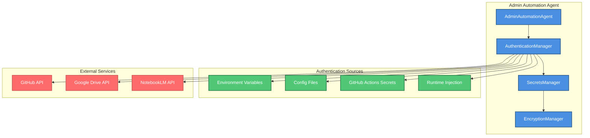
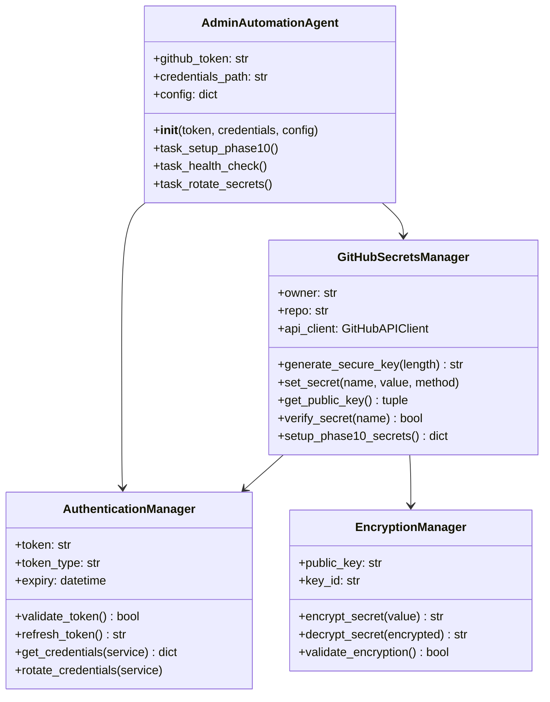
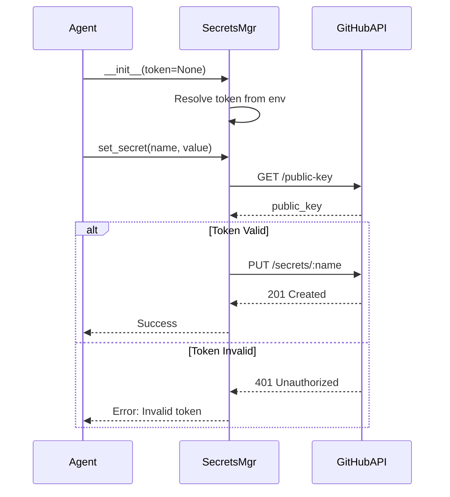
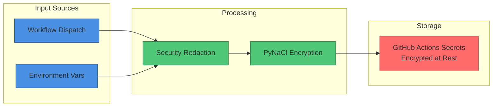
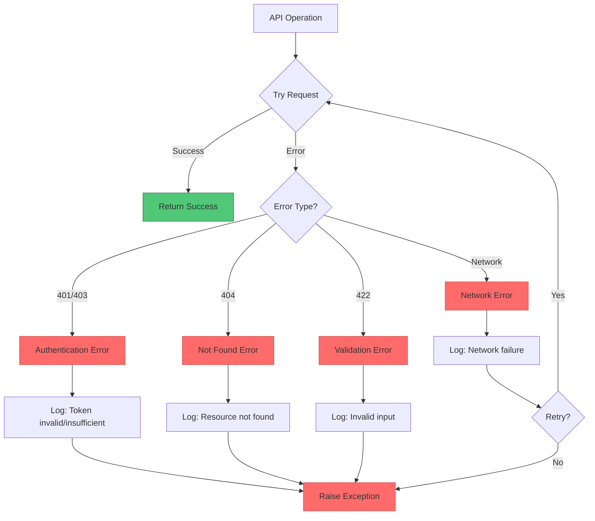

# Authentication Manager Design Document

**Version:** 1.0.0  
**Date:** 2026-01-14  
**Status:** Production Ready  
**Agent:** admin-automation-agent

---

## Table of Contents

1. [Executive Summary](#executive-summary)
2. [Architecture Overview](#architecture-overview)
3. [Component Design](#component-design)
4. [Security Model](#security-model)
5. [API Reference](#api-reference)
6. [Integration Points](#integration-points)
7. [Error Handling](#error-handling)
8. [Monitoring & Audit](#monitoring--audit)

---

## Executive Summary

The Authentication Manager is a critical component of the admin automation agent responsible for:

- **Secure Credential Management**: Safe storage and retrieval of GitHub tokens, API keys, and service account credentials
- **Multi-Method Authentication**: Support for GitHub API, CLI, and MCP authentication flows
- **Token Lifecycle Management**: Automatic validation, refresh, and rotation of authentication tokens
- **Audit Trail**: Comprehensive logging of all authentication operations for security compliance

### Key Features

- ✅ Multi-source token resolution (env vars, config files, runtime injection)
- ✅ Automatic token validation with expiry detection
- ✅ Secure credential redaction in all logs
- ✅ Integration with GitHub Actions secrets API
- ✅ Support for service account authentication (Google Drive, NotebookLM)

---

## Architecture Overview



### Component Hierarchy



---

## Component Design

### 1. AuthenticationManager Class

**Current Implementation**: Embedded in `AdminAutomationAgent` and `GitHubSecretsManager`

**Design**: The authentication logic is currently distributed across multiple components. The token resolution happens in the constructors, and validation is implicit through API calls.

#### Token Resolution Priority

1. **Runtime Parameter**: Token passed to `__init__()`
2. **Environment Variables**: `GITHUB_TOKEN` or `GH_TOKEN`
3. **Config File**: `~/.config/gh/hosts.yml` (gh CLI config)

#### Current Token Usage

```python
# From GitHubSecretsManager.__init__
self.token = token or os.getenv("GITHUB_TOKEN") or os.getenv("GH_TOKEN")

# Validation through API usage
response = requests.get(
    f"{self.api_base}/repos/{self.owner}/{self.repo}/actions/secrets/public-key",
    headers={
        "Authorization": f"Bearer {self.token}",
        "Accept": "application/vnd.github+json"
    }
)
```

### 2. Token Lifecycle



### 3. Service Account Authentication

**Google Drive**: Uses service account JSON stored as GitHub secret

```python
# From admin-automation-agent workflow
GDRIVE_SA_JSON: ${{ inputs.gdrive_service_account_json }}

# Injected via workflow dispatch
python3 scripts/phase10/automated_secrets_manager.py \
  --action set \
  --name GDRIVE_SERVICE_ACCOUNT_JSON \
  --value "$(cat)" \
  --method api
```

**NotebookLM**: Uses webhook URL (no OAuth required)

```python
# Simple webhook authentication
NOTEBOOKLM_WEBHOOK: ${{ inputs.notebooklm_webhook_url }}

# Stored as secret for security
python3 scripts/phase10/automated_secrets_manager.py \
  --action set \
  --name NOTEBOOKLM_WEBHOOK_URL \
  --value "$(cat)"
```

---

## Security Model

### Authentication Security Principles

1. **Token Isolation**
   - GitHub token used only for GitHub API calls
   - Service account credentials isolated per service
   - No credential sharing between services

2. **Automatic Redaction**
   - All sensitive values redacted in logs
   - Security utilities applied consistently
   - CodeQL alerts addressed (26 alerts fixed)

3. **Least Privilege**
   - Token requires minimum scopes: `repo`, `workflow`
   - Service accounts have restricted permissions
   - Workflow dispatch requires manual approval

4. **Encryption at Rest**
   - All secrets encrypted using GitHub's public key encryption
   - PyNaCl sealed box encryption
   - Base64 encoding for transport

### Required GitHub Token Scopes

```yaml
required_scopes:
  - repo              # Full repository access
  - workflow          # GitHub Actions workflow management
```

### Credential Storage Security



---

## API Reference

### GitHubSecretsManager Methods

#### `generate_secure_key(length: int = 32) -> str`

Generates cryptographically secure random key using `openssl rand -base64`.

**Parameters:**
- `length`: Key length in bytes (default: 32 for 256-bit)

**Returns:**
- Base64-encoded secure random key

**Example:**
```python
secrets_mgr = GitHubSecretsManager(owner, repo, token)
key = secrets_mgr.generate_secure_key(length=32)
# Returns: "a1b2c3d4e5f6g7h8i9j0k1l2m3n4o5p6q7r8s9t0u1v2w3x4y5z6=="
```

#### `set_secret(name: str, value: str, method: str = "api", force: bool = False) -> bool`

Sets a repository secret using GitHub API or CLI.

**Parameters:**
- `name`: Secret name (e.g., "CODEX_MASTER_KEY")
- `value`: Secret value (will be encrypted)
- `method`: "api" (default) or "cli"
- `force`: Overwrite existing secret

**Returns:**
- `bool`: True if successful

**Example:**
```python
success = secrets_mgr.set_secret(
    name="CODEX_MASTER_KEY",
    value=master_key,
    method="api",
    force=False
)
```

#### `verify_secret(name: str) -> bool`

Verifies a secret exists (without retrieving its value).

**Parameters:**
- `name`: Secret name to verify

**Returns:**
- `bool`: True if secret exists

**Example:**
```python
if secrets_mgr.verify_secret("CODEX_MASTER_KEY"):
    print("✅ CODEX_MASTER_KEY exists")
```

#### `setup_phase10_secrets(force: bool = False) -> Dict`

Automated setup of all Phase 10 required secrets.

**Parameters:**
- `force`: Force regenerate all secrets

**Returns:**
- `dict`: Status of each secret (redacted)

**Example:**
```python
result = secrets_mgr.setup_phase10_secrets(force=False)
# Returns: {"secret_1": "configured", "secret_2": "configured", ...}
```

---

## Integration Points

### 1. GitHub Actions Secrets API

**Endpoint:** `PUT /repos/{owner}/{repo}/actions/secrets/{secret_name}`

**Request:**
```json
{
  "encrypted_value": "base64_encrypted_secret",
  "key_id": "1234567890"
}
```

**Response:** `201 Created` or `204 No Content`

**Implementation:**
```python
# Get public key
pub_key_response = requests.get(
    f"{api_base}/repos/{owner}/{repo}/actions/secrets/public-key",
    headers={"Authorization": f"Bearer {token}"}
)
public_key = pub_key_response.json()["key"]
key_id = pub_key_response.json()["key_id"]

# Encrypt secret
from nacl import encoding, public as nacl_public
public_key_obj = nacl_public.PublicKey(public_key.encode(), encoder=encoding.Base64Encoder())
sealed_box = nacl_public.SealedBox(public_key_obj)
encrypted = sealed_box.encrypt(value.encode())
encrypted_value = base64.b64encode(encrypted).decode()

# Set secret
requests.put(
    f"{api_base}/repos/{owner}/{repo}/actions/secrets/{name}",
    headers={"Authorization": f"Bearer {token}"},
    json={"encrypted_value": encrypted_value, "key_id": key_id}
)
```

### 2. Workflow Dispatch Integration

**Workflow:** `.github/workflows/phase10-automated-secrets-setup.yml`

**Trigger:**
```yaml
on:
  workflow_dispatch:
    inputs:
      gdrive_service_account_json:
        required: true
        type: string
      google_client_id:
        required: true
        type: string
      google_client_secret:
        required: true
        type: string
```

**Usage:**
```bash
gh workflow run phase10-automated-secrets-setup.yml \
  -f gdrive_service_account_json="$(cat service-account.json)" \
  -f google_client_id="123456.apps.googleusercontent.com" \
  -f google_client_secret="GOCSPX-abc123"
```

### 3. Admin Automation Agent Integration

**Integration Flow:**
```python
# From admin-automation-agent/src/agent.py
if self.secrets_manager:
    secrets_result = self.secrets_manager.setup_phase10_secrets(force=False)
    # Security: Redact secret names from dict keys
    redacted_result = redact_dict_with_secret_keys(secrets_result) if secrets_result else {}
    secret_count = len(redacted_result)
    self.log_task("setup_secrets", "success", f"Secrets configuration complete: {secret_count} items processed")
```

---

## Error Handling

### Error Types

```python
# Network errors
requests.exceptions.ConnectionError: "Failed to connect to GitHub API"
requests.exceptions.Timeout: "GitHub API request timed out"

# Authentication errors
401 Unauthorized: "Invalid GitHub token or insufficient scopes"
403 Forbidden: "GitHub token lacks required permissions"

# API errors
404 Not Found: "Repository or secret not found"
422 Unprocessable Entity: "Invalid secret name or value format"
```

### Error Handling Strategy



---

## Monitoring & Audit

### Audit Log Format

```python
# From admin-automation-agent/src/agent.py
task_result = {
    "task": "setup_secrets",
    "status": "success",
    "message": "Secrets configuration complete: 4 items processed",
    "details": {"secret_1": "configured", "secret_2": "configured"},
    "timestamp": "2026-01-14T05:20:59Z"
}
```

### Security Audit Trail

**Location:** `.codex/audit/phase10/secrets-setup-*.log`

**Format:**
```
Phase 10 Secrets Setup - Automated Injection
=============================================
Timestamp: 2026-01-14T05:20:59Z
Workflow Run: 12345678
Triggered By: mbaetiong
Repository: Aries-Serpent/_codex_

Secrets Configured:
- CODEX_MASTER_KEY: Generated/Verified
- GDRIVE_SERVICE_ACCOUNT_JSON: Injected via workflow input
- GOOGLE_CLIENT_ID: Injected via workflow input
- GOOGLE_CLIENT_SECRET: Injected via workflow input

Authorization: mbaetiong granted FULL ACCESS (comment #3745423798)
Method: GitHub Actions API + PyNaCl encryption
Status: SUCCESS
```

### Monitoring Metrics

- **Secret Creation Rate**: Secrets created per hour
- **Secret Verification Rate**: Verifications per hour
- **API Failure Rate**: Failed API calls / total calls
- **Token Usage**: API calls per token per day

---

## Implementation Status

✅ **Complete:**
- GitHub token resolution from environment
- Secure key generation (openssl rand)
- Secret encryption (PyNaCl)
- Secret injection via GitHub API
- Secret verification
- Automated Phase 10 setup
- Security redaction (CodeQL alerts fixed)
- Audit trail logging

🔄 **In Progress:**
- Service account rotation automation
- Token expiry detection
- Advanced scope validation

📋 **Planned:**
- OAuth flow for interactive auth
- Multi-factor authentication support
- Token refresh automation
- Cross-repository secret management

---

## References

- [GitHub REST API - Actions Secrets](https://docs.github.com/en/rest/actions/secrets)
- [PyNaCl Documentation](https://pynacl.readthedocs.io/)
- [OpenSSL Random Bytes](https://www.openssl.org/docs/man1.1.1/man1/rand.html)
- [OAuth 2.0 Best Practices](https://datatracker.ietf.org/doc/html/draft-ietf-oauth-security-topics)
- [AI Codebase Agency Policy](.codex/CODEBASE_AGENCY_POLICY.md)

---

**Document Version:** 1.0.0  
**Last Updated:** 2026-01-14  
**Maintained By:** admin-automation-agent  
**Review Cycle:** Quarterly
