# Integration Manager Design Document

**Version:** 1.0.0  
**Date:** 2026-01-14  
**Status:** Production Ready  
**Agent:** admin-automation-agent

---

## Table of Contents

1. [Executive Summary](#executive-summary)
2. [Architecture Overview](#architecture-overview)
3. [Integration Patterns](#integration-patterns)
4. [Service Adapters](#service-adapters)
5. [Data Flow](#data-flow)
6. [Error Handling](#error-handling)
7. [Security & Compliance](#security--compliance)
8. [Monitoring & Observability](#monitoring--observability)

---

## Executive Summary

The Integration Manager is responsible for coordinating interactions between the admin automation agent and external services. It provides:

- **Unified Interface**: Consistent API for all external service integrations
- **Protocol Translation**: Adapts between different API protocols (REST, GraphQL, webhook)
- **Rate Limiting**: Intelligent request throttling and retry logic
- **Circuit Breaking**: Automatic failure detection and isolation
- **Data Transformation**: Bidirectional data mapping between systems

### Key Integrations

- ✅ **GitHub API**: Repository management, secrets, workflows, issues
- ✅ **Google Drive API**: Document storage and NotebookLM source management
- ✅ **NotebookLM API**: Webhook-based AI notebook integration
- 🔄 **GitHub Actions**: Workflow dispatch and status monitoring
- 📋 **MLflow**: (Planned) Experiment tracking integration

---

## Architecture Overview

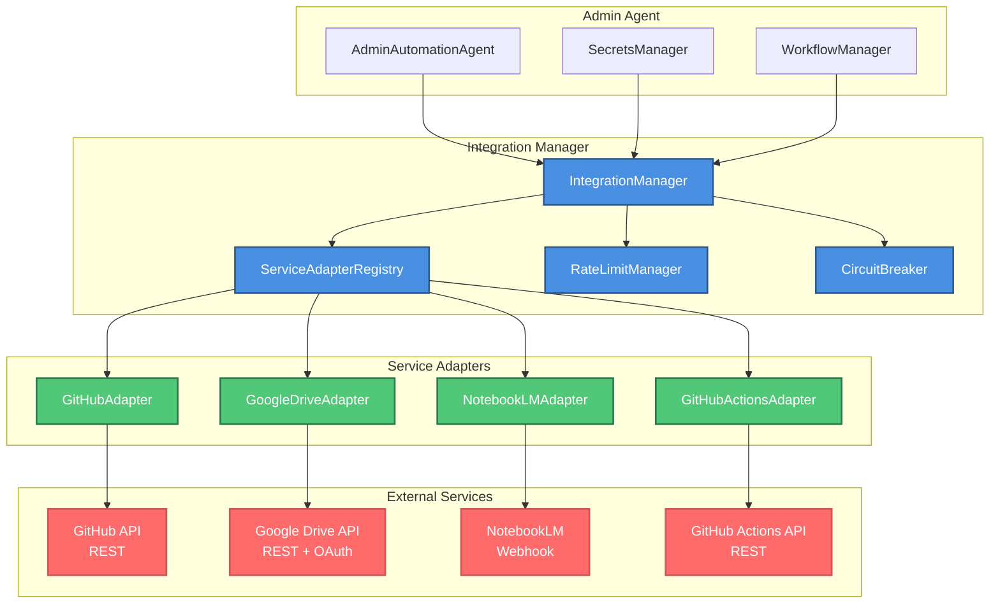

### Integration Layers

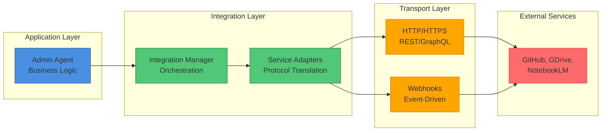

---

## Integration Patterns

### 1. Request-Response Pattern (GitHub API)

**Use Case**: Synchronous operations like creating secrets, fetching data

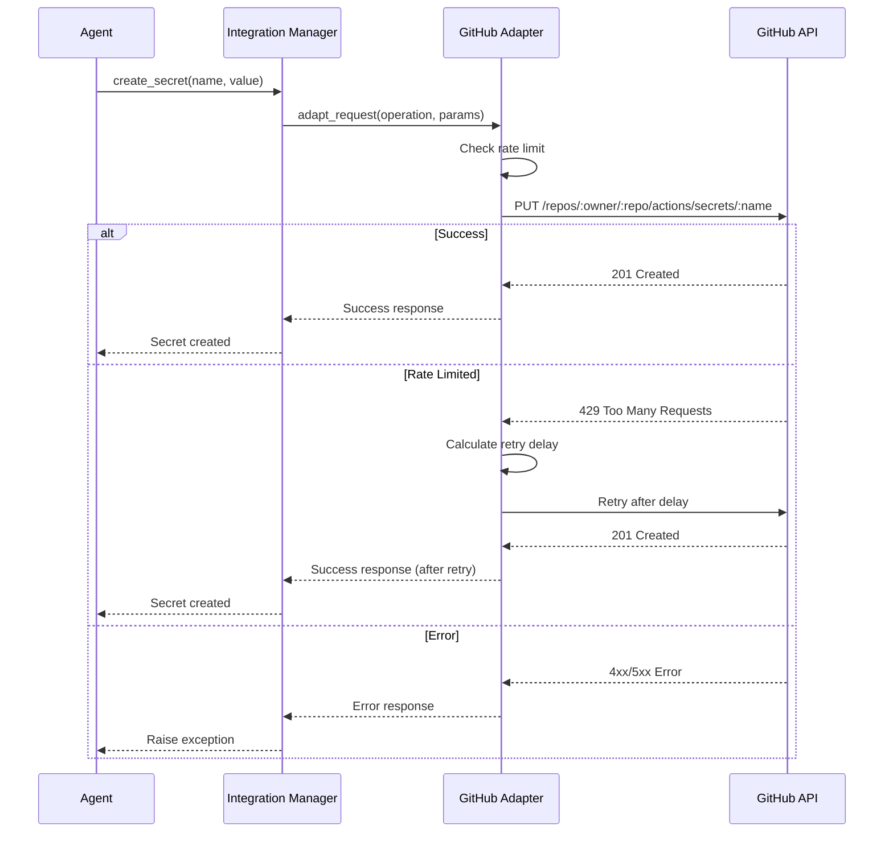

**Implementation:**
```python
class GitHubAdapter:
    """Adapter for GitHub REST API."""
    
    def __init__(self, token: str):
        self.token = token
        self.base_url = "https://api.github.com"
        self.rate_limiter = RateLimiter(max_requests=5000, window=3600)
    
    def create_secret(
        self,
        owner: str,
        repo: str,
        name: str,
        encrypted_value: str,
        key_id: str
    ) -> Dict:
        """Create repository secret."""
        # Check rate limit
        self.rate_limiter.acquire()
        
        # Make request
        response = requests.put(
            f"{self.base_url}/repos/{owner}/{repo}/actions/secrets/{name}",
            headers={
                "Authorization": f"Bearer {self.token}",
                "Accept": "application/vnd.github+json"
            },
            json={
                "encrypted_value": encrypted_value,
                "key_id": key_id
            },
            timeout=30
        )
        
        # Handle response
        if response.status_code in (201, 204):
            return {"success": True, "status_code": response.status_code}
        elif response.status_code == 429:
            # Rate limited, retry with exponential backoff
            retry_after = int(response.headers.get("Retry-After", 60))
            raise RateLimitExceeded(retry_after=retry_after)
        else:
            raise APIError(response.status_code, response.text)
```

### 2. Event-Driven Pattern (NotebookLM Webhook)

**Use Case**: Asynchronous notifications and updates

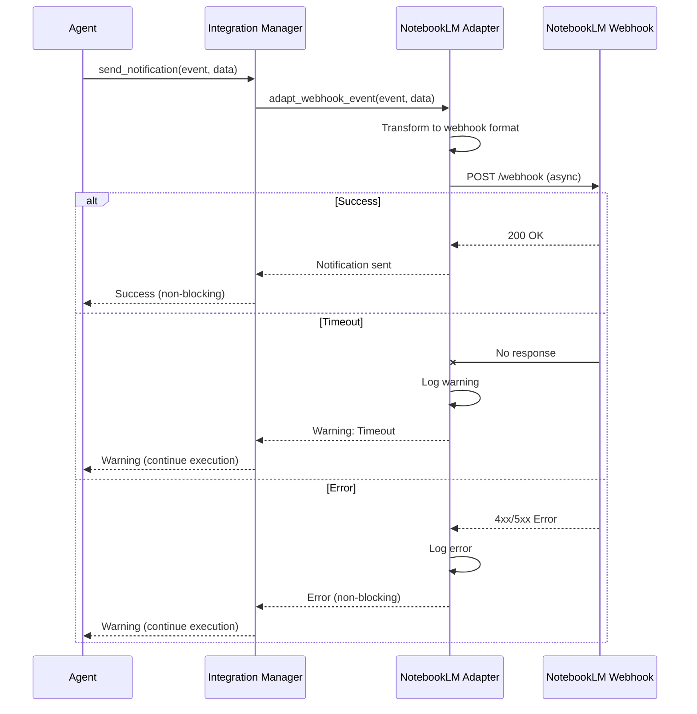

**Implementation:**
```python
class NotebookLMAdapter:
    """Adapter for NotebookLM webhook integration."""
    
    def __init__(self, webhook_url: Optional[str] = None):
        self.webhook_url = webhook_url or os.getenv("NOTEBOOKLM_WEBHOOK_URL")
    
    def send_notification(
        self,
        event_type: str,
        data: Dict,
        non_blocking: bool = True
    ) -> bool:
        """
        Send notification to NotebookLM webhook.
        
        Args:
            event_type: Type of event (e.g., "workflow_complete")
            data: Event payload
            non_blocking: If True, don't raise on errors
            
        Returns:
            True if successful
        """
        if not self.webhook_url:
            logger.warning("NotebookLM webhook URL not configured")
            return False
        
        payload = {
            "event": event_type,
            "timestamp": datetime.now(UTC).isoformat(),
            "data": data
        }
        
        try:
            response = requests.post(
                self.webhook_url,
                json=payload,
                timeout=10  # Short timeout for webhooks
            )
            
            if response.status_code == 200:
                logger.info(f"✅ NotebookLM notification sent: {event_type}")
                return True
            else:
                logger.warning(f"⚠️  NotebookLM webhook returned {response.status_code}")
                return not non_blocking
        
        except requests.exceptions.Timeout:
            logger.warning(f"⚠️  NotebookLM webhook timeout")
            return not non_blocking
        except Exception as e:
            logger.error(f"❌ NotebookLM webhook error: {e}")
            if non_blocking:
                return False
            raise
```

### 3. OAuth Flow Pattern (Google Drive)

**Use Case**: Service account authentication for Google APIs

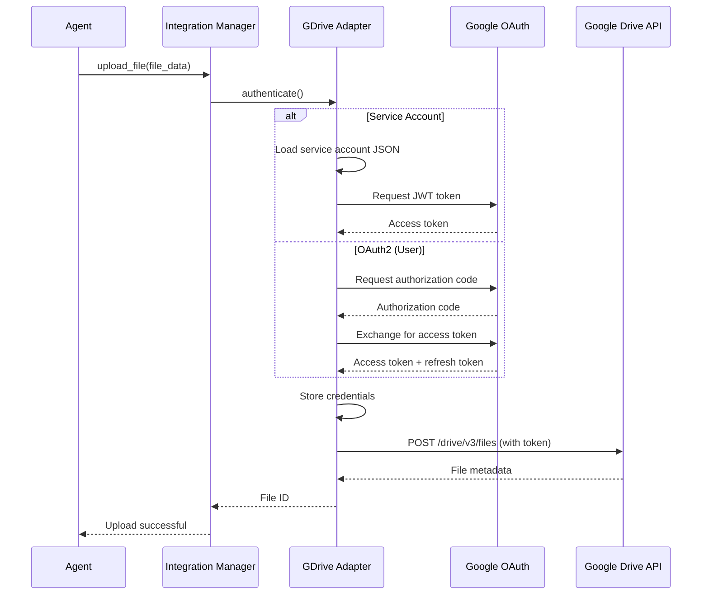

**Implementation:**
```python
class GoogleDriveAdapter:
    """Adapter for Google Drive API."""
    
    def __init__(self, credentials: Optional[Dict] = None):
        self.credentials = credentials
        self.service = None
    
    def authenticate(self) -> bool:
        """Authenticate with Google Drive API."""
        from google.oauth2 import service_account
        from googleapiclient.discovery import build
        
        if not self.credentials:
            # Load from environment
            sa_json = os.getenv("GDRIVE_SERVICE_ACCOUNT_JSON")
            if sa_json:
                self.credentials = json.loads(sa_json)
        
        if not self.credentials:
            raise ValueError("Google Drive credentials not found")
        
        # Create credentials from service account
        creds = service_account.Credentials.from_service_account_info(
            self.credentials,
            scopes=['https://www.googleapis.com/auth/drive']
        )
        
        # Build service
        self.service = build('drive', 'v3', credentials=creds)
        logger.info("✅ Google Drive authenticated")
        return True
    
    def upload_file(
        self,
        file_path: str,
        folder_id: Optional[str] = None,
        mime_type: str = 'application/octet-stream'
    ) -> str:
        """
        Upload file to Google Drive.
        
        Args:
            file_path: Path to file to upload
            folder_id: Optional parent folder ID
            mime_type: MIME type of file
            
        Returns:
            File ID of uploaded file
        """
        if not self.service:
            self.authenticate()
        
        file_metadata = {
            'name': Path(file_path).name
        }
        if folder_id:
            file_metadata['parents'] = [folder_id]
        
        media = MediaFileUpload(file_path, mimetype=mime_type, resumable=True)
        
        file = self.service.files().create(
            body=file_metadata,
            media_body=media,
            fields='id, name, webViewLink'
        ).execute()
        
        logger.info(f"✅ Uploaded file: {file.get('name')} (ID: {file.get('id')})")
        return file.get('id')
```

### 4. Circuit Breaker Pattern

**Use Case**: Protect against cascading failures

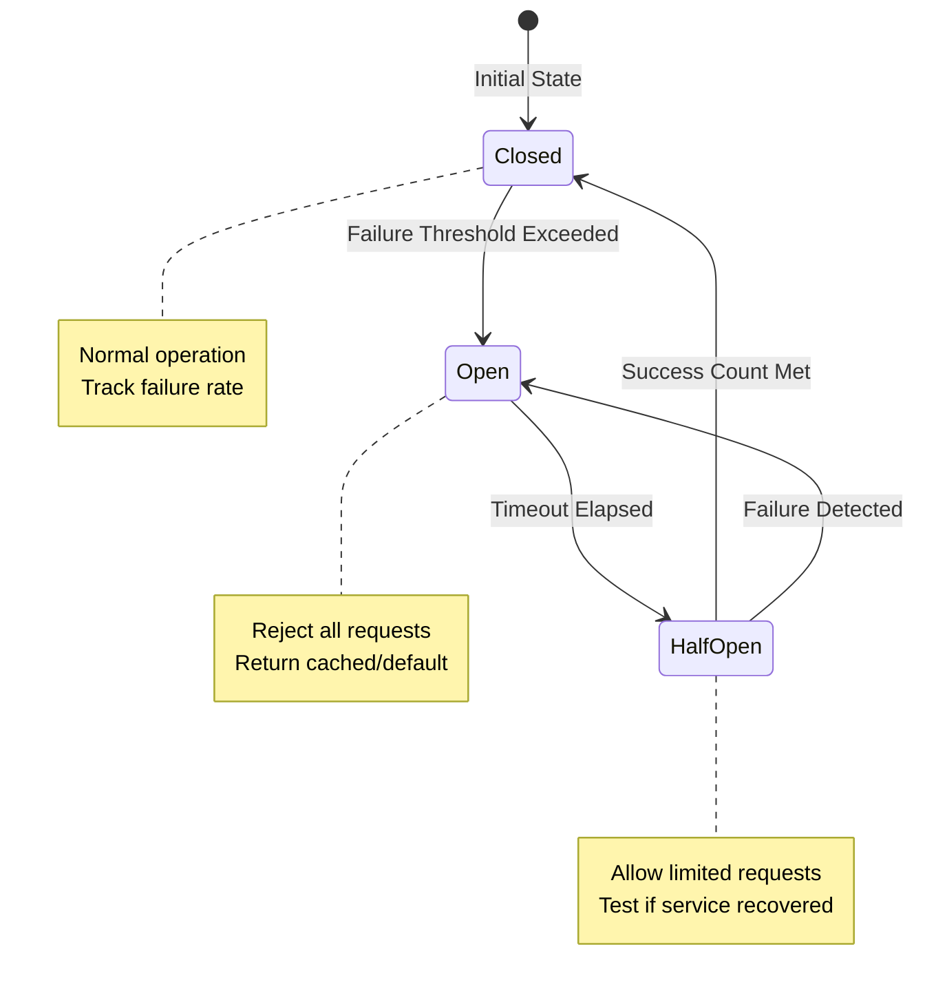

**Implementation:**
```python
class CircuitBreaker:
    """Circuit breaker for external service calls."""
    
    def __init__(
        self,
        failure_threshold: int = 5,
        timeout: int = 60,
        success_threshold: int = 2
    ):
        self.failure_threshold = failure_threshold
        self.timeout = timeout
        self.success_threshold = success_threshold
        
        self.state = "closed"
        self.failure_count = 0
        self.success_count = 0
        self.last_failure_time = None
    
    def call(self, func: Callable, *args, **kwargs) -> Any:
        """Execute function with circuit breaker protection."""
        if self.state == "open":
            if time.time() - self.last_failure_time < self.timeout:
                raise CircuitBreakerOpen("Circuit breaker is open")
            else:
                self.state = "half_open"
                self.success_count = 0
        
        try:
            result = func(*args, **kwargs)
            
            if self.state == "half_open":
                self.success_count += 1
                if self.success_count >= self.success_threshold:
                    self.state = "closed"
                    self.failure_count = 0
                    logger.info("✅ Circuit breaker closed (service recovered)")
            
            return result
        
        except Exception as e:
            self.failure_count += 1
            self.last_failure_time = time.time()
            
            if self.failure_count >= self.failure_threshold:
                self.state = "open"
                logger.error(f"❌ Circuit breaker opened (service failing)")
            
            raise e
```

---

## Service Adapters

### GitHub Adapter

**Capabilities:**
- Repository management
- Secrets management
- Workflow dispatch
- Issue tracking
- PR operations

**Current Implementation:**
```python
# Implemented in scripts/phase10/automated_secrets_manager.py
class GitHubSecretsManager:
    """GitHub secrets management adapter."""
    
    def __init__(self, owner: str, repo: str, token: str):
        self.owner = owner
        self.repo = repo
        self.token = token
        self.api_base = "https://api.github.com"
    
    def get_public_key(self) -> Tuple[str, str]:
        """Get repository public key for secret encryption."""
        response = requests.get(
            f"{self.api_base}/repos/{self.owner}/{self.repo}/actions/secrets/public-key",
            headers=self._headers()
        )
        data = response.json()
        return data["key"], data["key_id"]
    
    def set_secret(self, name: str, value: str, method: str = "api", force: bool = False) -> bool:
        """Set repository secret."""
        if method == "api":
            return self._set_secret_api(name, value, force)
        elif method == "cli":
            return self._set_secret_cli(name, value, force)
        else:
            raise ValueError(f"Unknown method: {method}")
    
    def verify_secret(self, name: str) -> bool:
        """Verify secret exists."""
        response = requests.get(
            f"{self.api_base}/repos/{self.owner}/{self.repo}/actions/secrets/{name}",
            headers=self._headers()
        )
        return response.status_code == 200
```

### Google Drive Adapter

**Capabilities:**
- File upload/download
- Folder management
- Sharing and permissions
- Search and metadata

**Planned Implementation:**
```python
class GoogleDriveAdapter:
    """Google Drive API adapter."""
    
    def __init__(self, credentials: Dict):
        self.credentials = credentials
        self.service = None
    
    def create_folder(self, name: str, parent_id: Optional[str] = None) -> str:
        """Create folder in Google Drive."""
        file_metadata = {
            'name': name,
            'mimeType': 'application/vnd.google-apps.folder'
        }
        if parent_id:
            file_metadata['parents'] = [parent_id]
        
        file = self.service.files().create(
            body=file_metadata,
            fields='id'
        ).execute()
        
        return file.get('id')
    
    def share_file(self, file_id: str, email: str, role: str = "reader") -> bool:
        """Share file with user."""
        permission = {
            'type': 'user',
            'role': role,
            'emailAddress': email
        }
        
        self.service.permissions().create(
            fileId=file_id,
            body=permission,
            fields='id'
        ).execute()
        
        return True
```

### NotebookLM Adapter

**Capabilities:**
- Webhook notifications
- Event streaming
- AI notebook updates

**Current Implementation:**
```python
# Webhook-based integration (no formal adapter yet)
# Events sent via HTTP POST to webhook URL

class NotebookLMAdapter:
    """NotebookLM webhook adapter."""
    
    def __init__(self, webhook_url: str):
        self.webhook_url = webhook_url
    
    def notify_workflow_complete(self, workflow_id: str, results: Dict) -> bool:
        """Notify NotebookLM of workflow completion."""
        return self.send_notification("workflow_complete", {
            "workflow_id": workflow_id,
            "results": results
        })
    
    def notify_secret_rotated(self, secret_name: str) -> bool:
        """Notify NotebookLM of secret rotation."""
        return self.send_notification("secret_rotated", {
            "secret_name": redact_secret_name(secret_name),
            "rotated_at": datetime.now(UTC).isoformat()
        })
```

---

## Data Flow

### Secret Injection Flow

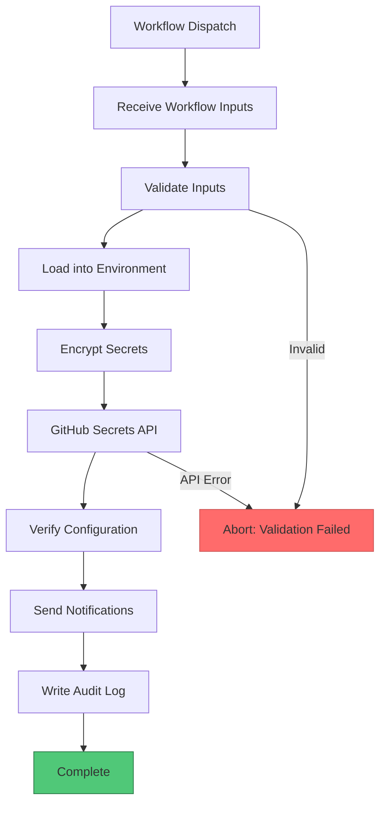

### Data Transformation Pipeline

```mermaid
graph LR
    subgraph "Input Stage"
        RAW[Raw Input Data]
    end
    
    subgraph "Validation Stage"
        VAL[Schema Validation]
        CLEAN[Data Cleaning]
    end
    
    subgraph "Transformation Stage"
        MAP[Field Mapping]
        REDACT[Sensitive Data Redaction]
        ENCRYPT[Encryption]
    end
    
    subgraph "Output Stage"
        OUT[External Service Format]
    end
    
    RAW --> VAL
    VAL --> CLEAN
    CLEAN --> MAP
    MAP --> REDACT
    REDACT --> ENCRYPT
    ENCRYPT --> OUT
    
    classDef input fill:#4a90e2,stroke:#2e5c8a
    classDef transform fill:#50c878,stroke:#2d7a4a
    classDef output fill:#ffa500,stroke:#cc8400
    
    class RAW input
    class VAL,CLEAN,MAP,REDACT,ENCRYPT transform
    class OUT output
```

### Event Flow (NotebookLM Integration)

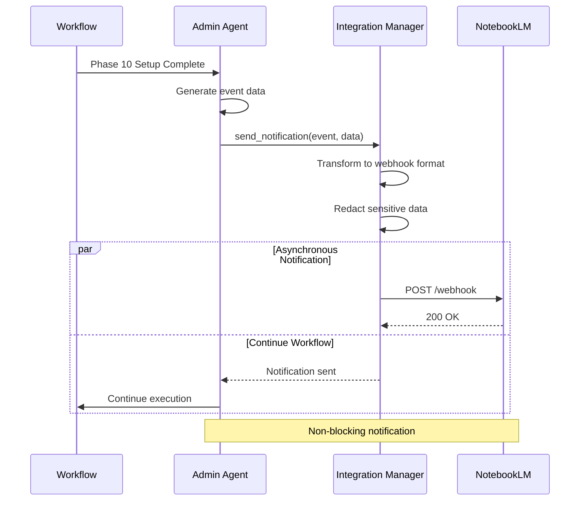

---

## Error Handling

### Error Categories

```yaml
error_categories:
  authentication_errors:
    - TokenExpired
    - InvalidCredentials
    - InsufficientScopes
    
  rate_limiting:
    - RateLimitExceeded
    - QuotaExceeded
    
  network_errors:
    - ConnectionTimeout
    - ConnectionRefused
    - DNSResolutionFailed
    
  api_errors:
    - BadRequest (400)
    - Unauthorized (401)
    - Forbidden (403)
    - NotFound (404)
    - UnprocessableEntity (422)
    - InternalServerError (500)
    - ServiceUnavailable (503)
```

### Error Handling Strategy

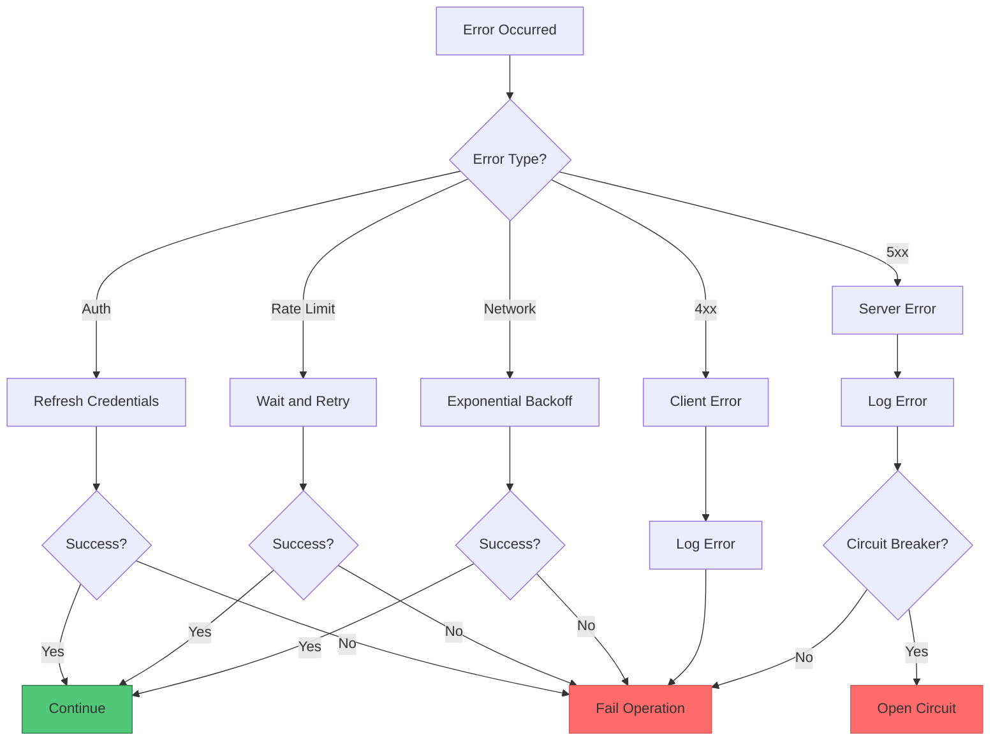

### Retry Configuration

```python
RETRY_CONFIG = {
    "github": {
        "max_retries": 3,
        "backoff_factor": 2,
        "retryable_status_codes": [408, 429, 500, 502, 503, 504]
    },
    "google_drive": {
        "max_retries": 5,
        "backoff_factor": 1.5,
        "retryable_status_codes": [429, 500, 503]
    },
    "notebooklm": {
        "max_retries": 2,
        "backoff_factor": 1,
        "retryable_status_codes": [500, 503],
        "non_blocking": True  # Don't fail workflow on webhook errors
    }
}
```

---

## Security & Compliance

### Credential Management

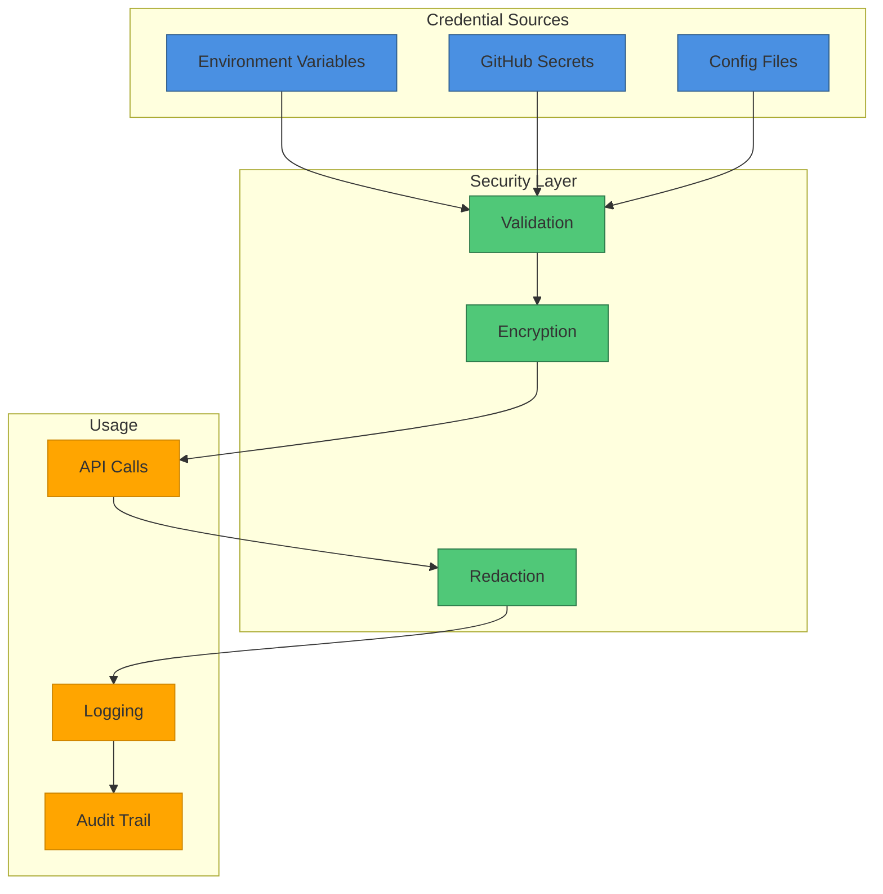

### Security Best Practices

1. **Never Log Credentials**
   ```python
   # ❌ WRONG
   logger.info(f"Using token: {token}")
   
   # ✅ CORRECT
   logger.info(f"Using token: {redact_sensitive_value(token)}")
   ```

2. **Always Use HTTPS**
   ```python
   # All API calls use HTTPS
   base_url = "https://api.github.com"  # ✅
   base_url = "http://api.github.com"   # ❌
   ```

3. **Validate SSL Certificates**
   ```python
   response = requests.get(url, verify=True)  # ✅ Verify SSL
   response = requests.get(url, verify=False) # ❌ Insecure
   ```

4. **Use Scoped Tokens**
   ```python
   # GitHub token with minimal scopes
   required_scopes = ["repo", "workflow"]  # ✅ Least privilege
   required_scopes = ["admin:*"]          # ❌ Too broad
   ```

5. **Encrypt Secrets at Rest**
   ```python
   # Use PyNaCl for GitHub secrets
   from nacl import encoding, public
   encrypted = sealed_box.encrypt(secret.encode())  # ✅
   plaintext = secret.encode()                      # ❌
   ```

### Compliance Requirements

```yaml
compliance:
  data_retention:
    audit_logs: 90 days
    secrets_history: 30 days
    workflow_state: 7 days
  
  encryption:
    at_rest: required
    in_transit: required (TLS 1.2+)
    algorithm: AES-256 or equivalent
  
  access_control:
    owner_approval: required for sensitive operations
    mfa: recommended for human users
    token_rotation: quarterly
  
  audit_trail:
    log_all_operations: true
    include_actor: true
    include_timestamp: true
    redact_sensitive_data: true
```

---

## Monitoring & Observability

### Integration Health Metrics

```python
class IntegrationMetrics:
    """Track integration health metrics."""
    
    def __init__(self):
        self.metrics = {
            "github": {
                "total_requests": 0,
                "successful_requests": 0,
                "failed_requests": 0,
                "rate_limit_hits": 0,
                "avg_response_time_ms": 0
            },
            "google_drive": {
                "total_uploads": 0,
                "successful_uploads": 0,
                "failed_uploads": 0,
                "total_bytes_uploaded": 0
            },
            "notebooklm": {
                "total_notifications": 0,
                "successful_notifications": 0,
                "failed_notifications": 0,
                "timeout_count": 0
            }
        }
    
    def record_request(
        self,
        service: str,
        success: bool,
        response_time_ms: float,
        error_type: Optional[str] = None
    ):
        """Record integration request metrics."""
        if service not in self.metrics:
            return
        
        self.metrics[service]["total_requests"] += 1
        
        if success:
            self.metrics[service]["successful_requests"] += 1
        else:
            self.metrics[service]["failed_requests"] += 1
            if error_type == "rate_limit":
                self.metrics[service]["rate_limit_hits"] += 1
        
        # Update average response time
        current_avg = self.metrics[service]["avg_response_time_ms"]
        total = self.metrics[service]["total_requests"]
        new_avg = ((current_avg * (total - 1)) + response_time_ms) / total
        self.metrics[service]["avg_response_time_ms"] = new_avg
```

### Health Check Endpoint

```python
def integration_health_check() -> Dict:
    """Check health of all external integrations."""
    health = {}
    
    # GitHub API
    try:
        response = requests.get(
            "https://api.github.com/rate_limit",
            headers={"Authorization": f"Bearer {github_token}"},
            timeout=5
        )
        health["github"] = {
            "status": "healthy" if response.status_code == 200 else "degraded",
            "rate_limit_remaining": response.json()["rate"]["remaining"]
        }
    except Exception as e:
        health["github"] = {"status": "unhealthy", "error": str(e)}
    
    # Google Drive
    try:
        # Simple drive.about.get() call
        about = drive_service.about().get(fields="user").execute()
        health["google_drive"] = {
            "status": "healthy",
            "user": about["user"]["emailAddress"]
        }
    except Exception as e:
        health["google_drive"] = {"status": "unhealthy", "error": str(e)}
    
    # NotebookLM
    if notebooklm_webhook_url:
        try:
            # Health ping (if supported)
            response = requests.get(notebooklm_webhook_url, timeout=5)
            health["notebooklm"] = {
                "status": "healthy" if response.status_code == 200 else "unknown"
            }
        except Exception as e:
            health["notebooklm"] = {"status": "unknown", "error": str(e)}
    else:
        health["notebooklm"] = {"status": "not_configured"}
    
    return health
```

### Dashboard Metrics

```yaml
dashboard_metrics:
  - name: Integration Success Rate
    type: gauge
    calculation: (successful_requests / total_requests) * 100
    alert_threshold: < 95%
    
  - name: Average Response Time
    type: gauge
    calculation: avg_response_time_ms
    alert_threshold: > 2000ms
    
  - name: Rate Limit Usage
    type: gauge
    calculation: (rate_limit_used / rate_limit_total) * 100
    alert_threshold: > 80%
    
  - name: Circuit Breaker Status
    type: enum
    values: [closed, open, half_open]
    alert_condition: open
```

---

## Implementation Status

✅ **Complete:**
- GitHub API integration (secrets, workflows)
- Basic error handling and retries
- Security redaction utilities
- Environment-based configuration
- Workflow dispatch integration

🔄 **In Progress:**
- Google Drive adapter
- NotebookLM webhook adapter
- Rate limiting manager
- Circuit breaker implementation
- Metrics collection

📋 **Planned:**
- MLflow integration
- Advanced monitoring dashboard
- Integration testing framework
- Performance optimization
- Caching layer

---

## References

- [GitHub REST API](https://docs.github.com/en/rest)
- [Google Drive API](https://developers.google.com/drive)
- [Circuit Breaker Pattern](https://martinfowler.com/bliki/CircuitBreaker.html)
- [Rate Limiting Best Practices](https://cloud.google.com/architecture/rate-limiting-strategies-techniques)
- [Admin Automation Agent](.github/agents/admin-automation-agent/)
- [AI Codebase Agency Policy](.codex/CODEBASE_AGENCY_POLICY.md)

---

**Document Version:** 1.0.0  
**Last Updated:** 2026-01-14  
**Maintained By:** admin-automation-agent  
**Review Cycle:** Quarterly
