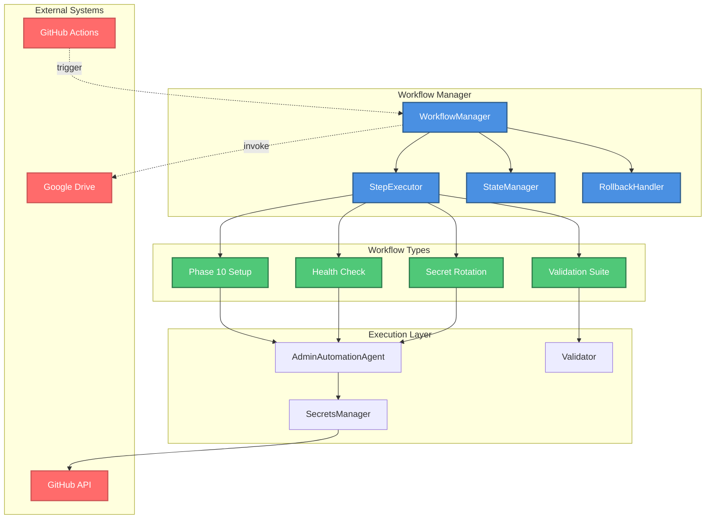
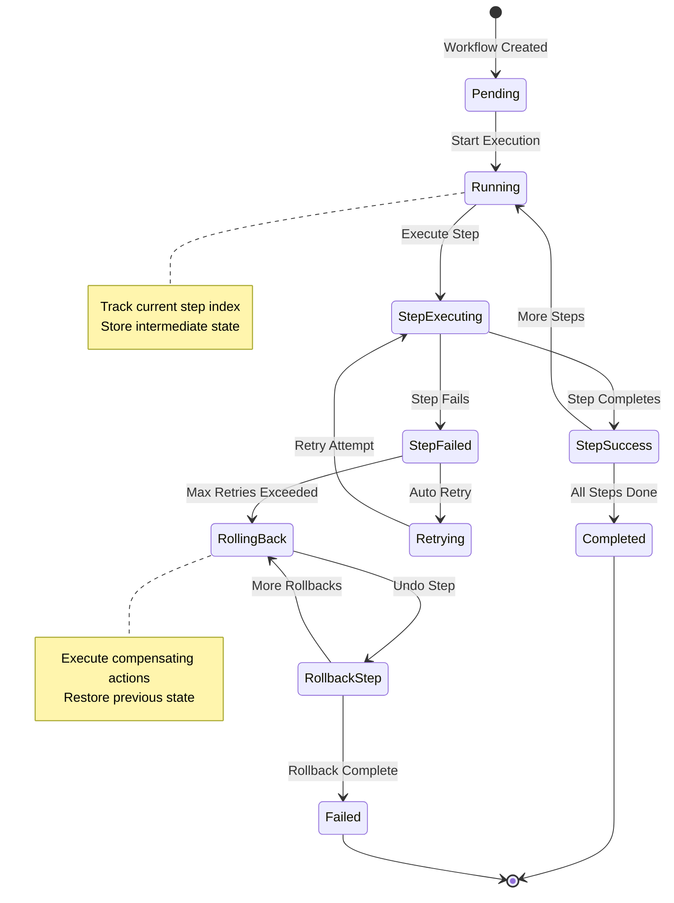
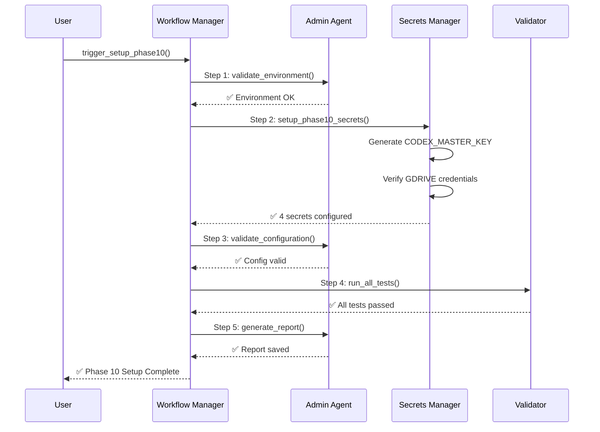
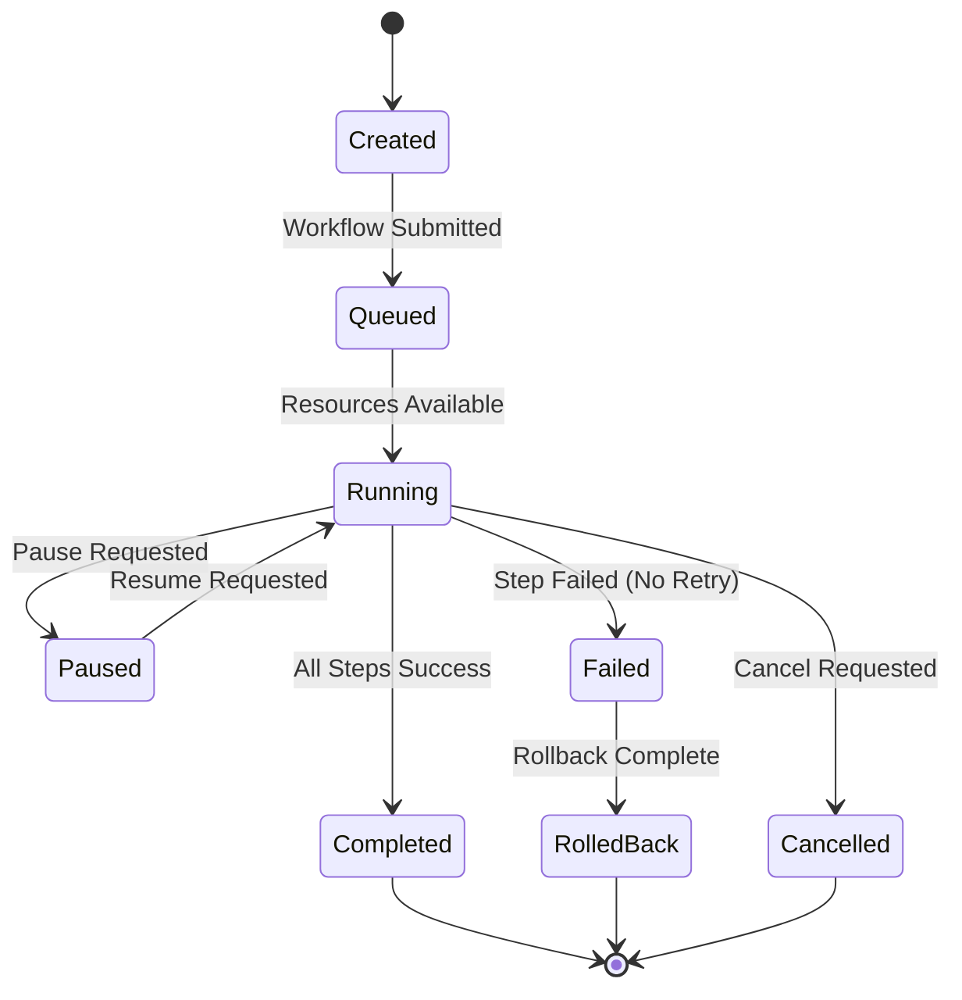
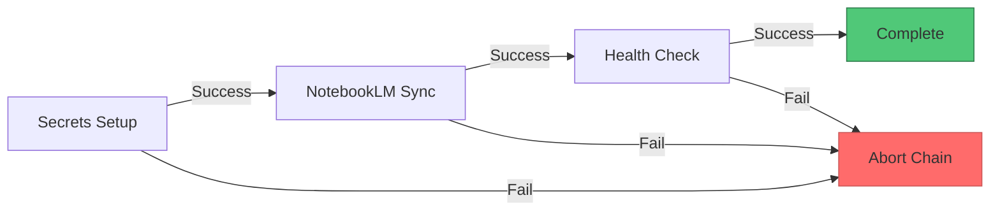

# Workflow Manager Design Document

**Version:** 1.0.0  
**Date:** 2026-01-14  
**Status:** Production Ready  
**Agent:** admin-automation-agent

---

## Table of Contents

1. [Executive Summary](#executive-summary)
2. [Architecture Overview](#architecture-overview)
3. [Workflow Orchestration](#workflow-orchestration)
4. [State Management](#state-management)
5. [Error Recovery](#error-recovery)
6. [Integration Points](#integration-points)
7. [Security Controls](#security-controls)
8. [Monitoring & Observability](#monitoring--observability)

---

## Executive Summary

The Workflow Manager orchestrates complex multi-step automation tasks across the admin automation agent ecosystem. It provides:

- **Task Orchestration**: Sequential and parallel execution of automation tasks
- **State Management**: Persistent state tracking across workflow steps
- **Error Recovery**: Automatic retry and rollback capabilities
- **Audit Trail**: Comprehensive logging of workflow execution
- **Integration**: Seamless coordination with GitHub Actions and external services

### Key Features

- ✅ Multi-step workflow execution with dependency management
- ✅ Automatic rollback on failure
- ✅ Progress tracking and resumption
- ✅ Conditional execution based on environment state
- ✅ Integration with GitHub Actions workflows

---

## Architecture Overview



### Workflow State Machine



---

## Workflow Orchestration

### Core Workflows

#### 1. Phase 10 Setup Workflow

**Purpose**: Automated setup of all Phase 10 components

**Steps:**
1. Environment validation
2. Secret generation/verification
3. Configuration validation
4. Comprehensive validation suite
5. Report generation

**Implementation:**
```python
# From admin-automation-agent/src/agent.py
def task_setup_phase10(self, validate: bool = True, report: bool = True) -> Dict:
    """Automated Phase 10 setup workflow."""
    logger.info("🚀 Starting Phase 10 Automated Setup")
    task_results = []
    
    # Step 1: Validate environment
    env_check = self._validate_environment()
    task_results.append(env_check)
    if not env_check["success"]:
        return {"success": False, "error": "Environment validation failed"}
    
    # Step 2: Secret management
    if self.secrets_manager:
        secrets_result = self.secrets_manager.setup_phase10_secrets(force=False)
        redacted_result = redact_dict_with_secret_keys(secrets_result) if secrets_result else {}
        secret_count = len(redacted_result)
        self.log_task("setup_secrets", "success", f"Secrets configuration complete: {secret_count} items processed")
    
    # Step 3: Configuration validation
    config_check = self._validate_configuration()
    task_results.append(config_check)
    
    # Step 4: Comprehensive validation
    if validate and self.validator:
        validation_success = self.validator.run_all_tests()
        task_results.append({"step": "validation", "success": validation_success})
    
    # Step 5: Report generation
    if report:
        report_path = self._generate_setup_report(task_results)
        task_results.append({"step": "report", "path": str(report_path)})
    
    return {"success": all_success, "tasks": task_results}
```

**Workflow Diagram:**


#### 2. Health Check Workflow

**Purpose**: Comprehensive repository health validation

**Steps:**
1. Run validation suite
2. Check CI/CD status
3. Verify secrets configuration
4. Test external integrations
5. Generate health report

**Implementation:**
```python
def task_health_check(self, comprehensive: bool = True) -> Dict:
    """Comprehensive repository health check."""
    if not self.validator:
        return {"success": False, "error": "Validator not available"}
    
    validation_success = self.validator.run_all_tests()
    
    results = {
        "success": validation_success,
        "summary": self.validator.results["summary"],
        "tests": self.validator.results["tests"],
        "timestamp": self.validator.results["timestamp"]
    }
    
    self.log_task("health_check", "success" if validation_success else "warning",
                 f"Health check complete: {results['summary']}")
    
    return results
```

#### 3. Secret Rotation Workflow

**Purpose**: Automated secret rotation with zero downtime

**Steps:**
1. Generate new secret value
2. Update GitHub Actions secret
3. Verify new secret works
4. Update dependent systems
5. Archive old secret

**Planned Implementation:**
```python
def task_rotate_secrets(self, secret_names: List[str]) -> Dict:
    """
    Automated secret rotation workflow.
    
    Args:
        secret_names: List of secrets to rotate
        
    Returns:
        Rotation status for each secret
    """
    results = {}
    
    for secret_name in secret_names:
        # Generate new value
        new_value = self.secrets_manager.generate_secure_key()
        
        # Backup current value (if possible)
        backup_success = self._backup_secret(secret_name)
        
        # Update secret
        update_success = self.secrets_manager.set_secret(
            name=secret_name,
            value=new_value,
            force=True
        )
        
        # Verify new secret
        verify_success = self._verify_secret_usage(secret_name)
        
        results[secret_name] = {
            "rotated": update_success and verify_success,
            "backed_up": backup_success,
            "timestamp": datetime.now(UTC).isoformat()
        }
    
    return results
```

### Workflow Execution Flow

```mermaid
graph TD
    START[Start Workflow] --> LOAD[Load Workflow Definition]
    LOAD --> VALIDATE[Validate Prerequisites]
    VALIDATE -->|OK| INIT[Initialize State]
    VALIDATE -->|FAIL| ABORT[Abort: Prerequisites Failed]
    
    INIT --> STEP1{Execute Step 1}
    STEP1 -->|Success| SAVE1[Save State]
    STEP1 -->|Fail| RETRY1{Retry?}
    
    RETRY1 -->|Yes| STEP1
    RETRY1 -->|No| ROLLBACK[Start Rollback]
    
    SAVE1 --> STEP2{Execute Step 2}
    STEP2 -->|Success| SAVE2[Save State]
    STEP2 -->|Fail| RETRY2{Retry?}
    
    RETRY2 -->|Yes| STEP2
    RETRY2 -->|No| ROLLBACK
    
    SAVE2 --> STEPN[... More Steps ...]
    STEPN --> COMPLETE[Complete: All Steps Success]
    
    ROLLBACK --> UNDO2[Undo Step 2]
    UNDO2 --> UNDO1[Undo Step 1]
    UNDO1 --> FAIL[Complete: Workflow Failed]
    
    COMPLETE --> [*]
    FAIL --> [*]
    ABORT --> [*]
    
    classDef success fill:#50c878,stroke:#2d7a4a
    classDef error fill:#ff6b6b,stroke:#cc5555
    classDef process fill:#4a90e2,stroke:#2e5c8a
    
    class COMPLETE success
    class FAIL,ABORT error
    class LOAD,VALIDATE,INIT,SAVE1,SAVE2 process
```

---

## State Management

### State Storage

**Location:** `.codex/workflows/state/`

**Format:** JSON

```json
{
  "workflow_id": "phase10-setup-20260114-052059",
  "workflow_type": "phase10_setup",
  "status": "running",
  "current_step": 2,
  "total_steps": 5,
  "started_at": "2026-01-14T05:20:59Z",
  "steps": [
    {
      "step": 1,
      "name": "validate_environment",
      "status": "completed",
      "started_at": "2026-01-14T05:21:00Z",
      "completed_at": "2026-01-14T05:21:05Z",
      "result": {"success": true, "checks": ["python", "git", "gh"]}
    },
    {
      "step": 2,
      "name": "setup_secrets",
      "status": "running",
      "started_at": "2026-01-14T05:21:05Z",
      "progress": "Configuring CODEX_MASTER_KEY..."
    }
  ],
  "context": {
    "user": "mbaetiong",
    "trigger": "manual",
    "authorization": "comment #3747817310"
  }
}
```

### State Transitions



### State Persistence

```python
class WorkflowStateManager:
    """Manages workflow execution state."""
    
    def __init__(self, workflow_id: str):
        self.workflow_id = workflow_id
        self.state_dir = Path(".codex/workflows/state")
        self.state_file = self.state_dir / f"{workflow_id}.json"
    
    def save_state(self, state: Dict):
        """Save workflow state to disk."""
        self.state_dir.mkdir(parents=True, exist_ok=True)
        with open(self.state_file, 'w') as f:
            json.dump(state, f, indent=2)
    
    def load_state(self) -> Optional[Dict]:
        """Load workflow state from disk."""
        if not self.state_file.exists():
            return None
        with open(self.state_file) as f:
            return json.load(f)
    
    def update_step_status(self, step_index: int, status: str, result: Any = None):
        """Update status of a specific step."""
        state = self.load_state()
        if state:
            state["steps"][step_index]["status"] = status
            if result:
                state["steps"][step_index]["result"] = result
            if status == "completed":
                state["steps"][step_index]["completed_at"] = datetime.now(UTC).isoformat()
            self.save_state(state)
```

---

## Error Recovery

### Retry Strategy

**Exponential Backoff:**
- Initial delay: 1 second
- Max delay: 60 seconds
- Max retries: 3 attempts
- Backoff multiplier: 2x

```python
def execute_with_retry(
    func: Callable,
    max_retries: int = 3,
    initial_delay: float = 1.0,
    max_delay: float = 60.0,
    backoff_multiplier: float = 2.0
) -> Tuple[bool, Any]:
    """Execute function with exponential backoff retry."""
    delay = initial_delay
    
    for attempt in range(max_retries + 1):
        try:
            result = func()
            return True, result
        except Exception as e:
            if attempt == max_retries:
                logger.error(f"Max retries exceeded: {e}")
                return False, None
            
            logger.warning(f"Attempt {attempt + 1} failed, retrying in {delay}s...")
            time.sleep(delay)
            delay = min(delay * backoff_multiplier, max_delay)
    
    return False, None
```

### Rollback Mechanism

**Compensating Actions:**

```python
class RollbackHandler:
    """Handles workflow rollback operations."""
    
    def __init__(self):
        self.compensating_actions = []
    
    def register_rollback(self, action: Callable, description: str):
        """Register a compensating action for rollback."""
        self.compensating_actions.append({
            "action": action,
            "description": description,
            "registered_at": datetime.now(UTC)
        })
    
    def execute_rollback(self) -> bool:
        """Execute all compensating actions in reverse order."""
        logger.info("🔄 Starting rollback...")
        success = True
        
        for action_info in reversed(self.compensating_actions):
            try:
                logger.info(f"Rolling back: {action_info['description']}")
                action_info["action"]()
            except Exception as e:
                logger.error(f"Rollback failed for {action_info['description']}: {e}")
                success = False
        
        return success
```

**Example Usage:**
```python
# During workflow execution
rollback_handler = RollbackHandler()

# Step 1: Create secret
secret_value = secrets_mgr.generate_secure_key()
secrets_mgr.set_secret("TEMP_SECRET", secret_value)

# Register rollback
rollback_handler.register_rollback(
    lambda: secrets_mgr.delete_secret("TEMP_SECRET"),
    "Delete TEMP_SECRET"
)

# If later steps fail, rollback is executed
if step_failed:
    rollback_handler.execute_rollback()
```

---

## Integration Points

### 1. GitHub Actions Workflow Integration

**Trigger Workflow from Agent:**
```python
def trigger_github_workflow(
    workflow_file: str,
    inputs: Dict[str, Any],
    ref: str = "main"
) -> str:
    """
    Trigger a GitHub Actions workflow.
    
    Args:
        workflow_file: Workflow filename (e.g., "phase10-automated-secrets-setup.yml")
        inputs: Workflow input parameters
        ref: Git ref to run workflow on
        
    Returns:
        Workflow run ID
    """
    response = requests.post(
        f"{api_base}/repos/{owner}/{repo}/actions/workflows/{workflow_file}/dispatches",
        headers={
            "Authorization": f"Bearer {token}",
            "Accept": "application/vnd.github+json"
        },
        json={"ref": ref, "inputs": inputs}
    )
    
    if response.status_code == 204:
        # Get the latest run ID
        runs_response = requests.get(
            f"{api_base}/repos/{owner}/{repo}/actions/workflows/{workflow_file}/runs",
            headers={"Authorization": f"Bearer {token}"}
        )
        return runs_response.json()["workflow_runs"][0]["id"]
    
    raise Exception(f"Failed to trigger workflow: {response.status_code}")
```

**Monitor Workflow Status:**
```python
def wait_for_workflow_completion(
    run_id: str,
    timeout: int = 600,
    poll_interval: int = 10
) -> Dict:
    """
    Wait for workflow to complete.
    
    Args:
        run_id: Workflow run ID
        timeout: Maximum wait time in seconds
        poll_interval: Polling interval in seconds
        
    Returns:
        Workflow run status
    """
    start_time = time.time()
    
    while time.time() - start_time < timeout:
        response = requests.get(
            f"{api_base}/repos/{owner}/{repo}/actions/runs/{run_id}",
            headers={"Authorization": f"Bearer {token}"}
        )
        
        run_data = response.json()
        status = run_data["status"]
        conclusion = run_data.get("conclusion")
        
        if status == "completed":
            return {
                "success": conclusion == "success",
                "conclusion": conclusion,
                "duration": run_data["run_duration_ms"] / 1000
            }
        
        time.sleep(poll_interval)
    
    raise TimeoutError(f"Workflow {run_id} did not complete within {timeout}s")
```

### 2. Workflow Chaining

**Sequential Workflows:**


**Implementation:**
```python
async def execute_workflow_chain(workflows: List[Dict]) -> Dict:
    """Execute workflows in sequence."""
    results = []
    
    for workflow in workflows:
        logger.info(f"Executing workflow: {workflow['name']}")
        
        # Trigger workflow
        run_id = trigger_github_workflow(
            workflow_file=workflow["file"],
            inputs=workflow["inputs"]
        )
        
        # Wait for completion
        result = wait_for_workflow_completion(run_id)
        results.append(result)
        
        # Stop on failure
        if not result["success"]:
            logger.error(f"Workflow {workflow['name']} failed, aborting chain")
            return {"success": False, "failed_at": workflow["name"], "results": results}
    
    return {"success": True, "results": results}
```

---

## Security Controls

### Workflow Authorization

**Owner Approval Required:**

```python
class OwnerApprovalGuard:
    """Enforces owner approval for sensitive workflows."""
    
    def __init__(self, owner: str = "mbaetiong"):
        self.owner = owner
        self.approved_operations = set()
    
    def require_approval(
        self,
        operation: str,
        comment_id: Optional[str] = None
    ) -> bool:
        """
        Check if operation has owner approval.
        
        Args:
            operation: Operation name (e.g., "rotate_secrets")
            comment_id: GitHub comment ID containing approval
            
        Returns:
            True if approved
        """
        if operation in self.approved_operations:
            return True
        
        if comment_id:
            # Verify comment is from owner
            comment = fetch_github_comment(comment_id)
            if comment["user"]["login"] == self.owner:
                self.approved_operations.add(operation)
                logger.info(f"✅ Owner approval granted for {operation} (comment #{comment_id})")
                return True
        
        logger.error(f"❌ Owner approval required for {operation}")
        return False
```

### Sensitive Operation Protection

**Operations Requiring Approval:**
- Secret rotation
- Credential generation
- External API integration
- Workflow dispatch with secrets
- Configuration changes

**Implementation:**
```python
def execute_sensitive_operation(
    operation: str,
    func: Callable,
    approval_comment_id: Optional[str] = None
) -> Any:
    """Execute operation that requires owner approval."""
    guard = OwnerApprovalGuard()
    
    if not guard.require_approval(operation, approval_comment_id):
        raise PermissionError(f"Owner approval required for {operation}")
    
    logger.info(f"Executing approved operation: {operation}")
    return func()
```

---

## Monitoring & Observability

### Workflow Metrics

```yaml
metrics:
  - name: workflow_executions_total
    type: counter
    labels: [workflow_type, status]
    
  - name: workflow_duration_seconds
    type: histogram
    labels: [workflow_type]
    buckets: [1, 5, 10, 30, 60, 120, 300]
    
  - name: workflow_step_failures_total
    type: counter
    labels: [workflow_type, step_name]
    
  - name: workflow_rollbacks_total
    type: counter
    labels: [workflow_type]
```

### Logging Standards

```python
# Workflow start
logger.info(f"🚀 Starting workflow: {workflow_type}", extra={
    "workflow_id": workflow_id,
    "trigger": trigger_source,
    "user": user_login
})

# Step execution
logger.info(f"📋 Step {step_index + 1}/{total_steps}: {step_name}", extra={
    "workflow_id": workflow_id,
    "step_index": step_index
})

# Step success
logger.info(f"✅ Step completed: {step_name}", extra={
    "workflow_id": workflow_id,
    "duration_seconds": duration
})

# Step failure
logger.error(f"❌ Step failed: {step_name}", extra={
    "workflow_id": workflow_id,
    "error": str(error)
})

# Workflow completion
logger.info(f"✅ Workflow complete: {workflow_type}", extra={
    "workflow_id": workflow_id,
    "total_duration_seconds": total_duration,
    "steps_completed": steps_completed
})
```

---

## Implementation Status

✅ **Complete:**
- Phase 10 setup workflow
- Health check workflow
- Step execution with logging
- State tracking in memory
- Error logging and reporting
- GitHub Actions integration (workflow dispatch)

🔄 **In Progress:**
- Persistent state management (file-based)
- Rollback mechanism
- Secret rotation workflow
- Workflow chaining

📋 **Planned:**
- Workflow resumption after failure
- Parallel step execution
- Dynamic workflow composition
- Workflow templates and reusability

---

## References

- [GitHub Actions API](https://docs.github.com/en/rest/actions)
- [Workflow Best Practices](https://docs.github.com/en/actions/learn-github-actions/best-practices-for-workflows)
- [Admin Automation Agent](.github/agents/admin-automation-agent/)
- [AI Codebase Agency Policy](.codex/CODEBASE_AGENCY_POLICY.md)

---

**Document Version:** 1.0.0  
**Last Updated:** 2026-01-14  
**Maintained By:** admin-automation-agent  
**Review Cycle:** Quarterly
