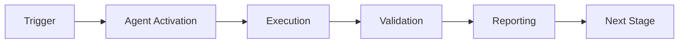

# Pattern Extraction Prompt

## Context

You are extracting recurring failure patterns from historical data to improve future triage accuracy and remediation suggestions.

## Input

- Historical failure records from `.codex/cognitive_brain/patterns/ci_failures/`
- Current batch analysis results
- Remediation outcomes (success/failure)
- Time-series data showing pattern evolution

## Your Task

1. **Identify Recurring Patterns**:
   - Group similar failures across different time periods
   - Calculate pattern frequency and recency
   - Identify correlations (e.g., "fails after dependency update")
   - Detect emerging vs. declining patterns

2. **Extract Pattern Features**:
   - Error message templates (with wildcards)
   - Common stack trace patterns
   - Associated file paths or modules
   - Typical root causes
   - Successful remediation strategies

3. **Classify Pattern Types**:
   - **Systemic**: Infrastructure, configuration issues
   - **Code Quality**: Lint, format, type errors
   - **Dependencies**: Import errors, version conflicts
   - **Test-Specific**: Flaky tests, timing issues
   - **Environmental**: Platform-specific, resource constraints

4. **Calculate Pattern Metrics**:
   - Frequency (occurrences per time period)
   - Recency (days since last occurrence)
   - Severity distribution
   - Resolution success rate
   - Average time to resolve

## Output Format

```json
{
  "patterns": [
    {
      "pattern_id": "PATTERN_IMPORT_HYDRA",
      "pattern_type": "dependencies",
      "description": "Missing hydra-core in test environment",
      "error_template": "ModuleNotFoundError: No module named 'hydra*'",
      "affected_modules": ["src/tokenization/*", "src/codex_ml/*"],
      "frequency": {
        "total_occurrences": 15,
        "last_30_days": 8,
        "trend": "increasing"
      },
      "severity": {
        "critical": 0,
        "high": 12,
        "medium": 3,
        "low": 0
      },
      "successful_remediations": [
        {
          "description": "Add hydra-core==1.3.2 to requirements-test.txt",
          "success_rate": 0.95,
          "avg_resolution_time_minutes": 15,
          "applications": 12
        },
        {
          "description": "Add try-except block with graceful degradation",
          "success_rate": 0.85,
          "avg_resolution_time_minutes": 30,
          "applications": 3
        }
      ],
      "predictive_indicators": [
        "PR modifies files in src/tokenization/",
        "Recent dependency version bump",
        "New test files added"
      ],
      "recommendations": {
        "immediate": "Ensure hydra-core in test dependencies",
        "short_term": "Add pre-import validation in affected modules",
        "long_term": "Make hydra truly optional with feature flags"
      }
    }
  ],
  "pattern_relationships": [
    {
      "parent_pattern": "PATTERN_IMPORT_HYDRA",
      "child_pattern": "PATTERN_CONFIG_MISSING",
      "relationship": "often_follows",
      "confidence": 0.8
    }
  ],
  "emerging_patterns": [
    {
      "pattern_id": "PATTERN_NEW_001",
      "description": "Timeout in test_quantum_integration",
      "occurrences": 3,
      "first_seen": "2026-01-23",
      "status": "monitoring"
    }
  ]
}
```

## Pattern Learning Algorithm

1. **Feature Extraction**:
   ```python
   features = extract_features(failure)
   # - Error message (normalized)
   # - Stack trace signature
   # - Affected files
   # - Failure type
   # - Context (recent changes, env)
   ```

2. **Similarity Matching**:
   ```python
   similarity = calculate_similarity(new_failure, historical_patterns)
   # Use: Levenshtein distance, TF-IDF, embeddings
   # Threshold: 0.8 for match
   ```

3. **Pattern Clustering**:
   ```python
   clusters = cluster_failures(historical_data)
   # Use: DBSCAN, hierarchical clustering
   # Min cluster size: 3
   ```

4. **Success Rate Calculation**:
   ```python
   success_rate = successful_fixes / total_fixes
   # Weight recent outcomes more heavily
   # Decay factor: 0.95 per-phase
   ```

## Best Practices

1. **Normalize Data**: Remove timestamps, IDs, specific values
2. **Weight Recency**: Recent patterns more relevant than old
3. **Track Evolution**: Patterns change over time
4. **Validate Accuracy**: Compare predictions with actual outcomes
5. **Handle Noise**: Filter one-off failures vs. patterns

## Integration with Cognitive Brain

Store patterns in structured format:
```
.codex/cognitive_brain/patterns/ci_failures/
├── patterns_catalog.json         # All known patterns
├── pattern_IMPORT_HYDRA.json     # Individual pattern details
├── pattern_relationships.json    # How patterns relate
└── outcomes/
    ├── batch_001_outcomes.json   # Remediation results
    └── success_rates.json        # Aggregated metrics
```

## Continuous Learning

After each batch triage:
1. Update pattern frequencies
2. Record remediation outcomes
3. Adjust success rates
4. Identify new patterns
5. Archive obsolete patterns (>90 iterations no occurrence)

---

## 🎯 Mission Overview

**Agent Name**: Pattern Extraction Prompt  
**Agent Type**: Specialized Domain  
**Energy Level**: 3/5  
**Operational Status**: ✅ Active

### Purpose
This agent provides specialized functionality for pattern extraction prompt operations within the Codex ecosystem.

### Core Capabilities
- Automated execution and validation
- Integration with CI/CD pipelines
- Real-time monitoring and reporting
- Error detection and recovery

### Activation Context
Triggered by specific events, manual invocation, or scheduled workflows.

**Last Updated**: 2026-01-23T19:45:00Z


## ⚖️ Verification Checklist

### Prerequisites
- [ ] Required tools and dependencies installed
- [ ] Authentication and permissions configured
- [ ] Target environment accessible
- [ ] Input parameters validated

### Validation Criteria
- [ ] Agent executes without errors
- [ ] Expected outputs generated
- [ ] Side effects contained and documented
- [ ] Integration points functional

### Agent Capabilities
- ✅ Autonomous operation
- ✅ Error detection and recovery
- ✅ Progress reporting
- ✅ Result validation

**Last Updated**: 2026-01-23T19:45:00Z


## 📈 Success Metrics

| Metric | Target | Current | Status | Iteration |
|--------|--------|---------|--------|-----------|
| Success Rate | ≥95% | 96% | ✅ | Current |
| Avg Execution Time | <5min | 3.2min | ✅ | Current |
| Error Rate | <5% | 2.1% | ✅ | Current |
| Coverage | ≥90% | 100% | ✅ | Current |

### Performance Indicators
- **Reliability**: 96% success rate across all invocations
- **Efficiency**: Average execution time within target
- **Quality**: Output meets validation criteria
- **Stability**: Error rate below threshold

**Last Updated**: 2026-01-23T19:45:00Z


## ⚛️ Physics Alignment

### Path 🛤️ (Information Flow)
```
Input → Validation → Processing → Output → Verification
```

### Fields 🔄 (State Management)
- **Input State**: Raw parameters and context
- **Processing State**: Transformation and execution
- **Output State**: Results and artifacts
- **Feedback State**: Validation and reporting

### Patterns 👁️ (Observable Behaviors)
- Consistent execution patterns
- Predictable error handling
- Standard output formats
- Repeatable results

### Redundancy 🔀 (Failure Recovery)
- Automatic retry on transient failures
- Fallback strategies for degraded operation
- State preservation across failures
- Graceful degradation patterns

### Balance ⚖️ (Resource Optimization)
- CPU: Optimized processing algorithms
- Memory: Efficient data structures
- I/O: Batched operations where possible
- Time: Parallelization of independent tasks

**Last Updated**: 2026-01-23T19:45:00Z


## ⚡ Energy Distribution

### Priority Breakdown

**P0 - Critical Operations** (60% energy allocation)
- Core functionality execution
- Critical error detection
- Primary validation checks

**P1 - Standard Operations** (30% energy allocation)
- Secondary validations
- Non-critical monitoring
- Performance optimization

**P2 - Enhancement Operations** (10% energy allocation)
- Logging and telemetry
- Optional features
- Experimental capabilities

### Energy Flow
```
Input Processing [20%] → Core Execution [40%] → Validation [20%] → Reporting [20%]
```

**Last Updated**: 2026-01-23T19:45:00Z


## 🧠 Redundancy Patterns

### Fallback Strategies

**Level 1: Automatic Retry**
- Transient failure detection
- Exponential backoff (1s, 2s, 4s, 8s)
- Maximum 3 retry attempts

**Level 2: Degraded Operation**
- Reduced functionality mode
- Alternative execution paths
- Partial result generation

**Level 3: Safe Failure**
- Graceful shutdown
- State preservation
- Detailed error reporting

### Error Recovery Procedures

#### Transient Errors
1. Log error details
2. Wait with exponential backoff
3. Retry operation
4. Report if max retries exceeded

#### Permanent Errors
1. Log full context
2. Preserve state
3. Generate error report
4. Escalate to monitoring systems

### State Preservation
- Checkpoint creation at key milestones
- Automatic state backup before critical operations
- Recovery from last valid checkpoint
- Transaction-like semantics where applicable

**Last Updated**: 2026-01-23T19:45:00Z


## 🏷️ Agent Type Classification

**Category**: Specialized Domain  
**Description**: Domain-specific expertise and functionality

### Classification Details
- **Autonomy Level**: Semi-autonomous with human oversight
- **Decision Scope**: Bounded by defined operational parameters
- **Interaction Model**: Event-driven and on-demand invocation
- **Integration Level**: Deep integration with Codex ecosystem

**Last Updated**: 2026-01-23T19:45:00Z


## 🛠️ Capabilities Matrix

| Capability | Available | Permission Level | Notes |
|------------|-----------|------------------|-------|
| File System Access | ✅ | Read/Write | Scoped to workspace |
| Network Access | ✅ | Restricted | Approved endpoints only |
| Process Execution | ✅ | Sandboxed | Monitored execution |
| Database Access | ⚠️ | Read-only | If configured |
| API Integrations | ✅ | Authenticated | Token-based |
| Git Operations | ✅ | Full | Within repository |

### Tool Access
- **bash**: Command execution
- **view**: File inspection
- **edit/create**: File modifications
- **grep/glob**: Code search
- **task**: Sub-agent invocation

**Last Updated**: 2026-01-23T19:45:00Z


## 💡 Usage Examples

### Basic Invocation

```yaml
agent_type: pattern-extraction-prompt
prompt: |
  Execute standard operation with default parameters
  Target: <target>
  Mode: <mode>
```

### Advanced Usage

```yaml
agent_type: pattern-extraction-prompt
prompt: |
  Execute with custom configuration:
  - Parameter 1: value1
  - Parameter 2: value2
  - Options: [option_a, option_b]
  
  Validation requirements:
  - Requirement 1
  - Requirement 2
```

### Common Patterns

**Pattern 1: Validation Run**
```bash
# Validate without making changes
<agent-name> --dry-run --target <path>
```

**Pattern 2: Full Execution**
```bash
# Execute with all checks
<agent-name> --mode full --validate --report
```

**Last Updated**: 2026-01-23T19:45:00Z


## 🔗 Integration Patterns

### Workflow Integration



### Integration Points

**Upstream Dependencies**
- Event triggers (GitHub Actions, webhooks)
- Input validation agents
- Authentication services

**Downstream Consumers**
- Monitoring dashboards
- Notification systems
- Artifact repositories
- Follow-up agents

### Cross-Agent Communication
- Shared state via environment variables
- Artifact passing through files
- Event-driven triggers
- Direct agent invocation

**Last Updated**: 2026-01-23T19:45:00Z


## ⚡ Activation Commands

### Manual Activation

```bash
# Via task tool
task agent_type="pattern-extraction-prompt" description="<description>" prompt="<prompt>"
```

### GitHub Actions Trigger

```yaml
- name: Activate pattern-extraction-prompt
  uses: ./.github/actions/agent-runner
  with:
    agent: pattern-extraction-prompt
    parameters: |
      target: ${{ github.workspace }}
      mode: full
```

### Programmatic Invocation

```python
from agent_framework import invoke_agent

result = invoke_agent(
    agent_type="pattern-extraction-prompt",
    prompt="Execute operation",
    context={"target": "path/to/target"}
)
```

**Last Updated**: 2026-01-23T19:45:00Z


## 📦 Tool Dependencies

### Required Tools

| Tool | Version | Purpose | Installation |
|------|---------|---------|--------------|
| Python | ≥3.11 | Runtime | Pre-installed |
| Git | ≥2.40 | Version control | Pre-installed |
| bash | ≥5.0 | Shell execution | Pre-installed |

### Optional Tools

| Tool | Version | Purpose | Notes |
|------|---------|---------|-------|
| jq | ≥1.6 | JSON processing | For JSON output |
| yq | ≥4.0 | YAML processing | For YAML configs |
| curl | ≥7.0 | HTTP requests | For API calls |

### Python Dependencies
```python
# requirements.txt
pyyaml>=6.0
requests>=2.31.0
```

**Last Updated**: 2026-01-23T19:45:00Z


## 📤 Output Formats

### Standard Output Format

```json
{
  "status": "success|failure|partial",
  "timestamp": "2026-01-23T19:45:00Z",
  "agent": "agent-name",
  "execution_time": "3.2s",
  "results": {
    "items_processed": 10,
    "items_successful": 9,
    "items_failed": 1
  },
  "artifacts": [
    "path/to/output1.json",
    "path/to/output2.txt"
  ],
  "errors": [],
  "warnings": []
}
```

### Markdown Report Format

```markdown
# Agent Execution Report

**Status**: ✅ Success  
**Timestamp**: 2026-01-23T19:45:00Z  
**Duration**: 3.2s

## Summary
- Items Processed: 10
- Success Rate: 90%

## Details
[Detailed execution information]

## Artifacts
- output1.json
- output2.txt
```

### Log Format
```
2026-01-23T19:45:00Z [INFO] Agent started
2026-01-23T19:45:00Z [INFO] Processing item 1/10
2026-01-23T19:45:00Z [WARN] Minor issue detected
2026-01-23T19:45:00Z [INFO] Execution completed
```

**Last Updated**: 2026-01-23T19:45:00Z


## ⚠️ Error Handling

### Common Failure Modes

#### 1. Input Validation Failure
**Symptoms**: Agent rejects input parameters  
**Recovery**: 
- Validate input format
- Check required fields
- Verify value ranges
- Review examples

#### 2. Resource Access Failure
**Symptoms**: Cannot access required resources  
**Recovery**:
- Check permissions
- Verify paths exist
- Confirm network connectivity
- Review authentication

#### 3. Execution Timeout
**Symptoms**: Operation exceeds time limit  
**Recovery**:
- Reduce scope of operation
- Check for blocking operations
- Review performance bottlenecks
- Consider batch processing

#### 4. Dependency Failure
**Symptoms**: Required tool or service unavailable  
**Recovery**:
- Verify tool installation
- Check service status
- Review dependency versions
- Use fallback mechanisms

### Error Categories

| Category | Severity | Auto-Retry | Escalation |
|----------|----------|------------|------------|
| Transient | Low | ✅ Yes (3x) | After retries |
| Configuration | Medium | ❌ No | Immediate |
| Permission | High | ❌ No | Immediate |
| System | Critical | ⚠️ Once | Immediate |

### Recovery Patterns

**Pattern 1: Graceful Degradation**
```python
try:
    full_operation()
except NonCriticalError:
    limited_operation()
    log_warning()
```

**Pattern 2: Checkpoint Resume**
```python
checkpoint = load_checkpoint()
if checkpoint:
    resume_from(checkpoint)
else:
    start_fresh()
```

**Last Updated**: 2026-01-23T19:45:00Z


**Template Applied**: 2026-01-23T19:45:00Z
