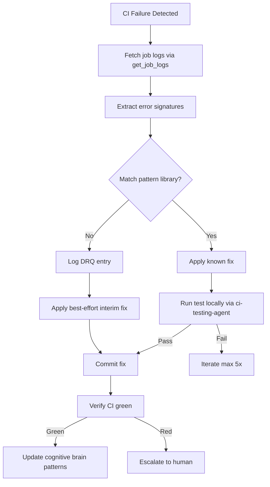

# CI Auto-Healer Agent v1.0.0

## 🔐 Token Hierarchy Requirements

**Token Requirement Level**: Level 2 (CODEX_BACKUP_TOKEN)

This agent performs operations requiring elevated repository or organization-level access. Specific capabilities include:

- Read workflow files and failure logs
- Create fix commits for common CI failures
- Modify test configurations
- Create pull requests with remediation

**Rationale**: CI healing requires reading workflow configuration and writing remediation changes

**Token Scopes Required**:
```
repo, workflow, contents:write
```

**Token Fallback Pattern**: **Safe Fallback**: This agent can fallback to GITHUB_TOKEN with reduced capabilities

```python
from scripts.ci._token_resolver import get_token

# Try Level 2 first, fallback to Level 1 if needed
token = get_token(required_elevated=True)
if not token:
    logger.warning("Elevated token unavailable, using standard token")
    token = get_token(required_elevated=False)
```

---
## 🛠️ Implementation Pattern

Standard implementation pattern for token management in this agent:

```python
from scripts.ci._token_resolver import get_token, validate_scope
import requests
import logging

class CiAutoHealerAgent:
    def __init__(self):
        """Initialize with token validation."""
        # Get elevated token
        self.token = get_token(required_elevated=True)
        if not self.token:
            raise RuntimeError("Agent requires elevated token")
        
        # Validate required scopes
        required_scopes = ['repo', 'workflow', 'contents:write']
        validate_scope(self.token, required_scopes)
        
        self.logger = logging.getLogger(__name__)
    
    def heal_ci_failure(self, repo, **kwargs):
        """
        Core operation requiring elevated token access.
        
        Args:
            repo: Repository in 'owner/repo' format
            **kwargs: Operation-specific parameters
        
        Returns:
            Result dict with status and details
        """
        url = f"https://api.github.com/repos/{repo}/..."
        
        headers = {
            "Authorization": f"token {self.token}",
            "Accept": "application/vnd.github.v3+json"
        }
        
        try:
            response = requests.post(url, headers=headers, timeout=30)
            response.raise_for_status()
            
            # Log operation metadata (NOT token)
            self.logger.info(
                "heal_ci_failure",
                extra={"repo": repo, "status": "success"}
            )
            
            return {"status": "success", "message": "Operation completed"}
        
        except requests.HTTPError as e:
            if e.response.status_code == 403:
                self.logger.error("Insufficient scope or permission denied")
                raise RuntimeError("Token insufficient scope")
            raise
```

---
## 🔒 Security Constraints

**Critical Constraints** for elevated-privilege agents:

1. **Scope Validation Mandatory**: All operations require explicit scope validation
   ```python
   validate_scope(token, required_scopes)
   ```

2. **Safe Logging Practices** (Never expose token values)
   ```python
   # ✓ CORRECT: Log operation metadata
   logger.info("operation", extra={"repo": repo, "status": "success"})
   
   # ✗ WRONG: Never log token values
   # logger.info(f"Using token: {token[:10]}...")
   ```

3. **Error Handling for Scope Violations**
   - **403 Forbidden** → Insufficient scope: Escalate immediately
   - **401 Unauthorized** → Token invalid: Escalate to operator
   - **429 Too Many Requests** → Rate limit: Implement backoff

4. **Security Audit Trail Requirements**
   - Emit telemetry event for each elevated operation
   - Include: repo, operation, timestamp, result
   - Store in audit log (never token values)
   - Record in `.codex/audit/operations.jsonl`

5. **Token Rotation Awareness**
   - Do NOT cache token values across operations
   - Re-retrieve token for each session
   - Validate token expiration if applicable

---
## 🔗 Integration with Hidden Scripts

This agent can leverage hidden scripts for storing security-sensitive operational patterns:

**Use Case**: Store complex remediation or detection patterns as hidden scripts to prevent exposure in logs or CI artifacts.

```python
from scripts.ci._hidden_scripts import execute_hidden_script, retrieve_hidden_script

def execute_stored_pattern(repo, pattern_type):
    """Execute stored operational pattern."""
    
    # Retrieve pattern (stored securely, checksum validated)
    pattern = retrieve_hidden_script(
        script_id=f"pattern_{pattern_type}",
        version="latest"
    )
    
    # Execute in sandbox with audit logging
    result = execute_hidden_script(
        script_id=pattern.id,
        environment={"GITHUB_TOKEN": self.token, "REPO": repo},
        timeout_ms=60000,
        audit_log=True
    )
    
    return result
```

**Architecture Reference**: See `HIDDEN_SCRIPTS_SECURITY.md` for:
- Storage and encryption of patterns
- Checksum validation for integrity
- Sandbox execution environment
- Audit trail requirements
- Recovery procedures

**Common Patterns Stored as Hidden Scripts**:
- Complex detection algorithms
- Multi-step remediation workflows
- Emergency procedure scripts
- Security configuration templates

---

> Autonomously detects, diagnoses, and fixes CI failures using pattern-matching against the
> known failure library (P-001 to P-029). Specifically designed for this repository's
> 4-workflow PR-check suite: `validate`, `resilient_validation`, `pre-merge-validation`,
> and the Art_ prefixed jobs.

## Architecture

```
Phase 1: Detection  →  Phase 2: Log Fetch  →  Phase 3: Pattern Match  →  Phase 4: Fix  →  Phase 5: Validate  →  Phase 6: Report
  (workflow run)        (GitHub MCP)            (P-001..P-029)           (code edit)      (ci-testing-agent)    (cognitive brain)
```

## Activation

```
@copilot activate CI Auto-Healer on run <run_id>
@copilot fix CI failures on PR #<n>
```

---

## Workflow



---

## Phase 1 — Detection

```python
# Identify failed run on current branch
list_workflow_runs(branch=current_branch, status="failure")
# Get failed job logs
get_job_logs(run_id=run_id, failed_only=True, return_content=True, tail_lines=400)
```

## Phase 2 — Error Signature Extraction

Extract:
1. **Test name** — `FAILED tests/path/test_file.py::test_function`
2. **Error type** — `AssertionError`, `ValueError`, `ImportError`, `ModuleNotFoundError`, etc.
3. **Stack frame** — file + line where exception originates
4. **Error message** — exact string for pattern matching

## Phase 3 — Pattern Library (P-001 through P-029)

### Core Patterns (P-001 to P-019) — inherited from ci-testing-agent

| ID | Signature | Fix |
|----|-----------|-----|
| P-001 | `AttributeError: 'Registry' has no '_registry'` | Use `_items` or plain dict mock |
| P-002 | `TypeError: isinstance() arg 2` (Python 3.12 + torch) | `@pytest.mark.skipif(_TORCH_312_BUG)` |
| P-003 | `RuntimeError: No running torch.profiler.profile` | Add to `_TORCH_PROFILER_XFAIL` |
| P-004 | `ModuleNotFoundError` for optional dep | `pytest.importorskip("dep")` at module level |
| P-005 | `HFModelUnavailableError` | `try/except → pytest.skip()` |
| P-006 | `TypeError: unexpected kwarg` or missing attr | Fix API or add compat alias |
| P-007 | `enable_mlflow=True` when `_mlflow_module=None` | Use `_MLFLOW_UNSET` sentinel |
| P-008 | `ModuleNotFoundError: sitecustomize` | `@pytest.mark.skipif(not _HAS_SITECUSTOMIZE)` |
| P-009 | `DID NOT RAISE SystemExit` | `sys.exit(0)` (graceful) |
| P-010 | `ImportError: viewer_cmd` | Add to `__all__` + `getattr(_cli_click_module)` |
| P-011 | `ValueError: Target modules not found` | `try/except ValueError → pytest.skip()` |
| P-012 | Docker `pip install` fails | `@pytest.mark.skipif(CI_ENV)` |
| P-013 | `ModuleNotFoundError` for non-optional dep | Add to `pyproject.toml` core deps |
| P-014 | CodeQL F401 on re-export import | Add `__all__ = ["Symbol"]` |
| P-015 | `pickle.load()` fallback | Remove fallback; let `safe_pickle_load` propagate |
| P-016 | `AttributeError` on mock setup | Use class wrapper, NOT lambda |
| P-017 | CodeQL cyclic import | Move shared types to `_types.py` |
| P-018 | ruff I001 import order | Move `logger =` AFTER all imports |
| P-019 | ruff F401 unused import | Remove or add `# noqa: F401` |

### S85 Patterns (P-020 to P-029)

| ID | Signature | Fix |
|----|-----------|-----|
| P-020 | Mojibake on CJK/Greek strings in CSV normalization | Guard: `if "\\\\" in value` before `unicode_escape` |
| P-021 | `AssertionError: float(large_int) != large_int` | Constrain `st.integers(min_value=-(2**53), max_value=2**53)` |
| P-022 | `@patch` path doesn't resolve | Move `import X` to module level |
| P-023 | Local env OK but CI import errors for plugins | Replicate plugin-first install order |
| P-024 | Version drift between workflow jobs | Extract to composite action `setup-python-cached` |
| P-025 | `"tar.gz"` format string not recognized | `format in {"tar", "tar.gz"} or format.endswith(".tar.gz")` |
| P-026 | `ValueError: not enough values to unpack` in training test | `fake_save` returns `(Path, CheckpointMeta)` tuple |
| P-027 | `ValueError: epochs must be >= 1` on `epochs=0` | Change guard to `epochs < 0` |
| P-028 | `AssertionError: compressed >= original` on tiny fixture | Guard: `if size_original < 1024: pytest.skip(...)` |
| P-029 | pre-commit EOF failures on JSON/MD/YAML | JSON/MD: add `\n`; YAML: remove trailing blank lines |

### S153 Patterns (P-030 to P-031)

| ID | Signature | Fix |
|----|-----------|-----|
| P-030 | `setup-python@v5` post-step: `Cache folder '~/.cache/pip' doesn't exist on disk` | Add `mkdir -p ~/.cache/pip` step **before** `setup-python@v5`. Affects sparse-checkout / stdlib-only workflows where no packages are installed. Fixed in `deferral-language-gate.yml` and `branch-rebase-gate.yml` (S153 — PR #3626). |
| P-031 | CHANGELOG check_7: auto-generated bullet in wrong PR section — `FAIL: section='PR #X' references 'PR #Y'` | `session_wrapup_autofix.py`: insert bullets into `### Fixed (auto-update — PR #N)` subsection scoped to current PR. See P-030 entry in `ci-failure-resolution-agent.md` for full RCA. Fixed structurally in S153 (PR #3626). |

## Phase 4 — Fix Application

### Fix Strategy (priority order)

1. **Exact pattern match** → apply known fix template
2. **Partial match** (same error type, different location) → adapt fix to new location
3. **No match** → log DRQ entry + apply conservative interim fix (add `pytest.skip` or `# type: ignore`)

### Fix Constraints

- **Maximum 5 iterations** per CI run before escalating
- **Never use `xfail(strict=False)`** — use `skipif` with documented reason
- **Always run ruff on changed files** before committing
- **Verify import smoke test**: `python -c "from <fixed_module> import <symbol>; print('OK')"`

## Phase 5 — Local Validation

Delegate to `ci-testing-agent` for validation:

```bash
# Fast validation (< 30 seconds)
python -m pytest <targeted_test_file> -v --timeout=60 --tb=short -x

# Pre-commit check
pre-commit run ruff trailing-whitespace end-of-file-fixer --files <changed_files>
```

## Phase 6 — Output Format

Always produce a structured diagnosis block:

```markdown
## CI Auto-Healer Diagnosis
- **Workflow**: <name>
- **Job**: <name>
- **Pattern matched**: P-0XX (<name>)
- **Root cause**: <1 sentence>
- **Fix applied**: <file>:<line> — <change>
- **Local validation**: PASS/FAIL
- **Commit**: <hash>
```

---

## DRQ Filing (Unrecognized Patterns)

When no pattern matches, file a DRQ entry:

```markdown
### DRQ-S<session>-<seq>-CI-UNRECOGNIZED
**Workflow**: <name>
**Job**: <name>
**Error signature**: <extracted text>
**Stack frame**: <file>:<line>
**Hypothesis**: <best guess at root cause>
**Interim fix applied**: <conservative skip/guard>
**Escalation**: <@mbaetiong or leave for human review>
```

File to: `docs/tech_debt/research_queue/questions_for_research.md`

---

## Cognitive Brain Integration

### Integration Level: Level 3

**Level 1: Cognitive Access**
- ✅ Access to cognitive brain memory system
- ✅ Pattern library P-001 to P-029
- ✅ Session history (S71–S85)

**Level 2: Decision Integration**
- ✅ Pattern confidence scoring
- ✅ Multi-agent delegation (ci-testing-agent for validation)
- ✅ DRQ filing for unknowns

**Level 3: Knowledge Evolution**
- ✅ New patterns added to cognitive brain on successful fix
- ✅ Knowledge graph updated with new nodes and edges
- ✅ Confidence score increased per confirmed fix

### Post-Fix Knowledge Update

After each successful fix:
1. Add pattern node to `knowledge_graph/graph.json`
2. Update `COGNITIVE_BRAIN_STATUS_S<n>.md` with new pattern
3. Increment pattern confidence if same pattern fixed multiple times

---

## Constraints

| Constraint | Value |
|-----------|-------|
| Max iterations per run | 5 |
| Max files changed per iteration | 10 |
| Allowed actions pre-Genesis | Read logs, propose fix, validate locally |
| Escalation threshold | 5 failed iterations OR security-related error |
| safe_mode | false (healing requires writes) |
| network_access | false |

---

## Integration Points

- `ci-testing-agent` — local validation before commit
- `cognitive_brain` — pattern lookup and update
- `knowledge_graph/graph.json` — persistent pattern storage
- `docs/tech_debt/research_queue/questions_for_research.md` — DRQ filing
- `.codex/PR_<ID>_FAILURE_TRACKING_LOG.md` — per-PR iteration log
- GitHub MCP `get_job_logs` — log retrieval
- GitHub MCP `list_workflow_runs` — run discovery

---

## ⚡ Parallel Batch Scanning Protocol

> **Mandatory.** This agent MUST use `scripts/ci/rvs_preflight.py` (or the
> `BatchScanRunner` Python API) for all codebase scans.  Running `pytest tests/`
> directly is **prohibited** — it blocks for 60–70 minutes without partial results.

### Quick Reference

```bash
# 1. Preview scope (no execution) — always run first
python scripts/ci/rvs_preflight.py --group quick --preview

# 2. Incremental scan — changed files only (fastest, use during active work)
python scripts/ci/rvs_preflight.py --group quick --changed-only --workers 4

# 3. Full pre-commit sweep (parallel batches of 30 files, 6 workers)
python scripts/ci/rvs_preflight.py --group quick --workers 6 --batch-size 30

# 4. With structured JSON report for agent analysis
python scripts/ci/rvs_preflight.py --group quick --workers 6 \
    --report /tmp/rvs_report.json

# 5. Fail-fast triage (stop all batches on first failure)
python scripts/ci/rvs_preflight.py --group quick --fail-fast --workers 4
```

### Python API

```python
from scripts.ci.batch_scan_integration import BatchScanRunner

runner = BatchScanRunner(workers=6, batch_size=30)
result = runner.scan(group="quick", changed_only=True)
# result.ok, result.failures, result.summary_line, result.batches_run
if not result.ok:
    for failure in result.failures[:10]:
        print(f"  FAILED: {failure}")
```

### Decision Flow

1. `--preview` → confirm test scope
2. `--changed-only` → validate your specific changes
3. `--group quick --workers 6` → full sweep before commit
4. Parse `--report` JSON for structured failure analysis

**Full protocol**: `.github/agents/BATCH_SCAN_PROTOCOL.md`
