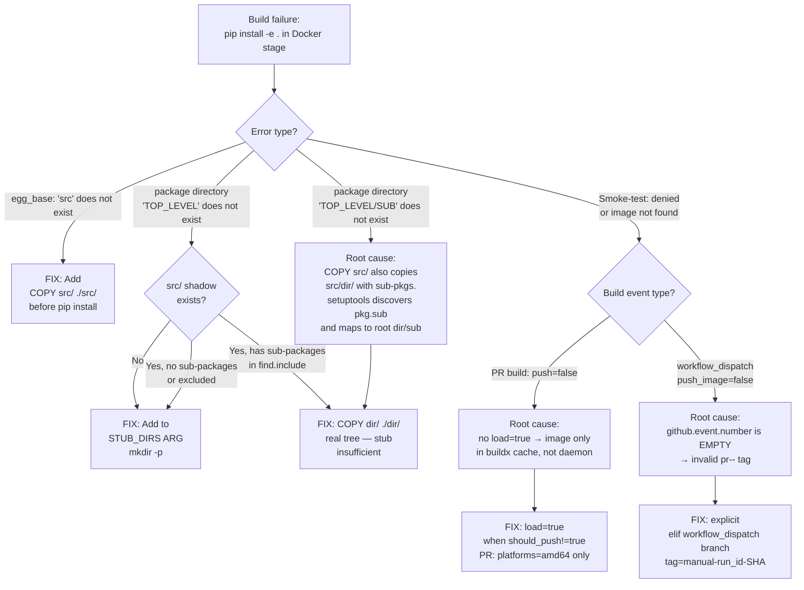
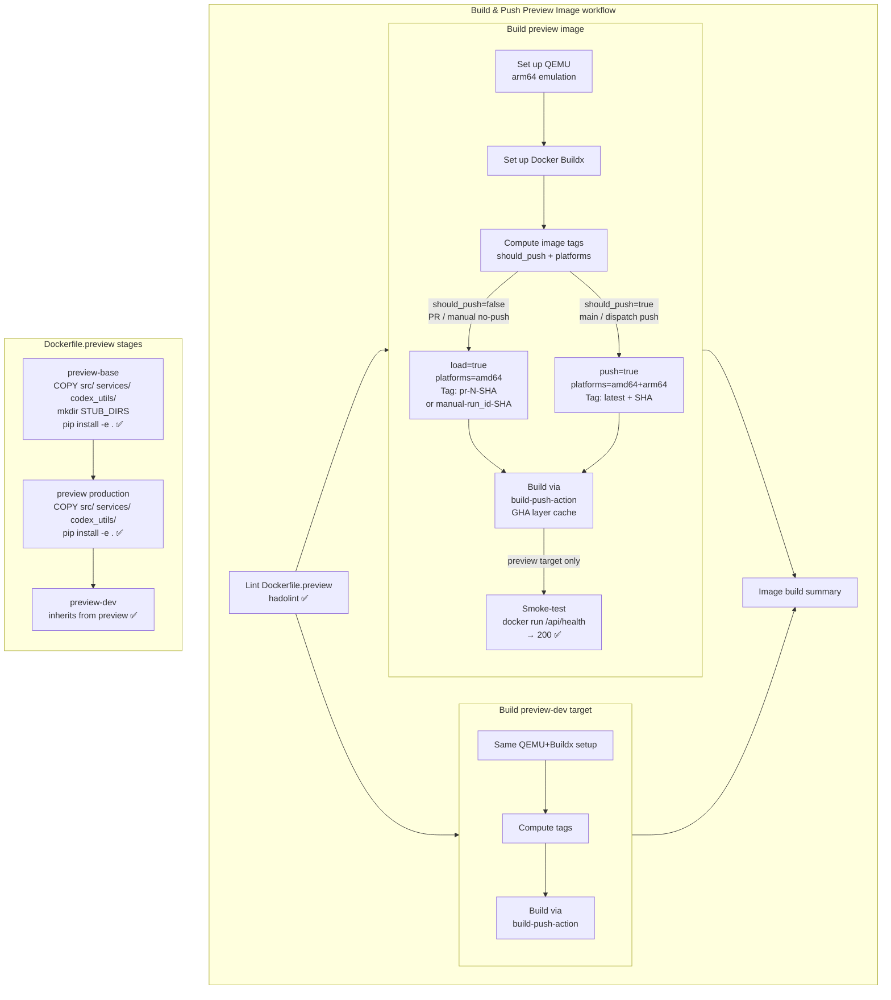

# Docker Build CI Healer Agent

## Overview

Specialized agent for diagnosing and healing Docker build failures that involve
Python editable installs (`pip install -e .`) in multi-stage Dockerfiles using
`src`-layout projects with `setuptools`. Also handles smoke-test registry denial
and `.dockerignore` optimisation to reduce Docker build-context size.

## Activation

Activate when any of these errors appear in `Build & Push * Image` CI jobs:

```
error: error in 'egg_base' option: 'src' does not exist or is not a directory
error: package directory '<name>' does not exist
ERROR: Failed to build 'file:///build' when getting requirements to build editable
docker: Error response from daemon: … "denied"
docker: Error response from daemon: … "not found"
```

## Diagnostic Decision Tree



## Systematic Analysis Protocol

When a new `package directory '...' does not exist` error appears, run:

```python
# In repo root
import tomllib, os, fnmatch

with open('pyproject.toml', 'rb') as f:
    data = tomllib.load(f)

pkg_dir = data['tool']['setuptools']['package-dir']
find_cfg = data['tool']['setuptools']['packages']['find']
includes = find_cfg.get('include', [])
excludes = find_cfg.get('exclude', [])

def is_included(pkg):
    inc = any(fnmatch.fnmatch(pkg, p) for p in includes)
    exc = any(fnmatch.fnmatch(pkg, p) for p in excludes)
    return inc and not exc

for pkg, src_dir in pkg_dir.items():
    if pkg == '' or src_dir.startswith('src/'):
        continue  # handled by COPY src/
    src_shadow = f'src/{src_dir}'
    if not os.path.exists(src_shadow):
        print(f'SAFE STUB: {pkg} → {src_dir}/ (no src shadow)')
        continue
    # Check for discoverable sub-packages in src shadow
    unsafe = []
    for root, dirs, files in os.walk(src_shadow):
        if '__init__.py' in files:
            rel = root[len(src_shadow)+1:]
            if rel:
                sub_pkg = f'{pkg}.{rel.replace("/", ".")}'
                if is_included(sub_pkg):
                    unsafe.append(sub_pkg)
    if unsafe:
        print(f'UNSAFE STUB: {pkg} → {src_dir}/ — COPY instead: {unsafe}')
    else:
        print(f'SAFE STUB: {pkg} → {src_dir}/ (src shadow but no included sub-pkgs)')
```

## Resolution Checklist

```
☐ 1. Run systematic analysis script above
☐ 2. For each UNSAFE STUB: replace `mkdir` stub with `COPY <dir>/ ./<dir>/` in ALL stages
☐ 3. Remove unsafe dirs from STUB_DIRS ARG
☐ 4. Update STUB_DIRS comment documenting safe vs. unsafe reasoning
☐ 5. Verify COPY exists in EVERY stage that runs `pip install -e .`
☐ 6. For smoke-test steps: ensure `load: true` is set in docker/build-push-action
     when building for PR (not pushing to registry). Without it, image only exists
     in buildx cache and `docker run` will fail with GHCR `denied`.
☐ 7. Verify .dockerignore uses recursive glob patterns (**/__pycache__, **/*.egg-info)
☐ 8. Update CHANGELOG.md and AGENT_ACCOUNTABILITY_REPORT.md in same commit
☐ 9. Push and wait for CI to validate
```

## Codebase Alignment Verification

### Current Status in `Dockerfile.preview` (PR #3552, verified via run #64 ✅)

```
Strategy         Directory       Reason
─────────────────────────────────────────────────────────────────────────────
COPY src/        src/            Root package `""` = `"src"` + all src-based mappings
COPY services/   services/       src/services/ has sub-pkgs (mcp, audio, etc.) in find.include
COPY codex_utils/ codex_utils/   src/codex_utils/tracking in find.include(codex_utils*)
STUB             agents          src/agents only has top-level __init__.py
STUB             codex_addons    Excluded: exclude=[codex_addons*]
STUB             codex_digest    Excluded: exclude=[codex_digest*]
STUB             codex_regression Excluded: exclude=[codex_regression*]
STUB             configs         Excluded: exclude=[configs*, config*]
STUB             interfaces      Excluded: exclude=[interfaces, interfaces.*]
STUB             tools           src/tools only has top-level __init__.py
STUB             examples        Excluded: exclude=[examples, examples.*]
STUB             cli             Excluded: exclude=[cli, cli.*]
```

### `.dockerignore` Alignment (as of PR #3552 Sprint 3)

Docker's `.dockerignore` uses Go `filepath.Match` semantics:
- `pattern` = matches ONLY at root of build context
- `**/pattern` = matches recursively at any depth

| Pattern | Before | After | Reason |
|---------|--------|-------|--------|
| `__pycache__` | root only | `**/__pycache__` | Cache dirs exist throughout `src/`, `services/`, `tests/` |
| `*.egg-info` | root only | `**/*.egg-info` | `src/codex_ml.egg-info/` is inside `src/` — root glob misses it |
| (new) `*.egg-link` | — | `*.egg-link` | Created by editable installs |
| (new) `**/.eggs` | — | `**/.eggs` | Created by `python setup.py egg_info` |
| (new) `node_modules` | — | `node_modules` | Cognitive app / React frontend |

### build-preview-image.yml Key Pattern (as of commit 24964c4)

```yaml
# Compute image tags — MUST run before Log in to GHCR so output is available
- name: Compute image tags
  id: tags
  run: |
    if [[ "${{ github.ref }}" == "refs/heads/main" ]] || \
       [[ "${{ github.event_name }}" == "workflow_dispatch" && ... ]]; then
      echo "should_push=true" >> "$GITHUB_OUTPUT"
    else
      echo "should_push=false" >> "$GITHUB_OUTPUT"   # PR builds
    fi

# Log in only when pushing
- name: Log in to GHCR
  if: steps.tags.outputs.should_push == 'true'
  uses: docker/login-action@v3

# Single source of truth: push XOR load
- name: Build (and push on main)
  uses: docker/build-push-action@v6
  with:
    push: ${{ steps.tags.outputs.should_push == 'true' }}
    load: ${{ steps.tags.outputs.should_push != 'true' }}   # ← loads to daemon on PRs
```

**Verified**: Build & Push Preview Image run #64 (commit `24964c4`):
- `Build preview image (preview)` ✅ Smoke-test health check ✅ (5s)
- `Build preview image (preview-dev)` ✅
- `Lint Dockerfile.preview` ✅
- `Image build summary` ✅

## Maintenance Rules

1. **After any `[tool.setuptools.package-dir]` change in `pyproject.toml`**: Run analysis script and update Dockerfile accordingly.
2. **After any `src/<dir>/` directory creation**: Check if `<dir>` is in `package-dir` and has sub-packages that would be discovered.
3. **After any `packages.find.include` or `exclude` change**: Re-run analysis to check if stub/copy strategy needs updating.
4. **`.dockerignore` health**: Ensure recursive globs (`**/`) are used for patterns that should match subdirectories.
5. **smoke-test step**: If the workflow uses a registry tag for smoke-test, ensure `load: true` is set for non-push builds.

## Architecture Diagram



## Related Agents

- `ci-testing-agent.md` — General CI failure debugging
- `codebase-health-guardian.md` — Supersedes workflow-ci-fixer for broad CI health
- `workflow-ci-fixer.agent.md` — DEPRECATED, use codebase-health-guardian
- `ci-failure-resolution-agent.md` — Pattern-based CI failure resolution

## History

| Date | PR | Version | Fix |
|------|-----|---------|-----|
| 2026-03-11 | #3552 | 1.0.0 | Initial creation — fixed `services/mcp` + `codex_utils/tracking` editable install failures |
| 2026-03-11 | #3552 | 1.0.1 | Added smoke-test pattern: `load: true` needed for PR builds when image is not pushed to GHCR |
| 2026-03-11 | #3552 | 1.1.0 | Sprint 3: `.dockerignore` recursive patterns (`**/__pycache__`, `**/*.egg-info`); full codebase alignment verification section; workflow architecture diagram; v#64 end-to-end verified |
| 2026-03-11 | #3552 | 1.2.0 | Mermaid diagrams: ASCII decision tree → flowchart TD; ASCII arch → flowchart TB with subgraphs; workflow_dispatch fix (r2920097250) documented |
