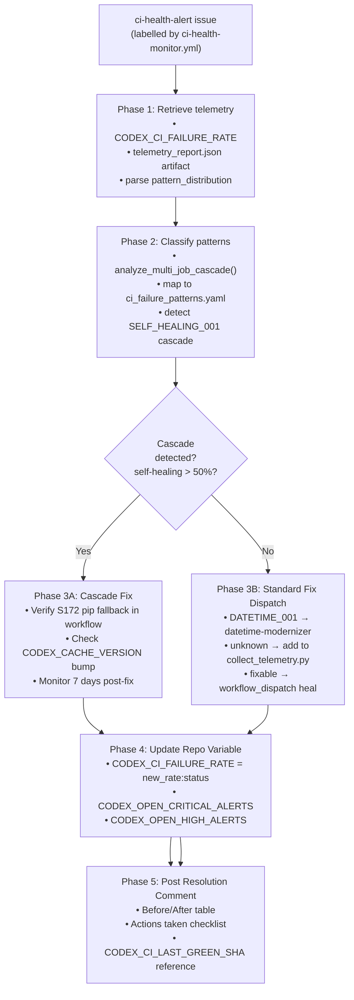
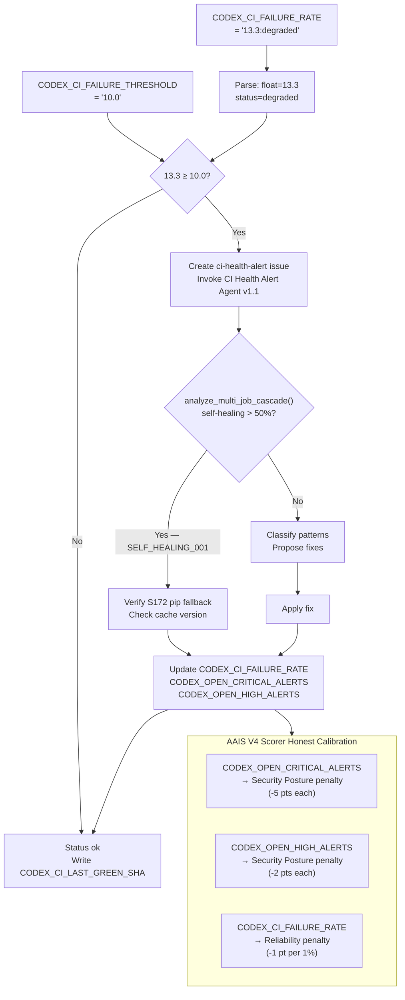

# CI Health Alert Agent v1.1

> **Sprint 4 agent**: Watches for GitHub issues labelled `ci-health-alert` (auto-created by
> `ci-health-monitor.yml` when failure rate exceeds `CODEX_CI_FAILURE_THRESHOLD`) and drives
> end-to-end remediation including self-healing cascade detection (S172).

## Activation

```
@copilot Use the CI Health Alert Agent to triage issue #<N>
```

Or: automatically invoked when `ci-health-monitor.yml` creates a `ci-health-alert` issue.

## Architecture



## Responsibilities

### Phase 1 — Telemetry Retrieval
- Read `CODEX_CI_FAILURE_RATE` repo variable (format: `<rate>:<status>`)
- Download latest `ci-health-monitor` workflow artifact: `telemetry_report.json`
- Parse `pattern_distribution` dict
- **NEW (S172)**: Call `analyze_multi_job_cascade()` to detect self-healing cascades

### Phase 2 — Pattern Classification

Map failure patterns against `.codex/patterns/ci_failure_patterns.yaml`:

| Priority | Pattern ID | Telemetry Key | Action |
|----------|-----------|---------------|--------|
| P0 cascade | `SELF_HEALING_001` | `self-healing` >50% | Cascade detected — verify S172 pip fallback fix |
| P1 critical | `BUILD_001` | `build-failure` | Alert + fix pyproject.toml license |
| P2 high | `DATETIME_001` | `datetime-naive` | Batch fix via `datetime-modernizer` agent |
| P2 high | `PKG_001` | `pip-cache-*` | Document + pin version |
| P2 high | `AUTH_DELEGATION_001` | `auth-delegation` | REQ-10 branch rebase required |
| P3 medium | `MOCK_001` | `import-*` | Check refactoring history |
| P3 low | `TEST_001` | `unknown` | Add fallback tests + update pattern library |
| P3 info | `INT_BRANCH_DIRECT_001` | `integration-branch-direct-session` | Sub-PR redirect — not auto-fixable |

#### P0 Cascade Detection (SELF_HEALING_001)

When `self-healing` accounts for >50% of failures:

```python
# collect_telemetry.py — analyze_multi_job_cascade() usage
collector = TelemetryCollector(owner, repo, token)
report = collector.generate_report("main", days=7)
cascade = collector.analyze_multi_job_cascade(report)
if cascade["cascade_detected"]:
    print(f"SELF_HEALING_001: {cascade['root_cause']}")
    print(f"Action: {cascade['recommended_action']}")
```

**Root cause decision tree:**
```
self-healing > 50%?
  YES → Check iterative-self-healing-ci.yml
        Does triage job use ".venv_ci/bin/pip install requests"?
          YES → S172 pip fallback NOT applied → apply fix
          NO  → S172 already applied → check CODEX_CACHE_VERSION bump
                  bump recently? → cache invalidated; will self-heal in ~1 day
                  no bump?       → investigate setup-python-cached action
```

### Phase 3 — Fix Dispatch
- **Cascade (SELF_HEALING_001)**: Verify S172 pip fallback is in workflow; if not, apply it
- For batch-fixable patterns (`DATETIME_001`): invoke `datetime-modernizer` agent
- For workflow patterns: propose `workflow_dispatch` to `iterative-self-healing-ci.yml`
- For unknown patterns: add new classifier entry to `collect_telemetry.py`

### Phase 4 — Repo Variable Update

After remediation, update all AAIS-gating repo variables:

```bash
# Update CODEX_CI_FAILURE_RATE via GitHub MCP tools (preferred) or API
gh api -X PATCH \
  /repos/Aries-Serpent/_codex_/actions/variables/CODEX_CI_FAILURE_RATE \
  -f value="<new_rate>:<new_status>"

# Update security alert counts for AAIS V4 scorer honest calibration
gh api -X PATCH \
  /repos/Aries-Serpent/_codex_/actions/variables/CODEX_OPEN_CRITICAL_ALERTS \
  -f value="<count>"
gh api -X PATCH \
  /repos/Aries-Serpent/_codex_/actions/variables/CODEX_OPEN_HIGH_ALERTS \
  -f value="<count>"
```

### Phase 5 — Issue Resolution Comment

Post structured comment to the `ci-health-alert` issue:
```markdown
## 🩺 CI Health Alert — Resolution Report

| Metric | Before | After |
|--------|--------|-------|
| Failure Rate | X% | Y% |
| Top Pattern | self-healing (cascade) | <classified> |
| Status | critical/degraded | ok |
| Last Green SHA | N/A | <CODEX_CI_LAST_GREEN_SHA> |

### Actions Taken
- [x] Pattern classified: SELF_HEALING_001 (self-healing cascade)
- [x] Root cause: .venv_ci/bin/pip absent on venv cache miss
- [x] Fix applied: S172 pip fallback in triage + heal jobs
- [x] CODEX_CI_FAILURE_RATE updated
- [x] CODEX_OPEN_CRITICAL_ALERTS / CODEX_OPEN_HIGH_ALERTS updated
```

## Tools Used
- `github-mcp-server-actions_list` — list workflow runs
- `github-mcp-server-issue_read` — read issue body
- `bash` — run `scripts/ci/collect_telemetry.py --analyze-cascade`
- `edit` — update `.codex/patterns/ci_failure_patterns.yaml`
- `github-mcp-server-actions_list` (PATCH) — update `CODEX_CI_FAILURE_RATE`

## Constraints
- Never create branches for fix-only issues that can be resolved in-workflow
- Always post a resolution comment before closing the issue
- `CODEX_CI_FAILURE_RATE` value format: `<float>:<status>` (e.g. `15.2:degraded`)
- Compare rate against `CODEX_CI_FAILURE_THRESHOLD` repo variable (default `10.0`) — not hardcoded value
- Status thresholds: `ok` = rate < THRESHOLD; `degraded` = rate ≥ THRESHOLD; `critical` = rate ≥ 2×THRESHOLD
- When `CODEX_CI_LAST_GREEN_SHA` is set, include it in resolution comments for bisect reference
- **NEW (S172)**: Always call `analyze_multi_job_cascade()` before dispatching fixes — cascade is the #1 pattern

## Variable Integration (PR #3483 + S172 AAIS honest calibration)



## Changelog

| Version | Date | Changes |
|---------|------|---------|
| 1.0.0 | 2026-03-01 | Initial version — Sprint 4 agent |
| 1.1.0 | 2026-03-21 | S172: Added cascade detection (SELF_HEALING_001), updated priority table, added `analyze_multi_job_cascade()` integration, AAIS honest calibration variable integration |
