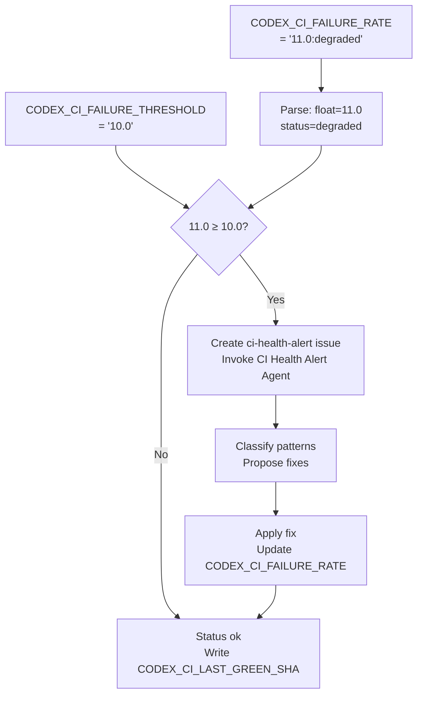

# CI Health Alert Agent v1.0

> **Sprint 4 agent**: Watches for GitHub issues labelled `ci-health-alert` (auto-created by
> `ci-health-monitor.yml` when failure rate exceeds 20%) and drives end-to-end remediation.

## Activation

```
@copilot Use the CI Health Alert Agent to triage issue #<N>
```

Or: automatically invoked when `ci-health-monitor.yml` creates a `ci-health-alert` issue.

## Architecture

```
Trigger: issue labelled ci-health-alert
  │
  ├─ Phase 1: Retrieve telemetry report (/tmp/telemetry_report.json or API)
  ├─ Phase 2: Classify top failure patterns from pattern_distribution
  ├─ Phase 3: Map patterns → fix scripts (collect_telemetry.py patterns)
  ├─ Phase 4: Propose PRs or workflow_dispatch invocations
  └─ Phase 5: Update CODEX_CI_FAILURE_RATE + post resolution comment
```

## Responsibilities

### Phase 1 — Telemetry Retrieval
- Read `CODEX_CI_FAILURE_RATE` repo variable (format: `<rate>:<status>`)
- Download latest `ci-health-monitor` workflow artifact: `telemetry_report.json`
- Parse `pattern_distribution` dict

### Phase 2 — Pattern Classification
Map failure patterns against `.codex/patterns/ci_failure_patterns.yaml`:

| Priority | Pattern | Action |
|----------|---------|--------|
| P1 critical | `BUILD_001` pyproject.toml license | Alert + fix suggestion |
| P2 high | `DATETIME_001` offset-naive datetime | Batch fix via datetime-modernizer agent |
| P2 high | `PKG_001` PEP 621 gap | Document + pin version |
| P3 medium | `MOCK_001` mock namespace | Check refactoring history |
| P3 low | `TEST_001` optional fallback | Add fallback tests |

### Phase 3 — Fix Dispatch
- For batch-fixable patterns (`DATETIME_001`): invoke `datetime-modernizer` agent
- For workflow patterns: propose `workflow_dispatch` to `iterative-self-healing-ci.yml`
- For unknown patterns: add new classifier entry to `collect_telemetry.py`

### Phase 4 — Repo Variable Update
After remediation:
```bash
# Update CODEX_CI_FAILURE_RATE via GitHub API
curl -X PATCH \
  -H "Authorization: Bearer $CODEX_MASTER_KEY" \
  -H "Accept: application/vnd.github+json" \
  https://api.github.com/repos/Aries-Serpent/_codex_/actions/variables/CODEX_CI_FAILURE_RATE \
  -d '{"value":"<new_rate>:<new_status>"}'
```

### Phase 5 — Issue Resolution Comment
Post structured comment to the `ci-health-alert` issue:
```markdown
## 🩺 CI Health Alert — Resolution Report

| Metric | Before | After |
|--------|--------|-------|
| Failure Rate | X% | Y% |
| Top Pattern | unknown | <classified> |
| Status | critical/degraded | ok |

### Actions Taken
- [ ] Pattern classified: <pattern_id>
- [ ] Fix applied: <description>
- [ ] CODEX_CI_FAILURE_RATE updated
```

## Tools Used
- `github-mcp-server-actions_list` — list workflow runs
- `github-mcp-server-issue_read` — read issue body
- `bash` — run `scripts/ci/collect_telemetry.py`
- `edit` — update `.codex/patterns/ci_failure_patterns.yaml`

## Constraints
- Never create branches for fix-only issues that can be resolved in-workflow
- Always post a resolution comment before closing the issue
- `CODEX_CI_FAILURE_RATE` value format: `<float>:<status>` (e.g. `15.2:degraded`)
- Compare rate against `CODEX_CI_FAILURE_THRESHOLD` repo variable (default `10.0`) — not hardcoded value
- Status thresholds: `ok` = rate < THRESHOLD; `degraded` = rate ≥ THRESHOLD; `critical` = rate ≥ 2×THRESHOLD
- When `CODEX_CI_LAST_GREEN_SHA` is set, include it in resolution comments for bisect reference

## Variable Integration (PR #3483)


