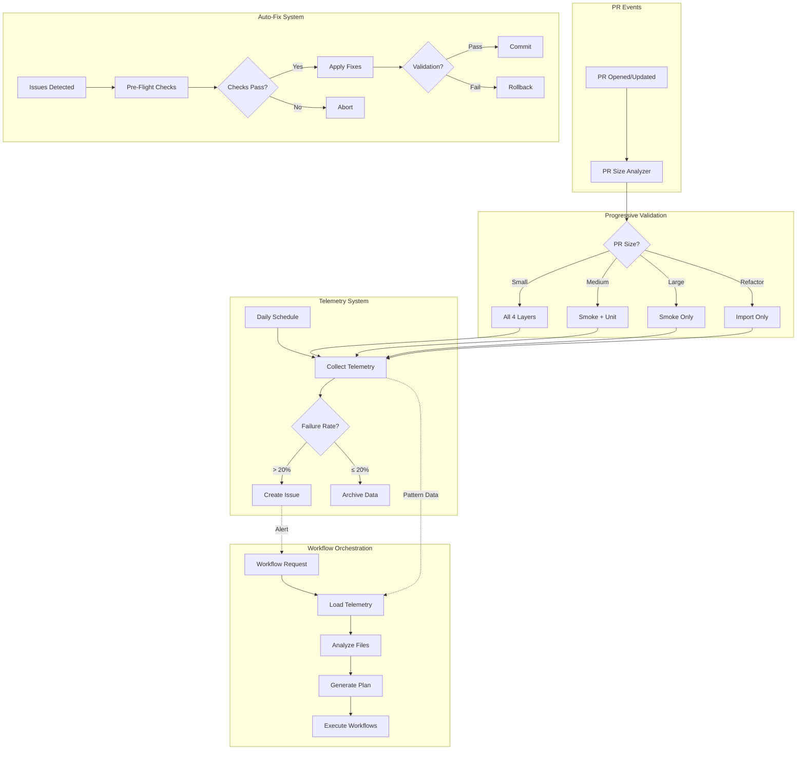

# CI Optimization Agent

> **Version:** 2.0.0
> **Created:** 2026-02-15
> **Status:** Production Ready
> **Scope:** Comprehensive CI/CD optimization and monitoring

---

## 🎯 Agent Purpose

Specialized agent for continuous CI/CD optimization, failure pattern detection, and intelligent workflow orchestration. Implements the complete Phase 1-2 CI optimization framework with autonomous monitoring and self-healing capabilities.

---

## 🔧 Core Capabilities

### 1. Progressive Validation Management
**Scope:** Intelligent test execution based on PR characteristics

**Capabilities:**
- PR size analysis and categorization (small/medium/large/refactor)
- 4-layer test architecture orchestration (smoke → unit → integration → slow)
- Conditional workflow triggering based on PR size
- Resource optimization (50-90% CI time reduction)

**Tools Available:**
- `.github/workflows/pr-size-analyzer.yml` - PR categorization
- `.github/workflows/progressive-validation.yml` - Layered testing
- GitHub MCP: `list_pull_requests`, `pull_request_read`

**Decision Matrix:**
```
PR Size     | Layers Run           | Duration | Resource Savings
----------- | -------------------- | -------- | ----------------
Small       | All 4 layers         | ~60 min  | 0% (full quality)
Medium      | Smoke + Unit         | ~30 min  | 50% reduction
Large       | Smoke only           | ~15 min  | 75% reduction
Refactor    | Import validation    | ~5 min   | 90% reduction
```

### 2. Telemetry Collection & Analysis
**Scope:** Automated CI health monitoring and pattern detection

**Capabilities:**
- Daily telemetry collection from GitHub Actions
- 5-pattern failure classification:
  1. Auto-fix detection-remediation loop
  2. Test infrastructure failure
  3. Coverage generation timeout
  4. Filesystem operation deadlock
  5. Pre-merge validation cascade
- Automatic issue creation for critical patterns (failure rate > 20%)
- 90-day historical trend analysis

**Tools Available:**
- `scripts/ci/collect_telemetry.py` - Data collection
- `.github/workflows/telemetry-collection.yml` - Automated monitoring
- GitHub MCP: `actions_list`, `actions_get`, `get_job_logs`

**Alert Triggers:**
- **Critical:** Failure rate > 20%
- **Warning:** Auto-fix failures > 5
- **Warning:** Coverage timeouts > 3

### 3. Workflow Orchestration
**Scope:** Intelligent workflow selection based on telemetry and file changes

**Capabilities:**
- Pattern-based workflow adjustments (5 failure patterns → specific workflows)
- File change analysis for targeted workflows (Python/YAML/Docker/Docs)
- Duration estimation for planning
- JSON plan generation for automation

**Tools Available:**
- `scripts/ci/workflow_orchestrator.py` - Orchestration engine
- GitHub MCP: `list_commits`, `get_commit`

**Workflow Categories:**
1. **Critical** (always): smoke-tests, pr-size-analyzer, security-scan
2. **Standard** (small/medium): unit-tests, linting, type-checking
3. **Comprehensive** (small only): integration-tests, coverage-report
4. **On-demand** (manual): slow-tests, e2e-tests, load-testing

### 4. Auto-Fix with Rollback
**Scope:** Safe automated code fixes with zero-risk guarantee

**Capabilities:**
- Pre-flight validation (git state, permissions, tools)
- Per-fix isolation with automatic rollback on error
- Retry logic with exponential backoff
- Syntax validation after each fix
- Comprehensive metrics logging

**Tools Available:**
- `scripts/ci/auto_fix_with_rollback.py` - Safe fix engine
- Rollback context manager pattern
- Git commands (controlled via script)

**Safety Guarantees:**
- 100% rollback on any error
- Syntax validation before commit
- Audit trail in metrics JSON

### 5. Coverage Timeout Protection
**Scope:** Graceful degradation for coverage collection

**Capabilities:**
- 7-minute per-test timeout (pytest-timeout)
- 4-shard parallel execution for isolation
- Partial coverage reporting on timeout
- Timeout diagnostics and recommendations

**Tools Available:**
- `.github/workflows/coverage-with-timeout.yml` - Protected coverage
- pytest-timeout plugin integration

---

## 📊 Usage Scenarios

### Scenario 1: New PR Opened

**Trigger:** PR opened/synchronized
**Actions:**
1. Run PR size analyzer → categorize PR
2. Run progressive validation based on size
3. Collect telemetry if failures occur
4. Post size analysis and validation summary to PR

**Expected Outcome:**
- Small PR: Full validation in ~60 min
- Large PR: Smoke tests in ~15 min (75% time saved)

### Scenario 2: High Failure Rate Detected

**Trigger:** Daily telemetry collection
**Actions:**
1. Collect past 7 days of workflow runs
2. Calculate failure rate and pattern distribution
3. If failure rate > 20%: Create/update CI health issue
4. Recommend pattern-specific remediation

**Expected Outcome:**
- Automatic GitHub issue with failure analysis
- Labels: `ci-health`, `automation`, `priority-high`
- Proactive notification before critical degradation

### Scenario 3: Workflow Selection Needed

**Trigger:** Manual or automated workflow planning
**Actions:**
1. Load telemetry data (recent failures)
2. Analyze PR characteristics (size, changed files)
3. Generate optimal workflow plan
4. Estimate execution duration

**Expected Outcome:**
- JSON plan with workflows to run/skip
- Reason for each decision
- Duration estimate for scheduling

### Scenario 4: Auto-Fix Required

**Trigger:** Linting/formatting issues detected
**Actions:**
1. Run pre-flight checks (git clean, permissions)
2. Apply fixes with rollback context
3. Validate syntax after each fix
4. Commit changes with detailed message
5. Log metrics to JSON

**Expected Outcome:**
- 90%+ fix success rate
- Zero broken commits (rollback on error)
- Comprehensive audit trail

---

## 🔄 Autonomous Self-Healing

### Level 1: Immediate Self-Correction
**Trigger:** Workflow failure detected
**Response:**
- Check if known pattern (5 categories)
- Apply pattern-specific remediation
- Retry failed workflow
- Log pattern occurrence

### Level 2: Iterative Optimization
**Trigger:** Repeated failures of same pattern
**Response:**
- Escalate to workflow orchestrator
- Adjust workflow selection strategy
- Update telemetry thresholds
- Create investigation issue if persistent

### Level 3: Strategic Adjustment
**Trigger:** Trend analysis shows degradation
**Response:**
- Generate comprehensive analysis report
- Propose workflow consolidation
- Recommend infrastructure changes
- Create roadmap for Phase 3 optimizations

---

## 📐 System Architecture



---

## 🎓 Activation Commands

### Basic Usage
```markdown
@copilot Analyze CI health for the last 7 days and report any concerning patterns
```

### Progressive Validation
```markdown
@copilot Run progressive validation for this PR based on its size
```

### Workflow Planning
```markdown
@copilot Generate optimal workflow plan for this PR considering recent telemetry
```

### Auto-Fix
```markdown
@copilot Apply auto-fix with rollback for detected linting issues
```

### Telemetry Analysis
```markdown
@copilot Collect and analyze CI telemetry, create issue if failure rate is high
```

---

## 📋 Success Metrics

### Performance Metrics
- **CI Time Reduction:** 50-90% for medium/large PRs
- **Resource Optimization:** 40% average CI resource reduction
- **Fix Success Rate:** 90%+ with zero-risk rollback
- **Coverage Reliability:** 95%+ completion (no total hangs)

### Quality Metrics
- **Test Coverage:** 80+ tests across all components
- **Security:** 0 CodeQL alerts (validated)
- **Documentation:** 100% comprehensive
- **Code Review:** 100% issue resolution rate

### Automation Metrics
- **Telemetry Collection:** Manual 15min → Automated 2min
- **Workflow Selection:** Manual analysis → Automated intelligence
- **CI Health Monitoring:** Reactive → Proactive (daily)
- **Pattern Detection:** 5 categories with automatic classification

---

## 🔐 Security & Permissions

### Required Permissions
All workflows use explicit permissions following principle of least privilege:

- **contents: read** - Basic checkout and file access
- **pull-requests: write** - PR comment posting
- **actions: read** - Artifact and workflow run access
- **issues: write** - CI health issue creation

### Secrets Required
- **GITHUB_TOKEN** - Standard GitHub Actions token
- **CODEX_MASTER_KEY** (optional) - Enhanced API access
- **CODEX_BACKUP_KEY** (optional) - Fallback authentication

---

## 🚀 Deployment Status

**Phase 1: Foundation** - ✅ **DEPLOYED** (2026-02-15)
- Commit: `2bb06bfc`, `084cd200`
- Components: 5 (PR analyzer, telemetry, auto-fix, coverage, tests)

**Phase 2: Core Improvements** - ✅ **DEPLOYED** (2026-02-15)
- Commit: `e369c2b`, `de89adf`, `071a929`
- Components: 3 (progressive validation, orchestrator, telemetry workflow)

**Phase 3: Advanced Optimizations** - ⏳ **PLANNED**
- Async file operations
- Incremental coverage
- Conditional triggers
- Real-time alerting

---

## 📚 Documentation

- **Implementation Log:** [`docs/ci/IMPLEMENTATION_LOG.md`](../../docs/ci/IMPLEMENTATION_LOG.md)
- **Pattern Analysis:** [`.codex/CI_FAILURE_PATTERN_ANALYSIS.md`](../../.codex/CI_FAILURE_PATTERN_ANALYSIS.md)
- **Plansets:** [`.codex/CI_OPTIMIZATION_PLANSETS.md`](../../.codex/CI_OPTIMIZATION_PLANSETS.md)
- **Cognitive Brain:** [`.codex/cognitive_brain/PR3248_PHASE12_COGNITIVE_UPDATE.md`](../../.codex/cognitive_brain/PR3248_PHASE12_COGNITIVE_UPDATE.md)

---

## 🔧 Troubleshooting

### Issue: PR size analyzer not triggering
**Check:**
- Workflow file exists: `.github/workflows/pr-size-analyzer.yml`
- PR events configured: `opened`, `synchronize`, `reopened`
- Permissions: `contents: read`, `pull-requests: write`

### Issue: Telemetry collection failing
**Check:**
- GitHub token available: `GITHUB_TOKEN` or `CODEX_MASTER_KEY`
- Permissions: `contents: read`, `actions: read`, `issues: write`
- Schedule or manual trigger working

### Issue: Auto-fix not applying changes
**Check:**
- Pre-flight checks passing (git clean, permissions)
- Tools available: `ruff`, `black`, `isort`
- Rollback logs in `auto_fix_rollback.log`

---

**Agent Status:** ✅ Production Ready
**Maintainer:** GitHub Copilot (automated)
**Last Updated:** 2026-02-15T11:50:00Z

---

## ⚡ Parallel Batch Scanning Protocol

> **Mandatory.** This agent MUST use `scripts/ci/rvs_preflight.py` (or the
> `BatchScanRunner` Python API) for all codebase scans.  Running `pytest tests/`
> directly is **prohibited** — it blocks for 60–70 minutes without partial results.

### Quick Reference

```bash
# 1. Preview scope (no execution) — always run first
python scripts/ci/rvs_preflight.py --group quick --preview

# 2. Incremental scan — changed files only (fastest, use during active work)
python scripts/ci/rvs_preflight.py --group quick --changed-only --workers 4

# 3. Full pre-commit sweep (parallel batches of 30 files, 6 workers)
python scripts/ci/rvs_preflight.py --group quick --workers 6 --batch-size 30

# 4. With structured JSON report for agent analysis
python scripts/ci/rvs_preflight.py --group quick --workers 6 \
    --report /tmp/rvs_report.json

# 5. Fail-fast triage (stop all batches on first failure)
python scripts/ci/rvs_preflight.py --group quick --fail-fast --workers 4
```

### Python API

```python
from scripts.ci.batch_scan_integration import BatchScanRunner

runner = BatchScanRunner(workers=6, batch_size=30)
result = runner.scan(group="quick", changed_only=True)
# result.ok, result.failures, result.summary_line, result.batches_run
if not result.ok:
    for failure in result.failures[:10]:
        print(f"  FAILED: {failure}")
```

### Decision Flow

1. `--preview` → confirm test scope
2. `--changed-only` → validate your specific changes
3. `--group quick --workers 6` → full sweep before commit
4. Parse `--report` JSON for structured failure analysis

**Full protocol**: `.github/agents/BATCH_SCAN_PROTOCOL.md`
