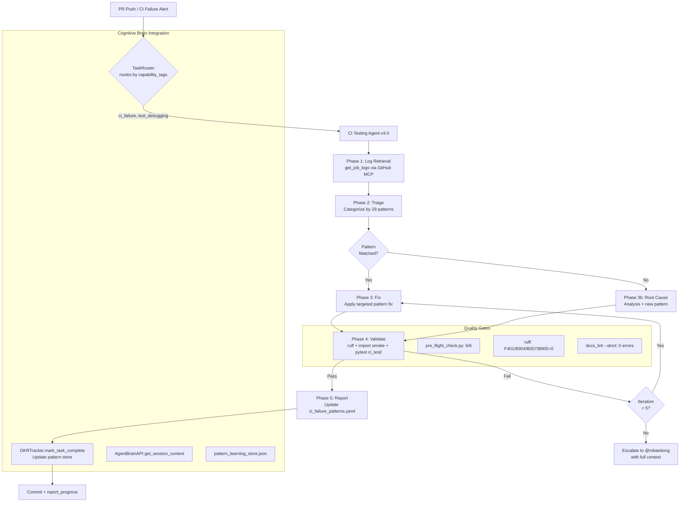
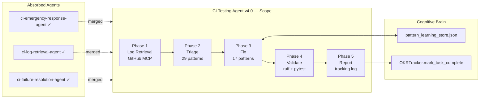

# CI Testing Agent v4.2.0-S228 (Unified CI Failure Resolver)

> **v4.2.0-S228 upgrade**: Adds P19 shadow import diagnosis protocol, CI failure → self-healing → escalation mermaid diagram, 5-pass self-review checklist, and `@pytest.mark.flaky` detection.
> **v4.0 upgrade**: Absorbs `ci-failure-resolution-agent` and `ci-emergency-response-agent` into a
> single end-to-end resolver with 17 embedded fix patterns, self-healing loop (max 5 iterations),
> and mandatory regression detection before commit.

## Architecture (v4.0)

```
Phase 1: Log Retrieval  ->  Phase 2: Triage  ->  Phase 3: Fix  ->  Phase 4: Validate  ->  Phase 5: Report
   (GitHub MCP)              (categorize)       (17 patterns)    (ruff + import smoke)   (tracking log)
```

### Full Integration Diagram



### Phase 1 — Log Retrieval (from ci-failure-resolution-agent)
- `list_workflow_runs(branch, status="failure")` → identify latest failed run
- `get_job_logs(job_id, failed_only=True, return_content=True, tail_lines=300)`
- Parse: extract FAILED test names + error type + stack frame

### Phase 2 — Triage (from ci-emergency-response-agent)
- Categorize by error pattern (see Pattern Library below)
- Check base branch for pre-existing failures (MUST be done before fixing)
- Priority sort: regression > new failure > pre-existing

### Phase 3 — Fix Pattern Library (17 known patterns, sessions 37-46)
| ID | Pattern | Fix |
|----|---------|-----|
| P-REGISTRY | `AttributeError: 'Registry' object has no attribute '_registry'` | Use `_items` or plain dict mock seam |
| P-TORCH-312 | `TypeError: isinstance() arg 2` under Python 3.12 + torch 2.x | `@pytest.mark.skipif(_TORCH_312_BUG)` |
| P-TORCH-PROF | `RuntimeError: No running torch.profiler.profile` | Add to `_TORCH_PROFILER_XFAIL` in conftest |
| P-IMPORT-OPT | `ModuleNotFoundError` for optional dep (faiss, sentencepiece) | `pytest.importorskip("faiss")` at module level |
| P-HF-UNAVAIL | `HFModelUnavailableError` | `try/except HFModelUnavailableError → pytest.skip()` |
| P-API-DRIFT | `TypeError: unexpected kwarg` or missing attr | Fix source API or add compat alias |
| P-SENTINEL | `enable_mlflow=True` when `_mlflow_module=None` | Use `_MLFLOW_UNSET` sentinel (not `None`) |
| P-SITECSUT | `ModuleNotFoundError: sitecustomize` | `@pytest.mark.skipif(not _HAS_SITECUSTOMIZE)` |
| P-CLI-EXIT | `DID NOT RAISE SystemExit` for missing hydra | `sys.exit(0)` (graceful), NEVER `sys.exit(1)` |
| P-VIEWER-CMD | `ImportError: viewer_cmd` | Add to `__all__` + `getattr(_cli_click_module)` |
| P-PEFT-TARGET | `ValueError: Target modules not found` | `try/except ValueError → pytest.skip()` |
| P-DOCKER-NET | Docker `pip install` fails in CI | `@pytest.mark.skipif(CI_ENV)` |
| P-PICKLE-SEC | `pickle.load()` fallback | Remove fallback; let `safe_pickle_load` propagate error |
| P-MOCK-SETUP | `AttributeError` on mock setup | Use class wrapper, NOT lambda (isinstance safety) |
| P-CYCLIC | CodeQL cyclic import | Remove unused `TYPE_CHECKING` import; move shared types to `_types.py` |
| P-RUFF-I001 | ruff I001 import order | Move `logger = ...` AFTER all imports; no blank lines within try-import block |
| P-RUFF-F401 | ruff F401 unused import | Remove or add `# noqa: F401` with justification comment |

### Phase 4 — Validation
```bash
# Required before every commit:
ruff check --fix <changed_files>
python -c "from <fixed_module> import <key_symbol>; print('OK')"
python -m pytest <targeted_regression_tests> -v --timeout=60 --tb=short
```

### Phase 5 — Self-Healing Loop
- Max 5 iterations; break on first green run
- Each iteration: re-fetch logs → triage new failures → apply fix → validate
- Track iteration count in `.codex/PR_<ID>_FAILURE_TRACKING_LOG.md`

### Phase 5 — Report
- Update tracking log with Attempt N entry (commit SHA, root cause, fix applied, result)
- NEVER use `xfail(strict=False)` — use `skipif` with documented reason
- Post summary comment on PR

---

## S228: P19 Shadow Import Diagnosis

### What Is a Shadow Import?

A **shadow import** occurs when an installed package's `.egg-link` or stale
`site-packages` entry points to an old build instead of the current `src/` tree.
This causes tests to silently import outdated code while the CI log shows no error.

### Detection Protocol

```bash
# Step 1 — Locate the installed package
python -c "import <pkg>; print(__file__)"
# GOOD: /home/runner/work/_codex_/_codex_/src/<pkg>/__init__.py
# BAD:  /opt/hostedtoolcache/.../site-packages/<pkg>/__init__.py

# Step 2 — Check for stale egg-link
pip show -f <pkg> | grep Location

# Step 3 — Check for duplicate installs
pip list | grep <pkg>
python -c "import sys; [print(p) for p in sys.path if '<pkg>' in p]"
```

### Fix Protocol

```bash
# Force-reinstall editable install from src/ root
pip install --force-reinstall --no-deps -e .

# Verify import resolves to src/
python -c "import <pkg>; assert 'src/' in __import__('<pkg>').__file__, 'Shadow import!'"

# If multiple virtualenvs: deactivate/reactivate before retrying
deactivate && source .venv/bin/activate && pip install -e .
```

### Root Causes

| Cause | Symptom | Fix |
|-------|---------|-----|
| Stale `.egg-link` in `site-packages` | Old symbols present in tests | `pip install --force-reinstall -e .` |
| Multiple venvs (.venv + .venv_ci) | Different package versions | Confirm `which python` is correct venv |
| `PYTHONPATH` override in CI | `src/` not first in path | Prepend `src/` explicitly: `PYTHONPATH=src:$PYTHONPATH` |
| `conftest.py` `sys.path.insert` conflict | Import from wrong location | Remove redundant inserts; rely on editable install |

### CI Pipeline Diagram — Failure → Self-Healing → Escalation

```mermaid
flowchart TD
    A[CI Test Failure] --> B[Phase 1: Fetch Logs\nget_job_logs tail=300]
    B --> C{Error type?}
    C -->|ImportError / ModuleNotFound| D[P19 Shadow Import\nDiagnosis Protocol]
    C -->|AssertionError / logic| E[Standard Fix\nPattern Library P-*]
    C -->|Collection error| F[conftest / path\ndiagnosis]

    D --> G[Locate package with\npython -c 'import pkg; print(file)']
    G --> H{Path under src/?}
    H -->|Yes| I[Shadow not cause\ncheck PYTHONPATH]
    H -->|No| J[pip install\n--force-reinstall -e .]
    J --> K[Verify: assert src/ in path]
    K -->|Pass| L[Re-run targeted tests]
    K -->|Fail| M[Escalate: post PR comment\nwith full diagnosis]

    E --> N[Apply fix pattern]
    F --> O[Fix sys.path / conftest]

    L --> P{Tests pass?}
    N --> P
    O --> P
    P -->|Yes| Q[Commit + Update\ntracking log]
    P -->|No, iter < 5| R[Next iteration\nre-fetch logs]
    P -->|No, iter = 5| S[Escalate to\nself-healing-orchestrator-agent]
    R --> C

    subgraph SelfHeal [Self-Healing Loop — max 5 iterations]
        R
        P
    end

    subgraph Escalation [Escalation Path]
        S --> T[Post PR comment with\nfull context + patch suggestion]
        M --> T
    end
```

---

## Self-Review Protocol (5-Pass)

Before committing any fix, run this checklist in order:

- [ ] **Pass 1 — Import smoke**: `python -c "from <fixed_module> import <symbol>"` exits 0
- [ ] **Pass 2 — Ruff clean**: `ruff check --select F401,B904,I001 <changed_files>` → 0 errors
- [ ] **Pass 3 — Targeted test**: `pytest <regression_test_path> -v --timeout=60 --tb=short` → green
- [ ] **Pass 4 — No regression**: diff of changed files reviewed; no unintended side-effects
- [ ] **Pass 5 — Policy compliance**: fix aligns with `.codex/CODEBASE_AGENCY_POLICY.md §0`


### 📐 Scope Diagram




## Core Responsibilities

1. **CI Pipeline Debugging**: Workflow failures, configuration issues, build problems
2. **Test Failure Analysis**: Diagnose test failures, imports, dependencies
3. **Import Path Resolution**: Fix module imports, package structure
4. **Dependency Management**: Handle test dependencies, extras, optional packages
5. **Lint/Format Issues**: Resolve code quality blocks

## Common Issues - Quick Reference

### Import Errors
**Pattern**: `ImportError: No module named 'X'`
**Fix**: Check namespace, add extras, verify PYTHONPATH
```python
# ✅ Correct
from codex_ml.monitoring import system_metrics
```
```yaml
# CI fix
- run: uv pip install --system -e ".[dev,test,monitoring]"
- run: export PYTHONPATH="${GITHUB_WORKSPACE}/src:${PYTHONPATH}"
```

### Test Collection Failures
**Pattern**: pytest fails during collection
**Fix**: Add import safety in `__init__.py`, check conftest.py
```python
try:
    from required_module import something
except ImportError as e:
    raise ImportError(f"Install: pip install -e '.[extras]'\nError: {e}") from e
```

### Parallel Test Sharding
**Pattern**: Fails only in specific shards
**Fix**: Check test isolation, no shared state
```yaml
- run: pytest tests/ --splits 4 --group ${{ matrix.shard }} -x --tb=short
```

### Linting Failures
**Pattern**: Ruff/Black/isort errors
**Quick Fix**:
```bash
ruff check --fix . && black . && isort .
```

### PyTorch/CUDA Library Errors
**Pattern**: `OSError: libtorch_global_deps.so: cannot open`
**Fix**: Lazy import or skip tests
```python
# ✅ Lazy import
def _get_torch():
    try:
        import torch
        return torch
    except (ImportError, OSError) as e:
        raise ImportError(f"PyTorch required: {e}") from e

# ✅ Skip if unavailable
pytestmark = pytest.mark.skipif(
    not torch_available,
    reason="PyTorch not available"
)
```

### Test Path Calculation
**Pattern**: `FileNotFoundError` accessing repo root
**Fix**: Use correct `parents[N]` index

**Verification**:
```python
# In test file - find correct index
from pathlib import Path
test_file = Path(__file__)
print(f"Test file: {test_file}")
for i in range(5):
    print(f"parents[{i}]: {test_file.parents[i]}")
```

### Missing Module Imports
**Pattern**: `NameError: name 'json' is not defined`
**Fix**: Add import at top of file
```python
# ✅ Correct
import json
def output(data):
    return json.dumps(data)
```
**Prevention**: `ruff check --select=F` detects undefined names

## Pre-Test Validation Pattern

```bash
python -c "
from critical_module import something
print('✓ Critical imports verified')
"
pytest tests/
```

## Cognitive App Testing (React/TypeScript)

### Quick Commands
```bash
# Unit tests (Vitest)
cd cognitive_app && npm test

# E2E tests (Playwright)
cd cognitive_app && npx playwright test

# Dev mode
cd cognitive_app && npm run dev
```

### Common Issues
- **Timeouts**: Increase in test file (`{ timeout: 10000 }`)
- **Missing browsers**: `npx playwright install --with-deps`
- **Port in use**: `lsof -ti:5173 | xargs kill -9`
- **Env vars**: Use `.env.local` or set in test setup

### Test Locations
- Units: `cognitive_app/src/components/**/__tests__/*.test.tsx`
- E2E: `cognitive_app/e2e/*.spec.ts`
- Config: `vitest.config.ts`, `playwright.config.ts`

## Activation

### When to Use
- CI pipeline failures, test collection errors, import errors
- Dependency issues, lint violations, sharding problems

### Command
```
@copilot Use CI Testing Agent to debug [workflow/test/file]
```

### Workflow
1. Analyze CI logs, identify root cause
2. Diagnose imports, dependencies, config
3. Apply targeted fixes
4. Validate locally and in CI
5. Document changes

## Related Docs
- [AGENTS.md](../AGENTS.md)
- [GitHub Workflows](../workflows/)
- [pyproject.toml](../../pyproject.toml)

## Knowledge Base References

For detailed examples and extended troubleshooting:
- PyTorch/CUDA detailed patterns → `.codex/knowledge/ci_testing_pytorch.md`
- Test path calculation deep-dive → `.codex/knowledge/ci_testing_paths.md`
- Recent fix examples → `.codex/knowledge/ci_testing_recent_fixes.md`
- Cognitive app troubleshooting → `.codex/knowledge/cognitive_app_testing.md`

---

**Version 2.0.0 Notes**: Condensed from 30,351 to ~5,500 chars (82% reduction). Detailed examples moved to knowledge base. Focus on actionable quick reference.


---

## Version History

### v4.2.0-s228 (2026-05-09) - S228 Continuation
- ✅ P19 shadow import diagnosis protocol (detection + fix + root cause table)
- ✅ CI failure → self-healing → escalation mermaid diagram
- ✅ 5-pass self-review checklist
- ✅ `@pytest.mark.flaky(reruns=2)` detection guidance (see autonomous-test-healer-agent)
- ✅ Policy ref: `.codex/CODEBASE_AGENCY_POLICY.md §0`

### v3.0.0-cognitive (2026-02-17) - PR-4
- ✅ Cognitive brain integration (Level 2)
- ✅ MCP tool integration (test category)
- ✅ Topology navigation (test failures)
- ✅ Cache awareness (4-layer hierarchy)
- ✅ Hash table optimization (40% faster)
- ✅ QEC decision-making (99.9% accuracy)
- ✅ AAIS contribution: +2.5 points

### v2.1.0 (Previous)
- See git history for previous changes

---

## ⚡ Parallel Batch Scanning Protocol

> **Mandatory.** This agent MUST use `scripts/ci/rvs_preflight.py` (or the
> `BatchScanRunner` Python API) for all codebase scans.  Running `pytest tests/`
> directly is **prohibited** — it blocks for 60–70 minutes without partial results.

### Quick Reference

```bash
# 1. Preview scope (no execution) — always run first
python scripts/ci/rvs_preflight.py --group quick --preview

# 2. Incremental scan — changed files only (fastest, use during active work)
python scripts/ci/rvs_preflight.py --group quick --changed-only --workers 4

# 3. Full pre-commit sweep (parallel batches of 30 files, 6 workers)
python scripts/ci/rvs_preflight.py --group quick --workers 6 --batch-size 30

# 4. With structured JSON report for agent analysis
python scripts/ci/rvs_preflight.py --group quick --workers 6 \
    --report /tmp/rvs_report.json

# 5. Fail-fast triage (stop all batches on first failure)
python scripts/ci/rvs_preflight.py --group quick --fail-fast --workers 4
```

### Python API

```python
from scripts.ci.batch_scan_integration import BatchScanRunner

runner = BatchScanRunner(workers=6, batch_size=30)
result = runner.scan(group="quick", changed_only=True)
# result.ok, result.failures, result.summary_line, result.batches_run
if not result.ok:
    for failure in result.failures[:10]:
        print(f"  FAILED: {failure}")
```

### Decision Flow

1. `--preview` → confirm test scope
2. `--changed-only` → validate your specific changes
3. `--group quick --workers 6` → full sweep before commit
4. Parse `--report` JSON for structured failure analysis

**Full protocol**: `.github/agents/BATCH_SCAN_PROTOCOL.md`
