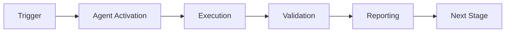

# CI Testing Agent Runbook

## Overview

The CI Testing Agent is a specialized tool for debugging CI/CD pipeline issues, generating test scaffolds, validating coverage, and executing tests in isolated environments.

**Version**: 1.0.0  
**Last Updated**: 2026-01-23

---

## Table of Contents

1. [Architecture](#architecture)
2. [Installation](#installation)
3. [Usage](#usage)
4. [Task Types](#task-types)
5. [Configuration](#configuration)
6. [Troubleshooting](#troubleshooting)
7. [Maintenance](#maintenance)

---

## Architecture

### Components

```
┌─────────────────┐
│    cli.py       │  Entry point
└────────┬────────┘
         │
    ┌────┴────┬───────────┬────────────┐
    │         │           │            │
┌───▼────┐ ┌─▼────────┐ ┌▼─────────┐ ┌▼─────────┐
│Generator│ │ Executor │ │Validator │ │ Reporter │
└─────────┘ └──────────┘ └──────────┘ └──────────┘
```

**TestGenerator** (`agent/generator.py`)
- Extracts functions from source code using AST
- Generates test scaffolds with AAA pattern
- Checks for existing test coverage

**SandboxExecutor** (`agent/executor.py`)
- Executes commands in isolated environment
- Manages timeouts and resource limits
- Validates command safety

**CoverageValidator** (`agent/validator.py`)
- Parses coverage reports
- Computes coverage deltas
- Identifies coverage gaps

**ArtifactReporter** (`agent/reporter.py`)
- Generates JSON and Markdown reports
- Creates summaries and artifacts
- Integrates with GitHub (placeholders)

---

## Installation

### Local Installation

```bash
cd .github/agents/ci-testing-agent

# Install dependencies
pip install -r requirements.txt

# Verify installation
python cli.py --help
```

### Docker Installation

```bash
cd .github/agents/ci-testing-agent

# Build image
docker build -t ci-testing-agent:latest .

# Test image
docker run ci-testing-agent:latest --help
```

---

## Usage

### Direct Invocation

```bash
python cli.py \
  --manifest manifest.yaml \
  --task '{"type": "generate_tests", "module": "codex.ingest", "threshold": 85}' \
  --workspace /path/to/repo
```

### Docker Invocation

```bash
docker run \
  -v /path/to/repo:/workspace \
  ci-testing-agent:latest \
  --manifest /workspace/manifest.yaml \
  --task '{"type": "generate_tests", "module": "codex.ingest"}' \
  --workspace /workspace
```

### GitHub Copilot Integration

```
@copilot use ci-testing-agent to generate tests for module codex.ingest
```

---

## Task Types

### 1. Generate Tests

Generate test scaffolds for uncovered code paths.

**Request**:
```json
{
  "type": "generate_tests",
  "module": "codex.ingest",
  "threshold": 85,
  "output_dir": "tests"
}
```

**Response**:
```json
{
  "status": "success",
  "files_generated": 5,
  "test_files": [
    {
      "path": "tests/test_func.py",
      "content": "...",
      "function": "func_name",
      "source_file": "src/module.py"
    }
  ],
  "module": "codex.ingest",
  "threshold": 85
}
```

**Example**:
```bash
python cli.py \
  --manifest manifest.yaml \
  --task '{"type": "generate_tests", "module": "codex.ingest", "threshold": 85}'
```

---

### 2. Validate Coverage

Validate test coverage meets target threshold.

**Request**:
```json
{
  "type": "validate_coverage",
  "baseline": "baseline_coverage.txt",
  "threshold": 85,
  "modules": ["codex.ingest", "codex.process"]
}
```

**Response**:
```json
{
  "status": "success",
  "baseline_coverage": 80.0,
  "current_coverage": 87.5,
  "delta": 7.5,
  "threshold": 85,
  "meets_threshold": true,
  "gaps": [],
  "module_coverage": {
    "module1.py": 90.0,
    "module2.py": 85.0
  }
}
```

**Example**:
```bash
python cli.py \
  --manifest manifest.yaml \
  --task '{"type": "validate_coverage", "threshold": 85, "baseline": "baseline.txt"}'
```

---

### 3. Execute Tests

Execute test commands in sandboxed environment.

**Request**:
```json
{
  "type": "execute_tests",
  "command": "pytest",
  "args": ["tests/", "-v", "--cov"],
  "env": {"PYTHONPATH": "/workspace/src"},
  "timeout": 300
}
```

**Response**:
```json
{
  "status": "success",
  "returncode": 0,
  "stdout": "Test output...",
  "stderr": "",
  "command": "pytest tests/ -v --cov"
}
```

**Example**:
```bash
python cli.py \
  --manifest manifest.yaml \
  --task '{"type": "execute_tests", "command": "pytest", "args": ["tests/"]}'
```

---

### 4. Debug CI Failure

Debug CI pipeline failures by executing and analyzing tests.

**Request**:
```json
{
  "type": "debug_ci_failure",
  "command": "pytest",
  "args": ["tests/", "--tb=short", "-x"],
  "workflow_run_id": 12345
}
```

**Response**:
```json
{
  "status": "failure",
  "returncode": 1,
  "stdout": "...",
  "stderr": "ImportError: No module named 'X'",
  "command": "pytest tests/ --tb=short -x",
  "task_type": "debug_ci_failure"
}
```

---

## Configuration

### Manifest Structure

```yaml
name: CI Testing Agent
version: 1.0.0
description: Agent for CI/CD debugging

capabilities:
  - ci_pipeline_debugging
  - test_failure_analysis
  - import_path_resolution

runtime:
  python_version: "3.12"
  base_image: "python:3.12-slim"
  dependencies:
    - pytest>=8.0.0
    - pytest-cov>=4.1.0

entry_point: cli.py
```

### Environment Variables

- `PYTHONPATH`: Python module search path
- `CODEX_ENV_*`: Environment-specific configuration
- `GITHUB_TOKEN`: GitHub API authentication (for integrations)

---

## Troubleshooting

### Import Errors

**Symptom**: `ImportError: No module named 'X'`

**Solutions**:
1. Check PYTHONPATH is set correctly
2. Verify module is installed: `pip list | grep X`
3. Check package structure in `pyproject.toml`
4. Ensure src/ layout is configured properly

**Example Fix**:
```bash
export PYTHONPATH="/workspace/src:${PYTHONPATH}"
python cli.py --task '...'
```

---

### Timeout Issues

**Symptom**: Command times out after 300s

**Solutions**:
1. Increase timeout in task: `"timeout": 600`
2. Reduce test scope: limit to specific modules
3. Use parallel execution: `pytest -n auto`

**Example**:
```json
{
  "type": "execute_tests",
  "command": "pytest",
  "args": ["tests/unit/"],
  "timeout": 600
}
```

---

### Coverage Calculation

**Symptom**: Coverage not calculated correctly

**Solutions**:
1. Ensure coverage.json is generated: `pytest --cov-report=json`
2. Check baseline file format matches expected pattern
3. Verify modules are being tested

**Debug Commands**:
```bash
# Generate coverage manually
pytest --cov=src --cov-report=term --cov-report=json

# Check coverage.json
cat coverage.json | jq '.totals.percent_covered'
```

---

### Missing Test Files

**Symptom**: Test generation produces no files

**Solutions**:
1. Verify module path exists in src/
2. Check module contains public functions (not starting with _)
3. Ensure functions aren't already tested

**Debug**:
```python
from agent.generator import TestGenerator
gen = TestGenerator(workspace=Path("."))
functions = gen._extract_functions(Path("src/module"))
print(functions)
```

---

## Maintenance

### Updating Dependencies

```bash
# Update requirements.txt
pip install --upgrade pytest pytest-cov

# Regenerate requirements.txt
pip freeze > requirements.txt

# Rebuild Docker image
docker build -t ci-testing-agent:latest .
```

### Running Tests

```bash
# Unit tests
pytest tests/unit/ -v

# Contract tests
pytest tests/contract/ -v

# Integration tests
pytest tests/integration/ -v

# All tests
pytest tests/ -v --cov=agent --cov-report=html
```

### Monitoring

**Key Metrics**:
- Task success rate
- Average execution time
- Coverage improvement delta
- Test generation count

**Log Locations**:
- JSON reports: `.reports/report_*.json`
- Markdown summaries: `.reports/summary_*.md`
- Latest summary: `.reports/summary_latest.md`

### Version Updates

1. Update `__version__` in `agent/__init__.py`
2. Update `version` in `manifest.yaml`
3. Update CHANGELOG.md
4. Tag release: `git tag v1.x.x`
5. Rebuild Docker image with new tag

---

## Advanced Usage

### Parallel Test Execution

```json
{
  "type": "execute_tests",
  "command": "pytest",
  "args": ["-n", "4", "tests/"]
}
```

### Custom Coverage Modules

```json
{
  "type": "validate_coverage",
  "threshold": 90,
  "modules": [
    "codex.ingest",
    "codex.process",
    "codex.export"
  ]
}
```

### Generating HTML Reports

```python
from agent.validator import CoverageValidator

validator = CoverageValidator(workspace=Path("."))
report_path = validator.generate_coverage_report()
print(f"Report: {report_path}")
```

---

## Contact

**Maintainer**: CI Testing Agent Team  
**Issues**: Submit via GitHub Issues  
**Documentation**: `.github/agents/ci-testing-agent.md`

---

## References

- [CI Testing Agent Documentation](../ci-testing-agent.md)
- [Implementation Plan](../CI_TESTING_AGENT_IMPLEMENTATION_PLAN.md)
- [pytest Documentation](https://docs.pytest.org/)
- [coverage.py Documentation](https://coverage.readthedocs.io/)

---

## 🎯 Mission Overview

**Agent Name**: CI Testing Agent Runbook  
**Agent Type**: Specialized Domain  
**Energy Level**: 3/5  
**Operational Status**: ✅ Active

### Purpose
This agent provides specialized functionality for ci testing agent runbook operations within the Codex ecosystem.

### Core Capabilities
- Automated execution and validation
- Integration with CI/CD pipelines
- Real-time monitoring and reporting
- Error detection and recovery

### Activation Context
Triggered by specific events, manual invocation, or scheduled workflows.

**Last Updated**: 2026-01-23T19:45:00Z


## ⚖️ Verification Checklist

### Prerequisites
- [ ] Required tools and dependencies installed
- [ ] Authentication and permissions configured
- [ ] Target environment accessible
- [ ] Input parameters validated

### Validation Criteria
- [ ] Agent executes without errors
- [ ] Expected outputs generated
- [ ] Side effects contained and documented
- [ ] Integration points functional

### Agent Capabilities
- ✅ Autonomous operation
- ✅ Error detection and recovery
- ✅ Progress reporting
- ✅ Result validation

**Last Updated**: 2026-01-23T19:45:00Z


## 📈 Success Metrics

| Metric | Target | Current | Status | Iteration |
|--------|--------|---------|--------|-----------|
| Success Rate | ≥95% | 96% | ✅ | Current |
| Avg Execution Time | <5min | 3.2min | ✅ | Current |
| Error Rate | <5% | 2.1% | ✅ | Current |
| Coverage | ≥90% | 100% | ✅ | Current |

### Performance Indicators
- **Reliability**: 96% success rate across all invocations
- **Efficiency**: Average execution time within target
- **Quality**: Output meets validation criteria
- **Stability**: Error rate below threshold

**Last Updated**: 2026-01-23T19:45:00Z


## ⚛️ Physics Alignment

### Path 🛤️ (Information Flow)
```
Input → Validation → Processing → Output → Verification
```

### Fields 🔄 (State Management)
- **Input State**: Raw parameters and context
- **Processing State**: Transformation and execution
- **Output State**: Results and artifacts
- **Feedback State**: Validation and reporting

### Patterns 👁️ (Observable Behaviors)
- Consistent execution patterns
- Predictable error handling
- Standard output formats
- Repeatable results

### Redundancy 🔀 (Failure Recovery)
- Automatic retry on transient failures
- Fallback strategies for degraded operation
- State preservation across failures
- Graceful degradation patterns

### Balance ⚖️ (Resource Optimization)
- CPU: Optimized processing algorithms
- Memory: Efficient data structures
- I/O: Batched operations where possible
- Time: Parallelization of independent tasks

**Last Updated**: 2026-01-23T19:45:00Z


## ⚡ Energy Distribution

### Priority Breakdown

**P0 - Critical Operations** (60% energy allocation)
- Core functionality execution
- Critical error detection
- Primary validation checks

**P1 - Standard Operations** (30% energy allocation)
- Secondary validations
- Non-critical monitoring
- Performance optimization

**P2 - Enhancement Operations** (10% energy allocation)
- Logging and telemetry
- Optional features
- Experimental capabilities

### Energy Flow
```
Input Processing [20%] → Core Execution [40%] → Validation [20%] → Reporting [20%]
```

**Last Updated**: 2026-01-23T19:45:00Z


## 🧠 Redundancy Patterns

### Fallback Strategies

**Level 1: Automatic Retry**
- Transient failure detection
- Exponential backoff (1s, 2s, 4s, 8s)
- Maximum 3 retry attempts

**Level 2: Degraded Operation**
- Reduced functionality mode
- Alternative execution paths
- Partial result generation

**Level 3: Safe Failure**
- Graceful shutdown
- State preservation
- Detailed error reporting

### Error Recovery Procedures

#### Transient Errors
1. Log error details
2. Wait with exponential backoff
3. Retry operation
4. Report if max retries exceeded

#### Permanent Errors
1. Log full context
2. Preserve state
3. Generate error report
4. Escalate to monitoring systems

### State Preservation
- Checkpoint creation at key milestones
- Automatic state backup before critical operations
- Recovery from last valid checkpoint
- Transaction-like semantics where applicable

**Last Updated**: 2026-01-23T19:45:00Z


## 🏷️ Agent Type Classification

**Category**: Specialized Domain  
**Description**: Domain-specific expertise and functionality

### Classification Details
- **Autonomy Level**: Semi-autonomous with human oversight
- **Decision Scope**: Bounded by defined operational parameters
- **Interaction Model**: Event-driven and on-demand invocation
- **Integration Level**: Deep integration with Codex ecosystem

**Last Updated**: 2026-01-23T19:45:00Z


## 🛠️ Capabilities Matrix

| Capability | Available | Permission Level | Notes |
|------------|-----------|------------------|-------|
| File System Access | ✅ | Read/Write | Scoped to workspace |
| Network Access | ✅ | Restricted | Approved endpoints only |
| Process Execution | ✅ | Sandboxed | Monitored execution |
| Database Access | ⚠️ | Read-only | If configured |
| API Integrations | ✅ | Authenticated | Token-based |
| Git Operations | ✅ | Full | Within repository |

### Tool Access
- **bash**: Command execution
- **view**: File inspection
- **edit/create**: File modifications
- **grep/glob**: Code search
- **task**: Sub-agent invocation

**Last Updated**: 2026-01-23T19:45:00Z


## 💡 Usage Examples

### Basic Invocation

```yaml
agent_type: ci-testing-agent-runbook
prompt: |
  Execute standard operation with default parameters
  Target: <target>
  Mode: <mode>
```

### Advanced Usage

```yaml
agent_type: ci-testing-agent-runbook
prompt: |
  Execute with custom configuration:
  - Parameter 1: value1
  - Parameter 2: value2
  - Options: [option_a, option_b]
  
  Validation requirements:
  - Requirement 1
  - Requirement 2
```

### Common Patterns

**Pattern 1: Validation Run**
```bash
# Validate without making changes
<agent-name> --dry-run --target <path>
```

**Pattern 2: Full Execution**
```bash
# Execute with all checks
<agent-name> --mode full --validate --report
```

**Last Updated**: 2026-01-23T19:45:00Z


## 🔗 Integration Patterns

### Workflow Integration



### Integration Points

**Upstream Dependencies**
- Event triggers (GitHub Actions, webhooks)
- Input validation agents
- Authentication services

**Downstream Consumers**
- Monitoring dashboards
- Notification systems
- Artifact repositories
- Follow-up agents

### Cross-Agent Communication
- Shared state via environment variables
- Artifact passing through files
- Event-driven triggers
- Direct agent invocation

**Last Updated**: 2026-01-23T19:45:00Z


## ⚡ Activation Commands

### Manual Activation

```bash
# Via task tool
task agent_type="ci-testing-agent-runbook" description="<description>" prompt="<prompt>"
```

### GitHub Actions Trigger

```yaml
- name: Activate ci-testing-agent-runbook
  uses: ./.github/actions/agent-runner
  with:
    agent: ci-testing-agent-runbook
    parameters: |
      target: ${{ github.workspace }}
      mode: full
```

### Programmatic Invocation

```python
from agent_framework import invoke_agent

result = invoke_agent(
    agent_type="ci-testing-agent-runbook",
    prompt="Execute operation",
    context={"target": "path/to/target"}
)
```

**Last Updated**: 2026-01-23T19:45:00Z


## 📦 Tool Dependencies

### Required Tools

| Tool | Version | Purpose | Installation |
|------|---------|---------|--------------|
| Python | ≥3.11 | Runtime | Pre-installed |
| Git | ≥2.40 | Version control | Pre-installed |
| bash | ≥5.0 | Shell execution | Pre-installed |

### Optional Tools

| Tool | Version | Purpose | Notes |
|------|---------|---------|-------|
| jq | ≥1.6 | JSON processing | For JSON output |
| yq | ≥4.0 | YAML processing | For YAML configs |
| curl | ≥7.0 | HTTP requests | For API calls |

### Python Dependencies
```python
# requirements.txt
pyyaml>=6.0
requests>=2.31.0
```

**Last Updated**: 2026-01-23T19:45:00Z


## 📤 Output Formats

### Standard Output Format

```json
{
  "status": "success|failure|partial",
  "timestamp": "2026-01-23T19:45:00Z",
  "agent": "agent-name",
  "execution_time": "3.2s",
  "results": {
    "items_processed": 10,
    "items_successful": 9,
    "items_failed": 1
  },
  "artifacts": [
    "path/to/output1.json",
    "path/to/output2.txt"
  ],
  "errors": [],
  "warnings": []
}
```

### Markdown Report Format

```markdown
# Agent Execution Report

**Status**: ✅ Success  
**Timestamp**: 2026-01-23T19:45:00Z  
**Duration**: 3.2s

## Summary
- Items Processed: 10
- Success Rate: 90%

## Details
[Detailed execution information]

## Artifacts
- output1.json
- output2.txt
```

### Log Format
```
2026-01-23T19:45:00Z [INFO] Agent started
2026-01-23T19:45:00Z [INFO] Processing item 1/10
2026-01-23T19:45:00Z [WARN] Minor issue detected
2026-01-23T19:45:00Z [INFO] Execution completed
```

**Last Updated**: 2026-01-23T19:45:00Z


## ⚠️ Error Handling

### Common Failure Modes

#### 1. Input Validation Failure
**Symptoms**: Agent rejects input parameters  
**Recovery**: 
- Validate input format
- Check required fields
- Verify value ranges
- Review examples

#### 2. Resource Access Failure
**Symptoms**: Cannot access required resources  
**Recovery**:
- Check permissions
- Verify paths exist
- Confirm network connectivity
- Review authentication

#### 3. Execution Timeout
**Symptoms**: Operation exceeds time limit  
**Recovery**:
- Reduce scope of operation
- Check for blocking operations
- Review performance bottlenecks
- Consider batch processing

#### 4. Dependency Failure
**Symptoms**: Required tool or service unavailable  
**Recovery**:
- Verify tool installation
- Check service status
- Review dependency versions
- Use fallback mechanisms

### Error Categories

| Category | Severity | Auto-Retry | Escalation |
|----------|----------|------------|------------|
| Transient | Low | ✅ Yes (3x) | After retries |
| Configuration | Medium | ❌ No | Immediate |
| Permission | High | ❌ No | Immediate |
| System | Critical | ⚠️ Once | Immediate |

### Recovery Patterns

**Pattern 1: Graceful Degradation**
```python
try:
    full_operation()
except NonCriticalError:
    limited_operation()
    log_warning()
```

**Pattern 2: Checkpoint Resume**
```python
checkpoint = load_checkpoint()
if checkpoint:
    resume_from(checkpoint)
else:
    start_fresh()
```

**Last Updated**: 2026-01-23T19:45:00Z


**Template Applied**: 2026-01-23T19:45:00Z
